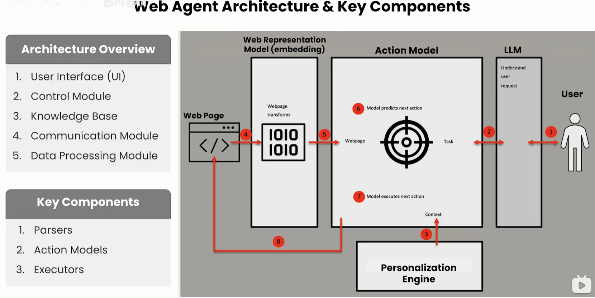
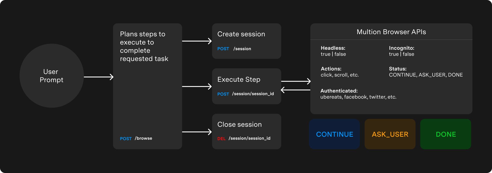

## web agent

### 零. 设计思路

#### 1. 意图识别

> 如何识别用户的意图，即输入一个自然语言作为 prompt ，之后 agent 如何理解并生成回复和调用工具

#### 2. 感知Preception

> 根据当前环境的输入，找到相应的输出，环境的输入包括纯文本格式和图像格式，纯文本格式即html或者dom树，图像就是采用截图的方式

#### 3. 规划planning

> agent 根据当前状态和历史记忆进行思考，找到合理的解决方案

#### 4. 执行action

> 根据计划要求实现点击等，主要有 playwright 可以操作浏览器还有 pyautogui 库进行图形界面的操作，这里主要是工具的操作，即 MCP 或者 function call以及调用软件包

#### 5. 记忆memory

> 如何长期记忆，考虑 RAG 技术，可以看下mem0

#### 6. 评估

> 评估 agent 执行效果

### 一. 基础知识

#### 1. 基础框架



#### 2. agent session



#### 3. 基础示例——爬虫智能体

```python
class WebScraperAgent:
    def __init__(self):
        self.playwright = None
        self.browser = None
        self.page = None

    async def init_browser(self):
      self.playwright = await async_playwright().start()
      self.browser = await self.playwright.chromium.launch(
          headless=True,
          args=[
              "--disable-dev-shm-usage",
              "--no-sandbox",
              "--disable-setuid-sandbox",
              "--disable-accelerated-2d-canvas",
              "--disable-gpu",
              "--no-zygote",
              "--disable-audio-output",
              "--disable-software-rasterizer",
              "--disable-webgl",
              "--disable-web-security",
              "--disable-features=LazyFrameLoading",
              "--disable-features=IsolateOrigins",
              "--disable-background-networking"
          ]
      )
      self.page = await self.browser.new_page()

    async def scrape_content(self, url):
        if not self.page or self.page.is_closed():
            await self.init_browser()
        await self.page.goto(url, wait_until="load")
        await self.page.wait_for_timeout(2000)  # Wait for dynamic content
        return await self.page.content()

    async def take_screenshot(self, path="screenshot.png"):
        await self.page.screenshot(path=path, full_page=True)
        return path
    async def screenshot_buffer(self):
        screenshot_bytes = await self.page.screenshot(type="png", full_page=False)
        return screenshot_bytes

    async def close(self):
        await self.browser.close()
        await self.playwright.stop()
        self.playwright = None
        self.browser = None
        self.page = None
        
        
scraper = WebScraperAgent()

class DeeplearningCourse(BaseModel):
    title: str
    description: str
    presenter: list[str]
    imageUrl: str
    courseURL: str

class DeeplearningCourseList(BaseModel):
    courses: list[DeeplearningCourse]
    

async def process_with_llm(html, instructions, truncate = False):
    completion = client.beta.chat.completions.parse(
        model="gpt-4o-mini-2024-07-18",
        messages=[{
            "role": "system",
            "content": f"""
            You are an expert web scraping agent. Your task is to:
            Extract relevant information from this HTML to JSON 
            following these instructions:
            {instructions}
            
            Extract the title, description, presenter, 
            the image URL and course URL for each of 
            all the courses for the deeplearning.ai website

            Return ONLY valid JSON, no markdown or extra text."""
        }, {
            "role": "user",
            "content": html[:150000]  # Truncate to stay under token limits
        }],
        temperature=0.1,
        response_format=DeeplearningCourseList,
        )
    return completion.choices[0].message.parsed


async def webscraper(target_url, instructions):
    result = None
    try:
        # Scrape content and capture screenshot
        print("Extracting HTML Content \n")
        html_content = await scraper.scrape_content(target_url)

        print("Taking Screenshot \n")
        screenshot = await scraper.screenshot_buffer()
        # Process content

        print("Processing..")
        result: DeeplearningCourseList = await process_with_llm(html_content, instructions, False)
        print("\nGenerated Structured Response")
    except Exception as e:
        print(f"❌ Error: {str(e)}")
    finally:
        await scraper.close()
    return result, screenshot
```

运行示例

```python
target_url = "https://www.deeplearning.ai/courses"  # Deeplearning AI courses
base_url="https://deeplearning.ai"

instructions = """
    Get all the courses
"""
result, screenshot = await webscraper(target_url, instructions)
```


