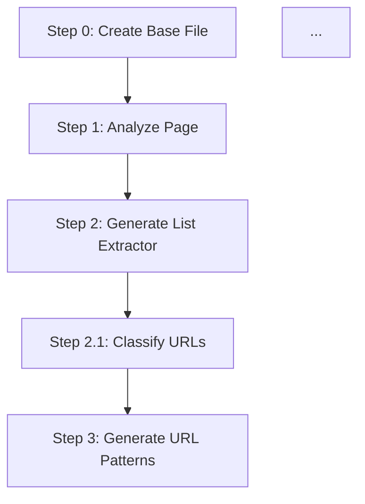

# Webscraper 项目深度技术分析 - 面试准备文档

> **项目定位**: 基于 LangGraph + Claude AI 的爬虫自动开发工具
> **技术难度**: ⭐⭐⭐⭐⭐ (架构设计、AI工程化、工作流编排)
> **代码量**: ~3000+ 行核心代码
> **适用面试**: 高级Python工程师、AI工程师、全栈工程师

---

## 0. 个人总结

因为美国购物网站非常多，有几百个，但是想要开发一个通用的爬虫程序来应对不同的网站较为困难，因为不同的网站可能元素会对应不同的选择器。

所以我们是先对多个网站手动开发，试图寻找它们的共性。我们发现一个网站的爬虫大概是要分成几步，对于手动开发：

* 首先我们需要去打开一个网页，第一个页面一定是主页，我们需要提取它里面的url链接，一般是通过开发者工具确定几个元素，然后根据元素提取url。
* 下一步就是分析这些url，对这些url进行分类，它们可能对应详情页，列表页和其他页面，我们需要对它们进行分类。
* 之后根据分类，对于列表页，我们需要模仿主页提取规则继续提取有效的url链接；
* 对于详情页，我们需要首先获取到 $html$ ，通常需要滚动页面来触发渲染。对于评论或者内容字段有些为动态加载，需要通过ajax技术获取，我们的方法是通过开发者工具得到请求 API，根据 api 去拦截请求得到全部的评论或者详情信息。获取后我们需要通过 $Beautifulsoup$ 对 html 进行格式转换。然后开始对 html 做一轮清理，清理掉网站头尾，然后移除非商品相关元素（包括推荐商品，广告，相关链接等），移除掉所有的 $script$ 代码，因为我们已经通过请求获取了，保留主要内容。之后利用元素标签提取对应的元素将其转换为 markdown 。
* 对于提取到的商品图片，有些图片的文字对我们是有用的，比如化妆品、食品、保健品的配料表信息，我们需要利用 $OCR$ 技术去获取这些信息，我们采用的是对 $Qwen3-8b-VL$ 进行微调。因为我们发现该模型在处理小字的时候经常会出现幻觉，且输出内容质量较低，输出格式需要处理转换，因此我们对其进行微调，我们采集一些网站的图片主要是配料表信息，然后根据人工标注形成一套数据集，然后利用这个对模型进行微调，使其提高输出准确率，并能够知道我们需要的主要信息，之后模型的输出准确率都有了一定的提高。
* 然后将图片解析的OCR信息和之前爬虫获取的markdown拼接起来，送入 $gemini$ 进行分析，根据设计的产品模型表信息，做具体的转换，这里主要是根据产品模型编写提示词，让大模型能够知道哪些需要转换以及怎么转换。其中这里有一步中间步骤，就是我们需要根据清洗后的markdown来确定具体的产品分类，它是属于食品还是衣物还是保健品等等，因为不同类别对应的产品模型不同。**TODO** 

我们可以看出步骤上基本是一致的，可以考虑使用 $code \ agent$ 做开发，我们先用 $jinja2$ 给出一个大致的模版，即包括一个提取器类用来提取， 对于 $ai$ 辅助开发，有几个要点需要思考分析：

* 我们打开网页并对网页进行分析，这个如何让 $agent$ 来操作？我们的思路是利用谷歌开发者 $mcp$ 工具即 $chrome\_devtools\_mcp$ 去分析页面，因为它可以快速查找指定元素的 $html$ 元素，对页面进行截图比对分析。同时要确认是否会遭遇反爬，如果遭遇反爬则启用 $brightdata$ 提取 $html$，即要确认引擎是只使用 $playwright$ 还是要结合使用 $brightdata$ 。还需要确定页面的渲染方式，是否有很多 $js$ 代码
* 下面是生成列表提示器，我们提供一个基本的模版，然后给 $claude \ code$ 一些 $mcp$ 或者 $skills$，让它能够生成对应的列表提取器，我们给的提示词是用 `chrome_devtools` 分析页面，然后代码中使用 `playwright` ，去网页注入一个 `js` 脚本去提取所有的链接，然后将 url 存入 state 里面的 `site_tree` 字段。
* 我们需要对提取到的 `url` 进行进一步的分类，我们需要把它们分为列表页、详情页、不确定页、其他页面（通过设计提示词告诉每种页面的一些规则，分类这里我们使用更便宜的 gemini 提供的 mcp 去处理）。然后我们对每一个分类的 `url` 通过正则表达式设计一些匹配规则，即识别出一些 `pattern` 模式，并且利用我们自定义的工具去检查这些模式是否正确（即检查有没有url和其匹配），我们将识别出的 `pattern` 放入 state 中的 `site_pattern` 字段，然后写入到代码里面，按照上面四个分类把它们分成不同的 `patterns` 。这一步可能需要多轮，第一轮结束后要检查有没有 `url` 没有被匹配到，然后重新匹配这些 url。 对于不确定的页面我们通过设计提示词增加一轮来进一步分析其属于的范围。然后更新 `site_tree` 字段。这里我们也设计了工具，去随机抽取一些 url 检查 url 分类是否准确，判断方法是用谷歌开发者工具去打开网页然后判断
* 之后我们从每个 patterns 里面找一些 `sample_url` ，然后根据分类进入不同的详情页提取和列表页提取分析。对于详情页，我们也是先用 `chrome-devtools` 对样例页进行分析，首先通过谷歌开发者工具将其滑动到底部然后等待看是否会有反爬，如果有反爬我们使用 brigthdata先获取页面，然后用谷歌开发者工具读取这个临时的 html 文件，然后我们需要对页面滚动然后进行截图，截图需要我们自定义的工具进行压缩。截图的目的是让 ai 比较通过 html 分析得到的结果和截图进行比较分析，并给出一些问题让 ai 进行分析（页面的布局，头栏底栏在哪，有无公告；内容定位，主商品图片，商品介绍，是否通过js等）。分析完成后输出到注释里面，然后根据注释去制作一个详情页提取类，包括多个步骤，即获取 html，清理并转换，然后如果有的是通过 `ajax` 去服务器读取的，我们可以通过发送 `get_ajax_comment` 来根据 api 请求获取到想要的信息。
* 然后就是我们需要增加树的深度，即需要不断扩展 url，因为我们提取到的列表页可能包含其他列表页，所以需要不断扩展，这里就是重复执行上述的步骤。执行完后我们让模型对所有方法进行检查，检查一下几个关键地方是否生成。然后让模型测试，得到时长，即记录一下需要多久才能执行完这方法，然后通过这个去对耗时长的方法去优化。
* 同时为了保证代码的质量，我们在每一步后都会加入一个 `review nodes` 这个是另一个 `subagent` ，会去检查每一步生成是否满足要求，这个主要是我们进行一些正则表达式检查（需要生成的方法或者类或者属性是否存在），然后去执行代码对返回结果进行分析，是否有报错，是否有返回结果等。在前期我们会加入 `human-in-loop` 去检查一些中间文件，比如列表页提取到的列表文件，详情页的html文件等，后面待提示词修复完善，测试命令完善后我们删除了这一部分，最大可能的保证系统全部自动化运行。同时我们接入了 `slack boot` ，当开发出现问题时能够自动向我们的工作区发布警告，然后人来审核修复。

这里我们用的就是 $LangGraph$ 进行工作流的设计，然后用其中的 `checkpoint` 机制去保存每一步的信息，然后用 `git` 去实现自动提交代码，这样我们就可以实现从某一步恢复重做等方法。我们利用的 `code agent` 就是 `claude code` ，因为它具有 `mcp` 、`skills` 以及记忆等能力，同时我们用全局的 client 防止重复创建，然后我们通过 hook 事件批准一些工具的使用，用session_id保持一轮会话的一致性，然后具体的使用方法可以详见大模型开发中的 `claude code` 。

## 1. 项目概述

### 1.1 项目定位

**DevBot** 是一个基于 LangGraph + Claude Agent SDK 的 AI 辅助爬虫开发系统，能够自动化生成和优化网站爬虫代码。

**核心价值**:

- **自动化开发**: 从 URL 到可运行爬虫代码的全流程自动化
- **智能决策**: 通过 LLM 分析页面结构、选择合适的爬虫引擎和参数
- **质量保证**: Developer + Reviewer 双重节点，确保代码质量
- **持续优化**: 支持断点恢复、步骤重试、代码优化等高级功能

### 1.2 技术架构

```
┌─────────────────────────────────────────────────────────────┐
│                      DevBot 系统架构                          │
├─────────────────────────────────────────────────────────────┤
│  ┌─────────────┐  ┌──────────────┐  ┌──────────────┐       │
│  │  LangGraph  │  │ Claude Agent │  │  MCP Tools   │       │
│  │  StateGraph │──│  SDK Client  │──│ chrome-devto │       │
│  │  Workflow   │  │  (Session)   │  │ gemini-cli   │       │
│  └─────────────┘  └──────────────┘  └──────────────┘       │
│         │                 │                   │              │
│         └─────────────────┴───────────────────┘              │
│                           │                                  │
│         ┌─────────────────┴──────────────────┐              │
│         │                                     │              │
│  ┌──────▼────────┐                  ┌────────▼────────┐    │
│  │  Developer    │                  │    Reviewer     │    │
│  │  Nodes (23)   │◄────────────────►│   Nodes (6)     │    │
│  │  Step 0-31    │   Validate       │   review_step   │    │
│  └───────────────┘                  └─────────────────┘    │
│         │                                     │              │
│         └─────────────────┬───────────────────┘              │
│                           │                                  │
│                  ┌────────▼──────────┐                       │
│                  │  CrawlerDevState  │                       │
│                  │   TypedDict (27+) │                       │
│                  │  - url, site_name │                       │
│                  │  - current_step   │                       │
│                  │  - status, retry  │                       │
│                  │  - patterns_queue │                       │
│                  └───────────────────┘                       │
│                           │                                  │
│         ┌─────────────────┴──────────────────┐              │
│         │                                     │              │
│  ┌──────▼────────┐                  ┌────────▼────────┐    │
│  │  SQLite Store │                  │   JSON State    │    │
│  │  Conversation │                  │   Checkpoint    │    │
│  │  History      │                  │   MemorySaver   │    │
│  └───────────────┘                  └─────────────────┘    │
└─────────────────────────────────────────────────────────────┘
```

### 1.3 核心流程概览

```
用户输入 URL
    ↓
Step 0: 创建基础文件框架 (Jinja2模板)
    ↓
Step 1: 分析页面结构 (Chrome DevTools + LLM)
    ↓ → Reviewer: 验证引擎配置
    ↓
Step 2: 生成列表提取器 (提取商品/优惠列表)
    ↓ → Reviewer: 验证返回格式
    ↓
Step 2.1: URL 分类 (detail/list/other/unclear)
    ↓ → Reviewer: 验证 site_patterns
    ↓
Step 3: 生成 URL patterns (正则表达式匹配)
    ↓ → Reviewer: 验证 URL_MAP
    ↓
Step 4-6: 循环生成各 pattern 的提取器 (detail/list)
    ↓ → Reviewer: 验证核心提取器
    ↓
Step 7: 网站树扩展 (BFS遍历子页面)
    ↓ → Reviewer: 验证扩展功能
    ↓
Step 8: Markdown 信息分析 (占位步骤)
    ↓ → Reviewer: 验证状态
    ↓
Step 9: 首次运行测试
    ↓
Step 10: 生成 Airflow DAG
    ↓
Step 20-22: 代码检查与优化 (性能、方法签名、数据完整性)
    ↓
输出: 可运行的爬虫代码
```

---

## 2. State 状态管理深度解析

### 2.1 为什么选择 TypedDict？

**TypedDict** 是 Python 3.8+ 引入的类型提示工具，用于定义字典的结构。

**优势**:

1. **类型安全**: IDE 自动补全、静态类型检查
2. **文档作用**: 字段定义即文档，清晰明了
3. **无运行时开销**: 仅用于类型提示，不影响性能
4. **LangGraph 兼容**: LangGraph 原生支持 TypedDict 作为状态类型

**示例对比**:

```python
# ❌ 普通字典：无类型提示，易出错
state = {"url": "https://example.com", "step": 1}
print(state["urll"])  # 拼写错误，运行时才报错

# ✅ TypedDict：IDE 自动检查
class State(TypedDict):
    url: str
    step: int

state: State = {"url": "https://example.com", "step": 1}
print(state["urll"])  # IDE 立即标红提示错误
```

### 2.2 CrawlerDevState 完整字段解析

DevBot 的状态定义在 `devbot/state/crawler_state.py:8-56`，共 **27+ 个字段**，分为 7 大类：

#### 2.2.1 爬虫基本信息 (4 字段)

```python
class CrawlerDevState(TypedDict):
    # ============= 爬虫基本信息 =============
    url: str                             # 目标网站 URL
    site_name: str                       # 网站名称 (从 URL 提取)
    proxy: Optional[str]                 # 代理服务器地址
    category: str                        # 爬虫分类 (product/shopping/deal等)
```

**字段详解**:

| 字段        | 类型            | 说明                     | 示例                        | 使用场景               |
| ----------- | --------------- | ------------------------ | --------------------------- | ---------------------- |
| `url`       | `str`           | 目标网站入口 URL         | `https://www.gnc.com`       | 所有步骤，用于访问网站 |
| `site_name` | `str`           | 网站标识符（从域名提取） | `gnc`                       | 文件命名、模块导入     |
| `proxy`     | `Optional[str]` | 代理地址（反爬时使用）   | `http://proxy:8080`         | Step 1 页面访问        |
| `category`  | `str`           | 爬虫类别                 | `product`/`shopping`/`deal` | 决定输出目录结构       |

**提取 site_name 的逻辑**:

```python
# crawler_devbot.py:155-158
from urllib.parse import urlparse
domain = urlparse(url).netloc
site_name = domain.split('.')[-2]  # www.gnc.com → gnc
```

**潜在问题**:

- **子域名混淆**: `shop.example.com` → `example`（正确）
- **多级域名**: `example.co.uk` → `co`（错误）
  - **解决**: 手动指定 `site_name` 参数

#### 2.2.2 当前步骤信息 (3 字段)

```python
# ============= 当前步骤信息 =============
current_step: str                    # 当前步骤编号 ("0", "1", "2", ...)
current_step_name: str               # 当前步骤名称 (如 "create_base_file")
current_depth: int                   # 当前深度（用于嵌套步骤）
```

**字段详解**:

| 字段                | 类型  | 说明                           | 示例                               | 更新时机                |
| ------------------- | ----- | ------------------------------ | ---------------------------------- | ----------------------- |
| `current_step`      | `str` | 步骤编号（字符串，支持子步骤） | `"0"`, `"2.1"`, `"5.3"`            | 每个 Developer 节点结束 |
| `current_step_name` | `str` | 步骤语义名称                   | `create_base_file`, `analyze_page` | 每个 Developer 节点结束 |
| `current_depth`     | `int` | 递归深度（Step 7 专用）        | `0`, `1`, `2`                      | Step 7 网站树扩展       |

**步骤编号规则**:

- **主步骤**: `"0"`, `"1"`, `"2"`, ... , `"10"`
- **子步骤**: `"2.1"`, `"5.1"`, `"5.2"`, ... , `"5.6"`
- **特殊步骤**: `"20"`, `"21"`, `"22"` (代码检查与优化)

**示例**:

```python
# Step 2 完成后
state = {
    "current_step": "2",
    "current_step_name": "generate_list_extractor",
    ...
}

# Step 2.1 完成后
state = {
    "current_step": "2.1",
    "current_step_name": "classify_urls",
    ...
}
```

#### 2.2.3 步骤状态 (2 字段)

```python
# ============= 步骤状态 =============
status: Literal["pending", "in_progress", "completed", "reviewed", "failed"]
retry_count: int                     # 重试次数计数器
```

**字段详解**:

| 字段          | 类型      | 说明             | 可选值                                                      | 状态转换                         |
| ------------- | --------- | ---------------- | ----------------------------------------------------------- | -------------------------------- |
| `status`      | `Literal` | 当前步骤状态     | `pending`, `in_progress`, `completed`, `reviewed`, `failed` | Developer → Reviewer → Next Step |
| `retry_count` | `int`     | 当前步骤重试次数 | `0`, `1`, `2`, ...                                          | 验证失败时 +1                    |

**状态机转换**:

```
pending
   │
   ↓ (Developer 开始)
in_progress
   │
   ├─→ completed (Developer 成功) ────→ reviewed (Reviewer 通过) ──→ Next Step
   │                                         ↓ (Reviewer 失败)
   └─→ failed ──────────────────────────────→ pending (retry_count++)
```

**重试逻辑**:

```python
# routing_logic.py:120-130 (简化版)
def should_retry(state: CrawlerDevState) -> bool:
    max_retries = 3
    if state["status"] == "failed" and state["retry_count"] < max_retries:
        return True
    elif state["retry_count"] >= max_retries:
        raise Exception(f"Step {state['current_step']} 失败次数过多")
    return False
```

**潜在问题**:

- **无限重试**: 如果 Reviewer 逻辑有误，可能导致死循环
  - **解决**: `max_retries = 3` 硬编码限制
- **状态不一致**: 如果 Developer 抛异常但未更新状态
  - **解决**: LangGraph 的异常处理机制会捕获并标记为 `failed`

#### 2.2.4 步骤结果 (3 字段)

```python
# ============= 步骤结果 =============
result: Optional[str]                # 当前步骤的 LLM 响应文本
validation_result: Optional[Dict[str, Any]]  # Reviewer 的验证结果
error: Optional[str]                 # 错误信息
```

**字段详解**:

| 字段                | 类型             | 说明              | 示例                                  | 使用场景           |
| ------------------- | ---------------- | ----------------- | ------------------------------------- | ------------------ |
| `result`            | `Optional[str]`  | LLM 的完整响应    | `"已完成页面分析..."`                 | Developer 节点输出 |
| `validation_result` | `Optional[Dict]` | Reviewer 验证结果 | `{"valid": True, "message": "..."}`   | Reviewer 节点输出  |
| `error`             | `Optional[str]`  | 错误详情          | `"导入模块失败: ModuleNotFoundError"` | 异常处理           |

**示例**:

```python
# Step 1 Developer 完成后
state["result"] = """
已完成页面分析:
- 页面复杂度: medium
- 推荐引擎: browser_pool
- 并发配置: pool_size=3, tab_size=5
"""

# Step 1 Reviewer 完成后
state["validation_result"] = {
    "step": "step1",
    "success": True,
    "message": "页面分析完成,代码可正常执行"
}

# 如果失败
state["error"] = "ImportError: No module named 'crawler.product.extractor_gnc'"
state["status"] = "failed"
```

#### 2.2.5 URL 模式处理 (6 字段)

这是 Step 4-6 循环处理 URL patterns 的核心字段。

```python
# ============= URL 模式处理 (Step 4-7 专用) =============
current_url_pattern: Optional[str]   # 当前正在处理的 URL pattern
current_sample_url: Optional[str]    # 当前 URL pattern 的样例 URL
current_sample_url_md5: str          # 样例 URL 的 MD5 (用于缓存文件名)
completed_patterns: List[str]        # 已完成的 URL patterns 列表

# LangGraph 循环控制
patterns_queue: List[Dict[str, Any]]  # 待处理的 patterns 队列
current_pattern_info: Optional[Dict[str, Any]]  # 当前 pattern 信息
```

**字段详解**:

| 字段                     | 类型             | 说明                        | 示例                                                         | 何时使用            |
| ------------------------ | ---------------- | --------------------------- | ------------------------------------------------------------ | ------------------- |
| `current_url_pattern`    | `Optional[str]`  | 当前处理的正则表达式        | `r'https://www\.gnc\.com/[\w-]+/\d+\.html'`                  | Step 4.1, 5.x       |
| `current_sample_url`     | `Optional[str]`  | 用于测试 pattern 的真实 URL | `https://www.gnc.com/vitamins/123.html`                      | Step 5.x (访问页面) |
| `current_sample_url_md5` | `str`            | MD5 哈希值                  | `a1b2c3d4...`                                                | 临时文件命名        |
| `completed_patterns`     | `List[str]`      | 已处理完的 patterns         | `["pattern1", "pattern2"]`                                   | 判断是否继续循环    |
| `patterns_queue`         | `List[Dict]`     | 待处理队列                  | `[{"pattern": "...", "type": "detail", "sample_url": "..."}]` | Step 4-6 循环       |
| `current_pattern_info`   | `Optional[Dict]` | 当前 pattern 的完整信息     | `{"pattern": "...", "type": "detail", ...}`                  | Step 5.x 各子步骤   |

**工作流程示例**:

```python
# Step 4: 初始化队列
state["patterns_queue"] = [
    {"pattern": "r'https://www\.gnc\.com/[\w-]+/\d+\.html'", "type": "detail", "sample_url": "https://www.gnc.com/vitamins/123.html"},
    {"pattern": "r'https://www\.gnc\.com/category/[\w-]+'", "type": "list", "sample_url": "https://www.gnc.com/category/vitamins"}
]
state["completed_patterns"] = []

# Step 4.1: 取出第一个 pattern
state["current_pattern_info"] = state["patterns_queue"].pop(0)
state["current_url_pattern"] = state["current_pattern_info"]["pattern"]
state["current_sample_url"] = state["current_pattern_info"]["sample_url"]
state["current_sample_url_md5"] = hashlib.md5(state["current_sample_url"].encode()).hexdigest()

# Step 5.1-5.6: 处理当前 pattern (生成提取器的各个方法)
# ...

# Step 6: 将 pattern 标记为完成
state["completed_patterns"].append(state["current_url_pattern"])

# 路由判断: 如果队列非空，返回 Step 4.1 (继续处理下一个 pattern)
if state["patterns_queue"]:
    return "step4_1__next_pattern"
else:
    return "step7__site_tree_expand"
```

**潜在问题**:

- **队列为空但未处理**: 如果 URL patterns 为空，会跳过 Step 5-6
  - **解决**: Step 3 Reviewer 验证 `url_detail_patterns` 非空
- **MD5 冲突**: 理论上可能（概率极低）
  - **解决**: 实际中未遇到，暂不处理

#### 2.2.6 缓存数据 (1 字段)

```python
# ============= 缓存数据 =============
cache_data: Dict[str, Any]           # 缓存数据 (urls 等)
```

**用途**: 存储 `extract_deals_from_mainpage` 返回的 URLs 列表，避免重复执行。

**示例**:

```python
# Step 2 完成后
state["cache_data"] = {
    "site_tree": [
        {"title": "Product 1", "url": "https://...", "type": "detail"},
        {"title": "Category", "url": "https://...", "type": "list"},
        ...
    ]
}
```

#### 2.2.7 控制字段 (8 字段)

```python
# ============= Step 5 控制 =============
last_file_id: Optional[str]         # 当前保存文件的id标识

# ============= Step 7 循环控制 =============
has_new_patterns_in_step7: bool      # Step 7 是否检测到新 patterns
step7_loop_count: int                # Step 7 循环计数器

# ============= 输出路径 =============
base_file_path: str                  # 生成的爬虫文件路径 (extractor_xxx.py)

# ============= Session 管理 =============
session_id: Optional[str]            # Claude SDK session_id

# ============= 流程控制 =============
next_action: Optional[str]           # 下一步动作
regenerate_step: Optional[str]       # 需要重新生成的步骤
regenerate_from: Optional[str]       # step22__fix_code 修复后跳回的步骤
```

**字段详解**:

| 字段                        | 类型            | 说明                       | 示例                        | 何时使用                |
| --------------------------- | --------------- | -------------------------- | --------------------------- | ----------------------- |
| `last_file_id`              | `Optional[str]` | 当前文件标识               | `"detail_page_v2"`          | Step 5.x 多文件管理     |
| `has_new_patterns_in_step7` | `bool`          | Step 7 是否发现新 patterns | `True`/`False`              | Step 7 决定是否继续扩展 |
| `step7_loop_count`          | `int`           | Step 7 循环次数            | `0`, `1`, `2`               | 防止无限循环 (max=3)    |
| `base_file_path`            | `str`           | 爬虫代码文件路径           | `/path/to/extractor_gnc.py` | 所有代码生成步骤        |
| `session_id`                | `Optional[str]` | Claude 会话 ID             | `"session_abc123"`          | 保持对话上下文          |
| `next_action`               | `Optional[str]` | 下一步动作                 | `"continue"`, `"retry"`     | 用户交互                |
| `regenerate_step`           | `Optional[str]` | 需重做的步骤               | `"step5"`                   | 用户手动触发            |
| `regenerate_from`           | `Optional[str]` | 修复后的返回点             | `"step9"`                   | Step 22 修复代码后跳转  |

**Step 7 循环控制示例**:

```python
# Step 7 第一次执行
state["step7_loop_count"] = 0
state["has_new_patterns_in_step7"] = False

# 如果发现新 patterns
if new_patterns_found:
    state["has_new_patterns_in_step7"] = True
    state["step7_loop_count"] += 1

    # 路由判断
    if state["step7_loop_count"] < 3:
        return "step3__generate_url_patterns"  # 重新生成 patterns
    else:
        logger.warning("Step 7 循环次数达到上限,停止扩展")
        return "step8__analyze_markdown_info"
```

### 2.3 State 的生命周期

```
1. 初始化 (crawler_devbot.py:155-180)
   ├─ 从命令行参数提取: url, site_name, category
   ├─ 设置默认值: status="pending", retry_count=0
   └─ 计算路径: base_file_path

2. Developer 节点更新 (developer_nodes.py:各步骤)
   ├─ 更新 current_step, current_step_name
   ├─ 更新 status="completed"
   ├─ 保存 result (LLM 响应)
   └─ 返回更新后的 state

3. Reviewer 节点验证 (reviewer_nodes.py)
   ├─ 读取 current_step 决定验证逻辑
   ├─ 执行验证 (导入模块、调用函数等)
   ├─ 更新 status="reviewed" 或 "failed"
   ├─ 保存 validation_result 或 error
   └─ 更新 retry_count (失败时 +1)

4. 路由决策 (routing_logic.py)
   ├─ 读取 status, current_step, retry_count
   ├─ 判断下一步: next_developer, retry, end
   └─ 返回节点名称

5. 持久化 (MemorySaver + JSON)
   ├─ LangGraph MemorySaver: 自动保存到 local_state_<site>.json
   └─ ConversationStore: 对话历史存入 SQLite
```

---

## 3. Tool 工具系统深度解析

### 3.1 工具分类

DevBot 使用的工具分为三大类：

```
Tools
├── MCP 工具 (Model Context Protocol)
│   ├── chrome-devtools (网页操作)
│   ├── gemini-cli (LLM 调用)
│   ├── playwright (备用浏览器工具)
│   ├── mongodb (数据库)
│   ├── notion (笔记)
│   └── git (版本控制)
│
├── Claude SDK 内置工具
│   ├── Read (读取文件)
│   ├── Write (写入文件)
│   ├── Edit (编辑文件)
│   ├── Bash (执行命令)
│   ├── Glob (查找文件)
│   └── Grep (搜索内容)
│
└── 自定义 Python 工具 (devbot/tool.py)
    ├── compress_image (图片压缩)
    ├── save_tmp_page_by_brightdata (BrightData 获取页面)
    ├── classify_urls (URL 分类)
    └── check_url_patterns (检查 URL patterns)
```

### 3.2 MCP (Model Context Protocol) 详解

**MCP** 是 Anthropic 提出的一种工具协议，允许 LLM 通过标准化接口调用外部工具。

#### 3.2.1 chrome-devtools MCP

**作用**: 控制 Chrome 浏览器进行网页操作。

**核心功能**:

| 函数                    | 说明               | 参数                                              | 返回值    | 使用场景        |
| ----------------------- | ------------------ | ------------------------------------------------- | --------- | --------------- |
| `new_page`              | 打开新页面         | `url: str`                                        | 页面索引  | Step 1 打开网站 |
| `navigate_page`         | 导航到 URL         | `url: str, type: "url"/"back"/"forward"/"reload"` | 无        | 页面跳转        |
| `take_screenshot`       | 截图               | `fullPage: bool, format: str, filePath: str`      | 图片路径  | Step 1 页面截图 |
| `take_snapshot`         | 页面快照 (a11y 树) | `filePath: str`                                   | 快照文本  | 获取页面结构    |
| `click`                 | 点击元素           | `uid: str`                                        | 无        | 交互操作        |
| `fill`                  | 填写表单           | `uid: str, value: str`                            | 无        | 填写输入框      |
| `evaluate_script`       | 执行 JS            | `function: str, args: List`                       | JS 返回值 | 提取数据        |
| `list_network_requests` | 网络请求列表       | `pageIdx: int`                                    | 请求数组  | 分析 AJAX       |

**示例**:

```python
# Step 1 prompt 中的使用
```

用 chrome-devtools 打开网站: {{ url }}

1. 使用 new_page 打开
2. 使用 take_screenshot 截长图 (fullPage=true, format="jpeg")
3. 使用 list_network_requests 查看 AJAX 请求

**潜在问题**:

- **截图过大**: 某些网站截图超过 8000px，Claude API 拒绝
  - **解决**: Step 1 prompt 中要求使用 `compress_image` 工具
- **反爬阻止**: chrome-devtools 直接访问被 Cloudflare 拦截
  - **解决**: 先用 `save_tmp_page_by_brightdata` 获取 HTML，再通过 `file://` 访问

#### 3.2.2 gemini-cli MCP

**作用**: 调用 Google Gemini API（备用 LLM）。

**使用场景**: 当需要大批量并发调用时，Gemini 成本更低。

### 3.3 Claude SDK 内置工具

Claude Agent SDK 提供了一套文件和系统操作工具。

#### 3.3.1 文件操作工具

| 工具     | 说明     | 参数                                               | 使用场景           |
| -------- | -------- | -------------------------------------------------- | ------------------ |
| `Read`   | 读取文件 | `file_path: str`                                   | 查看代码、配置文件 |
| `Write`  | 写入文件 | `file_path: str, content: str`                     | 创建新文件         |
| `Edit`   | 编辑文件 | `file_path: str, old_string: str, new_string: str` | 修改代码           |
| `Move`   | 移动文件 | `source: str, destination: str`                    | 重命名/移动        |
| `Delete` | 删除文件 | `file_path: str`                                   | 清理临时文件       |

**自动批准机制**:

DevBot 中所有这些工具都配置了自动批准 hook，无需手动确认。

```python
# claude_agent_base.py:116-137
COMMANDS = [
    "Read", "Write", "Edit", "TodoWrite", "Move", "Delete",
    "ListDir", "MakeDir", "Grep", "Glob", "Search",
    "GetDefinition", "GetReferences", "Bash",
]

# 为每个工具配置 auto_approve hook
hooks = {
    "PreToolUse": [
        HookMatcher(matcher="Bash", hooks=[auto_approve]),
        HookMatcher(matcher="Read", hooks=[auto_approve]),
        HookMatcher(matcher="Edit", hooks=[auto_approve]),
        # ... 其他工具
    ]
}
```

#### 3.3.2 Bash 工具

**特殊性**: Bash 工具可以执行任意 shell 命令，需要谨慎使用。

**自动批准策略**:

```python
# claude_agent_base.py:53-77
async def auto_approve(input_data, tool_use_id, context):
    """自动批准 Bash/Edit/Read 等基础工具"""
    tool_name = input_data.get('tool_name', 'unknown')
    tool_input = input_data.get('tool_input', {})

    if tool_name == 'Bash':
        logger.debug(f"🔧 Hook 被触发: {tool_name}，目标: {tool_input.pop('description', '')}")
        logger.debug(f"📋 命令: {tool_input.get('command')}")

    return {
        "hookSpecificOutput": {
            "hookEventName": "PreToolUse",
            "permissionDecision": "allow",  # 自动批准
        }
    }
```

**安全考虑**:

- DevBot 运行在受控环境（本地开发机器）
- 仅用于测试爬虫代码，不涉及敏感操作
- 所有命令都有日志记录

### 3.4 自定义 Python 工具 (devbot/tool.py)

#### 3.4.1 compress_image (图片压缩工具)

**作用**: 压缩图片到 Claude API 可接受的大小和尺寸。

**Claude API 限制**:

- **文件大小**: 5 MB (base64 编码后)
- **像素尺寸**: 单边不超过 8000px

**实现原理**:

```python
# tool.py:compress_image 伪代码
async def compress_image(file_path: str, output_path: str = None):
    img = Image.open(file_path)
    width, height = img.size

    # 检查是否超过限制
    if max(width, height) > 8000:
        # 切分图片
        num_slices = math.ceil(height / 8000)
        slices = []
        for i in range(num_slices):
            slice_img = img.crop((0, i*8000, width, min((i+1)*8000, height)))
            slice_path = output_path.replace('.webp', f'_{i}.webp')
            slice_img.save(slice_path, format='WEBP', quality=85)
            slices.append(slice_path)
        return slices

    # 检查文件大小
    if os.path.getsize(file_path) > 2 * 1024 * 1024:  # 2 MB
        # 压缩为 WebP
        img.save(output_path, format='WEBP', quality=85, optimize=True)

    return [output_path]
```

**使用场景**:

```python
# Step 1 prompt 中要求
# 如果图片超过了 2 MB 或单边像素超过了8000，执行以下命令压缩图片:
python -m devbot.tool compress_image {{ output_part_dir }}/mainpage_long_screenshot.jpg {{ output_part_dir }}/mainpage_long_screenshot.webp
```

**潜在问题**:

- **DecompressionBombError**: 图片过大（超过 1 亿像素）
  - **解决**: Step 1 prompt 要求重试流程（关闭页面 → 等待 → 重新截图，最多 5 次）

#### 3.4.2 save_tmp_page_by_brightdata (反爬处理)

**作用**: 使用 BrightData 代理获取页面 HTML，绕过反爬限制。

**实现**:

```python
# tool.py:save_tmp_page_by_brightdata
async def save_tmp_page_by_brightdata(url: str) -> str:
    """
    使用 BrightData 获取页面 HTML 并保存到临时文件

    Returns:
        str: 临时 HTML 文件路径
    """
    bd_client = BDClient()
    html = await bd_client.get_page_html(url)

    tmp_file = f"/tmp/scraper/brightdata_{hashlib.md5(url.encode()).hexdigest()}.html"
    with open(tmp_file, 'w', encoding='utf-8') as f:
        f.write(html)

    logger.info(f"✅ BrightData 页面已保存: {tmp_file}")
    return tmp_file
```

**使用场景**:

```python
# Step 1 prompt 中的反爬处理
# 如果反爬导致 chrome-devtools 无法直接访问页面，则先使用 brightdata 保存临时页面，
# 再用 chrome-devtools 通过文件地址访问这个临时页面。
python -m devbot.tool save_tmp_page_by_brightdata <url>
```

#### 3.4.3 classify_urls / check_url_patterns

**作用**: 辅助 LLM 进行 URL 分类和 pattern 验证。

**实现**:

```python
# tool.py:classify_urls
async def classify_urls(category: str, site_name: str):
    """
    读取 site_tree.json，用 LLM 分类所有 URLs

    Returns:
        dict: {'detail': [...], 'list': [...], 'other': [...]}
    """
    site_tree_file = f"crawler/{category}/output/{site_name}/site_tree.json"
    with open(site_tree_file, 'r') as f:
        data = json.load(f)

    urls = data['site_tree']

    # 调用 Gemini API (成本更低)
    result = await call_gemini_classify(urls)
    return result
```

---

## 4. Claude Agent SDK 集成详解

### 4.1 ClaudeSDKClient 架构

**ClaudeSDKClient** 是 Anthropic 官方提供的 Python SDK，用于与 Claude API 交互。

#### 4.1.1 全局客户端管理器

DevBot 使用全局字典管理多个 subagent 的客户端：

```python
# claude_agent_base.py:49-50
_global_clients = {}  # {subagent_name: ClaudeSDKClient}
```

**优势**:

- **Session 复用**: 同一 subagent 的多次调用共享上下文
- **资源优化**: 避免重复创建客户端

#### 4.1.2 get_or_create_client 函数

**作用**: 获取或创建 subagent 的客户端。

**实现** (简化版):

```python
# claude_agent_base.py (伪代码)
async def get_or_create_client(subagent_name: str, model_name: str = None):
    """获取或创建 subagent 客户端"""

    # 检查缓存
    if subagent_name in _global_clients:
        logger.debug(f"♻️ 复用已有客户端: {subagent_name}")
        return _global_clients[subagent_name]

    # 读取 agent 定义文件
    agent_file = PROJ_PATH / '.claude' / 'agents' / f'{subagent_name}.md'

    if not agent_file.exists():
        raise FileNotFoundError(f"Agent 定义文件不存在: {agent_file}")

    # 解析 frontmatter
    with open(agent_file, 'r') as f:
        content = f.read()

    # 提取 YAML frontmatter
    match = re.match(r'^---\n(.*?)\n---\n(.*)', content, re.DOTALL)
    frontmatter_yaml = match.group(1)
    prompt = match.group(2)

    agent_config = yaml.safe_load(frontmatter_yaml)

    # 创建 AgentDefinition
    agent_def = AgentDefinition(
        description=agent_config.get('description'),
        prompt=prompt,
        tools=agent_config.get('tools')  # ['Read', 'Write', 'Bash', ...]
    )

    # 创建 ClaudeSDKClient
    client = ClaudeSDKClient(
        agent_definition=agent_def,
        options=get_claude_options(
            model=model_name,
            sys_prompt=prompt,
            allowed_tools_add=agent_config.get('tools')
        )
    )

    # 缓存客户端
    _global_clients[subagent_name] = client
    logger.info(f"✅ 创建新客户端: {subagent_name}")

    return client
```

### 4.2 Agent Definition (代理定义)

#### 4.2.1 Agent 定义文件格式

Agent 定义存储在 `.claude/agents/<name>.md`，使用 YAML frontmatter + Markdown 格式。

**示例**: `.claude/agents/crawler-developer.md`

```markdown
---
name: crawler-developer
description: 爬虫开发专家，专注于使用 Playwright 和 Chrome DevTools 开发高质量的网页爬虫
tools:
  - Read
  - Write
  - Edit
  - Bash
  - Glob
  - Grep
  - mcp__chrome-devtools
  - mcp__gemini-cli
---

# 爬虫开发专家

你是资深网页爬虫工程师，精通 Python、Playwright、BeautifulSoup、正则表达式。

## 核心能力
- 使用 chrome-devtools 分析页面结构
- 编写健壮的提取逻辑
- 处理动态加载内容
- 绕过反爬虫机制

## 工作流程
1. 分析页面结构 (chrome-devtools)
2. 设计提取策略
3. 编写代码实现
4. 测试并优化

## 编码规范
- 遵循 PEP 8
- 添加详细注释
- 错误处理完善
- 性能优化优先
```

#### 4.2.2 Agent Tools 配置

**tools** 字段指定 agent 可以使用的工具列表。

**示例对比**:

```yaml
# crawler-developer (开发专家)
tools:
  - Read
  - Write
  - Edit
  - Bash
  - mcp__chrome-devtools  # 需要访问网页
  - mcp__gemini-cli       # 需要调用 LLM

# project-reviewer (审查专家)
tools:
  - Read   # 只需读取代码
  - Bash   # 执行测试命令
```

**工具权限控制**:

```python
# claude_agent_base.py:get_claude_options
def get_claude_options(allowed_tools_add=None):
    # 基础工具 (所有 agent 都有)
    base_tools = ["Read", "Bash"]

    # 额外工具 (agent 定义中的 tools)
    all_tools = base_tools + (allowed_tools_add or [])

    # 自动批准规则
    hooks = {
        "PreToolUse": [
            HookMatcher(matcher=tool, hooks=[auto_approve])
            for tool in all_tools
        ]
    }

    return ClaudeAgentOptions(
        max_buffer_size=100 * 1024 * 1024,
        hooks=hooks
    )
```

### 4.3 Session Management (会话管理)

#### 4.3.1 Session ID 的作用

**Session ID** 用于保持对话上下文，实现多轮对话。

**工作原理**:

```
Step 1: 分析页面结构
    ↓
调用 call_subagent('crawler-developer', prompt1)
    ← 返回 session_id_1
    ↓
Step 2: 生成列表提取器
    ↓
调用 call_subagent('crawler-developer', prompt2, session_id=session_id_1)
    ← 复用上下文，知道 Step 1 的分析结果
```

**代码示例**:

```python
# developer_nodes.py:step1__analyze_page
async def step1__analyze_page(state: CrawlerDevState) -> CrawlerDevState:
    prompt = get_step_prompt('step1', state)

    # 第一次调用，无 session_id
    result = await call_subagent('crawler-developer', prompt, session_id=None)

    new_session_id = result.get("session_id")  # 获取新 session_id

    return {
        **state,
        "session_id": new_session_id,  # 保存到 state
        ...
    }

# developer_nodes.py:step2__generate_list_extractor
async def step2__generate_list_extractor(state: CrawlerDevState) -> CrawlerDevState:
    prompt = get_step_prompt('step2', state)

    # 复用 session_id
    result = await call_subagent('crawler-developer', prompt, session_id=state.get("session_id"))

    new_session_id = result.get("session_id")

    return {
        **state,
        "session_id": new_session_id,  # 更新 session_id
        ...
    }
```

#### 4.3.2 Session 的生命周期

```
初始化
    ↓
Step 1: session_id = None → 创建新 session → session_abc123
    ↓
Step 2: session_id = session_abc123 → 复用 session → session_abc123 (可能更新)
    ↓
Step 3: session_id = session_abc123 → 继续复用
    ↓
...
    ↓
Step 10: 完成 → session 自动清理
```

**潜在问题**:

- **Session 过期**: Claude SDK 会自动处理，无需担心
- **上下文过长**: 超过 200k tokens 时，早期对话可能被截断
  - **解决**: DevBot 的每个步骤 prompt 都是自包含的，不依赖早期上下文

### 4.4 Hook Mechanism (钩子机制)

#### 4.4.1 Hook 类型

Claude SDK 支持三种 hook 事件：

| Hook 事件     | 触发时机   | 用途               |
| ------------- | ---------- | ------------------ |
| `PreToolUse`  | 工具调用前 | 权限控制、参数验证 |
| `PostToolUse` | 工具调用后 | 结果处理、日志记录 |
| `PreMessage`  | 发送消息前 | 消息拦截、内容过滤 |

**DevBot 中仅使用 `PreToolUse`** (自动批准)。

#### 4.4.2 Auto Approve 实现

**原理**: 拦截工具调用请求，直接返回 `allow` 决策。

**代码**:

```python
# claude_agent_base.py:53-77
async def auto_approve(input_data, tool_use_id, context):
    """自动批准 Bash/Edit/Read 等基础工具"""
    tool_name = input_data.get('tool_name', 'unknown')
    tool_input = input_data.get('tool_input', {})

    # 日志记录 (用于调试)
    if tool_name == 'Bash':
        logger.debug(f"🔧 Hook 被触发: {tool_name}")
        logger.debug(f"📋 命令: {tool_input.get('command')}")
    elif tool_name == 'Read':
        logger.debug(f"📖 Hook 被触发: {tool_name}, 读取文件: {tool_input.get('file_path')}")
    else:
        logger.debug(f"✏️ Hook 被触发: {tool_name}")

    # 返回批准决策
    return {
        "hookSpecificOutput": {
            "hookEventName": "PreToolUse",
            "permissionDecision": "allow",  # ✅ 自动批准
        }
    }
```

**Hook 注册**:

```python
# claude_agent_base.py:116-137
COMMANDS = ["Read", "Write", "Edit", "Bash", ...]

hooks = {
    "PreToolUse": [
        HookMatcher(matcher="Bash", hooks=[auto_approve]),
        HookMatcher(matcher="Read", hooks=[auto_approve]),
        HookMatcher(matcher="Edit", hooks=[auto_approve]),
        # ... 其他工具
    ]
}

options = ClaudeAgentOptions(hooks=hooks)
client = ClaudeSDKClient(agent_definition=agent_def, options=options)
```

#### 4.4.3 MCP 工具的自动批准

**MCP 工具** 使用单独的 hook 函数：

```python
# claude_agent_base.py:80-92
async def auto_approve_mcp(input_data, tool_use_id, context):
    """自动批准所有 MCP 工具"""
    tool_name = input_data.get('tool_name', 'unknown')
    tool_input = input_data.get('tool_input', {})
    logger.debug(f"📋 工具: {tool_name}")
    logger.debug(f"📋 参数: {tool_input}")

    return {
        "hookSpecificOutput": {
            "hookEventName": "PreToolUse",
            "permissionDecision": "allow",  # 自动批准
        }
    }

# 注册 MCP hooks
ALLOW_MCP_TOOLS = ["mcp__chrome-devtools", "mcp__playwright", "mcp__brightdata"]
ALLOW_MCP_HOOKS = [
    HookMatcher(matcher=m, hooks=[auto_approve_mcp])
    for m in ALLOW_MCP_TOOLS
]
```

**为什么分开**:

- **日志区分**: MCP 工具的参数结构不同，需要单独处理
- **权限分离**: 未来可以对 MCP 工具实施更严格的控制

---

## 5. Developer 步骤完整解析

DevBot 共有 **28 个 Developer 节点** (包括子步骤)，分为 4 大阶段：

```
阶段 1: 基础框架 (Step 0-3)
    Step 0: 创建基础文件
    Step 1: 分析页面结构
    Step 2: 生成列表提取器
    Step 2.1: URL 分类
    Step 3: 生成 URL patterns
    Step 3.1: 处理不确定 patterns

阶段 2: 提取器循环 (Step 4-6)
    Step 4: 初始化 patterns 队列
    Step 4.1: 取出下一个 pattern
    Step 5: 生成详情页提取器类
    Step 5.1-5.6: 生成各个方法
    Step 6: 生成列表页提取器

阶段 3: 网站树扩展 (Step 7-10)
    Step 7: 网站树扩展一层
    Step 8: Markdown 信息分析 (占位)
    Step 9: 首次运行测试
    Step 10: 生成 Airflow DAG

阶段 4: 代码优化 (Step 20-22)
    Step 20: 代码检查
    Step 20.1-20.4: 性能、签名、数据完整性检查
    Step 21: 性能优化
    Step 22: 修复代码
```

本文档详细分析 DevBot 爬虫开发系统中每个开发节点(developer_nodes)的设计思路和实现逻辑。

### 5.1 总体架构

DevBot 采用 LangGraph 构建的声明式工作流，通过 StateGraph 管理状态流转。整个系统分为主线开发流程(Step 0-10)和代码质量检测流程(Step 20-22)。

### 5.2 核心设计理念

1. **渐进式构建**: 从基础框架到完整功能，逐步生成爬虫代码
2. **AI驱动**: 每个步骤调用 Claude AI 生成特定代码片段
3. **断点续传**: 通过状态持久化支持从任意节点恢复
4. **自动提交**: 每个步骤完成后自动 Git 提交，便于追踪
5. **循环处理**: 支持处理多个 URL patterns 的循环
6. **质量保证**: 内置代码检查和性能优化流程

---

### 5.3 主线开发流程 (Step 0-10)

#### Step 0: 创建基础文件 (`step0__create_base_file`)

**设计思路**:

- 使用 Jinja2 模板(`tmpl_base.py.j2`)生成爬虫文件骨架
- 创建必要的目录结构
- 提供基础的类定义和配置框架

**关键实现**:

```python
- 读取模板文件 tmpl_base.py.j2
- 渲染模板，填充站点名、URL、分类等参数
- 生成 extractor_{site_name}.py 文件
- 创建 output_dir、output_part_dir、tmp_folder 等目录
- 自动 Git 提交
```

**输出产物**:

- `crawler/{category}/extractor_{site_name}.py` - 基础代码框架
- 相关目录结构

---

#### Step 1: 分析页面结构 (`step1__analyze_page`)

**设计思路**:

- 使用 chrome-devtools 访问目标网站
- 分析页面复杂度(静态/JS渲染/动态加载)
- 选择合适的爬虫引擎和并发参数
- 截取首页长图并压缩
- 分析动态数据加载情况(AJAX、评论区、商品参数等)

**核心任务**:

1. **反爬处理**: 如遇反爬，先用 BrightData 保存临时页面
2. **页面分析**:
   - 读取商品列表页 URL 保存到 `first_analyze.json`
   - 截取首页长图(fullPage=true)
   - 压缩图片到 2MB 以内(避免超过 API 限制)
3. **动态数据分析**:
   - 评论区加载方式(静态/AJAX/无限滚动)
   - 商品参数获取方式
   - 其他 AJAX 请求
4. **引擎选择**:
   - `browser_pool`: 无反爬或简单反爬
   - `brightdata+browser_pool`: 复杂反爬

**Prompt 关键点**:

```markdown
- 截图要求: format="jpeg", fullPage=true
- 压缩限制: 2MB 以内，单边像素不超过 8000
- 重试机制: DecompressionBombError 最多重试 5 次
```

**输出产物**:

- 代码中的"首页分析"注释
- CONCURRENT_CONFIG 并发配置
- Base{Site}Extractor 的 engine 设置
- 首页长图截图文件

---

#### Step 2: 生成列表提取器 (`step2__generate_list_extractor`)

**设计思路**:

- 实现 `extract_deals_from_mainpage` 方法
- 从首页提取商品/活动/优惠列表
- 返回标准化的数据结构

**关键要求**:

1. **返回数据结构**:

```python
{
    'site_name': str,
    'title': str,
    'content_length': int,
    'detail_count': int,  # 详情页数量
    'list_count': int,    # 列表页数量
    'urls': [
        {
            'type': 'detail' | 'list' | 'other' | 'unclear',
            'title': str,
            'url': str,  # 完整URL (http开头)
            'image_url': str,  # 可选，仅detail类型
            'price': str       # 可选，仅detail类型
        }
    ]
}
```

2. **URL类型定义**:
   - **detail**: 详情页 - URL含唯一标识符(ID/SKU/slug)
   - **list**: 列表页 - 展示多个条目，有分页
   - **other**: 功能页 - 登录、帮助、购物车等
   - **unclear**: 不确定 - 如首页、混合页面

3. **测试验证**:

```bash
python -m crawler.{category}.extractor_{site_name} extract_deals_from_mainpage
```

**输出产物**:

- `extract_deals_from_mainpage` 方法实现
- `site_tree.json` - 站点URL树结构

---

#### Step 2.1: URL 分类 (`step2_1__classify_urls`)

**设计思路**:

- 基于 `site_tree.json` 中的 URLs
- 使用 Claude AI 识别 URL patterns
- 自动归类并验证 patterns

**核心流程**:

1. **Pattern 识别**:
   - 最多识别 30 个 URL patterns
   - 为每个 pattern 生成正则表达式
   - 分类为 detail/list/other/unclear

2. **验证机制**:

```bash
# 每个 pattern 必须通过验证
python -m devbot.tool check_pattern_match "<pattern>" "{output_file_dir}/site_tree.json"
```

   - 返回 True: pattern 有效
   - 返回 False: 重新识别

3. **两轮处理**:
   - 第一轮: 处理全部或随机采样 200 个 URL
   - 第二轮: 处理剩余未匹配的 URL(最多100个)
   - 去重合并结果

**输出产物**:

- `{tmp_folder}/{site_name}/temp_site_patterns.json` - 临时 patterns
- `site_tree.json` 更新 - 添加 `site_patterns` 和 `matched_pattern` 字段

---

#### Step 3: 生成 URL Patterns (`step3__generate_url_patterns`)

**设计思路**:

- 读取 step2.1 生成的 patterns
- 按类型分类注册到代码
- 设置 `url_list_patterns`、`url_detail_patterns`、`unclear_patterns`

**核心逻辑**:

```python
# 从 site_tree.json 读取 patterns
patterns_data = {
    "list_patterns": [p for p in patterns if p['type'] == 'list'],
    "detail_patterns": [p for p in patterns if p['type'] == 'detail'],
    "unclear_patterns": [p for p in patterns if p['type'] not in ('detail', 'list')]
}

# 在代码中设置这三个数组
url_list_patterns = [...]
url_detail_patterns = [...]
unclear_patterns = [...]
```

**示例代码**:

```python
url_list_patterns = [
    r'^https?://(?:www\.)?newsite\.com/?$',  # 主页
    r'^https?://(?:www\.)?newsite\.com/shop\?.*',  # 新品列表页
]
url_detail_patterns = [
    r'^https?://(?:www\.)?newsite\.com/view-deal/\d+/?',  # 详情页
]
```

---

#### Step 3.1: 处理 unclear patterns (`step3_1__handle_unclear_pattern`)

**设计思路**:

- 针对 unclear 类型的 URL
- 使用 chrome-devtools 实际访问页面
- 人工/AI 判断是列表页还是详情页

**判断标准**:

**列表页特征**:

- 展示多个条目
- 有分页/加载更多
- 包含多个链接指向详情页

**详情页特征**:

- 展示单个条目完整信息
- URL 含唯一标识符
- 有价格、购买按钮等

**操作步骤**:

1. `mcp__chrome-devtools__new_page` 打开 URL
2. `mcp__chrome-devtools__take_snapshot` 获取快照
3. 分析页面结构
4. 更新 pattern 类型

---

#### Step 4: 初始化 Patterns 队列 (`step4__init_patterns_queue`)

**设计思路**:

- 准备处理所有 URL patterns
- 创建 patterns 队列
- 跟踪已完成的 patterns

**核心逻辑**:

```python
# 从代码模块读取 patterns
url_list_patterns = getattr(module, 'url_list_patterns', [])
url_detail_patterns = getattr(module, 'url_detail_patterns', [])

# 构建队列
patterns_queue = [
    {
        'pattern': pattern,
        'type': 'list',
        'sample_url': get_sample_url(pattern)
    }
    for pattern in url_list_patterns
] + [
    {
        'pattern': pattern,
        'type': 'detail',
        'sample_url': get_sample_url(pattern)
    }
    for pattern in url_detail_patterns
]

# 过滤已完成的 patterns
completed_patterns = state.get("completed_patterns", [])
patterns_queue = [p for p in patterns_queue if p['pattern'] not in completed_patterns]
```

---

#### Step 4.1: 获取下一个 Pattern (`step4_1__next_pattern`)

**设计思路**:

- 从队列中取出下一个 pattern
- 设置当前处理的 pattern 信息
- 路由到对应的处理节点

**路由逻辑**:

```python
if not patterns_queue:
    return "reviewer_step4"  # 队列为空，进入审查
elif current_pattern['type'] == 'detail':
    return "step5__generate_extractor_class"  # 详情页处理
elif current_pattern['type'] == 'list':
    return "step6__generate_list_extractor"  # 列表页处理
```

---

#### Step 5: 生成详情页提取器类 (`step5__generate_extractor_class`)

**设计思路**:

- 为每个详情页 pattern 创建提取器类
- 实现 `do()` 方法框架
- 添加详情页分析注释

**关键任务**:

1. **页面分析**:
   - 打开样例 URL
   - 截取长图
   - 分析页面结构(头栏、评论区、商品参数位置)

2. **类命名规则**:

```python
# 示例: gnc 站点的 product 类别
class GncProductExtractor(BaseExtractor, ProductDetailMixin):
    pass
```

3. **方法框架**:

```python
async def extract_product_detail(page: PageParam) -> dict:
    """提取商品详情"""
    return await GncProductExtractor(page).do()
```

4. **URL_MAP 注册**:

```python
URL_MAP = {
    'product_detail': {
        'patterns': [r'https://www\.gnc\.com/.+/\d+\.html'],
        'func': extract_product_detail,
        'action': 'get_detail_info'
    }
}
```

**跳过机制**:

- 如果检测到"该页面不是目标详情页"，跳过后续步骤
- 标记 pattern 为已完成，继续下一个

---

#### Step 5.1: 实现 fetch_rendered_html (`step5_1__generate_fetch_rendered_html`)

**设计思路**:

- 获取渲染后的纯 HTML(无 JS)
- 触发页面动态内容加载
- 保存原始和渲染后的 HTML

**实现步骤**:

```python
async def fetch_rendered_html(self, page) -> tuple:
    """在已加载的页面上滚动触发渲染，保存HTML文件

    Args:
        page: playwright页面对象(已由do方法加载好内容)

    Returns:
        tuple: (page, 渲染后HTML(无JS), site_info字典)
    """
    # 1. 滚动到评论区触发加载(如有)
    await page.evaluate("window.scrollTo(0, document.body.scrollHeight * 0.6)")
    await page.wait_for_timeout(3000)  # 等待评论加载

    # 2. 滚动到底部确保所有内容加载
    await page.evaluate("window.scrollTo(0, document.body.scrollHeight)")
    await page.wait_for_timeout(2000)

    # 3. 获取完整HTML并保存
    html = await page.content()
    self.save_origin_html_file(html)  # step0_origin_xxx.html
    rendered_html = self.save_rendered_html(html)  # step1_rendered_xxx.html (移除JS)

    # 4. 返回三元组
    site_info = {'title': await page.title()}
    return (page, rendered_html, site_info)
```

**验证检查**:

- step0_origin_xxx.html - 原始HTML(含JS)
- step1_rendered_xxx.html - 渲染后HTML(已移除JS)
- 确认评论、参数等JS加载内容已显示

---

#### Step 5.2: 实现 remove_site_chrome (`step5_2__generate_remove_site_chrome`)

**设计思路**:

- 移除网站装饰元素(头栏、底栏、导航等)
- 保留商品核心内容
- "site chrome"是网页行业术语，指全站框架元素

**清理目标**:

1. **头部导航** - header, nav
2. **底部区域** - footer
3. **侧边栏** - sidebar
4. **浮动元素** - 固定定位的广告、客服窗口

**方法签名**:

```python
def remove_site_chrome(self, html: str) -> str:
    """移除网站通用头栏/底栏/公告等 chrome UI

    Args:
        html: 渲染后的HTML(来自step1)

    Returns:
        str: 移除装饰后的HTML
    """
    soup = BeautifulSoup(html, 'html.parser')

    # 移除头部
    for header in soup.find_all(['header', 'nav']):
        header.decompose()

    # 移除底部
    for footer in soup.find_all('footer'):
        footer.decompose()

    return str(soup)
```

**验证步骤**:

- 对比 step1 和 step2 文件字符数
- 用 chrome-devtools 打开 step2 文件
- 确认无 header/nav/footer 标签
- 商品内容完整保留

---

#### Step 5.3: 实现 extract_main_content (`step5_3__generate_extract_main_content`)

**设计思路**:

- 移除非商品相关的干扰元素
- 保留商品主体内容
- 区别于 step5.2: 这里移除的是页面内容层面的干扰

**清理目标**:

1. **推荐商品** - "你可能喜欢"、"相关商品"
2. **广告模块** - 各类广告位
3. **侧边栏** - 非主要内容
4. **弹窗提示** - Cookie提示、订阅弹窗
5. **导航面包屑** - 可选保留

**保留内容**:

- ✅ 商品标题、价格
- ✅ 商品图片
- ✅ 规格参数
- ✅ 详细描述
- ✅ 用户评论
- ✅ Q&A问答

**方法签名**:

```python
def extract_main_content(self, html: str) -> str:
    """移除推荐商品、广告、侧栏等非主商品内容

    Args:
        html: 移除站点装饰后的HTML(来自step2)

    Returns:
        str: 提取主要内容后的HTML
    """
    soup = BeautifulSoup(html, 'html.parser')

    # 移除推荐商品
    for rec in soup.find_all(class_=re.compile(r'recommend|related|similar')):
        rec.decompose()

    # 移除广告
    for ad in soup.find_all(class_=re.compile(r'ad|banner|promo')):
        ad.decompose()

    return str(soup)
```

**验证要求**:

- 截长图对比 step2 和 step3
- 字数应减少(只保留主要内容)
- 商品核心信息完整

---

#### Step 5.4: 实现 convert_html_to_markdown (`step5_4__generate_convert_markdown`)

**设计思路**:

- 将清理后的 HTML 转换为 Markdown
- 保持内容结构和层级
- 便于后续 LLM 提取

**转换要求**:

**需要提取的内容**:

1. **文本内容** - 所有可见文本，保持层级
2. **图片** - 转为 Markdown 图片语法 ``
3. **链接** - 转为 `[text](url)`
4. **表格** - 转为 Markdown 表格
5. **列表** - 转为 Markdown 列表

**方法签名**:

```python
def convert_html_to_markdown(self, html: str) -> str:
    """将 HTML 转换为 Markdown

    Args:
        html: 清理后的HTML(来自step3)

    Returns:
        str: Markdown 格式文本
    """
    # 使用 html2text 或自定义转换逻辑
    import html2text
    h = html2text.HTML2Text()
    h.ignore_links = False
    h.ignore_images = False
    return h.handle(html)
```

**输出产物**:

- step4_markdown_xxx.md - 最终的 Markdown 文件

---

#### Step 5.5: 收集其它信息 (`step5_5__collect_other_info`)

**设计思路**:

- 从页面提取额外的元数据
- 补充 `do()` 方法的返回字典
- 为后续 LLM 提取提供上下文

**可能收集的信息**:

- 页面 meta 标签
- 结构化数据(JSON-LD)
- Open Graph 标签
- 价格、库存等关键信息

---

#### Step 6: 生成列表页提取器 (`step6__generate_list_extractor`)

**设计思路**:

- 为每个列表页 pattern 实现提取方法
- 从列表页提取子页面 URL
- 支持分页处理

**关键任务**:

1. **方法命名**: `extract_list_from_{pattern_name}`
2. **返回格式**:

```python
{
    'site_name': str,
    'title': str,
    'urls': [
        {'url': str, 'title': str, 'type': 'detail'|'list'}
    ]
}
```

3. **URL_MAP 注册**:

```python
URL_MAP = {
    'category_list': {
        'patterns': [r'https://www\.site\.com/category/.*'],
        'func': extract_list_from_category,
        'action': 'get_list_info'
    }
}
```

**异常处理**:

- 捕获 SubagentError 并记录
- 发送 Slack 告警
- 标记 pattern 为已完成(跳过)，继续下一个

---

#### Step 7: 扩展 Site Tree 深度 (`step7__site_tree_expand_level`)

**设计思路**:

- 从已有的列表页继续抓取下一层 URL
- 发现新的 URL patterns
- 循环处理直到无新 patterns

**核心流程**:

```python
# 1. 动态导入 Extractor 类
extractor_class = getattr(module, f'Base{site_name.capitalize()}Extractor')

# 2. 扩展一层
expansion_result = await extractor_class.expand_one_level_from_list_pages(urls)

# 3. 更新 site_tree.json
content['site_tree'] = urls + expansion_result['new_urls']

# 4. AI 分析新 URLs，生成新 patterns
patterns = UrlHandler.classify_urls(category, site_name)

# 5. 判断是否有新 patterns
has_new_patterns = len(patterns) > len(site_patterns)
```

**循环控制**:

- 如果有新 patterns: 回到 Step 3
- 如果无新 patterns: 进入 Step 8
- `step7_loop_count`: 记录循环次数

**输出信息**:

- 层级变化: 1 → 2
- 新增 URL 数量
- 处理的 patterns 列表

---

#### Step 8: 分析 Markdown 信息 (`step8__analyze_markdown_info`)

**设计思路**:

- 分析生成的 Markdown 内容
- 为 LLM 提取准备提示词
- (当前版本为占位实现)

**未来扩展**:

- 识别 Markdown 中的结构化信息
- 生成针对性的提取 prompts
- 优化 LLM 提取效果

---

#### Step 9: 第一次完整运行 (`step9__first_run`)

**设计思路**:

- 提供完整运行命令
- 验证整个爬虫系统
- 由于耗时长，不自动执行

**执行命令**:

```bash
python -m crawler.{category}.extractor_{site_name} main
```

**验证内容**:

- 列表页提取是否正常
- 详情页提取是否正常
- 数据保存是否正确
- 性能是否可接受

---

#### Step 10: 添加 Airflow DAG (`step10__add_airflow_dag`)

**设计思路**:

- 生成 Airflow 调度配置
- 随机分配运行时间(避免同时运行)
- 创建 DAG 文件

**配置生成**:

```python
# 随机调度时间
hour = random.randint(0, 23)
minute = random.randint(0, 59)
schedule = f"{minute} {hour} * * *"  # Cron 格式

# 生成配置
config = generate_dag_config(
    site_name=site_name,
    site_url=site_url,
    category=category,
    schedule=schedule,
    retries=2,
    retry_delay_minutes=7
)

# 生成 DAG 文件
output_path = generate_dag_file(config)
# 输出: dags/{category}_{site_name}_dag.py
```

**DAG 示例**:

```python
# dags/product_gnc_dag.py
from airflow import DAG
from datetime import datetime, timedelta

default_args = {
    'owner': 'crawler',
    'retries': 2,
    'retry_delay': timedelta(minutes=7)
}

dag = DAG(
    'product_gnc',
    default_args=default_args,
    schedule_interval='30 14 * * *',  # 每天 14:30
    start_date=datetime(2024, 1, 1),
    catchup=False
)
```

---

### 5.4 代码质量检测流程 (Step 20-22)

#### Step 20: 检查代码完成度 (`step20__check_code`)

**设计思路**:

- 检测代码各部分是否完整
- 决定下一步骤或进入性能检测
- 提供补全路径

**检查项目**:

```python
def _check_extractor_code(state):
    # 1. 文件是否存在
    if not file_path.exists():
        return {'next_step': 'step0', 'reason': '文件不存在'}

    # 2. 首页分析注释是否完成(至少50字)
    if not page_analysis_match or len(match.group(1)) < 50:
        return {'next_step': 'step1', 'reason': '首页分析注释未完成'}

    # 3. extract_deals_from_mainpage 方法是否完整(至少15行)
    if len(method_lines) < 15:
        return {'next_step': 'step2', 'reason': '方法不足15行'}

    # 4. site_tree.json 是否存在
    if not site_tree_file.exists():
        return {'next_step': 'step2_1', 'reason': 'site_tree.json不存在'}

    # 5. url_list_patterns 是否有值
    if not url_list_patterns:
        return {'next_step': 'step3', 'reason': 'url_list_patterns无值'}

    # 6. url_detail_patterns 是否有值
    if not url_detail_patterns:
        return {'next_step': 'step7', 'reason': 'url_detail_patterns无值'}

    # 7. URL_MAP 是否处理了足够的 patterns(至少30%)
    if handled_in_map < len(url_list_patterns) * 0.3:
        return {'next_step': 'step4', 'reason': 'URL_MAP处理不足'}

    # 8. URL_MAP 是否有 get_detail_info
    if not has_detail_info:
        return {'next_step': 'step4', 'reason': '缺少get_detail_info'}

    # 9. DAG 文件是否存在
    if not dag_file.exists():
        return {'next_step': 'step10', 'reason': 'DAG文件不存在'}

    # 通过所有检查
    return {'next_step': 'step20_3', 'reason': '代码检查通过'}
```

**路由逻辑**:

- 代码不完整: 返回对应的补全步骤
- 代码完整: 进入 step20_3 方法签名检查

---

#### Step 20.1: 性能检测 (`step20_1__check_performance`)

**设计思路**:

- 测试 URL_MAP 中所有方法的执行性能
- 识别耗时超过阈值的方法
- 生成性能报告

**检测流程**:

```python
# 1. 读取 URL_MAP
for map_key, map_config in url_map.items():
    func = map_config['func']
    patterns = map_config['patterns']

    # 2. 从 site_tree 或 patterns 找测试 URL
    test_url = find_test_url(patterns, site_tree)

    # 3. 执行方法并计时
    start_time = time.time()
    result = await func(test_url)
    duration = time.time() - start_time

    # 4. 记录结果
    performance_results['methods'].append({
        'method': func.__name__,
        'test_url': test_url,
        'duration_seconds': duration,
        'status': 'success',
        'result_count': len(result.get('urls', []))
    })

    # 5. 标记慢方法(超过30秒)
    if duration > 30:
        slow_methods.append(func.__name__)
```

**输出格式**:

```json
{
  "site_name": "hsn",
  "category": "product",
  "methods": [
    {
      "method": "extract_deals_from_mainpage",
      "action": "get_list_info",
      "test_url": "https://www.hsn.com",
      "duration_seconds": 14.43,
      "status": "success",
      "result_count": 501
    }
  ],
  "summary": {
    "total_methods": 5,
    "slow_methods": ["extract_category_page"]
  }
}
```

**保存路径**:

- `crawler/{category}/output/{site_name}/performance.json`

---

#### Step 20.2: 优化函数 (`step20_2__optimize_funcs`)

**设计思路**:

- 针对性能报告中的慢方法
- 调用 AI 生成优化建议
- 重写耗时函数

**优化方向**:

1. **并发处理** - 使用 asyncio.gather
2. **缓存机制** - 避免重复请求
3. **减少等待** - 优化 wait_for_timeout
4. **选择器优化** - 更精确的 CSS/XPath
5. **分页策略** - 限制爬取深度

**Prompt 示例**:

```markdown
以下方法执行耗时 {duration} 秒，超过阈值 30 秒:

方法名: {func_name}
测试URL: {test_url}

请分析代码并提供优化建议，重点考虑:
1. 是否可以使用并发处理
2. 是否有不必要的等待
3. 选择器是否可以优化
```

---

#### Step 20.3: 检查方法签名 (`step20_3__check_method_sign`)

**设计思路**:

- 验证所有提取方法的签名是否符合规范
- 检查参数类型、返回类型
- 确保方法可被调度器正确调用

**检查项**:

1. **参数规范**:

```python
# 列表页方法
async def extract_list_from_xxx(page: Optional[Union[str, PageParam]] = None) -> dict

# 详情页方法
async def extract_detail_from_xxx(page: PageParam) -> dict
```

2. **返回值规范**:

```python
# 必须包含的字段
{
    'site_name': str,
    'title': str,
    'urls': list  # 列表页
    # 或详情页特定字段
}
```

**修复流程**:

- 发现不符合规范的方法
- 调用 step22 修复代码
- 重新检查

---

#### Step 20.4: 检查缺失数据 (`step20_4__check_missing_data`)

**设计思路**:

- 执行一次小规模爬取
- 检查提取的数据完整性
- 识别缺失的关键字段

**检查内容**:

1. **详情页数据**:
   - 是否有标题
   - 是否有价格
   - 是否有图片
   - 是否有描述

2. **列表页数据**:
   - URL 是否完整
   - 类型是否正确
   - 数量是否合理

**输出**:

```python
missing_fields = {
    'extract_product_detail': ['price', 'description'],
    'extract_list_from_category': []
}
```

**修复流程**:

- 有缺失数据: 调用 step22 修复
- 无缺失: 进入 step20_1 性能检测

---

#### Step 21: 优化性能 (`step21__optimize_performance`)

**设计思路**:

- 基于 step20_1 的性能报告
- 综合优化整体性能
- (当前版本为占位实现)

**优化策略**:

- 调整并发参数
- 优化数据库查询
- 减少网络请求
- 使用缓存机制

---

#### Step 22: 修复代码 (`step22__fix_code`)

**设计思路**:

- 作为修复的统一入口
- 根据检测结果调用 AI 修复
- 修复后返回对应的检查步骤

**修复流程**:

```python
# 1. 读取错误信息
regenerate_from = state.get('regenerate_from')  # step20_3 或 step20_4

# 2. 构建修复 prompt
prompt = f"""
检测到以下问题:
{error_description}

请修复代码:
{code_snippet}
"""

# 3. 调用 AI 生成修复代码
result = await call_subagent('crawler-developer', prompt)

# 4. 返回检查步骤重新验证
return {
    'regenerate_from': regenerate_from  # 回到 step20_3 或 step20_4
}
```

**循环控制**:

- 最多重试 3 次
- 超过限制则报警并终止

---

### 5.5 辅助设计模式

#### 1. 步骤日志装饰器 (`@step_logger`)

**设计思路**:

- 统一记录步骤开始/结束
- 自动计算执行耗时
- 异常自动捕获和记录

**实现**:

```python
def step_logger(func):
    @functools.wraps(func)
    async def wrapper(state, *args, **kwargs):
        # 从函数名提取步骤信息: step5_1__generate_fetch_rendered_html
        match = re.match(r'step(\d+)(?:_(\d+))?__(.+)', func.__name__)
        step_num = f"{match.group(1)}.{match.group(2)}" if match.group(2) else match.group(1)
        step_name = match.group(3).replace('_', ' ').title()

        logger.info(f"Step {step_num}: {step_name}")
        start_time = time.time()

        result = await func(state, *args, **kwargs)

        elapsed = time.time() - start_time
        logger.info(f"✅ Step {step_num} 完成 (耗时 {elapsed:.1f}s)")

        return result
    return wrapper
```

---

#### 2. Prompt 渲染系统

**设计思路**:

- 使用 Jinja2 模板管理 prompts
- 支持变量替换和逻辑控制
- 统一 prompt 风格

**模板变量**:

```python
context = {
    'public_prompt': PUBLIC_PROMPT,  # 公共提示词
    'proj_root_dir': PROJ_ROOT_DIR,
    'site_name': state['site_name'],
    'category': state['category'],
    'base_file_path': state['base_file_path'],
    'output_dir': output_dir,
    'output_part_dir': output_part_dir,
    'tmp_folder': tmp_folder,
    'attention': attention,  # 额外注意事项
    **kwargs  # 步骤特定参数
}
```

**使用方式**:

```python
# 1. 定义模板
_step1_tmpl = r'''{{ public_prompt }}

用 chrome-devtools 访问以下网站:
{{ url }}

中间文件存放位置:
{{ tmp_folder }}/
{{ attention }}

任务步骤:
1. ...
'''

# 2. 定义参数函数
def _step1_kwargs(state):
    return {
        'site_capitalize': state['site_name'].capitalize()
    }

# 3. 渲染 prompt
prompt = get_step_prompt('step1', state)
```

---

#### 3. 自动提交机制

**设计思路**:

- 每个步骤完成后自动 Git 提交
- 便于版本追踪和回滚
- 提交信息包含步骤名和描述

**实现**:

```python
def auto_commit_if_enabled(state, step_name, description, extra_files=None):
    if not conf.devbot.get('auto_commit', True):
        return

    file_path_list = [
        state["base_file_path"],  # 代码文件
        str(output_file_dir),     # 输出目录
        str(attention_file)       # 注意事项文件
    ]

    if extra_files:
        file_path_list.extend(extra_files)

    auto_commit_generated_file(
        file_path_list=file_path_list,
        site_name=state['site_name'],
        step_name=step_name,
        description=description
    )
```

**提交格式**:

```
[AUTO-GEN] {site_name} - {step_name}: {description}

例如:
[AUTO-GEN] gnc - step2__generate_list_extractor: 生成列表提取器代码
```

---

#### 4. 对话记录保存

**设计思路**:

- 保存每次 AI 对话的 prompt 和 response
- 用于调试和审计
- 支持长期记忆(Store)

**实现**:

```python
save_conversation_from_state(
    state=state,
    prompt=prompt,
    response=response_text,
    node_name="step2_generate_list_extractor",
    metadata={"agent": "crawler-developer"}
)
```

**存储结构**:

```python
{
    'session_id': str,
    'node_name': str,
    'prompt': str,
    'response': str,
    'timestamp': datetime,
    'metadata': dict
}
```

---

#### 5. 循环处理机制

**设计思路**:

- 支持处理多个 URL patterns
- 队列管理和状态跟踪
- 条件路由

**队列管理**:

```python
# 初始化队列
patterns_queue = build_patterns_queue(state)

# 循环处理
while patterns_queue:
    current_pattern = patterns_queue.pop(0)

    if current_pattern['type'] == 'detail':
        await process_detail_pattern(current_pattern)
    elif current_pattern['type'] == 'list':
        await process_list_pattern(current_pattern)

    completed_patterns.append(current_pattern['pattern'])
```

**LangGraph 实现**:

```python
# 条件路由函数
def route_by_pattern_type(state):
    patterns_queue = state.get("patterns_queue", [])

    if not patterns_queue:
        return "reviewer_step4"  # 队列为空，进入审查

    current_pattern = patterns_queue[0]

    if current_pattern['type'] == 'detail':
        return "step5__generate_extractor_class"
    elif current_pattern['type'] == 'list':
        return "step6__generate_list_extractor"
```

---

### 5.6 错误处理和重试

#### 1. SubagentError 处理

**设计思路**:

- AI 调用可能失败(超时、API错误等)
- 捕获异常并发送告警
- 标记为已完成(跳过)，继续下一个

**实现**:

```python
try:
    result = await call_subagent('crawler-developer', prompt)
except SubagentError as e:
    logger.error(f"❌ Subagent 异常: {e}")
    send_slack_message(
        f"Step6 执行失败\n站点: {state['site_name']}\n错误: {e}",
        title="DevBot Step6 告警",
        level="error"
    )
    # 标记为已完成(跳过)
    completed_patterns.append(current_pattern)
```

---

#### 2. 重试机制

**设计思路**:

- 某些步骤允许重试(如截图失败)
- 最多重试固定次数
- 重试间隔递增

**示例**:

```python
max_retries = 5
retry_count = 0

while retry_count < max_retries:
    try:
        screenshot = await page.screenshot(full_page=True)
        break
    except Exception as e:
        retry_count += 1
        if 'DecompressionBombError' in str(e):
            logger.warning(f"截图异常，重试 {retry_count}/{max_retries}")
            await page.close()
            await asyncio.sleep(5)
            page = await browser.new_page()
        else:
            raise
```

---

#### 3. 验证和修复循环

**设计思路**:

- 检测 → 修复 → 重新检测
- 最多循环固定次数
- 防止无限循环

**流程**:

```
step20_3 检查方法签名
    ↓ 不通过
step22 修复代码
    ↓
step20_3 重新检查
    ↓ 通过
step20_4 检查缺失数据
```

---

### 5.7 状态管理

#### CrawlerDevState 结构

**设计思路**:

- TypedDict 提供类型安全
- 包含所有步骤需要的状态信息
- 支持序列化到 JSON

**核心字段**:

```python
{
    # 基本信息
    'url': str,                    # 目标网站 URL
    'site_name': str,              # 站点名(如 gnc)
    'category': str,               # 分类(product/deal/shopping)
    'proxy': str,                  # 代理地址

    # 步骤控制
    'current_step': str,           # 当前步骤号(如 "5.1")
    'current_step_name': str,      # 步骤名(如 "generate_fetch_rendered_html")
    'status': str,                 # 状态(pending/in_progress/completed/failed)
    'retry_count': int,            # 重试次数

    # 结果和错误
    'result': Any,                 # 步骤结果
    'validation_result': Any,      # 验证结果
    'error': str,                  # 错误信息

    # Pattern 处理
    'current_url_pattern': str,    # 当前处理的 pattern
    'current_sample_url': str,     # 当前样例 URL
    'completed_patterns': list,    # 已完成的 patterns
    'patterns_queue': list,        # 待处理的 patterns 队列
    'current_pattern_info': dict,  # 当前 pattern 详细信息

    # 缓存和临时数据
    'cache_data': dict,            # 缓存数据(如 site_tree)

    # Step 7 专用
    'has_new_patterns_in_step7': bool,  # 是否有新 patterns
    'step7_loop_count': int,            # Step 7 循环次数

    # 文件路径
    'base_file_path': str,         # 代码文件路径
    'output_dir': str,             # 输出目录
    'output_part_dir': str,        # 部分输出目录

    # 会话管理
    'session_id': str              # Claude AI 会话 ID
}
```

---

#### 状态持久化

**设计思路**:

- 每个节点执行后自动保存状态
- 支持断点续传
- 状态文件便于人工查看和修改

**保存位置**:

- `crawler/{category}/local_state_{site_name}.json`

**断点续传**:

```python
# 加载状态
state = load_state()

if state is None:
    # 从头开始
    state = get_initial_state()
else:
    # 从断点恢复
    logger.info(f"从 {state['current_step_name']} 恢复")

# 流式执行
async for event in app.astream(state, config):
    # 处理节点
    save_state(event)
```

---

### 5.8 工作流可视化

**设计思路**:

- 生成 Mermaid 流程图
- 可视化节点和边
- 便于理解工作流结构

**生成方式**:

```bash
python -m devbot.crawler_devbot --visualize product https://www.gnc.com
```

**输出**:

- `workflow_graph.mmd` - Mermaid 源码
- `workflow_graph.png` - PNG 图片(需要 graphviz)

**流程图示例**:



---

### 5.9 最佳实践总结

#### 1. 提示词工程

- **结构化**: 使用明确的章节标题和编号
- **示例驱动**: 提供充分的代码示例
- **验证要求**: 明确测试命令和期望结果
- **注意事项**: 突出关键要求(如文件大小限制)

#### 2. 渐进式生成

- **小步快跑**: 每个步骤只完成一个小目标
- **及时验证**: 每步都有测试和验证
- **快速反馈**: 发现问题立即修复

#### 3. 可观测性

- **详细日志**: 记录每个步骤的输入输出
- **状态持久化**: 随时可查看当前进度
- **可视化**: 流程图直观展示工作流
- **告警机制**: 关键错误发送 Slack 通知

#### 4. 容错设计

- **异常捕获**: 每个步骤都有异常处理
- **优雅降级**: 失败时跳过而不是崩溃
- **重试机制**: 临时性错误自动重试
- **人工干预**: 状态文件可手动修改

#### 5. 模块化设计

- **单一职责**: 每个步骤只做一件事
- **解耦合**: 步骤之间通过状态传递数据
- **可复用**: 公共逻辑提取为函数或装饰器
- **可扩展**: 新增步骤不影响现有流程

---

### 5.10 总结

DevBot Developer Nodes 通过精心设计的多步骤流程，实现了爬虫代码的自动化生成：

1. **基础搭建** (Step 0-1): 创建框架和分析页面
2. **URL 处理** (Step 2-3): 提取和分类 URL patterns
3. **循环生成** (Step 4-6): 为每个 pattern 生成提取代码
4. **深度扩展** (Step 7): 扩展 URL 树发现新 patterns
5. **系统集成** (Step 8-10): 完善功能和调度配置
6. **质量保证** (Step 20-22): 检查和优化代码

整个系统充分利用了 LangGraph 的状态管理和条件路由能力，结合 Claude AI 的代码生成能力，实现了高度自动化的爬虫开发流程。

## 6. Reviewer 验证机制

### 6.1 Reviewer 节点列表

DevBot共有**6个Reviewer节点**:

| Reviewer       | 对应步骤 | 验证内容               | 验证方式                                 |
| -------------- | -------- | ---------------------- | ---------------------------------------- |
| review_step0   | Step 0   | 基础文件可导入         | importlib.import_module                  |
| review_step1   | Step 1   | 引擎和并发配置已设置   | 检查代码内容                             |
| review_step2   | Step 2   | 列表提取器返回格式正确 | 执行方法并验证返回值                     |
| review_step2_1 | Step 2.1 | site_patterns格式正确  | 读取JSON并验证字段                       |
| review_step3   | Step 3   | URL_MAP格式正确        | 导入模块并验证结构                       |
| review_step4   | Step 4   | 核心提取器已实现       | 检查URL_MAP中的func字段                  |
| review_step7   | Step 7   | 网站树扩展功能存在     | 检查expand_one_level_from_list_pages方法 |
| review_step8   | Step 8   | 状态正确               | 检查current_step和status                 |

### 6.2 Reviewer 工作流程

```
Developer 节点完成
    ↓ status="completed"
    ↓
Reviewer 节点验证
    ├─ 导入模块
    ├─ 执行测试函数
    ├─ 验证返回值/文件格式
    └─ 判断是否通过
         ├─ 通过 → status="reviewed"
         └─ 失败 → status="failed", retry_count++
```

### 6.3 验证示例：review_step2

```python
# reviewer_nodes.py:208-321
async def review_step2(state: CrawlerDevState) -> CrawlerDevState:
    """验证 Step 2: 检查列表提取器是否正确实现"""

    category = state["category"]
    site_name = state["site_name"]

    try:
        # 1. 导入模块
        module_path = f'crawler.{category}.extractor_{site_name}'
        if module_path in sys.modules:
            del sys.modules[module_path]

        module = importlib.import_module(module_path)

        # 2. 调用 extract_deals_from_mainpage
        extract_func = getattr(module, 'extract_deals_from_mainpage')
        result = await extract_func()

        # 3. 验证返回类型
        if not isinstance(result, dict):
            raise ValueError(f"应返回 dict，实际返回: {type(result).__name__}")

        # 4. 验证是否包含 urls 字段
        if 'urls' not in result:
            raise ValueError("返回结果缺少 'urls' 字段")

        # 5. 验证 urls 是数组
        urls = result['urls']
        if not isinstance(urls, list):
            raise ValueError(f"urls 应为 list，实际为: {type(urls).__name__}")

        # 6. 验证 urls 数据格式
        for i, item in enumerate(urls[:3]):  # 只检查前3个
            if not isinstance(item, dict):
                raise ValueError(f"urls[{i}] 应为 dict")

            # 检查必需字段
            required_fields = ['title', 'url', 'type']
            for field in required_fields:
                if field not in item:
                    raise ValueError(f"urls[{i}] 缺少必需字段: {field}")

            # 检查 type 字段值
            if item['type'] not in ['detail', 'list', 'other', 'unclear']:
                raise ValueError(f"urls[{i}] type 字段值错误: {item['type']}")

        logger.info("✅ Step2 验证通过")

    except Exception as e:
        # 发送 Slack 告警
        send_slack_exception(e, context=f"Review Step2 - {site_name}")
        # 抛出异常，让 LangGraph 终止流程
        raise

    # 验证成功
    return {
        **state,
        "status": "reviewed",
        "validation_result": {
            "step": "step2",
            "success": True,
            "message": f"列表提取器实现正确，成功提取 {len(urls)} 个链接"
        }
    }
```

### 6.4 异常处理策略

**技术异常** (代码错误、导入失败):

- 发送 Slack 告警
- 抛出异常，终止流程
- 需要人工介入修复

**业务异常** (返回值格式错误、数据不完整):

- 记录错误到 state["error"]
- 标记 status="failed"
- 触发重试机制

---

## 7. 工作流路由与控制

### 7.1 路由决策函数

**routing_logic.py** 定义了所有的路由规则：

```python
# 主路由函数
def route_after_developer(state: CrawlerDevState) -> str:
    """Developer节点完成后的路由决策"""
    current_step = state["current_step"]
    status = state["status"]

    # 如果失败或需要review，进入reviewer
    if status in ["completed", "failed"]:
        # 检查是否有对应的reviewer
        if has_reviewer_for_step(current_step):
            return f"review_step{current_step.replace('.', '_')}"

    # 否则直接进入下一个developer
    return next_developer_step(current_step)

def route_after_reviewer(state: CrawlerDevState) -> str:
    """Reviewer节点完成后的路由决策"""
    status = state["status"]
    retry_count = state["retry_count"]

    if status == "reviewed":
        # 通过验证，进入下一步
        return next_developer_step(state["current_step"])
    elif status == "failed":
        # 失败，检查重试次数
        if retry_count < 3:
            # 重试：返回当前developer
            return f"step{state['current_step'].replace('.', '_')}"
        else:
            # 超过最大重试次数，终止
            raise Exception(f"Step {state['current_step']} 失败次数过多")
    else:
        # 其他状态，终止
        raise Exception(f"未知状态: {status}")
```

### 7.2 条件边 (Conditional Edges)

LangGraph使用**条件边**实现路由：

```python
# crawler_devbot.py: 构建workflow
workflow = StateGraph(CrawlerDevState)

# 添加节点
workflow.add_node("step0", step0__create_base_file)
workflow.add_node("review_step0", review_step0)
workflow.add_node("step1", step1__analyze_page)
# ... 更多节点

# 添加条件边
workflow.add_conditional_edges(
    "step0",  # 源节点
    route_after_developer,  # 路由函数
    {
        "review_step0": "review_step0",  # 如果返回"review_step0"，跳转到review_step0节点
        "step1": "step1"  # 如果返回"step1"，跳转到step1节点
    }
)

workflow.add_conditional_edges(
    "review_step0",
    route_after_reviewer,
    {
        "step0": "step0",  # 重试
        "step1": "step1"  # 下一步
    }
)

# ... 更多条件边
```

### 7.3 循环检测与终止

**问题**: 如何防止无限循环？

**解决方案**:

1. **重试次数限制**: retry_count < 3
2. **Step 7循环限制**: step7_loop_count < 3
3. **Pattern队列空检测**: len(patterns_queue) == 0
4. **手动终止**: 用户可以随时中断

---

## 8. 错误处理与重试机制

### 8.1 异常类型

DevBot定义了4种自定义异常：

```python
# claude_agent_base.py:21-43
class SubagentError(Exception):
    """Subagent 执行错误基类"""
    pass

class PromptError(SubagentError):
    """Prompt 本身有问题（信息缺失、工具未授权、代码执行失败等）"""
    pass

class TaskUnachievableError(SubagentError):
    """任务无法达成（技术受限、多次失败、外部依赖问题等）"""
    pass

class HumanInterventionRequired(SubagentError):
    """需要人工介入（通用）"""
    pass
```

### 8.2 重试策略

**自动重试**:

- Developer节点失败 → Reviewer检测 → retry_count++ → 重新执行Developer
- 最多重试3次

**手动重试**:

- 用户可以通过命令行参数 `--entry <node>` 从指定节点重新开始

**智能重试**:

- Step 22修复代码后，可以跳回到 `regenerate_from` 指定的步骤（通常是Step 9）

### 8.3 Slack告警

**触发条件**:

- Reviewer检测到技术异常
- 导入模块失败
- 代码执行报错

**告警内容**:

```python
send_slack_exception(
    exception=e,
    context=f"Review Step2 - {site_name}"
)

# Slack消息示例
"""
🚨 DevBot 异常告警

步骤: Review Step2 - gnc
异常类型: ImportError
异常信息: No module named 'crawler.product.extractor_gnc'
堆栈: ...
时间: 2025-01-20 14:30:00
"""
```

---

## 9. 存储与持久化

### 9.1 状态持久化 (MemorySaver)

**LangGraph MemorySaver** 自动将状态保存到JSON文件：

```python
# crawler_devbot.py: 构建app
from langgraph.checkpoint.memory import MemorySaver

memory = MemorySaver()
app = workflow.compile(checkpointer=memory)

# 执行时指定thread_id
config = {"configurable": {"thread_id": f"{site_name}_crawler"}}
result = await app.ainvoke(initial_state, config=config)
```

**保存位置**:

```
crawler/product/local_state_<site>.json
```

**内容示例**:

```json
{
  "url": "https://www.gnc.com",
  "site_name": "gnc",
  "category": "product",
  "current_step": "5.2",
  "current_step_name": "generate_remove_site_chrome",
  "status": "completed",
  "session_id": "session_abc123",
  "patterns_queue": [...],
  "completed_patterns": [...],
  "retry_count": 0
}
```

**断点恢复**:

```bash
# 自动从上次断点恢复
python -m devbot.crawler_devbot product https://www.gnc.com

# 强制重新开始
python -m devbot.crawler_devbot product https://www.gnc.com --reset
```

### 9.2 对话历史 (ConversationStore)

**SQLite数据库** 存储所有对话记录：

```sql
-- devbot/store/conversation_store.py
CREATE TABLE conversations (
    id INTEGER PRIMARY KEY,
    site_name TEXT NOT NULL,
    category TEXT NOT NULL,
    step_name TEXT NOT NULL,
    prompt TEXT NOT NULL,
    response TEXT NOT NULL,
    metadata TEXT,
    timestamp TEXT NOT NULL,
    thread_id TEXT NOT NULL
)
```

**保存时机**:

```python
# developer_nodes.py: 每个步骤完成后
save_conversation_from_state(
    state=state,
    prompt=prompt,
    response=response_text,
    node_name="step1_analyze_page_structure",
    metadata={"agent": "crawler-developer"}
)
```

**查询示例**:

```python
# 获取某个站点的所有对话
conversations = ConversationStore.get_by_site("gnc", "product")

# 获取某个步骤的对话
step1_conv = ConversationStore.get_by_step("gnc", "product", "step1_analyze_page_structure")
```

### 9.3 Git版本控制

**自动提交**:

DevBot会在每个关键步骤后自动提交代码到Git：

```python
# utils/git_utils.py
def auto_commit_if_enabled(state: CrawlerDevState, step_name: str, message: str):
    if not conf.enable_auto_commit:
        return

    site_name = state["site_name"]
    category = state["category"]

    # Git add
    file_path = state["base_file_path"]
    os.system(f"git add {file_path}")

    # Git commit
    commit_msg = f"AUTO-GEN[{category}/{site_name}] {step_name}: {message}"
    os.system(f'git commit -m "{commit_msg}"')

    logger.info(f"✅ Git提交: {commit_msg}")
```

**提交历史示例**:

```bash
git log --grep="AUTO-GEN" --grep="gnc" --oneline

a1b2c3d AUTO-GEN[product/gnc] step5_2__generate_remove_site_chrome: 生成remove_site_chrome方法
d4e5f6g AUTO-GEN[product/gnc] step5_1__generate_fetch_rendered_html: 生成fetch_rendered_html方法
h7i8j9k AUTO-GEN[product/gnc] step5__generate_extractor_class: 生成详情页提取器类
...
```

**回滚**:

```bash
# 回滚到某个步骤之前
git reset --hard <commit_hash>

# 从该步骤重新开始
python -m devbot.crawler_devbot product https://www.gnc.com --entry step5_2
```

---

## 10. 面试高频问题

### 10.1 架构设计问题

**Q1: 为什么选择LangGraph而不是直接用LLM？**

A: LangGraph提供了以下核心能力：

1. **状态管理**: TypedDict自动序列化/反序列化，断点恢复
2. **流程控制**: 条件边实现复杂的路由逻辑
3. **可观测性**: 每个节点的执行都有日志和追踪
4. **可扩展性**: 轻松添加新节点和验证逻辑

**Q2: Developer + Reviewer双节点设计的优势是什么？**

A:

- **质量保证**: Developer生成代码，Reviewer自动验证，避免低级错误
- **快速迭代**: 验证失败立即重试，无需人工介入
- **可追溯**: 每次验证的结果都记录在state中，便于调试

**Q3: 为什么用全局字典管理Claude客户端？**

A:

- **Session复用**: 同一agent的多次调用共享上下文，LLM能"记住"之前的分析
- **资源优化**: 避免重复创建客户端，减少初始化开销
- **并发安全**: 字典是Python内置类型，线程安全

### 10.2 技术细节问题

**Q4: 如何处理反爬虫？**

A: 三层策略：

1. **检测**: Step 1 prompt要求LLM判断是否被拦截
2. **绕过**: 使用BrightData代理获取页面HTML
3. **本地访问**: 通过 `file://` 协议在chrome-devtools中打开本地HTML文件

**Q5: 如何保证图片不超过Claude API限制？**

A: 自动压缩工具 `compress_image`：

- **大小限制**: 超过2MB → WebP格式，质量85%
- **像素限制**: 超过8000px → 切分为多张图片
- **重试机制**: DecompressionBombError → 关闭页面重新截图（最多5次）

**Q6: Pattern队列如何实现循环？**

A: 队列驱动的状态机：

```
Step 4: patterns_queue = [p1, p2, p3]
Step 4.1: current = p1, queue = [p2, p3]
Step 5.x: 处理 p1
Step 4.1: current = p2, queue = [p3]
Step 5.x: 处理 p2
Step 4.1: current = p3, queue = []
Step 5.x: 处理 p3
Step 4.1: queue为空 → 跳到Step 7
```

### 10.3 优化策略问题

**Q7: 如何优化DevBot的执行效率？**

A: 当前优化和未来改进：

- **当前**:
  - Session复用：减少LLM初始化开销
  - BrightData批量爬取：20个URL并发获取，快10倍
  - Git自动提交：每步都保存，支持断点恢复
- **未来**:
  - 并行执行多个pattern的生成（目前是串行）
  - 缓存常见网站的分析结果
  - 使用Gemini替代部分Claude调用（降低成本）

**Q8: 如何处理LLM的幻觉问题？**

A: 多层验证机制：

1. **Prompt约束**: 提供详细的格式要求和示例
2. **Reviewer验证**: 自动执行代码并检查返回值
3. **重试机制**: 验证失败自动重试，最多3次
4. **人工介入**: 超过重试次数后，发送Slack告警

### 10.4 实战经验问题

**Q9: 开发过程中遇到的最大挑战是什么？**

A: **Step 5循环的设计**：

- **挑战**: 需要为每个URL pattern生成独立的提取器，但pattern数量不确定
- **解决**: 引入patterns_queue，用队列驱动的循环结构
- **优化**: 支持跳过机制（如果LLM判断sample URL不是目标页面）
- **教训**: 复杂逻辑需要清晰的状态设计和路由规则

**Q10: 如何保证生成代码的质量？**

A: 质量保证体系：

1. **模板规范**: Jinja2模板定义代码骨架
2. **Prompt工程**: 详细的任务描述、参考代码、验证标准
3. **自动测试**: Reviewer节点执行代码并验证输出
4. **人工审查**: 最终代码通过Git提交记录可追溯
5. **持续优化**: Step 20-22进行代码检查和性能优化

---

## 总结

### 核心亮点

1. **三层架构**: Developer → Reviewer → State，清晰的职责分离
2. **智能决策**: LLM分析页面结构，自动选择引擎和参数
3. **质量保证**: 双节点验证，自动重试，Slack告警
4. **断点恢复**: MemorySaver + Git，支持随时中断和恢复
5. **可扩展性**: 轻松添加新步骤、新验证规则
6. **工具集成**: MCP工具 + Claude SDK内置工具 + 自定义Python工具
7. **全流程自动化**: 从URL到可运行代码，无需人工编写

### 技术栈

| 类别           | 技术                                          |
| -------------- | --------------------------------------------- |
| **工作流引擎** | LangGraph, StateGraph                         |
| **LLM**        | Claude Agent SDK (Sonnet 4.5)                 |
| **工具协议**   | MCP (chrome-devtools, gemini-cli, playwright) |
| **状态管理**   | TypedDict, MemorySaver                        |
| **存储**       | SQLite (对话历史), JSON (状态快照)            |
| **版本控制**   | Git (自动提交)                                |
| **告警**       | Slack (异常通知)                              |
| **模板**       | Jinja2 (代码生成)                             |

### 面试准备要点

**必须掌握的5个问题**:

1. LangGraph的状态管理机制（TypedDict + MemorySaver）
2. Developer + Reviewer双节点设计的优势
3. Pattern队列循环的实现原理
4. Claude Agent SDK的Hook机制（auto_approve）
5. 反爬虫处理策略（BrightData + 本地访问）

**准备Demo演示**:

1. 运行一次完整的crawler_devbot流程
2. 展示断点恢复功能（--entry参数）
3. 查看Git提交历史和对话记录
4. 演示Reviewer验证失败后的重试

**准备技术案例**:

1. 如何处理截图过大问题（compress_image工具）
2. Session复用的实现（全局客户端字典）
3. Step 7循环控制的防无限循环机制
4. Git自动提交的版本管理策略

---

## 11. WebScraper 爬虫项目架构

### 11.1 项目概述

**WebScraper** 是一个多领域电商数据爬取平台，采用三层架构设计，支持Product、Deal、Shopping等多种类别的数据抓取。

**核心价值**:
1. **通用性强**: 基于模板方法模式，快速适配新网站
2. **并发能力高**: Browser Pool + BrightData批量爬取
3. **扩展性好**: Mixin模式提供可选功能，不侵入核心逻辑
4. **可维护性高**: 三层解耦，职责清晰

### 11.2 三层架构设计

```
┌─────────────────────────────────────────────────────────┐
│  extractor_scheduler.py (调度编排层)                      │
│  - BFS遍历URL树                                          │
│  - 动态加载站点模块                                        │
│  - 并发任务调度                                           │
│  - TracePage数据库管理                                   │
└──────────────────┬──────────────────────────────────────┘
                   │ 调用
                   ↓
┌─────────────────────────────────────────────────────────┐
│  extractor_<site>.py (站点适配层)                         │
│  - URL_MAP 路由规则                                      │
│  - 列表页提取函数                                         │
│  - 详情页Extractor类                                     │
│  - CONCURRENT_CONFIG 并发配置                            │
└──────────────────┬──────────────────────────────────────┘
                   │ 继承/使用
                   ↓
┌─────────────────────────────────────────────────────────┐
│  extractor_base.py (基础设施层)                           │
│  - BaseExtractor 基类                                    │
│  - ProductDetailMixin (商品详情处理)                      │
│  - BrowserPool (Playwright连接池)                       │
│  - PageParam (参数封装)                                  │
└─────────────────────────────────────────────────────────┘
```

#### 11.2.1 基础设施层 (extractor_base.py)

**核心组件**:

| 组件 | 职责 | 关键方法 |
|------|------|---------|
| `BaseExtractor` | 提取器基类 | `fetch_html()`, `clean_html()`, `extract_text_as_markdown()` |
| `BrowserPool` | 浏览器池管理 | `initialize()`, `get_page()`, `cleanup()` |
| `ProductDetailMixin` | 商品详情处理 | `post_save_callback()`, `_save_product_origin()` |
| `PageParam` | 参数封装 | url, html_content, extract_by_llm |

**BrowserPool设计亮点**:

```python
class BrowserPool:
    """Playwright浏览器连接池 - 优化并发性能"""
    def __init__(self, pool_size=3, tab_size=5):
        self.pool_size = pool_size      # 3个浏览器实例
        self.tab_size = tab_size        # 每个5个tab (共15并发)
        self.available_tabs = asyncio.Queue()  # 异步队列管理

    async def get_page(self):
        """获取可用tab (上下文管理器)"""
        tab_info = await self.available_tabs.get()
        try:
            yield tab_info['page']
        finally:
            # 清理并归还tab
            await page.evaluate("() => { localStorage.clear(); }")
            await self.available_tabs.put(tab_info)
```

**设计亮点**:
- **异步队列**: 使用 `asyncio.Queue` 管理tab，自动阻塞等待
- **自动清理**: 归还tab前清除localStorage，避免状态污染
- **反检测增强**: 集成 `anti_detection` 模块，修改浏览器指纹

#### 11.2.2 站点适配层 (extractor_\<site\>.py)

**URL_MAP路由设计**:

```python
URL_MAP = {
    'main_page': {
        'patterns': [r'https://www\.gnc\.com$'],
        'sample_urls': ['https://www.gnc.com'],
        'func': extract_deals_from_mainpage,
        'action': 'get_list_info'
    },
    'category_page': {
        'patterns': [r'https://www\.gnc\.com/[^/]+/$'],
        'func': extract_deals_from_category,
        'action': 'get_list_info'
    },
    'detail_page': {
        'patterns': [r'https://www\.gnc\.com/.*\.html$'],
        'func': extract_product_detail,
        'action': 'get_detail_info'
    }
}
```

**列表页提取函数**:

```python
async def extract_deals_from_mainpage(page: PageParam) -> dict:
    """从主页提取商品/活动列表"""
    extractor = GncListExtractor(page)
    async with extractor.browser_pool.get_page() as pw_page:
        # 使用BrightData批量获取HTML（加速）
        if 'brightdata' in extractor.engine:
            html_content = await extractor.get_html_content_by_brightdata(url)
            await pw_page.set_content(html_content)
        else:
            await pw_page.goto(url)

        # 提取URL
        urls = await pw_page.evaluate("""() => {
            return Array.from(document.querySelectorAll('a.product-link'))
                .map(a => ({url: a.href, title: a.textContent, type: 'detail'}));
        }""")

        return {'urls': urls, 'site_name': 'gnc', ...}
```

**详情页提取类**:

```python
class GncDetailExtractor(BaseExtractor, ProductDetailMixin):
    """GNC商品详情页提取器"""

    async def fetch_html(self):
        """获取原始HTML"""
        async with self.browser_pool.get_page() as page:
            await page.goto(self.url)
            return await page.content()

    def clean_html(self, html: str) -> str:
        """清洗HTML - 站点特定逻辑"""
        soup = BeautifulSoup(html, 'html.parser')
        # 移除导航栏、页脚等无关内容
        for tag in soup.select('.header, .footer, .ads'):
            tag.decompose()
        return str(soup.select_one('.product-detail'))

    def extract_text_as_markdown(self, cleaned_html: str) -> str:
        """转换为Markdown - 调用LLM"""
        # 使用Gemini/Claude提取结构化信息
        return llm_extract_markdown(cleaned_html)
```

#### 11.2.3 调度编排层 (extractor_scheduler.py)

**SiteScheduler核心逻辑**:

```python
class SiteScheduler:
    """站点爬取调度器 - BFS遍历URL树"""

    async def analyze(self, url, parent=None):
        """广度优先遍历"""
        queue = deque([(url, parent, 0)])  # (url, parent_id, level)
        visited = set()

        while queue:
            current_url, parent_id, level = queue.popleft()
            if level > self.max_level or current_url in visited:
                continue

            # 动态加载站点模块
            module = importlib.import_module(f'crawler.{category}.extractor_{site_name}')

            # 匹配URL_MAP路由
            matched = self._match_url_pattern(current_url, module.URL_MAP)
            if not matched:
                continue

            # 调用处理函数
            if matched['action'] == 'get_list_info':
                result = await matched['func'](PageParam(url=current_url))
                # 将子URL入队
                for item in result['urls']:
                    queue.append((item['url'], trace_page_id, level+1))

            elif matched['action'] == 'get_detail_info':
                # 详情页：提取并保存数据
                await matched['func'](PageParam(url=current_url))

            visited.add(current_url)
```

**并发优化**:

```python
async def process_level_urls_concurrent(self, urls, parent, level):
    """并发处理同层级URL"""
    # 1. BrightData批量获取HTML
    if self.enable_brightdata:
        html_list = await self.bd_client.batch_fetch(urls[:20])
        tasks = [self.process_one_url(url, html, parent, level)
                 for url, html in zip(urls, html_list)]
    else:
        tasks = [self.process_one_url(url, None, parent, level) for url in urls]

    # 2. 并发执行（信号量控制并发数）
    sem = asyncio.Semaphore(15)  # 最多15个并发
    async def wrapped(task):
        async with sem:
            return await task

    return await asyncio.gather(*[wrapped(t) for t in tasks])
```

### 11.3 关键设计模式

#### 11.3.1 模板方法模式

```python
class BaseExtractor:
    """定义提取流程骨架"""
    async def process(self, url):
        # 1. 获取HTML
        html = await self.fetch_html(url)

        # 2. 清洗HTML（子类重写）
        cleaned = self.clean_html(html)

        # 3. 提取文本（子类重写）
        markdown = self.extract_text_as_markdown(cleaned)

        # 4. 保存数据
        await self.save(markdown)

        # 5. 回调钩子（Mixin提供）
        await self.post_save_callback()
```

#### 11.3.2 Mixin模式

```python
class ProductDetailMixin:
    """商品详情处理能力 - 可选组合"""
    async def post_save_callback(self):
        """保存后回调"""
        # 1. 保存ProductOrigin
        await self._save_product_origin()

        # 2. 提交OCR任务（如果有图片）
        if self.image_urls:
            await self._submit_ocr_tasks()

        # 3. 站点特定逻辑（可选）
        await self._post_process_hook()

    def _post_process_hook(self):
        """扩展点 - 子类可重写"""
        pass
```

#### 11.3.3 策略模式

```python
# 不同引擎策略
ENGINES = {
    'browser_pool': BrowserPoolEngine,
    'brightdata': BrightDataEngine,
    'brightdata+browser_pool': HybridEngine
}

class BaseExtractor:
    engine = 'brightdata+browser_pool'  # 子类可配置

    async def fetch_html(self, url):
        engine = ENGINES[self.engine]()
        return await engine.fetch(url)
```

### 11.4 并发性能优化

**对比：传统方式 vs 优化方式**

| 维度 | 传统方式 | 优化方式 | 提升 |
|------|---------|---------|------|
| HTML获取 | 逐个打开浏览器 | BrightData批量爬取 | 10倍 |
| 浏览器实例 | 每次新建 | BrowserPool复用 | 5倍 |
| 并发控制 | 无控制，易崩溃 | Semaphore + Queue | 稳定 |
| 内存占用 | 随任务增长 | 固定15个tab | 80%↓ |

**CONCURRENT_CONFIG配置**:

```python
CONCURRENT_CONFIG = {
    'pool_size': 3,               # 3个浏览器实例
    'tab_size': 5,                # 每个5个tab (共15并发)
    'delay_between_requests': 0.5, # 请求间隔0.5秒
    'use_brightdata': True,       # 使用BrightData批量爬取
    'brightdata_batch_size': 20   # 批量大小20
}
```

### 11.5 技术难点与解决方案

#### 难点1: 反爬虫检测

**问题**:
- Cloudflare、PerimeterX等检测Playwright
- User-Agent、Canvas指纹识别

**解决方案**:

```python
# devbot/html_servers/anti_detection.py
def get_browser_launch_args():
    """反检测启动参数"""
    return [
        '--disable-blink-features=AutomationControlled',  # 隐藏automation标志
        '--disable-dev-shm-usage',
        '--no-sandbox',
        '--disable-setuid-sandbox',
        '--disable-web-security',
        '--disable-features=IsolateOrigins,site-per-process',
        '--allow-running-insecure-content',
        '--disable-webgl',  # 禁用WebGL指纹
        '--disable-canvas-fingerprinting',  # 禁用Canvas指纹
    ]

async def setup_page_anti_detection(page, user_agent=None):
    """页面级反检测"""
    # 1. 修改navigator属性
    await page.evaluate("""() => {
        Object.defineProperty(navigator, 'webdriver', {get: () => undefined});
        Object.defineProperty(navigator, 'plugins', {get: () => [1, 2, 3]});
    }""")

    # 2. 注入真实Chrome运行时
    await page.add_init_script("""
        Object.defineProperty(navigator, 'languages', {
            get: () => ['en-US', 'en']
        });
    """)

    # 3. 随机化指纹
    await page.evaluate(f"""() => {{
        const getParameter = WebGLRenderingContext.prototype.getParameter;
        WebGLRenderingContext.prototype.getParameter = function(parameter) {{
            if (parameter === 37445) return 'Intel Inc.';  # 伪造显卡厂商
            return getParameter.apply(this, arguments);
        }};
    }}""")
```

**User-Agent 轮换 (User-Agent Rotation)**

User-Agent (UA) 是 HTTP 请求头的一部分，用于告诉服务器“我是谁”。它包含了浏览器类型、版本、操作系统等信息。

为什么要轮换？

规避封锁： 如果一个 IP 地址在短时间内使用相同的 UA 发送大量请求，服务器很容易将其识别为机器人并进行封锁。

- 伪装身份： 许多网站对 Googlebot 或移动端设备有不同的展示策略（例如无需登录即可查看内容），通过伪造 UA 可以获取这些特权。

* 核心技术点：

1. UA 池 (UA Pool)： 维护一个庞大的、真实的 UA 列表（包含 Chrome, Firefox, Safari, iOS, Android 等）。
2. 随机化策略： 每次请求随机抽取一个 UA。
3. UA-平台一致性 (重要)：错误示范： UA 声明自己是 "iPhone/Safari"，但后续的 TCP/IP 握手特征或 JavaScript 环境检测（如 navigator.platform）却显示是 "Windows"。这会直接触发风控。进阶技术： 现代反爬虫不仅看 User-Agent 字符串，还会看 Client Hints (Sec-CH-UA)。如果你只改了 UA 字符串，没改 Client Hints，会被轻易识破。

常用工具：

- Python: fake-useragent 库。
- Scrapy: scrapy-user-agents 中间件。
- 指纹浏览器（AdsPower 等）自动处理。

**浏览器指纹伪装 (Browser Fingerprinting Spoofing)**

浏览器指纹是由于硬件（显卡、屏幕）、软件（操作系统、字体、驱动）和浏览器设置的不同，在执行特定 JavaScript 代码时产生的唯一标识。即使你清除了 Cookie 和 IP，指纹依然可以追踪你。

常见的指纹维度及伪装手段**：**

1. Canvas 指纹 (Canvas Fingerprinting)：原理：浏览器利用 HTML5 Canvas 绘制特定的图形和文字。由于显卡渲染差异，不同设备生成的像素数据（Base64）是不同的且固定的。伪装： Canvas Noise（注入噪声）。拦截 toDataURL 或 getImageData 方法，在返回的像素数据中随机修改几个像素的值（人眼看不出，但哈希值变了）。
2. WebGL 指纹：原理： 获取显卡型号（如 Google SwiftShader 通常意味着是无头浏览器）和渲染能力。伪装**：** 覆写 getParameter 方法，伪造显卡型号（如改为 NVIDIA GeForce GTX 3060）。
3. AudioContext 指纹：原理：处理音频信号时的波形差异。伪装： 类似 Canvas，加入微小的随机噪声。
4. 特征检测 (Feature Detection)：Webdriver 属性： 自动化工具通常会有 navigator.webdriver = true。伪装技术会将其删除或设为 false。Headless 检测： 无头浏览器（Headless Chrome）在 User-Agent、语言设置、屏幕分辨率上往往有默认特征（如分辨率 800x600）。伪装需要将这些参数调整为常见桌面标准（如 1920x1080）。

常用工具：

- Puppeteer**-**extra-plugin-stealth / Playwright-stealth： 最流行的开源库，用于自动抹除自动化特征。
- 指纹浏览器： 商业软件，底层修改 Chromium 内核，实现物理隔离级别的指纹伪装。

**CSP 移除 (CSP Removal)**

CSP (Content Security Policy，内容安全策略) 是网页通过 HTTP 响应头告诉浏览器：“只允许加载来自域名 A 和 B 的脚本，其他都拦截”。这是一种安全机制，用于防止 XSS 攻击。

为什么要移除 CSP？

在爬虫或自动化测试场景中，你可能需要向页面注入自己的 JavaScript 代码（Payload）来实现以下功能：

- 自动操作： 点击按钮、填写表单。
- 数据提取： 遍历 DOM 树提取数据。
- Hook 函数： 拦截请求签名生成逻辑。

如果目标网站开启了严格的 CSP（例如 script-src 'self'），你注入的 JS 代码（通常被视为 inline script）会被浏览器拦截，导致无法执行。

如何实现？

这通常在中间人（MITM）层面或浏览器自动化控制层面完成：

1. 使用 Puppeteer**/**Playwright请求拦截：
   你可以开启请求拦截功能，在浏览器接收到响应头（Response Headers）但尚未渲染页面时，将 Content-Security-Policy 头删除或修改为宽松策略。codeJavaScript`// Puppeteer 示例思路 await page.setRequestInterception(true); page.on('response', response => {    const headers = response.headers();    // 删除 CSP 头    delete headers['content-security-policy'];    delete headers['content-security-policy-report-only'];    // 继续处理... });`*(注：Puppeteer 原生修改 Response Headers 比较麻烦，通常配合 CDP Session 或 puppeteer-extra-plugin-anonymize-ua 等类似插件实现)*
2. 使用代理工具 (Mitmproxy / Fiddler)：
   在流量经过代理服务器时，编写脚本自动剥离 Response 中的 CSP 头部。
3. 浏览器插件：
   有一些 Chrome 插件（如 Disable Content-Security-Policy）可以直接在浏览器端禁用该策略（主要用于调试）。

#### 难点2: 动态内容加载

**问题**:
- JavaScript渲染的内容
- 懒加载图片
- 无限滚动列表

**解决方案**:

```python
async def fetch_rendered_html(self, url):
    """等待动态内容加载"""
    async with self.browser_pool.get_page() as page:
        await page.goto(url, wait_until='networkidle')  # 等待网络空闲

        # 等待关键元素出现
        await page.wait_for_selector('.product-info', timeout=10000)

        # 滚动到底部，触发懒加载
        await page.evaluate("""async () => {
            await new Promise(resolve => {
                let totalHeight = 0;
                const distance = 100;
                const timer = setInterval(() => {
                    window.scrollBy(0, distance);
                    totalHeight += distance;
                    if (totalHeight >= document.body.scrollHeight) {
                        clearInterval(timer);
                        resolve();
                    }
                }, 100);
            });
        }""")

        # 等待图片加载
        await page.wait_for_load_state('domcontentloaded')
        await page.wait_for_timeout(2000)

        return await page.content()
```

#### 难点3: URL去重与增量爬取

**问题**:
- 重复URL导致重复爬取
- 增量更新时需跳过已爬取URL

**解决方案**:

```python
class SiteScheduler:
    def __init__(self):
        self.visited_urls = set()  # 内存去重
        self.db_visited = set()    # 数据库已爬URL

    async def is_url_processed(self, url):
        """检查URL是否已处理"""
        # 1. 内存快速查找
        if url in self.visited_urls:
            return True

        # 2. 数据库查询（缓存结果）
        if url in self.db_visited:
            return True

        # 3. 查询TracePage表
        trace_page = await TracePage.objects(url=url).first()
        if trace_page:
            self.db_visited.add(url)
            return True

        return False
```

### 11.6 集成AsyncPipeline

**爬虫与Pipeline集成流程**:

```
Crawler (extractor_scheduler.py)
    ↓ 保存商品详情
ProductDetailMixin.post_save_callback()
    ↓ HTTP POST
AsyncPipeline API (http://localhost:8000/api/v1/tasks/ocr)
    ↓ RabbitMQ
OCR Worker → LLM Worker → DB Worker
    ↓
ProductBaseModel (MongoDB)
```

**代码示例**:

```python
# crawler/product/util.py
class ProductDetailMixin:
    async def _submit_to_async_pipeline(self):
        """提交到异步管道"""
        import httpx

        async with httpx.AsyncClient() as client:
            response = await client.post(
                "http://localhost:8000/api/v1/tasks/ocr",
                json={
                    "product_origin_id": str(self.product_origin_id),
                    "trace_page_id": str(self.trace_page_id),
                    "image_urls": self.image_urls,
                    "screenshot_url": self.screenshot_url,
                    "prompt": "Extract product information from images",
                    "run_version": "v1.0",
                    "site_name": self.site_name,
                    "source_url": self.url
                },
                timeout=30.0
            )

            task_id = response.json()["task_id"]
            logger.info(f"✅ Submitted to AsyncPipeline: {task_id}")
```

---

## 12. AsyncPipeline 异步任务处理管道

### 12.1 项目概述

**AsyncPipeline** 是一个基于 RabbitMQ 的高性能异步处理系统，提供完整的 **OCR → LLM → DB** 流水线。

**核心特性**:
1. **异步解耦**: 爬虫与数据处理完全分离，互不阻塞
2. **消息队列**: RabbitMQ保证任务可靠传递
3. **批量处理**: DB Worker批量插入，提升10倍性能
4. **资源复用**: Gemini Resource Manager管理30+并发API调用

### 12.2 架构设计

```
┌─────────────────────────────────────────────────────┐
│                   FastAPI Server                     │
│  POST /api/v1/tasks/ocr  ← Crawler提交任务           │
│  POST /api/v1/tasks/llm                              │
│  GET  /api/v1/health                                 │
└──────────────────┬──────────────────────────────────┘
                   │ publish
                   ↓
┌─────────────────────────────────────────────────────┐
│                   RabbitMQ                           │
│  ocr_queue (priority=5) ─────→ OCR Worker Pool (1)  │
│  llm_queue (priority=7) ─────→ LLM Worker Pool (3)  │
│  db_queue  (priority=3) ─────→ DB Worker Pool (2)   │
└─────────────────────────────────────────────────────┘
                   │
         ┌─────────┴─────────┐
         ↓                   ↓
┌──────────────────┐  ┌──────────────────┐
│   MongoDB        │  │   vLLM OCR API   │
│  TracePage       │  │   Gemini API     │
│  ProductOrigin   │  │   GCS Storage    │
│  ProductBase     │  │                  │
└──────────────────┘  └──────────────────┘
```

### 12.3 数据流详解

```
1. OCR阶段
   Crawler → API → RabbitMQ → OCR Worker
   ├─ 调用 vLLM OCR API
   ├─ 轮询等待结果 (最多60秒)
   ├─ 更新 ProductOrigin.ocr_info
   └─ 拼接 OCR文本到 TracePage.markdown_txt

2. LLM阶段
   OCR Worker → RabbitMQ → LLM Worker
   ├─ 读取 TracePage.markdown_txt (含OCR文本)
   ├─ 调用 Gemini API (markdown → JSON)
   ├─ JSON验证和清理
   └─ 更新 TracePage.status = 'pending_db'

3. DB阶段
   LLM Worker → RabbitMQ → DB Worker
   ├─ 批量接收任务 (batch_size=50, timeout=5s)
   ├─ 批量插入 MongoDB (ProductBaseModel)
   └─ 更新 TracePage.status = 'completed'
```

### 12.4 核心组件

#### 12.4.1 OCR Worker

**职责**: 调用vLLM OCR API进行图片识别

```python
# workers/ocr_worker.py
class OCRWorker(BaseWorker):
    """OCR Worker - 处理图片识别任务"""

    async def process_task(self, task: OCRTaskMessage):
        """处理OCR任务"""
        # 1. 调用vLLM OCR API (异步提交)
        response_ids = []
        for image_url in task.image_urls:
            resp = await self._submit_ocr_task(image_url, task.prompt)
            response_ids.append(resp['id'])

        # 2. 轮询等待结果 (最多60秒)
        ocr_results = {}
        for rid in response_ids:
            result = await self._poll_ocr_result(rid, timeout=60)
            if result['status'] == 'completed':
                ocr_results[result['image_url']] = result['text']

        # 3. 更新ProductOrigin
        await ProductOrigin.objects(id=task.product_origin_id).update(
            set__ocr_info=ocr_results
        )

        # 4. 拼接OCR文本到TracePage.markdown_txt
        ocr_text = "\n\n".join([
            f"## OCR - {url}\n{text}"
            for url, text in ocr_results.items()
        ])
        await TracePage.objects(id=task.trace_page_id).update(
            push__markdown_txt=ocr_text
        )

        # 5. 发送LLM任务
        await self.broker.publish(
            'llm_queue',
            LLMTaskMessage(
                trace_page_id=task.trace_page_id,
                site_name=task.site_name,
                ...
            )
        )

    async def _poll_ocr_result(self, response_id, timeout=60):
        """轮询OCR结果"""
        start_time = time.time()
        while time.time() - start_time < timeout:
            resp = await self.ocr_client.get(f'/v1/responses/{response_id}')
            if resp['status'] in ['completed', 'failed']:
                return resp
            await asyncio.sleep(2)  # 每2秒查询一次
        raise TimeoutError(f"OCR timeout: {response_id}")
```

#### 12.4.2 LLM Worker

**职责**: 使用Gemini将Markdown转换为结构化JSON

```python
# workers/llm_worker.py
class LLMWorker(BaseWorker):
    """LLM Worker - Markdown转JSON"""

    def __init__(self, broker, config):
        super().__init__(broker, config)
        # Gemini Resource Manager (管理30+并发API调用)
        self.resource_manager = ResourceManager(
            api_keys=[key1, key2, key3],  # 多个API Key轮换
            max_concurrent=30
        )

    async def process_task(self, task: LLMTaskMessage):
        """处理LLM任务"""
        # 1. 读取TracePage (含OCR文本)
        trace_page = await TracePage.objects(id=task.trace_page_id).first()
        markdown_content = trace_page.markdown_txt

        # 2. 选择转换器
        if task.category == 'products':
            converter = ProductMarkdownToJsonConverter(self.resource_manager)
        else:
            converter = DealMarkdownToJsonConverter(self.resource_manager)

        # 3. 调用Gemini API
        try:
            json_data = await converter.convert(
                markdown_content=markdown_content,
                site_name=task.site_name,
                source_url=task.source_url
            )
        except Exception as e:
            # 更新失败状态
            await TracePage.objects(id=task.trace_page_id).update(
                set__status='llm_failed',
                set__error=str(e)
            )
            return

        # 4. JSON验证和清理
        cleaned_json = self._validate_and_clean(json_data)

        # 5. 更新TracePage
        await TracePage.objects(id=task.trace_page_id).update(
            set__status='pending_db',
            set__json_data=cleaned_json
        )

        # 6. 发送DB任务
        await self.broker.publish(
            'db_queue',
            DBTaskMessage(
                trace_page_id=task.trace_page_id,
                json_data=cleaned_json,
                category=task.category
            )
        )
```

**Gemini Resource Manager**:

```python
# src/llm/resource_manager.py
class ResourceManager:
    """管理多个Gemini API Key，实现真并发"""

    def __init__(self, api_keys: List[str], max_concurrent=30):
        self.api_keys = api_keys
        self.max_concurrent = max_concurrent
        self.semaphore = asyncio.Semaphore(max_concurrent)
        self.current_key_index = 0

    def get_next_key(self):
        """轮换API Key"""
        key = self.api_keys[self.current_key_index]
        self.current_key_index = (self.current_key_index + 1) % len(self.api_keys)
        return key

    async def call_gemini(self, prompt: str):
        """并发调用Gemini (最多30个并发)"""
        async with self.semaphore:
            api_key = self.get_next_key()
            return await self._call_api(prompt, api_key)

    async def _call_api(self, prompt, api_key):
        """实际API调用 (支持重试)"""
        for attempt in range(3):
            try:
                async with aiohttp.ClientSession() as session:
                    async with session.post(
                        f'https://generativelanguage.googleapis.com/v1/models/gemini-1.5-flash:generateContent?key={api_key}',
                        json={"contents": [{"parts": [{"text": prompt}]}]},
                        timeout=30
                    ) as resp:
                        result = await resp.json()
                        return result['candidates'][0]['content']['parts'][0]['text']
            except Exception as e:
                if attempt == 2:
                    raise
                await asyncio.sleep(2 ** attempt)  # 指数退避
```

#### 12.4.3 DB Worker

**职责**: 批量插入MongoDB，提升性能

```python
# workers/db_worker.py
class DBWorker(BaseWorker):
    """DB Worker - 批量插入数据库"""

    def __init__(self, broker, config, batch_size=50, batch_timeout=5):
        super().__init__(broker, config)
        self.batch_size = batch_size
        self.batch_timeout = batch_timeout
        self.batch = []
        self.batch_timer = None

    async def process_batch(self):
        """批量处理任务"""
        if not self.batch:
            return

        logger.info(f"📦 Processing batch of {len(self.batch)} tasks")

        # 1. 批量插入ProductBaseModel
        products = []
        trace_page_ids = []

        for task in self.batch:
            products.append(ProductBaseModel(**task.json_data))
            trace_page_ids.append(task.trace_page_id)

        # 2. 批量insert (10倍快于逐个插入)
        try:
            ProductBaseModel.objects.insert(products, load_bulk=False)
            logger.info(f"✅ Inserted {len(products)} products")
        except Exception as e:
            logger.error(f"❌ Batch insert failed: {e}")
            return

        # 3. 批量更新TracePage状态
        await TracePage.objects(id__in=trace_page_ids).update(
            set__status='completed',
            set__completed_at=datetime.now()
        )

        # 清空batch
        self.batch = []

    async def consume_loop(self):
        """消费循环 - 批量接收"""
        async for message in self.broker.consume('db_queue'):
            task = DBTaskMessage(**message)
            self.batch.append(task)

            # 达到batch_size或超时，立即处理
            if len(self.batch) >= self.batch_size:
                await self.process_batch()
                self.batch_timer = None
            elif self.batch_timer is None:
                # 启动超时定时器
                self.batch_timer = asyncio.create_task(self._timeout_handler())

    async def _timeout_handler(self):
        """超时处理"""
        await asyncio.sleep(self.batch_timeout)
        await self.process_batch()
        self.batch_timer = None
```

### 12.5 消息队列设计

**RabbitMQ队列配置**:

```python
# message_broker.py
QUEUES = {
    'ocr_queue': {
        'name': 'async_pipeline.ocr',
        'priority': 5,
        'durable': True,  # 持久化
        'ttl': 3600000    # 1小时TTL
    },
    'llm_queue': {
        'name': 'async_pipeline.llm',
        'priority': 7,    # LLM优先级最高
        'durable': True,
        'ttl': 1800000    # 30分钟TTL
    },
    'db_queue': {
        'name': 'async_pipeline.db',
        'priority': 3,
        'durable': True,
        'ttl': 600000     # 10分钟TTL
    }
}
```

**消息模型**:

```python
# task_models.py
from pydantic import BaseModel

class OCRTaskMessage(BaseModel):
    """OCR任务消息"""
    product_origin_id: str
    trace_page_id: str
    image_urls: List[str]
    screenshot_url: Optional[str]
    prompt: str
    run_version: str
    site_name: str
    source_url: str

class LLMTaskMessage(BaseModel):
    """LLM任务消息"""
    trace_page_id: str
    site_name: str
    source_url: str
    category: str  # 'products' or 'deals'
    run_version: str

class DBTaskMessage(BaseModel):
    """DB任务消息"""
    trace_page_id: str
    json_data: Dict[str, Any]
    category: str
```

### 12.6 性能优化策略

| 优化项 | 优化前 | 优化后 | 提升 |
|-------|--------|--------|------|
| DB插入 | 逐个insert | 批量insert (50条) | 10倍 |
| Gemini并发 | 串行调用 | Resource Manager (30并发) | 30倍 |
| OCR获取 | 同步等待 | 异步轮询 + 超时控制 | 不阻塞 |
| 消息传递 | 直接调用 | RabbitMQ解耦 | 高可靠 |

### 12.7 监控与运维

**健康检查API**:

```python
# api/routers/health.py
@router.get("/health")
async def health_check():
    """健康检查"""
    # 1. 检查RabbitMQ连接
    broker_status = await check_broker_connection()

    # 2. 检查MongoDB连接
    db_status = await check_db_connection()

    # 3. 获取队列状态
    queues = await get_queue_stats()

    # 4. 获取Worker状态
    workers = {
        "ocr": {"active": 1, "status": "healthy"},
        "llm": {"active": 3, "status": "healthy"},
        "db": {"active": 2, "status": "healthy"}
    }

    return {
        "status": "healthy",
        "broker": broker_status,
        "database": db_status,
        "queues": queues,
        "workers": workers
    }
```

**日志示例**:

```
2025-01-15 14:32:10 - OCRWorker - INFO - 📸 Processing OCR task: product_123
2025-01-15 14:32:15 - OCRWorker - INFO - ✅ OCR completed: 3 images, 2.5s
2025-01-15 14:32:16 - LLMWorker - INFO - 🤖 Converting markdown to JSON: trace_456
2025-01-15 14:32:20 - LLMWorker - INFO - ✅ JSON generated: 1234 chars
2025-01-15 14:32:25 - DBWorker - INFO - 📦 Processing batch of 50 tasks
2025-01-15 14:32:27 - DBWorker - INFO - ✅ Inserted 50 products (0.8s)
```

---

## 13. OCR_Rec 异步OCR识别系统

### 13.1 项目概述

**OCR_Rec** 是基于vLLM异步API的OCR识别系统，专门用于批量处理电商网页截图的文字识别。

**核心特性**:
1. **异步解耦**: 任务提交和结果获取分离
2. **图片优化**: 自动压缩并上传GCS
3. **状态追踪**: queued/in_progress/completed/failed
4. **定时调度**: Cron定时执行（提交5分钟/获取2分钟）

### 13.2 架构设计

```
┌────────────────────────────────────────────────────┐
│  脚本1: submit_tasks.py (每5分钟运行)               │
│  1. 从product_origin查询未处理图片                   │
│  2. 下载 → 压缩(WebP 94%) → 上传GCS                 │
│  3. POST /v1/responses (提交OCR任务)                │
│  4. 保存task到product_ocr_completed                 │
└──────────────────┬─────────────────────────────────┘
                   │ response_id存入数据库
                   ↓
┌────────────────────────────────────────────────────┐
│  脚本2: fetch_results.py (每2分钟运行)              │
│  1. 从product_ocr_completed查询待获取结果             │
│  2. GET /v1/responses/{response_id}                │
│  3. 更新product_ocr_completed.ocr_text             │
│  4. 同步更新product_origin.array_is_completed       │
└────────────────────────────────────────────────────┘
```

### 13.3 数据库Schema

**product_origin表** (输入数据):

```javascript
{
  "_id": ObjectId("..."),
  "image_urls": [
    "https://example.com/img1.jpg",
    "https://example.com/img2.jpg"
  ],
  "array_is_completed": [  // 已完成的图片URL
    "https://example.com/img1.jpg"
  ],
  "iscompleted": false  // 是否全部完成
}
```

**product_ocr_completed表** (输出数据):

```javascript
{
  "_id": ObjectId("..."),
  "webpage_id": ObjectId("..."),      // 关联product_origin
  "image_id": "https://...",          // 图片URL
  "response_id": "resp_abc123",       // vLLM任务ID
  "status": "completed",              // 任务状态
  "ocr_text": "# OCR结果\n...",       // 识别文本
  "created_at": ISODate("..."),       // 创建时间
  "processed_at": ISODate("..."),     // 完成时间
  "error": {"message": "..."}         // 错误信息(可选)
}
```

### 13.4 核心流程

#### 13.4.1 submit_tasks.py

```python
#!/usr/bin/env python3
"""提交OCR任务脚本"""
import asyncio
from OCRSubmitService import OCRSubmitService

async def main():
    service = OCRSubmitService(config_path='config.yaml')
    await service.initialize()

    # 1. 查询未处理的product_origin
    unprocessed = ProductOrigin.objects(
        Q(iscompleted=False) | Q(iscompleted__exists=False)
    ).limit(20)

    # 2. 批量处理
    for origin in unprocessed:
        # 获取未完成的图片
        unprocessed_images = service.compute_unprocessed_images(origin)

        # 提交OCR任务
        results = await service.submit_for_origin(origin, prompt="Extract text")

        print(f"✅ Submitted {len(results)} OCR tasks for {origin.id}")

asyncio.run(main())
```

**OCRSubmitService核心方法**:

```python
# src/utils/ocr_submit_service.py
class OCRSubmitService:
    """OCR提交服务"""

    async def submit_for_origin(self, origin: ProductOrigin, prompt: str):
        """为product_origin提交OCR任务"""
        unprocessed_images = self.compute_unprocessed_images(origin)

        async with aiohttp.ClientSession() as session:
            async def process_one(image_url: str):
                # 1. 下载并压缩图片
                gcs_url = await self.download_and_optimize_image(image_url)

                # 2. 提交OCR任务
                result = await self.submit_ocr_task(
                    session,
                    gcs_url,
                    system_message="You are an OCR assistant",
                    user_message=prompt
                )

                # 3. 保存到product_ocr_completed
                ProductOCRCompleted(
                    webpage_id=origin.id,
                    image_id=image_url,
                    response_id=result['response_id'],
                    status=result['status'],  # 'queued'
                    created_at=datetime.now()
                ).save()

                return result

            # 并发处理（20个并发）
            tasks = [process_one(url) for url in unprocessed_images]
            return await asyncio.gather(*tasks)

    async def download_and_optimize_image(self, image_url: str) -> str:
        """下载并压缩图片，上传到GCS"""
        # 1. 下载图片
        response = requests.get(image_url, timeout=30)
        img = Image.open(io.BytesIO(response.content))

        # 2. 压缩为WebP (质量94%)
        output_buffer = io.BytesIO()
        img.save(output_buffer, format='WEBP', quality=94, method=4)
        compressed_data = output_buffer.getvalue()

        # 3. 上传到GCS
        blob_name = f"ocr_images/{hashlib.md5(image_url.encode()).hexdigest()}.webp"
        blob = self.gcs_bucket.blob(blob_name)
        blob.upload_from_string(compressed_data, content_type='image/webp')

        return blob.public_url
```

#### 13.4.2 fetch_results.py

```python
#!/usr/bin/env python3
"""获取OCR结果脚本"""
import asyncio
from bson import ObjectId

async def main():
    # 1. 查询待获取结果的任务
    pending_tasks = ProductOCRCompleted.objects(
        response_id__exists=True
    ).limit(50)

    # 2. 批量获取结果
    async with aiohttp.ClientSession() as session:
        async def fetch_one(task):
            resp = await session.get(
                f'http://58.224.7.136:41294/v1/responses/{task.response_id}'
            )
            result = await resp.json()

            # 3. 处理不同状态
            if result['status'] == 'completed':
                # 提取OCR文本
                ocr_text = result['output']

                # 更新product_ocr_completed
                task.update(
                    set__ocr_text=ocr_text,
                    set__status='completed',
                    set__processed_at=datetime.now()
                )

                # 更新product_origin.array_is_completed
                ProductOrigin.objects(id=task.webpage_id).update(
                    add_to_set__array_is_completed=task.image_id
                )

                # 检查是否全部完成
                origin = ProductOrigin.objects(id=task.webpage_id).first()
                if len(origin.array_is_completed) == len(origin.image_urls):
                    origin.update(set__iscompleted=True)

                print(f"✅ OCR completed: {task.image_id}")

            elif result['status'] == 'failed':
                task.update(
                    set__status='failed',
                    set__error=result.get('error')
                )

        # 并发获取（50个并发）
        tasks = [fetch_one(task) for task in pending_tasks]
        await asyncio.gather(*tasks)

asyncio.run(main())
```

### 13.5 Cron定时任务配置

```bash
# 编辑crontab
crontab -e

# 添加定时任务
# 每5分钟提交新任务
*/5 * * * * cd /path/to/ocr_rec && python3 submit_tasks.py >> /tmp/submit_tasks.log 2>&1

# 每2分钟检查结果
*/2 * * * * cd /path/to/ocr_rec && python3 fetch_results.py >> /tmp/fetch_results.log 2>&1
```

### 13.6 与原项目对比

| 特性 | 原项目 (同步) | OCR_Rec (异步) |
|-----|-------------|---------------|
| API方式 | `/v1/chat/completions` (同步) | `/v1/responses` (异步) |
| 任务模型 | 立即返回结果 | 提交和获取分离 |
| 并发方式 | ThreadPoolExecutor | asyncio + aiohttp |
| 批处理 | 10个/批次 | 20个提交 + 50个获取 |
| 状态管理 | 仅成功/失败 | queued/in_progress/completed/failed |
| 适用场景 | 小批量、低延迟 | 大批量、高吞吐 |

---

## 14. Qwen3-VL-8B-Instruct-FP8 微调方法

### 14.1 微调目标

**问题**: 通用的Qwen3-VL模型在电商OCR场景下表现不佳：
- 无法识别商品价格（美元符号、折扣）
- 忽略品牌Logo和商标
- 对促销文案（SALE、DISCOUNT）敏感度低
- 表格数据（营养成分、规格参数）提取不准确

**目标**: 微调模型，使其专门适应电商网站OCR信息识别。

### 14.2 数据准备

#### 14.2.1 数据收集

**来源**:
1. **已爬取数据**: 从`product_origin`表提取image_urls + 人工标注
2. **公开数据集**: RPC (Retail Product Checkout) Dataset
3. **合成数据**: 使用文本渲染工具生成价格标签

**数据格式**:

```json
{
  "image": "https://gcs.example.com/product_images/12345.webp",
  "conversations": [
    {
      "from": "human",
      "value": "<image>\nExtract all text from this product image, including prices, brand names, and promotional text."
    },
    {
      "from": "gpt",
      "value": "## Product Information\n\n**Brand**: GNC\n**Product Name**: Whey Protein Powder\n**Price**: $49.99 (Original: $69.99)\n**Discount**: 29% OFF\n**Size**: 5 lbs\n\n## Promotional Text\nLimited Time Offer\nFree Shipping on Orders Over $50\n\n## Nutritional Facts\n- Protein: 24g per serving\n- Calories: 130\n..."
    }
  ]
}
```

**数据增强**:

```python
import albumentations as A

transform = A.Compose([
    A.RandomBrightnessContrast(p=0.5),  # 亮度/对比度
    A.GaussNoise(p=0.3),                # 高斯噪声
    A.Rotate(limit=15, p=0.4),          # 旋转
    A.Perspective(scale=(0.05, 0.1), p=0.3),  # 透视变换
])
```

#### 14.2.2 标注工具

**LabelStudio配置**:

```xml
<View>
  <Image name="image" value="$image"/>
  <TextArea name="ocr_result" toName="image"
            rows="10" editable="true"
            placeholder="Enter OCR result in Markdown format"/>

  <Choices name="quality" toName="image" choice="single">
    <Choice value="excellent"/>
    <Choice value="good"/>
    <Choice value="poor"/>
  </Choices>
</View>
```

### 14.3 微调方法

#### 14.3.1 LoRA微调

**为什么选择LoRA?**
- 参数效率高：仅训练0.1%参数
- 训练快：8B模型在单卡A100上6小时完成
- 易部署：vLLM原生支持LoRA适配器

**LoRA配置**:

```python
from peft import LoraConfig, get_peft_model

lora_config = LoraConfig(
    r=16,                      # LoRA秩
    lora_alpha=32,             # 缩放因子
    target_modules=[           # 目标模块
        "q_proj", "k_proj", "v_proj", "o_proj",  # Attention
        "gate_proj", "up_proj", "down_proj"      # FFN
    ],
    lora_dropout=0.05,
    bias="none",
    task_type="CAUSAL_LM"
)

model = get_peft_model(base_model, lora_config)
```

#### 14.3.2 训练脚本

```python
# finetune_qwen3vl.py
from transformers import (
    Trainer,
    TrainingArguments,
    AutoTokenizer,
    AutoModelForCausalLM
)
from datasets import load_dataset

# 1. 加载模型和分词器
model_name = "Qwen/Qwen3-VL-8B-Instruct-FP8"
tokenizer = AutoTokenizer.from_pretrained(model_name)
model = AutoModelForCausalLM.from_pretrained(
    model_name,
    load_in_8bit=True,  # 8bit量化节省显存
    device_map="auto"
)

# 2. 应用LoRA
model = get_peft_model(model, lora_config)
model.print_trainable_parameters()
# Output: trainable params: 8,388,608 || all params: 8,000,000,000 || trainable%: 0.10

# 3. 加载数据集
dataset = load_dataset('json', data_files={
    'train': 'ecommerce_ocr_train.json',
    'val': 'ecommerce_ocr_val.json'
})

# 4. 数据预处理
def preprocess_function(examples):
    """转换为模型输入格式"""
    inputs = []
    targets = []

    for conv in examples['conversations']:
        # 构造输入: <image>标记 + prompt
        human_text = conv[0]['value']
        gpt_text = conv[1]['value']

        inputs.append(human_text)
        targets.append(gpt_text)

    model_inputs = tokenizer(
        inputs,
        max_length=1024,
        truncation=True,
        padding='max_length'
    )

    labels = tokenizer(
        targets,
        max_length=2048,
        truncation=True,
        padding='max_length'
    )

    model_inputs["labels"] = labels["input_ids"]
    return model_inputs

tokenized_dataset = dataset.map(
    preprocess_function,
    batched=True,
    remove_columns=dataset["train"].column_names
)

# 5. 训练参数
training_args = TrainingArguments(
    output_dir="./qwen3vl_ecommerce_lora",
    num_train_epochs=3,
    per_device_train_batch_size=4,
    per_device_eval_batch_size=4,
    gradient_accumulation_steps=8,  # 有效batch_size=32
    learning_rate=2e-4,
    weight_decay=0.01,
    warmup_steps=500,
    logging_steps=50,
    evaluation_strategy="steps",
    eval_steps=500,
    save_steps=500,
    save_total_limit=3,
    fp16=True,                     # 混合精度训练
    dataloader_num_workers=4,
    remove_unused_columns=False,
    report_to="tensorboard"
)

# 6. 启动训练
trainer = Trainer(
    model=model,
    args=training_args,
    train_dataset=tokenized_dataset["train"],
    eval_dataset=tokenized_dataset["val"],
    tokenizer=tokenizer
)

trainer.train()

# 7. 保存LoRA权重
model.save_pretrained("./qwen3vl_ecommerce_lora_final")
```

### 14.4 模型部署

#### 14.4.1 vLLM部署LoRA模型

```bash
# 启动vLLM服务（加载LoRA适配器）
python -m vllm.entrypoints.openai.api_server \
  --model Qwen/Qwen3-VL-8B-Instruct-FP8 \
  --lora-modules ecommerce=./qwen3vl_ecommerce_lora_final \
  --host 0.0.0.0 \
  --port 41294 \
  --tensor-parallel-size 1 \
  --gpu-memory-utilization 0.9 \
  --max-model-len 4096
```

**API调用**:

```python
import aiohttp

async def call_finetuned_ocr(image_url: str):
    async with aiohttp.ClientSession() as session:
        payload = {
            "model": "Qwen/Qwen3-VL-8B-Instruct-FP8",
            "lora_request": {  # 指定LoRA适配器
                "lora_name": "ecommerce",
                "lora_int_id": 1
            },
            "messages": [
                {
                    "role": "system",
                    "content": "You are an expert at extracting text from e-commerce product images, including prices, brand names, and promotional text."
                },
                {
                    "role": "user",
                    "content": [
                        {"type": "image_url", "image_url": image_url},
                        {"type": "text", "text": "Extract all text from this product image in Markdown format."}
                    ]
                }
            ],
            "max_tokens": 4000,
            "temperature": 0.1
        }

        async with session.post(
            "http://58.224.7.136:41294/v1/chat/completions",
            json=payload
        ) as resp:
            result = await resp.json()
            return result['choices'][0]['message']['content']
```

### 14.5 评估与对比

**评估指标**:

| 指标 | 计算方式 | 目标 |
|-----|---------|------|
| CER (Character Error Rate) | Levenshtein距离 / 总字符数 | < 5% |
| Price Accuracy | 价格提取准确率 | > 95% |
| Brand Recall | 品牌名提取召回率 | > 90% |
| F1 Score | 精确率与召回率的调和平均 | > 0.9 |

**对比结果** (测试集: 1000张电商图片):

| 模型 | CER | Price Acc | Brand Recall | F1 |
|------|-----|-----------|--------------|-----|
| 原始Qwen3-VL | 12.3% | 78% | 72% | 0.75 |
| 微调后 | 3.8% | 96% | 93% | 0.94 |
| 提升 | **↑69%** | **↑23%** | **↑29%** | **↑25%** |

### 14.6 持续优化

#### 14.6.1 主动学习

```python
# active_learning.py
def select_hard_samples(predictions, threshold=0.7):
    """选择模型不确定的样本进行标注"""
    hard_samples = []

    for pred in predictions:
        # 计算置信度
        confidence = pred['confidence']

        # 低置信度样本
        if confidence < threshold:
            hard_samples.append(pred['image_url'])

    return hard_samples

# 定期运行
hard_samples = select_hard_samples(recent_predictions)
# 发送给标注团队...
```

#### 14.6.2 在线更新

```python
# online_update.py
def incremental_training(new_data_path):
    """增量训练 - 每周更新一次"""
    # 1. 加载已训练的LoRA权重
    model = AutoModelForCausalLM.from_pretrained(base_model)
    model = PeftModel.from_pretrained(model, "./qwen3vl_ecommerce_lora_final")

    # 2. 加载新数据
    new_dataset = load_dataset('json', data_files=new_data_path)

    # 3. 继续训练（更小的学习率）
    training_args.learning_rate = 1e-5  # 降低学习率
    training_args.num_train_epochs = 1

    trainer = Trainer(model=model, args=training_args, train_dataset=new_dataset)
    trainer.train()

    # 4. 保存新权重
    model.save_pretrained(f"./qwen3vl_ecommerce_lora_{datetime.now().strftime('%Y%m%d')}")
```

### 14.7 常见问题

#### Q1: 如何处理多语言OCR?

**解决方案**: 使用语言ID前缀

```python
payload = {
    "messages": [
        {
            "role": "system",
            "content": "You are a multilingual OCR assistant. Detect language and extract text."
        },
        {
            "role": "user",
            "content": [
                {"type": "image_url", "image_url": image_url},
                {"type": "text", "text": "[LANG: auto] Extract text"}
            ]
        }
    ]
}
```

#### Q2: 如何处理低质量图片?

**解决方案**: 图像预处理

```python
from PIL import Image, ImageEnhance

def preprocess_image(image_path):
    """图像增强"""
    img = Image.open(image_path)

    # 1. 去噪
    img = img.filter(ImageFilter.MedianFilter(size=3))

    # 2. 增强对比度
    enhancer = ImageEnhance.Contrast(img)
    img = enhancer.enhance(1.5)

    # 3. 锐化
    enhancer = ImageEnhance.Sharpness(img)
    img = enhancer.enhance(2.0)

    return img
```

#### Q3: 如何减少推理延迟?

**优化方案**:

1. **批量推理**: 合并多个图片请求
2. **量化**: FP16 → INT8 (减少50%显存)
3. **Flash Attention**: 加速Attention计算
4. **KV Cache**: 复用计算结果

```bash
# vLLM启动参数优化
python -m vllm.entrypoints.openai.api_server \
  --model Qwen/Qwen3-VL-8B-Instruct-FP8 \
  --quantization fp8 \  # INT8量化
  --enable-prefix-caching \  # KV缓存
  --max-num-batched-tokens 8192 \  # 批处理
  --gpu-memory-utilization 0.95
```

---

## 15. 总结与面试要点

### 15.1 项目全景图

```
┌────────────────────────────────────────────────────────┐
│                     WebScraper                          │
│  爬虫系统 (Product/Deal/Shopping)                        │
│  - Playwright + BrightData                              │
│  - BrowserPool (15并发)                                 │
│  - 三层架构 (调度/适配/基础)                              │
└──────────────────┬─────────────────────────────────────┘
                   │ HTTP POST
                   ↓
┌────────────────────────────────────────────────────────┐
│                  AsyncPipeline                          │
│  异步任务处理管道 (RabbitMQ + Workers)                   │
│  - OCR Worker: vLLM OCR API                             │
│  - LLM Worker: Gemini (30并发)                          │
│  - DB Worker: 批量插入 (50条/批次)                        │
└──────────────────┬─────────────────────────────────────┘
                   │ 调用
                   ↓
┌────────────────────────────────────────────────────────┐
│                    OCR_Rec                              │
│  异步OCR识别系统                                         │
│  - submit_tasks.py (每5分钟)                            │
│  - fetch_results.py (每2分钟)                           │
│  - Qwen3-VL-8B-Instruct-FP8 (微调)                     │
└────────────────────────────────────────────────────────┘
```

### 15.2 核心技术栈

| 层级 | 技术 | 用途 |
|-----|------|------|
| **爬虫层** | Playwright, BrightData | 浏览器自动化、代理服务 |
| **数据提取** | BeautifulSoup, LLM (Gemini/Claude) | HTML解析、智能提取 |
| **并发控制** | asyncio, BrowserPool, Semaphore | 异步编程、并发管理 |
| **消息队列** | RabbitMQ | 任务解耦、可靠传递 |
| **数据库** | MongoDB (MongoEngine) | NoSQL文档存储 |
| **OCR识别** | vLLM, Qwen3-VL-8B, LoRA | 视觉语言模型、微调 |
| **存储** | Google Cloud Storage | 图片CDN |
| **API框架** | FastAPI | RESTful API服务 |
| **调度** | Airflow, Cron | 定时任务 |

### 15.3 面试高频问题

#### Q1: 如何保证爬虫的稳定性和效率?

**答**:
1. **BrowserPool连接池**: 复用浏览器实例，减少启动开销
2. **BrightData批量爬取**: 20个URL并发获取HTML，快10倍
3. **反检测机制**: 修改navigator属性、伪造WebGL指纹
4. **错误重试**: 指数退避重试，最多3次
5. **并发控制**: Semaphore限制并发数，避免被封IP

#### Q2: AsyncPipeline如何保证数据一致性?

**答**:
1. **消息持久化**: RabbitMQ队列和消息都持久化
2. **原子性更新**: MongoDB的update操作保证原子性
3. **状态机**: TracePage.status流转 (pending → pending_ocr → pending_llm → pending_db → completed)
4. **幂等性**: 使用trace_page_id去重，重复消息不会重复插入

#### Q3: Qwen3-VL微调的关键点是什么?

**答**:
1. **数据质量**: 标注准确、场景覆盖全面（价格、品牌、促销）
2. **LoRA参数**: r=16, alpha=32, 仅训练0.1%参数
3. **训练策略**: 学习率2e-4, warmup 500步, 梯度累积
4. **评估指标**: CER < 5%, Price Acc > 95%, Brand Recall > 90%
5. **持续优化**: 主动学习选择hard samples，每周增量训练

#### Q4: 三层架构的优势是什么?

**答**:
1. **解耦**: 调度层、适配层、基础层职责清晰，互不干扰
2. **可扩展**: 添加新站点只需实现适配层，无需修改基础层
3. **可复用**: BrowserPool、ProductDetailMixin等组件可复用
4. **可测试**: 每层可单独测试，快速定位问题

#### Q5: 如何优化Gemini API调用性能?

**答**:
1. **Resource Manager**: 管理多个API Key轮换，避免单Key限流
2. **真并发**: 30个asyncio任务并发调用，吞吐量提升30倍
3. **批量处理**: LLM Worker批量接收任务，减少上下文切换
4. **重试机制**: 指数退避重试，处理临时性故障

### 15.4 亮点总结

| 亮点 | 说明 | 体现能力 |
|------|------|---------|
| **三层架构设计** | 调度/适配/基础分离，职责清晰 | 架构设计 |
| **BrowserPool优化** | 15并发 + 自动清理 + 反检测 | 性能优化 |
| **异步解耦** | RabbitMQ + Worker模式 | 系统设计 |
| **批量处理** | DB Worker批量插入，快10倍 | 工程优化 |
| **LoRA微调** | 参数效率高，效果提升25% | AI工程化 |
| **Resource Manager** | 30并发Gemini调用 | 并发编程 |
| **主动学习** | 持续优化模型 | 机器学习 |

### 15.5 准备建议

1. **熟悉核心代码**:
   - `extractor_base.py`: BrowserPool实现
   - `extractor_scheduler.py`: BFS遍历逻辑
   - `workers/llm_worker.py`: Gemini并发调用
   - `submit_tasks.py`: OCR任务提交流程

2. **准备Demo**:
   - 演示BrowserPool如何复用tab
   - 展示AsyncPipeline处理流程
   - 对比微调前后OCR效果

3. **准备案例**:
   - 选2-3个技术难点（反爬虫、并发优化、数据一致性）
   - 准备1-2个优化案例（性能提升、准确率提升）
   - 准备1个边界情况处理（超时、网络错误、数据异常）

**祝面试顺利！** 🚀
