# 中间件

## Mysql数据库


## Redis数据库

### 一、特征

* 键值（key-value）型，value支持多种不同数据结构，功能丰富

* 单线程，每个命令具备原子性

* 低延迟，速度快（基于内存、IO多路复用、良好的编码）。

* 支持数据持久化

* 支持主从集群、分片集群

* 支持多语言客户端

### 二、常用操作命令

#### 1.字符串操作命令

Redis 中字符串类型常用命令：

- **SET** key value 			    设置指定key的值
- **MSET** k1 v1 k2 v2                       批量设置key-value          
- **GET** key                                        获取指定key的值
- **MGET** k1 k2 k3                            批量获取key
- SETNX key value                         如果不存在key值，则创建，存在则忽略 
- **SETEX** key seconds value         设置指定key的值，并将 key 的过期时间设为 seconds 秒
- **SETNX** key value                        只有在 key    不存在时设置 key 的值

三种常见 value 格式：字符串、int、float

Redis中key结构可以是 项目名:业务名:类型:id，如heima:user:1这种层级可以区分不同的用户，对应的value值可以用json字符串形式给出

#### 2.哈希操作命令

Redis hash 是一个string类型的 field 和 value 的映射表，hash特别适合用于存储对象，常用命令：

- **HSET** key field value             将哈希表 key 中的字段 field 的值设为 value
- **HGET** key field                       获取存储在哈希表中指定字段的值
- **HDEL** key field                       删除存储在哈希表中的指定字段
- **HKEYS** key                              获取哈希表中所有字段
- **HVALS** key                              获取哈希表中所有值
- HINCRYBY key field 增长的值                哈希表自增方法

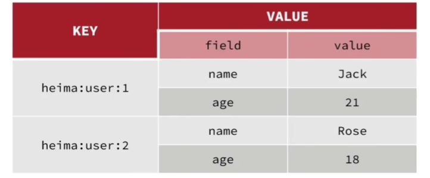

#### 3.列表操作命令

Redis 列表是简单的字符串列表，按照插入顺序排序，元素可以重复，插入和删除快但是速度一般，常用命令：

- **LPUSH** key value1 [value2]         将一个或多个值插入到列表头部
- RPUSH key value1 [value2]         向列表右侧插入一个或者多个元素
- **LRANGE** key start stop                获取列表指定范围内的元素
- LPOP key                                        移除第一个
- **RPOP** key                                       移除并获取列表最后一个元素
- **LLEN** key                                        获取列表长度
- **BLPOP/BRPOP** key1 [key2 ] timeout       移出并获取列表的最后一个元素， 如果列表没有元素会阻塞列表直到等待超    时或发现可弹出元素为止

#### 4.集合操作命令

Redis set 是string类型的无序集合。集合成员是唯一的，这就意味着集合中不能出现重复的数据，查找快，支持并交差 常用命令：

- **SADD** key member1 [member2]            向集合添加一个或多个成员
- **SMEMBERS** key                                         返回集合中的所有成员
- SISMEMBER key member                        判断member是否是key中的元素
- **SCARD** key                                                  获取集合的成员数
- **SINTER** key1 [key2]                                   返回给定所有集合的交集
- **SUNION** key1 [key2]                                 返回所有给定集合的并集
- **SREM** key member1 [member2]            移除集合中一个或多个成员

#### 5.有序集合操作命令

Redis有序集合是string类型元素的集合，且不允许有重复成员。每个元素都会关联一个double类型的分数，底层是基于一个跳表和一个哈希实现的。常用命令：

常用命令：

- **ZADD** key score1 member1 [score2 member2]     向有序集合添加一个或多个成员
- ZSCORE key member                                                   获取zset中指定元素的score值
- ZRANK key member                                                     获取zset中指定元素的排名
- **ZRANGE** key start stop [WITHSCORES]                     通过索引区间（排名顺序如果加上with则是分数）返回有序集合中指定区间内的成员（默认升序，如果降序变为ZREV）
- **ZINCRBY** key increment member                              有序集合中对指定成员的分数加上增量 increment
- **ZREM** key member [member ...]                                移除有序集合中的一个或多个成员
- ZDIFF、ZINTER、ZUINION                                           求交差并

#### 6.通用命令

Redis的通用命令是不分数据类型的，都可以使用的命令：

- KEYS pattern 		查找所有符合给定模式( pattern)的 key 
- EXISTS key 		检查给定 key 是否存在
- TYPE key 		返回 key 所储存的值的类型
- DEL key 		该命令用于在 key 存在是删除 key
- EXPIRE key second     设置key的有效期
- TTL KEY                        查看key的剩余存活时间

### 三、Redis的java客户端

#### 1.Jedis

Jedis由我们手动注册并管理生命周期的，不是交给IOC容器管理的。

```java
private Jedis jedis;

@BeforeEach
void setUp() {
    // 1.建立连接
    // jedis = new Jedis("192.168.150.101", 6379);
    jedis = JedisConnectionFactory.getJedis();
    // 2.设置密码
    jedis.auth("123321");
    // 3.选择库
    jedis.select(0);
}

@Test
void testString() {
    // 存入数据
    String result = jedis.set("name", "虎哥");
    System.out.println("result = " + result);
    // 获取数据
    String name = jedis.get("name");
    System.out.println("name = " + name);
}

@AfterEach
void tearDown() {
    if (jedis != null) {
    	jedis.close();
    }
}
```

要交给容器管理的，要在配置文件中用 @Bean注解标记构造函数，如下

```java
@Configuration
public class RedisConfig {

    @Bean
    public Jedis jedis() {
        Jedis jedis = new Jedis("192.168.150.101", 6379);
        jedis.auth("123321");
        jedis.select(0);
        return jedis;
    }
}
```

由于Jedis是线程不安全的，频繁创建和销毁有性能损耗

```java
package com.heima.jedis.util;
import redis.clients.jedis.*;
public class JedisConnectionFactory {
    private static JedisPool jedisPool;
    static {
        // 配置连接池
        JedisPoolConfig poolConfig = new JedisPoolConfig();
        poolConfig.setMaxTotal(8);
        poolConfig.setMaxIdle(8);
        poolConfig.setMinIdle(0);
        poolConfig.setMaxWaitMillis(1000);
        // 创建连接池对象，参数：连接池配置、服务端ip、服务端端口、超时时间、密码
        jedisPool = new JedisPool(poolConfig, "192.168.150.101", 6379, 1000,"123321");
    }
    public static Jedis getJedis(){
        return jedisPool.getResource();
    }
}
```

#### 2.SpringDataRedis

SpringData是Spring中数据操作的模块，包含对各种数据库的集成，其中SpringDataRedis中提供了RedisTemplate工具类，并进行了封装

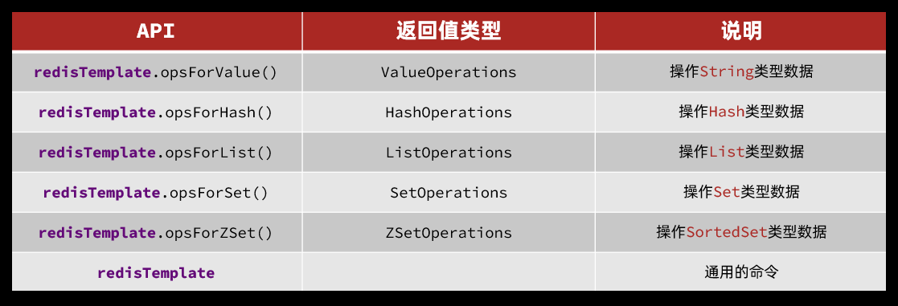

```java
@SpringBootTest
class RedisStringTests {
    @Autowired
    private RedisTemplate edisTemplate;
    @Test
    void testString() {
    // 写入一条String数据
    redisTemplate.opsForValue().set("name", "虎哥");
    // 获取string数据
    Object name = stringRedisTemplate.opsForValue().get("name");
    	System.out.println("name = " + name);
    }
}
```

但是这样操作后，我们会发现存入redis的key值不是name，而是采用JDK默认的序列化方式，得到的结果是如下乱码XAC\xED\x00\xe5t\x00\x06\xE6\x9D\×8E\xE5\×9B\x9B，这样可读性差且内存占用大，因此我们需要通过自定义的方式进行序列化，下面是采用json序列化的方式。注意对于key的序列化是利用的String字符串序列化，value的序列化时利用的json序列化

```java
@Configuration
public class RedisConfig {
@Bean
public RedisTemplate<String, Object> redisTemplate(RedisConnectionFactoryconnectionFactory){
        // 创建RedisTemplate对象
        RedisTemplate<String, Object> template = new RedisTemplate<>();
        // 设置连接工厂
        template.setConnectionFactory(connectionFactory);
        // 创建JSON序列化工具
        GenericJackson2JsonRedisSerializer jsonRedisSerializer = new GenericJackson2JsonRedisSerializer();
        // 设置Key的序列化
        template.setKeySerializer(RedisSerializer.string());
        template.setHashKeySerializer(RedisSerializer.string());
        // 设置Value的序列化
        template.setValueSerializer(jsonRedisSerializer);
        template.setHashValueSerializer(jsonRedisSerializer);
        // 返回
        return template;
    }
}
```

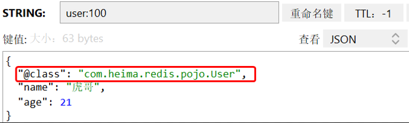

但是会产生问题，value值中要记录Object类型已完成反序列化，带来了额外的内存开销，因此我们考虑采用手动序列化的方式，不用Json序列化器来处理value，而是统一使用String序列化器，要求只能存储String类型的value和key，当需要存储java对象的时候，手动完成对象的序列化和反序列化

```java
public class UserTest {

    @Autowired
    private StringRedisTemplate stringRedisTemplate;

    @Test
    void testSaveUser() {
        // 创建对象
        User user = new User("虎哥", 21);
        
        // 使用 Hutool 序列化
        String json = JSONUtil.toJsonStr(user);  // 序列化为 JSON 字符串
        
        // 写入数据
        stringRedisTemplate.opsForValue().set("user:200", json);
        
        // 获取数据
        String jsonUser = stringRedisTemplate.opsForValue().get("user:200");
        
        // 使用 Hutool 反序列化
        User user1 = JSONUtil.parseObject(jsonUser, User.class);  // 解析为 User 对象
        
        System.out.println("user1 = " + user1);
    }
}
```

### 四、Redis替代session进行登录验证

#### 1.设计key

利用hash结构，它可以将对象中的每个字段独立存储，可以针对单个字段做CRUD，并且内存占用更少

一共需要两个key-val存入redis中，一个是手机号：验证码，还有一个是用户信息，用户信息的key使用的是随机生成的，因为如果直接用用户电话号码会泄露敏感信息。这里都要设置过期时间。

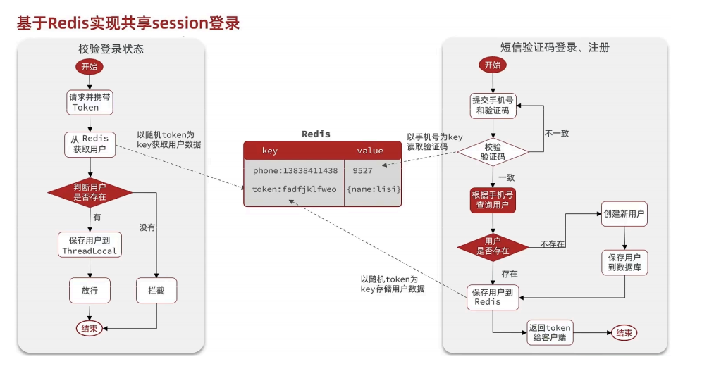

#### 2.修改拦截器

在用户浏览网站的时候，如果不进行过期时间刷新那么就会导致在用户浏览时需要重新登录，因此我们需要在拦截器添加更新过期时间的逻辑，但是如果我们直接在之前的拦截器里更新，那么会导致一些不需要拦截的路径（如浏览界面）无法更新，所以我们使用两个拦截器来完成

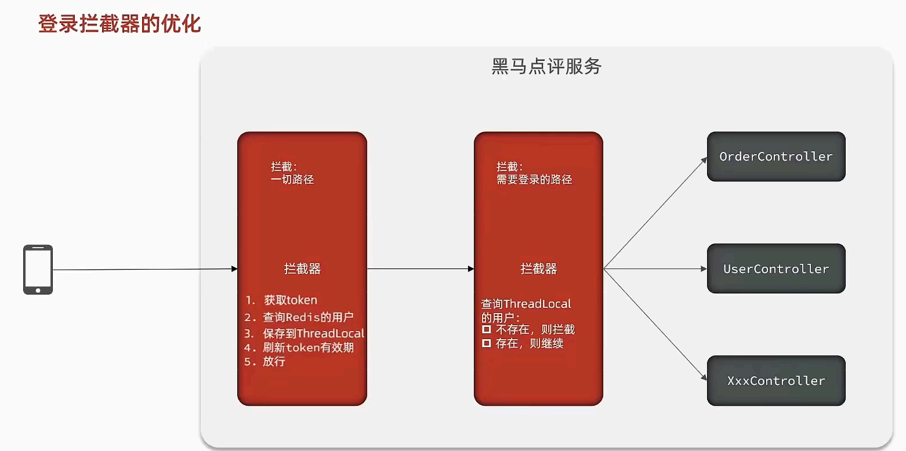

### 五、缓存

#### 1.介绍

缓存就是数据交换的缓冲区中的数据，存储在内存中，读写速度远大于磁盘，可以大大降低用户访问并发量带来的服务器读写压力，提高读写效率，降低响应时间，但是需要维护数据一致性和运维成本。

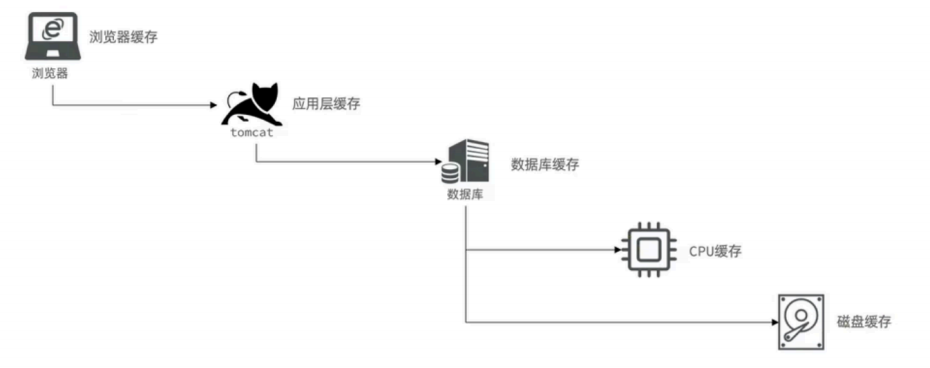

#### 2.缓存模型

将redis作为数据缓存，平衡数据库的压力

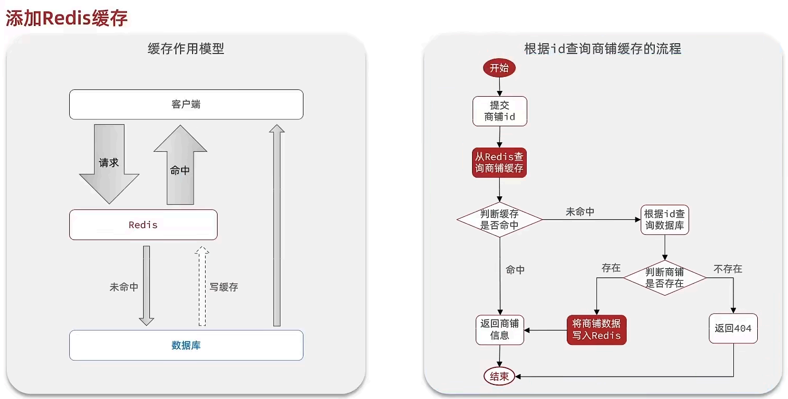

#### 3.缓存更新策略

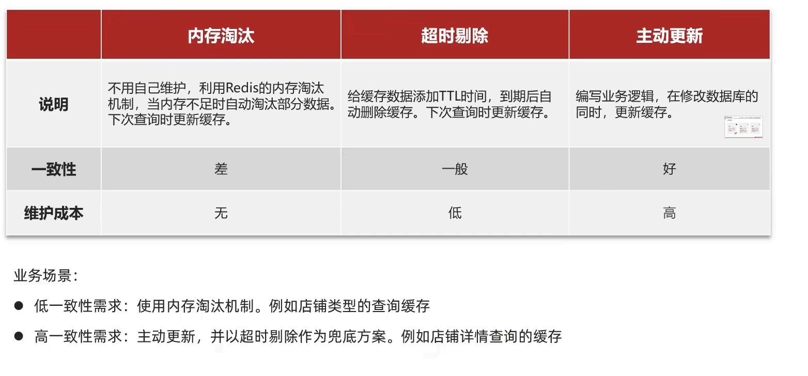

#### 4.数据一致性

由于缓存数据来自数据库，如果数据库的数据发生变化，但是缓存没有同步，就会出现一致性问题，我们这里采用双写方案，也就是缓存调用者再更新完数据库后再去更新缓存。

对于缓存的处理有两种方案：更新缓存（每次数据库更新时同步更新缓存，这样的话效率低，因为可能修改很多次数据库都没有查询一次缓存）和删除缓存（再更新数据库同时删除缓存，下次查询数据时再写入缓存）

为了保证删除缓存和操作数据库同时发生即满足原子性，我们需要把这两个操作放在一个事务

下面两种先后顺序方案应该选第二种，因为缓存未命中与写入时间相对较短，第二种并发问题发生可能性相对较低。

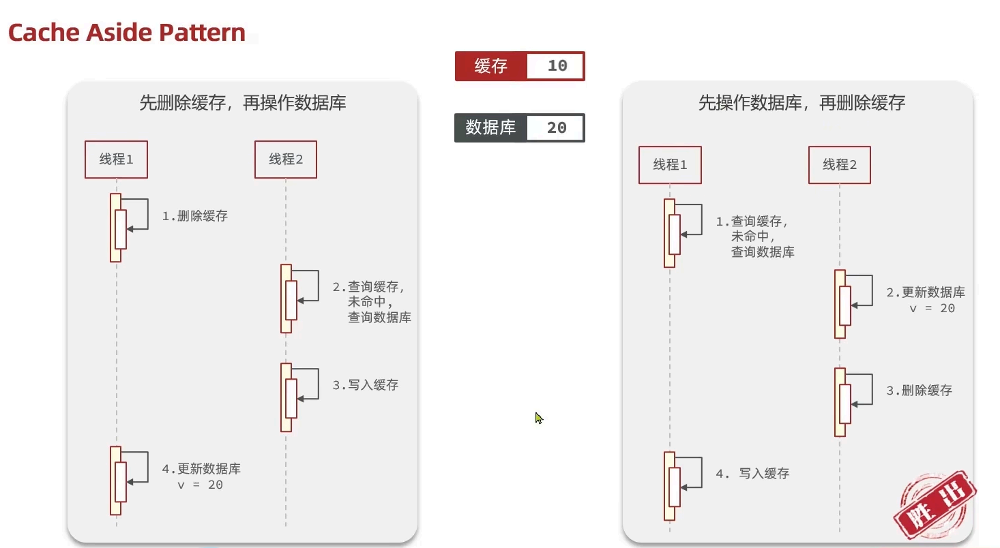

#### 5.缓存穿透

缓存穿透是指客户端请求的数据在缓存中和数据中都不存在，这样缓存永远不会生效，这些请求都会打到数据库，常见的解决方法有两种，一个是缓存空对象（实现简单，维护方便，但是有额外的内存消耗，可能造成短期的不一致），另外一个是布隆过滤（内存占用较少，没有多余的key，但是实现复杂存在误判可能性即假阳性，采用的是哈希思想）

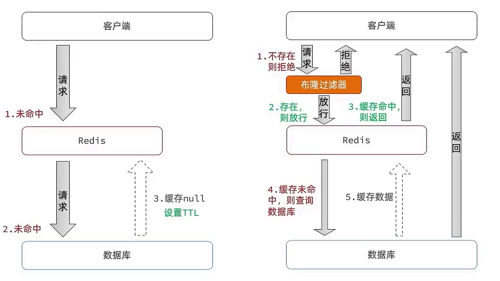

#### 6.缓存雪崩

缓存雪崩是指在同一时段大量的缓存key同时失效或者Redis服务宕机，导致大量请求到达数据库，带来巨大压力。

解决方案：

* 给不同的Key的TTL添加随机值

* 利用Redis集群提高服务的可用性

* 给缓存业务添加降级限流策略

* 给业务添加多级缓存

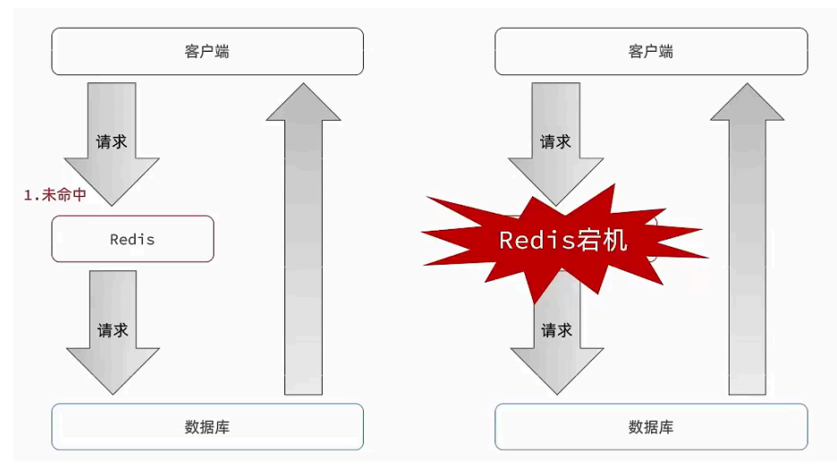

#### 7.缓存击穿

缓存击穿问题也叫热点Key问题，就是一个被高并发访问并且缓存重建业务较复杂的key突然失效了，无数的请求访问会在瞬间给数据库带来巨大的冲击，下图就是多线程并发访问时，如果还没有写入缓存，那么会有很多访问瞬间打到mysql上，导致压力过大。

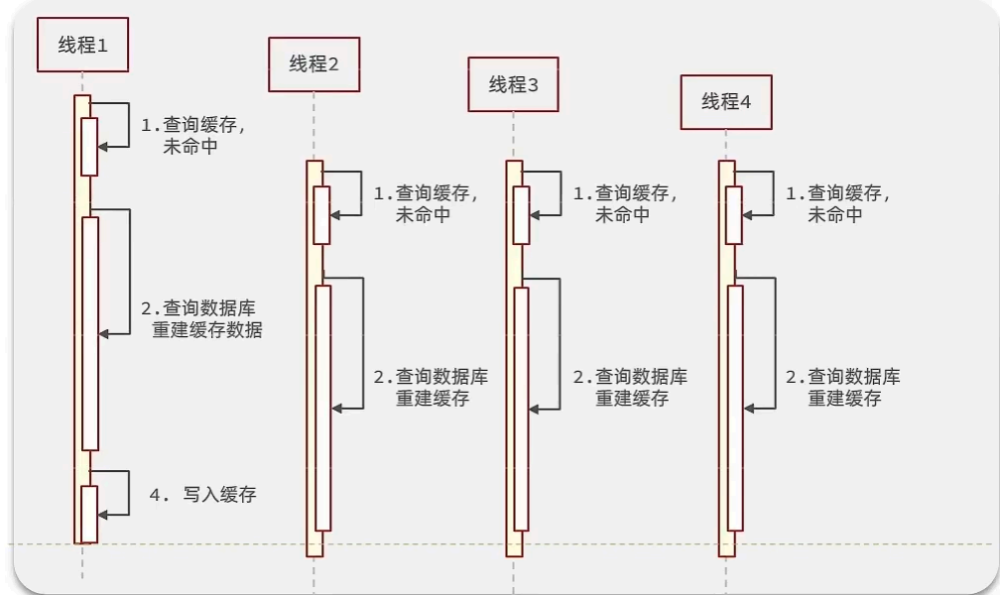

##### 1.互斥锁

因为锁具有互斥性，假设线程过来，只能串行访问数据库，从而避免数据库压力过大，但是会影响查询性能

下图就是互斥锁的原理，当线程1过来后就会先获取锁，然后线程2就只能休眠，然后等1写完缓存释放锁后2缓存命中

这个方法没有额外的内存消耗，保证了一致性，但是线程需要等待性能受到影响，并且可能会产生死锁

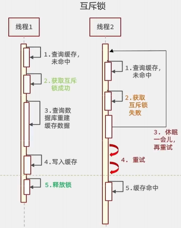

核心思路就是利用redis的setnx方法来表示获取锁，该方法含义是redis中如果没有这个key，则插入成功，返回1，在stringRedisTemplate中返回true， 如果有这个key则插入失败，则返回0，在stringRedisTemplate返回false，我们可以通过true，或者是false，来表示是否有线程成功插入key，成功插入的key的线程我们认为他就是获得到锁的线程。

```java
private boolean tryLock(String key) {
    Boolean flag = stringRedisTemplate.opsForValue().setIfAbsent(key, "1", 10, TimeUnit.SECONDS);
    return BooleanUtil.isTrue(flag);
}

private void unlock(String key) {
    stringRedisTemplate.delete(key);
}
```

##### 2.逻辑过期

我们把过期时间设置在 redis的value中，注意：这个过期时间并不会直接作用于redis，而是我们后续通过逻辑去处理。假设线程1去查询缓存，然后从value中判断出来当前的数据已经过期了，此时线程1去获得互斥锁，那么其他线程会进行阻塞，获得了锁的线程他会开启一个 线程去进行 以前的重构数据的逻辑，直到新开的线程完成这个逻辑后，才释放锁， 而线程1直接进行返回，假设现在线程3过来访问，由于线程线程2持有着锁，所以线程3无法获得锁，线程3也直接返回数据，只有等到新开的线程2把重建数据构建完后，其他线程才能走返回正确的数据。这种方案巧妙在于，异步的构建缓存，缺点在于在构建完缓存之前，返回的都是脏数据。

注意这里的expire实际非常大，所以不用考虑过期。

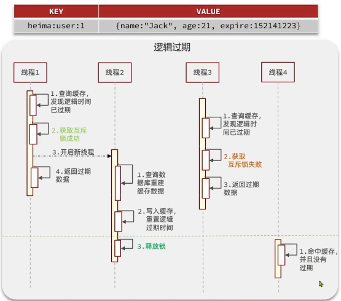

```java
// 建立一个线程池，线程池可以有效的管理和复用线程，提高程序的性能，ExecutorService是管理线程的接口Executors.newFixedThreadPool(10): 这是一个静态工厂方法，用于创建一个固定大小的线程池。参数 10 表示线程池中包含 10 个线程。这意味着最多可以同时执行 10 个缓存重建任务。
private static final ExecutorService CACHE_REBUILD_EXECUTOR = Executors.newFixedThreadPool(10);
public Shop queryWithLogicalExpire( Long id ) {
    String key = CACHE_SHOP_KEY + id;
    // 1.从redis查询商铺缓存
    String json = stringRedisTemplate.opsForValue().get(key);
    // 2.判断是否存在
    if (StrUtil.isBlank(json)) {
        // 3.不存在，直接返回
        return null;
    }
    // 4.命中，需要先把json反序列化为对象
    RedisData redisData = JSONUtil.toBean(json, RedisData.class);
    Shop shop = JSONUtil.toBean((JSONObject) redisData.getData(), Shop.class);
    LocalDateTime expireTime = redisData.getExpireTime();
    // 5.判断是否过期
    if(expireTime.isAfter(LocalDateTime.now())) {
        // 5.1.未过期，直接返回店铺信息
        return shop;
    }
    // 5.2.已过期，需要缓存重建
    // 6.缓存重建
    // 6.1.获取互斥锁
    String lockKey = LOCK_SHOP_KEY + id;
    boolean isLock = tryLock(lockKey);
    // 6.2.判断是否获取锁成功
    if (isLock){
        // 新建一个线程
    	CACHE_REBUILD_EXECUTOR.submit( ()->{
            try{
            //重建缓存
                this.saveShop2Redis(id,20L);
            }catch (Exception e){
                throw new RuntimeException(e);
            }finally {
                unlock(lockKey);
            }
		});
	}
    // 6.4.返回过期的商铺信息
    return shop;
}
```

### 六、全局唯一ID

#### 1.介绍

订单表使用数据库自增ID会存在一些问题：ID的规律太明显并且受表单数据量的限制（mysql单表容量不宜超过500w），所以我们考虑其他生成订单表id的方法。

#### 2.特点

全局唯一ID具有唯一性、高可用、高性能、递增性（方便维护索引）、安全性五大特性

#### 3.构建方法

为了增加ID的安全性，我们可以不直接使用Redis自增的数值，而是拼接一些其它信息：

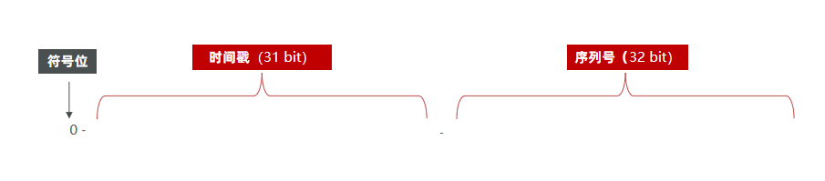

ID的组符号位：1bit，永远为0

时间戳：31bit，以秒为单位，可以使用69年

序列号：32bit，秒内的计数器，支持每秒产生$2^{32}$个不同ID

```java
public long nextId(String keyPrefix) {
    // 1.生成时间戳
    LocalDateTime now = LocalDateTime.now();
    long nowSecond = now.toEpochSecond(ZoneOffset.UTC);
    long timestamp = nowSecond - BEGIN_TIMESTAMP;

    // 2.生成序列号
    // 2.1.获取当前日期，精确到天
    String date = now.format(DateTimeFormatter.ofPattern("yyyy:MM:dd"));
    // 2.2.自增长
    long count = stringRedisTemplate.opsForValue().increment("icr:" + keyPrefix + ":" + date);

    // 3.拼接并返回
    return timestamp << COUNT_BITS | count;
}
```

### 七、多线程并发问题与锁

#### 1.并发问题

当多个线程同时对于优惠券进行抢购的时候，可能会出现超卖现象，因此需要加锁来解决这个问题


#### 2.悲观锁与乐观锁

悲观锁适合插入数据，乐观锁适合更新数据，在MySQL中updata更新操作就用的是行锁即悲观锁，在更新的时候会自动锁定表格这一行，不允许其他线程修改


尝试使用乐观锁解决优惠券超卖问题，使用CAS思路（compare and swap），也就是修改前先比较，判断是否和之前相同，如果不同则不能修改

```sql
update tb_seckill_voucher set stock = stock - 1 where voucher_id = #{voucherId} and stock = #{stock}
```

但是这个也会有问题，在使用乐观锁过程中假设100个线程同时都拿到了100的库存，然后大家一起去进行扣减，但是100个人中只有1个人能扣减成功，其他的人在处理时，他们在扣减时，库存已经被修改过了，所以此时其他线程都会失败

```sql
update tb_seckill_voucher set stock = stock - 1 where voucher_id = #{voucherId} and stock > 0
```

但是这个不能保证一个用户只能抢一张优惠券，因此我们需要加悲观锁以保证每个用户只能抢一张券，把用户抢券逻辑单独提取出来

```java
@Transactional
public synchronized Result createVoucherOrder(Long voucherId)
```

我们可以在创建订单的方法上加锁，如上面的代码，但是这样锁的粒度较大，因为这个粒度是this，也就是当前类对象，所有的线程进来后都会被阻塞，因此我们需要更新锁的粒度,intern() 这个方法是从常量池中拿到数据，如果我们直接使用userId.toString() 他拿到的对象实际上是不同的对象，new出来的对象，我们使用锁必须保证锁必须是同一把，所以我们需要使用intern()方法

```java
@Transactional
public  Result createVoucherOrder(Long voucherId) {
	Long userId = UserHolder.getUser().getId();
	synchronized(userId.toString().intern()){
         // 5.1.查询订单
        int count = query().eq("user_id", userId).eq("voucher_id", voucherId).count();
        // 5.2.判断是否存在
        if (count > 0) {
            // 用户已经购买过了
            return Result.fail("用户已经购买过一次！");
        }
```

但是以上代码还是存在问题，问题的原因在于当前方法被spring的事务控制，如果你在方法内部加锁，可能会导致当前方法事务还没有提交，但是锁已经释放也会导致问题，所以我们选择将当前方法整体包裹起来，确保事务不会出现问题：如下：

在seckillVoucher 方法中，添加以下逻辑，这样就能保证事务的特性，同时也控制了锁的粒度

```java
Long userId = UserHolder.getUser().getId();
synchronized(userId.toString().intern()) {
    return this.createVoucherOrder(voucherId);
}
```

但是以上做法依然有问题，因为你调用的方法，其实是this.的方式调用的，事务想要生效，还得利用代理来生效，所以这个地方，我们需要获得原始的事务对象， 来操作事务

> 在 Spring 中，事务是通过 AOP（面向切面编程）实现的。当一个 Bean 被 Spring 管理并添加了 `@Transactional` 注解时，Spring 会为其生成一个代理对象。所有对该 Bean 方法的调用，实际上都是通过代理对象进行的。代理对象会在方法执行前后，根据事务的配置，开启、提交或回滚事务。
>
> 当我们使用 `this.seckillVoucher()` 这种方式调用方法时，实际上调用的是原始对象的方法，而不是代理对象的方法。因此，事务相关的逻辑（如开启、提交、回滚）不会被执行，导致事务失效。

```java
synchronized(userId.toString().intern()) {
    IVoucherOrderService proxy = (IVoucherOrderService)AopContext.currentProxy();
    return proxy.createVoucherOrder(voucherId);
}
```

#### 3.分布式锁

##### 1.介绍

在分布式系统或者集群模式下多进程可见并且互斥的锁，分布式锁原理就是让大家使用同一把锁，使程序串行执行，有mysql，redis，zookepper等方法


##### 2.MySQL实现分布式锁

**原理：**

- 创建一个锁表，包含锁名称、持有者等字段。
- 尝试获取锁时，向表中插入一条记录，如果插入成功，则获取锁成功；如果插入失败，则获取锁失败。
- 释放锁时，删除对应的记录。
- 利用数据库的唯一索引或主键约束，保证同一时刻只有一个线程可以成功插入记录。
- 利用数据库的for update 语句，实现悲观锁。

#### 4.Redis实现分布式锁

基于Redis的分布式锁实现思路：

* 利用set nx ex获取锁，并设置过期时间，保存线程标示
* 释放锁时先判断线程标示是否与自己一致，一致则删除锁
  * 特性：
    * 利用set nx满足互斥性
    * 利用set ex保证故障时锁依然能释放，避免死锁，提高安全性
    * 利用Redis集群保证高可用和高并发特性

```java
private static final String KEY_PREFIX="lock:"
@Override
public boolean tryLock(long timeoutSec) {
    // 获取线程标示
    String threadId = Thread.currentThread().getId()
    // 获取锁
    Boolean success = stringRedisTemplate.opsForValue()
            .setIfAbsent(KEY_PREFIX + name, threadId + "", timeoutSec, TimeUnit.SECONDS);
    return Boolean.TRUE.equals(success);
}
```

```java
public void unlock() {
    //通过del删除锁
    stringRedisTemplate.delete(KEY_PREFIX + name);
}
```

持有锁的线程A在锁的内部出现阻塞，导致超时释放锁，然后其他线程B此时获取锁，然后A执行结束后释放锁，但是释放的是B的锁，这样就会出现锁误删的问题，解决思路是在获取锁的时候（即tryLock时）加入线程标识，即value用线程标识标注，然后删除锁的时候要注意锁中的标识是否和当前线程标识一样。

但是获取锁的标识并判断是否和当前线程标识一样，然后删除锁，这个并不是一个原子性操作，因此可能出现当判断标识一样和删除锁这两个事件中间出现阻塞的时候，锁超时释放了，然后另一个线程此时获取锁，阻塞线程唤醒后继续释放锁，我们需要使用Lua脚本解决多命令原子性问题（多命令问题就用Luajiao'ben）

```lua
-- 这里的 KEYS[1] 就是锁的key，这里的ARGV[1] 就是当前线程标示
-- 获取锁中的标示，判断是否与当前线程标示一致
if (redis.call('GET', KEYS[1]) == ARGV[1]) then
  -- 一致，则删除锁
  return redis.call('DEL', KEYS[1])
end
-- 不一致，则直接返回
return 0
```

```java
private static final DefaultRedisScript<Long> UNLOCK_SCRIPT;
    static {
        // 声明一个DefaultRedisScript对象，用来加载和执行Lua脚本
        UNLOCK_SCRIPT = new DefaultRedisScript<>();
        // 从classpath中的unlock.lua加载脚本
        UNLOCK_SCRIPT.setLocation(new ClassPathResource("unlock.lua"));
        // 设置返回类型
        UNLOCK_SCRIPT.setResultType(Long.class);
    }

public void unlock() {
    // 调用lua脚本
    stringRedisTemplate.execute(
            UNLOCK_SCRIPT,
            Collections.singletonList(KEY_PREFIX + name),
            ID_PREFIX + Thread.currentThread().getId());
}
```

基于setnx实现的分布式锁存在下面的问题：

**重入问题**：重入问题是指 获得锁的线程可以再次进入到相同的锁的代码块中，可重入锁的意义在于防止死锁，比如HashTable这样的代码中，他的方法都是使用synchronized修饰的，假如他在一个方法内，调用另一个方法，那么此时如果是不可重入的，不就死锁了吗？所以可重入锁他的主要意义是防止死锁，我们的synchronized和Lock锁都是可重入的。

**不可重试**：是指目前的分布式只能尝试一次，我们认为合理的情况是：当线程在获得锁失败后，他应该能再次尝试获得锁。

**超时释放：**我们在加锁时增加了过期时间，这样的我们可以防止死锁，但是如果卡顿的时间超长，虽然我们采用了lua表达式防止删锁的时候，误删别人的锁，但是毕竟没有锁住，有安全隐患

**主从一致性：** 如果Redis提供了主从集群，当我们向集群写数据时，主机需要异步的将数据同步给从机，而万一在同步过去之前，主机宕机了，就会出现死锁问题。

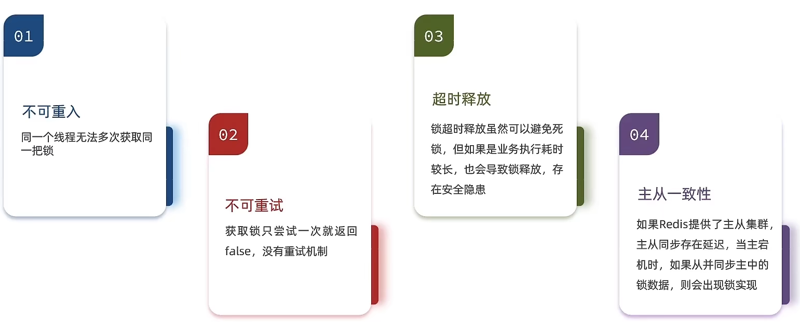

不可重入原因：set nx是不存在可以进入，但是如果一个线程已经set nx了那么调用子方法没法再次调用，因此被锁住

#### 5.Redission

##### 1.配置redission

```java
@Configuration
public class RedissonConfig {

    @Bean
    public RedissonClient redissonClient(){
        // 配置
        Config config = new Config();
        config.useSingleServer().setAddress("redis://192.168.150.101:6379")
            .setPassword("123321");
        // 创建RedissonClient对象
        return Redisson.create(config);
    }
}
```

```java
@Resource
private RedissionClient redissonClient;

@Test
void testRedisson() throws Exception{
    //获取锁(可重入)，指定锁的名称
    RLock lock = redissonClient.getLock("anyLock");
    //尝试获取锁，参数分别是：获取锁的最大等待时间(期间会重试)，锁自动释放时间，时间单位
    boolean isLock = lock.tryLock(1,10,TimeUnit.SECONDS);
    //判断获取锁成功
    if(isLock){
        try{
            System.out.println("执行业务");          
        }finally{
            //释放锁
            lock.unlock();
        }   
    }   
}
```

##### 2.可重入锁原理

之前我们是用 setnx 来上锁的，但是会出现不可重用问题，因此我们考虑使用redission，下面的lua脚本是redission的源码

KEYS[1] ： 锁名称               ARGV[1]：  锁失效时间                    ARGV[2]：  id + ":" + threadId; 锁的小key（判断是否是改线程）

如果锁不存在，则创建锁，如果锁存在，并且锁的小key是当前线程的编号，那么value值+1，结束就-1，为0的时候释放锁

如果锁存在并且锁的小key不是当前线程编号，那么就返回过期时间，线程自旋等待

```lua
"if (redis.call('exists', KEYS[1]) == 0) then " +
                  "redis.call('hset', KEYS[1], ARGV[2], 1); " +
                  "redis.call('pexpire', KEYS[1], ARGV[1]); " +
                  "return nil; " +
              "end; " +
              "if (redis.call('hexists', KEYS[1], ARGV[2]) == 1) then " +
                  "redis.call('hincrby', KEYS[1], ARGV[2], 1); " +
                  "redis.call('pexpire', KEYS[1], ARGV[1]); " +
                  "return nil; " +
              "end; " +
              "return redis.call('pttl', KEYS[1]);"
```


## MongoDB数据库

### 一、简介

它是 $NoSql$ 型数据库即非关系数据库，它是利用 $JSON$ 或者 $BSON$ (二进制的 $json$ 格式)，它不需要预先定义好集合的内容，是非结构化数据，适用于实时分析，其最小存储单位为文档 $Document$

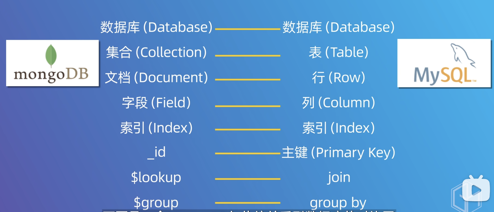

### 二、常用命令

#### 1. 数据库相关

```shell
# 查看所有数据库
show databases

# 选择数据库(如果数据库不存在,不会报错;会隐式创建:当后期该数据库有数据时自动创建)
use 数据库名

# 删除数据库(先选中数据库)
db.dropDatabase()
```

#### 2. 集合相关

```shell
# 查看所有集合
show collections

# 创建集合(插入数据会隐式创建)
db.createCollection('集合名')

# 删除集合
db.集合名.drop()
```

#### 3.**插入数据**

集合存在则直接插入数据，不存在则隐式创建集合并插入数据

json数据格式要求key得加""，但这里为了方便查看，对象的key统一不加""；查看集合数据时系统会自动给key加""

$mongodb$会自动给每条数据创建全球唯一的_id键（也可以自己指定）

```shell
db.集合名.insert(json数据)
```

例如，每个文档的属性可以不一样

```shell
use stu;
db.stu.insert({name:"cy", age:"22"})
db.stu.insert({name:"zym"})
```

#### 4. **删除数据**

```shell
db.集合名.remove(条件 [,是否删除一条])

# 是否删除一条
- false删除多条,即全部删除(默认)
- true删除一条
```

#### 5. **修改数据**

```shell
db.集合名.update(条件, 新数据 [,是否新增, 是否修改多条])

# 新数据
- 默认是对原数据进行替换
- 若要进行修改,格式为 {修改器:{key:value}}

# 是否新增
- 条件匹配不到数据时是否插入: true插入,false不插入(默认)

# 是否修改多条
- 条件匹配成功的数据是否都修改: true都修改,false只修改一条(默认)
```

| **修改器** | **作用** |
| ---------- | -------- |
| $inc       | 递增     |
| $rename    | 重命名列 |
| $set       | 修改列值 |
| $unset     | 删除     |

例如

```shell
db.stu.insert({name:"zs",age:"10"})
db.stu.update({name:"zs"},{name:"ls"})
# 结果会去掉age字段，不是修改而是替换
db.stu.find()
{name:"ls"}
# 解决方法
# 修改列值
db.people.update({name:"zsr3"},{$set:{name:"zsr3333"}})
# 增加两岁
db.people.update({name:"zsr10"},{$inc:{age:2}})
# 减少两岁
db.people.update({name:"zsr10"},{$inc:{age:-2}})


db.people.insert({username:"gcc",age:20,sex:"女",address:"unknown"})
db.people.update({username:"gcc"},{
	$set:{username:"bareth"},
	$inc:{age:11},
	$rename:{sex:"sexuality"},
	$unset:{address:true}
})
```

#### 6. **查询数据**

```shell
db.集合名.find(条件 [,查询的列])
db.集合名.find(条件 [,查询的列]).pretty()	#格式化查看

# 条件
- 查询所有数据	{}或不写
- 查询指定要求数据	{key:value}或{key:{运算符:value}}

# 查询的列(可选参数)
- 不写则查询全部列
- {key:1}	只显示key列
- {key:0}	除了key列都显示
- 注意:_id列都会存在
```

| **运算符** | **作用** |
| ---------- | -------- |
| $gt        | 大于     |
| $gte       | 大于等于 |
| $lt        | 小于     |
| $lte       | 小于等于 |
| $ne        | 不等于   |
| $in        | in       |
| $nin       | not in   |

```shell
# 只找name列
db.stu.find({},{name:"1"})
# 除了name列其他列
db.stu.find({},{name:"0"})
# 查找指定条件的数据
db.stu.find([age:{$gt:21}])
```

#### 7. 排序

```shell
db.集合名.find().sort(json数据)

# json数据(key:value)
- key就是要排序的字段
- value为1表示升序,-1表示降序

# 例如
db.stu.find().sort({"age":-1})
```

#### 8. 分页

```shell
db.集合名.find().sort().skip(数字).limit(数字)[.count()]

# skip(数字)
- 指定跳过的数量(可选)

# limit(数字)
- 限制查询的数量

# count()
- 统计数量
```

#### 9. 聚合查询

基础语法

```shell
db.集合名.aggregate([
	{管道:{表达式}}
	...
])
```

常用管道：

| $group | 将集合中的文档分组，用于统计结果 |
| ------ | -------------------------------- |
| $match | 过滤数据，只输出符合条件的文档   |
| $sort  | 聚合数据进一步排序               |
| $skip  | 跳过指定文档数                   |
| $limit | 限制集合数据返回文档数           |

常用表达式：

| $sum | 总和（$num:1同count表示统计） |
| ---- | ----------------------------- |
| $avg | 平均                          |
| $min | 最小值                        |
| $max | 最大值                        |

```shell
db.people.insert({_id:1,name:"a",sex:"男",age:21})
db.people.insert({_id:2,name:"b",sex:"男",age:20})
db.people.insert({_id:3,name:"c",sex:"女",age:20})
db.people.insert({_id:4,name:"d",sex:"女",age:18})
db.people.insert({_id:5,name:"e",sex:"男",age:19})
```

统计男生、女生的总年龄

```shell
db.people.aggregate([
	{$group:{_id:"$sex",age_sum:{$sum:"$age"}}}
])
```

统计男生、女生的总人数

```shell
db.people.aggregate([
	{$group:{_id:"$sex",sum:{$sum:1}}}
])
```

求学生总数和平均年龄

```shell
db.people.aggregate([
	{$group:{_id:null,total_num:{$sum:1},total_avg:{$avg:"$age"}}}
])
```

## RabbitMQ

### 一、基本概念

#### 1. AMQP协议

RabbitMQ是一种遵循`AMQP`协议的分布式消息中间件。`AMQP` 全称 “Advanced Message Queuing Protocol”，高级消息队列协议。它是应用层协议的一个开发标准，为面向消息的中间件设计。

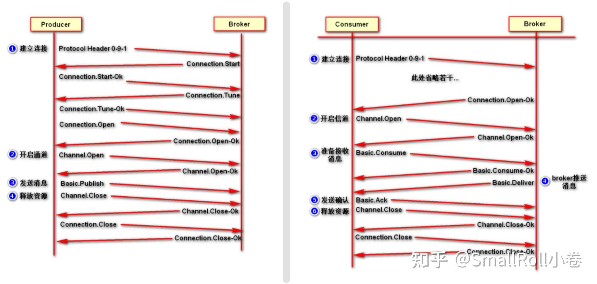

#### 2. RabbitMQ架构

- `Broker`：就是 RabbitMQ 服务，用于接收和分发消息，接受客户端的连接，实现 AMQP 实体服务。
- `Virtual host`：出于多租户和安全因素设计的，把 AMQP 的基本组件划分到一个虚拟的分组中，类似于网络中的 namespace 概念。当多个不同的用户使用同一个 RabbitMQ server 提供的服务时，可以划分出多个 vhost，每个用户在自己的 vhost 创建 exchange 或 queue 等。

- `Connection`：连接，生产者/消费者与 Broker 之间的 TCP 网络连接。
- `Channel`：网络信道，如果每一次访问 RabbitMQ 都建立一个 Connection，在消息量大的时候建立连接的开销将是巨大的，效率也较低。Channel 是在 connection 内部建立的逻辑连接，如果应用程序支持多线程，通常每个 thread 创建单独的 channel 进行通讯，AMQP method 包含了 channel id 帮助客户端和 message broker 识别 channel，所以 channel 之间是完全隔离的。Channel 作为轻量级的Connection 极大减少了操作系统建立 TCP connection 的开销。

- `Message`：消息，服务与应用程序之间传送的数据，由Properties和body组成，Properties可是对消息进行修饰，比如消息的优先级，延迟等高级特性，Body则就是消息体的内容。

- `Virtual Host`：虚拟节点，用于进行逻辑隔离，最上层的消息路由，一个虚拟主机可以有若干个Exhange和Queue，同一个虚拟主机里面不能有相同名字的Exchange

- `Exchange`：交换机，是 message 到达 broker 的第一站，用于根据分发规则、匹配查询表中的 routing key，分发消息到 queue 中去，不具备消息存储的功能。常用的类型有：direct、topic、fanout。

- `Bindings`：exchange 和 queue 之间的虚拟连接，binding 中可以包含 routing key，Binding 信息被保存到 exchange 中的查询表中，用于 message 的分发依据。

- `Routing key`：是一个路由规则，虚拟机可以用它来确定如何路由一个特定消息
- `Queue`：消息队列，保存消息并将它们转发给消费者进行消费。

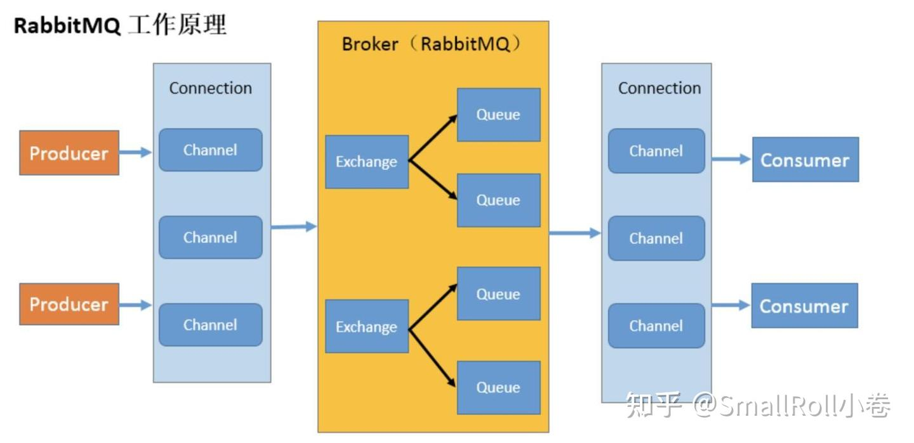

### 二、消息模式

#### 1. 简单模式——Hello World

一个生产者，一个消费者构成的队列


先写一个统一的连接管道

```java
public class RabbitMqUtils {
    // 获得RabbitMQ连接的channel
    public static Channel getChannel() throws Exception {
        // 创建一个连接工厂
        ConnectionFactory factory = new ConnectionFactory();
        factory.setHost("82.156.9.173");
        factory.setUsername("zsr");
        factory.setPassword("123456");
        // 创建一个connection
        Connection connection = factory.newConnection();
        // 创建一个channel
        Channel channel = connection.createChannel();
        return channel;
    }
}
```

编写生产者

```java
public class Producer {
    public static String QUEUE_NAME = "hello";

    public static void main(String[] args) throws Exception {
        Channel channel = utils.RabbitMqUtils.getChannel();
        /**
         * 创建一个队列
         * 1.队列名称
         * 2.队列里面的消息是否持久化(默认为false,代表消息存储在内存中)
         * 3.该队列是否只供一个消费者进行消费,是否进行共享(true表示可以多个消费者消费)
         * 4.表示最后一个消费者断开连接以后,该队列是否自动删除(true表示自动删除)
         * 5.其他参数
         */
        channel.queueDeclare(QUEUE_NAME, false, false, false, null);
        /**
         * 发送一个消息
         * 1.发送到那个交换机(空代表默认交换机)
         * 2.路由key
         * 3.其他的参数信息
         * 4.发送消息的消息体
         */
        String message = "hello";
        channel.basicPublish("", QUEUE_NAME, null, message.getBytes());
        System.out.println("消息发送完毕");
    }
}
```

消费者

```java
public class Consumer {
    public static String QUEUE_NAME = "hello";

    public static void main(String[] args) throws Exception {
        Channel channel = utils.RabbitMqUtils.getChannel();
        /**
         * 消费者消费消息
         * 1.消费的队列名称
         * 2.消费成功之后是否要自动应答(true代表自动应答,false代表手动应答)
         * 3.消费者消费消息的回调(函数式接口)
         * 4.消费者取消消费的回调(函数式接口)
         */
        // 消费消息的回调
        DeliverCallback deliverCallback = (consumerTag, message) -> {
            System.out.println("消息成功消费!内容为:" + new String(message.getBody()));
        };
        // 取消消费的回调
        CancelCallback cancelCallback = (consumerTag) -> {
            System.out.println("消息消费被中断");
        };
        channel.basicConsume(QUEUE_NAME, true, deliverCallback, cancelCallback);
    }
}
```

#### 2. 工作模式——Work Queues

把消息平均分发给多个消费者


生产者

```java
public class Producer {
    public static String QUEUE_NAME = "work";

    public static void main(String[] args) throws Exception {
        // 创建channel
        Channel channel = utils.RabbitMqUtils.getChannel();
        // 声明队列
        channel.queueDeclare(QUEUE_NAME, false, false, false, null);
        // 发送消息
        Scanner scanner = new Scanner(System.in);
        while (scanner.hasNext()) {
            String message = scanner.next();
            channel.basicPublish("", QUEUE_NAME, null, message.getBytes());
            System.out.println("消息发送完毕" + message);
        }
    }
}
```

消费者

```java
public class Consumer01 {
    public static String QUEUE_NAME = "work";

    public static void main(String[] args) throws Exception {
        // 创建channel
        Channel channel = utils.RabbitMqUtils.getChannel();
        // 消费消息
        DeliverCallback deliverCallback = (consumerTag, message) -> {
            System.out.println("消息成功消费!内容为:" + new String(message.getBody()));
        };
        CancelCallback cancelCallback = (consumerTag) -> {
            System.out.println("消息消费被中断");
        };
        channel.basicConsume(QUEUE_NAME, true, deliverCallback, cancelCallback);
    }
}
```

```java
public class Consumer02 {
    public static String QUEUE_NAME = "work";

    public static void main(String[] args) throws Exception {
        // 创建channel
        Channel channel = utils.RabbitMqUtils.getChannel();
        // 消费消息
        DeliverCallback deliverCallback = (consumerTag, message) -> {
            System.out.println("消息成功消费!内容为:" + new String(message.getBody()));
        };
        CancelCallback cancelCallback = (consumerTag) -> {
            System.out.println("消息消费被中断");
        };
        channel.basicConsume(QUEUE_NAME, true, deliverCallback, cancelCallback);
    }
}
```

### 三、交换机

#### 1. 简介

RabbitMQ 消息传递模型的核心思想是：**生产者生产的消息从不会直接发送到队列**。实际上，通常生产者甚至都不知道这些消息传递传递到了哪些队列中。相反，**生产者只能将消息发送到交换机(exchange)**，交换机工作的内容非常简单，一方面它接收来自生产者的消息，另一方面将它们推入队列。交换机必须确切知道如何处理收到的消息。是应该把这些消息放到特定队列还是说把他们到许多队列中还是说应该丢弃它们。这就的由交换机的类型来决定。

**无名exchange**

在本文的前面部分我们对 exchange 一无所知，但仍然能够将消息发送到队列。这是因为我们使用的是默认交换机，我们通过空字符串(“”)进行标识。

```java
channel.basicPublish("", "hello", null, message,getBytes());
```

临时队列

上文所有例子中我们都使用的是具有特定名称的队列，队列的名称我们来说至关重要，用于指定消费者去消费哪个队列的消息。每当我们连接到 RabbitMQ 时都需要一个全新的空队列，但很多时候我们可能不想指定队列名字，只想实验测试一下，此时我们可以创建一个具有**随机名称的队列，一旦我们断开了消费者的连接，该队列将被自动删除。这就是临时队列。**

```java
// 创建一个临时队列
String queueName = channel.queueDeclare().getQueue();
```

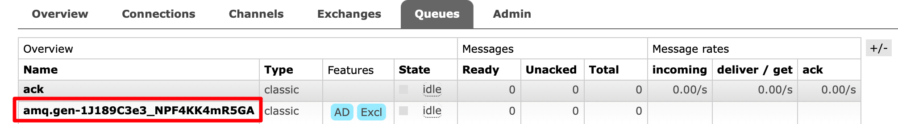

交换机对信息进行路由到队列，交换机将消息发到哪个队列是 routing-key要做的事，也就是绑定关系

```java
Queue.BindOk queueBind(String queue, String exchange, String routingKey) throws IOException
```

#### 2. Fanout模式——RabbitMQ发布订阅模式

生产者

```java
public class Producer {
    public static void main(String[] args) throws Exception {
        // 创建channel
        Channel channel = utils.RabbitMqUtils.getChannel();
        // 声明交换机
        channel.exchangeDeclare("logs", BuiltinExchangeType.FANOUT);
        // 发送10条消息
        for (int i = 0; i < 10; i++) {
            String message = i + "";
            channel.basicPublish("logs", "", null, message.getBytes());
            System.out.println("消息发送完毕" + message);
        }
    }
}
```

消费者

所有消费者都收到了消息，说明fanout模式就是起到一个广播的作用，

```java
public class Consumer01 {
    public static void main(String[] args) throws Exception {
        // 创建channel
        Channel channel = utils.RabbitMqUtils.getChannel();
        // 声明交换机
        channel.exchangeDeclare("logs", BuiltinExchangeType.FANOUT);
        // 声明临时队列
        String queueName = channel.queueDeclare().getQueue();
        // 绑定队列与交换机
        channel.queueBind(queueName, "logs", "");
        // 消费消息
        DeliverCallback deliverCallback = (consumerTag, message) -> {
            System.out.println("获得消息:" + new String(message.getBody()));
        };
        CancelCallback cancelCallback = (consumerTag) -> {
            System.out.println("消息消费被中断");
        };
        channel.basicConsume(queueName, true, deliverCallback, cancelCallback);
    }
}
```

```java
public class Consumer02 {
    public static void main(String[] args) throws Exception {
        // 创建channel
        Channel channel = utils.RabbitMqUtils.getChannel();
        // 声明交换机
        channel.exchangeDeclare("logs", BuiltinExchangeType.FANOUT);
        // 声明临时队列
        String queueName = channel.queueDeclare().getQueue();
        // 绑定队列与交换机
        channel.queueBind(queueName, "logs", "");
        // 消费消息
        DeliverCallback deliverCallback = (consumerTag, message) -> {
            System.out.println("获得消息:" + new String(message.getBody()));
        };
        CancelCallback cancelCallback = (consumerTag) -> {
            System.out.println("消息消费被中断");
        };
        channel.basicConsume(queueName, true, deliverCallback, cancelCallback);
    }
}
```

#### 3. Direct模式——RabbitMQ路由模式

> 上述 Fanout 这种交换类型并不能给我们带来很大的灵活性，它只能进行无意识的广播，在这里我们将使用 direct 类型来替换，direct 类型的工作方式是：消息只去到它绑定的 routingKey 队列中去。

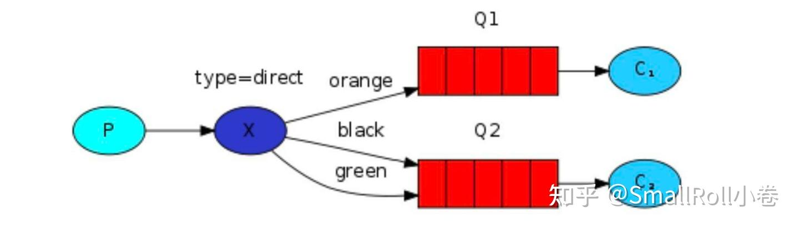

举个简单的例子，在上面这张图中，我们可以看到交换机X为direct模式，绑定了两个队列，队列Q1绑定键为 orange，队列Q2绑定键有两个：一个绑定键为 black，另一个绑定键为 green。
在这种绑定情况下，生产者发布消息到 exchange 上，绑定键为 orange 的消息会被发布到队列Q1。绑定键为 blackgreen 和的消息会被发布到队列 Q2，其他消息类型的消息将被丢弃。
`Fanout 模式本质就是 Direct 模式的一种特殊情况`，如下图所示：如果 direct 类型的交换机绑定的多个队列的 routing-key 都相同，也就类似 fanout 模式，就跟广播差不多。

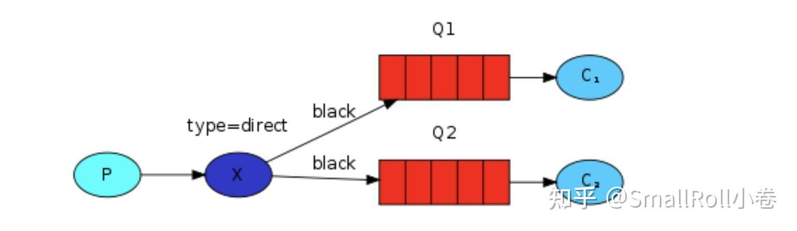

```java
public class Consumer01 {
    private static final String QUEUE_NAME = "console";
    private static final String EXCHANGE_NAME = "direct_logs";

    public static void main(String[] args) throws Exception {
        // 创建channel
        Channel channel = utils.RabbitMqUtils.getChannel();
        // 声明交换机
        channel.exchangeDeclare(EXCHANGE_NAME, BuiltinExchangeType.DIRECT);
        // 声明临时队列
        channel.queueDeclare(QUEUE_NAME, false, false, false, null);
        // 绑定队列与交换机
        channel.queueBind(QUEUE_NAME, EXCHANGE_NAME, "info");
        channel.queueBind(QUEUE_NAME, EXCHANGE_NAME, "warning");
        // 消费消息
        DeliverCallback deliverCallback = (consumerTag, message) -> {
            System.out.println("获得消息:" + new String(message.getBody()));
        };
        CancelCallback cancelCallback = (consumerTag) -> {
            System.out.println("消息消费被中断");
        };
        channel.basicConsume(QUEUE_NAME, true, deliverCallback, cancelCallback);
    }
}
```

```java
public class Consumer02 {
    private static final String QUEUE_NAME = "disk";
    private static final String EXCHANGE_NAME = "direct_logs";

    public static void main(String[] args) throws Exception {
        // 创建channel
        Channel channel = utils.RabbitMqUtils.getChannel();
        // 声明交换机
        channel.exchangeDeclare(EXCHANGE_NAME, BuiltinExchangeType.DIRECT);
        // 声明临时队列
        channel.queueDeclare(QUEUE_NAME, false, false, false, null);
        // 绑定队列与交换机
        channel.queueBind(QUEUE_NAME, EXCHANGE_NAME, "error");
        // 消费消息
        DeliverCallback deliverCallback = (consumerTag, message) -> {
            System.out.println("获得消息:" + new String(message.getBody()));
        };
        CancelCallback cancelCallback = (consumerTag) -> {
            System.out.println("消息消费被中断");
        };
        channel.basicConsume(QUEUE_NAME, true, deliverCallback, cancelCallback);
    }
}
```

生产者

```java
public class Producer {
    private static final String EXCHANGE_NAME = "direct_logs";

    public static void main(String[] args) throws Exception {
        // 创建channel
        Channel channel = utils.RabbitMqUtils.getChannel();
        // 声明交换机
        channel.exchangeDeclare(EXCHANGE_NAME, BuiltinExchangeType.DIRECT);
        // 发送消息
        Map<String, String> messageMap = new HashMap<>();
        messageMap.put("info", "普通 info 信息");
        messageMap.put("warning", "警告 warning 信息");
        messageMap.put("error", "错误 error 信息");
        messageMap.put("debug", "调试 debug 信息");
        for (Map.Entry<String, String> mes : messageMap.entrySet()) {
            String routingKey = mes.getKey();
            String message = mes.getValue();
            channel.basicPublish(EXCHANGE_NAME, routingKey, null, message.getBytes());
            System.out.println("消息发送完毕" + message);
        }
    }
}
```

#### 4. Topics模式——RabbitMQ主题模式

发送到类型是 topic 交换机的消息的 routing_key 不能随意写，必须满足一定的要求，它必须是一个单词列表，以点号分隔开。这些单词可以是任意单词，比如说：“stock.usd.nyse”、“nyse.vmw”、“quick.orange.rabbit” 这种类型的。当然这个单词列表最多不能超过 255 个字节。

在这个规则列表中，其中有两个替换符是大家需要注意的：

- 星号`*`可以代替一个单词
- 井号`#`可以替代零个或多个单词

此外，当队列绑定关系是下列情况时需要引起注意：

- 当一个队列绑定键是`#`,那么这个队列将接收所有数据，就有点像 **fanout**
- 如果队列绑定键当中没有`#`和`*`出现，那么该队列绑定类型就是 **direct**

**案例演示**：如下图所示，我们首先分析该模式消息的路由结果，然后我们通过代码来验证一下结果是否正确

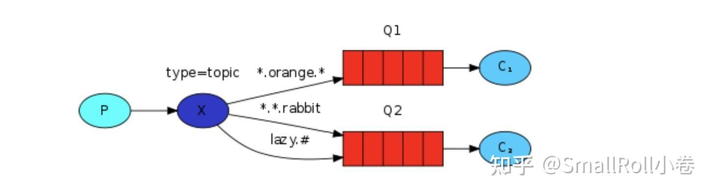

- Q1–>绑定的是：中间带 orange 带 3 个单词的字符串(*.orange.*)
- Q2–>绑定的是：最后一个单词是 rabbit 的 3 个单词(*.*.rabbit)，第一个单词是 lazy 的多个单词(lazy.#)

上图是一个队列绑定关系图，我们来看看他们之间数据接收情况是怎么样的：

```js
quick.orange.rabbit             被队列 Q1Q2 接收到
lazy.orange.elephant            被队列 Q1Q2 接收到
quick.orange.fox                    被队列 Q1 接收到
lazy.brown.fox                      被队列 Q2 接收到
lazy.pink.rabbit                    虽然满足两个绑定但只被队列 Q2 接收一次
quick.brown.fox                     不匹配任何绑定不会被任何队列接收到会被丢弃
quick.orange.male.rabbit    是四个单词不匹配任何绑定会被丢弃
lazy.orange.male.rabbit     是四个单词但匹配 Q2
```

生产者 Producer

```java
public class Producer {
    private static final String EXCHANGE_NAME = "topic_logs";

    public static void main(String[] args) throws Exception {
        // 创建channel
        Channel channel = utils.RabbitMqUtils.getChannel();
        // 声明交换机
        channel.exchangeDeclare(EXCHANGE_NAME, BuiltinExchangeType.TOPIC);
        // 发送消息
        Map<String, String> messageMap = new HashMap<>();
        messageMap.put("quick.orange.rabbit", "被队列 Q1Q2 接收到");
        messageMap.put("lazy.orange.elephant", "被队列 Q1Q2 接收到");
        messageMap.put("quick.orange.fox", "被队列 Q1 接收到");
        messageMap.put("lazy.brown.fox", "被队列 Q2 接收到");
        messageMap.put("lazy.pink.rabbit", "虽然满足两个绑定但只被队列 Q2 接收一次");
        messageMap.put("quick.brown.fox", "不匹配任何绑定不会被任何队列接收到会被丢弃");
        messageMap.put("quick.orange.male.rabbit", "是四个单词不匹配任何绑定会被丢弃");
        messageMap.put("lazy.orange.male.rabbit", "是四个单词但匹配 Q2");
        for (Map.Entry<String, String> mes : messageMap.entrySet()) {
            String message = mes.getValue();
            String routingKey = mes.getKey();
            channel.basicPublish(EXCHANGE_NAME, routingKey, null, message.getBytes());
            System.out.println("消息发送完毕" + message);
        }
    }
}
```

消费者

```java
public class Consumer01 {
    private static final String EXCHANGE_NAME = "topic_logs";
    private static final String QUEUE_NAME = "Q1";

    public static void main(String[] args) throws Exception {
        // 创建channel
        Channel channel = utils.RabbitMqUtils.getChannel();
        // 声明交换机
        channel.exchangeDeclare(EXCHANGE_NAME, BuiltinExchangeType.TOPIC);
        // 创建Q1队列
        channel.queueDeclare(QUEUE_NAME, false, false, false, null);
        // 绑定队列与交换机
        channel.queueBind(QUEUE_NAME, EXCHANGE_NAME, "*.orange.*");
        // 消费消息
        DeliverCallback deliverCallback = (consumerTag, message) -> {
            System.out.println("获得消息:" + new String(message.getBody()));
        };
        CancelCallback cancelCallback = (consumerTag) -> {
            System.out.println("消息消费被中断");
        };
        channel.basicConsume(QUEUE_NAME, true, deliverCallback, cancelCallback);
    }
}
```

```java
public class Consumer02 {
    private static final String EXCHANGE_NAME = "topic_logs";
    private static final String QUEUE_NAME = "Q2";

    public static void main(String[] args) throws Exception {
        // 创建channel
        Channel channel = utils.RabbitMqUtils.getChannel();
        // 声明交换机
        channel.exchangeDeclare(EXCHANGE_NAME, BuiltinExchangeType.TOPIC);
        // 创建Q1队列
        channel.queueDeclare(QUEUE_NAME, false, false, false, null);
        // 绑定队列与交换机
        channel.queueBind(QUEUE_NAME, EXCHANGE_NAME, "*.*.rabbit");
        channel.queueBind(QUEUE_NAME, EXCHANGE_NAME, "lazy.#");
        // 消费消息
        DeliverCallback deliverCallback = (consumerTag, message) -> {
            System.out.println("获得消息:" + new String(message.getBody()));
        };
        CancelCallback cancelCallback = (consumerTag) -> {
            System.out.println("消息消费被中断");
        };
        channel.basicConsume(QUEUE_NAME, true, deliverCallback, cancelCallback);
    }
}
```

### 四、RabbitMQ 机制

#### 1. 消息应答机制

消息应答分为自动应答和手动应答两种，自动应答是指 Rabbitmq 一旦发送了一条消息后，便将该消息从队列删除，但是这个要保证消费者逻辑没有问题，所以可以考虑手动应答。

`deliveryTag`表示消息的标志，`multiple`表示是否为批量应答，类似于计算机网络中的批量应答，即几个消息一起回答已经收到

手动回答就确保了如果消费者出问题，那分配给他的消息将重新入队

```java
// 肯定确认
void basicAck(long deliveryTag, boolean multiple)

// 否定确认
void basicNack(long deliveryTag, boolean multiple, boolean requeue)
void basicReject(long deliveryTag, boolean requeue)
```

```java
public class Consumer01 {
    public static String QUEUE_NAME = "ack";

    public static void main(String[] args) throws Exception {
        // 创建channel
        Channel channel = utils.RabbitMqUtils.getChannel();
        System.out.println("consumer1收到消息时间较短");
        // 消费消息的回调
        DeliverCallback deliverCallback = (consumerTag, message) -> {
            // 模拟接受消息的延迟 1s
            try {
                Thread.sleep(1000 * 1);
            } catch (InterruptedException e) {
                e.printStackTrace();
            }
            System.out.println("消息成功消费!内容为:" + new String(message.getBody()));
            // 手动应答:第一个参数表示消息标记tag、第二个参数false表示不进行批量应答
            channel.basicAck(message.getEnvelope().getDeliveryTag(), false);
        };
        // 取消消费的回调
        CancelCallback cancelCallback = (consumerTag) -> {
            System.out.println("消息消费被中断");
        };
        // 消费消息（第2个参数修改为false表示手动应答）
        channel.basicConsume(QUEUE_NAME, false, deliverCallback, cancelCallback);
    }
}
```

#### 2. 队列持久化

之前我们创建的队列都是非持久化的，RabbitMQ 如果重启，该队列就会被删除掉，如果要队列实现持久化就需要在声明队列的时候把 `durable` 参数设置为 true

```java
channel.queueDeclare(QUEUE_NAME, durable:true, exclusive:true, autoDelete: false, arguments:null)
```

#### 3. 不公平分发

从上面我们可以看出来多个消费者绑定一个队列会使用轮询分发，也就是平分，但是不同消费者可能处理速度不一样，所以我们可以设置消费者消费完一个消息再发下一条

可以设置参数 `channel.basicQos(1)`，意思就是每个消费者只能处理完当前消息才能接受新的消息

```java
int prefetchCount = 1;
channel.basicQos(prefetchCount)
```

#### 4. 预取值

因为消息的发送是异步的，消费者消费消息也是异步的，channel上肯定有很多消息，为了防止缓冲区无限制的未确认的消息，可以通过使用 `basic.qos` 方法设置预取数值来完成，该值定义了通道上允许的未确认信息的最大数量，一旦达到熟练，rabbitmq 就会停止在通道上传递更多消息，除非至少有一个未处理的信息被确认

**代码示例**：编写两个消费者consumer01和consumer02，预取值分别为5和2。然后编写一个消费者发送7条消息

consumer01：预取值5，模拟接受消息延迟1s，consumer02：预取值2，模拟接受消息延迟10s

消费者1

```java
// 测试手动应答
public class Consumer01 {
    public static String QUEUE_NAME = "prefetch";

    public static void main(String[] args) throws Exception {
        // 创建channel
        Channel channel = utils.RabbitMqUtils.getChannel();
        System.out.println("consumer1收到消息时间较短");
        // 设置预取值5
        channel.basicQos(5);
        // 消费消息（第2个参数修改为false表示手动应答）
        DeliverCallback deliverCallback = (consumerTag, message) -> {
            // 模拟接受消息的延迟 10s
            try {
                Thread.sleep(1000 * 1);
            } catch (InterruptedException e) {
                e.printStackTrace();
            }
            System.out.println("消息成功消费!内容为:" + new String(message.getBody()));
            // 手动应答:第一个参数表示消息标记tag、第二个参数false表示不进行批量应答
            channel.basicAck(message.getEnvelope().getDeliveryTag(), false);
        };
        CancelCallback cancelCallback = (consumerTag) -> {
            System.out.println("消息消费被中断");
        };
        channel.basicConsume(QUEUE_NAME, false, deliverCallback, cancelCallback);
    }
}
```

消费者2

```java
public class Consumer02 {
    public static String QUEUE_NAME = "prefetch";

    public static void main(String[] args) throws Exception {
        // 创建channel
        Channel channel = utils.RabbitMqUtils.getChannel();
        System.out.println("consumer2收到消息时间较长");
        // 设置预取值2
        channel.basicQos(2);
        // 消费消息（第2个参数修改为false表示手动应答）
        DeliverCallback deliverCallback = (consumerTag, message) -> {
            // 模拟接受消息的延迟 1s
            try {
                Thread.sleep(1000 * 10);
            } catch (InterruptedException e) {
                e.printStackTrace();
            }
            System.out.println("消息成功消费!内容为:" + new String(message.getBody()));
            // 手动应答:第一个参数表示消息标记tag、第二个参数false表示不进行批量应答
            channel.basicAck(message.getEnvelope().getDeliveryTag(), false);
        };
        CancelCallback cancelCallback = (consumerTag) -> {
            System.out.println("消息消费被中断");
        };
        channel.basicConsume(QUEUE_NAME, false, deliverCallback, cancelCallback);
    }
}
```

结果就是消费者1收到了0，2，4，5，6，7，8，9，而消费者2收到了1，3

#### 5. 发布确认

生产者发布消息后，如果将信道设置为 confirm 模式，那么信道上发布的消息都会被指派一个从 1 开始的唯一 id，一旦消息被投递到所有匹配的队列之后，broker就会发送一个确认给生产者包括消息的唯一 ID，就使得生产者知道消息已经到达目的队列了。有三种方式分别是单个确认发布，批量确认发布，异步确认发布方式，我们主要采用异步确认方式

```java
public class AsyncProducer {
    public static String QUEUE_NAME = "confirm";
    public static int MESSAGE_COUNT = 10;

    public static void main(String[] args) throws Exception {
        // 创建channel
        Channel channel = utils.RabbitMqUtils.getChannel();
        // 开启发布确认
        channel.confirmSelect();
        // 开始时间
        long begin = System.currentTimeMillis();
        // 准备一个线程安全有序的哈希表，用于存放消息的序号以及内容
        ConcurrentSkipListMap<Long, String> concurrentSkipListMap = new ConcurrentSkipListMap<>();
        // 消息确认成功回调函数(第一个参数表示消息标志,第二个参数表示是否为批量确认)
        ConfirmCallback ackCallback = (long deliveryTag, boolean multiple) -> {
            // 删除掉已经确认的消息，剩下就是未确认的消息
            if (multiple) { // 如果是批量 则批量删除
                ConcurrentNavigableMap<Long, String> confirmed = concurrentSkipListMap.headMap(deliveryTag);
                confirmed.clear();
            } else concurrentSkipListMap.remove(deliveryTag);   // 如果不是批量发送 则删除当前消息
            System.out.println("消息:" + deliveryTag + "已确认发布");
        };
        // 消息确认失败回调函数(第一个参数表示消息标志,第二个参数表示是否为批量确认)
        ConfirmCallback nackCallback = (long deliveryTag, boolean multiple) -> {
            String message = concurrentSkipListMap.get(deliveryTag);
            System.out.println("未确认的消息为:" + message);
        };
        // 首先准备异步消息监听器,监听哪些消息成功了,哪些消息失败了
        channel.addConfirmListener(ackCallback, nackCallback);  // 异步通知
        // 发送消息
        for (int i = 0; i < MESSAGE_COUNT; i++) {
            String message = "消息" + i;
            channel.basicPublish("", QUEUE_NAME, null, message.getBytes());
            // 在此记录下所有要发送的消息
            concurrentSkipListMap.put(channel.getNextPublishSeqNo(), message);
        }
        // 结束时间
        long end = System.currentTimeMillis();
        System.out.println("发布" + MESSAGE_COUNT + "条异步确认消息耗时:" + (end - begin) + "ms");
    }
}
```

#### 6. 死信队列

无法被消费的信息，可能是因为消息TTL过期或者被拒绝，也有可能是消费端出现错误，然后就会被丢入死信队列，待用户处理

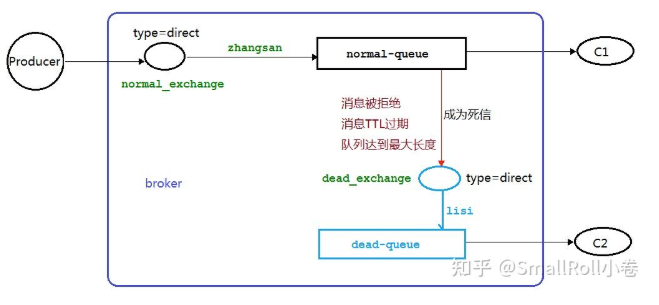

生产者

```java
public class Producer {
    private static final String NORMAL_EXCHANGE = "normal_exchange";    // 普通交换机名称

    public static void main(String[] args) throws Exception {
        // 创建channel
        Channel channel = utils.RabbitMqUtils.getChannel();
        // 声明普通交换机
        channel.exchangeDeclare(NORMAL_EXCHANGE, BuiltinExchangeType.DIRECT);
        // 设置消息到TTL时间为10s=10000ms
        AMQP.BasicProperties properties = new AMQP.BasicProperties().builder().expiration("10000").build();
        // 发送10条消息
        for (int i = 0; i < 10; i++) {
            String message = i + "";
            channel.basicPublish(NORMAL_EXCHANGE, "zhangsan", properties, message.getBytes());
            System.out.println("生产者发送消息：" + message);
        }
    }
}
```

消费者

```java
public class Consumer01 {
    private static final String NORMAL_EXCHANGE = "normal_exchange";    // 普通交换机名称
    private static final String DEAD_EXCHANGE = "dead_exchange";    // 死信交换机名称
    private static final String NORMAL_QUEUE = "normal_queue";  // 普通队列名称
    private static final String DEAD_QUEUE = "dead_queue";  // 死信队列名称

    public static void main(String[] args) throws Exception {
        // 创建channel
        Channel channel = RabbitMqUtils.getChannel();
        // 声明普通和死信交换机(类型都为DIRECT)
        channel.exchangeDeclare(NORMAL_EXCHANGE, BuiltinExchangeType.DIRECT);
        channel.exchangeDeclare(DEAD_EXCHANGE, BuiltinExchangeType.DIRECT);
        // 声明普通和死信队列(普通队列需要传递参数设置死信交换机及其对应的路由key)
        Map<String, Object> arguments = new HashMap<>();
        arguments.put("x-dead-letter-exchange", DEAD_EXCHANGE); // 设置死信交互机
        arguments.put("x-dead-letter-routing-key", "lisi"); // 设置与死信交换机间的routing-key
        channel.queueDeclare(NORMAL_QUEUE, false, false, false, arguments);
        channel.queueDeclare(DEAD_QUEUE, false, false, false, null);
        // 绑定队列与交换机,设置其间的路由key
        channel.queueBind(NORMAL_QUEUE, NORMAL_EXCHANGE, "zhangsan");
        channel.queueBind(DEAD_QUEUE, DEAD_EXCHANGE, "lisi");
        // 消费消息
        System.out.println("Consumer01等待接收普通队列到消息......");
        DeliverCallback deliverCallback = (consumerTag, message) -> {
            System.out.println("Consumer01接收到普通队列的消息:" + new String(message.getBody()));
        };
        CancelCallback cancelCallback = (consumerTag) -> {
            System.out.println("消息消费被中断");
        };
        channel.basicConsume(NORMAL_QUEUE, deliverCallback, cancelCallback);
    }
}
```

#### 7. 延迟队列

延时队列，队列内部是有序的，最重要的特性就体现在它的延时属性上，延时队列中的元素是希望在指定时间到了以后或之前取出和处理，简单来说，延时队列就是用来存放需要在指定时间被处理的元素的队列。

rabbitmq中设置过期时间 TTL 有两种方式，一种是为消息设置 `correlationData,getMessageProperties().setExpiration(ttlTime)`，一种是为队列设置 `aruments.put("x-message-ttl", 5000)，channel.queueDeclare(NORAML_QUEUE, false, false, false, arguments)` ，为队列设置的ttl属性一旦消息过期就会立马被丢弃或者放入死信队列，而消息过期有可能因为队列的积压还会在队列存活一段时间（因为消息是否过期并被丢弃这个判断是由消费者判断的）

实现延迟队列可以通过TTL+死信队列来实现，当处理的消息过期时，就会把消息放入死信队列，然后再由消费者消费即可实现

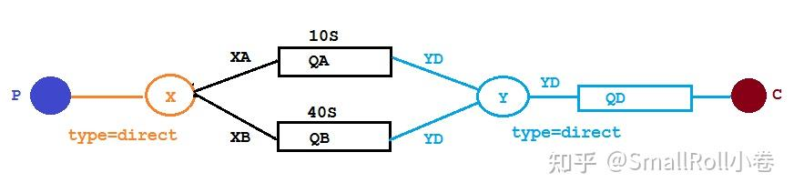

```java
@Configuration
public class QueueTTLDelay {
    public static final String X_EXCHANGE = "X";
    public static final String QUEUE_A = "QA";
    public static final String QUEUE_B = "QB";
    public static final String Y_DEAD_LETTER_EXCHANGE = "Y";
    public static final String DEAD_LETTER_QUEUE = "QD";

    // 声明交换机X
    @Bean("xExchange")
    public DirectExchange xExchange() {
        return new DirectExchange(X_EXCHANGE);
    }

    // 声明死信交换机Y
    @Bean("yExchange")
    public DirectExchange yExchange() {
        return new DirectExchange(Y_DEAD_LETTER_EXCHANGE);
    }

    // 声明队列QA,设置队列的ttl为10s并绑定死信交换机
    @Bean("queueA")
    public Queue queueA() {
        Map<String, Object> arguments = new HashMap<>();
        // 声明当前队列绑定的死信交换机
        arguments.put("x-dead-letter-exchange", Y_DEAD_LETTER_EXCHANGE);
        // 声明当前队列的死信routing-key
        arguments.put("x-dead-letter-routing-key", "YD");
        // 声明队列的 TTL
        arguments.put("x-message-ttl", 10000);
        return QueueBuilder.durable(QUEUE_A).withArguments(arguments).build();
    }

    // 声明队列QB,设置队列的ttl为40s并绑定死信交换机
    @Bean("queueB")
    public Queue queueB() {
        Map<String, Object> arguments = new HashMap<>();
        // 声明当前队列绑定的死信交换机
        arguments.put("x-dead-letter-exchange", Y_DEAD_LETTER_EXCHANGE);
        // 声明当前队列的死信routing-key
        arguments.put("x-dead-letter-routing-key", "YD");
        // 声明队列的 TTL
        arguments.put("x-message-ttl", 40000);
        return QueueBuilder.durable(QUEUE_B).withArguments(arguments).build();
    }

    // 声明死信队列QD
    @Bean("queueD")
    public Queue queueD() {
        return new Queue(DEAD_LETTER_QUEUE);
    }

    // 死信队列QD绑定死信交换机Y
    @Bean
    public Binding deadLetterBindingQAD(@Qualifier("queueD") Queue queueD, @Qualifier("yExchange") DirectExchange yExchange) {
        return BindingBuilder.bind(queueD).to(yExchange).with("YD");
    }

    // 队列A绑定X交换机
    @Bean
    public Binding queueABindExchangeX(@Qualifier("queueA") Queue queueA, @Qualifier("xExchange") DirectExchange xExchange) {
        return BindingBuilder.bind(queueA).to(xExchange).with("XA");
    }

    // 队列B绑定X交换机
    @Bean
    public Binding queueBBindExchangeX(@Qualifier("queueB") Queue queueB, @Qualifier("xExchange") DirectExchange xExchange) {
        return BindingBuilder.bind(queueB).to(xExchange).with("XB");
    }
}
```

编写生产者

```java
@RestController
@Slf4j
public class SendMessageController {
    @Autowired
    private RabbitTemplate rabbitTemplate;

    @GetMapping("sendMsg/{message}")
    public void sendMsg(@PathVariable String message) {
        log.info("当前时间:{},发送一条信息给两个TTL队列:{}", new Date(), message);
        rabbitTemplate.convertAndSend("X", "XA", "消息来自ttl=10s的队列" + message);
        rabbitTemplate.convertAndSend("X", "XB", "消息来自ttl=40s的队列" + message);
    }
}
```

编写消费者

```java
Slf4j
@Component
public class MessageConsumer {
    @RabbitListener(queues = "QD")
    public void receiveD(Message message, Channel channel) throws IOException {
        String msg = new String(message.getBody());
        log.info("当前时间:{},收到死信队列信息{}", new Date().toString(), msg);
    }
}
```

#### 8. 优先级队列

为消息设置优先级

```java
Map<String, Object> params = new HashMap();
params.put("x-max-priority", 10);   // 官方允许是0～255之间,此处设置为10,即允许优先级范围从0～10（不要设置过大以免浪费cpu和内存）
channel.queueDeclare("hello", true, false, false, params);

// 2.消息中代码添加优先级（要在队列优先级设置的范围内）
AMQP.BasicProperties properties = new AMQP.BasicProperties().builder().priority(5).build();
channel.basicPublish("",QUEUE_NAME,properties,message.getBytes());
```

### 五、最佳实践

#### 1. 发布任务

通过 api 请求服务，服务在 MessageBroker 类下

```python
async def publish_ocr_task(self, message: TaskMessage):
    """Publish OCR task"""
    await self.publish(message, routing_key="task.ocr.submit")

async def publish_llm_task(self, message: TaskMessage):
    """Publish LLM task"""
    await self.publish(message, routing_key="task.llm.convert")

async def publish_db_task(self, message: TaskMessage):
    """Publish DB task"""
    await self.publish(message, routing_key="task.db.save")
```

将信息通过交换机 exchange 发布到对应的队列，利用 topics 主题方式

```python
async def publish(
    self,
    message: TaskMessage,
    routing_key: str,
    priority: Optional[int] = None
):
    """
    Publish a task message to the exchange

    Args:
        message: TaskMessage to publish
        routing_key: Routing key (e.g., "task.ocr.submit")
        priority: Message priority (0-10), defaults to message.priority
    """
    if not self._initialized:
        await self.initialize()

    priority = priority or message.priority
    body = message.to_json().encode('utf-8')

    async with self.get_channel() as channel:
        # Get exchange
        exchange = await channel.get_exchange(self.exchange_config['name'])

        # Create message
        aio_message = Message(
            body=body,
            delivery_mode=DeliveryMode.PERSISTENT,  # Persist to disk
            priority=priority,
            content_type="application/json",
            message_id=message.task_id,
            timestamp=asyncio.get_event_loop().time()
        )

        # Publish
        await exchange.publish(
            message=aio_message,
            routing_key=routing_key
        )

        logger.info(
            f"📤 Published message: task_id={message.task_id}, "
            f"type={message.task_type.value}, routing_key={routing_key}, priority={priority}"
        )
```

进行初始化，初始化connection连接，channel 通道，exchange交换机，queue队列

```python
async def initialize(self):
        """Initialize connection pools and declare exchanges/queues"""
        if self._initialized:
            logger.warning("MessageBroker already initialized")
            return

        logger.info(f"🔗 Initializing RabbitMQ connection to {self.rabbitmq_config['host']}:{self.rabbitmq_config['port']}")

        # Create connection pool
        self._connection_pool = Pool(
            self._create_connection,
            max_size=self.rabbitmq_config['max_connections'],
            loop=asyncio.get_event_loop()
        )

        # Create channel pool
        self._channel_pool = Pool(
            self._create_channel,
            max_size=self.rabbitmq_config['max_channels_per_connection'],
            loop=asyncio.get_event_loop()
        )

        # Declare exchange and queues
        async with self._channel_pool.acquire() as channel:
            await self._declare_exchange(channel)
            await self._declare_all_queues(channel)

        self._initialized = True
        logger.info("✅ MessageBroker initialized successfully")
```

将 channel 通道预取值设置为 1，实现不公平分发，防止消息堆积

```python
async def _create_channel(self) -> AbstractRobustChannel:
      """Create a channel from the connection pool"""
      async with self._connection_pool.acquire() as connection:
          channel = await connection.channel()
          await channel.set_qos(prefetch_count=1)  # Default QoS
          logger.debug(f"Created new RabbitMQ channel: {channel}")
          return channel
```

定义channel对应的交换机，包括死信交换机

```python
async def _declare_exchange(self, channel: Channel):
        """Declare the main topic exchange"""
        self._exchange = await channel.declare_exchange(
            name=self.exchange_config['name'],
            type=aio_pika.ExchangeType.TOPIC,
            durable=self.exchange_config['durable'],
            auto_delete=self.exchange_config.get('auto_delete', False)
        )
        logger.info(f"📢 Declared exchange: {self.exchange_config['name']} (type: topic)")

        # Declare dead letter exchange
        dlx_exchange = await channel.declare_exchange(
            name="dlx_exchange",
            type=aio_pika.ExchangeType.TOPIC,
            durable=True,
            auto_delete=False
        )
        logger.info(f"📢 Declared dead letter exchange: dlx_exchange")
```

设置队列的 TTL 等参数，并通过 topics 模式绑定到交换机，并和 channel 绑定起来

```python
async def _declare_all_queues(self, channel: Channel):
        """Declare all queues (OCR, LLM, DB, DLQ)"""
        # Declare main queues
        for queue_type in ['ocr', 'llm', 'db']:
            queue_config = config.get_queue_config(queue_type)
            await self._declare_queue(channel, queue_config)

        # Declare dead letter queue
        dlq = await channel.declare_queue(
            name="dead_letter_queue",
            durable=True,
            auto_delete=False,
            arguments={
                "x-message-ttl": 86400000  # 24 hours
            }
        )
        await dlq.bind("dlx_exchange", routing_key="task.*.failed")
        logger.info(f"🪦 Declared dead letter queue: dead_letter_queue")

    async def _declare_queue(self, channel: Channel, queue_config: Dict[str, Any]):
        """Declare a single queue with configuration"""
        arguments = {
            "x-max-priority": queue_config['priority'],
            "x-message-ttl": queue_config['ttl'],
        }

        # Add dead letter exchange if enabled
        if queue_config.get('enable_dlx', False):
            arguments["x-dead-letter-exchange"] = queue_config.get('dlx_name', 'dlx_exchange')
            # Use the queue name directly in routing key to match existing setup
            arguments["x-dead-letter-routing-key"] = f"task.{queue_config['name']}.failed"

        queue = await channel.declare_queue(
            name=queue_config['name'],
            durable=queue_config.get('durable', True),
            auto_delete=queue_config.get('auto_delete', False),
            arguments=arguments
        )

        # Bind to exchange
        await queue.bind(self._exchange, routing_key=queue_config['routing_key'])
        self._queues[queue_config['name']] = queue

        logger.info(
            f"📬 Declared queue: {queue_config['name']} "
            f"(priority: {queue_config['priority']}, ttl: {queue_config['ttl']}ms, "
            f"routing: {queue_config['routing_key']})"
        )
```

#### 2. 消费任务

`main` 函数启动连接池，start后回调用consume方法，然后consume方法会回调具体 worker 的 process 方法

```python
async def start(self):
        """Start all worker pools"""
        if self.running:
            logger.warning("AsyncPipelineManager already running")
            return

        logger.info("=" * 80)
        logger.info("🚀 Starting Async Pipeline Manager")
        logger.info("=" * 80)

        try:
            # Initialize MongoDB connection
            logger.info("💾 Initializing MongoDB connection...")
            mongo_url = app_config.mongo_url
            connect('caelumenai', host=mongo_url, alias='caelumenai')
            logger.info("✅ MongoDB connected")

            # Initialize message broker
            logger.info("📡 Initializing message broker...")
            self.broker = await get_broker()

            # Start OCR worker pool
            ocr_config = self.config['workers']['ocr']
            logger.info(f"🔍 Starting OCR worker pool ({ocr_config['num_workers']} workers)...")
            self.ocr_pool = OCRWorkerPool(
                broker=self.broker,
                config=self.ocr_worker_config,
                ocr_host=app_config.ocr_host
            )
            await self.ocr_pool.start()

            # Start LLM worker pool
            llm_config = self.config['workers']['llm']
            logger.info(f"🤖 Starting LLM worker pool ({llm_config['num_workers']} workers)...")
            self.llm_pool = LLMWorkerPool(
                broker=self.broker,
                config=self.llm_worker_config
            )
            await self.llm_pool.start()

            # Start DB worker pool
            db_config = self.config['workers']['db']
            logger.info(f"💾 Starting DB worker pool ({db_config['num_workers']} workers)...")
            self.db_pool = DBWorkerPool(
                broker=self.broker,
                config=self.db_worker_config,
                batch_size=db_config['batch_size'],
                batch_timeout=db_config['batch_timeout']
            )
            await self.db_pool.start()

            self.running = True

            logger.info("=" * 80)
            logger.info("✅ Async Pipeline Manager started successfully!")
            logger.info("=" * 80)
            logger.info("")
            logger.info("Worker Pool Summary:")
            logger.info(f"  OCR Workers:  {ocr_config['num_workers']} workers × {ocr_config['concurrency_per_worker']} concurrent")
            logger.info(f"  LLM Workers:  {llm_config['num_workers']} workers × {llm_config['concurrency_per_worker']} concurrent")
            logger.info(f"  DB Workers:   {db_config['num_workers']} workers (batch: {db_config['batch_size']})")
            logger.info("")
            logger.info("Queue Configuration:")
            ocr_queue = self.config['queues']['ocr']
            llm_queue = self.config['queues']['llm']
            db_queue = self.config['queues']['db']
            logger.info(f"  OCR Queue:    {ocr_queue['name']} (TTL: {ocr_queue['ttl']/1000:.0f}s)")
            logger.info(f"  LLM Queue:    {llm_queue['name']} (TTL: {llm_queue['ttl']/1000:.0f}s)")
            logger.info(f"  DB Queue:     {db_queue['name']} (TTL: {db_queue['ttl']/1000:.0f}s)")
            logger.info("")
            logger.info("Press Ctrl+C to stop...")
            logger.info("=" * 80)

        except Exception as e:
            logger.error(f"❌ Failed to start AsyncPipelineManager: {e}", exc_info=True)
            await self.stop()
            raise
```


`queue.iterator()` 就是不断的监听消息并找到对应的消费

```python
async def consume(
        self,
        queue_name: str,
        callback: Callable,
        prefetch_count: int = 1
    ):
        """
        Consume messages from a queue

        Args:
            queue_name: Queue name to consume from
            callback: Async callback function(message: aio_pika.IncomingMessage)
            prefetch_count: Number of messages to prefetch
        """
        if not self._initialized:
            await self.initialize()

        async with self.get_channel() as channel:
            # Set QoS
            await channel.set_qos(prefetch_count=prefetch_count)

            # Get queue
            queue = await channel.get_queue(queue_name)

            logger.info(
                f"👂 Starting to consume from queue: {queue_name} "
                f"(prefetch: {prefetch_count})"
            )

            # Start consuming
            async with queue.iterator() as queue_iter:
                async for message in queue_iter:
                    try:
                        await callback(message)
                    except Exception as e:
                        logger.error(f"❌ Error processing message: {e}", exc_info=True)
                        # Reject and requeue on error
                        await message.reject(requeue=False)
```

实现消费者基类

定义一个抽象方法让子类继承修改

```python
@abstractmethod
async def process_task(self, task: TaskMessage) -> TaskResult:
    """
    Process a single task

    Args:
        task: TaskMessage to process

    Returns:
        TaskResult with success status and data/error

    Raises:
        Exception: On processing error
    """
    pass
```

调用consume方法

```python
async def start(self):
        """Start the worker"""
        self.running = True
        logger.info(f"🚀 Worker {self.worker_id} started")

        await self.broker.consume(
            queue_name=self.config.queue_config.name,
            callback=self._handle_message,
            prefetch_count=self.config.queue_config.prefetch_count
        )
```

设计回调函数，主要就是调用子类的process方法，然后返回ack，或者失败重试，一直失败返回nack

```python
async def _handle_message(self, message: IncomingMessage):
        """
        Handle incoming message with retry logic and error handling

        Args:
            message: RabbitMQ incoming message
        """
        async with self.semaphore:
            task_id = None
            start_time = datetime.now(timezone.utc)

            try:
                # Parse message
                task = TaskMessage.from_json(message.body.decode('utf-8'))
                task_id = task.task_id

                logger.info(
                    f"📥 [{self.worker_id}] Received task: {task_id} "
                    f"(type: {task.task_type.value})"
                )

                # Process task with timeout
                try:
                    result = await asyncio.wait_for(
                        self.process_task(task),
                        timeout=self.config.task_timeout
                    )
                except asyncio.TimeoutError:
                    raise TimeoutError(
                        f"Task {task_id} timed out after {self.config.task_timeout}s"
                    )

                # Update statistics
                processing_time = (datetime.now(timezone.utc) - start_time).total_seconds()
                self._tasks_processed += 1
                self._total_processing_time += processing_time

                logger.info(
                    f"✅ [{self.worker_id}] Completed task: {task_id} "
                    f"({processing_time:.2f}s)"
                )

                # ACK message
                await message.ack()

            except Exception as e:
                error_msg = f"{type(e).__name__}: {str(e)}"
                logger.error(
                    f"❌ [{self.worker_id}] Failed task: {task_id} - {error_msg}",
                    exc_info=True
                )

                # Get retry count from message headers
                retry_count = self._get_retry_count(message)

                # 新增检查：如果 max_retries=0，直接发送到 DLQ
                if self.config.max_retries == 0:
                    logger.warning(
                        f"🚫 [{self.worker_id}] Retry disabled for task: {task_id} "
                        f"- Sending to DLQ"
                    )
                    await message.nack(requeue=False)
                    self._tasks_failed += 1
                    return  # 重要：直接返回

                if retry_count < self.config.max_retries:
                    # Calculate delay with exponential backoff
                    if self.config.exponential_backoff:
                        delay = self.config.retry_delay * (2 ** retry_count)
                    else:
                        delay = self.config.retry_delay

                    logger.info(
                        f"♻️ [{self.worker_id}] Retrying task: {task_id} "
                        f"(attempt {retry_count + 1}/{self.config.max_retries}, "
                        f"delay: {delay}s)"
                    )

                    # Wait before requeue to avoid immediate retry
                    await asyncio.sleep(delay)

                    # Increment retry count and requeue
                    await self._requeue_with_retry_count(message, retry_count + 1)
                else:
                    # Max retries exceeded: send to DLQ
                    logger.error(
                        f"💀 [{self.worker_id}] Max retries exceeded for task: {task_id} "
                        f"({self.config.max_retries} attempts)"
                    )
                    await message.nack(requeue=False)  # Send to DLQ

                self._tasks_failed += 1
```


