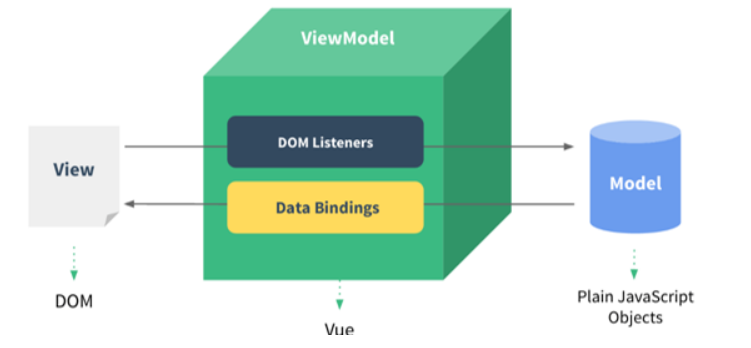
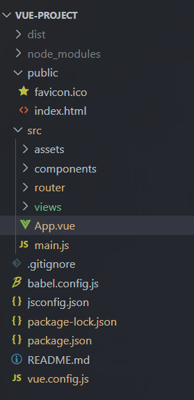

## 前端

### 一、html、css、javascript

#### 1.空格与换行

空格为 `&nbsp;` 换行为 `<br>` 

#### 2.css分类

| 名称     | 示例                                          |
| -------- | --------------------------------------------- |
| 行内样式 | `<h1 style="xx:xx">xxx</h1>`                  |
| 内嵌样式 | `<style> h1{} </style>`                       |
| 外联样式 | `<link rel="stylesheet" href="css/news.css">` |

#### 3.css选择器

| 名称                   | 示例                                | 用法               |
| ---------------------- | ----------------------------------- | ------------------ |
| 元素选择器             | div{<br/>     color: red;<br/> }    | 在对应标签生效     |
| id选择器（优先级最高） | #did {<br/>    color: blue;<br/>}   | `<h1 id="did">`    |
| 类选择器               | .cls{<br/>     color: green;<br/> } | `<h1 class="cls">` |

#### 4.常用标签与属性

* `` src为地址，alt为如果图片加载不出来显示的文本
* `<a href="" target="">` href为指定资源的url，target为在何处打开网站（_self为默认在当前页面打开， _blank表示空白页）
* `<video>` 和 `<audio>` 也是src表示地址，controls表示播放控件，直接写controls表示打开
* color表示颜色，可以用（r,g,b）或者编码表示
* font_size为字体大小
* text_align为对齐方式
* text-indent: 设置段落的首行缩进 
* line-height: 设置行高

#### 5.盒子模型

1. `<span>` 主要就是为了配合css使用，没有实际意义，就是框住一个内容，可以对它样式进行调整
2. `<div>` 用法一样，两个标签之间会换行
   * width和height表示宽度与高度
   * padding表示内边距
   * border表示边框
   * margin表示外边距，即盒子与网页边框的距离

```html
div {
    width: 200px;  /* 宽度 */
    height: 200px;  /* 高度 */
    box-sizing: border-box; /* 指定width height为盒子的高宽 */
    background-color: aquamarine; /* 背景色 */

    padding: 20px 20px 20px 20px; /* 内边距, 上 右 下 左 , 边距都一行, 可以简写: padding: 20px;*/ 
    border: 10px solid red; /* 边框, 宽度 线条类型 颜色 */
    margin: 30px 30px 30px 30px; /* 外边距, 上 右 下 左 , 边距都一行, 可以简写: margin: 30px; */
}
```

#### 6.表格

- \<table> : 用于定义整个表格, 可以包裹多个 &lt;tr>， 常用属性如下： 
  - border：规定表格边框的宽度(不指定默认为0)
  - width：规定表格的宽度
  - cellspacing: 规定单元之间的空间
- &lt;tr> : 表格的行，可以包裹多个 &lt;td>  
- &lt;td> : 表格单元格(普通)，可以包裹内容 , 如果是表头单元格，可以替换为 &lt;th>  

```html
<!DOCTYPE html>
<html lang="en">
<head>
    <meta charset="UTF-8">
    <meta http-equiv="X-UA-Compatible" content="IE=edge">
    <meta name="viewport" content="width=device-width, initial-scale=1.0">
    <title>HTML-表单</title>
</head>
<body>
    <!-- 
    form表单属性: 
        action: 表单提交的url, 往何处提交数据 . 如果不指定, 默认提交到当前页面
        method: 表单的提交方式 .
            get: 在url后面拼接表单数据, 比如: ?username=Tom&age=12 , url长度有限制 . 默认值
            post: 在消息体(请求体)中传递的, 参数大小无限制的.
    -->   
	
    <form action="" method="post">
        用户名: <input type="text" name="username">
        年龄: <input type="text" name="age">

        <input type="submit" value="提交">
    </form>
	
</body>
</html>
```

#### 7.表单

- 表单场景: 表单就是在网页中负责数据采集功能的，如：注册、登录的表单。 
- 表单标签: &lt;form>
- name属性是传递键并用来区分不同的多选框，id属性必须是唯一的，value属性是传递值（button会自动显示在button上，text会作为文本默认值），即按钮或者文本框默认
- 表单属性:
  - action: 规定表单提交时，向何处发送表单数据，表单提交的URL。
  - method: 规定用于发送表单数据的方式，常见为： GET、POST。
    - GET：表单数据是拼接在url后面的， 如： xxxxxxxxxxx?username=Tom&age=12，url中能携带的表单数据大小是有限制的。
    - POST： 表单数据是在请求体（消息体）中携带的，大小没有限制。
- 表单项标签: 不同类型的input元素、下拉列表、文本域等。注意一定要有name属性，否则无法提交
  - input: 定义表单项，通过type属性控制输入形式
  - select: 定义下拉列表
  - textarea: 定义文本域

```html
<!DOCTYPE html>
<html lang="en">
<head>
    <meta charset="UTF-8">
    <meta http-equiv="X-UA-Compatible" content="IE=edge">
    <meta name="viewport" content="width=device-width, initial-scale=1.0">
    <title>HTML-表单项标签</title>
</head>
<body>

<!-- value: 表单项提交的值 -->
<form action="" method="post">
     姓名: <input type="text" name="name"> <br><br>
     密码: <input type="password" name="password"> <br><br> 
     性别: <input type="radio" name="gender" value="1"> 男
          <label><input type="radio" name="gender" value="2"> 女 </label> <br><br>
     爱好: <label><input type="checkbox" name="hobby" value="java"> java </label>
          <label><input type="checkbox" name="hobby" value="game"> game </label>
          <label><input type="checkbox" name="hobby" value="sing"> sing </label> <br><br>
     图像: <input type="file" name="image">  <br><br>
     生日: <input type="date" name="birthday"> <br><br>
     时间: <input type="time" name="time"> <br><br>
     日期时间: <input type="datetime-local" name="datetime"> <br><br>
     邮箱: <input type="email" name="email"> <br><br>
     年龄: <input type="number" name="age"> <br><br>
     学历: <select name="degree">
               <option value="">----------- 请选择 -----------</option>
               <option value="1">大专</option>
               <option value="2">本科</option>
               <option value="3">硕士</option>
               <option value="4">博士</option>
          </select>  <br><br>
     描述: <textarea name="description" cols="30" rows="10"></textarea>  <br><br>
     <input type="hidden" name="id" value="1">
	 	
     <!-- 表单常见按钮 -->
     <input type="button" value="按钮">
     <input type="reset" value="重置"> 
     <input type="submit" value="提交">   
     <br>
</form>

</body>
</html>
```

#### 8.JavaScript基础

* 引入方式：`<script> </script>` 在标签之间写js代码，另一种是外部引入 `<script src="js/demo.js"></script>` 

* 输出方式：

  1. `alert()` 打开页面是弹出警告框
  2. `document.write()` 在 HTML 中输出内容
  3. `console.log()` 写在浏览器控制台

* 变量：`var` 声明的是全局变量，`let` 声明的是局部变量，`const` 表示常量

* 函数：`function add(a, b) {return a + b;}`

* 数组：可变长度，可以在一个数组中存储不同类型的变量，它实际是一个特殊的对象，下标是键对应对象的属性，值是存储的数据，具有自动扩容机制，不要求数组连续存放，有点类似于map容器，常用方法有 `push` 表示在末尾添加元素，`splice(bg, len)` 表示从bg开始删除长度为len的子串

* 字符串：`charAt()`  返回在指定位置的字符。 ` indexOf()`  检索字符串。 ` trim()  `去除字符串两边的空格  `substring(l, r) ` 提取字符串中两个指定的索引号之间的字符。

* 对象的定义方法：

  ```javascript
  var 对象名 = {
      属性名1: 属性值1, 
      属性名2: 属性值2,
      属性名3: 属性值3,
      函数名称: function(形参列表){}
  };
  ```

* json对象:

  ```javascript
  {
      "key":value,
      "key":value,
      "key":value
  }
  ```

  ```javascript
  // //定义json
      var jsonstr = '{"name":"Tom", "age":18, "addr":["北京","上海","西安"]}';
      //alert(jsonstr.name);
  
      // //json字符串--js对象
      var obj = JSON.parse(jsonstr);
      //alert(obj.name);
  
      // //js对象--json字符串
      alert(JSON.stringify(obj));
  ```

* BOM对象：浏览器对象模型，主要就是window的属性，有alert，confirm，循环执行setInterval(fn,毫秒值)，执行一次setTimeout(fn,毫秒值)，location设置地址

* DOM对象：用来获取标签，返回值可能是数组或者元素，可以用innerHTML属性来更改内容

  document.getElementById()  根据id属性值获取，返回单个Element对象  document.getElementsByTagName()  根据标签名称获取，返回Element对象数组  document.getElementsByName()  根据name属性值获取，返回Element对象数组  document.getElementsByClassName()  根据class属性值获取，返回Element对象数组

* 事件：即完成某种操作后的执行动作，常见的事件有 `onclick()` 点击按钮 `onblur()` 失去焦点 `onfoucs()` 是获得焦点，两种事件处理的方式

  ```js
  <body>
      <input type="button" id="btn1" value="事件绑定1" onclick="on()">
      <input type="button" id="btn2" value="事件绑定2">
  </body>
  
  <script>
      function on(){
          alert("按钮1被点击了...");
      }
  
      document.getElementById('btn2').onclick = function(){
          alert("按钮2被点击了...");
      }
  
  </script>
  ```

  

#### 9.回调函数

回调函数是指将一个函数作为参数传递给另外一个函数，并在该函数内部执行，如下就是一个匿名函数传递给arr的foreach函数运行，原理就是每次arr循环会自动调用匿名函数，将当前下标的值传入函数中处理

```javascript
arr.forEach(function(e){
     console.log(e);
})
```

回调函数分为异步回调和同步回调，其中异步回调类似于多线程（隔一段时间调用），可以继续执行主线程相关代码，不会影响，注意下面的`()=>` 表示箭头函数

```javascript
function loadData(callback) {
    console.log("开始加载数据...");
    setTimeout(() => {
        console.log("数据加载完成");
        callback(); // 调用回调函数
    }, 2000);
}
```

### 二、Vue框架

#### 1.基础

Vue.js 使用响应式系统来追踪数据变化。一旦数据发生变化，视图会自动更新，保持数据与视图的同步。

el 表示作用的标签名，data 表示数据，methods表示函数

```javascript
new Vue({
  el: '#app',
  data: {
    message: 'Hello Vue!'
  },
  methods: {
      handle:functiton() {}
  }
});
```

v-model 是绑定数字模型，如果表单中的文本框变化，那么下面的插值表达式也会自动改变

```html
<body>
    <div id="app">
        <input type="text" v-model="message">
        {{message}}
    </div>
</body>
```

MVVM:其实是Model-View-ViewModel的缩写，有3个单词，具体释义如下：

- Model: 数据模型，特指前端中通过请求从后台获取的数据
- View: 视图，用于展示数据的页面，可以理解成我们的html+css搭建的页面，但是没有数据
- ViewModel: 数据绑定到视图，负责将数据（Model）通过JavaScript的DOM技术，将数据展示到视图（View）上



| **指令**  | **作用**                                                    |
| --------- | ----------------------------------------------------------- |
| v-bind    | 为HTML标签绑定属性值，如设置  href , css样式等，可以简写为: |
| v-model   | 在表单元素上创建双向数据绑定                                |
| v-on      | 为HTML标签绑定事件                                          |
| v-if      | 条件性的渲染某元素，判定为true时渲染,否则不渲染             |
| v-else    | 应该用span标签写if else等                                   |
| v-else-if |                                                             |
| v-show    | 根据条件展示某元素，区别在于切换的是display属性的值         |
| v-for     | 列表渲染，遍历容器的元素或者对象的属性                      |

#### 2.vue开发流程

vue运行的时候，会依次调用 index.html，然后 index.html 默认会链接到 main.js，之后main.js引入了App.vue



下面是index.html的代码，其中主要就是将app这个id绑定到div标签上

```html
<!DOCTYPE html>
<html lang="">
  <head>
    <meta charset="utf-8">
    <meta http-equiv="X-UA-Compatible" content="IE=edge">
    <meta name="viewport" content="width=device-width,initial-scale=1.0">
    <link rel="icon" href="<%= BASE_URL %>favicon.ico">
    <title><%= htmlWebpackPlugin.options.title %></title>
  </head>
  <body>
    <noscript>
      <strong>We're sorry but <%= htmlWebpackPlugin.options.title %> doesn't work properly without JavaScript enabled. Please enable it to continue.</strong>
    </noscript>
    <div id="app"></div>
    <!-- built files will be auto injected -->
  </body>
</html>
```

下面是main.js代码，将vue创建的dom对象挂载到app标签下面，并引入App.vue

```javascript
import Vue from 'vue'
import App from './App.vue'
import router from './router'
import ElementUI from 'element-ui';
import 'element-ui/lib/theme-chalk/index.css';

Vue.config.productionTip = false
Vue.use(ElementUI);

new Vue({
  router,
  render: h => h(App)
}).$mount('#app')

```

下面是App.vue的代码，分为template(模板部分，主要是HTML代码，用来展示页面主体结构的),script(js代码区域，主要是通过js代码来控制模板的数据来源和行为的),style（css样式部分，主要通过css样式控制模板的页面效果得）三个部分，注意下面data()是一个方法，每次一个新对象都会独立调用，数据不共享

```vue
<template>
  <div>
    <!-- <element-view></element-view> -->
    <!-- <emp-view></emp-view>
    <dept-view></dept-view> -->
    <router-view></router-view>
  </div>
</template>

<script>
// import DeptView from './views/tlias/DeptView.vue'
// import EmpView from './views/tlias/EmpView.vue'
// import ElementView from './views/element/ElementView.vue'
export default {
  // components: { ElementView },
  components:{
    // EmpView,
    // DeptView

  },
  data() {
    return {
      message: "Hello vue222"
    }
  },
  methods: {

  }
}
</script>

<style>

</style>
```

之后再src/view文件夹下面创建.vue文件，用来存放组件，组件可以去ElementUI官网查看并使用，之后再App.vue中引入对应的文件，下面是一个视图文件的代码的一部分，其中prop代表绑定的对象模型的属性，label代表这个列的列名

```vue
<template>
    <el-table
      :data="tableData"
      style="width: 100%">
      <el-table-column
        prop="date"
        label="日期"
        width="180">
      </el-table-column>
      <el-table-column
        prop="name"
        label="姓名"
        width="180">
      </el-table-column>
      <el-table-column
        prop="address"
        label="地址">
      </el-table-column>
    </el-table>
  </template>

  <script>
    export default {
      data() {
        return {
          tableData: [{
            date: '2016-05-02',
            name: '王小虎',
            address: '上海市普陀区金沙江路 1518 弄'
          }, {
            date: '2016-05-04',
            name: '王小虎',
            address: '上海市普陀区金沙江路 1517 弄'
          }, {
            date: '2016-05-01',
            name: '王小虎',
            address: '上海市普陀区金沙江路 1519 弄'
          }, {
            date: '2016-05-03',
            name: '王小虎',
            address: '上海市普陀区金沙江路 1516 弄'
          }]
        }
      }
    }
  </script>
```

searchForm为表单对象，每一个都要用v-model绑定，tableData为表格数组，每一行对应一个元素，且用promp指定每一列对应的属性

```vue
return {
            searchForm: {
                name: '',
                gender: '',
                data: []
            },
            tableData: [

            ]
        }
```

最后还要引入vue路由，主要是在点击页面不同选项的时候实现页面的切换，其中path代表路径，name代表这个路径对应的名字，component表示这个路径指向的界面，router-link代表路由链接，router-view代表路由视图

```vue
const routes = [
  {
    path: '/emp',
    name: 'emp',
    component:  () => import('../views/tlias/EmpView.vue')
  },
  {
    path: '/dept',
    name: 'dept',
    component: () => import('../views/tlias/DeptView.vue')
  },
  {
    path: '/',
    redirect:'/emp' //表示重定向到/emp即可
  },
]
```

```vue
<el-menu-item index="1-1">
    <router-link to="/dept">部门管理</router-link>
</el-menu-item>
<el-menu-item index="1-2">
    <router-link to="/emp">员工管理</router-link>
</el-menu-item>
```

```vue
<template>
  <div id="app">
    <!-- {{message}} -->
    <!-- <element-view></element-view> -->
    <!-- <emp-view></emp-view> -->
    <router-view></router-view>
  </div>
</template>

<script>
// import EmpView  './views/tlias/EmpView.vue'
// import ElementView  './views/Element/ElementView.vue'
export default {
  components: { },
  data(){
    return {
      "message":"hello world"
    }
  }
}
</script>
<style>

</style>
```


### 三、前后端交互技术

#### 1.Ajax

数据一般是存储在服务器上面的，前端获取数据就可以通过 Ajax 技术，向后台服务器发起请求，后台服务器接受前端的请求后，从数据库获取必要资源，然后响应会前端，具体步骤如下

第一步先创建一个http连接请求对象，然后通过get或者post方式获取请求，然后通过open方法获得连接，之后通过onreadystatechange属性确定目前状态，然后通过send函数响应请求。

注意下面只能用箭头函数，因为箭头函数是静态绑定的，this指向的就是钩子函数中的this，而如果用function()的话this指向的就是xhr这个对象，即它是动态绑定的

```javascript
<script>
    new Vue({
        el: "#app",
        data: {
            users: []
        },
        methods: {

        },
        mounted() {
            var xhr = new XMLHttpRequest();
            xhr.open("GET", "https://mock.apifox.cn/m1/3128855-0-default/emp/list");
            xhr.onreadystatechange = () => {
                if(xhr.readyState == 4 && xhr.status == 200) {
                    this.users = JSON.parse(xhr.responseText).data;
                }
            };
            xhr.send();
        },
    })
</script>
```

#### 2.Axios

Axios对应的是Ajax的框架，有两种调用方式，一般可以写在钩子函数中，或者在函数里面和表单某些操作绑定，注意下面的result就是返回的对象，result.data是最常用的属性，就是json格式，和上面的xhr的responseText是不同的

```javascript
//通过axios发送异步请求-get
 axios({
     method: "get",
     url: "http://yapi.smart-xwork.cn/mock/169327/emp/list"
 }).then(result => {
     console.log(result.data);
 })

//通过axios发送异步请求-post
 axios({
     method: "post",
     url: "http://yapi.smart-xwork.cn/mock/169327/emp/deleteById",
     data: "id=1"
 }).then(result => {
     console.log(result.data);
 })

axios.get("http://yapi.smart-xwork.cn/mock/169327/emp/list").then(result => {
    console.log(result.data);
})

axios.post("http://yapi.smartxwork.cn/mock/169327/emp/deleteById","id=1").then(result => {
    console.log(result.data);
})
```

### 四、前端部署

#### 1.nginx服务器

可以将写好的前端程序部署到nginx服务器上，这样访问套接字就可以找到对应的前端界面，基本步骤是在 nginx/html 目录下面放入资源（看后面一句话），资源是运行 npm 脚本的 build 按钮，然后会生成一个dist目录，资源即此目录，然后运行 nginx.exe 即可启动 nginx

#### 2.nginx反向代理和负载均衡

前端发送的请求和后端接口地址是不一样的，如前端请求地址：http://localhost/api/employee/login

后端接口地址：http://localhost:8080/admin/employee/login，那么是如何请求到后端服务的呢？

采用的是反向代理技术，那么浏览器请求后端服务为什么不直接使用后端接口地址，而需要前端请求地址呢？

- 提高访问速度

  因为nginx本身可以进行缓存，如果访问的同一接口，并且做了数据缓存，nginx就直接可把数据返回，不需要真正地访问服务端，从而提高访问速度。

- 进行负载均衡

  所谓负载均衡,就是把大量的请求按照我们指定的方式均衡的分配给集群中的每台服务器，常见的负载均衡方法有随机、轮询等。

- 保证后端服务安全

  因为一般后台服务地址不会暴露，所以使用浏览器不能直接访问，可以把nginx作为请求访问的入口，请求到达nginx后转发到具体的服务中，从而保证后端服务的安全。

nginx反向代理的配置方式如下

**nginx 反向代理的配置方式：**

```nginx
upstream webservers{
    server 192.168.100.128:8080;
    server 192.168.100.129:8080;
}
server{
    listen 80;
    server_name localhost;
    
    location /api/{
        proxy_pass http://webservers/admin;#负载均衡
    }
}
```

**proxy_pass：**该指令是用来设置代理服务器的地址，可以是主机名称，IP地址加端口号等形式。

如上代码的含义是：监听80端口号， 然后当我们访问 http://localhost:80/api/../..这样的接口的时候，它会通过 location /api/ {} 这样的反向代理到 http://localhost:8080/admin/上来。

其中 **upstream** 表示的是负载均衡配置，如果代理服务器是一组服务器的话，我们可以使用upstream指令配置后端服务器组

接下来，进到nginx-1.20.2\conf，打开nginx配置

```nginx
# 反向代理,处理管理端发送的请求
location /api/ {
	proxy_pass   http://localhost:8080/admin/;
    #proxy_pass   http://webservers/admin/;
}
```

当在访问http://localhost/api/employee/login，nginx接收到请求后转到http://localhost:8080/admin/，故最终的请求地址为http://localhost:8080/admin/employee/login，和后台服务的访问地址一致。

### 五、浏览器、脚本、插件

#### 1. 浏览器的同源策略

同源策略是浏览器的一个重要安全机制，限制一个网页只能向同一个域名、协议、端口发送请求。

```text
https://weiban.mycourse.cn/page1  ✅ 可以请求
https://weiban.mycourse.cn/api    ✅ 可以请求

http://weiban.mycourse.cn/api     ❌ 协议不同
https://other.com/api             ❌ 域名不同
https://weiban.mycourse.cn:8080/  ❌ 端口不同
```

如果想要绕开同源策略检测，请求不同的 $URL$ 可以采用下面的方法

```javascript
// ==UserScript==
// @grant        GM_xmlhttpRequest  ← 申请特殊权限
// @connect      117.72.179.172     ← 声明要连接的外部域名
// ==/UserScript==

// 这个请求可以成功，不受同源策略限制
GM_xmlhttpRequest({
    method: 'GET',
    url: 'http://117.72.179.172:5252/query_answer.php?question=题目内容',
    onload: function(response) {
        console.log('跨域请求成功:', response.responseText);
    }
});
```

- 用户脚本管理器（如 Tampermonkey）作为"中介"

- 脚本通过管理器发送请求，而不是直接通过浏览器

- 管理器有更高的权限，可以访问外部域名

### 六、TypeScript

#### 1. 基础类型

TypeScript 提供了对 JavaScript 原始类型的强类型支持。

```typescript
let str: string = "hello";
let num: number = 123;
let bool: boolean = true;
let arr: number[] = [1, 2, 3];
let tuple: [string, number] = ["age", 18];  // 元组
let n: null = null;
let u: undefined = undefined;
let anyVal: any = "anything"; // 任意类型
```

#### 2. 枚举（enum）

枚举用于定义一组命名常量。

```typescript
enum Direction {
  Up,
  Down,
  Left,
  Right
}
let d: Direction = Direction.Up;
```

#### 3. 函数类型

函数可以指定参数和返回值类型。

```typescript
function add(x: number, y: number): number {
  return x + y;
}

let sub: (x: number, y: number) => number;
sub = (a, b) => a - b;
```

#### 4. 接口（interface）

接口用于约束对象的结构。

```typescript
interface User {
  id: number;
  name: string;
  age?: number;  // 可选属性
}

let u: User = { id: 1, name: "Alice" };
```

#### 5. 类与继承

TypeScript 支持基于类的面向对象编程。

```typescript
class Person {
  constructor(public name: string) {}
  greet() {
    console.log(`Hi, I'm ${this.name}`);
  }
}

class Student extends Person {
  constructor(name: string, public grade: number) {
    super(name);
  }
}

const s = new Student("Bob", 3);
s.greet();
```

#### 6. 泛型（Generics）

泛型让函数、接口和类更加灵活。

```typescript
function identity<T>(arg: T): T {
  return arg;
}

let output1 = identity<string>("hello");
let output2 = identity<number>(123);
```

#### 7. 类型断言与类型守卫

- 类型断言：告诉编译器你更清楚类型。

```typescript
let someVal: unknown = "hello";
let strLen: number = (someVal as string).length;
```

- 类型守卫：运行时缩小类型范围。

```typescript
function printLength(val: string | number) {
  if (typeof val === "string") {
    console.log(val.length);
  }
}
```

#### 8. 高级类型：联合类型、交叉类型

```typescript
type ID = string | number; // 联合类型
type UserInfo = { name: string } & { age: number }; // 交叉类型
let user: UserInfo = { name: "Alice", age: 20 };
```

#### 9. 工具类型（Utility Types）

TypeScript 提供了常用的工具类型：

```typescript
interface User {
  id: number;
  name: string;
  age: number;
}

type PartialUser = Partial<User>;   // 所有属性可选
type PickUser = Pick<User, "id">;   // 只要 id
type ReadonlyUser = Readonly<User>; // 属性只读
type UserRecord = Record<string, User>; // 字典结构
```

#### 10. 模块与命名空间

- **模块化**（推荐）：

```typescript
// file: math.ts
export function add(a: number, b: number) { return a + b; }

// file: app.ts
import { add } from "./math";
console.log(add(1, 2));
```

#### 11. 装饰器（Decorators）

装饰器是实验特性，用于注解类。

```typescript
function Logger(target: Function) {
  console.log("Logging...");
}

@Logger
class Person {}
```

#### 12. 类型推断与类型兼容

- **推断**：TS 会自动推断类型。

```typescript
let x = 10; // 推断为 number
```

- **兼容性**：结构类型系统，只要结构满足即可。

```typescript
interface Named { name: string }
let obj = { name: "Alice", age: 20 };
let n: Named = obj; // ✅ 兼容
```

#### 13. 高级技巧：条件类型与映射类型

```typescript
// 条件类型
type IsString<T> = T extends string ? true : false;
type A = IsString<string>; // true
type B = IsString<number>; // false

// 映射类型
type ReadonlyObj<T> = { readonly [K in keyof T]: T[K] };
```

#### 14. 实战：类型安全的 API 响应

```typescript
interface ApiResponse<T> {
  code: number;
  data: T;
  msg: string;
}

type User = { id: number; name: string };
const res: ApiResponse<User> = {
  code: 200,
  data: { id: 1, name: "Alice" },
  msg: "ok"
};
```

#### 15. Promise

1. **什么是 Promise？**

- **Promise** 是 JavaScript 用来处理 **异步操作** 的一种机制。
- 它表示一个 **未来才会结束** 的操作（可能成功也可能失败）。
- 就像一个“承诺单子”：现在还没结果，但将来会有结果。

2. **Promise 的三种状态**

一个 Promise 有三种状态（状态一旦改变，就不会再变）：

**pending**（进行中）

- 初始状态，还没有结果。

**fulfilled**（已成功）

- 异步操作完成，并返回了一个值。
- 会触发 `.then(...)` 的回调。

**rejected**（已失败）

- 异步操作出错（或主动抛出错误）。
- 会触发 `.catch(...)` 的回调。

3. **Promise 的基本用法**

创建一个 Promise

```javascript
const p = new Promise((resolve, reject) => {
  setTimeout(() => {
    resolve("成功结果");  // 成功
    // reject("出错了");  // 失败
  }, 1000);
});
```

使用 `.then` 和 `.catch`

```javascript
p.then(result => {
  console.log("成功:", result);
}).catch(error => {
  console.error("失败:", error);
});
```

4. **Promise 链式调用**

Promise 可以 **链式调用**，解决了传统回调函数的“回调地狱”：

```javascript
fetch("https://example.com/data")
  .then(response => response.json())
  .then(data => {
    console.log("拿到数据:", data);
  })
  .catch(err => {
    console.error("出错:", err);
  });
```

5. **`async/await` 与 Promise**

- `async` 函数 **自动返回一个 Promise**。
- `await` 可以暂停函数执行，直到 Promise 结束，再返回结果。

例如你那段代码：

```javascript
async function getBrowser(): Promise<Browser> {
  browser = await chromium.launch(); // 等待 Promise 返回结果
  return browser; // 实际上等于 Promise.resolve(browser)
}
```

等价于：

```javascript
getBrowser().then(browser => {
  console.log("启动好了:", browser);
});
```

✅ **一句话总结**：
 Promise 是 **未来的结果的容器**。

- 现在没有结果（pending），
- 成功了（fulfilled）→ `.then()` 处理，
- 失败了（rejected）→ `.catch()` 处理。