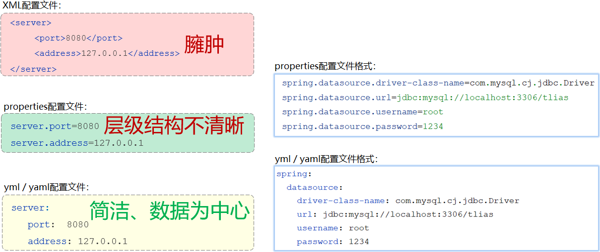
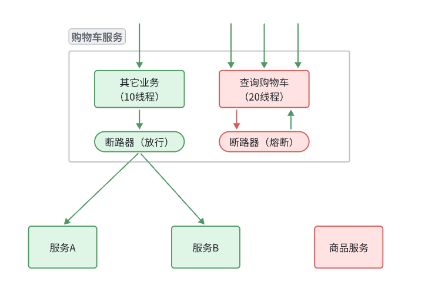

## 后端

### 一、Maven

#### 1.maven简介

maven是一个重要的项目管理和构建工具，项目构建管理基于POM文件构建，在pom.xml中用于定义项目信息、依赖、构建插件等内容，pom的依赖是可以传递的，形成一个树形结构，会自动下载所有依赖，有着标准的目录结构，包括以下几个部分： `src/main/java`：Java源代码， `src/main/resources`：资源文件， `src/test/java`：测试代码，`src/test/resources`：测试资源文件，`target`：编译和打包后的输出目录

同时他还有生命周期管理，提供了clean，complie，package等构建阶段，他们是基于插件实现的

#### 2.依赖的配置

依赖传递可以分为：

1. 直接依赖：在当前项目中通过依赖配置建立的依赖关系

2. 间接依赖：被依赖的资源如果依赖其他资源，当前项目间接依赖其他资源


引入依赖

```xml
<dependencies>
    <!-- 第1个依赖 : logback -->
    <dependency>
        <groupId>ch.qos.logback</groupId>
        <artifactId>logback-classic</artifactId>
        <version>1.2.11</version>
    </dependency>
    <!-- 第2个依赖 : junit -->
    <dependency>
        <groupId>junit</groupId>
        <artifactId>junit</artifactId>
        <version>4.12</version>
    </dependency>
</dependencies>
```

排除依赖

```xml
<dependency>
    <groupId>com.itheima</groupId>
    <artifactId>maven-projectB</artifactId>
    <version>1.0-SNAPSHOT</version>
   
    <!--排除依赖, 主动断开依赖的资源-->
    <exclusions>
    	<exclusion>
            <groupId>junit</groupId>
            <artifactId>junit</artifactId>
        </exclusion>
    </exclusions>
</dependency>
```

依赖范围可以通过 <scope> 标签规定范围

### 二、springboot

#### 1.核心介绍

Spring 和 Springboot 都是 Java 的框架，用于简化企业级应用程序的开发，Spring Framework 提供了一系列模块，但需要大量的XML配置和依赖管理，需要手动配置一些资源较为麻烦，而 Springboot 是 Spring 的扩展框架，旨在减少Spring应用的配置复杂度，简化了开发。

下面是 Web 开发的一个基本过程，当浏览器中输入要访问的地址，点击回车后，会讲请求发送到服务器端，然后servlet服务器（如tomcat）会解析地址内容，找对ip地址和端口访问指定的程序，并且根据 '/hello' 找到要访问的资源，然后把数据解析并返回浏览器并通过前端技术渲染展示。将本地上的静态资源部署到 tomcat/webapps 文件夹里面，然后运行 tomcat，然后再浏览器中输入对应的地址即可访问资源。注意Springboot中内嵌了 tomcat，所以不需要部署，可以直接运行。而Springboot框架中，通常是通过 Controller 包下的类来响应 HTML 请求 


#### 2.依赖配置

下面是配置文件 pom.xml，parent是父工程，会指定版本号，后面所有依赖的版本号都由它来管理，以spring-boot-starter 开头的是起步依赖，下面引入了包含 web开发和单元测试的常见依赖

```xml
<?xml version="1.0" encoding="UTF-8"?>
<project xmlns="http://maven.apache.org/POM/4.0.0" xmlns:xsi="http://www.w3.org/2001/XMLSchema-instance"
         xsi:schemaLocation="http://maven.apache.org/POM/4.0.0 https://maven.apache.org/xsd/maven-4.0.0.xsd">
    <modelVersion>4.0.0</modelVersion>
    <parent>
        <groupId>org.springframework.boot</groupId>
        <artifactId>spring-boot-starter-parent</artifactId>
        <version>3.3.5</version>
        <relativePath/> <!-- lookup parent from repository -->
    </parent>
    <groupId>com.itheima</groupId>
    <artifactId>demo1</artifactId>
    <version>0.0.1-SNAPSHOT</version>
    <name>demo1</name>
    <description>demo1</description>
    <url/>
    <licenses>
        <license/>
    </licenses>
    <developers>
        <developer/>
    </developers>
    <scm>
        <connection/>
        <developerConnection/>
        <tag/>
        <url/>
    </scm>
    <properties>
        <java.version>23</java.version>
    </properties>
    <dependencies>
        <dependency>
            <groupId>org.springframework.boot</groupId>
            <artifactId>spring-boot-starter-web</artifactId>
        </dependency>

        <dependency>
            <groupId>org.springframework.boot</groupId>
            <artifactId>spring-boot-starter-test</artifactId>
            <scope>test</scope>
        </dependency>
    </dependencies>

    <build>
        <plugins>
            <plugin>
                <groupId>org.springframework.boot</groupId>
                <artifactId>spring-boot-maven-plugin</artifactId>
            </plugin>
        </plugins>
    </build>

</project>

```

#### 3.接受请求与响应流程

在Tomcat这类Web服务器中，是不识别我们自己定义的Controller的。但是我们前面讲到过Tomcat是一个Servlet容器，是支持Serlvet规范的，所以呢，在tomcat中是可以识别 Servlet程序的。 那我们所编写的XxxController 是如何处理请求的，又与Servlet之间有什么联系呢？

其实呢，在SpringBoot进行web程序开发时，它内置了一个核心的Servlet程序 DispatcherServlet，称之为 核心控制器。 DispatcherServlet 负责接收页面发送的请求，然后根据执行的规则，将请求再转发给后面的请求处理器Controller，请求处理器处理完请求之后，最终再由DispatcherServlet给浏览器响应数据。


那将来浏览器发送请求，会携带请求数据，包括：请求行、请求头；请求到达tomcat之后，tomcat会负责解析这些请求数据，然后呢将解析后的请求数据会传递给Servlet程序的HttpServletRequest对象，那也就意味着 HttpServletRequest 对象就可以获取到请求数据。 而Tomcat，还给Servlet程序传递了一个参数 HttpServletResponse，通过这个对象，我们就可以给浏览器设置响应数据 。


web开发缓存


#### 4.请求

##### 1.简单传参

@RestController = @Controller + @ResponseBody(自动将返回值转化为json对象作为服务器响应数据)

 `@RequestMapping`注解用于将HTTP请求映射到特定的控制器方法上。`"/simpleParam"`是该方法的路径，表示访问`http://localhost:8080/simpleParam`时会触发该方法。 

注意参数要和传递的形参保持一致

```java
@RestController
public class RequestController {
    // http://localhost:8080/simpleParam?name=Tom&age=10
    // 第1个请求参数： name=Tom   参数名:name，参数值:Tom
    // 第2个请求参数： age=10     参数名:age , 参数值:10
    
    //springboot方式
    @RequestMapping("/simpleParam")
    public String simpleParam(String name , Integer age ){//形参名和请求参数名保持一致
        System.out.println(name+"  :  "+age);
        return "OK";
    }
}
```

##### 2.参数名不一致映射

注意 @RequestParam 默认 required = true，也就是必须传递

```java
@RestController
public class RequestController {
    // http://localhost:8080/simpleParam?name=Tom&age=20
    // 请求参数名：name

    //springboot方式
    @RequestMapping("/simpleParam")
    public String simpleParam(@RequestParam("name") String username , Integer age ){
        System.out.println(username+"  :  "+age);
        return "OK";
    }
}
```

##### 3.传递对象

上面三个注解分别是用来定义 setter/getter，构造函数，toString方法

```java
@Data
@AllArgsConstructor
@NoArgsConstructor
public class Address {
    private String province;
    private String city;
}

```

```java
@Data
@NoArgsConstructor
@AllArgsConstructor
public class User {
    private String name;
    private Integer age;
    private Address address;
}

```

```java
@RestController
public class RequestController {

    @RequestMapping("/simplePojo")
        public String simpleParam(User user) {
        System.out.println(user);
        return "success";
    }
}
```

传递参数按照如下格式，下面是postman软件，是用来测试后端接口的，即假设前端发送一下数据，观察后端是否可以成功响应


##### 4.传递数组和集合

```java
@RestController
public class RequestController {
    //数组集合参数
    @RequestMapping("/arrayParam")
    public String arrayParam(String[] hobby){
        System.out.println(Arrays.toString(hobby));
        return "OK";
    }
}
```

```java
@RestController
public class RequestController {
    //数组集合参数
    @RequestMapping("/listParam")
    public String listParam(@RequestParam List<String> hobby){
        System.out.println(hobby);
        return "OK";
    }
}
```

@RequestParam 可以设置默认值

```java
public class EmpController {
    @Autowired
    private EmpService empService;

    @GetMapping
    public Result page(@RequestParam(defaultValue = "1") Integer page, @RequestParam(defaultValue = "10") Integer pageSize) {
        log.info("分页查询：{}，{}", page, pageSize);
        PageBean page1 = empService.page(page, pageSize);
        return Result.success(page1);
    }
}
```


传递参数方法有两种：

```java
http://localhost:8080/listParam?hobby=game&hobby=java
http://localhost:8080/listParam?hobby=game,java
```

##### 5.日期参数

```java
@RestController
public class RequestController {
    //日期时间参数
   @RequestMapping("/dateParam")
    public String dateParam(@DateTimeFormat(pattern = "yyyy-MM-dd HH:mm:ss") LocalDateTime updateTime){
        System.out.println(updateTime);
        return "OK";
    }
}
```

##### 6.路径参数

```java
http://localhost:8080/user/1		
http://localhost:880/user/1/0
```

1. **`@RequestMapping` 中定义的占位符 `{id}`**

`@RequestMapping("/path/{id}")` 中的 `{id}` 是一个路径变量的占位符。它告诉 Spring，该路径中 `{id}` 是一个动态部分，会根据实际请求的值来匹配。例如，当请求路径为 `/path/123` 时，`123` 会作为 `{id}` 的值被传递。

2. **`@PathVariable` 的作用**

`@PathVariable` 注解的作用是将 URL 路径中的变量（这里是 `{id}`）映射到方法的参数上。Spring 框架在处理请求时会解析 URL 中的路径，并自动将 `{id}` 的值赋给带有 `@PathVariable` 注解的方法参数 `id`。

```java
@RestController
public class RequestController {
    //路径参数
    @RequestMapping("/path/{id}")
    public String pathParam(@PathVariable Integer id){
        System.out.println(id);
        return "OK";
    }
}
```

当前端发送的是json格式的数据，通过@RequestBody将其转化为对应的对象类型，有些字段可能为null，需要在service层处理

```java
@PostMapping
public Result insert(@RequestBody Dept dept) {
    log.info("新增部门：{}", dept);
    deptService.insert(dept);
    return Result.success();
}
```


#### 5.响应

为了使得前端开发人员拿到的响应数据有统一的规范，后端响应数据应该具有相同的返回值，一般为如下规范：

code表示响应码，msg表示响应信息，data表示响应数据


```java
public class Result {
    private Integer code;//响应码，1 代表成功; 0 代表失败
    private String msg;  //响应码 描述字符串
    private Object data; //返回的数据

    public Result() { }
    public Result(Integer code, String msg, Object data) {
        this.code = code;
        this.msg = msg;
        this.data = data;
    }

    public Integer getCode() {
        return code;
    }

    public void setCode(Integer code) {
        this.code = code;
    }

    public String getMsg() {
        return msg;
    }

    public void setMsg(String msg) {
        this.msg = msg;
    }

    public Object getData() {
        return data;
    }

    public void setData(Object data) {
        this.data = data;
    }

    //增删改 成功响应(不需要给前端返回数据)
    public static Result success(){
        return new Result(1,"success",null);
    }
    //查询 成功响应(把查询结果做为返回数据响应给前端)
    public static Result success(Object data){
        return new Result(1,"success",data);
    }
    //失败响应
    public static Result error(String msg){
        return new Result(0,msg,null);
    }
}
```

#### 6.三层架构

如果把所有代码都写在Controller中那么会导致过于冗长，并且不好调试，所以一般会采用分层的思路

在我们项目开发中，可以将代码分为三层：


- Controller：控制层。接收前端发送的请求，对请求进行处理，并响应数据。
- Service：业务逻辑层。处理具体的业务逻辑。
- Dao：数据访问层(Data Access Object)，也称为持久层。负责数据访问操作，包括数据的增、删、改、查。

逻辑处理和数据访问的方式都有很多，所以要定义一个接口，然后再用具体类去实现。下面代码中我们发现在控制层和处理层中都有其他类对象的实现，没有实现低耦合，因此要采用IOC&DI来实现


#### 7.IOC&DI

IOC控制反转，就是将对象的控制权交给Spring的IOC容器，由IOC容器创建及管理对象。IOC容器创建的对象称为bean对象。如果要将某个对象交给IOC容器管理，需要在类上加一个注解：@Component。为了区分不同的层，在实际开发过程中都用下面三个代替。

- @Controller    （标注在控制层类上）
- @Service          （标注在业务层类上）
- @Repository    （标注在数据访问层类上）

注意这三个包必须在同一层，否则组件扫描扫描不到。

DI依赖注入，依赖注入，是指IOC容器要为应用程序去提供运行时所依赖的资源，而资源指的就是对象。比如上面的 `private EmpDao empDao = new EmpDaoA();` 这里如果变成另一个实现类需要修改代码较为麻烦，所以我们通过注解 @Autowried 来依赖注入，它默认是按照**类型**进行自动装配的（去IOC容器中找某个类型的对象，然后完成注入操作），所以会产生一个问题，如果有多个实现类，那么就会报错，因此要通过注解指定具体的实现类

使用@Primary注解：当存在多个相同类型的Bean注入时，加上@Primary注解，来确定默认的实现。

 

使用@Qualifier注解：指定当前要注入的bean对象。 在@Qualifier的value属性中，指定注入的bean的名称。

- @Qualifier注解不能单独使用，必须配合@Autowired使用


使用@Resource注解：是按照bean的名称进行注入。通过name属性指定要注入的bean的名称。注意和@Autowired的区别，@Resource是根据名字注入，而@Autowired是根据类型注入。


> dom4j用来将XML解析为java对象，lomback用于生成getter，setter，构造函数等方法

**注意：**必须是由Spring管理的容器用@Autowired才有用，因为Spring容器启动后会先扫描@Component类或者@Configuration的类，把这些类交给IOC容器管理，然后注入@Autowired标注的对象，如果是我们自己创建的对象，是不会自动注入的

如果不是Spring管理的类，那么想用bean对象可以采用下面的方法，从Spring上下文中找到对应的bean对象

```java
GenieConfig genieConfig = SpringContextHolder.getApplicationContext().getBean(GenieConfig.class);
```

#### 8. CDI上下文与依赖注入

$CDI$ 是 $Java \ EE$ 规范，其不依赖于 $Spring$ 框架，我们平时用可以直接用 $Spring$ 框架提供的 $@ Autowired$ 

**核心注解**

1. **@Inject**

   - 用于依赖注入。
   - 放在构造方法、字段、setter 方法或参数上，告诉 CDI 容器要自动注入相应的 Bean。

   ```java
   public class UserService {
       @Inject
       private UserRepository repository;
   }
   ```

2. **@Qualifier**

   - 当有多个实现时，用来区分要注入哪个 Bean。
   - 需要自定义注解并加上 `@Qualifier`。

   ```java
   @Qualifier
   @Retention(RUNTIME)
   @Target({FIELD, TYPE, METHOD})
   public @interface Admin {}
   
   public class UserService {
       @Inject @Admin
       private UserRepository adminRepository;
   }
   ```

3. **@Named**

   - 给 Bean 取一个名字，可以在 EL 表达式或配置中引用。

   ```java
   @Named("userService")
   public class UserService { ... }
   ```

**作用域相关注解（管理 Bean 生命周期）**

- **@ApplicationScoped**：整个应用一个实例（单例）。
- **@SessionScoped**：每个用户会话一个实例。
- **@RequestScoped**：每个 HTTP 请求一个实例。
- **@Dependent**（默认作用域）：没有上下文依赖，每次注入都会新建对象。
- **@ConversationScoped**：会话中更细粒度的作用域，可以手动控制开始/结束。

**生命周期与生产相关**

1. **@Produces**

   - 用于定义“生产方法”或“生产字段”，告诉 CDI 如何生成某个对象。

   ```java
   public class DatabaseProducer {
       @Produces
       public Connection createConnection() {
           return DriverManager.getConnection(...);
       }
   }
   ```

2. **@Disposes**

   - 和 `@Produces` 配合，用来销毁 Bean。

   ```java
   public void closeConnection(@Disposes Connection conn) {
       conn.close();
   }
   ```

3. **@PostConstruct**

   - Bean 初始化完成后调用的方法。

   ```java
   @PostConstruct
   public void init() {
       System.out.println("Bean 已初始化");
   }
   ```

4. **@PreDestroy**

   - Bean 销毁前调用的方法。

### 三、Mybatis

#### 1.介绍

Mybatis是持久层框架，用于简化JDBC开发（JDBC就是因为有不同的数据库，如Mysql，Oracle等，那么写java程序的时候连接数据库就是一个问题，解决方法就是用统一的api接口）。

#### 2.配置

首先要连接对应的数据库，通过application.properties配置即可

```properties
#驱动类名称
spring.datasource.driver-class-name=com.mysql.cj.jdbc.Driver
#数据库连接的url
spring.datasource.url=jdbc:mysql://localhost:3306/mybatis
#连接数据库的用户名
spring.datasource.username=root
#连接数据库的密码
spring.datasource.password=1234
```

#### 3.编写SQL语句

> @Mapper注解：表示是mybatis中的Mapper接口
>
> - 程序运行时：框架会自动生成接口的实现类对象(代理对象)，并给交Spring的IOC容器管理
>
> @Select注解：代表的就是select查询，用于书写select查询语句

```java
import com.itheima.pojo.User;
import org.apache.ibatis.annotations.Mapper;
import org.apache.ibatis.annotations.Select;
import java.util.List;

@Mapper
public interface UserMapper {
    
    //查询所有用户数据
    @Select("select id, name, age, gender, phone from user")
    public List<User> list();
    
}
```

写完后可以在test文件夹下面进行单元测试

```java
@SpringBootTest
public class MybatisQuickstartApplicationTests {
	
    @Autowired
    private UserMapper userMapper;
	
    @Test
    public void testList(){
        List<User> userList = userMapper.list();
        for (User user : userList) {
            System.out.println(user);
        }
    }

}
```

数据库连接池是一个容器，负责分配和管理数据库连接，允许程序重复使用某个现有的数据库连接，而不用每次都建立在释放

分页查询可以利用分页插件PageHelper完成，后面的Mapper只需要写正常的select语句即可，不需要写分页limit

```java
@Service
public class EmpServiceImpl implements EmpService {
    @Autowired
    private EmpMapper empMapper;

    @Override
    public PageBean page(Integer pageNum, Integer pageSize) {
        PageHelper.startPage(pageNum, pageSize);

        List<Emp> empList = empMapper.list();
        Page<Emp> p = (Page<Emp>) empList;

        PageBean pageBean = new PageBean(p.getTotal(), p.getResult());
        return pageBean;
    }
}
```


#### 4.预编译SQL

就是sql语句是delete from emp where id=?; 编译以后先把这个缓存起来，后面在执行的时候，不会再次编译，只有参数发生变化。

SQL注入是因为一般非预编译sql都是直接将请求参数拼接到sql语句中

```sql
select count(*) from emp where username='?' and password = '?' 
那么username=tseata(随便写) password='or '1' = 1
select count(*) from emp where username='tseata' and password = ''or'1'='1'
后面恒为真,所以会注入
```

#### 5.参数占位符

#{...} 会自动将这一部分替换为？，然后生成预编译SQL,之后自动设置参数值

${...} 直接将参数拼接进去，有sql注入问题 

@Options(useGeneratedKeys = true,keyProperty = "id")会自动生成主键并赋值给当前对象的主键（注意主键必须是有自增属性）

注意同一个mapper接口下面select，delete等都只能出现一次

```java
@Mapper
public interface EmpMapper {

//    @Select("select * from emp where id=#{id}")
//    public Emp select(Integer id);

    @Delete("delete from emp where id = #{id}")
    public void delete(Integer id);

    @Options(useGeneratedKeys = true, keyProperty = "id")
    @Insert("insert into emp(username, name, gender, image, job, entrydate, dept_id, create_time, update_time) " +
            "values(#{username}, #{name}, #{gender}, #{image}, #{job}, #{entrydate}, #{deptId}, #{createTime}, #{updateTime})")
    public void insert(Emp emp);

    @Update("update emp set username=#{username}, name=#{name}, gender=#{gender}, image=#{image}, job=#{job}," +
            "entrydate=#{entrydate}, dept_id=#{deptId}, update_time=#{updateTime} where id=#{id}")
    public void update(Emp emp);

    @Select("select * from emp " +
            "where name like concat('%', #{name}, '%') " +
            "and entrydate between #{begin} and #{end} " +
            "order by update_time desc")
    public List<Emp> selectAll(String name, LocalDate begin, LocalDate end);

}
```

```java
@SpringBootTest
class SpringbootMybatisCrudApplicationTests {
    @Autowired
    private EmpMapper empMapper;

//    @Test
//    public void testSelect() {
//        Emp emp = empMapper.select(10);
//        System.out.println(emp);
//    }

    @Test
    public void testDelete() {
        empMapper.delete(10);
    }

    @Test
    public void testInsert() {
        Emp emp = new Emp();
        emp.setUsername("jack1");
        emp.setName("杰克1");
        emp.setImage("1.jpg");
        emp.setGender((short)1);
        emp.setJob((short)1);
        emp.setEntrydate(LocalDate.of(2000,1,1));
        emp.setCreateTime(LocalDateTime.now());
        emp.setUpdateTime(LocalDateTime.now());
        emp.setDeptId(1);
        empMapper.insert(emp);
    }

    @Test
    public void testUpdate(){
        //要修改的员工信息
        Emp emp = new Emp();
        emp.setId(24);
        emp.setUsername("songdaxia");
        emp.setPassword(null);
        emp.setName("老宋");
        emp.setImage("2.jpg");
        emp.setGender((short)1);
        emp.setJob((short)2);
        emp.setEntrydate(LocalDate.of(2012,1,1));
        emp.setCreateTime(null);
        emp.setUpdateTime(LocalDateTime.now());
        emp.setDeptId(2);
        //调用方法，修改员工数据
        empMapper.update(emp);
    }


    @Test
    public void testSelectAll() {
        List<Emp> emps = empMapper.selectAll("张", LocalDate.of(2000, 1, 1), LocalDate.of(2020, 1, 1));
        for (Emp emp : emps) {
            System.out.println(emp);
        }
    }
}
```

#### 6.XML方式配置

xml映射文件的包名和接口名应该和Mapper的包名和接口名一样


```java
@SpringBootTest
class MybatisDongtaiApplicationTests {
    @Autowired
    private EmpMapper empMapper;

    @Test
    public void testDelete() {
        empMapper.delete(2);
    }
}
```

namespace 对应的是Mapper接口名字，在一些标签比如select中还有resultType即返回值类型，这个是指对于单个对象的返回值，比如List\<Emp\> 对应的实际上是 Emp

```xml
<?xml version="1.0" encoding="UTF-8" ?>
<!DOCTYPE mapper
        PUBLIC "-//mybatis.org//DTD Mapper 3.0//EN"
        "https://mybatis.org/dtd/mybatis-3-mapper.dtd">
<mapper namespace="com.itheima.mapper.EmpMapper">
    <delete id="delete">
        delete from emp where id=#{id}
    </delete>
</mapper>
```

- `<if>`

  - 用于判断条件是否成立，如果条件为true，则拼接SQL

  - 形式：

    ~~~xml
    <if test="name != null"> … </if>
    ~~~

- `<where>`

  - where元素只会在子元素有内容的情况下才插入where子句，而且会自动去除子句的开头的AND或OR

- `<set>`

  - 动态地在行首插入 SET 关键字，并会删掉额外的逗号。（用在update语句中）

```xml
<select id="list" resultType="com.itheima.pojo.Emp">
        select * from emp
        <where>
             <!-- if做为where标签的子元素 -->
             <if test="name != null">
                 and name like concat('%',#{name},'%')
             </if>
             <if test="gender != null">
                 and gender = #{gender}
             </if>
             <if test="begin != null and end != null">
                 and entrydate between #{begin} and #{end}
             </if>
        </where>
        order by update_time desc
</select>
```

\<foreach\> 标签用来遍历ids，把遍历到的数据添加进去

```xml
<delete id="deleteSome">
    delete from emp where id in
    <foreach collection="ids" item="id" separator="," open="(" close=")">
        #{id}
    </foreach>
</delete>
```

抽出重复的代码，用sql和include标签完成

```xml
<sql id="commonSelect">
 	select id, username, password, name, gender, image, job, entrydate, dept_id, create_time, update_time from emp
</sql>

<select id="list" resultType="com.itheima.pojo.Emp">
    <include refid="commonSelect"/>
    <where>
        <if test="name != null">
            name like concat('%',#{name},'%')
        </if>
        <if test="gender != null">
            and gender = #{gender}
        </if>
        <if test="begin != null and end != null">
            and entrydate between #{begin} and #{end}
        </if>
    </where>
    order by update_time desc
</select>
```

### 四、文件上传

#### 1.介绍

文件上传就是将本地的文件上传到服务器，供其他用户浏览或者下载。

#### 2.前端部分

注意要写编码类型为 multipart/form-data 否则只会存储文件名字，不会存储具体内容

下面代码表示的是如果点击提交，这个表单会提交到当前路径/upload这个路径下面，这样服务器端通过Controller层来获得提交的数据

```html
<form action="/upload" method="post" enctype="multipart/form-data">
	姓名: <input type="text" name="username"><br>
    年龄: <input type="text" name="age"><br>
    头像: <input type="file" name="image"><br>
    <input type="submit" value="提交">
</form>
```

#### 3.后端部分

##### 1.使用本地存储

我们需要将获得的文件保存到服务器端，不然只会产生临时文件，运行结束后就自动删除，因此我们需要保存到本地磁盘或者用云端保存，否则图片或者文件以后也无法显示

```java
@Slf4j
@RestController
public class UploadController {
 
    @PostMapping("/upload")
    public Result upload(String username, Integer age, MultipartFile image) throws IOException {
        log.info("文件上传：{},{},{}",username,age,image);

        //获取原始文件名
        String originalFilename = image.getOriginalFilename();

        //构建新的文件名
        String extname = originalFilename.substring(originalFilename.lastIndexOf("."));//文件扩展名
        String newFileName = UUID.randomUUID().toString()+extname;//随机名+文件扩展名

        //将文件存储在服务器的磁盘目录
        image.transferTo(new File("E:/images/"+newFileName));

        return Result.success();
    }

}
```

##### 2.使用阿里云存储

只要将官方的上传文件工具类代码拷贝过来即可

下面是将阿里云的相关配置信息抽离出来形成一个类，然后交由Spring的IOC容器管理，后面的工具类通过DI的方式注入依赖

`@ConfigurationProperties` 允许将外部配置的属性自动绑定到一个 Java 类的字段中。通过定义前缀（如 `aliyun.oss`），Spring 会自动将所有以该前缀开头的属性绑定到该类的字段。 他可以将配置文件的属性批量注入到该bean对象的属性当中，所以用这个一定要用@Component声明对象为bean

 ```java
@Data
@AllArgsConstructor
@NoArgsConstructor
@Component
@ConfigurationProperties(prefix = "aliyun.oss")
public class AliOSSProperties {
    private String endpoint;
    private String accessKeyId;
    private String accessKeySecret;
    private String bucketName;
}
 ```

```java
@Component
public class AliOSSUtils {

    @Autowired
    private AliOSSProperties aliOSSProperties;

    /**
     * 实现上传图片到OSS
     */
    public String upload(MultipartFile file) throws IOException {
        String endpoint = aliOSSProperties.getEndpoint();
        String accessKeyId = aliOSSProperties.getAccessKeyId();
        String accessKeySecret = aliOSSProperties.getAccessKeySecret();
        String bucketName = aliOSSProperties.getBucketName();
        // 获取上传的文件的输入流
        InputStream inputStream = file.getInputStream();

        // 避免文件覆盖
        String originalFilename = file.getOriginalFilename();
        String fileName = UUID.randomUUID().toString() + originalFilename.substring(originalFilename.lastIndexOf("."));

        //上传文件到 OSS
        OSS ossClient = new OSSClientBuilder().build(endpoint, accessKeyId, accessKeySecret);
        ossClient.putObject(bucketName, fileName, inputStream);

        //文件访问路径
        String url = endpoint.split("//")[0] + "//" + bucketName + "." + endpoint.split("//")[1] + "/" + fileName;
        // 关闭ossClient
        ossClient.shutdown();
        return url;// 把上传到oss的路径返回
    }
}
```

```java
@Slf4j
@RestController
public class UploadController {
    @Autowired
    private AliOSSUtils aliOSSUtils;

    @RequestMapping("/upload")
    public Result upload(MultipartFile image) throws IOException {
        String url = aliOSSUtils.upload(image);
        return Result.success(url);
    }
}
```

#### 4.配置文件

常见配置文件格式对比如下，一般采用yml配置文件



### 五、登录认证

#### 1.总体描述

登录校验是指我们在服务器端接收到浏览器发出的请求后，应该先对请求进行校验，即判断用户是否完成登录，如果已经登录那么直接执行对应的业务操作，如果没有登录需要让用户登录，由于HTTP协议是无状态的，不会记录历史信息，每次请求都是独立的，因此需要通过一些技术记录会话信息，会话技术就是判断多次请求中是否属于同一个会话，通常有cookie，session，jwt等技术

#### 2.Cookie

在HTTP协议中提供了响应头（Set-Cookie，设置请求数据）和请求头（Cookie，携带数据），但是Cookie不能跨域操作（套接字必须相同），而且不能再移动端，但是它是HTTP协议支持的技术，Cookie的设置和相应都是浏览器自动进行的不需要自己手动设置。

```java
@RestController
public class SessionController {
    @GetMapping("/c1")
    public Result cookie1(HttpServletResponse response) {
        response.addCookie(new Cookie("login_username", "itheima"));
        return Result.success();
    }

    @GetMapping("/c2")
    public Result cookie2(HttpServletRequest request) {
        Cookie[] cookies = request.getCookies();
        for (Cookie cookie : cookies) {
            if (cookie.getName().equals("login_username")) {
                System.out.println(cookie.getValue());
            }
        }
        return Result.success();
    }
}
```

#### 3.Session

Session实际是基于Cookie的会话跟踪技术，具有Cookie的特点，但是他是存储在服务端的，服务器端创建session后tomcat会自动将sessionId写到了浏览器的Cookie中，以后每次请求都会自动带着cookie，每个用户有自己的session，有效期30分钟，但是它的主要问题是存在服务器端，多个不同服务器无法实现共享，如果在每个服务器端都存储一份session那么服务器压力过大，且拷贝数据时可能会出现延时

```java
@RestController
public class SessionController {

    @GetMapping("/s1")
    public Result session1(HttpSession session){
        log.info("HttpSession-s1: {}", session.hashCode());

        session.setAttribute("loginUser", "tom"); //往session中存储数据
        return Result.success();
    }

    @GetMapping("/s2")
    public Result session2(HttpServletRequest request){
        HttpSession session = request.getSession();
        log.info("HttpSession-s2: {}", session.hashCode());

        Object loginUser = session.getAttribute("loginUser"); //从session中获取数据
        log.info("loginUser: {}", loginUser);
        return Result.success(loginUser);
    }
}
```

#### 4.JWT令牌技术

##### 1.介绍

JWT就是将原始的json格式数据进行base64编码，在请求参数或者是请求头中直接传递(通过token字段访问)，由三个部分组成，分别是Header（头，记录令牌类型、签名算法），Payload（有效载荷，即携带一些默认的自定义信息，为Claim类型），Signature（签名，将header和payload和密钥通过指定的签名算法得出），登录成功后会生成令牌，之后每次请求都要携带令牌放在请求头然后由服务器进行校验

##### 2.工具类

注意调用 `JwtUtils.parseJWT(token)` 如果没有发生异常说明解析成功，否则解析失败

```java
public class JwtUtils {

    private static String signKey = "itheima";//签名密钥
    private static Long expire = 43200000L; //有效时间

    /**
     * 生成JWT令牌
     * @param claims JWT第二部分负载 payload 中存储的内容
     * @return
     */
    public static String generateJwt(Map<String, Object> claims){
        String jwt = Jwts.builder()
                .addClaims(claims)//自定义信息（有效载荷）
                .signWith(SignatureAlgorithm.HS256, signKey)//签名算法（头部）
                .setExpiration(new Date(System.currentTimeMillis() + expire))//过期时间
                .compact();
        return jwt;
    }

    /**
     * 解析JWT令牌
     * @param jwt JWT令牌
     * @return JWT第二部分负载 payload 中存储的内容
     */
    
    public static Claims parseJWT(String jwt){
        Claims claims = Jwts.parser()
                .setSigningKey(signKey)//指定签名密钥
                .parseClaimsJws(jwt)//指定令牌Token
                .getBody();
        return claims;
    }
}
```

##### 3.登录控制

```java
@RestController
public class LoginController {
    @Autowired
    private EmpService empService;

    @PostMapping("/login")
    public Result login(@RequestBody Emp emp) {
        Emp loginEmp = empService.login(emp);
        if (loginEmp != null) {
            Map<String, Object> cliams = new HashMap<>();
            cliams.put("id", loginEmp.getId());
            cliams.put("name", loginEmp.getName());
            cliams.put("password", loginEmp.getPassword());
            String token = JwtUtils.generateJwt(cliams);
            return Result.success(token);
        }
        return Result.error("用户名或密码错误");
    }
}
```

#### 5.过滤器Filter

`@WebFilter(urlPatterns = "/*")` 注解用来过滤要拦截的请求路径，由于Filter不能由Springboot自动扫描到，所以要在启动类加一个注解 `@ServletComponentScan` ，过滤器链是指当有多个过滤器的时候，将会按字典序顺序依次通过过滤器

下面的代码就是进行拦截的代码，首先要将请求和响应转化为Http，因为要调用对应的方法，然后判断这个请求路径是否包含login，如果是登录的话不进行拦截即不用进行jwt令牌验证，如果不是登录的话，要从请求头中获取token字段对应的jwt令牌的值（注意区分请求头和请求参数，请求参数是路径中携带的，请求头是单独的），如果jwt是空的话或者无法正确解析都说明令牌错误，无法访问。

```java
@Slf4j
@WebFilter(urlPatterns = "/*")
public class LoginCheckFilter implements Filter {

    @Override
    public void doFilter(ServletRequest servletRequest, ServletResponse servletResponse, FilterChain filterChain) throws IOException, ServletException {
        HttpServletRequest request = (HttpServletRequest) servletRequest;
        HttpServletResponse response = (HttpServletResponse) servletResponse;
        if(request.getRequestURL().toString().contains("/login")) {
            filterChain.doFilter(request, response);
            return;
        }
        String token = request.getHeader("token");
        log.info(token);
        if(StringUtils.isEmpty(token)) {
            log.info("not login");
            Result resonseResult = Result.error("NOT_LOGIN");
            String JSON = JSONObject.toJSONString(resonseResult);
            response.setContentType("application/json;charset=utf-8");
            response.getWriter().write(JSON);
            return;
        }
        try {
            JwtUtils.parseJwt(token);
        } catch (Exception e) {
            log.info("not login!!!");
            Result resonseResult = Result.error("NOT_LOGIN");
            String JSON = JSONObject.toJSONString(resonseResult);
            response.setContentType("application/json;charset=utf-8");
            response.getWriter().write(JSON);
            return;
        }
        filterChain.doFilter(request, response);
    }
}
```

#### 6.拦截器

拦截器是由Spring框架提供的，拦截器由两步操作构成，分别是定义拦截器和注册配置拦截器

```java
@Component
@Slf4j
public class LoginCheckInterceptor implements HandlerInterceptor {
    @Override
    public boolean preHandle(HttpServletRequest request, HttpServletResponse response, Object handler) throws Exception {
        String token = request.getHeader("token");
        if(StringUtils.isEmpty(token)){
            log.info("NOT_LOGIN");
            Result notLogin = Result.error("NOT_LOGIN");
            response.setContentType("application/json;charset=utf-8");
            response.getWriter().write(JSONObject.toJSONString(notLogin));
            return false;
        }
        try {
            JwtUtils.parseJwt(token);
        } catch (Exception e) {
            log.info("NOT_LOGIN");
            Result notLogin = Result.error("NOT_LOGIN");
            response.setContentType("application/json;charset=utf-8");
            response.getWriter().write(JSONObject.toJSONString(notLogin));
            return false;
        }
        return true;
    }
}
```

下面是配置拦截器，`/**` 表示拦截所有路径 `/*` 表示拦截单级路径

```java
@Configuration
public class WebConfig implements WebMvcConfigurer {
    @Autowired
    private LoginCheckInterceptor loginCheckInterceptor;

    @Override
    public void addInterceptors(InterceptorRegistry registry) {
        registry.addInterceptor(loginCheckInterceptor)
                .addPathPatterns("/**")
                .excludePathPatterns("/login");
    }

}
```

#### 7.异常处理

当在某一层中出现异常的时候，处理异常之前的方法就是通过 `try……catch(Exception e)` 或者 `throws Exception` 但是前者会导致代码非常臃肿，后者会最终抛到框架，返回的信息并不是我们统一响应的 `Result` 格式数据，因此我们需要使用全局异常处理器。

异常处理器通过 `@RestControllerAdvice` 注解表明进行异常处理，`@ExceptionHandler` 注解表明拦截的异常类型

```java
@RestControllerAdvice
public class GlobalExceptionHandler {

    @ExceptionHandler(value = Exception.class)
    public Result exceptionHandle(Exception e) {
        e.printStackTrace();
        return Result.error(e.getMessage());
    }
}

```

### 六、事务管理

#### 1.定义

事务是一组操作的集合，它是一个不可分割的单位，要么同时成功要么同时失败，但是如果我们执行解散部门的操作，需要同时删除员工，但是如果解散部门之后出现了异常，没有能够成功删除员工，这样就会产生问题，因此我们需要利用事务将这几个操作放在一起形成一个原子操作，本质上也是AOP编程思想，在开始前会开启事务，在结束后会结束事务

#### 2.实现方式

在spring框架中提供了将多个数据访问控制在一个事务范围内的注解即 `@Transational` ，为当前类或者函数添加事务，通过它的 rollbackfor 属性可以指明其要回滚的异常事务，第二个属性 `@propagation` 用来指明事务的传播行为，当一个事务调用了另外一个事务的时候，被调用的事务要指明是直接加入之前的事务（REQUIRED）还是新建一个事务（REQUIRED_NEW）

```java
@Service
public class DeptLogServiceImpl implements DeptLogService {
    @Autowired
    private DeptLogMapper deptLogMapper;

    @Transactional(propagation = Propagation.REQUIRES_NEW)
    @Override
    public void insert(DeptLog deptLog) {
        deptLogMapper.insert(deptLog);
    }
}
```

### 七、面向切面编程AOP

#### 1.概念

AOP主要就是提取出某些共性的方法，通过动态代理机制，面向一个方法或者多个方法进行编程，我们就称之为面向切面编程。常见的应用场景如事务管理（上面介绍过）、权限控制和记录日志记录执行时间等等。

主要有以下几个核心概念：

* 连接点：JoinPoint，可以被AOP控制的方法
* 通知：Advice，指重复的逻辑即共性功能
* 切入点：PointCut，匹配连接点的条件，通知仅会在切入点方法执行时使用
* 切面：Aspect，切入点和通知结合在一起形成一个切面


* 目标对象：通知所应用的对象

Spring中AOP的通知类型：

- @Around：环绕通知，此注解标注的通知方法在目标方法前、后都被执行，返回值必须是Object，且要自己调用proceed让原始方法执行，其他不需要考虑原始方法执行
- @Before：前置通知，此注解标注的通知方法在目标方法前被执行
- @After ：后置通知，此注解标注的通知方法在目标方法后被执行，无论是否有异常都会执行
- @AfterReturning ： 返回后通知，此注解标注的通知方法在目标方法后被执行，有异常不会执行
- @AfterThrowing ： 异常后通知，此注解标注的通知方法发生异常后执行

```java
@Slf4j
@Component
@Aspect
public class MyAspect1 {

    //切入点方法（公共的切入点表达式）
    @Pointcut("execution(* com.itheima.service.*.*(..))")
    private void pt(){

    }

    //前置通知（引用切入点）
    @Before("pt()")
    public void before(JoinPoint joinPoint){
        log.info("before ...");

    }

    //环绕通知
    @Around("pt()")
    public Object around(ProceedingJoinPoint proceedingJoinPoint) throws Throwable {
        log.info("around before ...");

        //调用目标对象的原始方法执行
        Object result = proceedingJoinPoint.proceed();
        //原始方法在执行时：发生异常
        //后续代码不在执行

        log.info("around after ...");
        return result;
    }

    //后置通知
    @After("pt()")
    public void after(JoinPoint joinPoint){
        log.info("after ...");
    }

    //返回后通知（程序在正常执行的情况下，会执行的后置通知）
    @AfterReturning("pt()")
    public void afterReturning(JoinPoint joinPoint){
        log.info("afterReturning ...");
    }

    //异常通知（程序在出现异常的情况下，执行的后置通知）
    @AfterThrowing("pt()")
    public void afterThrowing(JoinPoint joinPoint){
        log.info("afterThrowing ...");
    }
}
```

通知顺序也是按照类名的字母序进行排序的，也可以通过注解 `@Order(3)` 指定顺序

#### 2.切入点表达式

##### 1.execution

`execution(访问修饰符?  返回值  包名.类名.?方法名(方法参数) throws 异常?)`

? 表示可以省略的部分，throws是方法中抛出的异常不是由这个表达式自己抛，`*` 表示单个独立的任意符号，`..` 表示多个连续的任意符号

下面 `find*` 表示以 `find` 开头的方法

`execution(* com.itheima.*.*.DeptServiceImpl.find*(..))`

##### 2.@annotation

当有多个不同的切入点要写的时候，需要用 `||` 分割，这样就太多了，所以可以通过注解的方式去实现，通过自定义注解，然后在切入点上面加上这个注解，就可以实现切入点管理

```java
@Retention(RetentionPolicy.RUNTIME)
@Target(ElementType.METHOD)
public @interface Log {
}
```

```java
@Override
@Log  
public void delete(Integer id) {
    deptMapper.delete(id);
}
```

```java
@Slf4j
@Component
@Aspect
public class MyAspect6 {
    @Before("@annotation(com.itheima.anno.MyLog)")
    public void before(){
        log.info("MyAspect6 -> before ...");
    }
    @After("@annotation(com.itheima.anno.MyLog)")
    public void after(){
        log.info("MyAspect6 -> after ...");
    }
}
```

#### 3.案例

下面就是通过AOP切面记录操作日志

```java
@Slf4j
@Aspect
@Component
public class LogAspect {
    @Autowired
    private HttpServletRequest request;

    @Autowired
    private OperateLogMapper operateLogMapper;

    @Around("@annotation(com.itheima.anno.Log)")
    public Object recordLog(ProceedingJoinPoint joinPoint) throws Throwable {
        String token = request.getHeader("token");
        Claims claims = JwtUtils.parseJwt(token);
        Integer operatorUser = (Integer) claims.get("id");
        LocalDateTime now = LocalDateTime.now();
        String className = joinPoint.getTarget().getClass().getName();
        String methodName = joinPoint.getSignature().getName();
        Object[] args = joinPoint.getArgs();
        String methodParams = Arrays.toString(args);
        long begin = System.currentTimeMillis();
        Object result = joinPoint.proceed(args);
        long end = System.currentTimeMillis();
        String returnValue = JSONObject.toJSONString(result);
        Long costTime = end - begin;
        OperateLog operateLog = new OperateLog(null, operatorUser, now, className, methodName, methodParams, returnValue, costTime);
        operateLogMapper.insert(operateLog);
        return result;
    }
}
```

### 八、Swagger接口文档

#### 1.配置文件

```java
 @Bean
    public Docket docket() {
        ApiInfo apiInfo = new ApiInfoBuilder()
                .title("苍穹外卖项目接口文档")
                .version("2.0")
                .description("苍穹外卖项目接口文档")
                .build();
        Docket docket = new Docket(DocumentationType.SWAGGER_2)
                .apiInfo(apiInfo)
                .select()
                .apis(RequestHandlerSelectors.basePackage("com.sky.controller"))
                .paths(PathSelectors.any())
                .build();
        return docket;
    }

    /**
     * 设置静态资源映射
     * @param registry
     */
    @Override
    protected void addResourceHandlers(ResourceHandlerRegistry registry) {
        registry.addResourceHandler("/doc.html").addResourceLocations("classpath:/META-INF/resources/");
        registry.addResourceHandler("/webjars/**").addResourceLocations("classpath:/META-INF/resources/webjars/");
    }
```

#### 2.常用注解

| **注解**          | **说明**                                               |
| ----------------- | ------------------------------------------------------ |
| @Api              | 用在类上，例如Controller，表示对类的说明               |
| @ApiModel         | 用在类上，例如entity、DTO、VO                          |
| @ApiModelProperty | 用在属性上，描述属性信息                               |
| @ApiOperation     | 用在方法上，例如Controller的方法，说明方法的用途、作用 |

### 九、ThreadLocal

#### 1.操作工具类

```java
package com.sky.context;

public class BaseContext {

    public static ThreadLocal<Long> threadLocal = new ThreadLocal<>();

    public static void setCurrentId(Long id) {
        threadLocal.set(id);
    }

    public static Long getCurrentId() {
        return threadLocal.get();
    }

    public static void removeCurrentId() {
        threadLocal.remove();
    }

}
```

#### 2.配置

在拦截器中检查请求携带的 JWT 令牌时，用 `BaseContext.setCurrentId(empId)` 将目前的登录用户 $id$ 放入线程中，然后在后面要用的时候再用 `BaseContext.getCurrentId()`  取出。

### 十、消息转化器

#### 1.定义

**消息转化器（`HttpMessageConverter`）** 是 Spring 框架中用于处理 HTTP 请求和响应体与 Java 对象之间的转换的组件。在 Web 开发中，应用程序需要处理不同格式的数据（如 JSON、XML、文本等）与 Java 对象之间的相互转换，消息转化器就是用来完成这些转换的。 

#### 2.配置

```java
@Override
protected void extendMessageConverters(List<HttpMessageConverter<?>> converters) {
    log.info("扩展消息转化器");
    MappingJackson2HttpMessageConverter converter = new MappingJackson2HttpMessageConverter();
    // 设置消息转化器处理的方法
    converter.setObjectMapper(new JacksonObjectMapper());
    // 将我们定义的转化器放到最上面，优先级最高
    converters.add(0, converter);
}
```

### 十一、Spring Cache

#### 1.介绍

如果多个用户频繁访问数据库的话，就会造成数据库访问压力过大，响应速度较慢，因此如果某个东西是经常要被访问的并且并不经常出现修改，可以把它缓存到redis数据库中，因为redis是在内存中的，访问速度较快，缓存技术就是用到了Spring中的Spring Cache技术。

#### 2.常用注解

| **注解**       | **说明**                                                     |
| -------------- | ------------------------------------------------------------ |
| @EnableCaching | 开启缓存注解功能，通常加在启动类上                           |
| @Cacheable     | 在方法执行前先查询缓存中是否有数据，如果有数据，则直接返回缓存数据；如果没有缓存数据，调用方法并将方法返回值放到缓存中 |
| @CachePut      | 将方法的返回值放到缓存中                                     |
| @CacheEvict    | 将一条或多条数据从缓存中删除                                 |

#### 3.操作举例

下面是将生成的 $key$ 插入到 $redis$ 数据库中

```java
@PostMapping
@CachePut(value = "userCache", key = "#user.id")//key的生成：userCache::1
public User save(@RequestBody User user){
    userMapper.insert(user);
    return user;
}
```

### 十二、Spring Task

#### 1.介绍

`Spring Task` 主要用于定时任务的场景，可以按照约定的时间自动执行某个代码逻辑

$cron$ 表达式就是指定时间，每个域的含义分别为：秒、分钟、小时、日、月、周、年(可选)，一般年这个域是省略的，如 */5 * * * * ? 每隔5秒执行一次

#### 2.操作举例

```java
@Scheduled(cron = "0 * * * * ?")
    public void processTimeoutOrder(){
        log.info("处理支付超时订单：{}", new Date());

        LocalDateTime time = LocalDateTime.now().plusMinutes(-15);

        // select * from orders where status = 1 and order_time < 当前时间-15分钟
        List<Orders> ordersList = orderMapper.getByStatusAndOrdertimeLT(Orders.PENDING_PAYMENT, time);
        if(ordersList != null && ordersList.size() > 0){
            ordersList.forEach(order -> {
                order.setStatus(Orders.CANCELLED);
                order.setCancelReason("支付超时，自动取消");
                order.setCancelTime(LocalDateTime.now());
                orderMapper.update(order);
            });
        }
    }
```

### 十三、WebSocket

#### 1.介绍

WebSocket 是基于 TCP 的一种网络协议，浏览器和客户端只要完成一次握手，两者就可以创建持久性连接，并进行双向数据传输，主要应用于一些实时场景

#### 2.配置

##### 1.配置类

当springboot中使用配置类@Configuration的时候，需要启动类能够扫描到配置类所在的包，可以在启动类中加入注解@ComponentScan(basePackages = "com.hmall.common.config")表示要扫描到的配置类，然后启动的时候就会自动加载配置类中配置的Bean对象，然后将其交给容器管理。

注册bean对象就是用构造函数进行初始化。  

```java
@Configuration
public class WebSocketConfiguration {

    @Bean
    public ServerEndpointExporter serverEndpointExporter() {
        return new ServerEndpointExporter();
    }

}
```

##### 2.服务器端组件

```java
@Component
@ServerEndpoint("/ws/{sid}")
public class WebSocketServer {

    //存放会话对象
    private static Map<String, Session> sessionMap = new HashMap();

    /**
     * 连接建立成功调用的方法
     */
    @OnOpen
    public void onOpen(Session session, @PathParam("sid") String sid) {
        System.out.println("客户端：" + sid + "建立连接");
        sessionMap.put(sid, session);
    }

    /**
     * 收到客户端消息后调用的方法
     *
     * @param message 客户端发送过来的消息
     */
    @OnMessage
    public void onMessage(String message, @PathParam("sid") String sid) {
        System.out.println("收到来自客户端：" + sid + "的信息:" + message);
    }

    /**
     * 连接关闭调用的方法
     *
     * @param sid
     */
    @OnClose
    public void onClose(@PathParam("sid") String sid) {
        System.out.println("连接断开:" + sid);
        sessionMap.remove(sid);
    }

    /**
     * 群发
     *
     * @param message
     */
    public void sendToAllClient(String message) {
        Collection<Session> sessions = sessionMap.values();
        for (Session session : sessions) {
            try {
                //服务器向客户端发送消息
                session.getBasicRemote().sendText(message);
            } catch (Exception e) {
                e.printStackTrace();
            }
        }
    }
}
```

##### 3.操作举例

```java
package com.sky.task;

import com.sky.websocket.WebSocketServer;
import org.springframework.beans.factory.annotation.Autowired;
import org.springframework.scheduling.annotation.Scheduled;
import org.springframework.stereotype.Component;
import java.time.LocalDateTime;
import java.time.format.DateTimeFormatter;

@Component
public class WebSocketTask {
    @Autowired
    private WebSocketServer webSocketServer;

    /**
     * 通过WebSocket每隔5秒向客户端发送消息
     */
    @Scheduled(cron = "0/5 * * * * ?")
    public void sendMessageToClient() {
        webSocketServer.sendToAllClient("这是来自服务端的消息：" + DateTimeFormatter.ofPattern("HH:mm:ss").format(LocalDateTime.now()));
    }
}
```

### 十四、微服务远程调用

#### 1.介绍

因为不同微服务之间相互独立，如果其中一个微服务要访问另外一个微服务，需要通过远程调用	

#### 2.RestTemplate

先注册bean对象

```java
package com.hmall.cart.config;

import org.springframework.context.annotation.Bean;
import org.springframework.context.annotation.Configuration;
import org.springframework.web.client.RestTemplate;

@Configuration
public class RemoteCallConfig {

    @Bean
    public RestTemplate restTemplate() {
        return new RestTemplate();
    }
}
```

然后发送请求

```java
private void handleCartItems(List<CartVO> vos) {
    // TODO 1.获取商品id
    Set<Long> itemIds = vos.stream().map(CartVO::getItemId).collect(Collectors.toSet());
    // 2.查询商品
    // List<ItemDTO> items = itemService.queryItemByIds(itemIds);
    // 2.1.利用RestTemplate发起http请求，得到http的响应
    ResponseEntity<List<ItemDTO>> response = restTemplate.exchange(
            "http://localhost:8081/items?ids={ids}",
            HttpMethod.GET,
            null,
            new ParameterizedTypeReference<List<ItemDTO>>() {
            },
            Map.of("ids", CollUtil.join(itemIds, ","))
    );
    // 2.2.解析响应
    if(!response.getStatusCode().is2xxSuccessful()){
        // 查询失败，直接结束
        return;
    }
    List<ItemDTO> items = response.getBody();
    if (CollUtils.isEmpty(items)) {
        return;
    }
    // 3.转为 id 到 item的map
    Map<Long, ItemDTO> itemMap = items.stream().collect(Collectors.toMap(ItemDTO::getId, Function.identity()));
    // 4.写入vo
    for (CartVO v : vos) {
        ItemDTO item = itemMap.get(v.getItemId());
        if (item == null) {
            continue;
        }
        v.setNewPrice(item.getPrice());
        v.setStatus(item.getStatus());
        v.setStock(item.getStock());
    }
}
```

使用RestTemplate最主要的一个问题是ip地址写死，不能动态调整，即如果某个微服务存在多个服务器，那么较难实现负载均衡，且崩溃的话不知道，所以采用注册中心。

#### 3.注册中心

服务启动时就会注册自己的服务信息（服务名、IP、端口）到注册中心，调用者从注册中心获取相关服务，然后对实例列表负载均衡，挑选一个实例，调用者向该实例发起远程调用；而服务提供者会定期向注册中心报告自己的状态，有新实例也会注册进去，这个是启动注册中心（@EnableDiscoveryClient）后自动进行的，只要微服务启动就自动加入注册中心

```yaml
spring:
  cloud:
    nacos:
      server-addr: 192.168.58.131:8848
```


我们可以用上面说的 $RestTemplate$ 进行调用，用 $Nacos$ 注册中心，服务发现用 $DiscoveryClient$, Springcloud已经自动装配，我们主要注入就可以。但是这种方法需要通过远程调用较复杂，因此采用 $OpenFeign$

```java
private void handleCartItems(List<CartVO> vos) {
    // 1. 获取商品id
    Set<Long> itemIds = vos.stream().map(CartVO::getItemId).collect(Collectors.toSet());

    // 2. 查询商品
    // 2.1. 发现item-service服务的实例列表
    List<ServiceInstance> instances = discoveryClient.getInstances("item-service");

    // 2.2. 负载均衡，挑选一个实例
    ServiceInstance instance = instances.get(RandomUtil.randomInt(instances.size()));

    // 2.3. 发送请求，查询商品
    ResponseEntity<List<ItemDTO>> response = restTemplate.exchange(
        instance.getUri() + "/items?ids={ids}", // 请求路径
        HttpMethod.GET, // 请求方式
        null, // 请求实体
        new ParameterizedTypeReference<List<ItemDTO>>() {}, // 返回值类型
        StringUtils.join(itemIds, ",") // 请求参数
    );

    // 2.4. 处理结果
    List<ItemDTO> items = null;
    if (response.getStatusCode().is2xxSuccessful()) {
        // 查询成功，获取响应结果
        items = response.getBody();
    }
}
```

#### 4.OpenFeign

利用 $SpringMVC$ 相关注解来声明上述4个参数（请求方式、请求路径、请求参数、返回值类型），然后基于动态代理生成远程调用的代码

```xml
  <!--openFeign-->
  <dependency>
      <groupId>org.springframework.cloud</groupId>
      <artifactId>spring-cloud-starter-openfeign</artifactId>
  </dependency>
  <!--负载均衡器-->
  <dependency>
      <groupId>org.springframework.cloud</groupId>
      <artifactId>spring-cloud-starter-loadbalancer</artifactId>
  </dependency>
```

然后在启动类加入@EnableFeignClients(basePackages = "com.hmall.api.client")注解，启动OpenFeign功能，会扫描到这个包

OpenFeign 的核心技术是 **动态代理**。它的工作原理如下：

1. **定义接口**：开发者只需要定义一个接口，并使用 Spring MVC 注解（如@GetMapping）描述远程调用的细节。
2. **生成代理对象**：OpenFeign 在运行时通过动态代理技术，根据接口定义生成一个代理对象。（类似于RestTemplate的功能）
3. **代理对象执行逻辑**：当调用接口方法时，代理对象会：
   - 解析注解，构建 HTTP 请求（包括 URL、方法、参数等）。
   - 发送 HTTP 请求到目标服务。
   - 接收响应并反序列化为返回值。

例如，当我们调用 `itemServiceClient.getItemById(1L)` 时：

- OpenFeign 的代理对象会解析 `@GetMapping("/items/{id}")` 和 `@PathVariable("id")`，构建出完整的 URL（如 `http://item-service/items/1`）。
- 发送 HTTP GET 请求到目标服务。
- 将响应结果反序列化为 `ItemDTO` 对象并返回。

```java
@FeignClient(name = "item-service",defaultConfiguration = DefaultFeignConfig.class)
public interface ItemServiceClient {

    @GetMapping("/items/{id}")
    ItemDTO getItemById(@PathVariable("id") Long id);

    @PostMapping("/items")
    ItemDTO createItem(@RequestBody ItemDTO itemDTO);
}
```

在其他微服务注入ItemServiceClient后直接调用方法即可，会自动完成服务拉取、负载均衡、发送http请求等方法

下面是配置连接池，不用每次都新建http链接

```yaml
feign:
  okhttp:
    enabled: true # 开启OKHttp功能
```

配置日志

```java
package com.hmall.api.config;

import feign.Logger;
import org.springframework.context.annotation.Bean;

public class DefaultFeignConfig {
    @Bean
    public Logger.Level feignLogLevel(){
        return Logger.Level.FULL;
    }
}
```

### 十五、微服务网关登录校验

#### 1.介绍

在微服务项目中如果要进行登录认证的话，需要通过网关来实现，前端不直接访问微服务，而是通过网关，可以做安全控制也就是登录校验，通过后网关再根据请求找到对应的微服务，网关也是用一个项目单独实现，有自己的启动类。


#### 2.网关配置

下面是网关的配置

```yaml
server:
  port: 8080
spring:
  application:
    name: gateway
  cloud:
    nacos:
      server-addr: 192.168.150.101:8848
    gateway:
      routes:
        - id: item # 路由规则id，自定义，唯一
          uri: lb://item-service # 路由的目标服务，lb代表负载均衡，会从注册中心拉取服务列表
          predicates: # 路由断言，判断当前请求是否符合当前规则，符合则路由到目标服务
            - Path=/items/**,/search/** # 这里是以请求路径作为判断规则
        - id: cart
          uri: lb://cart-service
          predicates:
            - Path=/carts/**
        - id: user
          uri: lb://user-service
          predicates:
            - Path=/users/**,/addresses/**
        - id: trade
          uri: lb://trade-service
          predicates:
            - Path=/orders/**
        - id: pay
          uri: lb://pay-service
          predicates:
            - Path=/pay-orders/**

```

#### 3.功能实现

我们通过SpringCloud框架下面的SpringCloudGateWay来实现，这样只需要实现网关登录检验功能

1. 客户端请求进入网关后由`HandlerMapping`对请求做判断，找到与当前请求匹配的路由规则（**`Route`**），然后将请求交给`WebHandler`去处理。
2. `WebHandler`则会加载当前路由下需要执行的过滤器链（**`Filter chain`**），然后按照顺序逐一执行过滤器（后面称为**`Filter`**）。
3. 图中`Filter`被虚线分为左右两部分，是因为`Filter`内部的逻辑分为`pre`和`post`两部分，分别会在请求路由到微服务**之前**和**之后**被执行。
4. 只有所有`Filter`的`pre`逻辑都依次顺序执行通过后，请求才会被路由到微服务。
5. 微服务返回结果后，再倒序执行`Filter`的`post`逻辑。
6. 最终把响应结果返回。


```java
package com.hmall.gateway.filters;

import com.hmall.common.exception.UnauthorizedException;
import com.hmall.common.utils.CollUtils;
import com.hmall.gateway.config.AuthProperties;
import com.hmall.gateway.util.JwtTool;
import lombok.RequiredArgsConstructor;
import org.springframework.boot.context.properties.EnableConfigurationProperties;
import org.springframework.cloud.gateway.filter.GatewayFilterChain;
import org.springframework.cloud.gateway.filter.GlobalFilter;
import org.springframework.core.Ordered;
import org.springframework.http.server.reactive.ServerHttpRequest;
import org.springframework.http.server.reactive.ServerHttpResponse;
import org.springframework.stereotype.Component;
import org.springframework.util.AntPathMatcher;
import org.springframework.web.server.ServerWebExchange;
import reactor.core.publisher.Mono;

import java.util.List;

@Component
@RequiredArgsConstructor
@EnableConfigurationProperties(AuthProperties.class)
public class AuthGlobalFilter implements GlobalFilter, Ordered {

    private final JwtTool jwtTool;

    private final AuthProperties authProperties;

    private final AntPathMatcher antPathMatcher = new AntPathMatcher();

    @Override
    public Mono<Void> filter(ServerWebExchange exchange, GatewayFilterChain chain) {
        // 1.获取Request
        ServerHttpRequest request = exchange.getRequest();
        // 2.判断是否不需要拦截
        if(isExclude(request.getPath().toString())){
            // 无需拦截，直接放行
            return chain.filter(exchange);
        }
        // 3.获取请求头中的token
        String token = null;
        List<String> headers = request.getHeaders().get("authorization");
        if (!CollUtils.isEmpty(headers)) {
            token = headers.get(0);
        }
        // 4.校验并解析token
        Long userId = null;
        try {
            userId = jwtTool.parseToken(token);
        } catch (UnauthorizedException e) {
            // 如果无效，拦截
            ServerHttpResponse response = exchange.getResponse();
            response.setRawStatusCode(401);
            return response.setComplete();
        }

        // 5.如果有效，传递用户信息
       	// 下面是修改请求头信息，把用户信息存入请求头，以便后面的微服务能接收到
        String userInfo = userId.toString();
        ServerWebExchange swe = exchange.mutate()
                .request(builder -> builder.header("userInfo", userInfo))
                .build();
        // 6.放行
        return chain.filter(exchange);
    }

    private boolean isExclude(String antPath) {
        for (String pathPattern : authProperties.getExcludePaths()) {
            if(antPathMatcher.match(pathPattern, antPath)){
                return true;
            }
        }
        return false;
    }

    @Override
    public int getOrder() {
        return 0;
    }
}
```

由于每个微服务都有获取登录用户的需求，因此拦截器我们直接写在`common`中，并写好自动装配。这样微服务只需要引入`common`就可以直接具备拦截器功能，无需重复编写。

```java
package com.hmall.common.interceptor;

import cn.hutool.core.util.StrUtil;
import com.hmall.common.utils.UserContext;
import org.springframework.web.servlet.HandlerInterceptor;

import javax.servlet.http.HttpServletRequest;
import javax.servlet.http.HttpServletResponse;

public class UserInfoInterceptor implements HandlerInterceptor {
    @Override
    public boolean preHandle(HttpServletRequest request, HttpServletResponse response, Object handler) throws Exception {
        // 1.获取请求头中的用户信息
        String userInfo = request.getHeader("user-info");
        // 2.判断是否为空
        if (StrUtil.isNotBlank(userInfo)) {
            // 不为空，保存到ThreadLocal
                UserContext.setUser(Long.valueOf(userInfo));
        }
        // 3.放行
        return true;
    }

    @Override
    public void afterCompletion(HttpServletRequest request, HttpServletResponse response, Object handler, Exception ex) throws Exception {
        // 移除用户
        UserContext.removeUser();
    }
}
```

若在不同微服务之间需要请求用户信息，即从一个服务通过OpenFeign调用另一个微服务请求，这个是不会经过网关的，如果需要获取信息，只需要在`hmall.api.config.DefaultFeignConfig` 配置一个 Bean 对象

```java
@Bean
public RequestInterceptor userInfoRequestInterceptor(){
    return new RequestInterceptor() {
        @Override
        public void apply(RequestTemplate template) {
            // 获取登录用户
            Long userId = UserContext.getUser();
            if(userId == null) {
                // 如果为空则直接跳过
                return;
            }
            // 如果不为空则放入请求头中，传递给下游微服务
            template.header("user-info", userId.toString());
        }
    };
}
```

### 十六、微服务配置管理

#### 1.介绍

在项目中如果一些参数需要更新（比如购物车数量等）的时候，需要重新启动微服务，这个就会导致服务若需要修改还要下线一段时间，造成不必要的麻烦，因此采用热更新的方法，而nacos不仅具备注册中心的功能，还具备配置中心的功能

#### 2.共享配置

很多微服务中某些参数配置是相同的，比如记录日志部分、数据库连接部分，我们可以把这些部分抽取出来放到nacos配置中心里面

```yaml
logging:
  level:
    com.hmall: debug
  pattern:
    dateformat: HH:mm:ss:SSS
  file:
    path: "logs/${spring.application.name}"
```

但是读取nacos配置是SpringCloud上下文初始化时处理的，发生在项目引导阶段，然后才去初始化Springboot上下文，读取applicaiton.yaml，也是引导阶段applicaition.yaml文件尚未读取，不知道nacos地址所以无法加载nacos中的配置文件，因此在初始化上下文的时候会先读取一个bootstrap.yaml文件，将nacos地址配置到里面就可以在引导阶段读取nacos配置了。


```yaml
spring:
  application:
    name: cart-service # 服务名称
  profiles:
    active: dev
  cloud:
    nacos:
      server-addr: 192.168.150.101 # nacos地址
      config:
        file-extension: yaml # 文件后缀名
        shared-configs: # 共享配置
          - dataId: shared-jdbc.yaml # 共享mybatis配置
          - dataId: shared-log.yaml # 共享日志配置
          - dataId: shared-swagger.yaml # 共享日志配置
```

#### 3.配置热更新

在nacos配置中心添加配置文件cart-service.yaml，然后构建一个读取类CartProperties实现热更新

```java
package com.hmall.cart.config;

import lombok.Data;
import org.springframework.boot.context.properties.ConfigurationProperties;
import org.springframework.stereotype.Component;

@Data
@Component
@ConfigurationProperties(prefix = "hm.cart")
public class CartProperties {
    private Integer maxAmount;
}
```

### 十七、微服务保护

#### 1.问题

* 在查询购物车列表的时候，需要调用商品服务，但如果发生异常，商品查询失败，购物车列表应该要正常显示
* 级联问题：当某个微服务访问量过高时，会占用过多的tomcat连接，导致商品查询服务所有接口响应时间增加，产生如下的问题，即一个服务崩溃造成的级联失败或者雪崩问题


#### 2.解决方法

* 请求限流：限制或控制接口访问的并发流量，避免服务因流量激增而出现故障

  

* 线程隔离：为了避免某个接口故障导致整个服务不可用，可以限定每个接口可以使用资源的范围，将接口隔离起来


* 服务熔断：线程隔离虽然避免了雪崩问题，但是故障服务会拖慢购物车服务的访问速度，并且商品服务故障会导致购物车服务故障，服务变得不可用了

  

#### 3.Sentinel

Sentinel会把路径作为簇点资源的名称，无法区分路径相同但请求方式不同的接口，因此开启请求方式前缀，把请求方式+请求路径作为簇点资源名

```yaml
spring:
  cloud:
    sentinel:
      transport:
        dashboard: localhost:8090
      http-method-specify: true # 开启请求方式前缀
```

服务熔断处理第一步编写降级逻辑

```java
@Slf4j
public class ItemClientFallback implements FallbackFactory<ItemClient> {
    @Override
    public ItemClient create(Throwable cause) {
        return new ItemClient() {
            @Override
            public List<ItemDTO> queryItemByIds(Collection<Long> ids) {
                log.error("远程调用ItemClient#queryItemByIds方法出现异常，参数：{}", ids, cause);
                // 查询购物车允许失败，查询失败，返回空集合
                return CollUtils.emptyList();
            }

            @Override
            public void deductStock(List<OrderDetailDTO> items) {
                // 库存扣减业务需要触发事务回滚，查询失败，抛出异常
                throw new BizIllegalException(cause);
            }
        };
    }
}
```

然后在DefaultFeignConfig中将ItemClientFallback注册为一个bean对象，然后在ItemClient上添加 `fallbackFactory = ItemClientFallback.class` 

然后sentinel中的断路器不仅可以统计某个接口的慢请求比例，还可以统计异常请求比例，当这些比例超出阈值，就会熔断该接口，即拦截访问该接口的一切请求，作降级处理


### 十八、分布式事务

#### 1.介绍

由于不同的微服务有自己独立的数据库，在某些操作的时候就会跨多个数据库来完成业务，如果某个微服务出现故障，其他微服务无法感知，也就是不能实现数据库的ACID特性

#### 2.Seata

在Seata的事务管理中有三个重要的角色：

-  **TC** **(Transaction Coordinator) -** **事务协调者：**维护全局和分支事务的状态，协调全局事务提交或回滚。 
-  **TM (Transaction Manager) -** **事务管理器：**定义全局事务的范围、开始全局事务、提交或回滚全局事务。 
-  **RM (Resource Manager) -** **资源管理器：**管理分支事务，与TC交谈以注册分支事务和报告分支事务的状态，并驱动分支事务提交或回滚。


在项目中引入依赖后在对应的微服务方法上加入 @GlobalTransactional

#### 3.常见框架

1. XA模型：数据库更新后先不提交，报告给TC状态，然后当所有微服务都执行完后，如果没有出现错误，那么TC告诉所有微服务提交，如果有出现错误那么就回滚，这样会满足强一致性，符合ACID特性，但是需要锁定数据库资源，性能差。

   `RM`一阶段的工作：

   1. 注册分支事务到`TC`
   2. 执行分支业务sql但不提交
   3. 报告执行状态到`TC`

   `TC`二阶段的工作：

   1.  `TC`检测各分支事务执行状态
      1. 如果都成功，通知所有RM提交事务
      2. 如果有失败，通知所有RM回滚事务 

   `RM`二阶段的工作：

   - 接收`TC`指令，提交或回滚事务


```yaml
seata:
  data-source-proxy-mode: XA
```

2. AT模式：服务执行后直接提交，但是会记录提交前的快照，然后根据结果恢复快照或者删除，这个性能较好，但是如果有其他事务在此期间提交了，会造成数据不一致

   阶段一`RM`的工作：

   - 注册分支事务
   - 记录undo-log（数据快照）
   - 执行业务sql并提交
   - 报告事务状态

   阶段二提交时`RM`的工作：

   - 删除undo-log即可

   阶段二回滚时`RM`的工作：

   - 根据undo-log恢复数据到更新前

   


### 十九、MybatisPlus

#### 1.定义Mapper

为了简化CRUD，Mybatisplus提供了一个基础的BaseMapper接口，已经实现了单表查询的功能，因此我们的mapper只要继承这个接口即可，这里的User即数据库表对应的PO，然后根据PO实体的信息来推断出表的信息，它会把PO实体所有变量驼峰转下划线变为该表的字段名，并根据变量类型推测字段类型，会把名为id的作为主键。

```java
public interface UserMapper extends BaseMapper<User> {
}
```

常用注解：

* @TableName("user")是表名注解，标识实体类对应的表
* @TableId标记主键
* @TableField标记字段名

#### 2.条件构造器

在CRUD中很多操作都需要指定where条件，我们使用QueryWrapper或者UpdateWrapper来构造复杂查询条件

```java
@Test
void testQueryWrapper() {
    // 1.构建查询条件 where name like "%o%" AND balance >= 1000
    QueryWrapper<User> wrapper = new QueryWrapper<User>()
            .select("id", "username", "info", "balance")
            .like("username", "o")
            .ge("balance", 1000);
    // 2.查询数据
    List<User> users = userMapper.selectList(wrapper);
    users.forEach(System.out::println);
}
```

```java
@Test
void testUpdateWrapper() {
    List<Long> ids = List.of(1L, 2L, 4L);
    // 1.生成SQL
    UpdateWrapper<User> wrapper = new UpdateWrapper<User>()
            .setSql("balance = balance - 200") // SET balance = balance - 200
            .in("id", ids); // WHERE id in (1, 2, 4)
        // 2.更新，注意第一个参数可以给null，也就是不填更新字段和数据，
    // 而是基于UpdateWrapper中的setSQL来更新
    userMapper.update(null, wrapper);
}
```

但是上面都要写死字段值，也就是有"balance"这种字段出现，所以我们考虑用方法引用和lamda表达式

```java
@Test
void testLambdaQueryWrapper() {
    // 1.构建条件 WHERE username LIKE "%o%" AND balance >= 1000
    QueryWrapper<User> wrapper = new QueryWrapper<>();
    wrapper.lambda()
            .select(User::getId, User::getUsername, User::getInfo, User::getBalance)
            .like(User::getUsername, "o")
            .ge(User::getBalance, 1000);
    // 2.查询
    List<User> users = userMapper.selectList(wrapper);
    users.forEach(System.out::println);
}
```

并且上面代码还有一个问题就是balance=balance-200这个写死了，不具有扩展性，因此我们考虑自定义SQL的方法

```java
@Test
void testCustomWrapper() {
    // 1.准备自定义查询条件
    List<Long> ids = List.of(1L, 2L, 4L);
    QueryWrapper<User> wrapper = new QueryWrapper<User>().in("id", ids);

    // 2.调用mapper的自定义方法，直接传递Wrapper
    userMapper.deductBalanceByIds(200, wrapper);
}
```

```java
package com.itheima.mp.mapper;

import com.baomidou.mybatisplus.core.mapper.BaseMapper;
import com.itheima.mp.domain.po.User;
import org.apache.ibatis.annotations.Param;
import org.apache.ibatis.annotations.Update;
import org.apache.ibatis.annotations.Param;

public interface UserMapper extends BaseMapper<User> {
    @Select("UPDATE user SET balance = balance - #{money} ${ew.customSqlSegment}")
    void deductBalanceByIds(@Param("money") int money, @Param("ew") QueryWrapper<User> wrapper);
}
```

从上面可以看出QueryWrapper就是构造where语句，把where部分转化到代码里即可

#### 3.Service接口

UserServiceImpl已经注入了baseMapper，泛型指定为UserMapper，所以在实现类中如果需要调用mapper接口无需再注入。因为是继承了ServiceImpl类，所以可以直接调用它的方法。

```java
public interface IUserService extends IService<User> {
    // 拓展自定义方法
}

@Service
public class UserServiceImpl extends ServiceImpl<UserMapper, User> implements IUserService {
                                       
}
```

```java
@Api(tags = "用户管理接口")
@RequiredArgsConstructor
@RestController
@RequestMapping("users")
public class UserController {

    private final IUserService userService;

    @PostMapping
    @ApiOperation("新增用户")
    public void saveUser(@RequestBody UserFormDTO userFormDTO){
        // 1.转换DTO为PO
        User user = BeanUtil.copyProperties(userFormDTO, User.class);
        // 2.新增
        userService.save(user);
    }

    @DeleteMapping("/{id}")
    @ApiOperation("删除用户")
    public void removeUserById(@PathVariable("id") Long userId){
        userService.removeById(userId);
    }

    @GetMapping("/{id}")
    @ApiOperation("根据id查询用户")
    public UserVO queryUserById(@PathVariable("id") Long userId){
        // 1.查询用户
        User user = userService.getById(userId);
        // 2.处理vo
        return BeanUtil.copyProperties(user, UserVO.class);
    }

    @GetMapping
    @ApiOperation("根据id集合查询用户")
    public List<UserVO> queryUserByIds(@RequestParam("ids") List<Long> ids){
        // 1.查询用户
        List<User> users = userService.listByIds(ids);
        // 2.处理vo
        return BeanUtil.copyToList(users, UserVO.class);
    }
}
```


​      
