## 大模型开发

### 一、MCP模型上下文协议

#### 1. 介绍

模型上下文协议（$MCP$）是一种用于语言模型调用的标准协议，用于在客户端和服务端之间统一传输上下文（如指令、历史消息、工具调用信息等），尤其适应**多轮对话、多 Agent 协作、插件、工具、网页代理、上下文持久化** 等场景中。也就是如果大模型想使用外部工具的话，在之前需要为每个大模型单独开发一套工具，因为没有统一的接口，现在只需要按照 $MCP$ 协议的标准，就可以由工具开发人员创建服务器，然后大模型作为客户端直接使用即可。

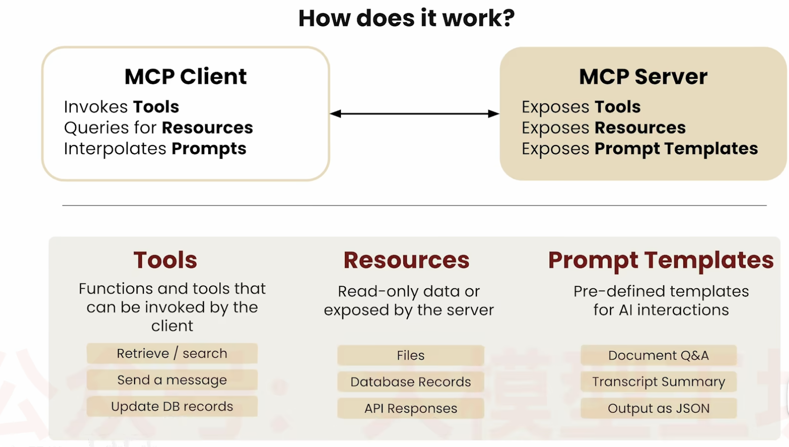

#### 2. MCP Server 服务端

利用 $FastMCP$ 构建，工具用装饰器 `mcp.tool()` 标注

服务端传送信息的方式有三种：1.stdio即本地标准输入输出（用于本地连接） 2. http+sse有状态连接 3.streamable HTTP允许无状态或者有状态连接

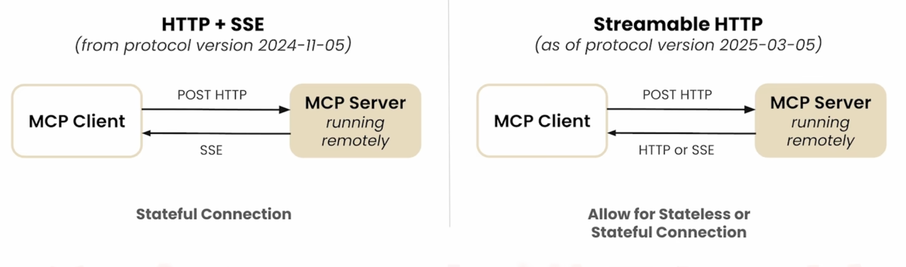

```python
import arxiv
import json
import os
from typing import List
from mcp.server.fastmcp import FastMCP


PAPER_DIR = "papers"

# Initialize FastMCP server
mcp = FastMCP("research") # 给服务起名

@mcp.tool()
def search_papers(topic: str, max_results: int = 5) -> List[str]:
    """
    Search for papers on arXiv based on a topic and store their information.
    
    Args:
        topic: The topic to search for
        max_results: Maximum number of results to retrieve (default: 5)
        
    Returns:
        List of paper IDs found in the search
    """
    
    # Use arxiv to find the papers 
    client = arxiv.Client()

    # Search for the most relevant articles matching the queried topic
    search = arxiv.Search(
        query = topic,
        max_results = max_results,
        sort_by = arxiv.SortCriterion.Relevance
    )

    papers = client.results(search)
    
    # Create directory for this topic
    path = os.path.join(PAPER_DIR, topic.lower().replace(" ", "_"))
    os.makedirs(path, exist_ok=True)
    
    file_path = os.path.join(path, "papers_info.json")

    # Try to load existing papers info
    try:
        with open(file_path, "r") as json_file:
            papers_info = json.load(json_file)
    except (FileNotFoundError, json.JSONDecodeError):
        papers_info = {}

    # Process each paper and add to papers_info  
    paper_ids = []
    for paper in papers:
        paper_ids.append(paper.get_short_id())
        paper_info = {
            'title': paper.title,
            'authors': [author.name for author in paper.authors],
            'summary': paper.summary,
            'pdf_url': paper.pdf_url,
            'published': str(paper.published.date())
        }
        papers_info[paper.get_short_id()] = paper_info
    
    # Save updated papers_info to json file
    with open(file_path, "w") as json_file:
        json.dump(papers_info, json_file, indent=2)
    
    print(f"Results are saved in: {file_path}")
    
    return paper_ids

@mcp.tool()
def extract_info(paper_id: str) -> str:
    """
    Search for information about a specific paper across all topic directories.
    
    Args:
        paper_id: The ID of the paper to look for
        
    Returns:
        JSON string with paper information if found, error message if not found
    """
 
    for item in os.listdir(PAPER_DIR):
        item_path = os.path.join(PAPER_DIR, item)
        if os.path.isdir(item_path):
            file_path = os.path.join(item_path, "papers_info.json")
            if os.path.isfile(file_path):
                try:
                    with open(file_path, "r") as json_file:
                        papers_info = json.load(json_file)
                        if paper_id in papers_info:
                            return json.dumps(papers_info[paper_id], indent=2)
                except (FileNotFoundError, json.JSONDecodeError) as e:
                    print(f"Error reading {file_path}: {str(e)}")
                    continue
    
    return f"There's no saved information related to paper {paper_id}."


if __name__ == "__main__":
    # Initialize and run the server
    mcp.run(transport='stdio')
```

编写好后，要写一个server-config.json文件来给客户端使用

```json
{
    "mcpServers": {

        "filesystem": {
            "command": "npx",
            "args": [
                "-y",
                "@modelcontextprotocol/server-filesystem",
                "."
            ]
        },

        "research": {
            "command": "uv",
            "args": ["run", "research_server.py"]
        },

        "fetch": {
            "command": "uvx",
            "args": ["mcp-server-fetch"]
        }
    }
}
```

服务器可以将资源暴露给客户端

```python
@mcp.resource("papers://{topic}")
def get_topic_papers(topic: str) -> str:
    """
    Get detailed information about papers on a specific topic.
    
    Args:
        topic: The research topic to retrieve papers for
    """
    topic_dir = topic.lower().replace(" ", "_")
    papers_file = os.path.join(PAPER_DIR, topic_dir, "papers_info.json")
    
    if not os.path.exists(papers_file):
        return f"# No papers found for topic: {topic}\n\nTry searching for papers on this topic first."
    
    try:
        with open(papers_file, 'r') as f:
            papers_data = json.load(f)
        
        # Create markdown content with paper details
        content = f"# Papers on {topic.replace('_', ' ').title()}\n\n"
        content += f"Total papers: {len(papers_data)}\n\n"
        
        for paper_id, paper_info in papers_data.items():
            content += f"## {paper_info['title']}\n"
            content += f"- **Paper ID**: {paper_id}\n"
            content += f"- **Authors**: {', '.join(paper_info['authors'])}\n"
            content += f"- **Published**: {paper_info['published']}\n"
            content += f"- **PDF URL**: [{paper_info['pdf_url']}]({paper_info['pdf_url']})\n\n"
            content += f"### Summary\n{paper_info['summary'][:500]}...\n\n"
            content += "---\n\n"
        
        return content
    except json.JSONDecodeError:
        return f"# Error reading papers data for {topic}\n\nThe papers data file is corrupted."
```

服务端也可以向客户端提供prompt模版

```python
@mcp.prompt()
def generate_search_prompt(topic: str, num_papers: int = 5) -> str:
    """Generate a prompt for Claude to find and discuss academic papers on a specific topic."""
    return f"""Search for {num_papers} academic papers about '{topic}' using the search_papers tool. Follow these instructions:
    1. First, search for papers using search_papers(topic='{topic}', max_results={num_papers})
    2. For each paper found, extract and organize the following information:
       - Paper title
       - Authors
       - Publication date
       - Brief summary of the key findings
       - Main contributions or innovations
       - Methodologies used
       - Relevance to the topic '{topic}'
    
    3. Provide a comprehensive summary that includes:
       - Overview of the current state of research in '{topic}'
       - Common themes and trends across the papers
       - Key research gaps or areas for future investigation
       - Most impactful or influential papers in this area
    
    4. Organize your findings in a clear, structured format with headings and bullet points for easy readability.
    
    Please present both detailed information about each paper and a high-level synthesis of the research landscape in {topic}."""
```

通过 `npx @modelcontextprotocol/inspector uv run research_server.py` 可以打开 `inspector` 查看服务器情况

#### 3. MCP Client 客户端

`ClientSession` 是 MCP 协议客户端的会话对象，负责和服务器建立、维持、关闭连接，初始化与服务器的连接，获取服务器提供的工具列表，调用服务端的工具，这个就是客户端和服务器交互的通道，每个服务器都要维护一个单独的 `session` 。

`AsyncExitStack` 是异步退出栈，用来管理多个异步资源（即管理多个不同的工具）

`stdio-client` 是会启动一个 `MCP` 服务器的子进程，并返回一个异步上下文管理器，用来和服务器通信

```python
from dotenv import load_dotenv
from anthropic import Anthropic
from mcp import ClientSession, StdioServerParameters, types
from mcp.client.stdio import stdio_client
from typing import List, Dict, TypedDict
from contextlib import AsyncExitStack
import json
import asyncio

load_dotenv()

class ToolDefinition(TypedDict):
    name: str
    description: str
    input_schema: dict

class MCP_ChatBot:

    def __init__(self):
        # Initialize session and client objects
        self.sessions: List[ClientSession] = [] # new
        self.exit_stack = AsyncExitStack() # new
        self.anthropic = Anthropic()
        self.available_tools: List[ToolDefinition] = [] # new
        self.tool_to_session: Dict[str, ClientSession] = {} # new


    async def connect_to_server(self, server_name: str, server_config: dict) -> None:
        """Connect to a single MCP server."""
        try:
            server_params = StdioServerParameters(**server_config)
            stdio_transport = await self.exit_stack.enter_async_context(
                stdio_client(server_params)
            ) # new
            read, write = stdio_transport
            session = await self.exit_stack.enter_async_context(
                ClientSession(read, write)
            ) # new
            await session.initialize()
            self.sessions.append(session)
            
            # List available tools for this session
            response = await session.list_tools()
            tools = response.tools
            print(f"\nConnected to {server_name} with tools:", [t.name for t in tools])
            
            for tool in tools: # new
                self.tool_to_session[tool.name] = session
                self.available_tools.append({
                    "name": tool.name,
                    "description": tool.description,
                    "input_schema": tool.inputSchema
                })
        except Exception as e:
            print(f"Failed to connect to {server_name}: {e}")

    async def connect_to_servers(self): # new
        """Connect to all configured MCP servers."""
        try:
            with open("server_config.json", "r") as file:
                data = json.load(file)
            
            servers = data.get("mcpServers", {})
            
            for server_name, server_config in servers.items():
                await self.connect_to_server(server_name, server_config)
        except Exception as e:
            print(f"Error loading server configuration: {e}")
            raise
    
    async def process_query(self, query):
        messages = [{'role':'user', 'content':query}]
        response = self.anthropic.messages.create(max_tokens = 2024,
                                      model = 'claude-3-7-sonnet-20250219', 
                                      tools = self.available_tools,
                                      messages = messages)
        process_query = True
        while process_query:
            assistant_content = []
            for content in response.content:
                if content.type =='text':
                    print(content.text)
                    assistant_content.append(content)
                    if(len(response.content) == 1):
                        process_query= False
                elif content.type == 'tool_use':
                    assistant_content.append(content)
                    messages.append({'role':'assistant', 'content':assistant_content})
                    tool_id = content.id
                    tool_args = content.input
                    tool_name = content.name
                    
    
                    print(f"Calling tool {tool_name} with args {tool_args}")
                    
                    # Call a tool
                    session = self.tool_to_session[tool_name] # new
                    result = await session.call_tool(tool_name, arguments=tool_args)
                    messages.append({"role": "user", 
                                      "content": [
                                          {
                                              "type": "tool_result",
                                              "tool_use_id":tool_id,
                                              "content": result.content
                                          }
                                      ]
                                    })
                    response = self.anthropic.messages.create(max_tokens = 2024,
                                      model = 'claude-3-7-sonnet-20250219', 
                                      tools = self.available_tools,
                                      messages = messages) 
                    
                    if(len(response.content) == 1 and response.content[0].type == "text"):
                        print(response.content[0].text)
                        process_query= False

    
    
    async def chat_loop(self):
        """Run an interactive chat loop"""
        print("\nMCP Chatbot Started!")
        print("Type your queries or 'quit' to exit.")
        
        while True:
            try:
                query = input("\nQuery: ").strip()
        
                if query.lower() == 'quit':
                    break
                    
                await self.process_query(query)
                print("\n")
                    
            except Exception as e:
                print(f"\nError: {str(e)}")
    
    async def cleanup(self): # new
        """Cleanly close all resources using AsyncExitStack."""
        await self.exit_stack.aclose()


async def main():
    chatbot = MCP_ChatBot()
    try:
        # the mcp clients and sessions are not initialized using "with"
        # like in the previous lesson
        # so the cleanup should be manually handled
        await chatbot.connect_to_servers() # new! 
        await chatbot.chat_loop()
    finally:
        await chatbot.cleanup() #new! 


if __name__ == "__main__":
    asyncio.run(main())
```

客户端交互资源的方式：@是资源后面的是参数，/prompt是提示词

- **@ai_interpretability**
- **/prompts**
- **/prompt generate_search_prompt topic=history num_papers=2**

### 二、LangChain

#### 0. 简介

##### 1. 包

langchain 包含的模块 langchain，langchain_core，langchain_community 三包

##### 2. 核心部分

llm 是封装的基础模型，chat_models 是为对话设计的可以接受一组输入，官方提供的是 `langchain_openai`

messages 是聊天的内容（包括langchain风格的 HumanMessage 和 openai 风格的模式），提示词是管理消息

output parsers 输出解释，将大模型的输出解析为 json 等格式

retrievers 检索器，进行知识检索即 rag，vector stores 接入很多向量数据库

agents 智能体

#### 1. openai

```python
import openai
import os
from dotenv import load_dotenv, find_dotenv
# 加载参数值存入os.environ中
_ = load_dotenv(find_dotenv())
openai.api_key = os.environ['OPENAI_API_KEY']

def get_completion(prompt, model = 'gpt-3.5-turbo'):
  messages = [{"role":"user", "content":prompt}]
  response = openai.ChatCompletion.create(
  	model = model, 
    messages = messages,
    temperature = 0,
  )
  return response.choices[0].message["content"]

get_completion("explain ai in one sentence")
```

openai chat api格式 `role` 包括三种 `system, user, assistant` ，以及 `content` 内容

```python
messages=[
    {"role": "system", "content": "你是一位专业的翻译助手。"},
    {"role": "user", "content": "请将下面这句话翻译成英文：我喜欢学习。"},
    {"role": "assistant", "content": "I like learning."},
    {"role": "user", "content": "再翻译一句：天气很好。"}
]
```

#### 2. Chat models

特点：支持多模态，可以进行工具调用（tool calling），进行结构化输出。

调用：官方提供的模型在 `langchain-<provider>` 包，社区版在 `langchain-community` 包。

方法：

```python
from langchain.chat_models import init_chat_model
model = init_chat_model("gemini-2.0-flash", model_provider="google_genai")
```

`ChatOpenAI()` 参数有 model, temperature 等

```python
from langchain.chat_models import ChatOpenAI
chat = ChatOpenAI()

response = chat(prompt)
print(response.content)
```

等待大模型完全推理完后返回调用结果

```python
chat_model = ChatOpenAI(model='gpt-4o', temperature=0.0)
response = chat_model.invoke(prompt)
```

$stream$ 流式调用

```python
model = ChatOpenAI(model='gpt-4o', streaming = True)
for chunk in model.stream(prompt):
    print(chunk.content, end="", flush=True)
```

批量调用

```python
message = [message1, message2]
response = model.invoke(message)
```

异步调用就是在前面加 $a$，比如 $astream$ 或者 $ainvoke$

然后必须是在主线程中采用异步方法启动

```python
if __name__ == "__main__":
    result = asyncio.run(run_async_tasks())
    print(restult)
```

#### 3. Prompt Templates

注意 `ChatPromptTemplate.from_template()` 里面应该直接填字符串作为提示词，而 `ChatPromptTemplate` 可以是 `([(),()])` 小括号里为 openai 风格或者 HumanMessage 等

* String PromptTemplates

  invoke 输入的是字典，返回值是 PromptValue，format 输入的是键值对，返回值是 str

  ```python
  from langchain_core.prompts import PromptTemplate
  
  prompt_template = PromptTemplate.from_template("Tell me a joke about {topic}")
  prompt_template = PromptTemplate.from_template(
      template = "Tell me a joke about {topic} ",
      partial_variables={"topic":"dogs"} # 部分填入参数，下面不用写了
  )
  # 下面两者等价
  prompt_template.invoke({"topic": "cats"})
  prompt_template.format(topic='cat')
  ```

  注意 `partial()` 不会改变原来的模板，而是会返回一个新的模板

  ```python
  template1 = template.partial(topic="cat")
  template1.invoke()
  ```

* ChatPromptTemplates

  `from_template` 是字符串，`from_message` 是消息格式

  ```python
  prompt = ChatPromptTemplate.from_template(
      """
          Translate the following text from English to French:
          {text}
      """
  )
  
  prompt.invoke({"text": "I love programming in Python"})
  ```

  ```python
  prompt = ChatPromptTemplate.from_messages(
      [
          ("system", "You are a helpful assistant that translates text from English to French."),
          ("human", "{text}"),
      ]
  )
  
  prompt.invoke({"text": "I love programming in Python"})
  
  
  prompt.invoke({"text": "I love programming in Python"})
  ```

  ```python
  from langchain_core.prompts import ChatPromptTemplate
  
  prompt_template = ChatPromptTemplate([
      ("system", "You are a helpful assistant"),
      ("user", "Tell me a joke about {topic}")
  ])
  
  prompt_template.invoke({"topic": "cats"})
  ```

  注意如果是下面的输入的话，变量是赋值不了的

  ```python
  prompt = ChatPromptTemplate.from_messages(
      [
          SystemMessage(
              content="""
              Translate the following text from English to French:
              """
          ),
          HumanMessage(content="{text}"),
      ]
  )
  
  prompt.invoke("text":"I love langchian")
  ```

  要想实现赋值，是需要写成模板的形式

  ```python
  from langchain_core.prompts import HumanMessagePromptTemplate
  
  prompt = ChatPromptTemplate.from_messages(
      [
          SystemMessage(
              content="""
              Translate the following text from English to French:
              """
          ),
          HumanMessagePromptTemplate.from_template(template="{text}"),
      ]
  )
  
  response = prompt.invoke({"text":"I love langchian"})
  
  response.to_string()
  ```

  

  实现 ChatPromptValue 和 list[messages] 以及字符串之间的转化

  ```python
  response_messages=response.to_messages() # 将ChatPromptValue转化为list<Messages>
  response_messages=response.to_string()
  ```

* MessagesPlaceholder

  作用是插入聊天历史，目前不知道消息的角色，需要后期调用才知道
  
  ```python
  # In addition to Human/AI/Tool/Function messages,
  # you can initialize the template with a MessagesPlaceholder
  # either using the class directly or with the shorthand tuple syntax:
  
  template = ChatPromptTemplate([
      ("system", "You are a helpful AI bot."),
      # Means the template will receive an optional list of messages under
      # the "conversation" key
      ("placeholder", "{conversation}")
      # Equivalently:
      # MessagesPlaceholder(variable_name="conversation", optional=True)
  ])
  
  prompt_value = template.invoke(
      {
          "conversation": [
              ("human", "Hi!"),
              ("ai", "How can I assist you today?"),
              ("human", "Can you make me an ice cream sundae?"),
              ("ai", "No.")
          ]
      }
  )
  
  # Output:
  # ChatPromptValue(
  #    messages=[
  #        SystemMessage(content='You are a helpful AI bot.'),
  #        HumanMessage(content='Hi!'),
  #        AIMessage(content='How can I assist you today?'),
  #        HumanMessage(content='Can you make me an ice cream sundae?'),
  #        AIMessage(content='No.'),
  #    ]
  #)
  ```

* FewShotPromptTemplate（与Template一起，非对话式）、FewShotChatMessagePromptTemplate（与ChatPromptTemplate一起，对话式）、Example selectors（示例选择器，类似于rag）

  ```python
  from langchain_core.prompts import FewShotPromptTemplate, PromptTemplate
  
  examples = [
      {"text": "I love programming in Python", "translation": "J'aime programmer en Python"},
      {"text": "I love programming in Python", "translation": "J'aime programmer en Python"},
  ]
  
  example_prompt = PromptTemplate(
      input_variables=["text", "translation"],
      template="""
      Text: {text}
      Translation: {translation}
      """
  )
  
  prompt = FewShotPromptTemplate(
      examples=examples, # 说明示例
      example_prompt=example_prompt, # 说明示例的格式
      suffix="Translate the following text from English to French: {text}",
      input_variables=["text"],
  )
  
  response = prompt.invoke({"text":"I love langchian"})
  ```

  ```python
  from langchain_core.prompts import FewShotChatMessagePromptTemplate
  
  examples = [
      {"text": "I love programming in Python", "translation": "J'aime programmer en Python"},
  ]
  
  example_prompt = ChatPromptTemplate.from_messages(
      [
          ("human", "{text}"),
          ("ai", "{translation}"),
      ]
  )
  
  few_shot_prompt = FewShotChatMessagePromptTemplate(
      examples=examples,
      example_prompt=example_prompt,
  )
  
  final_prompt = ChatPromptTemplate.from_messages(
      [
          ("system", "You are a helpful trasnslation assistant"),
          few_shot_prompt,
          ("human", "{text}"),
      ]
  )
  
  response = final_prompt.invoke({"text":"I love langchian"})
  
  model.invoke(response).content
  ```

  

#### 4. Output parsers

将大模型输出的内容格式化输出分为两步Schema definition和Returning structured output

```python
from pydantic import BaseModel, Field

# 方法1：使用Pydantic模型定义schema（推荐）
class CapitalInfo(BaseModel):
    capital: str = Field(description="The capital city name")
    country: str = Field(description="The country name")
    population: int = Field(description="Approximate population of the capital")
```

结构化输出

```python
model_with_structure = model.with_structured_output(CapitalInfo)
structured_output = model_with_structure.invoke(user_input)
print("\n✅ Pydantic模型输出:")
print(f"  首都: {structured_output.capital}")
print(f"  国家: {structured_output.country}")
print(f"  人口: {structured_output.population}")
```

也可以写成指令形式放在prompt里面

```python
from langchain.output_parsers import ResponseSchema, StructuredOutputParser
capital_schema = ResponseShema(name = "capital", description = "Was this a gift? Answer true if yes, false if no")
response_schemas = [capital_schema]
output_parser = StructuredOutputParser.from_response_schemas(response_schemas)
format_instructions = output_parser.get_format_instructions(response_schemas)
```

* StrOutputParse

```python
from langchain_core.output_parsers import StrOutputParser

output_parser = StrOutputParser()
chain = llm | output_parser
result = chain.invoke("Tell me a joke")
print(result)
```

* JsonOutputParser

  需要在提示词中说明清楚

```python
prompt = chat_prompt_template.invoke(input={"role":"人工智能专家","question":"人工智能用用英语怎么说，问题用q表示，答案用a表示，返回一个json格式的数据"})
parser = JsonOutputParser()
json_result = parser.invoke(response)
```

这种方式就是指定格式为json，不需要再提示词写了

```python
parser = JsonOutputParser()
prompt_template = PromptTemplate.from_template(
	template = "回答用户的查询\n 满足的格式为{format_instructions}\n 问题为{question}\n"，
    partial_variables={"format_instructions":parser.get_format_instructions}
)
```

#### 5. memory

由于llm本身是无状态的，所以需要记忆来管理

* 自定义实现

在 prompt 中加入信息

```python
prompt_template.messages.append(AIMessage(content=response.content))
```

* ChatMessageHistory

```python
from langchain.memory import ChatMessageHistroy

history = ChatMessageHistory()
history.add_user_message("你好")
history.add_ai_message("很高兴认识你")

print(history.messages)

response = llm.invoke(history.messages)
```

* ConversationBufferMemory

chain 里面有key值 history，所以提示词中也有 history 

```python
from langchain.chains import LLMChain
from langchain.memory import ConversationBufferMemory

prompt_template = PromptTemplate.from_template(
	template = """
		你可以与人类对话。
		当前对话历史：{history}
		人类问题：{question}
		回复：
	"""
)

memory = ConversationBufferMemory()

chain = LLMChain(
    llm=model,
    prompt=prompt_template
    memory=memory,
    verbose=True,
)

chain.invoke(
	{"question":"你好，我的名字叫小明"}
)
# 输出当前记忆的三个方法
print(memory.chat_memory.messages)
print(memory.buffer)
memory.load_memory_variables({})
```

```python
memory.save_context(inputs = {"input":"What's your name"}, outputs = {"output":"My name is John"})
memory.load_memory_variables({})
```

* ConversationBufferWindowMemory

```python
from langchain.memory import ConversationBufferWindowMemory

# 指定保留的对话数量
memory = ConversationBufferWindowMemory(k=2)

memory.chat_memory.add_user_message("Hi, my name is Andrew")
memory.chat_memory.add_ai_message("Hello, Andrew. How may I help you today?")

print(memory.chat_memory.messages)
```

* ConversationTokenBufferMemory

```python
from langchain.memory import ConversationTokenBufferMemory

# 指定保留的token数量
memory = ConversationTokenBufferMemory(llm=model, max_token_limit=1000)

memory.chat_memory.add_user_message("Hi, my name is Andrew")
memory.chat_memory.add_ai_message("Hello, Andrew. How may I help you today?")

print(memory.chat_memory.messages)
```

* ConversationSummaryMemory

```python
from langchain.memory import ConversationSummaryMemory

# 概括上下问对话
memory = ConversationSummaryMemory(llm=model, max_token_limit=1000)

memory.chat_memory.add_user_message("Hi, my name is Andrew")
memory.chat_memory.add_ai_message("Hello, Andrew. How may I help you today?")

print(memory.chat_memory.messages)
```

* ConversationSummaryBufferMemory

```python
from langchain.memory import ConversationSummaryBufferMemory
from langchain_google_genai import ChatGoogleGenerativeAI
from langchain_core.prompts import ChatPromptTemplate, MessagesPlaceholder
from langchain.chains.llm import LLMChain

model = ChatGoogleGenerativeAI(model = "gemini-2.5-flash")

prompt_template = ChatPromptTemplate.from_messages([
    ("system", "你是电商客服助手，用中文友好回答用户问题，保持专业且亲切的语气。"),
    MessagesPlaceholder(variable_name="chat_history"),
    ("human", "{input}")
]) 

memory = ConversationSummaryBufferMemory(
    llm = model,
    max_token_limit=400,
    memory_key="chat_history",
    return_messages=True
)

chain = LLMChain(
    llm = model, 
    prompt = prompt_template,
    memory = memory
)

dialogue = [
    ("你好，我想查询12345订单的状态", None),
    ("这个订单是上周五下的", None)
]

for user_input, _ in dialogue:
    response = chain.invoke({"input":user_input})
    print(f"客户：{user_input}")
    print(f"客服：{response['text']}\n")
```


 记忆分为两种：短期记忆和长期记忆

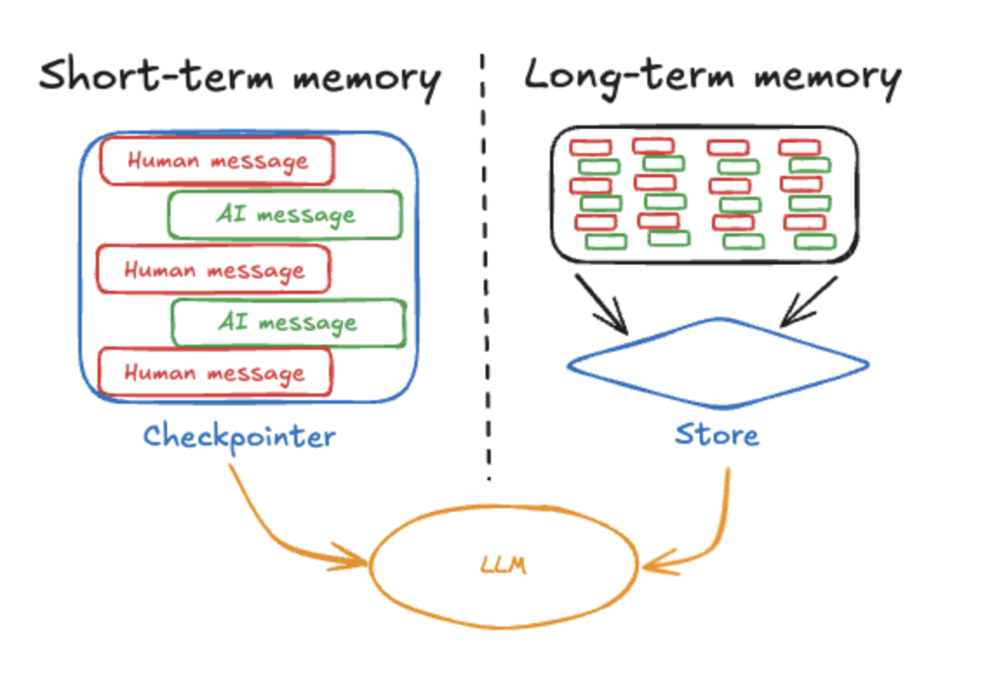

#### 6. chain

在管道连接符之前是prompt，llm，parser都需要invoke方法实现，他们都继承了抽象基类Runnable

* LLMChain

  ```python
  from langchain.chains import LLMChain
  
  prompt = ChatPromptTemplate.from_messages([
      ("system", "You are a helpful assistant."),
      ("user", "{input}"),
  ])
  
  # chain = prompt | model
  
  chain = LLMChain(llm=model, prompt=prompt)
  
  chain.invoke({"input": "What is the capital of France?"})
  ```

* SimpleSequentialChain：单链式调用

  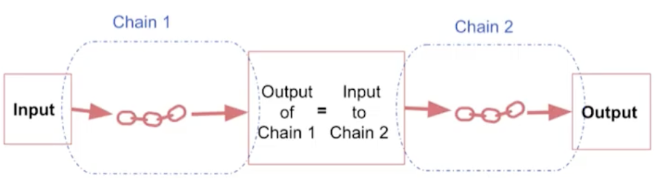

  ```python
  from langchain.chains import SimpleSequentialChain
  first_prompt = ChatPromptTemplate.from_messages([
      ("system", "You are a helpful assistant."),
      ("user", "{input}"),
  ])
  
  second_prompt = ChatPromptTemplate.from_messages([
      ("system", "You are a helpful assistant."),
      ("user", "translate the text to Chinese:{text}"),
  ])
  
  # chain = first_prompt | model | second_prompt | model
  
  chain_one = LLMChain(llm=model, prompt=first_prompt)
  chain_two = LLMChain(llm=model, prompt=second_prompt)
  
  chain = SimpleSequentialChain(
      chains=[chain_one, chain_two]，
    	verbose=True
  )
  
  chain.invoke({"input": "What is the capital of France?"})
  ```

* SequentialChain

  要在SequentialChain中说清楚输入变量和输出变量

  ```python
  translate_prompt = PromptTemplate(
      input_variables=["text"],
      template="将以下文本翻译成英文：{text}"
  )
  
  summarize_prompt = PromptTemplate(
      input_variables=["translated_text"],
      template="用一句话总结以下文本：{translated_text}"
  )
  
  sentiment_prompt = PromptTemplate(
      input_variables=["summary"],
      template="分析以下文本的情感倾向（积极/消极/中性）：{summary}"
  )
  
  # 创建LLMChain
  translate_chain = LLMChain(llm=model, prompt=translate_prompt, output_key="translated_text")
  summarize_chain = LLMChain(llm=model, prompt=summarize_prompt, output_key="summary")
  sentiment_chain = LLMChain(llm=model, prompt=sentiment_prompt, output_key="sentiment")
  
  # 创建SequentialChain
  simple_chain = SequentialChain(
      chains=[translate_chain, summarize_chain, sentiment_chain],
      input_variables=["text"],
      output_variables=["translated_text", "summary", "sentiment"]
  )
  
  # 执行
  result = simple_chain.invoke({
      "text": "今天天气真好，阳光明媚，心情愉快！"
  })
  
  print("\n🔗 简单SequentialChain示例")
  print("=" * 30)
  print(f"原文：{result['text']}")
  print(f"翻译：{result['translated_text']}")
  print(f"总结：{result['summary']}")
  print(f"情感：{result['sentiment']}")
  ```

* RouterChain：路由选择

  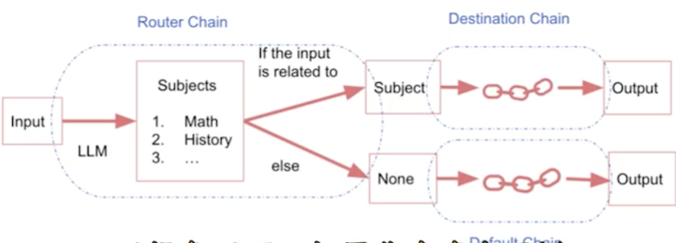

  ```python
  from langchain.chains.router import MultiPromptChain
  from langchain.chains.router.llm_router import LLMRouterChain, RouterOutputParser
  from langchain.chains.router.multi_prompt_prompt import MULTI_PROMPT_ROUTER_TEMPLATE
  # 数学问题处理模板
  math_template = """
  你是一个数学专家。请解决以下数学问题，提供详细的步骤和解释：
  
  问题：{input}
  
  请提供：
  1. 详细的解题步骤
  2. 相关的数学概念
  3. 验证答案
  4. 类似问题的解法
  """
  
  # 编程问题处理模板
  programming_template = """
  你是一个编程专家。请帮助解决以下编程相关问题：
  
  问题：{input}
  
  请提供：
  1. 详细的解决方案
  2. 示例代码
  3. 最佳实践建议
  4. 可能的陷阱和注意事项
  """
  
  # 3. 创建目标信息（用于路由选择）
  prompt_infos = [
      {
          "name": "math",
          "description": "适合回答数学、算术、几何、代数、微积分等数学相关问题",
          "prompt_template": math_template
      },
      {
          "name": "programming", 
          "description": "适合回答编程、代码、算法、软件开发、调试等编程相关问题",
          "prompt_template": programming_template
      }
  ]
  
  # 4. 创建目标链
  print("🔗 创建专门的处理链...")
  
  destination_chains = {}
  for p_info in prompt_infos:
      name = p_info["name"]
      prompt_template = p_info["prompt_template"]
      prompt = PromptTemplate(template=prompt_template, input_variables=["input"])
      chain = LLMChain(llm=model, prompt=prompt)
      destination_chains[name] = chain
  
  # 5. 创建默认链（处理无法分类的问题）
  default_prompt = PromptTemplate(
      template="""
      请回答以下问题。如果你不确定如何分类这个问题，请尽力提供有帮助的答案：
  
      问题：{input}
  
      请提供详细和有用的回答。
      """,
      input_variables=["input"]
  )
  default_chain = LLMChain(llm=model, prompt=default_prompt)
  
  # 6. 创建路由器模板
  destinations = [f"{p['name']}: {p['description']}" for p in prompt_infos]
  destinations_str = "\n".join(destinations)
  
  router_template = MULTI_PROMPT_ROUTER_TEMPLATE.format(
      destinations=destinations_str
  )
  
  router_prompt = PromptTemplate(
      template=router_template,
      input_variables=["input"],
      output_parser=RouterOutputParser(),
  )
  
  # 7. 创建路由器链
  print("🎯 创建路由器链...")
  
  router_chain = LLMRouterChain.from_llm(model, router_prompt)
  
  # 8. 创建MultiPromptChain
  print("🔀 创建MultiPromptChain...")
  
  chain = MultiPromptChain(
      router_chain=router_chain,
      destination_chains=destination_chains,
      default_chain=default_chain,
      verbose=True
  )
  ```

* `create_sql_query_chain`

  将自然语言转化为 `sql` ，参数名只能为 $question$

  ```python
  llm = ChatOpenAI(model="gpt-3.5-turbo", tempreture=0)
  
  chain = create_sql_query_chain(llm, db)
  response = chain.invoke("quesetion":"how many employees are there")
  ```

* `create_stuff_documents_chain`

将多个文档合并成单个长文本的链式工具

```python
prompt_template=PromptTemplate.from_template("如下文档{docs}所说，香蕉是什么")
llm = ChatOpenAI(model="gpt-3.5-turbo")
chain=create_stuff_documents_chain(llm,prompt,document_variable_name="docs")

docs = [
  Document(
  	page_content=""
  ),
  Document(
  	page_content=""
  )
]

chain.invoke("docs":docs)
```


#### 7. 基于文档的问答

通过 $embedding$ 嵌入向量，并计算向量之间的相似程度

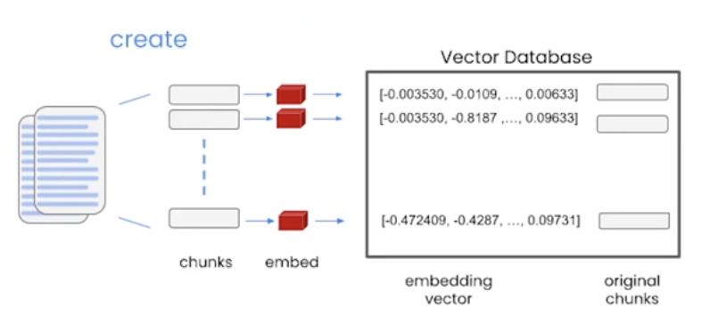

```python
from langchain.chains import RetrievalQA
from langchain.document_loaders import CSVLoader
from langchain.indexes import VectorstoreIndexCreator
from langchain.vectorstores import DocArrayInMemorySearch

# 加载文档
loader = CSVLoader(file_path="data/titanic.csv")

# 创建索引（需要指定向量数据库类型以及文档）
index = VectorstoreIndexCreator(
    vectorstore_cls=DocArrayInMemorySearch,
).from_loaders([loader])

query = "Please list all your shirts"

response = index.query(query)

display(Markdown(response))
```

方法二：

```python
loader = CSVLoader(file_path = file)

docs = loader.load()

from langchain.embeddings import OpenAIEmbeddings

# 引入向量嵌入方法
embeddings = OpenAIEmbeddings()

embed = embeddings.embed_query(docs[0].page_content)

print(len(embed))

print(embed[:5])

print(embeddings.embed_query("Hi my name is Andrew and I live in California"))

# 构建向量数据库
db = DocArrayInMemorySearch.from_documents(
    docs,
    embeddings
)

query = "Please list all your shirts"

docs = db.similarity_search(query)

print(docs[0].page_content)

# 构建检索器
retriever = db.as_retriever()

qdocs = "".join([docs[i].page_content for i in range(len(docs))])

response = model.invoke(f"{qdocs}\n\nPlease answer the question: {query}")

qa_stuff = RetrievalQA.from_chain_type(
    llm=model,
    chain_type="stuff",
    retriever=retriever
)

qa_stuff.invoke({"question": query})
```


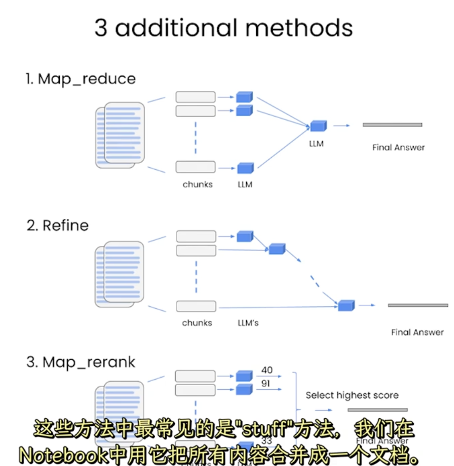

#### 8. 自动评估

根据文档内容和大模型的预测输出进行比较，看看大模型是否正确

```python
from langchain.evaluation.qa import QAGenerateChain

langchain.debug = True

example_chain = QAGenerateChain.from_llm(llm=model)

# data是csv文件
examples = example_chain.apply_and_parse(
    [{"doc" : t} for t in data[:5]]
)

index = VectorstoreIndexCreator(
    vectorstore_cls=DocArrayInMemorySearch,
).from_loaders([loader])

qa = RetrievalQA.from_chain_type(
    llm=model,
    chain_type="stuff",
    retriever=index.vectorstore.as_retriever(),
    verbose=True,
    chain_type_kwargs = {
        "document_separator": "<<<<>>>>>"
    }
)

predictions = qa.invoke(examples)

from langchain.evaluation.qa import QAGenerateChain
eval_chain = QAGenerateChain.from_llm(llm=model)

graded_outputs = eval_chain.evaluate(examples, predictions)

for i,eg in enumerate(examples):
    print(f"Example {i}:")
    print("Question: ", eg["question"])
    print("Real Answer: ", eg["answer"])
    print("Predicted Answer: ", predictions[i]["answer"])
    print("Predicted Answer (no sources): ", predictions[i]["answer_without_sources"])
    print("Grade: ", graded_outputs[i]["text"])
    print("\n")
```

#### 9. agent

* 主要步骤

主要步骤分为两步，一个是创建 $Agent$ ，通过 $AgentType$ 或者 $create\_xxx\_agent$ 指定，创建 $AgentExecutor$ ，通过 $initialize\_agent$ 或者 $AgentExecutor$ 构造方法，之后就执行即可，利用invoke

```python
from langchain_community.agent_toolkits.load_tools import load_tools
from langchain_core.prompts import ChatPromptTemplate
from langchain_core.output_parsers import StrOutputParser
from langchain.agents import AgentExecutor, create_react_agent
from langchain.agents import AgentType
tools = load_tools(["llm-math", "wikipedia"], llm=llm)
# 创建提示模板
prompt = ChatPromptTemplate.from_messages([
    ("system", """你是一个有用的助手，可以使用工具来回答问题。

你有以下工具可用:
{tools}

使用以下格式:

Question: 用户的问题
Thought: 我需要思考如何解决这个问题
Action: 要使用的工具名称
Action Input: 工具的输入
Observation: 工具的输出结果
... (这个 Thought/Action/Action Input/Observation 可以重复N次)
Thought: 我现在知道最终答案了
Final Answer: 最终答案

重要提示:
- 总是先思考再行动
- 如果需要计算，使用Calculator工具
- 如果需要查找信息，使用Search工具
- 给出清晰、有用的最终答案"""),
    ("human", "{input}"),
    ("assistant", "{agent_scratchpad}")
])

# 修复: prompt 需要 tool_names 变量
tool_names = ", ".join([tool.name for tool in tools])
prompt = prompt.partial(tool_names=tool_names)

# 创建ReAct agent
agent = create_react_agent(llm, tools, prompt)

# 创建agent executor
agent_executor = AgentExecutor(
    agent=agent,
    tools=tools,
    verbose=True,
    max_iterations=5,
    early_stopping_method="generate"
)

result = agent_executor.invoke({
    "input": "计算 (25 + 15) * 2 - 10 的结果"
})
```

* 方式一通过构造函数和枚举类型调用

PythonREPLTool 是 LangChain 提供的一个Python代码执行工具，它允许 AI Agent 在运行时执行 Python 代码

```python
from langchain_experimental.tools import PythonREPLTool
from langchain.agents import initialize_agent, AgentType

agent_executor = initialize_agent(
    tools=[PythonREPLTool()],
    llm=llm,
    agent=AgentType.ZERO_SHOT_REACT_DESCRIPTION,
    # agent = AgentType.OPENAI_FUNCTIONS,
    verbose=True,
)

result = agent_executor.invoke({"用python写一个计算器"})
```

* 方式二：根据create调用

agent_scratchpad 是必须有的参数，用来保存链式调用的信息

需要提示词模板，提示词必须和工具名字对应，也可以写为 {tool} 后面提供

如果是 `create_react_agent` 则必须是要满足提示词中含有 tools 和 tool_names

```python
prompt = ChatPromptTemplate.from_messages([
    ("system","你是一个乐于助人的ai助手，根据用户的提问，必要时调用search工具，使用互联网检索信息"),
    ("human","{input}")，
    ("system","{agent_scratchpad}")
])

agent = create_tool_calling_agent(
	llm=llm, 
    prompt=prompt,
    tools=[search_tool]
)

agent_excutor = AgentExcutor(
	agent = agent,
    tools = [search_tool]
)

agent_excutor.invoke({"input":"查询北京今天的天气情况"})
```

* 带记忆模块的agent

必须要有 memory_key，且值为 chat_history，这个是和提示词模板匹配，对于枚举类型调用提示词模板是写好的

```python
agent = AgentType.CONVERSATIONAL_REACT_DESCRIPTION
memory = ConversationBufferMemory(
	return_messages=True,
    memory_key="chat_history"
)

agent_executor = initalize_agent(
	tools = [search_tool],
    llm = llm, 
    agent = agent,
    verbose = True,
    memory = memory
)

result = agent_executor
```

#### 10. CallbackHandler

##### 10.1 CallbackHandler 是什么

它就是一个 **钩子机制 (Hook)**。

- Agent、LLM、Tool 在运行过程中的关键节点，会主动触发回调。
- 你可以在这些回调里记录日志、做可视化、实现流式输出，甚至改变逻辑。

相当于：

> **Agent/LLM/Tool = 主流程**
>  **CallbackHandler = 旁观者，监听+记录+干预**

------

##### 10.2 常见的回调方法

$LangChain$ 定义了很多事件点，你的 `StreamingCallbackHandler` 覆盖了其中的部分。

| 方法               | 什么时候调用                        | 你代码里做了什么                                 |
| ------------------ | ----------------------------------- | ------------------------------------------------ |
| `on_chain_start`   | 整个链/Agent 开始执行时             | 没写，但可以做日志初始化                         |
| `on_chain_end`     | 链/Agent 执行完毕时                 | 没写，但可以收尾                                 |
| `on_llm_start`     | LLM 开始推理时                      | 没写（你可以加日志）                             |
| `on_llm_new_token` | LLM 生成一个 token 时               | 你把 token 放进 `queue`，实现了 **流式输出**     |
| `on_llm_end`       | LLM 输出完成时                      | 没写                                             |
| `on_agent_action`  | LLM 产出 Action（要调用某个工具）时 | 你提取代码块，生成临时文件名，存到 `steps`       |
| `on_tool_start`    | 工具开始执行时                      | 你没写（可加上）                                 |
| `on_tool_end`      | 工具执行完成时                      | 你记录了 `execution_logs`                        |
| `on_agent_finish`  | Agent 生成最终答案时                | 你调用了 `FinalAnswerCheck` 检查，并存储最终结果 |

------

##### 10.3 执行过程里的调用顺序

1. **用户输入 → Agent**
   - `on_chain_start`
2. **Agent 调用 LLM 决定下一步**
   - `on_llm_start`
   - `on_llm_new_token`（多次触发，流式输出）
   - `on_llm_end`
3. **LLM 决定调用工具**
   - `on_agent_action`
   - `on_tool_start`（如果实现了）
   - `on_tool_end`
4. **工具结果再送回 LLM**
   - 又触发一次 `on_llm_start` → `on_llm_new_token` → `on_llm_end`
5. **LLM 最终产出结果**
   - `on_agent_finish`
   - `on_chain_end`

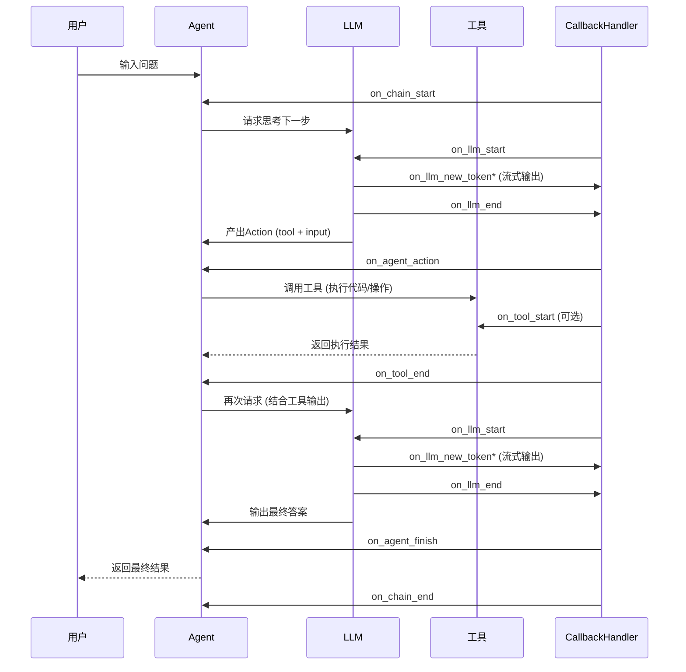

#### 11. tool

包含 $name$ 工具名，$description$ 描述，工具输入的 $json$ 模式，要调用的函数，$return\_direct$ 仅对 $Agent$ 相关，当为 $True$ 时，在调用给定工具后，将停止并将结果直接返回给用户

步骤主要是将 $name$ 和 $description$ 和 $json$ 模式作为上下文提供给 $LLM$，然后大模型根据提示词推断出需要调用哪些工具，并提供具体的调用参数信息，然后用户需要根据返回的工具调用信息，自行触发相关工具的回调

```python
from langchain_core.tools import tool

@tool(name_or_callable="add_two_number", description="add two numbers", return_direct=True)
def add_number(a:int, b:int) -> int:
    return a + b

add_number.invoke({"a":10, "b":20})
```

还有 $StructruredTool$ 

```python
def search_goolge(query:str):
    return "最后查询的结果"

class FieldInfo(BaseModel):
    query:str = Field(description = "要检索的关键词")

search = StructuredTool.from_function(
	func=search_google,
    name="Search",
    description="查询谷歌搜索引擎并将结果返回",
    args_schema=FieldInfo
)

search.invoke({"query":"ai"})
```

主要步骤，一个是告诉大模型能够调用哪些工具，第二个是执行工具

```python
from dotenv import load_dotenv
from langchain_community.tools import MoveFileTool
from langchain_core.messages import HumanMessage
import os

from langchain_core.utils.function_calling import convert_to_openai_function
load_dotenv()

os.environ["GOOGLE_API_KEY"] = os.getenv("GOOGLE_API_KEY")
from langchain.memory import ConversationSummaryBufferMemory
from langchain_google_genai import ChatGoogleGenerativeAI
from langchain_core.prompts import ChatPromptTemplate, MessagesPlaceholder
from langchain.chains.llm import LLMChain

model = ChatGoogleGenerativeAI(model = "gemini-2.5-flash")

tools = [MoveFileTool()]

message = [HumanMessage(content = "我想把data_agent/requirements.txt文件移动到code/requirements.txt")]

function = [convert_to_openai_function(tool) for tool in tools]

response = model.invoke(input=message, functions=function)

print(response)
```

```python
import json

if "function_call" in response.additional_kwargs:
    function_call = response.additional_kwargs["function_call"]
    function_name = function_call["name"]
    function_args = json.loads(function_call["arguments"])
    print(f"执行工具：{function_name}")
    tool = next(tool for tool in tools if tool.name == function_name)
    print(f"工具：{tool.name}")
    print(f"工具参数：{function_args}")
    result = tool.invoke(function_args)
    print(f"工具执行结果：{result}")
    
else:
    print(f"模型回复：{response.content}")
```

#### 12. RAG

##### 1. 文档加载器

使用加载器后，通过 `load` 方法获取实例

| 文档     | 文档加载器                 |
| -------- | -------------------------- |
| txt      | TextLoader                 |
| pdf      | PyPDFLoader                |
| csv      | CSVLoader                  |
| json     | JSONLoader                 |
| html     | UnStructuredHTMLLoader     |
| md       | UnSturcturedMarkdownLoader |
| 文件目录 | DirectoryLoader            |

text加载器，pdf和csv类似

```python
text_loader = TextLoader(
	file_path = file_path,
    encoding="utf-8"
)

docs = text_loader.load()
```

json加载器

```python
json_loader = JSONLoader(
	file_path = "1.json",
    jq_schema = ".", # 取出所有数据，加载某个字段 jq_schema = "./messages[].content"
    text_content = False, # 将加载的json对象转换为json字符串
)

docs = json_loader.load()

for doc in docs:
    print(doc)
```

```python
loader = JSONLoader(
	file_path = file_path,
    jq_schema = ".data.items[]",
    content_key='.title + "\n\n" + .content',
    is_content_key_jq_parsable = True
)
```

html加载器，md类似

```python
html_loader = UnStructuredHTMLLoader(
	file_path = "asset/load/05-load.html",
    mode = "elements",  # 按语义元素拆分成多个独立的小文档，还有paged,elements,single
    strategy = "fast" # 分为fast(解析快会丢失数据)，hi_res（高分辨率速度慢）, ocr_only(强制使用ocr文本，仅适用于图像)
)
```

##### 2. TextSplitter 的使用

TextSplitter 是作为各种具体的文档拆分器的父类

常用属性

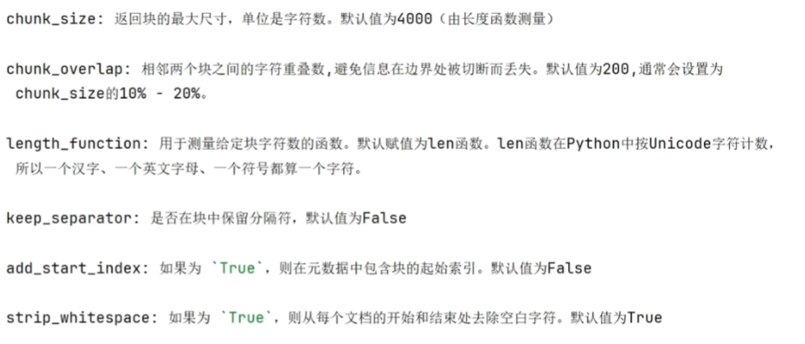

常用方法

> Document 包括 metadata 元数据和 page_content 属性

按照字符串进行拆分

`split_text(xxx)` ：传入的参数类型为str，返回为 List[str]

`create_doucuments(xxx)`：传入List[str]，返回List[Document]

按照Document进行拆分

`split_document(xxx)` : 传入 List[Document]，返回 List[Document]

##### 3. CharacterTextSplitter

chunk_size 默认值为4000，尽量在这附近

```python
text = """
	LangChain 是一个用于开发由语言模型驱动的应用程序的框架，它提供了一套工具和抽象
"""

splitter = CharacterTextSplitter(
	chunk_size = 50,
    chunk_overlap = 5,
    separator = "" # 设置为空字符串表示禁用分隔符，如果有符号则分隔符优先且会忽略chunk_size
)

texts = splitter.split_text(text)

for i, chunk in enumerate(texts):
    print(chunk)
```

##### 4. RecursiveCharacterTextSplitter

最常用的递归字符文本划分器，遇到特定字符时进行分割。默认情况，尝试分割的字符包括 `["\n\n", "\n", " ", ""]`

```python
with open("1.txt", enconding = "utf-8") as f:
    state_of_the_union = f.read()
    
text_splitter = RecursiveCharacterTextSplitter(
	chunk_size = 100,
    chunk_overlap=20,
    seperators = [] # 自己指定划分符号
    length_function=len     # 按字符计数
)

texts = text_splitter.create_documents([state_of_the_union])
```

##### 5. TokenTextSplitter/CharacterTextSplitter

文档分块按照 token 进行划分 ，多了一个属性 `encoding_name` 即编码器，chunk_size 就是 token 数了（但是划分可能超过它）

##### 6. 向量嵌入

```python
from langchain_openai import OPENAIEmbeddings
import os
import dotenv

embedding_model = OpenAIEmbeddings(model ="text-embedding-ada-002")
text = "Nice to meet you!"
embedded_query = embedding_model.embed_query(text = text)
embeddings = embeddings_model.embeded_model.embed_documents(texts)
```

##### 7. 向量数据库

Chroma 数据库，如果没有指明 `persist_directory` 则存储在内存中

在向量数据库中不仅存储了向量还存储了文档本身

```python
db = Chroma.from_documents(
	doucuments = splitter_docs,
	embedding=embedding_model
)

query = "哺乳动物"

docs = db.similarity_search(query, k=3) # 返回最相关的3个文档

for i, doc in enumerate(docs, 1):
    print(doc.page_content)
```

```python
db = Chroma.from_documents(
	doucuments = splitter_docs,
	embedding=embedding_model
)

query = "哺乳动物"
embedding_vector = embedding.embed_query(query)

docs = db.similarity_search(query, k=3) # 返回最相关的3个文档

for i, doc in enumerate(docs, 1):
    print(doc.page_content)
```

```python
docs = db.similarity_search_with_score(query)
```

```python
docs = db._similarity_search_with_relevance_scores(query)
```

##### 8. 向量检索Retriever

参数主要是有 `search_type` 搜索的策略，`search_kwargs` 搜索的参数，比如 `k` 表示返回的文档个数

```python
retriever = db.as_retriever(search_kwargs={"k":4})

docs = retriever.invoke(input = "what's ai")
```

### 三、RAG检索增强技术

#### 1. 基本步骤

信息检索增强技术是将用户的提问在知识库中找到类似的文章片段，然后加入到模型提示词的上下文中，这样就不要对模型进行复杂的微调工作，提高效率。基本步骤包括加载文档，将文档分块，嵌入向量，知识库检索构建，查询

第一步，加载必要的库

```python
from langchain_community.document_loaders import PyPDFLoader, Docx2txtLoader
from langchain_text_splitters import RecursiveCharacterTextSplitter
from typing import List
from langchain_core.documents import Document
```

第二步，加载文档

```python
def load_documents(folder_path: str) -> List[Document]:
    documents = []
    for filename in os.listdir(folder_path):
        if filename.endswith(".pdf"):
            loader = PyPDFLoader(os.path.join(folder_path, filename))
            documents.extend(loader.load())
        elif filename.endswith(".docx"):
            loader = Docx2txtLoader(os.path.join(folder_path, filename))
            documents.extend(loader.load())
    return documents
 
folder_path = "docs"
documents = load_documents(folder_path)
print(documents)
# 是文件页数不是文件数
print(f"Loaded {len(documents)} documents")
```

第三步，分割文档成不同的chunk

```python
text_splitter = RecursiveCharacterTextSplitter(
    chunk_size=1000, 
    chunk_overlap=200,
    length_function=len,
)

splits = text_splitter.split_documents(documents)
print(f"Split into {len(splits)} chunks")
print(splits[0])
# metadata 用来确认文件块来源
print(splits[0].metadata)
```

第四步，嵌入

方法一，利用api

```python
from langchain_google_genai import GoogleGenerativeAIEmbeddings

embeddings = GoogleGenerativeAIEmbeddings(model="models/embedding-001")
document_embeddings = embeddings.embed_documents([split.page_content for split in splits])
print(f"Created embeddings for {len(document_embeddings)} document chunks.")
print(document_embeddings[0][:5])
```

方法二，自己写

```python
# 本地加载
from langchain_community.embeddings.sentence_transformer import SentenceTransformerEmbeddings

embedding_function = SentenceTransformerEmbeddings(model_name="all-MiniLM-L6-v2")
document_embeddings = embedding_function.embed_documents([split.page_content for split in splits])
print(document_embeddings[0][:5])  # Printing first 5 elements of the first embedding
```

第五步，定义知识库

```python
from langchain_chroma import Chroma
 
collection_name = "my_collection"
vectorstore = Chroma.from_documents(
    collection_name=collection_name,
    documents=splits,
    embedding=embedding_function,
    persist_directory="./chroma_db"
)
print("Vector store created and persisted to './chroma_db'")
```

查询如下

```python
query = "What is the core of artificial intelligence?"
search_results = vectorstore.similarity_search(query, k=2)
print(f"\nTop 2 most relevant chunks for the query: '{query}'\n")
for i, result in enumerate(search_results, 1):
    print(f"Result {i}:")
    print(f"Source: {result.metadata.get('source', 'Unknown')}")
    print(f"Content: {result.page_content}")
    print()
```

第六步，定义检索器和链

```python
retriever = vectorstore.as_retriever(search_kwargs={"k": 2})
retriever_results = retriever.invoke(query)
print(retriever_results)

from langchain_core.prompts import ChatPromptTemplate
from langchain.schema.runnable import RunnablePassthrough
from langchain_core.output_parsers import StrOutputParser

template = """Answer the question based only on the following context:
{context}
Question: {question}
Answer: """

prompt = ChatPromptTemplate.from_template(template)

def docs2str(docs):
    return "\n\n".join(doc.page_content for doc in docs)

rag_chain = (
    {"context": retriever | docs2str, "question": RunnablePassthrough()}
    | prompt
    | llm
    | StrOutputParser()
)

question = "What is the core of artificial intelligence?"
response = rag_chain.invoke(question)
print(f"Question: {question}")
print(f"Answer: {response}")
```

概括历史对话

```python
from langchain_core.prompts import MessagesPlaceholder
from langchain.chains import create_history_aware_retriever
from langchain.chains.combine_documents import create_stuff_documents_chain

# 概括问题
contextualize_q_system_prompt = """
Given a chat history and the latest user question
which might reference context in the chat history,
formulate a standalone question which can be understood
without the chat history. Do NOT answer the question,
just reformulate it if needed and otherwise return it as is.
"""

contextualize_q_prompt = ChatPromptTemplate.from_messages(
    [
        ("system", contextualize_q_system_prompt),
        MessagesPlaceholder("chat_history"),
        ("human", "{input}"),
    ]
)

contextualize_chain = contextualize_q_prompt | llm | StrOutputParser()
print(contextualize_chain.invoke({"input": "What is the core of artificial intelligence?", "chat_history": []}))
```

#### 2. 典型应用 NL2SQL

NL2SQL

连接数据库

```python
from urllib.parse import quote_plus
import os

db_user = "root"
db_password = "Pandy!@#123456"
db_host = "localhost"
db_name = "classicmodels"
from langchain_community.utilities.sql_database import SQLDatabase
# db = SQLDatabase.from_uri(f"mysql+pymysql://{db_user}:{db_password}@{db_host}/{db_name}",sample_rows_in_table_info=1,include_tables=['customers','orders'],custom_table_info={'customers':"customer"})
db = SQLDatabase.from_uri(f"mysql+pymysql://{db_user}:{quote_plus(db_password)}@{db_host}/{db_name}")
print(db.dialect)
print(db.get_usable_table_names())
print(db.table_info)
```

进行基础查询

```python
from langchain.chains import create_sql_query_chain
from langchain.schema.runnable import RunnableLambda
import re

def clean_sql_output(text: str) -> str:
    """清理 SQL 输出，移除 markdown 格式"""
    cleaned = re.sub(r'```\w*\n?', '', text)
    cleaned = cleaned.replace('```', '').strip()
    return cleaned

base_chain = create_sql_query_chain(llm, db)
generate_query = base_chain | RunnableLambda(clean_sql_output)

query = generate_query.invoke({"question": "what is price of `1968 Ford Mustang`"})
print(query) 
```

根据返回的query得到结果

```python
from langchain_community.tools.sql_database.tool import QuerySQLDataBaseTool
execute_query = QuerySQLDataBaseTool(db=db)
execute_query.invoke(query)
```

完整的流程，将自然语言转化为sql在转化为自然语言，下面是对代码中chain的拆分解释

1. `RunnablePassthrough.assign(query=generate_query)`

```python
# 输入: {"question": "what is price of 1968 Ford Mustang"}
# 输出: {
#   "question": "what is price of 1968 Ford Mustang",
#   "query": "SELECT buyPrice FROM products WHERE productName = '1968 Ford Mustang'"
# }
```

- `RunnablePassthrough` 将原始输入传递下去
- `.assign(query=generate_query)` 添加一个新字段 `query`，值是 `generate_query` 的执行结果

2. `.assign(result=itemgetter("query") | execute_query)`

```python
# 输入: {
#   "question": "what is price of 1968 Ford Mustang", 
#   "query": "SELECT buyPrice FROM products WHERE productName = '1968 Ford Mustang'"
# }
# 输出: {
#   "question": "what is price of 1968 Ford Mustang",
#   "query": "SELECT buyPrice FROM products WHERE productName = '1968 Ford Mustang'",
#   "result": "[(103.42,)]"  # 数据库查询结果
# }
```

- `itemgetter("query")` 提取上一步的 `query` 字段
- `| execute_query` 执行这个 SQL 查询
- `.assign(result=...)` 将查询结果添加为 `result` 字段

3. `| rephrase_answer`

```python
# 输入: {
#   "question": "what is price of 1968 Ford Mustang",
#   "query": "SELECT buyPrice FROM products WHERE productName = '1968 Ford Mustang'", 
#   "result": "[(103.42,)]"
# }
# 输出: "The price of 1968 Ford Mustang is $103.42"
```

- 接收包含问题、查询和结果的字典
- 用 LLM 生成自然语言答案

```python
from operator import itemgetter

from langchain_core.output_parsers import StrOutputParser
from langchain_core.prompts import PromptTemplate
from langchain_core.runnables import RunnablePassthrough

answer_prompt = PromptTemplate.from_template(
    """Given the following user question, corresponding SQL query, and SQL result, answer the user question.

Question: {question}
SQL Query: {query}
SQL Result: {result}
Answer: """
)

rephrase_answer = answer_prompt | llm | StrOutputParser()

chain = (
    RunnablePassthrough.assign(query=generate_query).assign(
        result=itemgetter("query") | execute_query
    )
    | rephrase_answer
)

chain.invoke({"question": "How many customers have an order count greater than 5"})
```

下面是融入few-shot进行设计

```python
examples = [
   {
       "input": "List all customers in France with a credit limit over 20,000.",
       "query": "SELECT * FROM customers WHERE country = 'France' AND creditLimit > 20000;"
   },
   {
       "input": "Get the highest payment amount made by any customer.",
       "query": "SELECT MAX(amount) FROM payments;"
   }
]
```

```python
from langchain_core.prompts import ChatPromptTemplate, MessagesPlaceholder,FewShotChatMessagePromptTemplate,PromptTemplate

example_prompt = ChatPromptTemplate.from_messages(
   [
       ("human", "{input}\nSQLQuery:"),
       ("ai", "{query}"),
   ]
)
few_shot_prompt = FewShotChatMessagePromptTemplate(
   example_prompt=example_prompt,
   examples=examples,
   # input_variables=["input","top_k"],
   input_variables=["input"],
)
print(few_shot_prompt.format(input1="How many products are there?"))
```

我们也可以采用动态few-shot的方法，即从给定的示例中选出关联程度最高的示例

```python
from langchain_community.vectorstores import Chroma
from langchain_core.example_selectors import SemanticSimilarityExampleSelector
from langchain_openai import OpenAIEmbeddings

vectorstore = Chroma()
vectorstore.delete_collection()
example_selector = SemanticSimilarityExampleSelector.from_examples(
   examples,
   OpenAIEmbeddings(),
   vectorstore,
   k=2,
   input_keys=["input"],
)
example_selector.select_examples({"input": "how many employees we have?"})
few_shot_prompt = FewShotChatMessagePromptTemplate(
   example_prompt=example_prompt,
   example_selector=example_selector,
   input_variables=["input","top_k"],
)
print(few_shot_prompt.format(input="How many products are there?"))
final_prompt = ChatPromptTemplate.from_messages(
   [
       ("system", "You are a MySQL expert. Given an input question, create a syntactically correct MySQL query to run. Unless otherwise specificed.\n\nHere is the relevant table info: {table_info}\n\nBelow are a number of examples of questions and their corresponding SQL queries."),
       few_shot_prompt,
       ("human", "{input}"),
   ]
)
print(final_prompt.format(input="How many products are there?",table_info="some table info"))
generate_query = create_sql_query_chain(llm, db,final_prompt)
chain = (
RunnablePassthrough.assign(query=generate_query).assign(
   result=itemgetter("query") | execute_query
)
| rephrase_answer
)
chain.invoke({"question": "How many csutomers with credit limit more than 50000"})
```

为了提高效率，我们需要先选择可能的table

```python
from operator import itemgetter
from langchain.chains.openai_tools import create_extraction_chain_pydantic
from langchain_core.pydantic_v1 import BaseModel, Field
from typing import List
import pandas as pd

def get_table_details():
  # Read the CSV file into a DataFrame
  table_description = pd.read_csv("database_table_descriptions.csv")
  table_docs = []

  # Iterate over the DataFrame rows to create Document objects
  table_details = ""
  for index, row in table_description.iterrows():
      table_details = table_details + "Table Name:" + row['Table'] + "\n" + "Table Description:" + row['Description'] + "\n\n"

  return table_details


class Table(BaseModel):
  """Table in SQL database."""

  name: str = Field(description="Name of table in SQL database.")

# table_names = "\n".join(db.get_usable_table_names())
table_details = get_table_details()
print(table_details)
table_details_prompt = f"""Return the names of ALL the SQL tables that MIGHT be relevant to the user question. \
The tables are:

{table_details}

Remember to include ALL POTENTIALLY RELEVANT tables, even if you're not sure that they're needed."""

table_chain = create_extraction_chain_pydantic(Table, llm, system_message=table_details_prompt)
tables = table_chain.invoke({"input": "give me details of customer and their order count"})
def get_tables(tables: List[Table]) -> List[str]:
    tables  = [table.name for table in tables]
    return tables

select_table = {"input": itemgetter("question")} | create_extraction_chain_pydantic(Table, llm, system_message=table_details_prompt) | get_tables
select_table.invoke({"question": "give me details of customer and their order count"})
chain = (
RunnablePassthrough.assign(table_names_to_use=select_table) |
RunnablePassthrough.assign(query=generate_query).assign(
    result=itemgetter("query") | execute_query
)
| rephrase_answer
)
chain.invoke({"question": "How many cutomers with order count more than 5"})
```

记录历史

```python
from langchain.memory import ChatMessageHistory
history = ChatMessageHistory()
final_prompt = ChatPromptTemplate.from_messages(
   [
       ("system", "You are a MySQL expert. Given an input question, create a syntactically correct MySQL query to run. Unless otherwise specificed.\n\nHere is the relevant table info: {table_info}\n\nBelow are a number of examples of questions and their corresponding SQL queries. Those examples are just for referecne and hsould be considered while answering follow up questions"),
       few_shot_prompt,
       MessagesPlaceholder(variable_name="messages"),
       ("human", "{input}"),
   ]
)
print(final_prompt.format(input="How many products are there?",table_info="some table info",messages=[]))
generate_query = create_sql_query_chain(llm, db,final_prompt)

chain = (
RunnablePassthrough.assign(table_names_to_use=select_table) |
RunnablePassthrough.assign(query=generate_query).assign(
   result=itemgetter("query") | execute_query
)
| rephrase_answer
)
question = "How many cutomers with order count more than 5"
response = chain.invoke({"question": question,"messages":history.messages})
There are 2 customers with an order count of more than 5.
history.add_user_message(question)
history.add_ai_message(response)
response = chain.invoke({"question": "Can you list there names?","messages":history.messages})
```

### 四、LangGraph

> 基本设计思路：第一步是要先把工作流转化为有向图的形式，然后明确每个节点要做什么，之后设计状态去实现，状态就是在节点之间可以保存的短期记忆

#### 1. 基本步骤

定义状态，$state$ 是用来保存和传递整个工作流中节点之间的共享数据的对象，即整个流程的上下文。用 `stage["messages"].get()` 或者 `stage["messages"].append()` 来实现获取和添加功能

> `TypeDict` 表示这是一个字典形状类型
>
> `Annotated` 是 Python 类型系统里的一个“**给类型加元数据**”的工具
>
> 语法：`Annotated[原始类型, 元数据1, 元数据2, ...]`
>
> ```python
> from typing_extensions import Annotated
> import operator
> 
> Messages = Annotated[list[str], operator.add]  # 合并时用“+”拼接
> Counter  = Annotated[int, operator.add]        # 合并时用“+”累加
> ```

核心要点：

- **静态类型检查器**把它当作“仍然是原始类型”，不会改变类型判断（`Annotated[int, ...]` 仍是 `int`）。
- **运行时/框架**可以读取这些“元数据”来做额外的事（校验、序列化、合并策略等）。

这个状态表示如果状态合并，则自动添加新的信息

`add_messages` 是自动添加新的信息

```python
from typing import Annotated, TypedDict
from langchain_core.messages import BaseMessage, HumanMessage, AIMessage
from langgraph.graph.message import add_messages

class State(TypedDict):
    messages: Annotated[list[BaseMessage], add_messages]
```

下面是定义一个节点，并设计一个简单的图

```python
def chatbot_node(state: State) -> State:
    response = llm.invoke(state["messages"])
    return {"messages": [response]}

from langgraph.graph import StateGraph, START, END

graph_builder = StateGraph(State)
graph_builder.add_node("chatbot", chatbot_node)
graph_builder.add_edge(START, "chatbot")
graph_builder.add_edge("chatbot", END)
graph = graph_builder.compile()
```

下面进行测试

```python
def test_chatbot(message: str):
    initial_state = {"messages": [HumanMessage(content=message)]}
    result = graph.invoke(initial_state)
    print("🤖 Assistant:", result["messages"][-1].content)

test_chatbot("Hello! My name is Pradip")
test_chatbot("Do you remember my name?")
```

我们可以发现它是没有记忆的，所以需要加入记忆信息，用config表明线程id

```python
from langgraph.checkpoint.memory import MemorySaver

memory = MemorySaver()

# Compile the graph again with memory enabled
graph_with_memory = graph_builder.compile(checkpointer=memory)

def chat_with_memory(message: str, thread_id: str):
    config = {"configurable": {"thread_id": thread_id}}
    initial_state = {"messages": [HumanMessage(content=message)]}
    result = graph_with_memory.invoke(initial_state, config)
    print("🤖 Assistant:", result["messages"][-1].content)

# Start a conversation
chat_with_memory("Hi, my name is Pradip", thread_id="thread-1")
chat_with_memory("What's my name?", thread_id="thread-1")
```

加入 $tool$ 的图

```python
llm = ChatOpenAI(model="gpt-4.1-mini", temperature=0.7)
llm_with_tools = llm.bind_tools(tools)  # `tools` already contains `calculator` and `search_tool`
from langchain_core.messages import HumanMessage, AIMessage

def chatbot_node(state: AgentState) -> AgentState:
    """Gatekeeper: answer directly or request a tool"""
    system_message = (
        "You are a helpful assistant.\n"
        "Use the `web_search` tool for real‑time facts and `calculator` for maths.\n"
        "Otherwise answer directly."
    )

    messages = [
        {"role": "system", "content": system_message},
        *state["messages"],
    ]

    response = llm_with_tools.invoke(messages)
    return {"messages": [response]}  # LangGraph merges this into the running state


from langgraph.prebuilt import ToolNode
tool_node = ToolNode(tools)  # automatically dispatches and streams results back
from typing import Literal

def should_continue(state: AgentState) -> Literal["tools", "end"]:
    last = state["messages"][-1]
    return "tools" if getattr(last, "tool_calls", None) else "end"
from langgraph.graph import StateGraph, START, END
from langgraph.checkpoint.memory import MemorySaver

workflow = StateGraph(AgentState)
workflow.add_node("chatbot", chatbot_node)
workflow.add_node("tools",   tool_node)

workflow.add_edge(START, "chatbot")
workflow.add_conditional_edges("chatbot", should_continue, {"tools": "tools", "end": END})
workflow.add_edge("tools", "chatbot")  # come back after tools run

app = workflow.compile(checkpointer=MemorySaver())

def chat_with_agent(msg: str, thread_id="demo"):
    cfg = {"configurable": {"thread_id": thread_id}}
    state = {"messages": [HumanMessage(content=msg)]}
    result = app.invoke(state, cfg)
    print(result["messages"][-1].content)

chat_with_agent("What's 15% of 240?")
chat_with_agent("Search for recent news about artificial intelligence")

```

#### 2. 构建RAG Agent

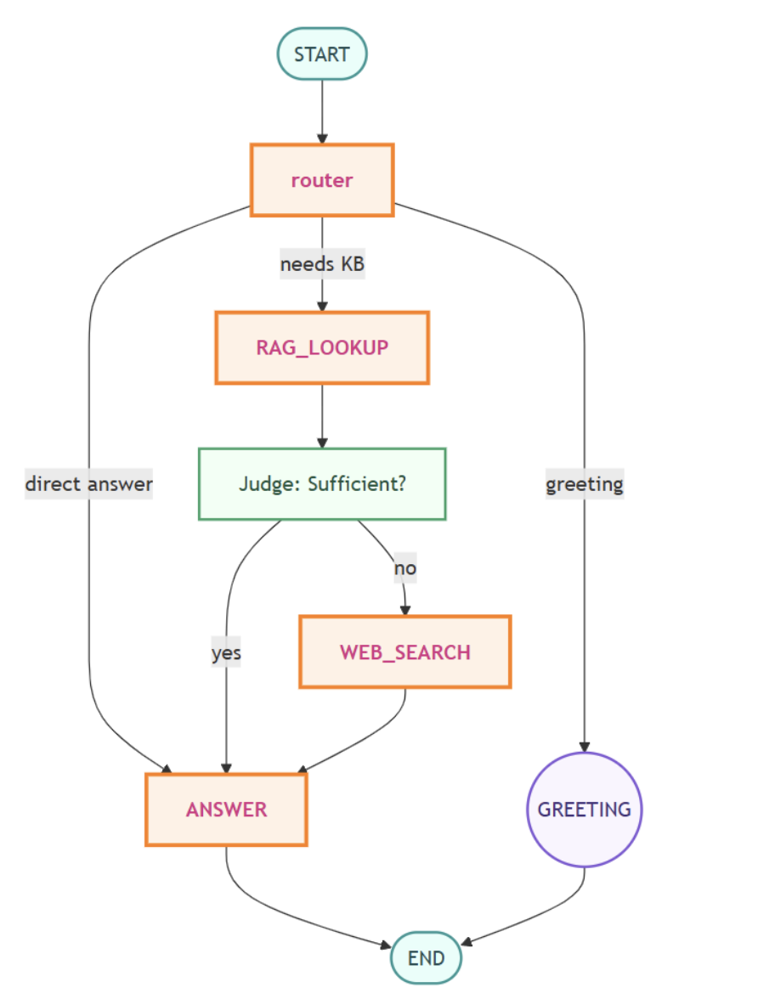

加载文档

```python
# ── Build & persist a Chroma index ────────────────────────────────
from pathlib import Path
from langchain_community.document_loaders import PyPDFLoader, Docx2txtLoader
from langchain_text_splitters import RecursiveCharacterTextSplitter
from langchain_openai import OpenAIEmbeddings
from langchain_community.vectorstores import Chroma

SOURCE_DIR   = Path("docs")          # put your files here
INDEX_DIR    = Path("chroma_db_1")   # will be created if missing
EMBED_MODEL  = "text-embedding-3-small"

# Load docs (keep only pdf/docx for brevity)
docs = []
for f in SOURCE_DIR.glob("*.*"):
    if f.suffix == ".pdf":
        docs += PyPDFLoader(str(f)).load()
    elif f.suffix == ".docx":
        docs += Docx2txtLoader(str(f)).load()

# Split & embed
chunks     = RecursiveCharacterTextSplitter(chunk_size=1_000, chunk_overlap=200).split_documents(docs)
embeddings = OpenAIEmbeddings(model=EMBED_MODEL)

vectordb = Chroma.from_documents(
    documents         = chunks,
    embedding         = embeddings,
    persist_directory = str(INDEX_DIR),
    collection_name   = "kb_collection",
)
vectordb.persist()
print("✅ Index built →", INDEX_DIR.resolve())
```

构建一个回归器作为工具

```python
retriever = vectordb.as_retriever(search_kwargs={"k": 2})

@tool
def rag_search_tool(query: str) -> str:
    """Search the knowledge‑base for relevant chunks"""
    results = retriever.invoke(query)
    return "".join(d.page_content for d in results)
```

$fallback$ 机制进行实时的网络搜索

```python
from langchain_tavily import TavilySearch

tavily = TavilySearch(max_results=3, topic="general")

@tool
def web_search_tool(query: str) -> str:
    """Up‑to‑date web info via Tavily"""
    return "

".join(r["content"] for r in tavily.invoke({"query": query})["results"])  # simplified
```

扩展状态

```python
class AgentState(State):          # add to previous `State`
    route:    str          # "rag", "answer", "web", "end"
    rag:      str | None   # KB result
    web:      str | None   # web‑search snippets
```

决策执行节点

| Node            | What it does                                                 |
| --------------- | ------------------------------------------------------------ |
| **router_node** | Uses an LLM with structured output to decide the `route` – *rag*, *answer*, or *end*. |
| **rag_node**    | Runs `rag_search_tool`, then asks a *judge* LLM if the chunks are **sufficient**. Sets `route` to *answer* or *web*. |
| **web_node**    | Calls `web_search_tool` and passes snippets along.           |
| **answer_node** | Crafts the final reply, combining any `rag` and/or `web` context. |

```python
# ── Structured helpers ─────────────────
class RouteDecision(BaseModel):
    route: Literal["rag", "answer", "end"]
    reply: str | None = None

class RagJudge(BaseModel):
    sufficient: bool

router_llm = ChatOpenAI(model="gpt-4.1-mini", temperature=0).with_structured_output(RouteDecision)
judge_llm  = ChatOpenAI(model="gpt-4.1-mini", temperature=0).with_structured_output(RagJudge)
answer_llm = ChatOpenAI(model="gpt-4.1-mini", temperature=0.7)

# ── Router ─────────────────────────────
def router_node(state: AgentState) -> AgentState:
    q = state["messages"][-1].content
    decision = router_llm.invoke([
        ("system", "Decide route: rag / answer / end"),
        ("user", q)
    ])
    new_state = {**state, "route": decision.route}
    if decision.route == "end":
        new_state["messages"] += [AIMessage(content=decision.reply or "Hello!")]
    return new_state

# ── RAG lookup ─────────────────────────
def rag_node(state: AgentState) -> AgentState:
    q = state["messages"][-1].content
    chunks = rag_search_tool.invoke(q)
    verdict = judge_llm.invoke([("user", f"Question: {q}
Docs: {chunks[:300]}…")])
    return {**state, "rag": chunks, "route": "answer" if verdict.sufficient else "web"}

# ── Web search & Answer nodes omitted for brevity (same as notebook) ──
```

完成图的构建

```python
agent_graph = StateGraph(AgentState)
agent_graph.add_node("router",      router_node)
agent_graph.add_node("rag_lookup",  rag_node)
agent_graph.add_node("web_search",  web_node)
agent_graph.add_node("answer",      answer_node)

agent_graph.set_entry_point("router")
agent_graph.add_conditional_edges("router", from_router,
        {"rag": "rag_lookup", "answer": "answer", "end": END})
agent_graph.add_conditional_edges("rag_lookup", after_rag,
        {"answer": "answer", "web": "web_search"})
agent_graph.add_edge("web_search", "answer")
agent_graph.add_edge("answer", END)

agent = agent_graph.compile(checkpointer=MemorySaver())
```

测试

```python
if __name__ == "__main__":
    config = {"configurable": {"thread_id": "thread‑12"}}
    while True:
        q = input("You: ").strip()
        if q in {"quit", "exit"}: break
        result = agent.invoke({"messages": [HumanMessage(content=q)]}, config)
        print(result["messages"][-1].content)
```

#### 3. 错误处理

重试机制

```python
from langgraph.types import RetryPolicy

workflow.add_node(
    "search_documentation",
    search_documentation,
    retry_policy=RetryPolicy(max_attempts=3, initial_interval=1.0)
)
```

LLM 自动恢复

```python 
def execute_tool(state: State) -> Command[Literal["agent", "execute_tool"]]:
    try:
        result = run_tool(state['tool_call'])
        return Command(update={"tool_result": result}, goto="agent")
    except ToolError as e:
        # Let the LLM see what went wrong and try again
        return Command(
            update={"tool_result": f"Tool error: {str(e)}"},
            goto="agent"
        )
```

用户修复

```python
def lookup_customer_history(state: State) -> Command[Literal["draft_response"]]:
    if not state.get('customer_id'):
        user_input = interrupt({
            "message": "Customer ID needed",
            "request": "Please provide the customer's account ID to look up their subscription history"
        })
        return Command(
            update={"customer_id": user_input['customer_id']},
            goto="lookup_customer_history"
        )
    # Now proceed with the lookup
    customer_data = fetch_customer_history(state['customer_id'])
    return Command(update={"customer_history": customer_data}, goto="draft_response")
```

#### 3. agent 常见构造形式

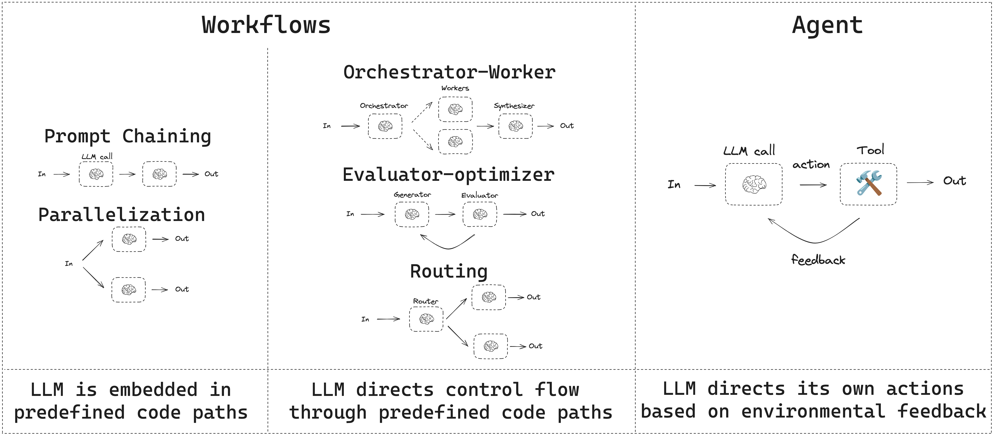

### 五、OpenAI

#### 1.function calling

##### 1.1 基本流程

工具调用是通过 OpenAI API 在应用程序和模型之间进行的多步骤对话。工具调用流程包含五个步骤：

1. 使用模型可以调用的工具向模型发出请求
2. 接收来自模型的工具调用
3. 使用工具调用的输入在应用程序端执行代码
4. 使用工具输出向模型发出第二个请求
5. 接收来自模型的最终响应（或更多工具调用）

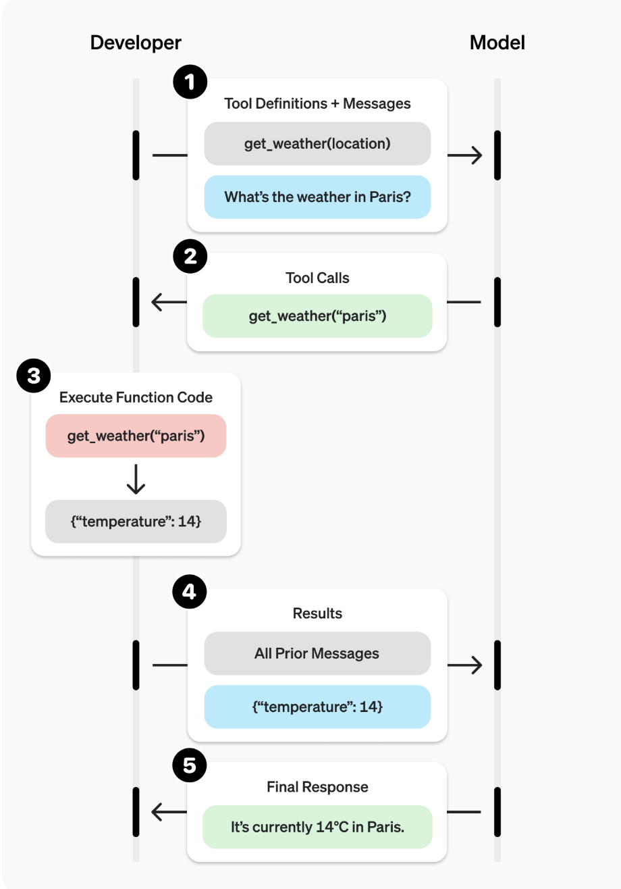

##### 1.2 使用示例

初始化和工具定义

定义一个名为 `get_horoscope` 的函数，即根据星座预测运势，只有一个参数即星座名

```python
from openai import OpenAI
import json
client = OpenAI()

tools = [
    {
        "type": "function",
        "name": "get_horoscope",
        "description": "Get today's horoscope for an astrological sign.",
        "parameters": {
            "type": "object",
            "properties": {
                "sign": {
                    "type": "string",
                    "description": "An astrological sign like Taurus or Aquarius",
                },
            },
            "required": ["sign"],
        },
    },
]
```

首次 $API$ 调用

用户询问水瓶座运势，模式识别需要调用工具

```python
input_list = [
    {"role": "user", "content": "What is my horoscope? I am an Aquarius."}
]

response = client.responses.create(
    model="gpt-5",
    tools=tools,
    input=input_list,
)
```

提取函数调用信息，这里获得的参数是`{"sign": "Aquarius"}`

```python
function_call = None
function_call_arguments = None
input_list += response.output
for item in response.output:
    if item.type == "function_call":
        function_call = item
        function_call_arguments = json.loads(item.arguments)
```

执行函数逻辑

```python
def get_horoscope(sign):
    return f"{sign}: Next Tuesday you will befriend a baby otter."

result = {"horoscope": get_horoscope(function_call_arguments["sign"])}
```

将回复给模型让其再调用得到最终回复

```python
input_list.append({
    "type": "function_call_output",
    "call_id": function_call.call_id,
    "output": json.dumps(result),
})

response = client.responses.create(
    model="gpt-5",
    instructions="Respond only with a horoscope generated by a tool.",
    tools=tools,
    input=input_list,
)
```

##### 1.3 定义大模型调用的工具格式

大模型会根据这个json文件和用户的提问来进行意图识别，决定是否要调用工具

| Field         | Description                                                  |
| :------------ | :----------------------------------------------------------- |
| `type`        | This should always be `function`                             |
| `name`        | The function's name (e.g. `get_weather`)                     |
| `description` | Details on when and how to use the function                  |
| `parameters`  | [JSON schema](https://json-schema.org/) defining the function's input arguments |
| `strict`      | Whether to enforce strict mode for the function call         |

```json
{
    "type": "function",
    "name": "get_weather",
    "description": "Retrieves current weather for the given location.",
    "parameters": {
        "type": "object",
        "properties": {
            "location": {
                "type": "string",
                "description": "City and country e.g. Bogotá, Colombia"
            },
            "units": {
                "type": "string",
                "enum": ["celsius", "fahrenheit"],
                "description": "Units the temperature will be returned in."
            }
        },
        "required": ["location", "units"],
        "additionalProperties": false
    },
    "strict": true
}
```

##### 1.4 工具调用返回格式

```json
{
    "id": "fc_12345xyz",
    "call_id": "call_12345xyz",
    "type": "function_call",
    "name": "get_weather",
    "arguments": "{\"location\":\"Paris, France\"}"
}
```

#### 2. 请求格式

必须参数

```json
{
  "model": "gpt-4o",           // 模型名称
  "messages": [                // 对话消息数组
    {
      "role": "system",
      "content": "你是一个有用的助手"
    },
    {
      "role": "user", 
      "content": "你好"
    }
  ]
}
```

常见可用参数

```json
{
  "max_tokens": 150,           // 最大生成token数
  "max_completion_tokens": 150, // 完成token数限制（新版本）
  "temperature": 0.7,          // 温度 (0-2，控制随机性)
  "top_p": 0.9,               // 核采样 (0-1)
  "n": 1,                     // 生成响应数量
  "stop": ["\n", "。"],        // 停止词列表
  "stream": false             // 是否流式返回
}
```

带工具的请求格式

```json
{
  "model": "gpt-4",
  "messages": [
    {"role": "user", "content": "请帮我读取文件 data.csv"}
  ],
  "tools": [
    {
      "type": "function",
      "function": {
        "name": "file_reader",
        "description": "读取文件内容"
      }
    }
  ],
  "tool_choice": "auto"  // 自动决定是否调用工具
}
```

图片 文件格式

```json
input=[{
    "role": "user",
    "content": [
        {"type": "input_text", "text": "what's in this image?"},
        {
            "type": "input_image",
            "image_url": "https://upload.wikimedia.org/wikipedia/commons/thumb/d/dd/Gfp-wisconsin-madison-the-nature-boardwalk.jpg/2560px-Gfp-wisconsin-madison-the-nature-boardwalk.jpg",
        },
    ],
}]

input=[
    {
        "role": "user",
        "content": [
            {
                "type": "input_text",
                "text": "Analyze the letter and provide a summary of the key points.",
            },
            {
                "type": "input_file",
                "file_url": "https://www.berkshirehathaway.com/letters/2024ltr.pdf",
            },
        ],
    },
]

// 上传文件
input=[
    {
        "role": "user",
        "content": [
            {
                "type": "input_file",
                "file_id": file.id,
            },
            {
                "type": "input_text",
                "text": "What is the first dragon in the book?",
            },
        ]
    }
]
```

#### 3. 响应格式

##### 3.1 非流式请求响应格式

```json
{
    "id": "chatcmpl-1214900a-6cdd-4148-b663-b5e2f642b4de",
    "created": 1751494488,
    "model": "claude-sonnet-4-20250514",
    "object": "chat.completion",
    "system_fingerprint": null,
    "choices": [
        {
            "finish_reason": "stop",
            "index": 0,
            "message": {
                "content": "Hello! I'm doing well, thank you for asking. I'm here and ready to help with whatever you'd like to discuss or work on. How are you doing today?",
                "role": "assistant",
                "tool_calls": null,
                "function_call": null
            }
        }
    ],
    "usage": {
        "completion_tokens": 39,
        "prompt_tokens": 13,
        "total_tokens": 52,
        "completion_tokens_details": null,
        "prompt_tokens_details": {
            "audio_tokens": null,
            "cached_tokens": 0
        },
        "cache_creation_input_tokens": 0,
        "cache_read_input_tokens": 0
    }
}
```

##### 3.2 流式请求响应格式

```json
data: {"id":"chatcmpl-123","object":"chat.completion.chunk","created":1677652288,"model":"gpt-4o","choices":[{"index":0,"delta":{"content":"你"},"finish_reason":null}]}

data: {"id":"chatcmpl-123","object":"chat.completion.chunk","created":1677652288,"model":"gpt-4o","choices":[{"index":0,"delta":{"content":"好"},"finish_reason":null}]}

data: {"id":"chatcmpl-123","object":"chat.completion.chunk","created":1677652288,"model":"gpt-4o","choices":[{"index":0,"delta":{},"finish_reason":"stop"}]}

data: [DONE]
```

### 六、Agent2Agent

#### 1. 概述

$A2A$ 协议是用来控制多个 $agent$ 之间的交互，因为有很多不同的框架比如 $langchain$，$crewai$ 等等，如果一个 $agent$ 要获取另一个 $agent$ 服务需要一个协议来控制他们之间通信的方式。它利用 $HTTP/HTTPS$ 作为传输层，采用 $JSON-RPC \ 2.0$ 的消息格式

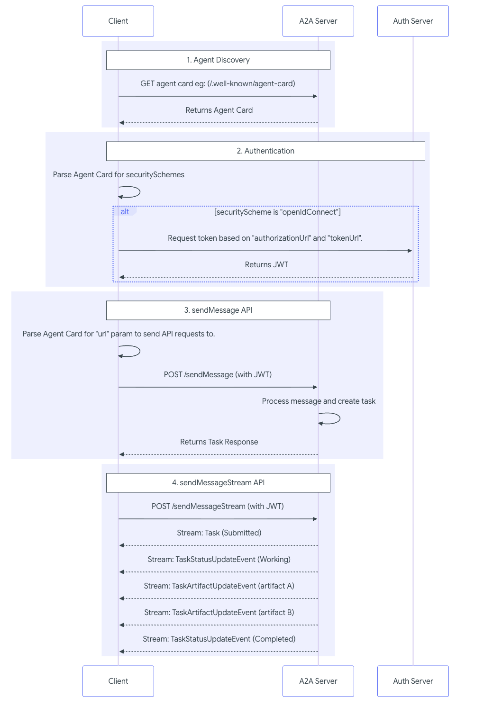

#### 2. Task 与 Message

- **创建**：Task 由 Client 发起（通过 `tasks/send` 或 `tasks/sendSubscribe` 方法）。  
- **状态管理**：Task 的状态由 Server 维护和更新。  
- **唯一标识**：每个 Task 拥有唯一 ID，用于标识交互（错误状态、发送补充输入、取消等）。  
- **会话关联**：Task 可挂载到一个 `sessionId` 下，多个任务属于同一会话。  
- **消息交换**：Client 和 Server 在 Task 的上下文中交换 **Message**。  
- **结果生成**：Server 在 Task 执行过程中或完成后生成 **Artifact** 作为结果。  

```text
Task = { id, status, input, output, sessionId }
```

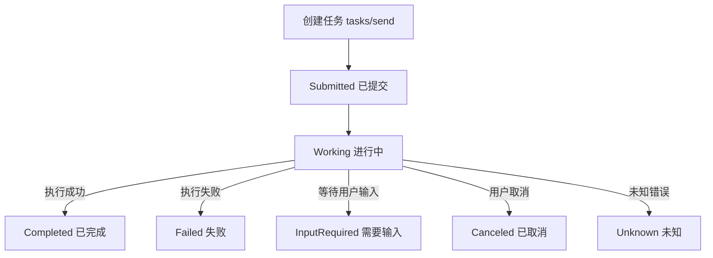

**Message 抽象模型**

```
Message = { role ∈ {user, agent}, parts[], metadata }
```

- **role**: 消息发送者的角色（`user` 或 `agent`）
- **parts[]**: 内容片段数组（至少一个）
- **metadata**: 与消息相关的上下文信息

**Part 类型**

```
Part ∈ { TextPart, FilePart, BytesPart, URIPart, DataPart }
```

- **TextPart**: 包含纯文本内容
- **FilePart**: 包含文件路径、文件内容或引用
- **BytesPart**: 包含原始二进制数据（适用于图像/音频等）
- **URIPart**: 包含一个可访问的资源地址 (URL/URI)
- **DataPart**: 包含结构化 JSON 数据

**Message 示例**

```
interface Message {
  role: "user" | "agent";     
  parts: Part[];              
  metadata?: Record<string, any> | null;
}
```

**Artifacts** 代表 $agent$ 的产物，即文件或者输出结果	

**核心概念（快速记忆卡）**

- **Message（消息）**：无状态或轻量的交互；通常用于即时答复或协商（“你能做这个吗？”）。
- **Task（任务）**：有状态的工作单元，用于可跟踪、可能耗时、可中断/需输入的操作。
- **contextId**：把一系列 Message/Task 绑在一起的会话/上下文标识（代表同一对话/目标）。
- **taskId**：任务唯一标识（Task 对象的 id）。
- **artifact / artifactId**：任务产出的资源（文件/图像/文档等）与其版本 ID。
- **referenceTaskIds**：在新交互中引用之前的任务，指明该操作是基于哪个已完成/终止任务的产物进行的“后续/改进”。

**两类基本响应（代理的选择）**

- **Stateless Message**：立即完成，不需要后续状态管理（例如：查询、简单确认）。
- **Stateful Task**：创建一个 Task 对象，后续通过 Task 状态来跟踪执行进度与需要的输入。

代理有三种角色风格：

1. **Message-only agent**：只返回 Message（轻量、简单）。
2. **Task-generating agent**：一切都用 Task（即便很简单的操作也建成已完成的 Task）。
3. **Hybrid agent**：先用 Message 协商范围，再创建 Task 来执行（最常见、最灵活）。

**Task 的典型生命周期（状态机）**

常见状态（实际实现可扩展）：

- `created` / `queued`（可选）：任务已接收、等待执行。
- `in_progress`（运行中）：正在执行。
- `input-required`：代理需要客户端补充信息（并返回说明/表单）。
- `auth-required`：需要额外授权/凭证（例如 OAuth 授权、mTLS）。
- `blocked`（可选）：外部依赖阻塞。
- 终态（不可复原）：`completed`、`canceled`、`rejected`、`failed`。

典型转移：
 `created` → `in_progress` → (`input-required` ↔ `in_progress`) → `completed`
 或 `in_progress` → `failed` / `canceled` / `rejected`
 如果 `input-required`/`auth-required`，客户端必须在同一 contextId 中继续发送消息并填充所需字段 —— 代理在收到补充后继续执行并更新 task 状态。

例如

客户端：请求生成图像（无 contextId —— 新会话）

```json
// client -> agent: message.send (req-001)
{
  "jsonrpc": "2.0",
  "id": "req-001",
  "method": "message.send",
  "params": {
    "message": {
      "role": "user",
      "parts": [{"kind": "text", "text": "Generate an image of a sailboat on the ocean."}],
      "messageId": "msg-user-001"
    }
  }
}
```

解释：`messageId` 用于去重/幂等；未传 `contextId` 表示开启新会话。

代理：创建并立即完成一个 Task（生成图片），返回 `contextId`、`taskId`、artifact。

```json
{
  "result": {
    "id": "task-boat-gen-123",
    "contextId": "ctx-conversation-abc",
    "status": {"state": "completed"},
    "artifacts": [
      {
        "artifactId": "artifact-boat-v1-xyz",
        "name": "sailboat_image.png",
        "description": "A generated image of a sailboat on the ocean.",
        "parts": [ /* file base64 bytes ... */ ]
      }
    ],
    "kind": "task"
  }
}
```

解释：

- `contextId` 表示会话上下文，后续消息要带它以表明继续这个目标。
- `artifactId` 唯一标识生成的图像版本（v1）。
- `task-boat-gen-123` 是第一次任务的 taskId。

客户端：要求把船改成红色，带上相同 `contextId` 并用 `referenceTaskIds` 指向原 task

```json
// client -> agent: message.send (req-002)
{
  "jsonrpc": "2.0",
  "id": "req-002",
  "method": "message.send",
  "params": {
    "message": {
      "role": "user",
      "messageId": "msg-user-002",
      "contextId": "ctx-conversation-abc",
      "referenceTaskIds": ["task-boat-gen-123"],
      "parts": [{"kind": "text", "text": "Please modify the sailboat to be red."}]
    }
  }
}
```

解释：

- `contextId` 维持会话，`referenceTaskIds` 明确请求基于前一次 task 的产物进行改进。客户端也可以直接传 `artifactId` 来指定改哪一个版本。

代理：创建新 Task 并返回新的 artifact（保留 name，但 artifactId 新）

```json
{
  "result": {
    "id": "task-boat-color-456",
    "contextId": "ctx-conversation-abc",
    "status": {"state": "completed"},
    "artifacts": [
      {
        "artifactId": "artifact-boat-v2-red-pqr",
        "name": "sailboat_image.png",            // 保持 name 不变，便于客户端识别“同一资源的新版”
        "description": "A generated image of a red sailboat on the ocean.",
        "parts": [ /* new base64 bytes ... */ ]
      }
    ],
    "kind": "task"
  }
}
```

#### 3. $Agent \ Card $ 

**核心属性**

- `name`, `description`, `version`: 基础信息包括智能体的名字与描述
- `url`: 服务端运行在的地址
- `capabilities`:  `streaming`（流式） or `pushNotifications` （结果实时推送）.
- `defaultInputModes` / `defaultOutputModes`: 默认输入媒介
- `skills`: 提供的能力，为 $AgentSkill$ 对象，包括`id`, `name`, `description`, `inputModes`, `outputModes`, and `examples`.

示例

```python
# This will be the public-facing agent card
public_agent_card = AgentCard(
    name='Hello World Agent',
    description='Just a hello world agent',
    url='http://localhost:9999/',
    version='1.0.0',
    default_input_modes=['text'],
    default_output_modes=['text'],
    capabilities=AgentCapabilities(streaming=True),
    skills=[skill],  # Only the basic skill for the public card
    supports_authenticated_extended_card=True,
)
```

**$AgentCard$ 发现策略**

**(1) Well-Known URI（固定地址发现）**

- 就像网站的“门牌号”。

- 服务器会把它的 *Agent Card* 文件放在固定路径：

  ```
  https://{domain}/.well-known/agent-card.json
  ```

- 客户端只要知道对方的域名，就能去这个标准地址拿到它的 Agent Card。

优点：简单、标准化，自动化发现很方便。
缺点：如果卡片里有敏感信息，需要加认证。

**(2) Curated Registries（集中式注册中心发现）**

- 类似于“应用商店”或“企业内部服务目录”。
- 有个中心化的 **注册表（Registry）**，统一管理所有 Agent 的 *Agent Card*。
- 客户端去查注册表，比如按 “技能 / 标签 / 提供方名称” 来搜索。

优点：集中管理、支持权限控制，能按功能发现 Agent。
缺点：要额外部署和维护一个注册表服务，A2A 标准里没定义统一 API。

**(3) Direct Configuration（直接配置发现）**

- 最简单粗暴：**手工配置**。
- 客户端直接写死 Agent Card 的信息（硬编码、配置文件、环境变量）。

优点：实现容易，适合测试、私有场景。
缺点：缺乏灵活性，一改信息就得重新配置客户端。

客户端通过解析 **AgentCard**，可以知道：  

- 目标 Agent 能做什么  
- 如何与之通信（URL）  
- 是否支持流式传输或推送通知  
- 需要哪种认证方式  
- 提供的技能及细节  

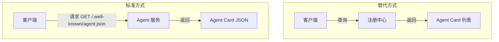

#### 4. $Agent \ Executor$

$AgentExecutor$ 接口提供了两个方法

- `async def execute(self, context: RequestContext, event_queue: EventQueue)`：处理期望响应或事件流的传入请求。它处理用户的输入（可通过 `context` 获得），并使用`event_queue`发回`Message`、`Task`、`TaskStatusUpdateEvent`或`TaskArtifactUpdateEvent`对象。
- `async def cancel(self, context: RequestContext, event_queue: EventQueue)`：处理取消正在进行的任务的请求。

`RequestContext`有关传入请求的信息，例如用户消息和任何现有任务的详细信息。`EventQueue`执行器使用 向客户端发送事件。

**示例**

首先定义一个智能体

``` python 
class HelloWorldAgent:
    """Hello World Agent."""

    async def invoke(self) -> str:
        return 'Hello World'
```

然后定义执行器

```python
class HelloWorldAgentExecutor(AgentExecutor):
    """Test AgentProxy Implementation."""

    def __init__(self):
        self.agent = HelloWorldAgent()
        
    async def execute(
        self,
        context: RequestContext,
        event_queue: EventQueue,
    ) -> None:
        result = await self.agent.invoke()
        await event_queue.enqueue_event(new_agent_text_message(result))
      
   	async def cancel(
        self, context: RequestContext, event_queue: EventQueue
    ) -> None:
        raise Exception('cancel not supported')
```

当 `message/send` 或 `message/stream` 请求进入时（两者都由这个执行器`execute`处理）：

1. 它调用`self.agent.invoke()`以获取“Hello World”字符串。
2. `Message` 它使用实用函数创建一个 $A2A$ 对象 `new_agent_text_message`。
3. 它会将此消息放入队列中`event_queue`。底层`DefaultRequestHandler`会处理此队列，并将响应发送给客户端。对于像这样的单条消息，在流关闭之前，它将产生一个响应`message/send`或一个事件`message/stream`在流关闭之前

#### 5. 启动服务

**核心组件说明**

1. **DefaultRequestHandler**

- SDK 提供的默认请求处理器。  
- 它需要两个参数：  
  1. **AgentExecutor**：你自己实现的 Agent 逻辑（这里是 `HelloWorldAgentExecutor`）。  
  2. **TaskStore**：任务存储器（这里用 `InMemoryTaskStore` 内存版）。  

作用：  
- 将 **A2A RPC 请求** 路由到对应的 executor 方法，比如 `execute`、`cancel`。  
- 用 `TaskStore` 管理任务的生命周期（状态保存、流式交互、重新订阅等）。  

2. **A2AStarletteApplication**

- 一个基于 **Starlette** 的应用包装器。  
- 初始化需要：  
  - `agent_card`: Agent 的元信息（会在 `/.well-known/agent-card.json` 公开）。  
  - `http_handler`: 请求处理器（通常是 `DefaultRequestHandler`）。  
  - `extended_agent_card`: 可选，用于认证用户的扩展版本 Agent Card。  

作用：  
- 将 Agent 信息暴露出来。  
- 处理所有 A2A 方法调用，转发到 `AgentExecutor`。  

3. **uvicorn.run(server.build())**

- `A2AStarletteApplication.build()` 会生成一个标准的 **Starlette app**。  
- `uvicorn.run()` 启动 HTTP 服务，让 Agent 对外可访问。  

参数：  
- `host="0.0.0.0"` → 服务对外网可见。  
- `port=9999` → 监听 9999 端口（与 AgentCard 里的 `url` 保持一致）。  

```python
import uvicorn

from a2a.server.apps import A2AStarletteApplication
from a2a.server.request_handlers import DefaultRequestHandler
from a2a.server.tasks import InMemoryTaskStore
from a2a.types import (
    AgentCapabilities,
    AgentCard,
    AgentSkill,
)
from agent_executor import HelloWorldAgentExecutor


if __name__ == '__main__':
    # 定义基础技能
    skill = AgentSkill(
        id='hello_world',
        name='Returns hello world',
        description='just returns hello world',
        tags=['hello world'],
        examples=['hi', 'hello world'],
    )

    # 定义扩展技能（仅认证用户可见）
    extended_skill = AgentSkill(
        id='super_hello_world',
        name='Returns a SUPER Hello World',
        description='A more enthusiastic greeting, only for authenticated users.',
        tags=['hello world', 'super', 'extended'],
        examples=['super hi', 'give me a super hello'],
    )

    # 公共 Agent Card（匿名用户可见）
    public_agent_card = AgentCard(
        name='Hello World Agent',
        description='Just a hello world agent',
        url='http://localhost:9999/',
        version='1.0.0',
        default_input_modes=['text'],
        default_output_modes=['text'],
        capabilities=AgentCapabilities(streaming=True),
        skills=[skill],  # 公共卡只包含基础 skill
        supports_authenticated_extended_card=True,
    )

    # 认证用户专属的扩展 Agent Card
    specific_extended_agent_card = public_agent_card.model_copy(
        update={
            'name': 'Hello World Agent - Extended Edition',
            'description': 'The full-featured hello world agent for authenticated users.',
            'version': '1.0.1',
            'skills': [skill, extended_skill],  # 同时包含两个 skill
        }
    )

    # 请求处理器：绑定执行器和任务存储
    request_handler = DefaultRequestHandler(
        agent_executor=HelloWorldAgentExecutor(),
        task_store=InMemoryTaskStore(),
    )

    # 启动 A2A 应用
    server = A2AStarletteApplication(
        agent_card=public_agent_card,
        http_handler=request_handler,
        extended_agent_card=specific_extended_agent_card,
    )

    uvicorn.run(server.build(), host='0.0.0.0', port=9999)
```

#### 6. 使用服务

**获取 $Agent \ Card $ 并初始化智能体**

```python
base_url = 'http://localhost:9999'

async with httpx.AsyncClient() as httpx_client:
    # Initialize A2ACardResolver
    resolver = A2ACardResolver(
        httpx_client=httpx_client,
        base_url=base_url,
        # agent_card_path uses default, extended_agent_card_path also uses default
    )
```

`A2ACardResolver` 是一个方便的工具。它首先从服务器的 `/.well-known/agent-card.json` 路径拉取 AgentCard，然后用它初始化客户端。

**发送一个非流式请求**

```python
client = A2AClient(
    httpx_client=httpx_client, agent_card=final_agent_card_to_use
)
logger.info('A2AClient initialized.')
send_message_payload: dict[str, Any] = {
    'message': {
        'role': 'user',
        'parts': [
            {'kind': 'text', 'text': 'how much is 10 USD in INR?'}
        ],
        'messageId': uuid4().hex,
    },
}
request = SendMessageRequest(
    id=str(uuid4()), params=MessageSendParams(**send_message_payload)
)

response = await client.send_message(request)
print(response.model_dump(mode='json', exclude_none=True))
```

- `send_message_payload` 构造 `MessageSendParams` 所需的数据。
- 用 `SendMessageRequest` 封装它。
- 发送后，会得到一个 `SendMessageResponse`，其中可能是成功响应（带 agent 的 `Message`）或错误响应（`JSONRPCErrorResponse`）。

**Handling Task IDs (Illustrative Note for Helloworld):**

Helloworld 客户端没有直接调用 `get_task` 或 `cancel_task`，因为这个简单的 agent 在调用 `message/send` 时，`DefaultRequestHandler` 直接返回一个 `Message` 响应，而不是 `Task` 对象。
 更复杂的 agent（例如 LangGraph 示例）如果 `message/send` 返回 `Task` 对象，那么就可以用它的 `id` 来调用 `get_task` 或 `cancel_task`。

**发送一个流式信息请求**

```python
streaming_request = SendStreamingMessageRequest(
    id=str(uuid4()), params=MessageSendParams(**send_message_payload)
)

stream_response = client.send_message_streaming(streaming_request)

async for chunk in stream_response:
    print(chunk.model_dump(mode='json', exclude_none=True))
```

- 这个方法调用 agent 的 `message/stream` 接口。
- `DefaultRequestHandler` 会调用 `HelloWorldAgentExecutor.execute`。
- 执行过程中会产生一个 "Hello World" 消息，然后关闭事件队列。
- 客户端将收到这条消息作为一个 `SendStreamingMessageResponse` 事件，然后流结束。
- `stream_response` 是一个异步生成器 (AsyncGenerator)。

**期望输出**

运行 `test_client.py` 时，你会看到如下 JSON 输出（`id` 等字段每次运行会不同）：

```python
// Non-streaming response
{"jsonrpc":"2.0","id":"xxxxxxxx","result":{"type":"message","role":"agent","parts":[{"type":"text","text":"Hello World"}],"messageId":"yyyyyyyy"}}

// Streaming response (one chunk)
{"jsonrpc":"2.0","id":"zzzzzzzz","result":{"type":"message","role":"agent","parts":[{"type":"text","text":"Hello World"}],"messageId":"wwwwwwww","final":true}}
```

### 七、claude code agent

#### 1. ClaudeAgentOptions

对于 $claude \ code$ 进行配置，包括模型，工具使用，$hook$ 钩子函数等

```python
@dataclass
class ClaudeAgentOptions:
    allowed_tools: list[str] = field(default_factory=list)
    system_prompt: str | SystemPromptPreset | None = None
    mcp_servers: dict[str, McpServerConfig] | str | Path = field(default_factory=dict)
    permission_mode: PermissionMode | None = None
    continue_conversation: bool = False
    resume: str | None = None
    max_turns: int | None = None
    disallowed_tools: list[str] = field(default_factory=list)
    model: str | None = None
    permission_prompt_tool_name: str | None = None
    cwd: str | Path | None = None
    settings: str | None = None
    add_dirs: list[str | Path] = field(default_factory=list)
    env: dict[str, str] = field(default_factory=dict)
    extra_args: dict[str, str | None] = field(default_factory=dict)
    max_buffer_size: int | None = None
    debug_stderr: Any = sys.stderr  # Deprecated
    stderr: Callable[[str], None] | None = None
    can_use_tool: CanUseTool | None = None
    hooks: dict[HookEvent, list[HookMatcher]] | None = None
    user: str | None = None
    include_partial_messages: bool = False
    fork_session: bool = False
    agents: dict[str, AgentDefinition] | None = None
    setting_sources: list[SettingSource] | None = None
```

例如下面的表达式

```python
CLAUDE_OPTIONS = ClaudeAgentOptions(
    model="claude-sonnet-4-5",

    # 关键1: 添加所有需要的工具到允许列表
    allowed_tools=["Bash"] + PLAYWRIGHT_TOOLS,

    mcp_servers=str(BASE_PATH.parent / ".mcp.json"),

    # 关键2: 为不同工具配置不同的 Hook
    hooks={
        "PreToolUse": [
            # Hook 1: 批准 Bash
            HookMatcher(
                matcher="Bash",
                hooks=[auto_approve_bash]
            )
        ] + PLAYWRIGHT_HOOKS,
    }
)
```

#### 2. Hook 钩子函数

`HookEvent` 是表示支持的 hook 事件类型，Literal是常量

```python
HookEvent = Literal[
    "PreToolUse",      # Called before tool execution
    "PostToolUse",     # Called after tool execution
    "UserPromptSubmit", # Called when user submits a prompt
    "Stop",            # Called when stopping execution
    "SubagentStop",    # Called when a subagent stops
    "PreCompact"       # Called before message compaction
]
```

`HookCallBack` 是钩子函数，用于实际处理

输入为

- `input_data`: Hook-specific input data (see [hook documentation](https://docs.claude.com/en/docs/claude-code/hooks#hook-input))
- `tool_use_id`: Optional tool use identifier (for tool-related hooks)
- `context`: Hook context with additional information 

输出为

- `decision`: `"block"` to block the action
- `systemMessage`: System message to add to the transcript
- `hookSpecificOutput`: Hook-specific output data

`input_data` 是输入数据如下

```json
{
  // Common fields
  session_id: string
  transcript_path: string  // Path to conversation JSON
  cwd: string              // The current working directory when the hook is invoked

  // Event-specific fields
  hook_event_name: string
  ...
}
```

`HookContext`

```python
@dataclass
class HookContext:
    signal: Any | None = None  # Future: abort signal support
```

`HookMatcher`

将钩子函数对应到指定的事件或者工具

```python
@dataclass
class HookMatcher:
    matcher: str | None = None        # Tool name or pattern to match (e.g., "Bash", "Write|Edit")
    hooks: list[HookCallback] = field(default_factory=list)  # List of callbacks to execute
```

示例

```python
from claude_agent_sdk import query, ClaudeAgentOptions, HookMatcher, HookContext
from typing import Any

async def validate_bash_command(
    input_data: dict[str, Any],
    tool_use_id: str | None,
    context: HookContext
) -> dict[str, Any]:
    """Validate and potentially block dangerous bash commands."""
    if input_data['tool_name'] == 'Bash':
        command = input_data['tool_input'].get('command', '')
        if 'rm -rf /' in command:
            return {
                'hookSpecificOutput': {
                    'hookEventName': 'PreToolUse',
                    'permissionDecision': 'deny',
                    'permissionDecisionReason': 'Dangerous command blocked'
                }
            }
    return {}

async def log_tool_use(
    input_data: dict[str, Any],
    tool_use_id: str | None,
    context: HookContext
) -> dict[str, Any]:
    """Log all tool usage for auditing."""
    print(f"Tool used: {input_data.get('tool_name')}")
    return {}

options = ClaudeAgentOptions(
    hooks={
        'PreToolUse': [
            HookMatcher(matcher='Bash', hooks=[validate_bash_command]),
            HookMatcher(hooks=[log_tool_use])  # Applies to all tools
        ],
        'PostToolUse': [
            HookMatcher(hooks=[log_tool_use])
        ]
    }
)

async for message in query(
    prompt="Analyze this codebase",
    options=options
):
    print(message)
```

使用命令可以自动跳过所有权限确认

```bash
claude --dangerously-skip-permissions
```

#### 3. query 函数

创建一个新交互使用claude code，返回一个异步处理器流式返回，它不带记忆

Returns an `AsyncIterator[Message]` that yields messages from the conversation. 返回的是信息列表

```python
async def query(
    *,
    prompt: str | AsyncIterable[dict[str, Any]],
    options: ClaudeAgentOptions | None = None
) -> AsyncIterator[Message]
```

```python
import asyncio
from claude_agent_sdk import query, ClaudeAgentOptions

async def main():
    options = ClaudeAgentOptions(
        system_prompt="You are an expert Python developer",
        permission_mode='acceptEdits',
        cwd="/home/user/project"
    )

    async for message in query(
        prompt="Create a Python web server",
        options=options
    ):
        print(message)


asyncio.run(main())
```

#### 4. tool 工具

通过装饰器的形式加到函数上，定义如下

```python
def tool(
    name: str,
    description: str,
    input_schema: type | dict[str, Any]
) -> Callable[[Callable[[Any], Awaitable[dict[str, Any]]]], SdkMcpTool[Any]]
```

`input_schema` 可以是简单的映射也可以是 $json$ 格式

```python
{"text": str, "count": int, "enabled": bool}

{
    "type": "object",
    "properties": {
        "text": {"type": "string"},
        "count": {"type": "integer", "minimum": 0}
    },
    "required": ["text"]
}
```

### 八、agent 设计模式

#### 1. ReAct

ReAct范式通过一种特殊的提示工程来引导模型，使其每一步的输出都遵循一个固定的轨迹：

- **Thought (思考)：** 这是智能体的“内心独白”。它会分析当前情况、分解任务、制定下一步计划，或者反思上一步的结果。
- **Action (行动)：** 这是智能体决定采取的具体动作，通常是调用一个外部工具，例如 `Search['华为最新款手机']`。
- **Observation (观察)：** 这是执行`Action`后从外部工具返回的结果，例如搜索结果的摘要或API的返回值。

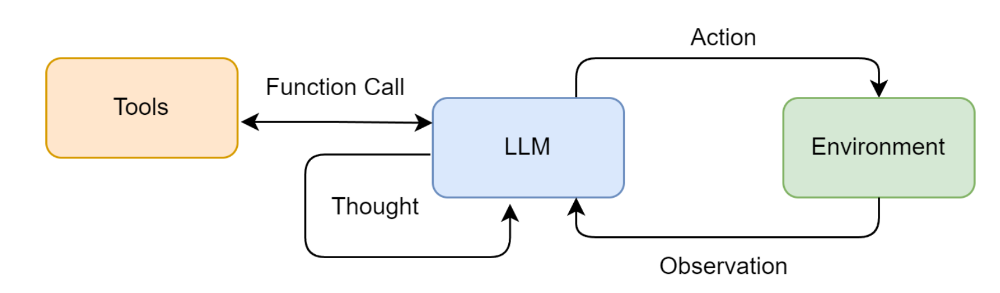

设计工具

```python
from serpapi import SerpApiClient

def search(query: str) -> str:
    """
    一个基于SerpApi的实战网页搜索引擎工具。
    它会智能地解析搜索结果，优先返回直接答案或知识图谱信息。
    """
    print(f"🔍 正在执行 [SerpApi] 网页搜索: {query}")
    try:
        api_key = os.getenv("SERPAPI_API_KEY")
        if not api_key:
            return "错误:SERPAPI_API_KEY 未在 .env 文件中配置。"

        params = {
            "engine": "google",
            "q": query,
            "api_key": api_key,
            "gl": "cn",  # 国家代码
            "hl": "zh-cn", # 语言代码
        }
        
        client = SerpApiClient(params)
        results = client.get_dict()
        
        # 智能解析:优先寻找最直接的答案
        if "answer_box_list" in results:
            return "\n".join(results["answer_box_list"])
        if "answer_box" in results and "answer" in results["answer_box"]:
            return results["answer_box"]["answer"]
        if "knowledge_graph" in results and "description" in results["knowledge_graph"]:
            return results["knowledge_graph"]["description"]
        if "organic_results" in results and results["organic_results"]:
            # 如果没有直接答案，则返回前三个有机结果的摘要
            snippets = [
                f"[{i+1}] {res.get('title', '')}\n{res.get('snippet', '')}"
                for i, res in enumerate(results["organic_results"][:3])
            ]
            return "\n\n".join(snippets)
        
        return f"对不起，没有找到关于 '{query}' 的信息。"

    except Exception as e:
        return f"搜索时发生错误: {e}"
```

构建工具执行器 

注册工具时包括名字，描述和函数

```python
from typing import Dict, Any

class ToolExecutor:
    """
    一个工具执行器，负责管理和执行工具。
    """
    def __init__(self):
        self.tools: Dict[str, Dict[str, Any]] = {}

    def registerTool(self, name: str, description: str, func: callable):
        """
        向工具箱中注册一个新工具。
        """
        if name in self.tools:
            print(f"警告:工具 '{name}' 已存在，将被覆盖。")
        self.tools[name] = {"description": description, "func": func}
        print(f"工具 '{name}' 已注册。")

    def getTool(self, name: str) -> callable:
        """
        根据名称获取一个工具的执行函数。
        """
        return self.tools.get(name, {}).get("func")

    def getAvailableTools(self) -> str:
        """
        获取所有可用工具的格式化描述字符串。
        """
        return "\n".join([
            f"- {name}: {info['description']}" 
            for name, info in self.tools.items()
        ])
```

将我们写的工具注册到 $ToolExecutor$

```python
if __name__ == '__main__':
   	# 1. 初始化工具执行器
    toolExecutor = ToolExecutor()

    # 2. 注册我们的实战搜索工具
    search_description = "一个网页搜索引擎。当你需要回答关于时事、事实以及在你的知识库中找不到的信息时，应使用此工具。"
    toolExecutor.registerTool("Search", search_description, search)
    
    # 3. 打印可用的工具
    print("\n--- 可用的工具 ---")
    print(toolExecutor.getAvailableTools())

    # 4. 智能体的Action调用，这次我们问一个实时性的问题
    print("\n--- 执行 Action: Search['英伟达最新的GPU型号是什么'] ---")
    tool_name = "Search"
    tool_input = "英伟达最新的GPU型号是什么"

    tool_function = toolExecutor.getTool(tool_name)
    if tool_function:
        observation = tool_function(tool_input)
        print("--- 观察 (Observation) ---")
        print(observation)
    else:
        print(f"错误:未找到名为 '{tool_name}' 的工具。")
    
```

ReAct 提示词设计

```python
# ReAct 提示词模板
REACT_PROMPT_TEMPLATE = """
请注意，你是一个有能力调用外部工具的智能助手。

可用工具如下:
{tools}

请严格按照以下格式进行回应:

Thought: 你的思考过程，用于分析问题、拆解任务和规划下一步行动。
Action: 你决定采取的行动，必须是以下格式之一:
- `{{tool_name}}[{{tool_input}}]`:调用一个可用工具。
- `Finish[最终答案]`:当你认为已经获得最终答案时。
- 当你收集到足够的信息，能够回答用户的最终问题时，你必须在Action:字段后使用 finish(answer="...") 来输出最终答案。

现在，请开始解决以下问题:
Question: {question}
History: {history}
"""
```

ReActAgent 设计

```python
class ReActAgent:
    def __init__(self, llm_client: HelloAgentsLLM, tool_executor: ToolExecutor, max_steps: int = 5):
        self.llm_client = llm_client
        self.tool_executor = tool_executor
        self.max_steps = max_steps
        self.history = []
       
    def _parse_output(self, text: str):
        """解析LLM的输出，提取Thought和Action。"""
        thought_match = re.search(r"Thought: (.*)", text)
        action_match = re.search(r"Action: (.*)", text)
        thought = thought_match.group(1).strip() if thought_match else None
        action = action_match.group(1).strip() if action_match else None
        return thought, action

    def _parse_action(self, action_text: str):
        """解析Action字符串，提取工具名称和输入。"""
        match = re.match(r"(\w+)\[(.*)\]", action_text)
        if match:
            return match.group(1), match.group(2)
        return None, None
        
    def run(self, question: str):
        """
        运行ReAct智能体来回答一个问题。
        """
        self.history = [] # 每次运行时重置历史记录
        current_step = 0

        while current_step < self.max_steps:
            current_step += 1
            print(f"--- 第 {current_step} 步 ---")

            # 1. 格式化提示词
            tools_desc = self.tool_executor.getAvailableTools()
            history_str = "\n".join(self.history)
            prompt = REACT_PROMPT_TEMPLATE.format(
                tools=tools_desc,
                question=question,
                history=history_str
            )

            # 2. 调用LLM进行思考
            messages = [{"role": "user", "content": prompt}]
            response_text = self.llm_client.think(messages=messages)
            
            if not response_text:
                print("错误:LLM未能返回有效响应。")
                break

            # 3. 解析LLM的输出
            thought, action = self._parse_output(response_text)
            
            if thought:
                print(f"思考: {thought}")

            if not action:
                print("警告:未能解析出有效的Action，流程终止。")
                break

            # 4. 执行Action
            if action.startswith("Finish"):
                # 如果是Finish指令，提取最终答案并结束
                final_answer = re.match(r"Finish\[(.*)\]", action).group(1)
                print(f"🎉 最终答案: {final_answer}")
                return final_answer
            
            tool_name, tool_input = self._parse_action(action)
            if not tool_name or not tool_input:
                # ... 处理无效Action格式 ...
                continue

            print(f"🎬 行动: {tool_name}[{tool_input}]")
            
            tool_function = self.tool_executor.getTool(tool_name)
            if not tool_function:
                observation = f"错误:未找到名为 '{tool_name}' 的工具。"
            else:
                observation = tool_function(tool_input) # 调用真实工具
                print(f"👀 观察: {observation}")
            
            # 将本轮的Action和Observation添加到历史记录中
            self.history.append(f"Action: {action}")
            self.history.append(f"Observation: {observation}")

        # 循环结束
        print("已达到最大步数，流程终止。")
        return None
```

#### 2. Plan-and-solve

1. **规划阶段 (Planning Phase)**： 首先，智能体会接收用户的完整问题。它的第一个任务不是直接去解决问题或调用工具，而是**将问题分解，并制定出一个清晰、分步骤的行动计划**。这个计划本身就是一次大语言模型的调用产物。
2. **执行阶段 (Solving Phase)**： 在获得完整的计划后，智能体进入执行阶段。它会**严格按照计划中的步骤，逐一执行**。每一步的执行都可能是一次独立的 LLM 调用，或者是对上一步结果的加工处理，直到计划中的所有步骤都完成，最终得出答案。

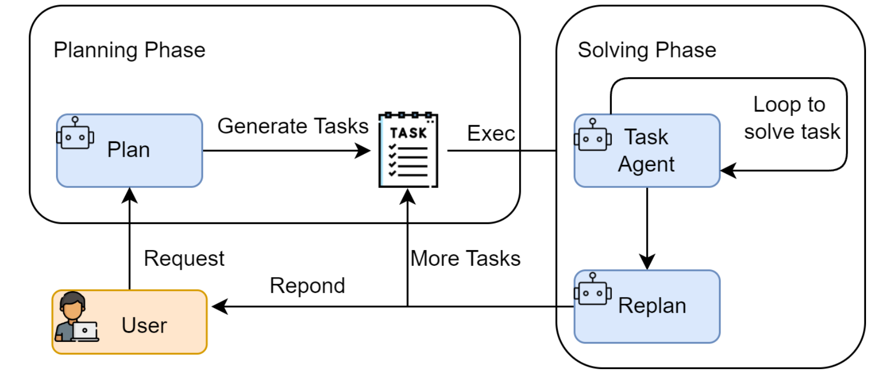

$PlanAgent$ 设计

````python
PLANNER_PROMPT_TEMPLATE = """
你是一个顶级的AI规划专家。你的任务是将用户提出的复杂问题分解成一个由多个简单步骤组成的行动计划。
请确保计划中的每个步骤都是一个独立的、可执行的子任务，并且严格按照逻辑顺序排列。
你的输出必须是一个Python列表，其中每个元素都是一个描述子任务的字符串。

问题: {question}

请严格按照以下格式输出你的计划,```python与```作为前后缀是必要的:
```python
["步骤1", "步骤2", "步骤3", ...]
```
"""
````

```python
# 假定 llm_client.py 中的 HelloAgentsLLM 类已经定义好
# from llm_client import HelloAgentsLLM

class Planner:
    def __init__(self, llm_client):
        self.llm_client = llm_client

    def plan(self, question: str) -> list[str]:
        """
        根据用户问题生成一个行动计划。
        """
        prompt = PLANNER_PROMPT_TEMPLATE.format(question=question)
        
        # 为了生成计划，我们构建一个简单的消息列表
        messages = [{"role": "user", "content": prompt}]
        
        print("--- 正在生成计划 ---")
        # 使用流式输出来获取完整的计划
        response_text = self.llm_client.think(messages=messages) or ""
        
        print(f"✅ 计划已生成:\n{response_text}")
        
        # 解析LLM输出的列表字符串
        try:
            # 找到```python和```之间的内容
            plan_str = response_text.split("```python")[1].split("```")[0].strip()
            # 使用ast.literal_eval来安全地执行字符串，将其转换为Python列表
            plan = ast.literal_eval(plan_str)
            return plan if isinstance(plan, list) else []
        except (ValueError, SyntaxError, IndexError) as e:
            print(f"❌ 解析计划时出错: {e}")
            print(f"原始响应: {response_text}")
            return []
        except Exception as e:
            print(f"❌ 解析计划时发生未知错误: {e}")
            return []
```

$ExcutorAgent$ 设计

```python
EXECUTOR_PROMPT_TEMPLATE = """
你是一位顶级的AI执行专家。你的任务是严格按照给定的计划，一步步地解决问题。
你将收到原始问题、完整的计划、以及到目前为止已经完成的步骤和结果。
请你专注于解决“当前步骤”，并仅输出该步骤的最终答案，不要输出任何额外的解释或对话。

# 原始问题:
{question}

# 完整计划:
{plan}

# 历史步骤与结果:
{history}

# 当前步骤:
{current_step}

请仅输出针对“当前步骤”的回答:
"""
```

```python
class Executor:
    def __init__(self, llm_client):
        self.llm_client = llm_client

    def execute(self, question: str, plan: list[str]) -> str:
        """
        根据计划，逐步执行并解决问题。
        """
        history = "" # 用于存储历史步骤和结果的字符串
        
        print("\n--- 正在执行计划 ---")
        
        for i, step in enumerate(plan):
            print(f"\n-> 正在执行步骤 {i+1}/{len(plan)}: {step}")
            
            prompt = EXECUTOR_PROMPT_TEMPLATE.format(
                question=question,
                plan=plan,
                history=history if history else "无", # 如果是第一步，则历史为空
                current_step=step
            )
            
            messages = [{"role": "user", "content": prompt}]
            
            response_text = self.llm_client.think(messages=messages) or ""
            
            # 更新历史记录，为下一步做准备
            history += f"步骤 {i+1}: {step}\n结果: {response_text}\n\n"
            
            print(f"✅ 步骤 {i+1} 已完成，结果: {response_text}")

        # 循环结束后，最后一步的响应就是最终答案
        final_answer = response_text
        return final_answer
```

构建主类

```python
class PlanAndSolveAgent:
    def __init__(self, llm_client):
        """
        初始化智能体，同时创建规划器和执行器实例。
        """
        self.llm_client = llm_client
        self.planner = Planner(self.llm_client)
        self.executor = Executor(self.llm_client)

    def run(self, question: str):
        """
        运行智能体的完整流程:先规划，后执行。
        """
        print(f"\n--- 开始处理问题 ---\n问题: {question}")
        
        # 1. 调用规划器生成计划
        plan = self.planner.plan(question)
        
        # 检查计划是否成功生成
        if not plan:
            print("\n--- 任务终止 --- \n无法生成有效的行动计划。")
            return

        # 2. 调用执行器执行计划
        final_answer = self.executor.execute(question, plan)
        
        print(f"\n--- 任务完成 ---\n最终答案: {final_answer}")
```

#### 3. Reflection

1. **执行 (Execution)**：首先，智能体使用我们熟悉的方法（如 ReAct 或 Plan-and-Solve）尝试完成任务，生成一个初步的解决方案或行动轨迹。这可以看作是“初稿”。
2. **反思 (Reflection)**：接着，智能体进入反思阶段。它会调用一个独立的、或者带有特殊提示词的大语言模型实例，来扮演一个“评审员”的角色。这个“评审员”会审视第一步生成的“初稿”，并从多个维度进行评估，例如：
   - **事实性错误**：是否存在与常识或已知事实相悖的内容？
   - **逻辑漏洞**：推理过程是否存在不连贯或矛盾之处？
   - **效率问题**：是否有更直接、更简洁的路径来完成任务？
   - **遗漏信息**：是否忽略了问题的某些关键约束或方面？ 根据评估，它会生成一段结构化的**反馈 (Feedback)**，指出具体的问题所在和改进建议。
3. **优化 (Refinement)**：最后，智能体将“初稿”和“反馈”作为新的上下文，再次调用大语言模型，要求它根据反馈内容对初稿进行修正，生成一个更完善的“修订稿”。

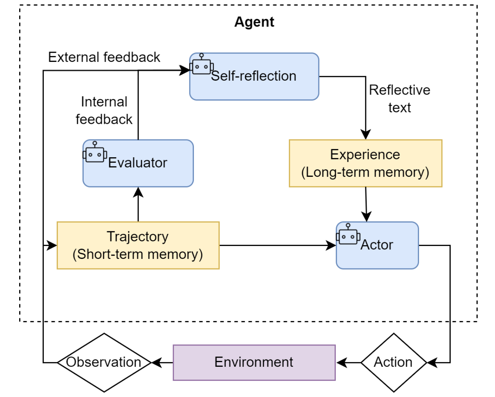

先设计提示词，分为初始执行提示词，反思提示词，优化提示词

```python
INITIAL_PROMPT_TEMPLATE = """
你是一位资深的Python程序员。请根据以下要求，编写一个Python函数。
你的代码必须包含完整的函数签名、文档字符串，并遵循PEP 8编码规范。

要求: {task}

请直接输出代码，不要包含任何额外的解释。
"""
```

````python
REFLECT_PROMPT_TEMPLATE = """
你是一位极其严格的代码评审专家和资深算法工程师，对代码的性能有极致的要求。
你的任务是审查以下Python代码，并专注于找出其在<strong>算法效率</strong>上的主要瓶颈。

# 原始任务:
{task}

# 待审查的代码:
```python
{code}
```

请分析该代码的时间复杂度，并思考是否存在一种<strong>算法上更优</strong>的解决方案来显著提升性能。
如果存在，请清晰地指出当前算法的不足，并提出具体的、可行的改进算法建议（例如，使用筛法替代试除法）。
如果代码在算法层面已经达到最优，才能回答“无需改进”。

请直接输出你的反馈，不要包含任何额外的解释。
"""
````

````python
REFINE_PROMPT_TEMPLATE = """
你是一位资深的Python程序员。你正在根据一位代码评审专家的反馈来优化你的代码。

# 原始任务:
{task}

# 你上一轮尝试的代码:
```
{last_code_attempt}
评审员的反馈：
{feedback}

请根据评审员的反馈，生成一个优化后的新版本代码。
你的代码必须包含完整的函数签名、文档字符串，并遵循PEP 8编码规范。
请直接输出优化后的代码，不要包含任何额外的解释。
"""
````

```python
# 假设 llm_client.py 和 memory.py 已定义
# from llm_client import HelloAgentsLLM
# from memory import Memory

class ReflectionAgent:
    def __init__(self, llm_client, max_iterations=3):
        self.llm_client = llm_client
        self.memory = Memory()
        self.max_iterations = max_iterations

    def run(self, task: str):
        print(f"\n--- 开始处理任务 ---\n任务: {task}")

        # --- 1. 初始执行 ---
        print("\n--- 正在进行初始尝试 ---")
        initial_prompt = INITIAL_PROMPT_TEMPLATE.format(task=task)
        initial_code = self._get_llm_response(initial_prompt)
        self.memory.add_record("execution", initial_code)

        # --- 2. 迭代循环:反思与优化 ---
        for i in range(self.max_iterations):
            print(f"\n--- 第 {i+1}/{self.max_iterations} 轮迭代 ---")

            # a. 反思
            print("\n-> 正在进行反思...")
            last_code = self.memory.get_last_execution()
            reflect_prompt = REFLECT_PROMPT_TEMPLATE.format(task=task, code=last_code)
            feedback = self._get_llm_response(reflect_prompt)
            self.memory.add_record("reflection", feedback)

            # b. 检查是否需要停止
            if "无需改进" in feedback:
                print("\n✅ 反思认为代码已无需改进，任务完成。")
                break

            # c. 优化
            print("\n-> 正在进行优化...")
            refine_prompt = REFINE_PROMPT_TEMPLATE.format(
                task=task,
                last_code_attempt=last_code,
                feedback=feedback
            )
            refined_code = self._get_llm_response(refine_prompt)
            self.memory.add_record("execution", refined_code)
        
        final_code = self.memory.get_last_execution()
        print(f"\n--- 任务完成 ---\n最终生成的代码:\n```python\n{final_code}\n```")
        return final_code

    def _get_llm_response(self, prompt: str) -> str:
        """一个辅助方法，用于调用LLM并获取完整的流式响应。"""
        messages = [{"role": "user", "content": prompt}]
        rresponse_text = self.llm_client.think(messages=messages) or ""
        return response_text
```


