## 大模型算法

### 一、PyTorch基础

#### 1. 模型评价指标

**混淆矩阵**

用来看每个类别之间的准确率，常用来做目标分类

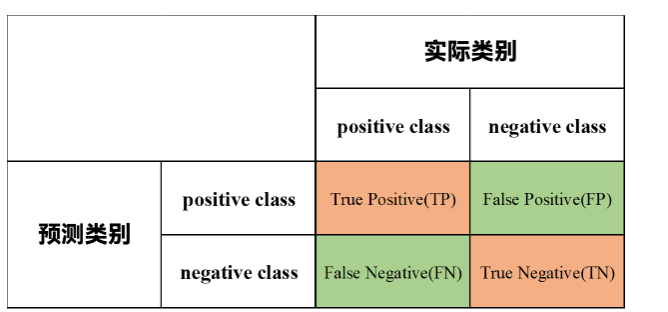

代码如下

```python
from sklearn.metrics import confusion_matrix
def compute_confusion_matrix(labels,pred_labels_list,gt_labels_list):
    pred_labels_list = np.asarray(pred_labels_list)
    gt_labels_list = np.assarray(gt_labels_list)
    matrix = confusion_matrix(test_label_list,
                              pred_label_list,
                              labels=labels)
    return matrix
```

**Overall Accuracy**

OA 代表了所有预测正确的样本占总样本的比例，公式为 $OA = \frac{TP+TN}{TP+TN+FP+FN}$ 

**Average accuracy**

$AA = \frac{(\frac{TP}{TP+FN} + \frac{TN}{TN+FP})}{2}$

**Recall**

$Recall = \frac{TP}{TP+FN}$，正样本被正确识别的比例

**Precision**

$Precsion = \frac{TP}{TP+FP}$，预测正确的正样本所占的比例

**F1**

$F1 = 2 \times \frac{P \times R}{P + R}$ ，召回率和精确率的加权平均，值越高表明鲁棒性越好

**PR曲线**

横轴是召回率，纵轴代表了P（精确率)，P-R曲线上的一个点代表着，在某一阈值下，模型将大于该阈值的结果判定为正样本，小于该阈值的结果判定为负样本，此时返回结果对应的召回率和精确率。整条P-R曲线是通过将阈值从高到低移动而生成的。原点附近代表当阈值最大时模型的精确率和召回率，在PR曲线我们可以从图中直观的看到某一个曲线被另外一条曲线完全包裹，所包围的面积大于另一条曲线包围的面积，举例图中可以说明A模型的性能优于B和C。

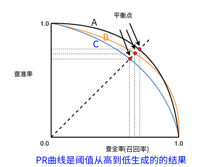

**置信度**

在目标检测中，我们通常需要将边界框内物体划分为正样本和负样本。我们使用置信度这个指标来进行划分，当小于置信度设置的阈值判定为负样本（背景），大于置信度设置的阈值判定为正样本.

**IOU**

$IOU = \frac{A \bigcap B}{A \bigcup B}$ 分子部分是模型预测框与真实标注框之间的重叠区域，分母部分是两者的并集，预测框和实际框所占有的总区域，在实际模型识别时会根据我们自己设定合适的阈值来判定正负样本。

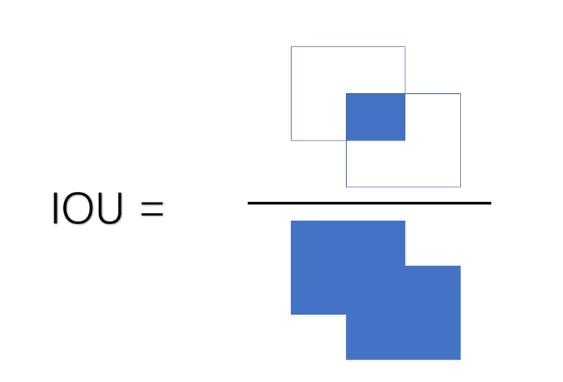

**AP、mAP**

PR 曲线包围的面积，mAP是所有类的 AP 值的平均

#### 2. 张量

创建

```python
import torch
# 随机创建一个四行三列的向量
x = torch.randn(4, 3)
x = torch.zeros(4, 3, dtype = torch.long)
x = torch.tensor([5.5, 3]) # 创建一个包含两个元素的向量
x = torch.randn_like(x, dtype = torch.float)
```

获取维度信息

```python
print(x.size())
print(x.shape)
```

常见 Tensor 的构建方法

| 函数                | 功能                                              |
| :------------------ | :------------------------------------------------ |
| Tensor(sizes)       | 基础构造函数                                      |
| tensor(data)        | 类似于np.array                                    |
| ones(sizes)         | 全1                                               |
| zeros(sizes)        | 全0                                               |
| eye(sizes)          | 对角为1，其余为0                                  |
| arange(s,e,step)    | 从s到e，步长为step                                |
| linspace(s,e,steps) | 从s到e，均匀分成step份                            |
| rand/randn(sizes)   | rand是[0,1)均匀分布；randn是服从N(0，1)的正态分布 |
| normal(mean,std)    | 正态分布(均值为mean，标准差是std)                 |
| randperm(m)         | 随机排列                                          |

操作

```python
import torch
y = torch.rand(4, 3)
print(x + y)
print(torch.add(x, y))
```

```python
x = torch.rand(4, 3)
print(x[:, 1])
# 输出
tensor([-0.0720,  0.0666,  1.0336, -0.6965])
# 索引出来的结果与原数据共享内存，修改一个另一个也会更改，如果不想更改使用copy()等方法
y = x[0, :]
```

```python
x = torch.randn(4, 4)
# torch.view 也是共享内存的
y = x.view(16) # 或者torch.reshape()
z = x.view(-1, 8)
print(x.size(), y.size(), z.size())
torch.Size([4, 4]) torch.Size([16]) torch.Size([2, 8])
```

广播

当两个向量最后一维对齐，如果这一维度是相同的或者其中之一是1的时候，视为相同，可以将维度为1的那个张量广播

```python
x = torch.arange(1, 3).view(1, 2)
print(x)
y = torch.arange(1, 4).view(3, 1)
print(y)
print(x + y)
```

```test
tensor([[1, 2]])
tensor([[1],
        [2],
        [3]])
tensor([[2, 3],
        [3, 4],
        [4, 5]])
```

自动求导

默认 `requires_grad` 为 `False`

如果设置它的属性` .requires_grad` 为 `True`，那么它将会追踪对于该张量的所有操作。当完成计算后可以通过调用` .backward()`，来自动计算所有的梯度。这个张量的所有梯度将会自动累加到`.grad`属性。

在 y.backward() 时，如果 y 是标量，则不需要为 backward() 传入任何参数；否则，需要传入一个与 y 同形的Tensor。

代码块包装在 `with torch.no_grad(): `中，在评估模型时特别有用，因为模型可能具有 `requires_grad = True` 的可训练的参数，但是我们不需要在此过程中对他们进行梯度计算。

```python
x = torch.rann(4, 3, requires_grad = True)
```

每个张量都有一个`.grad_fn`属性，该属性引用了创建 `Tensor `自身的`Function`(除非这个张量是用户手动创建的，即这个张量的`grad_fn`是 `None` )。上面给出的例子中，张量由用户手动创建，因此grad_fn返回结果是None。

```python
y = x**2
print(y)

tensor([[1., 1.],
        [1., 1.]], grad_fn=<PowBackward0>)
```

反向传播是累加的

```python
# 再来反向传播⼀一次，注意grad是累加的
out2 = x.sum()
out2.backward()
print(x.grad)

out3 = x.sum()
x.grad.data.zero_()
out3.backward()
print(x.grad)
```


### 二、深度学习、强化学习、智能体基础

#### 1. 强化学习整体流程

强化学习的两个实体：**智能体（Agent）**与**环境（Environment）**

强化学习中两个实体的交互：

- **状态空间S**：S即为State，指环境中所有可能状态的集合
- **动作空间A**：A即为Action，指智能体所有可能动作的集合
- **奖励R：**R即为Reward，指智能体在环境的某一状态下所获得的奖励。
- **策略P：** 即Policy，决定在给定状态下采取哪个动作的策略
- **值函数V：** 即Value Function，估计某个动作或者状态的价值，即期望的未来汇报

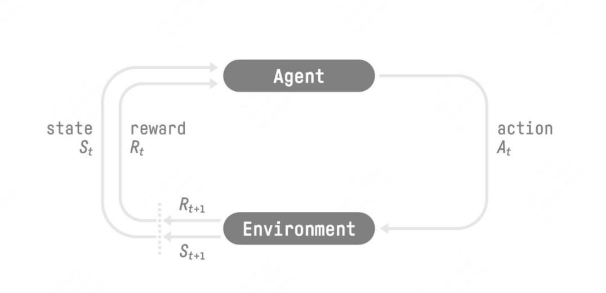

上面的奖励它表示环境进入状态 下的**即时奖励**。但如果只考虑即时奖励，目光似乎太短浅了：当下的状态和动作会影响到未来的状态和动作，进而影响到未来的整体收益。
所以，一种更好的设计方式是：**t时刻状态s的总收益 = 身处状态s能带来的即时收益 + 从状态s出发后能带来的未来收益。**写成表达式就是：$V_t = R_t + \gamma V_{t+1}$ 

#### 2. nlp中的强化学习

- 我们先喂给模型一个 prompt，期望它能产出符合人类喜好的 response
- 在 $t$ 时刻，模型根据上文，产出一个 token，这个 token 即对应着强化学习中的动作，我们记为 $A_t$。因此不难理解，在 NLP 语境下，强化学习任务的动作空间就对应着词表。
- 在 $t$ 时刻，模型产出 token $A_t$ 对应的即时收益为 $R_t$，总收益为 $V_t$（复习一下，$V_t$ 蕴含着“即时收益”与“未来收益”两个内容）。这个收益即可以理解为“对人类喜好的衡量”。此刻，模型的状态从 $S_t$ 变为 $S_{t+1}$，也就是从“上文”变成“上文 + 新产出的 token”
- 在 NLP 语境下，智能体是语言模型本身，环境则对应着它产出的语料

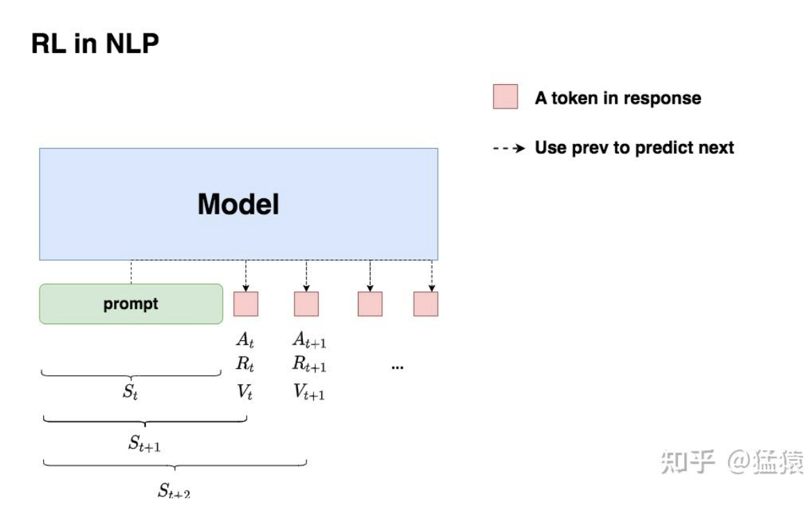

#### 3. RLHF

如上图，**在RLHF-PPO阶段，一共有四个主要模型**，分别是：

- **Actor Model：演员模型**，这就是我们想要训练的目标语言模型，用 $SFT$ 阶段产生的模型对它进行初始化
- **Critic Model：评论家模型**，它的作用是预估总收益，从reward model初始化而来
- **Reward Model：奖励模型**，它的作用是计算即时收益 
- **Reference Model：参考模型**，它的作用是在RLHF阶段给语言模型增加一些“约束”，防止语言模型训歪（朝不受控制的方向更新，效果可能越来越差），也是用SFT阶段模型初始化，在训练过程中参数是冻结的

对Actor模型，我们喂给它一个prompt，它正常输出对应的response。那么response中每一个token肯定有它对应的log_prob结果，我们把这样的结果记为**log_probs**；对Ref模型，我们把Actor生成的"prompt + response"喂给它，那么它同样能给出每个token的log_prob结果，我们记其为**ref_log_probs**；那么这两个模型的输出分布相似度就可以用**`ref_log_probs - log_probs`**来衡量

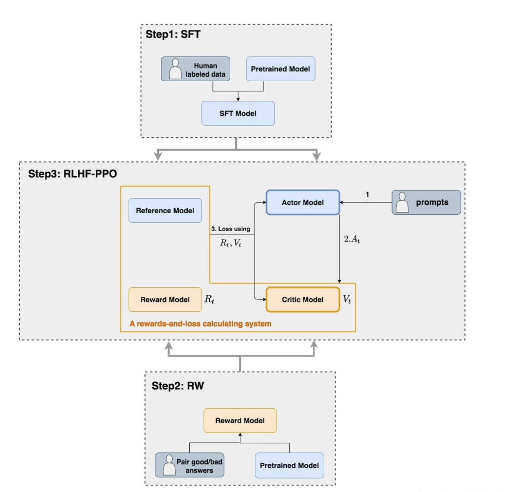

**损失函数计算：**

（1）直观设计

- Actor 接收到当前上文 $S_t$，产出 token $A_t$ （$P(A_t \mid S_t)$）
- Critic 根据 $S_t, A_t$，产出对总收益的预测 $V_t$
- 那么 Actor loss 可以设计为：

$$
actor\_loss = -\sum_{t \in response\_timestep} V_t \log P(A_t \mid S_t)
$$

求和符号表示我们只考虑 response 部分所有 token 的 loss，为了表达简便，我们先把这个求和符号略去（下文也是同理），也就是说：

$$
actor\_loss = -V_t \log P(A_t \mid S_t)
$$

我们希望 minimize 这个 actor\_loss。

（2）引入优势（Advantage）

在开始讲解之前，我们举个小例子：

假设在王者中，中路想支援发育路，这时中路有两种选择：1. 走自家野区。2. 走大龙路。  
中路选择走大龙路，当她做出这个决定后，Critic 告诉她可以收 1 个人头。  
结果，此刻对面打野正在自家采灵芝，对面也没有什么守塔英雄，中路一路直上，最终收割到 2 个人头。  
因为实际收到的人头比预期要多 1 个，中路尝到了“甜头”，所以她增大了“支援发育路走大龙路”的概率。  

这个多出来的“甜头”，就叫做“优势”（Advantage）。

---

对 NLP 任务来说，如果 Critic 对 $A_t$ 的总收益预测为 $V_t$，但实际执行 $A_t$ 后的总收益是  $R_t + \gamma * V_{t+1}$，我们就定义优势为：

$$
Adv_t = R_t + \gamma * V_{t+1} - V_t
$$

我们用 $Adv_t$ 替换掉 $V_t$，则此刻 actor\_loss 变为：

$$
actor\_loss = -Adv_t \log P(A_t \mid S_t)
$$
我们可以引入未来优势考量（对于未来的 $Adv_{t+1}$ 可以通过 $dp$ 算法求得，对于最后一个时刻未来收益和优势都是0倒推即可）：
$$
Adv_t = R_t + \gamma * V_{t+1} - V_t + \gamma * \lambda * Adv_{t+1}
$$
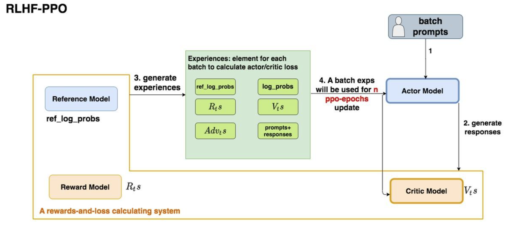

- 第一步，我们准备一个batch的prompts
- 第二步，我们将这个batch的prompts喂给Actor模型，让它生成对应的responses
- 第三步，我们把prompt+responses喂给我们的Critic/Reward/Reference模型，让它生成用于计算actor/critic loss的数据，按照强化学习的术语，我们称这些数据为经验（experiences）。critic loss我们将在后文做详细讲解，目前我们只把目光聚焦到actor loss上
- 第四步，我们根据这些经验，实际计算出actor/critic loss，然后更新Actor和Critic模型

#### 4. DPO

直接将人类的偏好对用于模型的训练，以达到最小的损失满足

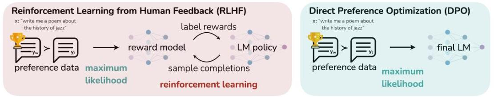

#### 5. agent 设计模式

**反思（Reflection）**：这是指系统能够自我反省或自我评估。在智能体设计中，反思通常意味着智能体能够回顾自己的行为、决策和结果，从而进行调整和改进。

**工具使用（Tool use）**：智能体不仅仅是执行任务，还可以利用外部工具来帮助完成任务。工具使用可以是智能体利用某种设备或技术，来增强其能力和效率。

**规划（Planning）**：智能体能够为实现目标或任务进行规划，选择最佳路径或策略。这种设计模式强调如何通过预先设定的步骤来达成特定目标。

**多智能体协作（Multi-agent collaboration）**：这是指多个智能体之间的合作，共同完成某个任务或解决问题。多个智能体能够相互协作，协调工作以达成共同目标。

### 三、LLM 基础

#### 1. 常见性质

外推性：大模型在训练时和预测时的输入长度不一致，导致模型的泛化能力下降的问题。例如，如果一个模型在训练时只使用了512个 token 的文本，那么在预测时如果输入超过512个 token，模型可能无法正确处理。这就限制了大模型在处理长文本或多轮对话等任务时的效果。

涌现能力：当模型规模（参数量、训练数据量等）增大到某个阈值之后，会**突然**表现出一些在小模型中完全没有、甚至无法预期的复杂能力

### 三、LLM架构对比

#### 1. gpt系列对比

GPT1采用了Transformer架构，其中包括多头自注意力机制和前向神经网络。这使得GPT1可以在处理自然语言时捕捉长距离依赖性，并且具有高效的并行性。GPT-1使用了一种称为“生成式预训练”（Generative Pre-Training，GPT）的技术。预训练分为两个阶段：预训练和微调（fine-tuning）。在预训练阶段，GPT-1使用了大量的无标注文本数据集，例如维基百科和网页文本等。通过最大化预训练数据集上的log-likelihood来训练模型参数。在微调阶段，GPT-1将预训练模型的参数用于特定的自然语言处理任务，如文本分类和问答系统等。

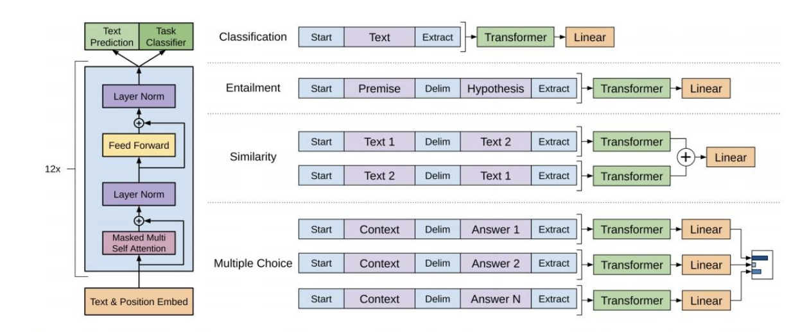

GPT-2主要解决的问题是如何利用大规模未标注的自然语言文本来预训练一个通用的语言模型，从而提高自然语言处理的能力。与GPT-1模型不同之处在于，GPT-2模型使用了更大的模型规模和更多的数据进行预训练，同时增加了许多新的预训练任务。GPT-2具有零样本学习的能力，能够在只看到少量样本的情况下学习和执行新任务。**其主要变化在于训练的数据集规模变大**

GPT-3使用了更深的网络层数和更宽的Transformer网络结构，模型更大，参数更多，表达能力和语言理解能力更强； - GPT-3在预训练阶段使用了更大规模的数据集，并采用了更多样化的预训练任务。 GPT-3的微调阶段采用了zero-shot学习和few-shot的方法，使得GPT-3具备更强的泛化能力和迁移学习能力

InstructGPT：语言模型扩大并不能代表它们会更好地按照用户的意图进行工作，大语言模型很可能会生成一些不真实的、有害的或者是没有帮助的答案。换句话说，这些模型和用户的意图并不一致（not aligned with their users）。**由此OpenAI提出了“align”的概念，即希望模型的输出与人类意图“对齐”，符合人类真实偏好。** 对齐就是让模型回答符合人类的伦理和喜好，而不是乱回答，这里采用了 $RLHF$ 基于人类反馈的强化学习策略。ChatGPT就是在GPT3.5上用指示学习和人类反馈的强化学习来知道模型训练的。

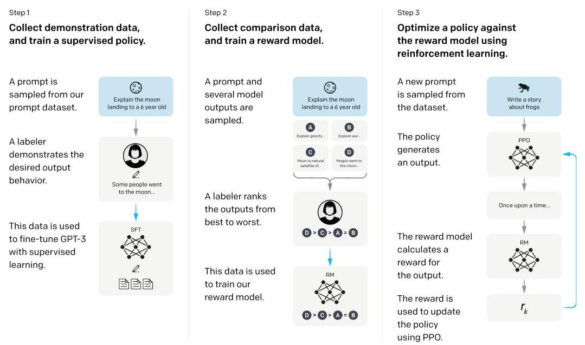

1. 收集**示范数据**，进行有监督微调`SFT`。 - 标注数据：根据prompts（提示，这里就是写的各种各样的问题），人类会撰写一系列demonstrations（演示）作为模型的期望输出（主要是英文）； - 模型微调：**将prompts和人类标注的答案拼在一起，作为人工标注的数据集**，然后使用这部分数据集对预训练的GPT-3进行监督微调，得到第一个模型`SFT`（supervised fine-tuning，有监督微调) - **因为问题和答案是拼在一起的，所以在 GPT 眼中都是一样的，都是给定一段话然后预测下一个词，所以在微调上跟之前的在别的地方做微调或者是做预训练没有任何区别。** 

2.收集**比较数据**，训练奖励模型`RM`。 - 生成式标注是很贵的一件事，所以第二步是进行排序式/判别式标注。用上一步得到的`SFT`模型生成各种问题的答案，标注者（labelers）会对这些输出进行比较和排序（由好到坏，比如下图D>C>A=B）。 - 基于这个数据集，用强化学习训练一个`RM`（reward model)。训练好了之后这个RM模型就可以对生成的答案进行打分，且打出的分数能够满足人工排序的关系。

3.使用强化学习的机制，优化`SFT`模型，得到最终的`RL`模型（InstructGPT)。 将`SFT`模型的输出输入`RM`进行打分，通过强化学习来优化`SFT`模型的参数

#### 2. clip

如下图，在训练阶段，用文本和图像匹配，将文本编码，然后也将图像编码，计算文本向量和图像向量夹角的余弦值，然后用去训练encoder。然后在文本创建 `a photo of a {object}` 和图片去预测相似程度，然后得到分类，这样就可以进行 `zero shot` 学习，即没有样本的情况下也可以学习

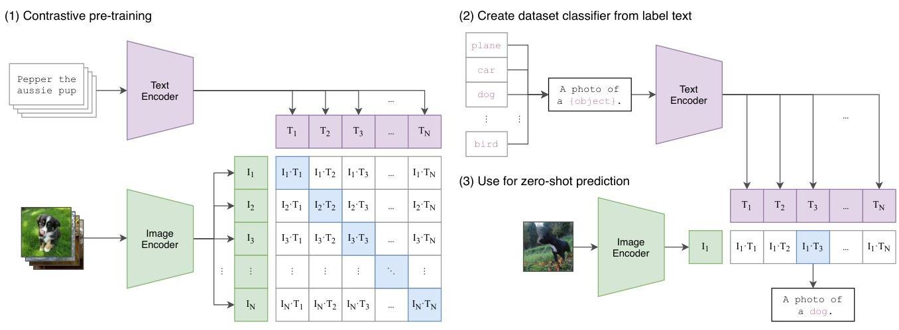

