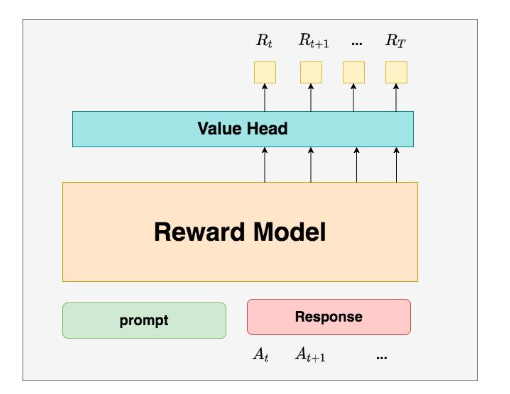
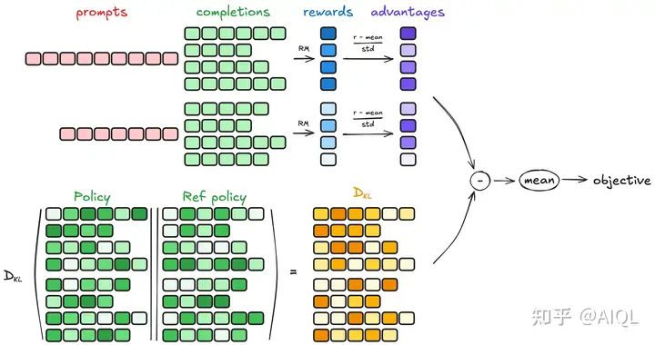
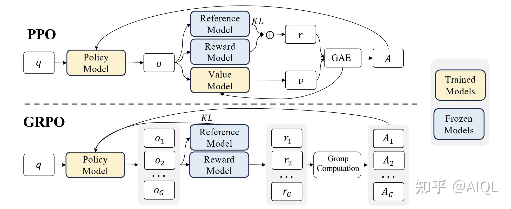
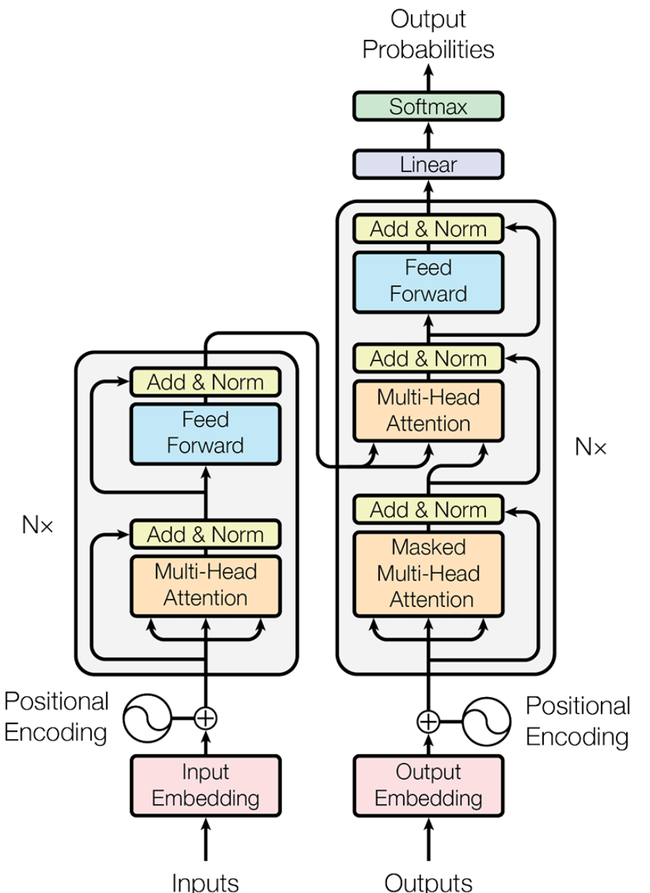
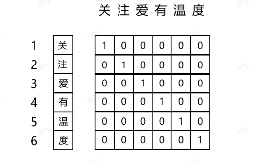
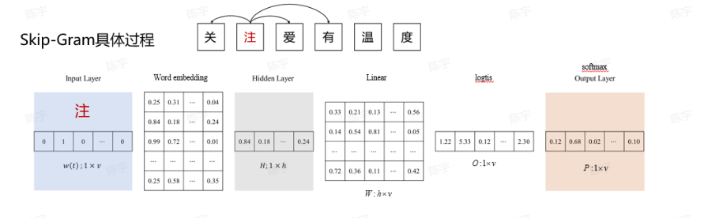
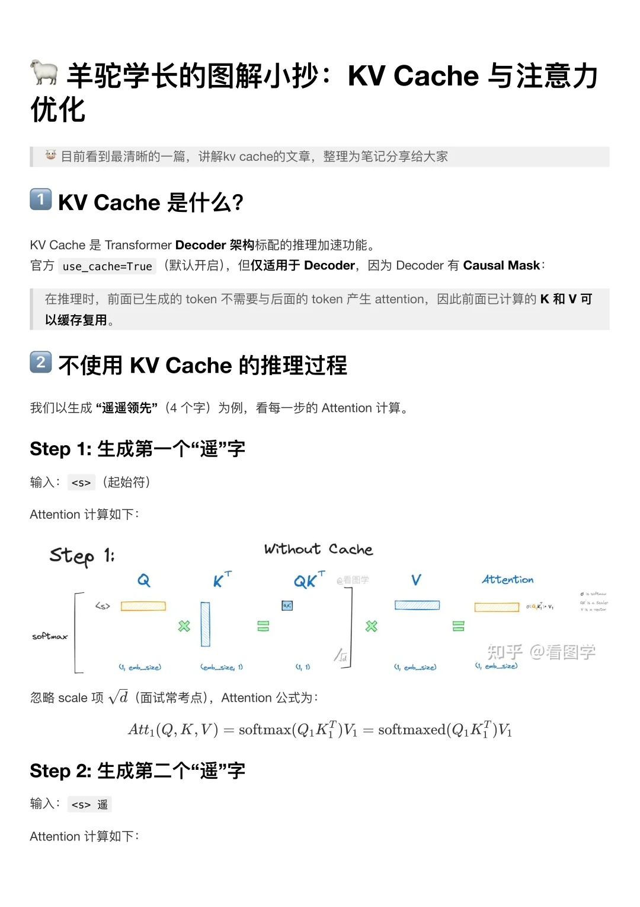
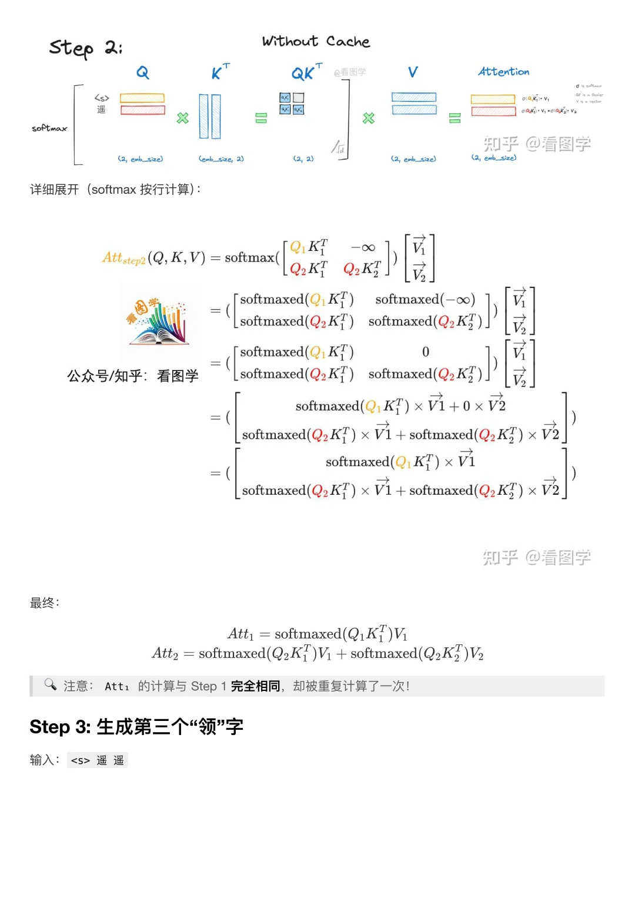
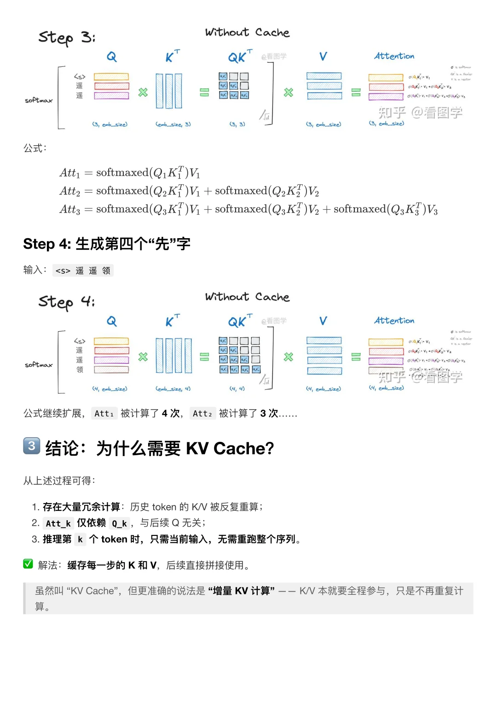
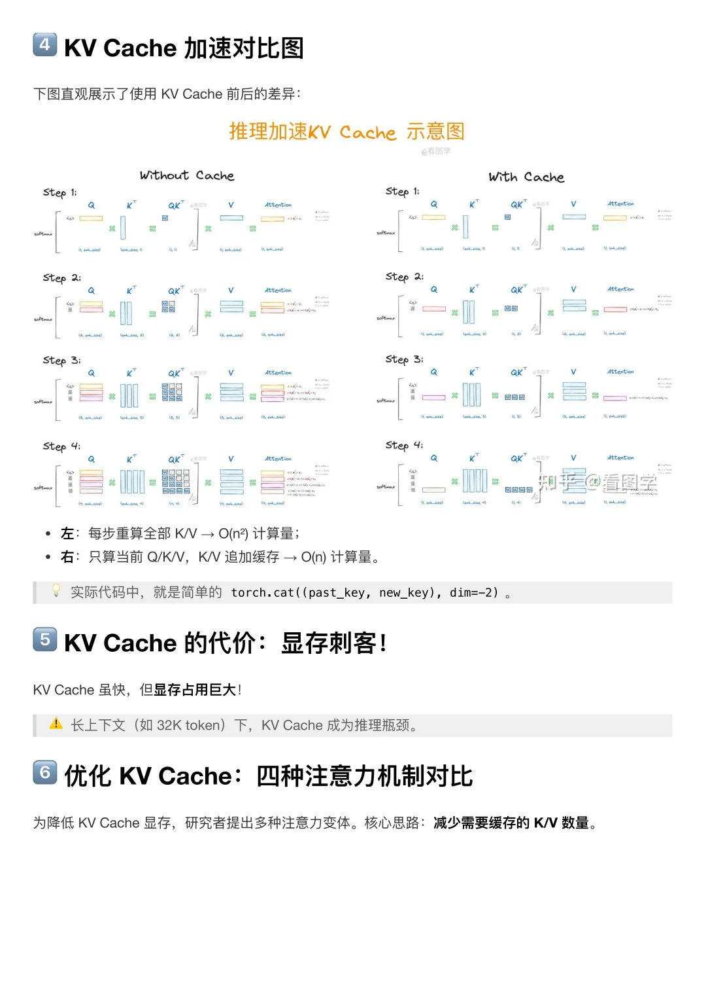

## 大模型算法

### 一、PyTorch基础

#### 1. 模型评价指标

**混淆矩阵**

用来看每个类别之间的准确率，常用来做目标分类


代码如下

```python
from sklearn.metrics import confusion_matrix
def compute_confusion_matrix(labels,pred_labels_list,gt_labels_list):
    pred_labels_list = np.asarray(pred_labels_list)
    gt_labels_list = np.assarray(gt_labels_list)
    matrix = confusion_matrix(test_label_list,
                              pred_label_list,
                              labels=labels)
    return matrix
```

**Overall Accuracy**

OA 代表了所有预测正确的样本占总样本的比例，公式为 $OA = \frac{TP+TN}{TP+TN+FP+FN}$ 

**Average accuracy**

$AA = \frac{(\frac{TP}{TP+FN} + \frac{TN}{TN+FP})}{2}$

**Recall**

$Recall = \frac{TP}{TP+FN}$，正样本被正确识别的比例

**Precision**

$Precsion = \frac{TP}{TP+FP}$，预测正确的正样本所占的比例

**F1**

$F1 = 2 \times \frac{P \times R}{P + R}$ ，召回率和精确率的加权平均，值越高表明鲁棒性越好

**PR曲线**

横轴是召回率，纵轴代表了P（精确率)，P-R曲线上的一个点代表着，在某一阈值下，模型将大于该阈值的结果判定为正样本，小于该阈值的结果判定为负样本，此时返回结果对应的召回率和精确率。整条P-R曲线是通过将阈值从高到低移动而生成的。原点附近代表当阈值最大时模型的精确率和召回率，在PR曲线我们可以从图中直观的看到某一个曲线被另外一条曲线完全包裹，所包围的面积大于另一条曲线包围的面积，举例图中可以说明A模型的性能优于B和C。


**置信度**

在目标检测中，我们通常需要将边界框内物体划分为正样本和负样本。我们使用置信度这个指标来进行划分，当小于置信度设置的阈值判定为负样本（背景），大于置信度设置的阈值判定为正样本.

**IOU**

$IOU = \frac{A \bigcap B}{A \bigcup B}$ 分子部分是模型预测框与真实标注框之间的重叠区域，分母部分是两者的并集，预测框和实际框所占有的总区域，在实际模型识别时会根据我们自己设定合适的阈值来判定正负样本。


**AP、mAP**

PR 曲线包围的面积，mAP是所有类的 AP 值的平均

**交叉熵损失和 KL 散度**

1. **信息熵（Entropy）**

信息熵用于表示随机变量不确定性的度量。它反映了信息源的混乱程度，也就是如果要描述 1 bit 的信息需要多少bit：

- **公式**：
  $$
  H(P) = - \sum_i P(x_i) \log P(x_i)
  $$

- **高熵**：当数据分布较为分散时，信息熵较高，表示不确定性大。

- **低熵**：当数据集中在某些特定值上时，信息熵较低，表示不确定性较小。

2. **交叉熵（Cross-Entropy）**

交叉熵衡量的是预测分布与真实分布之间的信息差异，常用于分类问题中

- **公式**：
  $$
  H(P, Q) = - \sum_i P(x_i) \log Q(x_i)
  $$

- **用途**：它用来衡量实际分布 $P$ 和预测分布 $Q$ 之间的差异。

- 在大模型中，通常  $P(x)=1$ ，即 token 应该输出是确定的

3. **KL 散度（Kullback-Leibler Divergence）**

KL 散度衡量的是从分布 $Q$ 到分布 $P$ 的信息损失：

- **公式**：
  $$
  D_{KL}(P \parallel Q) = \sum_i P(x_i) \log \frac{P(x_i)}{Q(x_i)}
  $$

- **KL 散度与交叉熵的关系**：
  $$
  D_{KL}(P \parallel Q) = H(P, Q) - H(Q)
  $$
  这表明，KL 散度等于交叉熵与真实分布的熵之间的差异。 KL 散度是表示用 $Q$ 去衡量 $P$ 的时候需要多用的比特数

  在大模型训练中，通常使用交叉熵作为损失函数，因为训练数据提供的真实分布 $P$ 是一个 one-hot 向量即模型明确告诉我们期望的 token 是哪一个，因此它的信息熵为 0

4. **KL 散度的物理意义**

- KL 散度表示从分布 $Q$ 编码真实分布 $P$ 所需的额外信息量。通常它是大于零的，且只有当 $P = Q$ 时，KL 散度等于零。

- **为什么 KL 不是一个真正的距离度量？**

  1. KL 散度不满足对称性，即 $KL(P \parallel Q) \neq KL(Q \parallel P)$。
  2. KL 散度不满足三角不等式。

  因此，KL 散度不是一个距离度量。

5. **KL 散度在损失函数中的应用**

KL 散度可以作为损失函数使用，尤其在训练模型时，KL 散度帮助优化模型的预测分布，使其尽可能接近真实分布。具体来说，当真实分布 $Q$ 固定时，KL 散度越小，模型预测的分布与真实分布越接近。

#### 2. 张量

创建

```python
import torch
# 随机创建一个四行三列的向量
x = torch.randn(4, 3)
x = torch.zeros(4, 3, dtype = torch.long)
x = torch.tensor([5.5, 3]) # 创建一个包含两个元素的向量
x = torch.randn_like(x, dtype = torch.float)
y = x.int() # 转换成整数类型
```

获取维度信息

```python
print(x.size())
print(x.shape)
```

```python
single_distance = torch.tensor(25) 
print(single_distance.shape)
# torch.tensor([]) 这是一个标量，最低维度是[1, 1]
with_batch = single_distance.unsqueeze(0)
# torch.tenosr([1])
ready_for_model = with_distance.unsqueeze(1)
# torch.tenosr([1, 1])
value = ready_for_model[0].item() 
```

常见 Tensor 的构建方法

| 函数                | 功能                                              |
| :------------------ | :------------------------------------------------ |
| Tensor(sizes)       | 基础构造函数                                      |
| tensor(data)        | 类似于np.array                                    |
| ones(sizes)         | 全1                                               |
| zeros(sizes)        | 全0                                               |
| eye(sizes)          | 对角为1，其余为0                                  |
| arange(s,e,step)    | 从s到e，步长为step                                |
| linspace(s,e,steps) | 从s到e，均匀分成step份                            |
| rand/randn(sizes)   | rand是[0,1)均匀分布；randn是服从N(0，1)的正态分布 |
| normal(mean,std)    | 正态分布(均值为mean，标准差是std)                 |
| randperm(m)         | 随机排列                                          |

操作

```python
import torch
y = torch.rand(4, 3)
print(x + y)
print(torch.add(x, y))
```

```python
x = torch.rand(4, 3)
print(x[:, 1])
# 输出
tensor([-0.0720,  0.0666,  1.0336, -0.6965])
# 索引出来的结果与原数据共享内存，修改一个另一个也会更改，如果不想更改使用copy()等方法
y = x[0, :]
```

```python
x = torch.randn(4, 4)
# torch.view 也是共享内存的
y = x.view(16) # 或者torch.reshape()
z = x.view(-1, 8)
print(x.size(), y.size(), z.size())
torch.Size([4, 4]) torch.Size([16]) torch.Size([2, 8])
```

广播

当两个向量最后一维对齐，如果这一维度是相同的或者其中之一是1的时候，视为相同，可以将维度为1的那个张量广播

```python
x = torch.arange(1, 3).view(1, 2)
print(x)
y = torch.arange(1, 4).view(3, 1)
print(y)
print(x + y)
```

```test
tensor([[1, 2]])
tensor([[1],
        [2],
        [3]])
tensor([[2, 3],
        [3, 4],
        [4, 5]])
```

自动求导

默认 `requires_grad` 为 `False`

如果设置它的属性` .requires_grad` 为 `True`，那么它将会追踪对于该张量的所有操作。当完成计算后可以通过调用` .backward()`，来自动计算所有的梯度。这个张量的所有梯度将会自动累加到`.grad`属性。

在 y.backward() 时，如果 y 是标量，则不需要为 backward() 传入任何参数；否则，需要传入一个与 y 同形的Tensor。

代码块包装在 `with torch.no_grad(): `中，在评估模型时特别有用，因为模型可能具有 `requires_grad = True` 的可训练的参数，但是我们不需要在此过程中对他们进行梯度计算。

```python
x = torch.rann(4, 3, requires_grad = True)
```

每个张量都有一个`.grad_fn`属性，该属性引用了创建 `Tensor `自身的`Function`(除非这个张量是用户手动创建的，即这个张量的`grad_fn`是 `None` )。上面给出的例子中，张量由用户手动创建，因此grad_fn返回结果是None。

```python
y = x**2
print(y)

tensor([[1., 1.],
        [1., 1.]], grad_fn=<PowBackward0>)
```

反向传播是累加的

```python
# 再来反向传播⼀一次，注意grad是累加的
out2 = x.sum()
out2.backward()
print(x.grad)

out3 = x.sum()
x.grad.data.zero_()
out3.backward()
print(x.grad)
```

#### 3. 基本流程

自己定制 Dataset

```python
import os
import pandas as pd
from torchvision.io import read_image

class MyDataset(Dataset):
    def __init__(self, annotations_file, img_dir, transform=None, target_transform=None):
        """
        Args:
            annotations_file (string): Path to the csv file with annotations.
            img_dir (string): Directory with all the images.
            transform (callable, optional): Optional transform to be applied
                on a sample.
            target_transform (callable, optional): Optional transform to be applied
                on the target.
        """
        self.img_labels = pd.read_csv(annotations_file)
        self.img_dir = img_dir
        self.transform = transform
        self.target_transform = target_transform

    def __len__(self):
        return len(self.img_labels)

    def __getitem__(self, idx):
        """
        Args:
            idx (int): Index
        """
        img_path = os.path.join(self.img_dir, self.img_labels.iloc[idx, 0])
        image = read_image(img_path)
        label = self.img_labels.iloc[idx, 1]
        if self.transform:
            image = self.transform(image)
        if self.target_transform:
            label = self.target_transform(label)
        return image, label
```

设计 dataloader

```python
transform = transforms.Compose([
  transforms.ToTensor(),
  transforms.Normalize((mean,),(std,))
])

dataset = SomeDataset('./data', train = True, download = True, transform = transform)

dataset_loader = DataLoader(train_dataset, batch_size = 32, shuffle = True)

for batch_index, (data, labels) in enumerate(train_loader):
  output = model(data)
```

神经网络的构造

`Module` 类是 `torch.nn` 模块里提供的一个模型构造类，是所有神经网络模块的基类，我们可以继承它来定义我们想要的模型。下面继承 Module 类构造多层感知机。这里定义的 MLP 类重载了 `Module` 类的 `__init__` 函数和 `forward` 函数。它们分别用于创建模型参数和定义前向计算（正向传播）。下面的 MLP 类定义了一个具有两个隐藏层的多层感知机。

```python
import torch
from torch import nn

class MLP(nn.Module):
  # 声明带有模型参数的层，这里声明了两个全连接层
  def __init__(self, **kwargs):
    # 调用MLP父类Block的构造函数来进行必要的初始化。这样在构造实例时还可以指定其他函数
    super(MLP, self).__init__(**kwargs)
    self.hidden = nn.Linear(784, 256)
    self.act = nn.ReLU()
    self.output = nn.Linear(256,10)
    
   # 定义模型的前向计算，即如何根据输入x计算返回所需要的模型输出
  def forward(self, x):
    o = self.act(self.hidden(x))
    return self.output(o)   
```

网络实例化

```python
X = torch.rand(2,784) # 设置一个随机的输入张量
net = MLP() # 实例化模型
print(net) # 打印模型
net(X) # 前向计算
```

```
MLP(
  (hidden): Linear(in_features=784, out_features=256, bias=True)
  (act): ReLU()
  (output): Linear(in_features=256, out_features=10, bias=True)
)
tensor([[ 0.0149, -0.2641, -0.0040,  0.0945, -0.1277, -0.0092,  0.0343,  0.0627,
         -0.1742,  0.1866],
        [ 0.0738, -0.1409,  0.0790,  0.0597, -0.1572,  0.0479, -0.0519,  0.0211,
         -0.1435,  0.1958]], grad_fn=<AddmmBackward>)
```

我们只需要定义 `forward` 函数，`backward`函数会在使用`autograd`时自动定义，`backward`函数用来计算导数。我们可以在 `forward` 函数中使用任何针对张量的操作和计算。

一个模型的可学习参数可以通过`net.parameters()`返回

```python
params = list(net.parameters())
print(len(params))
print(params[0].size())  # conv1的权重
```

`torch.nn`只支持小批量处理 (mini-batches）。整个 `torch.nn` 包只支持小批量样本的输入，不支持单个样本的输入。比如，`nn.Conv2d` 接受一个4维的张量，即`nSamples x nChannels x Height x Width `如果是一个单独的样本，只需要使用`input.unsqueeze(0)` 来添加一个“假的”批大小维度。

- `torch.Tensor` - 一个多维数组，支持诸如`backward()`等的自动求导操作，同时也保存了张量的梯度。
- `nn.Module `- 神经网络模块。是一种方便封装参数的方式，具有将参数移动到GPU、导出、加载等功能。
- `nn.Parameter `- 张量的一种，当它作为一个属性分配给一个`Module`时，它会被自动注册为一个参数。
- `autograd.Function` - 实现了自动求导前向和反向传播的定义，每个`Tensor`至少创建一个`Function`节点，该节点连接到创建`Tensor`的函数并对其历史进行编码。

**模型初始化**

先定义模型初始化参数

```python
def initialize_weights(model):
	for m in model.modules():
		# 判断是否属于Conv2d
		if isinstance(m, nn.Conv2d):
			torch.nn.init.zeros_(m.weight.data)
			# 判断是否有偏置
			if m.bias is not None:
				torch.nn.init.constant_(m.bias.data,0.3)
		elif isinstance(m, nn.Linear):
			torch.nn.init.normal_(m.weight.data, 0.1)
			if m.bias is not None:
				torch.nn.init.zeros_(m.bias.data)
		elif isinstance(m, nn.BatchNorm2d):
			m.weight.data.fill_(1) 		 
			m.bias.data.zeros_()	
```

然后定义模型

```python
# 模型的定义
class MLP(nn.Module):
  # 声明带有模型参数的层，这里声明了两个全连接层
  def __init__(self, **kwargs):
    # 调用MLP父类Block的构造函数来进行必要的初始化。这样在构造实例时还可以指定其他函数
    super(MLP, self).__init__(**kwargs)
    self.hidden = nn.Conv2d(1,1,3)
    self.act = nn.ReLU()
    self.output = nn.Linear(10,1)
    
   # 定义模型的前向计算，即如何根据输入x计算返回所需要的模型输出
  def forward(self, x):
    o = self.act(self.hidden(x))
    return self.output(o)

mlp = MLP()
print(mlp.hidden.weight.data)
print("-------初始化-------")

mlp.apply(initialize_weights)
# 或者initialize_weights(mlp)
print(mlp.hidden.weight.data)
```

首先应该设置模型的状态：如果是训练状态，那么模型的参数应该支持反向传播的修改；如果是验证/测试状态，则不应该修改模型参数。在PyTorch中，模型的状态设置非常简便，如下的两个操作二选一即可：

```
model.train()   # 训练状态
model.eval()   # 验证/测试状态
```

我们前面在DataLoader构建完成后介绍了如何从中读取数据，在训练过程中使用类似的操作即可，区别在于此时要用for循环读取DataLoader中的全部数据。

```
for data, label in train_loader:
```

之后将数据放到GPU上用于后续计算，此处以.cuda()为例

```
data, label = data.cuda(), label.cuda()
```

开始用当前批次数据做训练时，应当先将优化器的梯度置零：

```
optimizer.zero_grad()
```

之后将data送入模型中训练：

```
output = model(data)
```

根据预先定义的criterion计算损失函数：

```
loss = criterion(output, label)
```

将loss反向传播回网络：

```
loss.backward()
```

使用优化器更新模型参数：

```
optimizer.step()
```

这样一个训练过程就完成了，后续还可以计算模型准确率等指标，这部分会在下一节的图像分类实战中加以介绍。

验证/测试的流程基本与训练过程一致，不同点在于：

- 需要预先设置torch.no_grad，以及将model调至eval模式
- 不需要将优化器的梯度置零
- 不需要将loss反向回传到网络
- 不需要更新optimizer

完整的训练和验证流程

```python
def train(epoch):
    model.train()
    train_loss = 0
    for data, label in train_loader:
        data, label = data.cuda(), label.cuda()
        optimizer.zero_grad()
        output = model(data)
        loss = criterion(output, label)
        loss.backward()
        optimizer.step()
        train_loss += loss.item()*data.size(0)
    train_loss = train_loss/len(train_loader.dataset)
		print('Epoch: {} \tTraining Loss: {:.6f}'.format(epoch, train_loss))
    

def val(epoch):       
    model.eval()
    val_loss = 0
    with torch.no_grad():
        for data, label in val_loader:
            data, label = data.cuda(), label.cuda()
            output = model(data)
            preds = torch.argmax(output, 1)
            loss = criterion(output, label)
            val_loss += loss.item()*data.size(0)
            running_accu += torch.sum(preds == label.data)
    val_loss = val_loss/len(val_loader.dataset)
    print('Epoch: {} \tTraining Loss: {:.6f}'.format(epoch, val_loss))
```

模型保存

```python
from torchvision import models
model = models.resnet152(pretrained=True)
save_dir = './resnet152.pth'

# 保存整个模型
torch.save(model, save_dir)
# 保存模型权重
torch.save(model.state_dict, save_dir)
```

#### 4. 神经网络常见的层

* **无参数层**

```python
import torch
from torch import nn

class MyLayer(nn.Module):
    def __init__(self, **kwargs):
        super(MyLayer, self).__init__(**kwargs)
    def forward(self, x):
        return x - x.mean()  
```

* **含模型参数的层**

`Parameter` 类其实是 `Tensor` 的子类，如果一个 `Tensor` 是 `Parameter` ，那么它会⾃动被添加到模型的参数列表里。所以在⾃定义含模型参数的层时，我们应该将参数定义成 `Parameter` ，除了直接定义成 `Parameter` 类外，还可以使⽤ `ParameterList` 和 `ParameterDict` 分别定义参数的列表和字典。

> torch.mm 是矩阵的乘积，不支持广播只支持二维的，torch.matmul是支持广播和多维的

```python
class MyListDense(nn.Module):
    def __init__(self):
        super(MyListDense, self).__init__()
        self.params = nn.ParameterList([nn.Parameter(torch.randn(4, 4)) for i in range(3)])
        self.params.append(nn.Parameter(torch.randn(4, 1)))

    def forward(self, x):
        for i in range(len(self.params)):
            x = torch.mm(x, self.params[i])
        return x
net = MyListDense()
print(net)
```

```python
class MyDictDense(nn.Module):
    def __init__(self):
        super(MyDictDense, self).__init__()
        self.params = nn.ParameterDict({
                'linear1': nn.Parameter(torch.randn(4, 4)),
                'linear2': nn.Parameter(torch.randn(4, 1))
        })
        self.params.update({'linear3': nn.Parameter(torch.randn(4, 2))}) # 新增

    def forward(self, x, choice='linear1'):
        return torch.mm(x, self.params[choice])

net = MyDictDense()
print(net)
```

* **二维卷积层**

```python
import torch
from torch import nn

# 卷积运算（二维互相关）
def corr2d(X, K): 
    h, w = K.shape
    X, K = X.float(), K.float()
    Y = torch.zeros((X.shape[0] - h + 1, X.shape[1] - w + 1))
    for i in range(Y.shape[0]):
        for j in range(Y.shape[1]):
            Y[i, j] = (X[i: i + h, j: j + w] * K).sum()
    return Y

# 二维卷积层
class Conv2D(nn.Module):
    def __init__(self, kernel_size):
        super(Conv2D, self).__init__()
        self.weight = nn.Parameter(torch.randn(kernel_size))
        self.bias = nn.Parameter(torch.randn(1))

    def forward(self, x):
        return corr2d(x, self.weight) + self.bias
```

### 二、强化学习

#### 1. 马尔可夫决策过程

强化学习的两个实体：**智能体（Agent）**与**环境（Environment）**

强化学习中两个实体的交互，下面就是马尔可夫决策过程（MDP）的五元组：

- **状态空间S**：S即为State，指环境中所有可能状态的集合
- **动作空间A**：A即为Action，指智能体所有可能动作的集合
- **奖励R：**R即为Reward，指智能体在环境的某一状态下所获得的奖励。
- **策略P：** 即Policy，决定在给定状态下采取哪个动作的策略
- **衰减 $\gamma$ ：**衰减系数


**POMDP** 是指部分可观测马尔可夫决策过程，即智能体只能根据动作执行后的观测来判断当前的状态，而无法对全局进行整体感知

状态转移函数为 $p_s(s_{t + 1} |s_t, a_t) = E_{{\epsilon}_{t+1}^s}[T(s_{t+1}= W(s_t, a_t, {\epsilon}_{t + 1}^s))]$ ，即在 $s_t$ 状态执行动作 $a_t$ 后状态为 $s_{t + 1}$ 的概率，用期望是因为加入了随机噪声，有一些确定性场景，比如大模型生成中，$a_t$ 为生成下一个token，那么下一个 $s_{t+1}$ 就是确定的了

智能体目标本质就是实现下面的均衡

- **探索（Exploration）**：尝试不熟悉的动作（action）、状态（state）或策略（policy）。通过探索，智能体可以获取更多环境信息，为未来决策打下基础。
- **利用（Exploitation）**：在已有经验或当前认知下，选择看上去收益最高的动作，进一步提高目标回报（reward）。

**nlp中的强化学习**

- 我们先喂给模型一个 prompt，期望它能产出符合人类喜好的 response
- 在 $t$ 时刻，模型根据上文，产出一个 token，这个 token 即对应着强化学习中的动作，我们记为 $A_t$。因此不难理解，在 NLP 语境下，强化学习任务的动作空间就对应着词表。
- 在 $t$ 时刻，模型产出 token $A_t$ 对应的即时收益为 $R_t$，总收益为 $V_t$（复习一下，$V_t$ 蕴含着“即时收益”与“未来收益”两个内容）。这个收益即可以理解为“对人类喜好的衡量”。此刻，模型的状态从 $S_t$ 变为 $S_{t+1}$，也就是从“上文”变成“上文 + 新产出的 token”
- 在 NLP 语境下，智能体是语言模型本身，环境则对应着它产出的语料


#### 2. 贝尔曼方程

这一部分定义了强化学习中如何进行评估以及后面损失函数的设计，奖励是固定的，一次行动环境就会给一个固定的奖励信号；回报是所有奖励的加权和；价值是从当前状态或者动作对未来的预估

##### 2.1 奖励

上面的奖励它表示环境进入状态 下的**即时奖励**。奖励由奖励模型提供，获取奖励的方式有

##### 2.2 回报

但如果只考虑即时奖励，目光似乎太短浅了：当下的状态和动作会影响到未来的状态和动作，进而影响到未来的整体收益。所以，一种更好的设计方式是：**t时刻状态s的总收益 = 身处状态s能带来的即时收益 + 从状态s出发后能带来的未来收益。**写成表达式就是：$V_t = R_t + \gamma V_{t+1}$ 

**回报 $G_t$：** 从时刻 $t$ 起的累计折扣奖励：$G_t = \sum_{k = 0}^{\infty}{{\gamma}^k R_{t+k}}$  

##### 2.3 价值

- **状态价值函数** $V_\theta(s)$: 在策略 $\pi$ 下，从状态 $s$ 开始的期望回报：

$$
V_\theta(s) = \mathbb{E}_\pi [G_t | s_t = s]
$$

从 $V_\theta(s)$ 的定义出发：
$$
V_\theta(s) = \mathbb{E}_\pi [G_t | s_t = s]
$$

将 $G_t$ 展开为奖励和未来回报：

$$
G_t = R_t + \gamma G_{t+1}
$$

代入后得到：

$$
V_\theta(s) = \mathbb{E}_\pi [R_t + \gamma G_{t+1} | S_t = s]
$$

根据期望的线性性质：

$$
V_\theta(s) = \mathbb{E}_\pi [R_t | S_t = s] + \gamma \mathbb{E}_\pi [G_{t+1} | S_t = s]
$$
即时奖励期望：
$$
\mathbb{E}_\pi [R_t | S_t = s] = \sum_a \pi(a | s) \sum_{s'} P(s' | s, a) R(s, a, s')
$$

直观理解就是所有可能状态的概率 $P(s' | s, a)$ 与对应状态的奖励 $R(s, a, s')$ 的期望与策略（Policy）模型在该状态 $s$ 下做出动作 $a$ 的概率之和。

未来回报期望：
$$
\mathbb{E}_\pi [G_{t+1} | S_t = s] = \sum_a \pi(a | s) \sum_{s'} P(s' | s, a) V_\theta(s')
$$

直观理解就是所有可能状态的概率 $P(s' | s, a)$ 与转移状态对应的状态价值函数 $V_\theta(s')$ 的期望与策略（Policy）模型在该状态 $s$ 下做出动作 $a$ 的概率之和。

合并后得到贝尔曼方程：
$$
V_\theta(s) = \sum_a \pi(a | s) \sum_{s'} P(s' | s, a) [R(s, a, s') + \gamma V_\theta(s')]
$$

- **动作价值函数** $Q_\theta(s,a)$: 在策略 $\pi$ 下，从状态 $s$ 执行动作 $a$ 后的期望回报：

$$
Q_\theta(s, a) = \mathbb{E}_\pi [G_t | s_t = s, a_t = a]
$$

类比地，从 $Q_\theta(s, a)$ 出发：

$$
Q_\theta(s, a) = \mathbb{E}_\pi [R_t + \gamma G_{t+1} | S_t = s, A_t = a]
$$

由于动作 $a$ 已确定，直接对下一个状态 $s'$ 求期望：

$$
Q_\theta(s, a) = \sum_{s'} P(s' | s, a) \left[ R(s, a, s') + \gamma \mathbb{E}_\pi [ G_{t+1} | S_{t+1} = s' ] \right]
$$

注意到：

$$
\mathbb{E}_\pi [ G_{t+1} | S_{t+1} = s' ] = V_\theta(s')
$$

状态价值函数的定义为：

$$
V_\theta(s') = \sum_{a'} \pi(a' | s') Q_\theta(s', a')
$$

直观理解就是在状态 $s'$ 下，动作价值函数的所有动作对应的期望是状态价值函数，因为：

$$
Q_\theta(s, a) = \sum_{s'} P(s' | s, a) \left[ R(s, a, s') + \gamma \sum_{a'} \pi(a' | s') Q_\theta(s', a') \right]
$$

##### 2.5 优势

因为状态价值函数是对未来的一个预测，都是不确定的，我们就引入优势，假设当前执行了动作 $a_t$ 后得到的收益可能比在当前状态下的收益多多少，公式可以写为 $Adv_t = Q_{\theta}(s, a) - V_{\theta}(s)$ ，然后通过时序差分分解，时序差分就是正常情况我们要计算回报需要计算完整路径，但是计算量太大了，我们就用预估的下一步价值函数和当前动作的回报作为 Q
$$
Adv_t = R_t + \gamma * V_{t+1} - V_t
$$

##### 2.6 贝尔曼最优方程

对于 MDP 问题，肯定会存在一个确定性的最优策略，就是总会是 $\sum_{s'} P(s' | s, a) [R(s, a, s') + \gamma V_\theta(s')]$ 这个最大的那个动作，这个时候最优策略 ${\pi}_*(a|s)$  就是一个 one-hot 分布，可以用 max 算子来改写上面的方程 
$$
V_{{\pi}_*}(s) = max_a \sum_{s'} P(s' | s, a) [R(s, a, s') + \gamma V_\theta(s')]
$$


#### 3. 致命三元组

在强化学习中，还有一个著名的「致命三元组」（deadly triad）问题，指的是当以下三个因素同时存在时，学习过程可能会变得不稳定甚至发散：

- **自举 (bootstrapping)** ：用估计值来更新估计值，如时序差分 (Temporal Difference, TD) 学习。
- **函数近似 (function approximation)** ：使用神经网络等函数近似器来表示价值函数。
- **Off-policy 学习** ：使用行为策略产生的数据来更新目标策略，如Q学习。

#### 4. 基于价值的强化学习

##### 4.1 动态规划算法

将 bellman 方程更新为
$$
V_{k+1}(s) = \sum_{a} \pi(a | s) \sum_{s'} P(s' | s, a) [R(s, a, s') + \gamma V_k(s')]
$$
其中 $V_k(s)$ 是第 k 次迭代时状态 s 的价值函数估计

**策略迭代算法** （PI）

策略评估：在给定一个策略（初始可能就是一个随机策略）的情况下，计算该策略下各个状态的价值函数。就是上面那个DP过程。

策略控制：利用上一步求解出的价值函数，进行对策略的「贪婪化」，得到一个新的策略 $\pi'$ ，${\pi}^{'}(s) = arg max_a \sum_{s'} P(s' | s, a) [R(s, a, s') + \gamma V_{\pi}(s')]$ ，要保证每次改进都不得劣于之前的策略，策略的改进一定会收敛

**价值迭代算法** （VI）

最大化操作以及隐含了策略改进，不需要显示地维护状态
$$
V_{k+1}(s) = max_a \sum_{s'} P(s' | s, a) [R(s, a, s') + \gamma V_k(s')]
$$
VI每次更新都在「当前价值函数」的基础上进行「极大化」，这在前期能迅速地把价值函数拉向最优值附近。但到达后期，需要许多额外迭代次数来「细调」价值函数，可能出现「振荡」或「缓慢逼近」的情况。如果状态空间较大，价值迭代在后期趋近最优时往往会变得「较慢」。

而PI在策略改进阶段，一旦整体策略改变，就能跳到一个较高的收益水平。从某种意义上讲，策略评估阶段给出一个相对更加「精确」的价值函数，再进行一次「彻底的」策略改进 ，往往收敛所需的「轮数」（大循环数）较少。

也就是说，PI是少次的「大步跳跃」，而VI是多次的「小步快跑」。

策略迭代方法，

```python
def policy_iteration(env, gamma=0.9, theta=1e-5, max_iter=1000):
    """
    使用策略迭代求解迷宫。
    gamma: 折扣因子(小于1，避免负循环)
    theta: 收敛阈值
    max_iter: 策略迭代的最大迭代次数，防止死循环
    """

    # 1) 收集所有非墙壁状态
    states = []
    for r in range(env.maze_size[0]):
        for c in range(env.maze_size[1]):
            if env.maze[r, c] != -1: 
                states.append((r, c))

    actions = [0, 1, 2, 3]  # 上、下、左、右

    def step_in_model(state, action):
        # 终点不需要再动
        if state == env.goal_pos:
            return state, 0.0, True

        directions = {
            0: (-1, 0),
            1: (1, 0),
            2: (0, -1),
            3: (0, 1)
        }
        move = directions[action]
        new_state = (state[0] + move[0], state[1] + move[1])

        if not (0 <= new_state[0] < env.maze_size[0] and 0 <= new_state[1] < env.maze_size[1]):
            # 越界
            return state, -5, False
        if env.maze[new_state] == -1:
            # 撞墙
            return state, -5, False

        # 正常移动
        reward = -1
        done = False
        if new_state == env.goal_pos:
            reward = 10
            done = True
        return new_state, reward, done

    # 2) 初始化策略、价值函数
    pi = {}
    V = {}
    for s in states:
        if s == env.goal_pos:
            pi[s] = None
            V[s] = 0.0
        else:
            pi[s] = np.random.choice(actions)
            V[s] = 0.0

    # 3) 策略迭代
    iter_count = 0
    while True:
        iter_count += 1
        if iter_count > max_iter:
            print("超过最大迭代次数，提前退出，可能未完全收敛。")
            break

        # ========== (A) 策略评估 ==========
        while True:
            delta = 0
            for s in states:
                if s == env.goal_pos:
                    continue
                v_old = V[s]
                a = pi[s]
                s_next, r, done = step_in_model(s, a)
                if done:
                    V[s] = r
                else:
                    V[s] = r + gamma * V[s_next]
                delta = max(delta, abs(V[s] - v_old))
               
            # 判断是不是所有的值都已经收敛了，即是否价值函数已经逼近真正的价值函数
            if delta < theta:
                break

        # ========== (B) 策略改进 ==========
        policy_stable = True
        for s in states:
            if s == env.goal_pos:
                continue
            old_a = pi[s]

            best_a = None
            best_q = float('-inf')
            for a in actions:
                s_next, r, done = step_in_model(s, a)
                q_sa = r if done else (r + gamma * V[s_next])
                if q_sa > best_q:
                    best_q = q_sa
                    best_a = a

            pi[s] = best_a
            if best_a != old_a:
                policy_stable = False

        if policy_stable:
            print(f"策略在迭代 {iter_count} 次后稳定。")
            break

    return pi, V
```

##### 4.2 蒙特卡罗算法

我们可以发现每次迭代需要遍历动作空间和状态空间，这个会有问题，比如环境是未知的，或者计算量很大，所以这种方法通常不可行

蒙特卡洛（Monte Carlo，MC）方法就是一种**通过多次采样来估计期望值**的方法。在强化学习中，它通过与环境的实际交互，获取状态、动作和奖励的序列（称为**经验**，也就是样本），并基于这些经验来**估计价值函数**。与DP相比，蒙特卡洛方法不需要环境的完整模型，因此更适用于实际场景。

更具体地说，对于一个状态 $s$，我们进行多次试验（或者说，多个回合）：

1. 在每一次试验中，智能体从状态 $s$ 出发，按照策略 $\pi$ 与环境交互，直到到达终止状态（或者折扣因子 $\gamma ^ t$ 已经小到可以忽略不计），这一次交互过程也称作rollout（中文称 展开策略），而得到的「状态、动作、奖励」序列称作「轨迹」（trajectory）。
2. 记录下此次试验中，从状态 $s$ 开始到终止状态的所有奖励，计算该轨迹的折扣回报 $G_t$。
3. 重复多次试验，计算所有回报的平均值，就可以得到对价值函数的一个近似值：$V_\pi(s) = \frac{1}{n}\sum_{t=1}^nG_t$ 

使用增量式计算，在 MC 方法中，通常会进行大量的实验，每次都重新计算平均值效率比较地，我们可以将上述过程写成更新迭代的公式 $V(s_t) \leftarrow V(s_t) + \eta[G_t - V(s_t)]$，在实际操作中通常采用动作价值函数的增量计算来进行更新迭代

在上面介绍的最基本的MC方法中，我们其实隐含了**在策略（On-Policy）** 的假设：所谓「在策略」，或者「同策略」，指的是，与环境交互（生成样本）的**行为策略（behavior policy）** 和 评估价值（更新Q函数）的**目标策略（target policy）** 是同一个策略。

下面具体算法中，epsilon_greedy_policy，有一个贪心策略采样，是因为智能体可能会陷入一个较优环境，导致环境探索不足，因此采用随机贪心选择一些点

```python
def mc_control_on_policy(env, num_episodes=5000, gamma=1.0, epsilon=0.1):
    """
    基于第一访问蒙特卡洛的 on-policy 控制（ε-贪心）。
    :param env: 自定义迷宫环境
    :param num_episodes: 训练的回合数
    :param gamma: 折扣因子
    :param epsilon: 探索率
    :return: Q, 最优的状态-动作价值函数
    """
    # Q 表示状态-动作价值函数，大小为 [行, 列, 动作数]
    Q = np.zeros((env.maze_size[0], env.maze_size[1], env.action_space.n))

    # 这里使用一个字典来存储每个状态-动作对的回报（列表），方便后续取平均做更新
    returns = dict()
    for r in range(env.maze_size[0]):
        for c in range(env.maze_size[1]):
            for a in range(env.action_space.n):
                returns[((r, c), a)] = []

    def epsilon_greedy_policy(state):
        """
        给定当前的 Q 和 explored state, 采用 ε-贪心策略选择动作
        """
        r, c = state
        if random.random() < epsilon:
            # 随机探索
            return np.random.choice(env.action_space.n)
        else:
            # 贪心选择
            return np.argmax(Q[r, c])

    for episode in range(num_episodes):
        # 生成一条回合（episode）
        state = env.reset()
        episode_trace = []  # 存储 (state, action, reward) 元组

        done = False
        while not done:
            action = epsilon_greedy_policy(tuple(state))
            next_state, reward, done, _ = env.step(action)
            episode_trace.append((tuple(state), action, reward))
            state = next_state

        # 回溯回合，更新 Q
        visited_state_actions = set()
        G = 0  # 从后往前计算折扣回报
        # 在这里从后向前计算更简洁（若想从前向后可先沿 episode_trace 再次扫一遍计算回报）
        for t in reversed(range(len(episode_trace))):
            s_t, a_t, r_t = episode_trace[t]
            G = gamma * G + r_t
            # 检查是否是该回合中首次出现的 (s_t, a_t)
            if (s_t, a_t) not in visited_state_actions:
                visited_state_actions.add((s_t, a_t))
                returns[(s_t, a_t)].append(G)
                # 增量方式更新 Q(s, a)
                Q[s_t[0], s_t[1], a_t] = np.mean(returns[(s_t, a_t)])
    return Q

if __name__ == "__main__":
    # 创建环境
    env = MazeEnv()

    # 使用蒙特卡洛方法进行训练
    Q = mc_control_on_policy(env, num_episodes=3000, gamma=1.0, epsilon=0.1)

    # 打印最终学到的 Q
    print("训练结束后学到的状态-动作价值函数 Q：")
    for r in range(env.maze_size[0]):
        for c in range(env.maze_size[1]):
            print(f"State=({r},{c}) -> Q={Q[r, c]}")
        print()

    # 根据学到的 Q 构造出一个贪心策略并测试
    def greedy_policy(state):
        return np.argmax(Q[state[0], state[1]])

    # 测试智能体在环境中的表现
    state = env.reset()
    env.render()
    done = False
    step_count = 0
    while not done and step_count < 50:  # 做一个简单的步数限制，防止卡死
        action = greedy_policy(tuple(state))
        next_state, reward, done, _ = env.step(action)
        state = next_state
        env.render()
        step_count += 1

    if tuple(state) == env.goal_pos:
        print("智能体成功到达目标！")
    else:
        print("智能体未能到达目标。")
```

##### 4.3 重要性采样

**1. 强化学习中的重要性采样**

在强化学习中，我们通常希望评估一个目标策略 $\pi$ 的表现，或者根据目标策略优化智能体的行为。但是，在很多情况下，直接按照目标策略采样数据可能不现实或不高效。此时，我们可以使用与目标策略不同的行为策略 $b$ 来生成数据。

重要性采样的核心思想是利用行为策略产生的数据，通过加权（重要性权重），将这些数据转换为目标策略下的有效数据。

设 p(x) 为目标策略，q(x) 为行为策略，q(x) 比较容易采样 

根据期望的定义，我们可以将 p(x) 下的期望值写成（连续变量版，如果是离散的，把积分换成求和）：

\[
\mathbb{E}_{x\sim p(x)}[f(x)] = \int f(x)p(x)\, dx
\]

如果从 p(x) 中采样比较困难，我们可以引入另一个分布 q(x)，并对上述式进行如下变换：

\[
\mathbb{E}_{x\sim p(x)}[f(x)] = \int f(x)\frac{p(x)}{q(x)}q(x)\, dx
\]

上述可以看做是函数 \( f(x)\frac{p(x)}{q(x)} \) 在分布 q(x) 下的期望，所以可以将其写为：

\[
\mathbb{E}_{x\sim p(x)}[f(x)] = \mathbb{E}_{x\sim q(x)}\!\left[f(x)\frac{p(x)}{q(x)}\right]
\]

其中，\(\frac{p(x)}{q(x)}\) 被称为**重要性权重**。

**2. 重要性采样公式**

设定以下符号：

- **目标策略** $\pi$：我们希望评估或优化的策略。
- **行为策略** $b$：我们用来生成数据的策略。
- **轨迹** $\tau = (s_0, a_0, r_1, s_1, a_1, r_2, \dots)$：一系列状态、动作和奖励。
- **重要性采样权重**：每个轨迹的权重为 $\frac{\pi(a_t | s_t)}{b(a_t | s_t)}$，即目标策略和行为策略选择相同动作的概率之比。

重要性采样的基本估计公式为：
$$
J(\pi) = \mathbb{E}_{b} \left[ \frac{\pi(a_t|s_t)}{b(a_t|s_t)} r_t \right]
$$
其中，$r_t$ 是从状态 $s_t$ 到下一个状态的奖励。其中 $\frac{\pi(a_t|s_t)}{b(a_t|s_t)}$ 被称为重要性权重，即目标策略和行为策略的比值，该值较大时，会导致估计值的方差很大，造成算法的不稳定，可以通过截断重要性采样来解决（即 clip）

> 重要性采样的方差为：
> $$
> \mathrm{Var}(\hat{\mu}) = \frac{1}{N}
> \left( 
> \mathbb{E}_{q}\big[(f(x) w(x))^2\big] 
> - (\mathbb{E}_p[f(x)])^2
> \right)
> $$
> 我们可以发现当 f(x)w(x) 很大时，会导致方程很大，w(x) 就是重要性采样权重
> $$
> (f(x)w(x))^2 = f(x)^2\, w(x)^2
> $$

在离策略学习中，重要性采样帮助我们调整行为策略和目标策略之间的差异，从而更准确地估计目标策略的表现。

##### 4.4 时序差分（Q-learning）

因为 MC 方法是通过采样来进行策略评估，所以需要等一个完整的回合结束才能知道具体的回报是多少，学习效率比较低，因此我们采用时序差分思路，将dp和mc思路结合
$$
Q(s_t, a_t) \leftarrow Q(s_t, a_t) + \eta[r_t + \gamma Q(s_{t+1}, a_{t+1}) - Q(s_t, a_t)]
$$


**SARSA 算法**

利用上面的公式进行更新，是on-policy算法，所以只能探索到被访问的点，可以利用 $\epsilon - greedy$ 算法折中

**Q-learning算法**

就是用另一个行为策略先探索，找到一些 $max Q(s_{t+1}, a')$ 用来后面的训练更新

概述：**Q-learning** 是一种基于价值的 **强化学习** 算法，用于解决 **离策略（off-policy）** 的问题。它的目标是通过智能体与环境的交互来学习最优策略，即找到一个策略，使得在任何状态下，智能体采取某个动作时能最大化长期回报。

基本思想：Q-learning 通过不断更新每个 **状态-动作对 (s, a)** 的 **Q值**，来估计智能体在当前状态下采取某个动作后，能获得的最大长期回报。Q-learning 使用的是 **Bellman 方程** 来更新 Q 值，更新公式如下：
$$
Q(s_t, a_t) \leftarrow Q(s_t, a_t) + \alpha \left( r_t + \gamma \max_{a'} Q(s_{t+1}, a') - Q(s_t, a_t) \right)
$$

- $Q(s_t, a_t)$ 是状态 $s_t$ 下，采取动作 $a_t$ 的 Q 值。
- $\alpha$ 是学习率，控制新信息对 Q 值的影响。
- $r_t$ 是在状态 $s_t$ 采取动作 $a_t$ 后得到的即时奖励。
- $\gamma$ 是折扣因子，控制未来奖励的价值。
- $\max_{a'} Q(s_{t+1}, a')$ 是从新状态 $s_{t+1}$ 出发，选择能够最大化长期回报的动作的 Q 值。

Q-learning 的关键思想是 **最大化长期回报**，并通过不断迭代更新 Q 值，使得 Q 值趋于最优。

**步骤**

1. **初始化 Q 表**：
    初始化 Q 表，其中 Q 值通常被初始化为任意值（例如 0），或者一个较小的随机数。
2. **选择动作**：
    在每个时间步 $t$，智能体根据当前的状态 $s_t$ 选择一个动作 $a_t$。选择动作时，可以使用 **ε-贪心策略**（ε-greedy strategy）：
   - 以概率 $1 - \epsilon$ 选择具有最大 Q 值的动作（即贪心选择）。
   - 以概率 $\epsilon$ 随机选择一个动作（即探索）。
3. **执行动作并更新 Q 值**：
    执行选择的动作 $a_t$，然后根据获得的奖励 $r_t$ 和下一状态 $s_{t+1}$，使用 Q-learning 更新公式更新 Q 值。
4. **重复直到收敛**：
    重复步骤 2 和 3，直到达到预定的停止条件（例如，达到最大回合数，或者 Q 值的变化小于某个阈值）。

```python
# 初始化 Q 表为零，或小的随机值
Q = np.zeros((num_states, num_actions))

# 循环直到收敛
for episode in range(num_episodes):
    # 重置环境，获取初始状态
    state = env.reset()
    
    # 每个回合的时间步骤
    done = False
    while not done:
        # 以 ε-贪心策略选择动作
        if np.random.uniform(0, 1) < epsilon:
            action = np.random.choice(num_actions)  # 探索
        else:
            action = np.argmax(Q[state])  # 利用当前 Q 值选择最大动作

        # 执行动作并获得奖励和下一个状态
        next_state, reward, done, _ = env.step(action)
        
        # 更新 Q 值
        Q[state, action] = Q[state, action] + alpha * (reward + gamma * np.max(Q[next_state]) - Q[state, action])
        
        # 更新当前状态
        state = next_state
```

##### 4.5 DQN

我们发现上面利用表格维护 $[s_t, a_t] \rightarrow q_t$ ，因为在二维地图中状态和动作的维度都比较小，所以可以，但是当维度很大的时候用表格就不合适了，所以考虑利用神经网络来拟合，即对于状态-动作对 $(s, a)$ 作为输入，神经网络的输出为 $Q_w(s, a)$ ，我们使用 MSE 作为损失函数训练，其中我们把 $r + \gamma max_{a'}Q_w(s', a')$ 作为目标值
$$
L(w) = E_{(s, a, r, s')} [(r + \gamma max_{a'}Q_w(s', a') - Q_w(s, a))^2]
$$
我们如果给上面那个损失函数求导，会遇到一个问题，「估计值」和「目标值」都是神经网络计算出来的，这个和「监督学习」是有差别的：在监督学习中，目标值是固定的标签

这会带来训练的不稳定的偏差。为了解决这个问题，我们可以「假装」目标值是固定的，也就是说，在给损失函数求梯度时，我们认为 $r + max_{a'}Q_w(s', a')$ 是个常数，而只给 $Q_w(s, a)$  求导，然后像标准梯度下降一样对当前估计值计算梯度，然后更新参数。

因为我们只计算了函数的一部分梯度，而不是整个函数的梯度，所以这种方法称为半梯度法（semi-gradient）。当然这种妥协不是没有代价的，由于忽略了目标值对参数的依赖性，这种更新方式可能导致收敛性问题。

**数据相关性**

第一个问题就是「数据相关性」。在传统的监督学习中，我们通常假设数据之间是「独立同分布」的，样本之间没有依赖性。但是，在Q-Learning这种TD学习中，数据是智能体与环境进行交互，产生一系列的「经验样本」，这些经验样本之间存在很强的「相关性」。例如，智能体连续向左移动几次，则这些经验样本在状态、动作和奖励上都非常相似。

高度相关的样本会使得模型在短时间内接触到相似的输入模式，导致模型参数更新的方向单一且不稳定。如果连续的样本都指向同一个方向的梯度，模型很容易陷入局部最优解。另外，这可能还会让算法的泛化性降低。

**经验回放**

为了解决数据相关性问题，实际中使用的DQN（Deep Q-Network）通常会使用**经验回放机制**（Experience Replay）：将智能体与环境交互的经验 $(s, a', r, s')$ 存储到一个缓冲区中，然后从缓冲区中随机采样一批经验来更新 Q 网络。

这样有什么好处呢？随机采样打破了样本之间的时间相关性，使得模型在训练时接触到的样本不再是连续的序列，而是来自不同时间点的样本，从而降低了样本之间的**时间相关性**。同时，回放缓存中存储了过去多个时间步的经验，这使得每次训练使用的样本具有更高的**多样性**，有助于模型学习到更稳健的特征。

但是 DQN 存在致命三元组问题，因此我们训练两个网络

1. **主网络（Online Network）** ：用于估计当前状态动作的Q值，并根据梯度下降进行参数更新。
2. **目标网络（Target Network）** ：用于计算TD目标，它的参数会滞后于主网络，从而提供更稳定的目标值。

```python
def train_dqn(model_name):
    env = MazeEnv()
    # 定义超参数
    num_episodes = 500
    batch_size = 32
    gamma = 0.99
    lr = 1e-3

    # epsilon 贪心相关参数
    epsilon_start = 1.0
    epsilon_end = 0.01
    epsilon_decay = 300  # 调整衰减速度

    target_update_interval = 50  # 每隔多少个 episode 同步一次目标网络
    replay_buffer_capacity = 10000

    # 创建网络
    policy_net = DQN()
    target_net = DQN()
    target_net.load_state_dict(policy_net.state_dict())
    target_net.eval()

    # 优化器
    optimizer = optim.Adam(policy_net.parameters(), lr=lr)

    # 经验回放缓冲区
    replay_buffer = ReplayBuffer(replay_buffer_capacity)

    # 记录奖励信息
    all_rewards = []

    # 训练过程
    for episode in range(num_episodes):
        state = env.reset()
        state = torch.FloatTensor(state).unsqueeze(0)
        episode_reward = 0
        done = False

        # 计算当前 epsilon
        epsilon = epsilon_end + (epsilon_start - epsilon_end) * \
            np.exp(-1. * episode / epsilon_decay)

        while not done:
            # 根据 epsilon 贪心选择动作
            if random.random() < epsilon:
                action = env.action_space.sample()
            else:
                with torch.no_grad():
                    q_values = policy_net(state)
                    action = q_values.argmax(dim=1).item()

            # 与环境进行一步交互
            next_state, reward, done, _ = env.step(action)
            next_state_tensor = torch.FloatTensor(next_state).unsqueeze(0)

            # 将 transition 存到经验回放中
            replay_buffer.push(
                state.squeeze(0).numpy(),
                action,
                reward,
                next_state_tensor.squeeze(0).numpy(),
                done
            )

            episode_reward += reward
            state = next_state_tensor

            # 每步都尝试训练（如果缓冲区够大）
            if len(replay_buffer) >= batch_size:
                # 从回放缓冲区采样
                states_b, actions_b, rewards_b, next_states_b, dones_b = replay_buffer.sample(batch_size)
                states_b = torch.FloatTensor(states_b)
                actions_b = torch.LongTensor(actions_b)
                rewards_b = torch.FloatTensor(rewards_b)
                next_states_b = torch.FloatTensor(next_states_b)
                dones_b = torch.FloatTensor(dones_b)

                # 计算 Q(s, a)
                q_values = policy_net(states_b)
                # 选出与动作对应的 Q-value
                q_values = q_values.gather(1, actions_b.unsqueeze(1)).squeeze(1)

                # 计算 Q'(s', a') 来 更新目标
                with torch.no_grad():
                    # 使用target_net来计算 max Q'(s', a')
                    next_q_values = target_net(next_states_b)
                    max_next_q_values = next_q_values.max(dim=1)[0]
                    # 如果结束，那么目标是 reward；否则是 reward + gamma * max Q'(s', a')
                    target_q_values = rewards_b + gamma * (1 - dones_b) * max_next_q_values

                # 计算损失
                loss = nn.MSELoss()(q_values, target_q_values)

                # 反向传播和更新
                optimizer.zero_grad()
                loss.backward()
                optimizer.step()

        all_rewards.append(episode_reward)

        # 每隔一段时间更新目标网络
        if (episode + 1) % target_update_interval == 0:
            target_net.load_state_dict(policy_net.state_dict())

        # 打印训练信息
        print(f"Episode {episode+1}, Epsilon: {epsilon:.3f}, Reward: {episode_reward}")

    # 保存训练好的网络
    torch.save(policy_net.state_dict(), model_name)
    print(f"model saved: {model_name}")

    return all_rewards
```

#### 5. 基于策略的强化学习

基于价值（Value-based）的RL方法，他们是先学习状态价值函数V或状态-动作价值函数Q，然后根据价值函数**间接**指导策略的改进。而基于策略的RL，是对策略进行参数化，**直接**进行优化，没有V或Q做「中间商」。

基于策略的RL可以更好的处理「连续动作空间」的问题。什么是连续动作空间？以我们之前用的走迷宫游戏为例，在一个状态下，智能体都只有上下左右四种动作可以选择，这就是一个典型的「离散」的动作空间；与之相对，**连续动作空间**指的是智能体在每个时间步可以选择的动作是连续的，而不是离散的。例如，在控制问题中，动作可能是施加在机器人关节上的力或扭矩，这些值可以在某个范围内连续变化。

因为基于策略的RL没有价值函数V或者Q这个「中间商」，直接用一个可优化的函数去计算策略 ${\pi}_{\theta}(a|s)$，其中 $\theta$ 是策略的参数。例如，我们可以使用神经网络来建模策略，其中网络的输入是状态 $s$，输出是每个动作的概率。通过调整神经网络的参数 $\theta$，我们可以改变策略的行为。

##### 5.1 策略梯度定理

最大化目标函数，需要计算关于策略梯度 $\theta$ 的梯度 $\nabla_\theta J(\theta) = \nabla_\theta E_{\tau \sim \pi_\theta} [ G(\tau) ]$ ，我们可以将策略梯度改写为下面的形式：$\nabla_\theta J(\theta) = \nabla_\theta E_{\tau \sim \pi_\theta} [\sum_{t=0}^T G(\tau) \nabla_{\theta} log {\pi}_{\theta}(a_t|s_t) ]$，期望的梯度难以计算，我们可以用MC方法，即采样来近似梯度

其中，$\tau$ 表示智能体在策略下与环境交互产生的一个轨迹 (trajectory)，轨迹由一系列的状态和动作组成，表示为 $\tau = (s_0, a_0, s_1, a_1, ...,s_T, a_T)$ ，$G(\tau)$ 就是这个轨迹总的回报

##### 5.2 REINFORCE 算法

原始PG算法的一个主要问题是，它使用了不相关的奖励信息。在上述代码的计算梯度时，我们使用了总回报 $G(\tau)$ 作为权重，它包含了整个轨迹的回报，也就是说，站在时刻 t 的视角去看，这个总回报既包含了时刻t之前的奖励，也包含了时刻t之后的奖励。

这不太符合我们的直觉：我们一个朴素的直觉是，当前时刻的动作选择，**只应该考虑当前以及未来的奖励，而不应该考虑过去的奖励**。过去的就让它过去，不要让它影响我们当下的决策，为了解决这个问题， REINFORCE 使用了 $G_t$ 来代替 $G_\tau$ 作为权重
$$
G_t = \sum_{k =t}^T\gamma ^k r_k
$$
因此REINFORCE算法的梯度计算公式如下：
$$
\nabla_\theta J(\theta) = \nabla_\theta E_{\tau \sim \pi_\theta} [\sum_{t=0}^T G(t) \nabla_{\theta} log {\pi}_{\theta}(a_t|s_t) ]
$$
但是通过采样轨迹来估算策略梯度会有较高的方差，因此我们采用一个基线的概念，即用 $G_t - b(s_t)$ 代替 $G_t$ ，而这个基线可以用 $V(s)$ 来表示，这里就是优势的概念，损失函数定义为
$$
L(\theta) = - \mathbb{E}_{\tau \sim \pi_\theta} \left[ G(t) \log \pi_\theta(a_t | s_t) \right]
$$

```python
class PolicyNetwork(nn.Module):
    def __init__(self, state_dim=2, action_dim=4, hidden_dim=64):
        super(PolicyNetwork, self).__init__()
        # 输入: (x, y) 2维状态
        # 输出: 对应 4 个离散动作的概率分布
        self.layers = nn.Sequential(
            nn.Linear(state_dim, hidden_dim),
            nn.ReLU(),
            nn.Linear(hidden_dim, hidden_dim),
            nn.ReLU(),
            nn.Linear(hidden_dim, action_dim),
            nn.Softmax(dim=-1)  # 输出动作概率
        )

    def forward(self, x):
        return self.layers(x)


# ------------------------------
# 一些工具函数
# ------------------------------
def compute_discounted_returns(rewards, gamma=0.99):
    """计算从每个时间步开始的折扣回报 G_t。"""
    discounted_returns = []
    G = 0
    # 从后往前计算
    for r in reversed(rewards):
        G = r + gamma * G
        discounted_returns.insert(0, G)  # 头部插入
    return discounted_returns


# ------------------------------
# REINFORCE 训练函数
# ------------------------------
def train_reinforce(
    num_episodes=500,
    gamma=0.99,
    lr=1e-3,
    render_interval=0,
    model_save_path=None
):
    """
    使用 REINFORCE 方法训练策略网络。
    参数:
    - num_episodes: 训练的总回合数
    - gamma: 折扣因子
    - lr: 学习率
    - render_interval: 若 > 0，则每隔多少回合渲染一次迷宫
    - model_save_path: 若不为 None, 则在训练结束保存模型到该路径
    """
    env = MazeEnv()
    policy_net = PolicyNetwork()
    optimizer = optim.Adam(policy_net.parameters(), lr=lr)

    reward_history = []

    for i_episode in range(num_episodes):
        state = env.reset()
        log_probs = []
        rewards = []

        done = False
        step_count = 0

        # ----------------------------
        # 生成一条完整的回合(episode)
        # ----------------------------
        while not done:
            # 是否需要渲染
            if render_interval > 0 and (i_episode + 1) % render_interval == 0:
                env.render()

            # 转换状态为张量
            state_tensor = torch.FloatTensor(state).unsqueeze(0)
            # 前向传播, 得到动作概率分布
            action_probs = policy_net(state_tensor)
            dist = Categorical(action_probs)
            # 依据分布采样动作
            action = dist.sample()
            # 记录该动作的对数概率，以用于梯度更新
            log_prob = dist.log_prob(action)
            # 与环境交互
            next_state, reward, done, _ = env.step(action.item())

            log_probs.append(log_prob)
            rewards.append(reward)

            state = next_state
            step_count += 1

        # -----------------------------
        # 计算回合总折扣回报并回传梯度
        # -----------------------------
        discounted_returns = compute_discounted_returns(rewards, gamma)

        # 标准化 returns (可选, 常见做法)
        discounted_returns = torch.FloatTensor(discounted_returns)
        discounted_returns = (discounted_returns - discounted_returns.mean()) / \
                             (discounted_returns.std() + 1e-9)

        # 计算 loss = - Σ (log_pi(a_t|s_t) * Gt)
        loss = 0
        for log_prob, Gt in zip(log_probs, discounted_returns):
            loss += -log_prob * Gt

        optimizer.zero_grad()
        loss.backward()
        optimizer.step()

        episode_reward = sum(rewards)
        reward_history.append(episode_reward)

        print(f"Episode {i_episode+1}/{num_episodes}, Reward: {episode_reward:.2f}")

    # 如果指定了保存路径，保存训练好的策略网络
    if model_save_path is not None:
        torch.save(policy_net.state_dict(), model_save_path)
        print(f"模型已保存到 {model_save_path}")

    return reward_history
```

##### 5.3 Actor-Critic 方法

Actor-Critic 方法的核心思想是：**利用 Critic 网络来评估当前策略的好坏，然后 Actor 网络根据 Critic 的评估结果来更新策略**。它是一种结合了策略梯度方法和时序差分学习 (Temporal Difference Learning，TD Learning) 的方法。

- **Actor (策略)**：Actor 是一个策略网络 $\pi_\theta(a|s)$，它接收当前状态 $s$ 作为输入，输出一个动作 $a$ 的概率分布。Actor 的目标是学习一个好的策略，使得智能体可以获得尽可能高的回报。
- **Critic (值函数)**：Critic 是一个值函数网络 $Q_w(s, a)$ 或 $V_w(s)$，它接收当前状态 $s$（和动作 $a$）作为输入，输出一个对当前状态（或状态-动作对）的评估值。Critic 的目标是准确地评估当前策略的好坏。

**A2C（Advantage Actor-Critic）**

用优势函数作为 Critic，$A(s, a) = Q(s, a) - V(s)$ ，但是如果用 Q 函数来计算优势，还需要一个额外的 Q 函数网络，通常用 TD 误差来近似优势函数，即 $\delta_t = r_t + \gamma V(S_{t+1}) - V(s_t)$  

有一些技巧提高训练

1. **Stop-gradient：** 在更新 Actor 网络时，我们需要使用优势函数来计算策略梯度。为了避免 Critic 网络的更新影响 Actor 网络的更新，我们使用 stop-gradient 操作符来阻止梯度信息流向 Critic 网络。通俗地说，就是**在更新 Actor 网络时，我们把 Critic 网络的输出看作常数，忽略 Critic 网络参数的变化**。
2. **熵正则化项：** 为了**鼓励探索**，我们可以在 Actor 网络的损失函数中添加一个熵正则化项。熵正则化项可以鼓励 Actor 网络输出更加均匀的动作分布，从而避免陷入局部最优。
3. **共享网络：** 为了提高训练效率，我们可以让 Actor 网络和 Critic 网络共享一部分网络参数。比如，可以让它们共享卷积层或全连接层，然后分别使用不同的输出层。
4. **并行交互**：使用多个同步的智能体与环境交互，并统一进行参数更新。

##### 5.4 广义优势估计 （GAE）

刚才我们使用 TD 误差来近似优势函数，它是一种**单步TD**方法。为了更好地估计优势函数，我们可以使用 **n 步回报**：
$$
R_t^{(n)} = r_t + \gamma r_{t+1} + ... + r^{n-1}r_{t + n - 1} + \gamma ^nV(s_{t+n})
$$
为了更灵活地进行偏差-方差权衡，GAE可以使用「加权平均」的技巧
$$
A_t^{GAE(\lambda)} = \sum_{l=0}^{\infty} (\gamma \lambda)^l \delta_{t+l}
$$

```python
class ActorCritic(nn.Module):
    """
    一个简单的Actor-Critic结构:
      - actor_head: 输出对各动作的概率分布 (logits)
      - critic_head: 输出该状态的价值 V(s)
    """
    def __init__(self, state_dim=2, action_dim=4, hidden_dim=64):
        super(ActorCritic, self).__init__()
        self.shared = nn.Sequential(
            nn.Linear(state_dim, hidden_dim),
            nn.ReLU(),
            nn.Linear(hidden_dim, hidden_dim),
            nn.ReLU()
        )
        # Actor 部分输出对每个动作的logits (还需经过Softmax)
        self.actor_head = nn.Linear(hidden_dim, action_dim)
        # Critic 部分输出状态价值 V(s)
        self.critic_head = nn.Linear(hidden_dim, 1)

    def forward(self, x):
        """
        前向传播：
        输入： x (batch_size, state_dim)
        输出： actor_logits (batch_size, action_dim),
              critic_value (batch_size, 1)
        """
        shared_out = self.shared(x)
        actor_logits = self.actor_head(shared_out)
        critic_value = self.critic_head(shared_out)
        return actor_logits, critic_value


# --------------------------------------------------------------------------------
# 3. 训练 Actor-Critic
# --------------------------------------------------------------------------------
def train_actor_critic():
    env = MazeEnv()

    # 超参数
    num_episodes = 300
    gamma = 0.99
    lr = 1e-3

    # 创建网络
    model = ActorCritic(state_dim=2, action_dim=4, hidden_dim=64)
    optimizer = optim.Adam(model.parameters(), lr=lr)

    # 用于记录所有回合的总奖励
    all_rewards = []

    for episode in range(num_episodes):
        state = env.reset()
        state = torch.FloatTensor(state).unsqueeze(0)  # shape: (1,2)
        done = False

        # 记录一整个回合的 (state, action, reward, log_probs, values)
        transitions = []
        episode_reward = 0

        while not done:
            # 前向传播，得到logits和价值
            logits, value = model(state)   # logits: shape (1, action_dim)
            # 根据logits采样动作
            dist = torch.distributions.Categorical(logits=logits)
            action = dist.sample()
            log_prob = dist.log_prob(action)

            # 与环境交互
            next_state, reward, done, _ = env.step(action.item())
            next_state_t = torch.FloatTensor(next_state).unsqueeze(0)

            transitions.append({
                'state': state,
                'action': action,
                'reward': reward,
                'log_prob': log_prob,
                'value': value
            })

            episode_reward += reward
            state = next_state_t

        # 回合结束后，计算 returns 并更新网络
        # 1) 计算每个时间步的回报 G_t
        returns = []
        G = 0
        for t in reversed(transitions):
            G = t['reward'] + gamma * G
            returns.insert(0, G)
        returns = torch.FloatTensor(returns).unsqueeze(1)  # shape: (T,1)

        # 2) 计算 Actor 和 Critic 的loss并反向传播
        actor_loss = 0
        critic_loss = 0
        for i, trans in enumerate(transitions):
            advantage = returns[i] - trans['value']
            # Actor损失: -log(pi(a|s)) * advantage (策略梯度)
            actor_loss += -trans['log_prob'] * advantage.detach()
            # Critic损失: MSE( V(s) - G_t )
            critic_loss += advantage.pow(2)

        loss = actor_loss + critic_loss
        optimizer.zero_grad()
        loss.backward()
        optimizer.step()

        all_rewards.append(episode_reward)
        # 打印训练信息
        print(f"Episode {episode+1}, Reward: {episode_reward}")

    # 训练结束后，保存模型
    torch.save(model.state_dict(), 'actor_critic_model.pth')
    return all_rewards


# --------------------------------------------------------------------------------
# 4. 使用训练好的 Actor-Critic 拟合器进行测试
# --------------------------------------------------------------------------------
def test_actor_critic(model_path='actor_critic_model.pth', num_episodes=1):
    """
    使用训练好的Actor-Critic模型在迷宫环境中测试 num_episodes 次，
    并通过 env.render() 在控制台打印出路径。
    参数:
        model_path: str, 已保存的模型文件路径，例如 'actor_critic_model.pth'
        num_episodes: int, 测试的回合数
    """
    env = MazeEnv()

    # 构建网络并加载参数
    model = ActorCritic(state_dim=2, action_dim=4, hidden_dim=64)
    model.load_state_dict(torch.load(model_path))
    model.eval()

    for episode in range(num_episodes):
        state = env.reset()
        state = torch.FloatTensor(state).unsqueeze(0)
        done = False
        episode_reward = 0
        print(f"===== 测试 Episode {episode + 1} 开始 =====")

        while not done:
            env.render()
            with torch.no_grad():
                logits, _ = model(state)
                dist = torch.distributions.Categorical(logits=logits)
                action = dist.sample()

            next_state, reward, done, _ = env.step(action.item())
            episode_reward += reward
            state = torch.FloatTensor(next_state).unsqueeze(0)

        # 渲染最终状态
        env.render()
        print(f"Episode {episode + 1} 结束，总奖励: {episode_reward}\n")


# --------------------------------------------------------------------------------
# 5. 运行示例
# --------------------------------------------------------------------------------
if __name__ == "__main__":
    # 1) 训练
    #   如果你已经训练过并保存了模型，可以注释掉此行并只执行测试。
    rewards = train_actor_critic()

    # 2) 测试
    #   如果已经存在 "actor_critic_model.pth"，可以直接进行测试
    #   也可以在训练完后直接测试
    test_actor_critic(model_path='actor_critic_model.pth', num_episodes=3)
```

##### 5.5 策略梯度总结

我们将 Actor 的策略梯度写成一个更通用的形式
$$
\nabla J(\theta) = \mathbb{E}\left[\sum_{t=0}^{\infty} \Psi_t \nabla \log \pi_\theta(a_t | s_t)\right]
$$

1. **蒙特卡洛估计（Monte Carlo Estimate）**：
   $$
   \Psi_t = \sum_{i=t}^{\infty} \gamma^i r_i
   $$
   这表示累计的回报，通过回报的累计折扣计算。

2. **带偏的蒙特卡洛估计**：
   $$
   \Psi_t = \sum_{i=t}^{\infty} \gamma^i r_i - V(s_t)
   $$
   这里使用了状态值函数 $V(s_t)$ 来减少估计的方差。

3. **优势函数**：
   $$
   \Psi_t = A_w(s_t, a_t)
   $$
   这表示优势函数，它衡量某个特定动作相对于基准策略的优势。

4. **Q函数**：
   $$
   \Psi_t = Q_w(s_t, a_t)
   $$
   这里是 Q 函数，用来估计在某个状态-动作对下的价值。

5. **TD误差**：
   $$
   \Psi_t = r_t + \gamma V(s_{t+1}) - V(s_t)
   $$
   这表示时间差分（TD）误差，它是通过当前奖励和估计的下一个状态值来调整当前状态的价值。

#### 6. RL for LLM 

##### 6.1 RLHF-PPO

如上图，**在RLHF-PPO阶段，一共有四个主要模型**，分别是：

- **Policy Model (策略模型，Actor)**，这就是我们想要训练的目标语言模型，用 $SFT$ 阶段产生的模型对它进行初始化
- **Value Model (价值模型，Critic)**，它的作用是预估总收益，从reward model初始化而来
- **Reward Model：奖励模型**，它的作用是计算即时收益 
- **Reference Model：参考模型**，它的作用是在RLHF阶段给语言模型增加一些“约束”，防止语言模型训歪（朝不受控制的方向更新，效果可能越来越差），也是用SFT阶段模型初始化，在训练过程中参数是冻结的

对Actor模型，我们喂给它一个prompt，它正常输出对应的response。那么response中每一个token肯定有它对应的log_prob结果，我们把这样的结果记为**log_probs**；对Ref模型，我们把Actor生成的"prompt + response"喂给它，那么它同样能给出每个token的log_prob结果，我们记其为**ref_log_probs**；那么这两个模型的输出分布相似度就可以用**`ref_log_probs - log_probs`**来衡量

> 可能会奇怪为什么参考模型输入是 prompt + response ，而不是 prompt 然后自己输出相应的 token 的概率，因为这些参考模型，奖励模型，评价模型考虑的是通过 策略模型 的输出来进行评价，比如我喜欢吃苹果，prompt是我喜欢，然后response是吃苹果，而如果参考模型得到我喜欢，输出第一个是喝，那就已经偏离了，我们无法评价输出效果如何，应该是看一下输出吃的概率，然后利用我喜欢吃继续，而不是用这个模型的最大概率继续


**损失函数计算：**

（1）直观设计

- Actor 接收到当前上文 $S_t$，产出 token $A_t$ （$P(A_t \mid S_t)$）
- Critic 根据 $S_t, A_t$，产出对总收益的预测 $V_t$
- 那么 Actor loss 可以设计为：

$$
actor\_loss = -\sum_{t \in response\_timestep} V_t \log P(A_t \mid S_t)
$$

求和符号表示我们只考虑 response 部分所有 token 的 loss，为了表达简便，我们先把这个求和符号略去（下文也是同理），也就是说：

$$
actor\_loss = -V_t \log P(A_t \mid S_t)
$$

我们希望 minimize 这个 actor\_loss。直观理解就是当 $V_t$ 大于 0 时，意味着 Critic 对于 Actor 给予了正反馈，那我们就需要在训练中提高该 token 的输出概率

（2）引入优势（Advantage）

对 NLP 任务来说，如果 Critic 对 $A_t$ 的总收益预测为 $V_t$，但实际执行 $A_t$ 后的总收益是  $R_t + \gamma * V_{t+1}$，我们就定义优势为：

$$
Adv_t = R_t + \gamma * V_{t+1} - V_t
$$

我们用 $Adv_t$ 替换掉 $V_t$，则此刻 actor\_loss 变为：

$$
actor\_loss = -Adv_t \log P(A_t \mid S_t)
$$
$R_t$ 应该表示每个Actor产出token 带来的即时收益，其中 T 表示最后一个时刻



奖励函数我们采用下面的设计
$$
R_t = -kl\_ctl * \left( \log \frac{P(A_t|S_t)}{P_{ref}(A_t|S_t)} \right), \quad t \neq T
$$

$$
R_t = -kl\_ctl * \left( \log \frac{P(A_t|S_t)}{P_{ref}(A_t|S_t)} \right) + R_t, \quad t = T
$$

- **kl_ctl**: 常量，可以理解成一个控制比值的缩放因子，在 deepspeed-chat 中默认值设为 0.1。
- **$$ - \log \frac{P(A_t|S_t)}{P_{ref}(A_t|S_t)} $$**: 这一项你是非常熟悉的，就是我们在 3.2 部分介绍的 Actor 和 Ref 模型间的 KL 散度，写成更容易理解的形式，就是 **ref_log_probs - log_probs**。在 3.2 中我们说过，为了防止模型过拟合，我们需要把这个 KL 散度加入 loss 计算中，所以这里我们就做这件事。

我们可以看出当 $t \ne T$ 时，更关系 Actor 是否在 Ref 约束下生成 token，而最后一个时刻，我们还要考虑即时收益

这是因为在Reward模型训练阶段，就是用这个位置的 来表示对完整的prompt + response的奖励预测（但不妨碍你理解成是执行完 的即时奖励），然后用这个指标来做模型eval的（但是Reward训练阶段算loss时，还是考虑了response部分所有token输出的reward值）。所以到了RLHF的场景下，其余时刻的即时奖励，我们就用“Actor是否遵循了Ref的约束”来进行评价

我们可以继续加入未来收益作为考量
$$
Adv_t = (R_t + \gamma  V_{t+1} - V_t) + \gamma \lambda  Adv_{t+1}
$$
注意到，对于最后一个时刻 ，它的未来收益和未来优势都是0，也就是 ，这是可以直接算出来的。所以可以用动态规划反推 


- 第一步，我们准备一个batch的prompts
- 第二步，我们将这个batch的prompts喂给Actor模型，让它生成对应的responses
- 第三步，我们把prompt+responses喂给我们的Critic/Reward/Reference模型，让它生成用于计算actor/critic loss的数据，按照强化学习的术语，我们称这些数据为经验（experiences）。critic loss我们将在后文做详细讲解，目前我们只把目光聚焦到actor loss上
- 第四步，我们根据这些经验，实际计算出actor/critic loss，然后更新Actor和Critic模型

我们可能会发现一个 batch 的经验被用来 n 次更新，因为在强化学习中收集一个batch非常耗时

我们假设最开始吃batch，吐出经验的actor叫 $Actor_{old}$ ，而在伪代码中，每次做完ppo_epochs而更新的actor叫 $Actor_{new}$ ，那么我们只要尽量保证每次更新后的 $Actor_{new}$ 能模仿最开始的那个 $Actor_{old}$
$$
actor\_loss = -Adv_tlog\frac{P(A_t|S_t)}{P_{old}(A_t|S_t)}
$$
所以这个公式从直觉上也可以理解成：在Actor想通过模拟交互的方式，使用一个batch的经验值更新自己时，它需要收到真正吃到batch的那个时刻的Actor的约束，这样才能在有效利用batch，提升训练速度的基础上，保持训练的稳定。

但是如果 $Actor_{old}$ 约束能力不够，可以通过裁剪（clip）解决

我们给 $\frac{P(A_t|S_t)}{P_{old}(A_t|S_t)}$ 设置一个范围，例如 $(0.8, 1.2)$

对于 Critic loss，公式为 $Critic\_loss = (R_t + \gamma \times V_{t + 1} - V_{t})^2$

```python
import gym
import torch
import torch.nn as nn
import torch.optim as optim
import numpy as np
import random
from collections import deque

# 设置随机种子，便于复现
SEED = 42
random.seed(SEED)
np.random.seed(SEED)
torch.manual_seed(SEED)


# ------------------------------------------------------------------------------
# 1. 改进后的迷宫环境：调整每步的惩罚以减小负奖励
# ------------------------------------------------------------------------------
class MazeEnv(gym.Env):
    """
    自定义迷宫环境，继承自 gym.Env
    """
    metadata = {'render.modes': ['human']}

    def __init__(self):
        super(MazeEnv, self).__init__()
        # 定义动作空间和状态空间
        self.action_space = gym.spaces.Discrete(4)  # 上、下、左、右
        self.maze_size = (5, 5)
        self.observation_space = gym.spaces.Box(
            low=0, high=4, shape=(2,), dtype=np.int32
        )

        # 定义迷宫（0 表示空地，-1 表示墙壁）
        self.maze = np.zeros(self.maze_size)
        self.maze[0, 3] = -1
        self.maze[1, 1] = -1
        self.maze[1, 3] = -1
        self.maze[2, 1] = -1
        self.maze[3, 3] = -1
        self.maze[4, 1] = -1

        # 起点和终点
        self.start_pos = (0, 0)
        self.goal_pos = (0, 4)
        # 智能体初始位置
        self.agent_pos = self.start_pos

    def step(self, action):
        # 定义动作对应的移动
        directions = {
            0: (-1, 0),  # 上
            1: (1, 0),   # 下
            2: (0, -1),  # 左
            3: (0, 1)    # 右
        }
        move = directions[action]
        new_pos = (self.agent_pos[0] + move[0], self.agent_pos[1] + move[1])

        # 调整后的奖励/惩罚
        step_penalty = -0.1    # 每步行动的负奖励
        wall_penalty = -1      # 撞墙或越界惩罚
        goal_reward = 10       # 到达终点

        reward = step_penalty
        done = False

        # 检查新位置是否在迷宫范围内
        if (0 <= new_pos[0] < self.maze_size[0]) and (0 <= new_pos[1] < self.maze_size[1]):
            # 检查新位置是否是墙壁
            if self.maze[new_pos] == -1:
                # 撞到墙壁
                reward += wall_penalty
            else:
                self.agent_pos = new_pos  # 更新位置
        else:
            # 越界
            reward += wall_penalty

        # 是否到达终点
        if self.agent_pos == self.goal_pos:
            reward += goal_reward
            done = True

        obs = np.array(self.agent_pos)
        info = {}
        return obs, reward, done, info

    def reset(self):
        self.agent_pos = self.start_pos
        return np.array(self.agent_pos)

    def render(self, mode='human'):
        maze_render = np.copy(self.maze)
        maze_render[self.agent_pos] = 2  # 智能体
        maze_render[self.start_pos] = 3  # 起点
        maze_render[self.goal_pos] = 4   # 终点

        symbol_map = {
            -1: 'W',  # 墙壁
            0: ' ',   # 空地
            2: 'A',   # 智能体
            3: 'S',   # 起点
            4: 'G'    # 终点
        }
        print("\n".join(["".join([symbol_map[item] for item in row]) for row in maze_render]))
        print("\n")


# ------------------------------------------------------------------------------
# 2. ActorCritic 模型
# ------------------------------------------------------------------------------
class ActorCritic(nn.Module):
    def __init__(self, state_dim=2, action_dim=4, hidden_dim=64):
        super(ActorCritic, self).__init__()

        # 公共特征提取层
        self.base = nn.Sequential(
            nn.Linear(state_dim, hidden_dim),
            nn.ReLU(),
            nn.Linear(hidden_dim, hidden_dim),
            nn.ReLU()
        )

        # Actor 分支：输出对每个动作的 logits
        self.actor = nn.Linear(hidden_dim, action_dim)

        # Critic 分支：输出状态价值 V(s)
        self.critic = nn.Linear(hidden_dim, 1)

    def forward(self, x):
        features = self.base(x)
        logits = self.actor(features)
        state_value = self.critic(features)
        return logits, state_value


# ------------------------------------------------------------------------------
# 3. Rollout Buffer
# ------------------------------------------------------------------------------
class RolloutBuffer:
    def __init__(self):
        self.states = []
        self.actions = []
        self.log_probs = []
        self.rewards = []
        self.is_done = []
        self.values = []

    def clear(self):
        self.states.clear()
        self.actions.clear()
        self.log_probs.clear()
        self.rewards.clear()
        self.is_done.clear()
        self.values.clear()

    def add(self, state, action, log_prob, reward, done, value):
        self.states.append(state)
        self.actions.append(action)
        self.log_probs.append(log_prob)
        self.rewards.append(reward)
        self.is_done.append(done)
        self.values.append(value)

    def get_size(self):
        return len(self.states)


# ------------------------------------------------------------------------------
# 4. PPO 核心
# ------------------------------------------------------------------------------
class PPOTrainer:
    def __init__(
        self,
        state_dim=2,
        action_dim=4,
        hidden_dim=64,
        gamma=0.99,
        lr=3e-4,
        clip_eps=0.2,
        update_epochs=5,
        lmbda=0.95,
        vf_coef=0.5,
        ent_coef=0.02  # 略微增大，促进探索
    ):
        self.gamma = gamma
        self.clip_eps = clip_eps
        self.update_epochs = update_epochs
        self.lmbda = lmbda
        self.vf_coef = vf_coef
        self.ent_coef = ent_coef

        self.device = torch.device("cuda" if torch.cuda.is_available() else "cpu")
        self.ac = ActorCritic(state_dim, action_dim, hidden_dim).to(self.device)
        self.optimizer = optim.Adam(self.ac.parameters(), lr=lr)

    def select_action(self, state):
        """
        输入单个state (numpy array)，输出一个action，以及log_prob等信息
        """
        state_t = torch.FloatTensor(state).unsqueeze(0).to(self.device)
        logits, value = self.ac(state_t)
        dist = torch.distributions.Categorical(logits=logits)
        action = dist.sample()
        log_prob = dist.log_prob(action)
        return action.item(), log_prob.item(), value.item()

    def get_value(self, state):
        """
        给定一个状态，返回 Critic 估计的价值
        """
        state_t = torch.FloatTensor(state).unsqueeze(0).to(self.device)
        with torch.no_grad():
            _, value = self.ac(state_t)
        return value.item()

    def compute_gae(self, rewards, values, dones, final_value):
        """
        使用 GAE-lambda 计算优势和回报
        如果最后状态没 done，就用 final_value 作为 bootstrap
        """
        advantages = np.zeros_like(rewards, dtype=np.float32)
        returns = np.zeros_like(rewards, dtype=np.float32)
        gae = 0.0

        values = np.append(values, [final_value])

        for t in reversed(range(len(rewards))):
            delta = rewards[t] + self.gamma * values[t + 1] * (1 - dones[t]) - values[t]
            gae = delta + self.gamma * self.lmbda * (1 - dones[t]) * gae
            advantages[t] = gae
            returns[t] = gae + values[t]
        return advantages, returns

    def update(self, buffer: RolloutBuffer, final_value):
        states = torch.FloatTensor(buffer.states).to(self.device)
        actions = torch.LongTensor(buffer.actions).to(self.device)
        old_log_probs = torch.FloatTensor(buffer.log_probs).to(self.device)
        rewards = np.array(buffer.rewards, dtype=np.float32)
        dones = np.array(buffer.is_done, dtype=np.float32)
        values = np.array(buffer.values, dtype=np.float32)

        # 计算 GAE
        advantages, returns = self.compute_gae(rewards, values, dones, final_value)
        advantages = torch.FloatTensor(advantages).to(self.device)
        returns = torch.FloatTensor(returns).to(self.device)

        for _ in range(self.update_epochs):
            logits, value_pred = self.ac(states)
            dist = torch.distributions.Categorical(logits=logits)
            new_log_probs = dist.log_prob(actions)
            entropy = dist.entropy().mean()

            # 计算比率 ratio
            ratio = torch.exp(new_log_probs - old_log_probs)

            # PPO Clip
            surr1 = ratio * advantages
            surr2 = torch.clamp(ratio, 1.0 - self.clip_eps, 1.0 + self.clip_eps) * advantages
            policy_loss = -torch.min(surr1, surr2).mean()

            # Critic loss
            value_pred = value_pred.squeeze(-1)
            value_loss = nn.MSELoss()(value_pred, returns)

            loss = policy_loss + self.vf_coef * value_loss - self.ent_coef * entropy

            self.optimizer.zero_grad()
            loss.backward()
            self.optimizer.step()


def train_ppo(num_episodes=600, max_steps_per_episode=100):
    """
    使用 PPO 训练迷宫环境：
    - 增加训练回合数
    - 每回合限制 100 步
    """
    env = MazeEnv()

    trainer = PPOTrainer(
        state_dim=2,
        action_dim=4,
        hidden_dim=64,
        gamma=0.99,
        lr=3e-4,
        clip_eps=0.2,
        update_epochs=5,
        lmbda=0.95,
        vf_coef=0.5,
        ent_coef=0.02  # 提高熵系数，引导更多探索
    )

    rollout_buffer = RolloutBuffer()
    all_rewards = []

    for episode in range(num_episodes):
        state = env.reset()
        episode_reward = 0
        rollout_buffer.clear()

        for step in range(max_steps_per_episode):
            action, log_prob, value = trainer.select_action(state)
            next_state, reward, done, _ = env.step(action)

            rollout_buffer.add(
                state=state,
                action=action,
                log_prob=log_prob,
                reward=reward,
                done=float(done),
                value=value
            )
            state = next_state
            episode_reward += reward

            if done:
                break

        # 如果回合中途没有 done，就从 Critic 得到 bootstrap 价值
        if done:
            final_value = 0.0
        else:
            final_value = trainer.get_value(state)

        # 用 rollouts 中的数据更新网络
        trainer.update(rollout_buffer, final_value)
        all_rewards.append(episode_reward)

        # 打印训练信息
        if (episode+1) % 10 == 0:
            avg_rew = np.mean(all_rewards[-10:])
            print(f"Episode {episode+1}/{num_episodes} | Reward: {episode_reward:.2f} | Avg10: {avg_rew:.2f}")

    # 训练结束后，保存模型参数
    torch.save(trainer.ac.state_dict(), "ppo_actor_critic_fixed.pth")
    return all_rewards


# ------------------------------------------------------------------------------
# 测试：加载训练好的模型，在迷宫中走若干回合并渲染
# ------------------------------------------------------------------------------
def test_ppo(model_path="ppo_actor_critic_fixed.pth", num_episodes=3):
    env = MazeEnv()

    state_dim = 2
    action_dim = 4
    ac = ActorCritic(state_dim=state_dim, action_dim=action_dim)
    ac.load_state_dict(torch.load(model_path))
    ac.eval()

    device = torch.device("cuda" if torch.cuda.is_available() else "cpu")
    ac.to(device)

    for epi in range(num_episodes):
        state = env.reset()
        done = False
        episode_reward = 0

        print(f"===== 测试 Episode {epi+1} =====")
        while not done:
            env.render()

            state_t = torch.FloatTensor(state).unsqueeze(0).to(device)
            with torch.no_grad():
                logits, critic_value = ac(state_t)
                dist = torch.distributions.Categorical(logits=logits)
                action = dist.sample().item()

            next_state, reward, done, _ = env.step(action)
            state = next_state
            episode_reward += reward

        env.render()
        print(f"Episode {epi+1} 结束，回合总奖励: {episode_reward}\n")


if __name__ == "__main__":
    # 1. 训练
    rewards = train_ppo(num_episodes=600, max_steps_per_episode=100)

    # 2. 测试
    test_ppo("ppo_actor_critic_fixed.pth", num_episodes=3)
```

##### 6.2 DPO

直接将人类的偏好对用于模型的训练，以达到最小的损失满足，属于离线策略，DPO可以通过人类偏好数据，用二元交叉熵对策略进行优化，而不需要多次进行在线数据采样进行优化。其中，$y_w$ 为偏好数据，$y_l$ 为非偏好数据。公式设计的目标就是最大化偏好数据
$$
\mathcal{L}_{DPO}(\pi_{\theta}; \pi_{\text{ref}}) = -\mathbb{E}_{(x, y_w, y_l) \sim D} \left[ \log \sigma \left( \beta \log \frac{\pi_{\theta}(y_w | x)}{\pi_{\text{ref}}(y_w | x)} - \beta \log \frac{\pi_{\theta}(y_l | x)}{\pi_{\text{ref}}(y_l | x)} \right) \right]
$$


##### 6.3 GRPO

步骤：1.生成补全：对于一个提示词生成G个回复；2.计算优势值：对于每一个G序列，使用奖励模型计算奖励，通常奖励模型是基于同一问题的输出之间的比较数据集进行训练的——优势的计算反映了这些相对 比较，$A_{i,t} = \frac{r_i-mean(r)}{std(r)}$ ；3.估算KL散度：$
D_{\text{KL}}[\pi \theta \parallel \pi_{\text{ref}}] = \frac{\pi_{\text{ref}}(\omega_i | q, O_i, < t)}{\pi_\theta(\omega_i | q, O_i, < t)} - \log \frac{\pi_{\text{ref}}(\omega_i | q, O_i, < t)}{\pi_\theta(\omega_i | q, O_i, < t)} - 1
$ ； 4. 计算损失
$$
\mathcal{L}_{\text{GRPO}}(\theta) = -\frac{1}{G} \sum_{i=1}^G \frac{1}{|\omega_i|} \sum_{t=1}^{|\omega_i|} \left[ \min \left( \frac{\pi_\theta(\omega_{i,t} | q, O_i, < t)}{\pi_{\theta_{\text{old}}}(\omega_{i,t} | q, O_i, < t)}, 1 - \epsilon, 1 + \epsilon \right) \hat{A}_{i,t} - \beta D_{\text{KL}}[\pi_\theta \parallel \pi_{\text{ref}}] \right]
$$


GRPO通过优化PPO算法，解决了计算优势值时需要同时依赖奖励模型（reward model）和价值模型（value model）的问题，成功移除了value model（价值模型），显著降低了推理时的内存占用和时间开销。**Advantage（优势值）**的核心价值在于为模型输出提供更精准的评估，不仅衡量答案的绝对质量，还通过相对比较（与其他回答的对比）来更全面地定位其优劣。



#### 7. 模仿学习

如果没有奖励信号，那么可以通过模仿学习，核心思想就是观察专家的行为，学习一个策略，能够像专家一样完成任务

##### 7.1 行为克隆 (Behavioral Cloning, BC)

行为克隆（Behavioral Cloning, BC）是最简单、最直接的模仿学习方法。它的核心思想是将模仿学习视为一个监督学习问题，即：给定一系列专家演示数据，学习一个从状态到动作的映射。

假设我们有一组专家演示数据 \( D = \{(s_i, a_i)\}_{i=1}^N \)，其中 \( s_i \) 表示状态，\( a_i \) 表示专家在状态 \( s_i \) 下采取的动作。行为克隆的目标是学习一个策略 \( \pi(a|s) \)，使得给定状态 \(s\) 时，策略能够预测出与专家相近的动作。

行为克隆的目标是最小化损失函数：

$$
L(\theta) = \mathbb{E}_{(s, a) \sim D} \left[ l(\pi(a | s), a) \right]
$$

其中，\( l(\cdot, \cdot) \) 表示一个合适的损失函数，例如交叉熵损失（Cross-Entropy Loss）或均方误差损失（Mean Squared Error Loss）。

行为克隆的原理非常简单，可以利用现有的监督学习算法，易于理解和实现。但它存在一些问题，例如：

- **没有考虑到环境的动态性**：行为克隆将每个状态-动作对视为独立的样本，忽略了模仿学习中状态转移的关系，可能会导致环境状态的分布发生偏移。
- **泛化能力差**：行为克隆容易出现过拟合问题，难以泛化到新的状态或动作。
- **协变量偏移 (Covariate Shift)**：训练数据来自专家策略，而实际运行时中智能体可能遇到到不同的状态分布，导致性能下降。

解决协变量偏移的方法

- **数据增量 (Data Augmentation)**：通过对专家演示数据进行变换，增加数据的多样性，从而提升模型的泛化能力。例如，可以在天气的变换中加入一些雨天、雾天等状态。
- **Dagger 算法 (Dataset Aggregation)**：Dagger 算法是一种交互式的学习方法，通过不断从环境中收集新的数据，并将其加入到训练集中，从而避免协变量偏移的问题。
- **具有交互式学习算法**：除了 Dagger 算法之外，还有许多其他的交互式学习方法，例如策略迭代等，均能够缓解协变量偏移的问题。

### 三、LLM 基础

#### 1. 模型架构



1. **编码器 (Encoder)** ：任务是“**理解**”输入的整个句子。它会读取所有输入词元(这个概念会在3.2.2节介绍)，最终为每个词元生成一个富含上下文信息的向量表示。
2. **解码器 (Decoder)** ：任务是“**生成**”目标句子。它会参考自己已经生成的前文，并“咨询”编码器的理解结果，来生成下一个词。

```python
import torch
import torch.nn as nn
import math

# --- 占位符模块，将在后续小节中实现 ---

class PositionalEncoding(nn.Module):
    """
    位置编码模块
    """
    def forward(self, x):
        pass

class MultiHeadAttention(nn.Module):
    """
    多头注意力机制模块
    """
    def forward(self, query, key, value, mask):
        pass

class PositionWiseFeedForward(nn.Module):
    """
    位置前馈网络模块
    """
    def forward(self, x):
        pass

# --- 编码器核心层 ---

class EncoderLayer(nn.Module):
    def __init__(self, d_model, num_heads, d_ff, dropout):
        super(EncoderLayer, self).__init__()
        self.self_attn = MultiHeadAttention() # 待实现
        self.feed_forward = PositionWiseFeedForward() # 待实现
        self.norm1 = nn.LayerNorm(d_model)
        self.norm2 = nn.LayerNorm(d_model)
        self.dropout = nn.Dropout(dropout)

    def forward(self, x, mask):
        # 残差连接与层归一化将在 3.1.2.4 节中详细解释
        # 1. 多头自注意力
        attn_output = self.self_attn(x, x, x, mask)
        x = self.norm1(x + self.dropout(attn_output))

        # 2. 前馈网络
        ff_output = self.feed_forward(x)
        x = self.norm2(x + self.dropout(ff_output))

        return x

# --- 解码器核心层 ---

class DecoderLayer(nn.Module):
    def __init__(self, d_model, num_heads, d_ff, dropout):
        super(DecoderLayer, self).__init__()
        self.self_attn = MultiHeadAttention() # 待实现
        self.cross_attn = MultiHeadAttention() # 待实现
        self.feed_forward = PositionWiseFeedForward() # 待实现
        self.norm1 = nn.LayerNorm(d_model)
        self.norm2 = nn.LayerNorm(d_model)
        self.norm3 = nn.LayerNorm(d_model)
        self.dropout = nn.Dropout(dropout)

    def forward(self, x, encoder_output, src_mask, tgt_mask):
        # 1. 掩码多头自注意力 (对自己)
        attn_output = self.self_attn(x, x, x, tgt_mask)
        x = self.norm1(x + self.dropout(attn_output))

        # 2. 交叉注意力 (对编码器输出)
        cross_attn_output = self.cross_attn(x, encoder_output, encoder_output, src_mask)
        x = self.norm2(x + self.dropout(cross_attn_output))

        # 3. 前馈网络
        ff_output = self.feed_forward(x)
        x = self.norm3(x + self.dropout(ff_output))

        return x
```

现在，我们来填充骨架中最关键的模块，注意力机制。

想象一下我们阅读这个句子：“The agent learns because **it** is intelligent.”。当我们读到加粗的 "**it**" 时，为了理解它的指代，我们的大脑会不自觉地将更多的注意力放在前面的 "agent" 这个词上。**自注意力 (Self-Attention)** 机制就是对这种现象的数学建模。它允许模型在处理序列中的每一个词时，都能兼顾句子中的所有其他词，并为这些词分配不同的“注意力权重”。权重越高的词，代表其与当前词的关联性越强，其信息也应该在当前词的表示中占据更大的比重。

为了实现上述过程，自注意力机制为每个输入的词元向量引入了三个可学习的角色：

- **查询 (Query, Q)**：代表当前词元，它正在主动地“查询”其他词元以获取信息。
- **键 (Key, K)**：代表句子中可被查询的词元“标签”或“索引”。
- **值 (Value, V)**：代表词元本身所携带的“内容”或“信息”。

这三个向量都是由原始的词嵌入向量乘以三个不同的、可学习的权重矩阵 ($W^Q,W^K,W^V$) 得到的。整个计算过程可以分为以下几步，我们可以把它想象成一次高效的开卷考试：

- 准备“考题”和“资料”：对于句子中的每个词，都通过权重矩阵生成其 $Q,K,V$ 向量。
- 计算相关性得分：要计算词 $A$ 的新表示，就用词 $A$ 的 $Q$ 向量，去和句子中所有词（包括 $A$ 自己）的 $K$ 向量进行点积运算。这个得分反映了其他词对于理解词 $A$ 的重要性。
- 稳定化与归一化：将得到的所有分数除以一个缩放因子$\sqrt{d_k}$），以防止梯度过小，然后用Softmax函数将分数转换成总和为1的权重，也就是归一化的过程。
- 加权求和：将上一步得到的权重分别乘以每个词对应的V*V*向量，然后将所有结果相加。最终得到的向量，就是词 $A$ 融合了全局上下文信息后的新表示。

这个过程可以用一个简洁的公式来概括：
$$
Attention(Q,K,V) = softmax(\frac{QK^T}{\sqrt{d_k}})V
$$


如果只进行一次上述的注意力计算（即单头），模型可能会只学会关注一种类型的关联。比如，在处理 "it" 时，可能只学会了关注主语。但语言中的关系是复杂的，我们希望模型能同时关注多种关系（如指代关系、时态关系、从属关系等）。多头注意力机制应运而生。它的思想很简单：把一次做完变成分成几组，分开做，再合并。

它将原始的 Q, K, V 向量在维度上切分成 h 份（h 就是“头”数），每一份都独立地进行一次单头注意力的计算。这就好比让 h 个不同的“专家”从不同的角度去审视句子，每个专家都能捕捉到一种不同的特征关系。最后，将这 h 个专家的“意见”（即输出向量）拼接起来，再通过一个线性变换进行整合，就得到了最终的输出。

```python
class MultiHeadAttention(nn.Module):
    """
    多头注意力机制模块
    """
    def __init__(self, d_model, num_heads):
        super(MultiHeadAttention, self).__init__()
        assert d_model % num_heads == 0, "d_model 必须能被 num_heads 整除"

        self.d_model = d_model
        self.num_heads = num_heads
        self.d_k = d_model // num_heads

        # 定义 Q, K, V 和输出的线性变换层
        self.W_q = nn.Linear(d_model, d_model)
        self.W_k = nn.Linear(d_model, d_model)
        self.W_v = nn.Linear(d_model, d_model)
        self.W_o = nn.Linear(d_model, d_model)

    def scaled_dot_product_attention(self, Q, K, V, mask=None):
        # 1. 计算注意力得分 (QK^T)
        attn_scores = torch.matmul(Q, K.transpose(-2, -1)) / math.sqrt(self.d_k)

        # 2. 应用掩码 (如果提供)
        if mask is not None:
            # 将掩码中为 0 的位置设置为一个非常小的负数，这样 softmax 后会接近 0
            attn_scores = attn_scores.masked_fill(mask == 0, -1e9)

        # 3. 计算注意力权重 (Softmax)
        attn_probs = torch.softmax(attn_scores, dim=-1)

        # 4. 加权求和 (权重 * V)
        output = torch.matmul(attn_probs, V)
        return output

    def split_heads(self, x):
        # 将输入 x 的形状从 (batch_size, seq_length, d_model)
        # 变换为 (batch_size, num_heads, seq_length, d_k)
        batch_size, seq_length, d_model = x.size()
        return x.view(batch_size, seq_length, self.num_heads, self.d_k).transpose(1, 2)

    def combine_heads(self, x):
        # 将输入 x 的形状从 (batch_size, num_heads, seq_length, d_k)
        # 变回 (batch_size, seq_length, d_model)
        batch_size, num_heads, seq_length, d_k = x.size()
        return x.transpose(1, 2).contiguous().view(batch_size, seq_length, self.d_model)

    def forward(self, Q, K, V, mask=None):
        # 1. 对 Q, K, V 进行线性变换
        Q = self.split_heads(self.W_q(Q))
        K = self.split_heads(self.W_k(K))
        V = self.split_heads(self.W_v(V))

        # 2. 计算缩放点积注意力
        attn_output = self.scaled_dot_product_attention(Q, K, V, mask)

        # 3. 合并多头输出并进行最终的线性变换
        output = self.W_o(self.combine_heads(attn_output))
        return output

```

在每个 Encoder 和 Decoder 层中，多头注意力子层之后都跟着一个**逐位置前馈网络(Position-wise Feed-Forward Network, FFN)** 。如果说注意力层的作用是从整个序列中“动态地聚合”相关信息，那么前馈网络的作用从这些聚合后的信息中提取更高阶的特征。

这个名字的关键在于“逐位置”。它意味着这个前馈网络会独立地作用于序列中的每一个词元向量。换句话说，对于一个长度为 `seq_len` 的序列，这个 FFN 实际上会被调用 `seq_len` 次，每次处理一个词元。重要的是，所有位置共享的是同一组网络权重。这种设计既保持了对每个位置进行独立加工的能力，又大大减少了模型的参数量。这个网络的结构非常简单，由两个线性变换和一个 ReLU 激活函数组成：
$$
FFN(x) = max(0, xW_1+b_1)W_2+b_2
$$
其中，$x$ 是注意力子层的输出。$W_1,b_1,W_2,b_2$ 是可学习的参数。通常，第一个线性层的输出维度 `d_ff` 会远大于输入的维度 `d_model`（例如 `d_ff = 4 * d_model`），经过 ReLU 激活后再通过第二个线性层映射回 `d_model` 维度。这种“先扩大再缩小”的模式，也被称为瓶颈结构，被认为有助于模型学习更丰富的特征表示。

```python
class PositionWiseFeedForward(nn.Module):
    """
    位置前馈网络模块
    """
    def __init__(self, d_model, d_ff, dropout=0.1):
        super(PositionWiseFeedForward, self).__init__()
        self.linear1 = nn.Linear(d_model, d_ff)
        self.dropout = nn.Dropout(dropout)
        self.linear2 = nn.Linear(d_ff, d_model)
        self.relu = nn.ReLU()

    def forward(self, x):
        # x 形状: (batch_size, seq_len, d_model)
        x = self.linear1(x)
        x = self.relu(x)
        x = self.dropout(x)
        x = self.linear2(x)
        # 最终输出形状: (batch_size, seq_len, d_model)
        return x

```

在 Transformer 的每个编码器和解码器层中，所有子模块（如多头注意力和前馈网络）都被一个 `Add & Norm` 操作包裹。这个组合是为了保证 Transformer 能够稳定训练。

这个操作由两个部分组成：

- **残差连接 (Add)**：该操作将子模块的输入 `x` 直接加到该子模块的输出 `Sublayer(x)` 上。这一结构解决了深度神经网络中的**梯度消失 (Vanishing Gradients)** 问题。在反向传播时，梯度可以绕过子模块直接向前传播，从而保证了即使网络层数很深，模型也能得到有效的训练。其公式可以表示为：$Output = x + sublayer(x)$
- **层归一化 (Norm)**：该操作对单个样本的所有特征进行归一化，使其均值为0，方差为1。这解决了模型训练过程中的**内部协变量偏移 (Internal Covariate Shift)** 问题，使每一层的输入分布保持稳定，从而加速模型收敛并提高训练的稳定性。

我们已经了解，Transformer 的核心是自注意力机制，它通过计算序列中任意两个词元之间的关系来捕捉依赖。然而，这种计算方式有一个固有的问题：它本身不包含任何关于词元顺序或位置的信息。对于自注意力来说，“agent learns” 和 “learns agent” 这两个序列是完全等价的，因为它只关心词元之间的关系，而忽略了它们的排列。为了解决这个问题，Transformer 引入了**位置编码 (Positional Encoding)** 。

位置编码的核心思想是，为输入序列中的每一个词元嵌入向量，都额外加上一个能代表其绝对位置和相对位置信息的“位置向量”。这个位置向量不是通过学习得到的，而是通过一个固定的数学公式直接计算得出。这样一来，即使两个词元（例如，两个都叫 `agent` 的词元）自身的嵌入是相同的，但由于它们在句子中的位置不同，它们最终输入到 Transformer 模型中的向量就会因为加上了不同的位置编码而变得独一无二。原论文中提出的位置编码使用正弦和余弦函数来生成，其公式如下：
$$
PE_{(pos, 2i)} = sin(\frac{pos}{10000^{\frac{2i}{d_{model}}}})
$$

$$
PE_{(pos, 2i+1)} = cos(\frac{pos}{10000^{\frac{2i}{d_{model}}}})
$$

```Python
class PositionalEncoding(nn.Module):
    """
    为输入序列的词嵌入向量添加位置编码。
    """
    def __init__(self, d_model: int, dropout: float = 0.1, max_len: int = 5000):
        super().__init__()
        self.dropout = nn.Dropout(p=dropout)

        # 创建一个足够长的位置编码矩阵
        position = torch.arange(max_len).unsqueeze(1)
        div_term = torch.exp(torch.arange(0, d_model, 2) * (-math.log(10000.0) / d_model))

        # pe (positional encoding) 的大小为 (max_len, d_model)
        pe = torch.zeros(max_len, d_model)

        # 偶数维度使用 sin, 奇数维度使用 cos
        pe[:, 0::2] = torch.sin(position * div_term)
        pe[:, 1::2] = torch.cos(position * div_term)

        # 将 pe 注册为 buffer，这样它就不会被视为模型参数，但会随模型移动（例如 to(device)）
        self.register_buffer('pe', pe.unsqueeze(0))

    def forward(self, x: torch.Tensor) -> torch.Tensor:
        # x.size(1) 是当前输入的序列长度
        # 将位置编码加到输入向量上
        x = x + self.pe[:, :x.size(1)]
        return self.dropout(x)
```

Decoder-Only 架构的工作模式被称为**自回归 (Autoregressive)** 。这个听起来很专业的术语，其实描述了一个非常简单的过程：

1. 给模型一个起始文本（例如 “Datawhale Agent is”）。
2. 模型预测出下一个最有可能的词（例如 “a”）。
3. 模型将自己刚刚生成的词 “a” 添加到输入文本的末尾，形成新的输入（“Datawhale Agent is a”）。
4. 模型基于这个新输入，再次预测下一个词（例如 “powerful”）。
5. 不断重复这个过程，直到生成完整的句子或达到停止条件。

模型就像一个在玩“文字接龙”的游戏，它不断地“回顾”自己已经写下的内容，然后思考下一个字该写什么。

你可能会问，解码器是如何保证在预测第 `t` 个词时，不去“偷看”第 `t+1` 个词的答案呢？

答案就是**掩码自注意力 (Masked Self-Attention)** 。在 Decoder-Only 架构中，这个机制变得至关重要。它的工作原理非常巧妙：

在自注意力机制计算出注意力分数矩阵（即每个词对其他所有词的关注度得分）之后，但在进行 Softmax 归一化之前，模型会应用一个“掩码”。这个掩码会将所有位于当前位置之后（即目前尚未观测到）的词元对应的分数，替换为一个非常大的负数。当这个带有负无穷分数的矩阵经过 Softmax 函数时，这些位置的概率就会变为 0。这样一来，模型在计算任何一个位置的输出时，都从数学上被阻止了去关注它后面的信息。这种机制保证了模型在预测下一个词时，能且仅能依赖它已经见过的、位于当前位置之前的所有信息，从而确保了预测的公平性和逻辑的连贯性。

**Decoder-Only 架构的优势**

这种看似简单的架构，却带来了巨大的成功，其优势在于：

- **训练目标统一**：模型的唯一任务就是“预测下一个词”，这个简单的目标非常适合在海量的无标注文本数据上进行预训练。
- **结构简单，易于扩展**：更少的组件意味着更容易进行规模化扩展。今天的 GPT-4、Llama 等拥有数千亿甚至万亿参数的巨型模型，都是基于这种简洁的架构。
- **天然适合生成任务**：其自回归的工作模式与所有生成式任务（对话、写作、代码生成等）完美契合，这也是它能成为构建通用智能体基础的核心原因。

总而言之，从 Transformer 的解码器演变而来的 Decoder-Only 架构，通过“预测下一个词”这一简单的范式，开启了我们今天所处的大语言模型时代。

在GPT的训练中，模型的目标是**预测下一个token**。所以：

- **输入**：模型的输入是文本的一部分，通常是**一个token序列**（例如“我 喜欢 吃”）。
- **输出**：模型生成的输出是该序列的下一个token预测（例如“苹果”）。

**训练时使用的是原始文本中的真实token**作为目标，而不是模型自己生成的token。也就是说，GPT在训练时并不会将之前生成的内容作为输入，而是依赖**真实的标注文本**（即训练集中的真实token）来计算损失。

在GPT的训练过程中，通常使用**交叉熵损失（Cross-Entropy Loss）**来衡量预测的概率分布与真实目标分布之间的差异。对于每个时间步，损失函数计算模型的输出概率分布与真实token之间的差异。

对于每个位置 $t$，假设模型预测的token为 $y_t'$（预测的token），而真实的目标token为 $y_t$（真实标签）。交叉熵损失定义为：
$$
L(\theta) = -\sum_{t =1}^{T}{log P(y_t|x_1,x_2,……,x_{t-1};\theta)}
$$
一个 $batch$ 所有 $token$ 预测结束后计算平均交叉熵损失

#### 2. 常见性质

##### 2.1 **外推性**

大模型在训练时和预测时的输入长度不一致，导致模型的泛化能力下降的问题。例如，如果一个模型在训练时只使用了512个 token 的文本，那么在预测时如果输入超过512个 token，模型可能无法正确处理。这就限制了大模型在处理长文本或多轮对话等任务时的效果。

##### 2.2 **涌现能力**

当模型规模（参数量、训练数据量等）增大到某个阈值之后，会**突然**表现出一些在小模型中完全没有、甚至无法预期的复杂能力

##### 2.3 **模型幻觉（Hallucination）**

通常指的是大语言模型生成的内容与客观事实、用户输入或上下文信息相矛盾，或者生成了不存在的事实、实体或事件。幻觉的本质是模型在生成过程中，过度自信地“编造”了信息，而非准确地检索或推理。根据其表现形式，幻觉可以被分为多种类型[11]，例如：

- **事实性幻觉 (Factual Hallucinations)** ： 模型生成与现实世界事实不符的信息。
- **忠实性幻觉 (Faithfulness Hallucinations)** ： 在文本摘要、翻译等任务中，生成的内容未能忠实地反映源文本的含义。
- **内在幻觉 (Intrinsic Hallucinations)** ： 模型生成的内容与输入信息直接矛盾。

幻觉的产生是多方面因素共同作用的结果。首先，训练数据中可能包含错误或矛盾的信息。其次，模型的自回归生成机制决定了它只是在预测下一个最可能的词元，而没有内置的事实核查模块。最后，在面对需要复杂推理的任务时，模型可能会在逻辑链条中出错，从而“编造”出错误的结论。例如：一个旅游规划 Agent，可能会为你推荐一个现实中不存在的景点，或者预订一个航班号错误的机票。

此外，大语言模型还面临着知识时效性不足和训练数据中存在的偏见等挑战。大语言模型的能力来源于其训练数据。这意味着模型所掌握的知识是其训练数据收集时的最新材料。对于在此日期之后发生的事件、新出现的概念或最新的事实，模型将无法感知或正确回答。与此同时训练数据往往包含了人类社会的各种偏见和刻板印象。当模型在这些数据上学习时，它不可避免地会吸收并反映出这些偏见[12]。

为了提高大语言模型的可靠性，研究人员和开发者正在积极探索多种检测和缓解幻觉的方法：

1. **数据层面**： 通过高质量数据清洗、引入事实性知识以及强化学习与人类反馈 (RLHF) 等方式[13]，从源头减少幻觉。
2. **模型层面**： 探索新的模型架构，或让模型能够表达其对生成内容的不确定性。
3. **推理与生成层面**：
   1. **检索增强生成 (Retrieval-Augmented Generation, RAG)** [14]： 这是目前缓解幻觉的有效方法之一。RAG 系统通过在生成之前从外部知识库（如文档数据库、网页）中检索相关信息，然后将检索到的信息作为上下文，引导模型生成基于事实的回答。
   2. **多步推理与验证**： 引导模型进行多步推理，并在每一步进行自我检查或外部验证。
   3. **引入外部工具**： 允许模型调用外部工具（如搜索引擎、计算器、代码解释器）来获取实时信息或进行精确计算。

尽管幻觉问题短期内难以完全消除，但通过上述的策略，可以显著降低其发生频率和影响，提高大语言模型在实际应用中的可靠性和实用性。

##### 2.4 温度

`Temperature`：温度是控制模型输出 “随机性” 与 “确定性” 的关键参数。其原理是引入温度系数 $T> 0$，将 Softmax 改写为 $P_{i}^{(T)} = \frac{e^{z_i}}{\sum_{j=1}^{k}{e^{\frac{z_j}{T}}}}$ 

当T变小时，分布“更加陡峭”，高概率项权重进一步放大，生成更“保守”且重复率更高的文本。当T变大时，分布“更加平坦”，低概率项权重提升，生成更“多样”但可能出现不连贯的内容。

- 低温度（0 ⩽ Temperature < 0.3）时输出更 “精准、确定”。适用场景： 事实性任务：如问答、数据计算、代码生成； 严谨性场景：法律条文解读、技术文档撰写、学术概念解释等场景。
- 中温度（0.3 ⩽ Temperature < 0.7）：输出 “平衡、自然”。适用场景： 日常对话：如客服交互、聊天机器人； 常规创作：如邮件撰写、产品文案、简单故事创作。
- 高温度（0.7 ⩽ Temperature < 1）：输出 “创新、发散”。适用场景： 创意性任务：如诗歌创作、科幻故事构思、广告 slogan brainstorm、艺术灵感启发； 发散性思考。

#### 3. 文本嵌入与分词

##### 3.1 嵌入 embedding

$one-hot$ 独热编码存在的问题：维度灾难（维度和词表大小一样）；两个词相似程度没法表示



词向量训练方法：Word2Vec, 这种方法它有一个重要假设，就是文本中离得越近的词语，相似度越高，有两种典型的方法，一个是CBOW，另一个是 Skip-gram

**CBOW** 方法，就是用两边词预测中间词，比如要预测"有"，它的独热编码是（000100），那就把 "爱" （001000）和 "温"（000010） 通过 WordEmbedding，WordEmbedding 是 一个 $5 \times 2$ 的矩阵，那么爱假设是 [0.5 0.3]，温是 [0.1 0.4]，然后把它们经过一个 Linear 层变成六维度的，比如 [0.1 0.2 -0.2 0.8 0.1 1.2]，然后计算爱和温的两个输出向量的平均值，经过softmax后找到概率最大的位置，应该是（000100），然后根据交叉熵损失进行训练，因为 $y_i$ 是独热的，只有正确词（比如“有”）的那个位置是 1，所以实际上：
$$
L = -\log(\hat{y}_{\text{“有”}})
$$
**Skip-Gram** 方法，通过中间词去预测上下文，它是将中间词进行编码得到softmax输出，找到最大概率的词看看是不是它旁边的词

Skip-Gram 是反过来，用一个中心词预测它的上下文。

例如中心词是 “注”，上下文是 [“关”, “意”]。

- 输入：中心词 “注” 的独热编码

- WordEmbedding 层：将“注”映射到向量 $\mathbf{v}_{注}$

- 输出层：预测每一个上下文词的概率
  $$
  P(\text{关}|\text{注}) = \text{softmax}(W' \cdot \mathbf{v}_{注})
  $$

  $$
  P(\text{意}|\text{注}) = \text{softmax}(W' \cdot \mathbf{v}_{注})
  $$

对于给定中心词 $c$ 和上下文词 $o$，希望最大化：
$$
P(o|c) = \frac{\exp(\mathbf{v}'_o \cdot \mathbf{v}_c)}{\sum_{w=1}^V \exp(\mathbf{v}'_w \cdot \mathbf{v}_c)}
$$
于是损失是负对数似然：
$$
L = -\log P(o|c)
$$


但是这种方法都会通过 softmax 计算，当词表很大时，计算时长会增加很多，所以考虑利用负采样的方法

即对于 关 和 注 都进行编码，然后计算他们的点积，之后通过 sigmoid函数，概率大于0.5就输出1，小于0.5就输出0，比如我要训练注，如果和 关 点积那我希望是大于0.5的，而如果和一个不相关的比如 温 点积，我希望是小于0.5的

##### 3.2 分词 Tokenization

将文本序列转换为数字序列的过程，就叫做**分词 (Tokenization)** 。**分词器 (Tokenizer)** 的作用，就是定义一套规则，将原始文本切分成一个个最小的单元，我们称之为**词元 (Token)** 。

早期的自然语言处理任务可能会采用简单的分词策略：

- **按词分词 (Word-based)** ：直接用空格或标点符号将句子切分成单词。这种方法很直观，但会面临“词表爆炸”的问题。一个语言的词汇量是巨大的，如果每个词都作为一个独立的词元，词表会变得难以管理。更糟糕的是，模型将无法处理任何未在词表中出现过的词，例如 “DatawhaleAgent”。
- **按字符分词 (Character-based)** ：将文本切分成单个字符。这种方法词表很小（例如英文字母、数字和标点），不存在 OOV 问题。但它的缺点是，单个字符大多不具备独立的语义，模型需要花费更多的精力去学习如何将字符组合成有意义的词，导致学习效率低下。
- **按字节编词（BBPE）：** BBPE 用 byte （字节）构建最基础词表，将 BPE 从字符级别扩展到字节级别，在字节序列上使用 BPE 算法进行相邻合并。BBPE与BPE构建词表的流程基本一致，只是在字节级别进行合并，需要在BPE的基础上把单个字符转化为单个字节再进行合并。

字节对编码 (Byte-Pair Encoding, BPE) 是最主流的子词分词算法之一，GPT系列模型就采用了这种算法。其核心思想非常简洁，可以理解为一个“贪心”的合并过程：

1. **初始化**：将词表初始化为所有在语料库中出现过的基本字符。
2. **迭代合并**：在语料库上，统计所有相邻词元对的出现频率，找到频率最高的一对，将它们合并成一个新的词元，并加入词表。
3. **重复**：重复第 2 步，直到词表大小达到预设的阈值。

```python
import re, collections

def get_stats(vocab):
    """统计词元对频率"""
    pairs = collections.defaultdict(int)
    for word, freq in vocab.items():
        symbols = word.split()
        for i in range(len(symbols)-1):
            pairs[symbols[i],symbols[i+1]] += freq
    return pairs

def merge_vocab(pair, v_in):
    """合并词元对"""
    v_out = {}
    bigram = re.escape(' '.join(pair))
    p = re.compile(r'(?<!\S)' + bigram + r'(?!\S)')
    for word in v_in:
        w_out = p.sub(''.join(pair), word)
        v_out[w_out] = v_in[word]
    return v_out

# 准备语料库，每个词末尾加上</w>表示结束，并切分好字符
vocab = {'h u g </w>': 1, 'p u g </w>': 1, 'p u n </w>': 1, 'b u n </w>': 1}
num_merges = 4 # 设置合并次数

for i in range(num_merges):
    pairs = get_stats(vocab)
    if not pairs:
        break
    best = max(pairs, key=pairs.get)
    vocab = merge_vocab(best, vocab)
    print(f"第{i+1}次合并: {best} -> {''.join(best)}")
    print(f"新词表（部分）: {list(vocab.keys())}")
    print("-" * 20)

>>>
第1次合并: ('u', 'g') -> ug
新词表（部分）: ['h ug </w>', 'p ug </w>', 'p u n </w>', 'b u n </w>']
--------------------
第2次合并: ('ug', '</w>') -> ug</w>
新词表（部分）: ['h ug</w>', 'p ug</w>', 'p u n </w>', 'b u n </w>']
--------------------
第3次合并: ('u', 'n') -> un
新词表（部分）: ['h ug</w>', 'p ug</w>', 'p un </w>', 'b un </w>']
--------------------
第4次合并: ('un', '</w>') -> un</w>
新词表（部分）: ['h ug</w>', 'p ug</w>', 'p un</w>', 'b un</w>']
--------------------

```

#### 4. 复杂度与优化

1. **自注意力机制（Self-Attention）复杂度**

在Transformer架构中，推理的核心操作是**自注意力机制**（Self-Attention）。其复杂度通常是计算每个token与所有其他tokens之间关系的过程。具体来说，自注意力机制的计算复杂度通常是**O(n²)**，其中 **n** 是输入序列的长度。

- **原因**：每个token都需要与其他所有token进行交互（即计算注意力权重），因此对于每个token，都会有一个 **n x n** 的计算矩阵。

- **公式**：
  $$
  O(\text{Complexity}) = O(n^2 \cdot d)
  $$
  其中，$n$ 是输入序列的长度，$d$ 是每个token的维度（通常是模型的隐藏层维度）。

- **解释**：例如，假设我们有一个包含1000个token的输入序列，每个token的维度是1024。那么，单次自注意力计算的复杂度将是 $O(1000^2 \cdot 1024)$，即每次推理需要进行约1亿次计算。

2. **前馈神经网络（Feed-Forward Networks）复杂度**

在Transformer模型的每一层中，除了自注意力计算，还会有一个**前馈神经网络**（Feed-Forward Network）。该部分的计算复杂度是与每个token的维度和网络层数有关的。

- **公式**：
  $$
  O(\text{Feed-Forward}) = O(n \cdot d^2)
  $$
  其中，$n$ 是输入序列长度，$d$ 是每个token的维度（通常是隐藏层的维度）。

- **解释**：假设我们每个token的维度是1024，输入序列长度是1000。前馈网络的计算复杂度通常是与 $d^2$ 成比例的，因此，对于这个例子，计算复杂度将是 $O(1000 \cdot 1024^2)$。

3. **总的推理复杂度**

在一个Transformer模型中，通常包含多个层（例如，12层、24层或更多）。每层都包含自注意力机制和前馈神经网络。因此，总的推理复杂度通常是**每层复杂度的叠加**。

- **公式**：
  $$
  O(\text{Total Complexity}) = L \cdot O(n^2 \cdot d + n \cdot d^2)
  $$
  其中，$L$ 是模型的层数，$n$ 是序列长度，$d$ 是每个token的维度。

- **解释**：假设有12层Transformer模型，每层的计算复杂度为 $O(n^2 \cdot d + n \cdot d^2)$，并且输入序列长度是1000，token维度是1024。那总的计算复杂度将是每层的复杂度乘以层数12。

4. **空间复杂度**

推理时的**内存消耗**也是非常重要的，因为长序列输入会占用更多的内存，特别是在需要存储中间计算结果时。

- 对于自注意力层，需要存储每一层的注意力矩阵，其内存需求是 $O(n^2 \cdot d)$，因为每个token与所有其他tokens的关系需要在内存中存储。
- 如果模型非常大，特别是在长序列处理时，内存消耗会非常高。

5. KV 缓存优化

**KV Cache** 是Transformer **Decoder** 中用于加速推理的一种机制。它通过缓存**键（Key）**和值（Value）来避免在生成新token时重新计算先前的键值对。这样可以显著提高模型的推理速度，因为在生成每个新token时，模型只需关注当前token，而无需重新计算所有先前token之间的关系。使用KV缓存时，**前面生成的token的K和V可以被重复利用**，从而加速生成过程。









### 三、LLM架构对比

#### 1. gpt系列对比

GPT1采用了Transformer架构，其中包括多头自注意力机制和前向神经网络。这使得GPT1可以在处理自然语言时捕捉长距离依赖性，并且具有高效的并行性。GPT-1使用了一种称为“生成式预训练”（Generative Pre-Training，GPT）的技术。预训练分为两个阶段：预训练和微调（fine-tuning）。在预训练阶段，GPT-1使用了大量的无标注文本数据集，例如维基百科和网页文本等。通过最大化预训练数据集上的log-likelihood来训练模型参数。在微调阶段，GPT-1将预训练模型的参数用于特定的自然语言处理任务，如文本分类和问答系统等。


GPT-2主要解决的问题是如何利用大规模未标注的自然语言文本来预训练一个通用的语言模型，从而提高自然语言处理的能力。与GPT-1模型不同之处在于，GPT-2模型使用了更大的模型规模和更多的数据进行预训练，同时增加了许多新的预训练任务。GPT-2具有零样本学习的能力，能够在只看到少量样本的情况下学习和执行新任务。**其主要变化在于训练的数据集规模变大**

GPT-3使用了更深的网络层数和更宽的Transformer网络结构，模型更大，参数更多，表达能力和语言理解能力更强； - GPT-3在预训练阶段使用了更大规模的数据集，并采用了更多样化的预训练任务。 GPT-3的微调阶段采用了zero-shot学习和few-shot的方法，使得GPT-3具备更强的泛化能力和迁移学习能力

InstructGPT：语言模型扩大并不能代表它们会更好地按照用户的意图进行工作，大语言模型很可能会生成一些不真实的、有害的或者是没有帮助的答案。换句话说，这些模型和用户的意图并不一致（not aligned with their users）。**由此OpenAI提出了“align”的概念，即希望模型的输出与人类意图“对齐”，符合人类真实偏好。** 对齐就是让模型回答符合人类的伦理和喜好，而不是乱回答，这里采用了 $RLHF$ 基于人类反馈的强化学习策略。ChatGPT就是在GPT3.5上用指示学习和人类反馈的强化学习来知道模型训练的。


1. 收集**示范数据**，进行有监督微调`SFT`。 - 标注数据：根据prompts（提示，这里就是写的各种各样的问题），人类会撰写一系列demonstrations（演示）作为模型的期望输出（主要是英文）； - 模型微调：**将prompts和人类标注的答案拼在一起，作为人工标注的数据集**，然后使用这部分数据集对预训练的GPT-3进行监督微调，得到第一个模型`SFT`（supervised fine-tuning，有监督微调) - **因为问题和答案是拼在一起的，所以在 GPT 眼中都是一样的，都是给定一段话然后预测下一个词，所以在微调上跟之前的在别的地方做微调或者是做预训练没有任何区别。** 

2.收集**比较数据**，训练奖励模型`RM`。 - 生成式标注是很贵的一件事，所以第二步是进行排序式/判别式标注。用上一步得到的`SFT`模型生成各种问题的答案，标注者（labelers）会对这些输出进行比较和排序（由好到坏，比如下图D>C>A=B）。 - 基于这个数据集，用强化学习训练一个`RM`（reward model)。训练好了之后这个RM模型就可以对生成的答案进行打分，且打出的分数能够满足人工排序的关系。

3.使用强化学习的机制，优化`SFT`模型，得到最终的`RL`模型（InstructGPT)。 将`SFT`模型的输出输入`RM`进行打分，通过强化学习来优化`SFT`模型的参数

#### 2. clip

如下图，在训练阶段，用文本和图像匹配，将文本编码，然后也将图像编码，计算文本向量和图像向量夹角的余弦值，然后用去训练encoder。然后在文本创建 `a photo of a {object}` 和图片去预测相似程度，然后得到分类，这样就可以进行 `zero shot` 学习，即没有样本的情况下也可以学习


