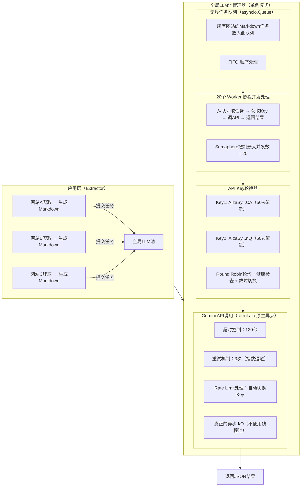

## 并发编程

### 一、进程、线程、协程

#### 1. 线程状态

```java
public static enum State {
    NEW,
    RUNNABLE,
    BLOCKED,
    WAITING,
    TIMED_WAITING,
    TERMINATED;
}
```

#### 2. 协程

##### 2.1 定义

**协程（Coroutine）** 是一种比线程更轻量级的并发单位。
 简单来说，它是“**可挂起（suspend）和恢复（resume）的函数**”，允许你在执行过程中暂停、切换到别的任务，再回来继续执行。

##### 2.2 特点

协程是一种**用户态的并发机制**，不需要操作系统介入切换，从而实现高效的异步执行。

传统并发方式：

- **多线程**：开销大、调度由内核控制、频繁切换浪费性能；
- **回调（callback）**：代码结构混乱、难以维护（“回调地狱”）。

协程的优势：

- 不需要多线程，也能实现高并发；
- 代码结构看起来是“同步”的，但底层是异步执行；
- 避免锁竞争，不会出现线程安全问题。

##### 2.3 原理

**保存当前函数的执行状态（栈帧）**，并在稍后恢复它。

事件循环（Event Loop）：负责调度和管理协程的运行，是整个协程系统的“心脏”。

协程调度器（Scheduler）：决定哪个协程可以执行、哪个要等待（例如等待 I/O）。

挂起与恢复（Suspend/Resume）：当协程遇到 I/O 操作时，它会主动挂起（yield），让出执行权；当 I/O 完成后，调度器再恢复该协程的执行

##### 2.4 实践

所有异步操作都要加 `await`；用 `asyncio.gather()` 来并发运行多个任务；避免在协程中使用阻塞函数（如 `time.sleep()`）；网络、I/O 操作要用异步库（如 `aiohttp`、`aiomysql`）；用 `asyncio.run()` 启动主事件循环。

下面的例子中是启动循环，然后同时访问三个网站，`run` 是启动事件循环，`await` 是阻塞事件调用，表示执行完获得结果后才继续，所以真正起到并发作用的是 `gather`

```python
import asyncio
import aiohttp  # 异步 HTTP 库

async def fetch(url):
    async with aiohttp.ClientSession() as session:
        async with session.get(url) as resp:
            print(f"获取 {url} 状态码: {resp.status}")
            return await resp.text()

async def main():
    urls = [
        "https://www.python.org",
        "https://docs.python.org/3/",
        "https://www.github.com"
    ]
    results = await asyncio.gather(*(fetch(url) for url in urls))
    print("已获取网页数量：", len(results))

asyncio.run(main())
```

##### 2.5 worker协程

**Worker 协程**可以理解为：

> “一个持续运行、不断从任务队列中取出任务并异步执行的协程工作者。”

换句话说：

- 主线程或上游逻辑负责 **生产任务（Producer）**；
- 若干个 **Worker 协程** 负责 **消费任务（Consumer）**；
- 两者之间通过一个 **异步队列（asyncio.Queue）** 通信。

这种模式也称为 **生产者-消费者模型（Producer-Consumer Pattern）** 的异步版本。

```python
import asyncio
import random

async def worker(name, queue):
    while True:
        task = await queue.get()  # 从队列取任务（阻塞等待）
        if task is None:  # 退出信号
            print(f"🧹 {name} 停止工作")
            break
        print(f"⚙️ {name} 开始执行任务 {task}")
        await asyncio.sleep(random.uniform(0.5, 2.0))  # 模拟I/O操作
        print(f"✅ {name} 完成任务 {task}")
        queue.task_done()  # 标记任务完成

async def main():
    queue = asyncio.Queue()

    # 创建多个 worker 协程
    workers = [asyncio.create_task(worker(f"Worker-{i}", queue)) for i in range(3)]

    # 模拟生产任务
    for i in range(10):
        await queue.put(i)
        print(f"📦 放入任务 {i}")

    # 等待任务全部完成
    await queue.join()

    # 通知所有 worker 退出
    for _ in workers:
        await queue.put(None)

    # 等待所有 worker 协程退出
    await asyncio.gather(*workers)

asyncio.run(main())
```

#### 3. 阻塞

##### 3.1 普通多线程程序

```python
import threading
import time

def task(name):
    print(f"{name} 开始")
    time.sleep(3)  # 阻塞当前线程
    print(f"{name} 结束")

t1 = threading.Thread(target=task, args=("任务1",))
t2 = threading.Thread(target=task, args=("任务2",))

t1.start()
t2.start()
```

🔍 说明：

- `time.sleep(3)` 阻塞的是**该线程自己**；
- 但其他线程（如 `t2`）仍然可以运行；
- 所以整个程序**并不会卡住**。

✅ **结论**：

> 在多线程环境中，一个线程阻塞，不会影响其他线程的执行。

##### 3.2 异步协程

```python
import asyncio
import time

async def bad_task():
    print("开始")
    time.sleep(3)  # ❌ 这是阻塞操作
    print("结束")

async def good_task():
    print("开始异步等待")
    await asyncio.sleep(3)  # ✅ 非阻塞
    print("结束异步等待")

async def main():
    await asyncio.gather(bad_task(), good_task())

asyncio.run(main())
```

⚠️ 输出结果：

```
开始
（整个程序卡住3秒）
结束
开始异步等待
结束异步等待
```

🔍 原因：

- `time.sleep(3)` 是**真正的阻塞调用**；
- 它会让整个事件循环卡住，导致其他协程无法运行；
- 只有改用 `await asyncio.sleep(3)`（异步等待），才不会阻塞事件循环。

✅ **结论：**

> 在异步（协程）程序中，一个“阻塞操作”可能让**整个事件循环都暂停**，从而所有协程都无法执行。

##### 3.3 阻塞与线程池的关系

假设你有一个线程池（比如 10 个线程）：

- 如果其中 1 个线程阻塞，只是**那一个线程**在等；
- 其他 9 个线程仍然可以继续执行；
- 除非你提交的所有任务都阻塞，那整个线程池看起来就“没反应”了。

```python
from concurrent.futures import ThreadPoolExecutor
import time

def slow_task(n):
    print(f"线程 {n} 开始")
    time.sleep(3)  # 阻塞当前线程
    print(f"线程 {n} 结束")

with ThreadPoolExecutor(max_workers=3) as pool:
    for i in range(6):
        pool.submit(slow_task, i)
```

🔍 解释：

- 同时最多 3 个线程在执行；
- 这 3 个线程执行完后，线程池再继续处理其他任务；
- 线程池整体没有被“锁死”，只是“忙碌”。

✅ **结论：**

> 线程池中一个线程阻塞，不会让整个池停掉，除非所有线程都阻塞。

#### 4. 上下文管理

##### 4.1. **上下文管理器协议（Context Manager Protocol）**

上下文管理器协议通常通过 `__enter__` 和 `__exit__` 方法实现。常见的用法是：

```
with some_resource as resource:
    # 使用 resource
```

这个 `with` 语句会调用资源的 `__enter__` 方法，并在 `with` 代码块执行完毕后调用 `__exit__` 方法，以确保资源得到正确的管理和释放。

##### 4.2. **异步上下文管理器（Async Context Manager）**

异步上下文管理器协议与常规上下文管理器协议非常相似，但它需要使用 `async def` 定义 `__aenter__` 和 `__aexit__` 方法。异步上下文管理器适用于那些需要异步操作的资源，如异步数据库连接、异步文件操作等。

- **`__aenter__`**：异步入口方法，用于进入上下文。
- **`__aexit__`**：异步退出方法，用于退出上下文并处理清理工作。

##### 4.3. **`async with` 的工作原理**

`async with` 语句的工作原理与普通的 `with` 类似，只是它是异步的，使用 `await` 来等待异步上下文管理器的资源初始化和清理操作。

下面是如何使用异步上下文管理器的一个简单示例：

```python
import asyncio

class AsyncContextManager:
    async def __aenter__(self):
        print("Entering the context")
        # 可以异步进行某些操作，例如打开异步文件或网络连接
        await asyncio.sleep(1)
        return self  # 返回你想要的资源

    async def __aexit__(self, exc_type, exc, tb):
        print("Exiting the context")
        # 可以异步进行资源清理操作
        await asyncio.sleep(1)

async def main():
    async with AsyncContextManager() as manager:
        print("Inside the context")
        await asyncio.sleep(1)
    print("Outside the context")

asyncio.run(main())
```

输出：

```
Entering the context
Inside the context
Exiting the context
Outside the context
```

这里的 `AsyncContextManager` 实现了异步上下文管理器协议。`__aenter__` 和 `__aexit__` 方法被定义为异步函数，因此它们可以执行异步操作。在 `async with` 语句块内，`__aenter__` 被调用，而在代码块结束后，`__aexit__` 被调用。

##### 4.4. **`async with` 的应用场景**

`async with` 主要用于异步资源管理，特别是在 I/O 密集型任务中。常见的应用场景包括：

- 异步数据库连接和查询
- 异步网络请求
- 异步文件操作
- 异步任务队列

##### 4.5. **库中的异步上下文管理器**

许多异步库（如 `asyncio`, `aiohttp`, `aiomysql`, `aiopg` 等）实现了异步上下文管理器，简化了资源管理。例如，使用 `aiohttp` 进行异步 HTTP 请求时，`async with` 可以自动管理连接池和会话：

```python
import aiohttp
import asyncio

async def fetch(url):
    async with aiohttp.ClientSession() as session:
        async with session.get(url) as response:
            return await response.text()

async def main():
    url = 'http://example.com'
    html = await fetch(url)
    print(html)

asyncio.run(main())
```

在这个例子中，`aiohttp.ClientSession()` 和 `session.get()` 都是异步上下文管理器，确保在使用完之后自动关闭 HTTP 连接。

### 二、JUC 常用包

#### 1. ThreadPoolExecutor - 线程池核心实现

概念

**线程池**是一种**线程复用机制**，用于管理和调度多个线程的执行。简单说，它是“**提前创建好若干工作线程**”，当有任务提交时，就从池里取出空闲线程执行任务，执行完再放回池中等待下一个任务。

| 组件                             | 作用                     |
| -------------------------------- | ------------------------ |
| **任务队列（Task Queue）**       | 保存待执行的任务         |
| **工作线程（Worker Threads）**   | 不断从队列取任务执行     |
| **线程池管理器**                 | 负责创建、销毁、调度线程 |
| **拒绝策略（Rejection Policy）** | 当任务太多时决定怎么处理 |

基本用法

```java
ThreadPoolExecutor executor = new ThreadPoolExecutor(
    2, 4, 60L, TimeUnit.SECONDS,
    new LinkedBlockingQueue<>(100)
);

executor.execute(() -> System.out.println("执行任务"));
executor.shutdown();
```

常用方法

- `execute(Runnable)` - 执行任务
- `submit(Callable/Runnable)` - 提交任务并返回Future
- `shutdown()` - 优雅关闭
- `getActiveCount()` - 获取活跃线程数

#### 2. Executors - 线程池工厂类

基本用法

```java
// 固定大小线程池
ExecutorService fixed = Executors.newFixedThreadPool(5);

// 缓存线程池
ExecutorService cached = Executors.newCachedThreadPool();

// 单线程池
ExecutorService single = Executors.newSingleThreadExecutor();
```

常用方法

- `newFixedThreadPool(int)` - 创建固定大小线程池
- `newCachedThreadPool()` - 创建缓存线程池
- `newSingleThreadExecutor()` - 创建单线程池
- `newScheduledThreadPool(int)` - 创建定时线程池

#### 3. ScheduledThreadPoolExecutor - 定时任务线程池

基本用法

```java
ScheduledExecutorService scheduler = Executors.newScheduledThreadPool(2);

// 延迟执行
scheduler.schedule(() -> System.out.println("延迟任务"), 5, TimeUnit.SECONDS);

// 周期执行
scheduler.scheduleAtFixedRate(() -> System.out.println("周期任务"), 0, 2, TimeUnit.SECONDS);
```

常用方法

- `schedule(Runnable, delay, unit)` - 延迟执行
- `scheduleAtFixedRate(Runnable, initialDelay, period, unit)` - 固定频率执行
- `scheduleWithFixedDelay(Runnable, initialDelay, delay, unit)` - 固定延迟执行

#### 4.CompletableFuture - 异步编程

基本用法

```java
CompletableFuture<String> future = CompletableFuture.supplyAsync(() -> {
    return "异步结果";
});

future.thenAccept(System.out::println);
String result = future.get(); // 阻塞获取结果
```

常用方法

- `supplyAsync(Supplier)` - 异步执行有返回值任务
- `runAsync(Runnable)` - 异步执行无返回值任务
- `thenApply(Function)` - 结果转换
- `thenAccept(Consumer)` - 消费结果

#### 5. ReentrantLock - 可重入锁

基本用法

```java
ReentrantLock lock = new ReentrantLock();

lock.lock();
try {
    // 临界区代码
} finally {
    lock.unlock();
}
```

常用方法

- `lock()` - 获取锁
- `unlock()` - 释放锁
- `tryLock()` - 尝试获取锁
- `newCondition()` - 创建条件变量

#### 6. CountDownLatch - 倒计时门闩

基本用法

```java
CountDownLatch latch = new CountDownLatch(3);

// 工作线程
new Thread(() -> {
    // 执行任务
    latch.countDown();
}).start();

// 主线程等待
latch.await();
```

常用方法

- `await()` - 等待计数归零
- `countDown()` - 计数减1
- `getCount()` - 获取当前计数
- `await(timeout, unit)` - 超时等待

#### 7. Semaphore - 信号量

基本用法

```java
Semaphore semaphore = new Semaphore(3); // 允许3个线程同时访问

semaphore.acquire();
try {
    // 访问共享资源
} finally {
    semaphore.release();
}
```

常用方法

- `acquire()` - 获取许可
- `release()` - 释放许可
- `tryAcquire()` - 尝试获取许可
- `availablePermits()` - 可用许可数

#### 8. Exchanger - 两线程数据交换

基本用法

```java
Exchanger<String> exchanger = new Exchanger<>();

// 线程1
new Thread(() -> {
    try {
        String received = exchanger.exchange("数据1");
        System.out.println("收到: " + received);
    } catch (InterruptedException e) {}
}).start();

// 线程2
new Thread(() -> {
    try {
        String received = exchanger.exchange("数据2");
        System.out.println("收到: " + received);
    } catch (InterruptedException e) {}
}).start();
```

常用方法

- `exchange(V)` - 交换数据并等待
- `exchange(V, timeout, unit)` - 超时交换

#### 9. ConcurrentHashMap - 线程安全哈希表

基本用法

```java
ConcurrentHashMap<String, Integer> map = new ConcurrentHashMap<>();

map.put("key1", 1);
Integer value = map.get("key1");
map.putIfAbsent("key2", 2);
map.compute("key1", (k, v) -> v + 1);
```

常用方法

- `put(K, V)` - 添加元素
- `get(K)` - 获取元素
- `putIfAbsent(K, V)` - 不存在时添加
- `compute(K, BiFunction)` - 计算新值

#### 10. Future/FutureTask - 异步计算结果

基本用法

```java
// 使用Future
ExecutorService executor = Executors.newSingleThreadExecutor();
Future<String> future = executor.submit(() -> "异步结果");
String result = future.get();

// 使用FutureTask
FutureTask<String> task = new FutureTask<>(() -> "任务结果");
new Thread(task).start();
String taskResult = task.get();
```

常用方法

- `get()` - 阻塞获取结果
- `get(timeout, unit)` - 超时获取结果
- `isDone()` - 判断是否完成
- `cancel(boolean)` - 取消任务

### 三、webscraper中使用的并发

#### 1. 浏览器池

设计思路：浏览器实例复用，节省2.5秒/URL；自动管理页面资源，防止内存泄漏；信号量控制每个浏览器的页面数，防止过载；上下文管理器保证页面自动关闭； 支持降级，向后兼容

问题分析：

当前每个 `extract_xxx` 函数都独立创建browser：
```python
async with async_playwright() as p:
    browser = await p.chromium.launch()  # 每次2秒
    # ... 使用
    await browser.close()  # 每次0.5秒
```

**痛点**：50个URL × 2.5秒 = 125秒浪费在浏览器创建/销毁上

解决方案：创建单网站浏览器池

**新建文件：`crawler/sites_shopping/browser_pool.py`**

```python
"""
单网站Playwright浏览器连接池
生命周期：网站开始时创建 → 处理所有URL → 网站结束时销毁
"""
import asyncio
from playwright.async_api import async_playwright, Browser, Page
from typing import Optional, List
from contextlib import asynccontextmanager
from config import logger

class BrowserPool:
    """单网站Playwright浏览器连接池"""

    def __init__(self, pool_size: int = 3, max_pages_per_browser: int = 5):
        """
        初始化浏览器池

        Args:
            pool_size: 浏览器实例数量（默认3个）
            max_pages_per_browser: 每个浏览器最多打开的页面数（默认5个）
        """
        self.pool_size = pool_size
        self.max_pages_per_browser = max_pages_per_browser

        self.playwright = None
        self.browsers: List[Browser] = []
        self.page_semaphores: List[asyncio.Semaphore] = []
        self.initialized = False
        self.current_browser_index = 0  # 轮询索引

    async def initialize(self):
        """初始化浏览器池（网站开始时调用）"""
        if self.initialized:
            return

        logger.info(f"🚀 初始化浏览器池: {self.pool_size} 个浏览器")

        self.playwright = await async_playwright().start()

        for i in range(self.pool_size):
            browser = await self.playwright.chromium.launch(
                headless=True,
                # 可选：添加启动参数优化性能
                args=['--disable-blink-features=AutomationControlled']
            )
            self.browsers.append(browser)

            # 每个浏览器有独立的页面信号量
            self.page_semaphores.append(
                asyncio.Semaphore(self.max_pages_per_browser)
            )
            logger.info(f"  ✅ 浏览器 #{i+1} 已启动")

        self.initialized = True
        logger.info("✅ 浏览器池初始化完成")

    @asynccontextmanager
    async def get_page(self):
        """
        获取一个页面（上下文管理器）

        Yields:
            Page: Playwright页面对象

        使用示例：
            async with browser_pool.get_page() as page:
                await page.goto(url)
                content = await page.content()
        """
        if not self.initialized:
            await self.initialize()

        # 轮询选择浏览器（负载均衡）
        browser_index = self.current_browser_index % self.pool_size
        self.current_browser_index += 1

        browser = self.browsers[browser_index]
        semaphore = self.page_semaphores[browser_index]

        # 等待获取页面资源
        async with semaphore:
            page = await browser.new_page()

            # 设置默认的User-Agent
            await page.set_extra_http_headers({
                'User-Agent': 'Mozilla/5.0 (Macintosh; Intel Mac OS X 10_15_7) '
                             'AppleWebKit/537.36 (KHTML, like Gecko) '
                             'Chrome/120.0.0.0 Safari/537.36'
            })

            try:
                yield page
            finally:
                # 确保页面关闭
                await page.close()

    async def close(self):
        """关闭浏览器池（网站结束时调用）"""
        if not self.initialized:
            return

        logger.info("🔒 关闭浏览器池...")

        for i, browser in enumerate(self.browsers):
            await browser.close()
            logger.info(f"  ✅ 浏览器 #{i+1} 已关闭")

        if self.playwright:
            await self.playwright.stop()

        self.browsers.clear()
        self.page_semaphores.clear()
        self.initialized = False

        logger.info("✅ 浏览器池已关闭")
```

在 extractor_llm.py 中集成浏览器池：

**ShoppingLLM 类添加浏览器池管理：**
```python
class ShoppingLLM:
    def __init__(self, ..., enable_concurrent=False):
        # ... 原有初始化
        self.enable_concurrent = enable_concurrent
        self.browser_pool = None  # 浏览器连接池

    async def initialize_browser_pool(self):
        """初始化浏览器池（网站开始时）"""
        if self.browser_pool is None:
            from .browser_pool import BrowserPool
            self.browser_pool = BrowserPool(
                pool_size=CONCURRENT_CONFIG['browser_pool_size'],
                max_pages_per_browser=CONCURRENT_CONFIG['max_pages_per_browser']
            )
            await self.browser_pool.initialize()

    async def close_browser_pool(self):
        """关闭浏览器池（网站结束时）"""
        if self.browser_pool:
            await self.browser_pool.close()
            self.browser_pool = None
```

修改各 extractor_xxx.py 使用浏览器池：

**修改前（extractor_slickdeals.py）：**
```python
async def extract_deals_from_slickdeals(url, extract_by_llm=False):
    async with async_playwright() as p:
        browser = await p.chromium.launch(headless=True)  # 2秒
        page = await browser.new_page()
        # ... 爬取逻辑
        await browser.close()  # 0.5秒
```

**修改后：**
```python
async def extract_deals_from_slickdeals(url, extract_by_llm=False, browser_pool=None):
    """
    添加 browser_pool 参数，由 extractor_llm 传入
    """
    if browser_pool:
        # 使用传入的浏览器池
        async with browser_pool.get_page() as page:
            # ... 爬取逻辑（其他不变）
            await page.goto(url, wait_until='domcontentloaded')
            content = await page.content()
            # ...
    else:
        # 降级：如果没有浏览器池，使用原有方式
        async with async_playwright() as p:
            browser = await p.chromium.launch(headless=True)
            page = await browser.new_page()
            # ... 爬取逻辑
            await browser.close()
```

**在 extractor_llm.py 调用时传入：**
```python
async def run_as_preset(self, url, parent=None, extract_by_llm=False):
    # ... 原有逻辑
    func = func_dic.get('page')
    # 传入浏览器池
    res, site_info = await func(url, browser_pool=self.browser_pool)
    # ...
```

#### 2. 协程并发

添加 `enable_concurrent` 参数，支持渐进式升级； 使用 `asyncio.Semaphore` 限制并发数；分批执行避免任务过多；保留原串行方法作为fallback

```python
class ShoppingLLM:
    def __init__(self, ..., enable_concurrent=False):
        # ... 原有初始化
        self.enable_concurrent = enable_concurrent
        self.url_semaphore = asyncio.Semaphore(
            CONCURRENT_CONFIG['max_urls_per_site']
        ) if enable_concurrent else None
        self.browser_pool = None  # 浏览器连接池（后续实现）

    async def process_level_urls_concurrent(self, level):
        """并发处理指定层级的所有URL"""
        logger.info(f"📋 开始并发处理 Level {level}")

        # 1. 收集当前层级的所有URL
        level_urls = []
        temp_queue = deque()
        while self.url_queue:
            url, parent, url_level = self.url_queue.popleft()
            if url_level == level:
                level_urls.append((url, parent, url_level))
            else:
                temp_queue.append((url, parent, url_level))
        self.url_queue = temp_queue

        if not level_urls:
            return

        logger.info(f"📊 Level {level}: {len(level_urls)} 个URL待处理")

        # 2. 创建并发任务（带信号量控制）
        async def process_url_with_semaphore(url, parent, url_level):
            """带信号量控制的URL处理"""
            async with self.url_semaphore:
                if url in self.visited_urls:
                    return

                self.visited_urls.add(url)
                logger.info(f"🔄 处理URL: {url}")

                try:
                    await self.analyze_single_url(url, parent, url_level)
                    logger.info(f"✅ 完成URL: {url}")
                except Exception as e:
                    logger.error(f"❌ URL处理失败 {url}: {e}")

        # 3. 创建所有任务
        tasks = [
            asyncio.create_task(
                process_url_with_semaphore(url, parent, url_level)
            )
            for url, parent, url_level in level_urls
            if url not in self.visited_urls
        ]

        # 4. 分批执行（避免一次性提交太多任务）
        batch_size = CONCURRENT_CONFIG['max_urls_per_site'] * 2
        for i in range(0, len(tasks), batch_size):
            batch = tasks[i:i + batch_size]
            await asyncio.gather(*batch, return_exceptions=True)
            logger.info(f"  批次 {i//batch_size + 1} 完成")

    async def analyze(self, url, parent=None):
        """分析URL的主方法（支持并发）"""
        logger.info(f"🔍 开始分析: {url}")
        await self.add_url_to_queue(url, parent=parent, level=0)

        # 逐层处理
        for level in range(self.max_level + 1):
            if not self.url_queue:
                break

            self.current_level = level
            logger.info(f"🔄 处理 Level {level}...")

            # 根据配置选择并发或串行
            if self.enable_concurrent:
                await self.process_level_urls_concurrent(level)
            else:
                await self.process_level_urls(level)  # 保留原串行方法

            logger.info(f"✅ Level {level} 完成")

        logger.info(f"🎉 分析完成: 共处理 {len(self.visited_urls)} 个URL")
```

#### 3. Gemini 原生异步

1. ✅ **真正的异步 I/O**
   - `await chat.aio.send_message()` 是非阻塞调用
   - 网络请求时释放事件循环，可以处理其他任务

2. ✅ **无线程池限制**
   - 直接在事件循环中运行
   - 20 并发 = 20 协程，全部同时执行

3. ✅ **内存占用低**
   - 每个协程 ~1KB
   - 20 个协程 = 20KB

```python
async def _async_chat_with_continuation(...):
    from google import genai
    from google.genai import types

    # 创建异步客户端
    client = genai.Client(api_key=api_key)

    try:
        # 创建 Chat 会话
        chat = client.chats.create(model='gemini-2.5-flash')

        # ✅ 原生异步调用（不阻塞）
        response = await chat.aio.send_message(prompt, config=...)

        # 支持 continuation（多轮对话）
        if is_truncated(response.text):
            response2 = await chat.aio.send_message("continue", ...)
            merged = merge_fragments([response.text, response2.text])

        return json.loads(merged)

    finally:
        # 关闭异步客户端
        await client.aio.aclose()
```

gemini原生异步在每次请求都会创建客户端，且不支持 async with 上下文管理器协议，需要 GeminiClientPool 类来管理

```python
# 从全局池获取 Client（资源复用）
client_pool = await get_client_pool()
client = await client_pool.get_client(api_key)
try:
    chat = client.aio.chats.create(model='gemini-2.5-flash')
    # ... 使用 Client
finally:
    # 释放 Client（减少活跃计数）
    await client_pool.release_client(api_key)
```

**资源清理方法：**

1. **自动清理（atexit）**：
   - 程序退出时自动调用 `_sync_cleanup()`
   - 适配不同的事件循环状态

2. **显式清理**：
   - 提供 `cleanup_client_pool()` 函数
   - 可在程序正常结束时主动调用

3. **重新初始化**：
   - 清理后可以重新使用池
   - 自动检测并重新初始化

#### 4. 流程图

通过 LLM 池可以控制并发速率，保证 key 可以轮换，同时可以进行统计和监控




