## 并发编程

### 一、进程、线程、协程

#### 1. 线程状态

```java
public static enum State {
    NEW,
    RUNNABLE,
    BLOCKED,
    WAITING,
    TIMED_WAITING,
    TERMINATED;
}
```

#### 2. 协程

##### 2.1 定义

**协程（Coroutine）** 是一种比线程更轻量级的并发单位。
 简单来说，它是“**可挂起（suspend）和恢复（resume）的函数**”，允许你在执行过程中暂停、切换到别的任务，再回来继续执行。

##### 2.2 特点

协程是一种**用户态的并发机制**，不需要操作系统介入切换，从而实现高效的异步执行。

传统并发方式：

- **多线程**：开销大、调度由内核控制、频繁切换浪费性能；
- **回调（callback）**：代码结构混乱、难以维护（“回调地狱”）。

协程的优势：

- 不需要多线程，也能实现高并发；
- 代码结构看起来是“同步”的，但底层是异步执行；
- 避免锁竞争，不会出现线程安全问题。

##### 2.3 原理

**保存当前函数的执行状态（栈帧）**，并在稍后恢复它。

事件循环（Event Loop）：负责调度和管理协程的运行，是整个协程系统的“心脏”。

协程调度器（Scheduler）：决定哪个协程可以执行、哪个要等待（例如等待 I/O）。

挂起与恢复（Suspend/Resume）：当协程遇到 I/O 操作时，它会主动挂起（yield），让出执行权；当 I/O 完成后，调度器再恢复该协程的执行

##### 2.4 实践

所有异步操作都要加 `await`；用 `asyncio.gather()` 来并发运行多个任务；避免在协程中使用阻塞函数（如 `time.sleep()`）；网络、I/O 操作要用异步库（如 `aiohttp`、`aiomysql`）；用 `asyncio.run()` 启动主事件循环。

下面的例子中是启动循环，然后同时访问三个网站，`run` 是启动事件循环，`await` 是阻塞事件调用，表示执行完获得结果后才继续，所以真正起到并发作用的是 `gather`

```python
import asyncio
import aiohttp  # 异步 HTTP 库

async def fetch(url):
    async with aiohttp.ClientSession() as session:
        async with session.get(url) as resp:
            print(f"获取 {url} 状态码: {resp.status}")
            return await resp.text()

async def main():
    urls = [
        "https://www.python.org",
        "https://docs.python.org/3/",
        "https://www.github.com"
    ]
    results = await asyncio.gather(*(fetch(url) for url in urls))
    print("已获取网页数量：", len(results))

asyncio.run(main())
```

##### 2.5 worker协程

**Worker 协程**可以理解为：

> “一个持续运行、不断从任务队列中取出任务并异步执行的协程工作者。”

换句话说：

- 主线程或上游逻辑负责 **生产任务（Producer）**；
- 若干个 **Worker 协程** 负责 **消费任务（Consumer）**；
- 两者之间通过一个 **异步队列（asyncio.Queue）** 通信。

这种模式也称为 **生产者-消费者模型（Producer-Consumer Pattern）** 的异步版本。

```python
import asyncio
import random

async def worker(name, queue):
    while True:
        task = await queue.get()  # 从队列取任务（阻塞等待）
        if task is None:  # 退出信号
            print(f"🧹 {name} 停止工作")
            break
        print(f"⚙️ {name} 开始执行任务 {task}")
        await asyncio.sleep(random.uniform(0.5, 2.0))  # 模拟I/O操作
        print(f"✅ {name} 完成任务 {task}")
        queue.task_done()  # 标记任务完成

async def main():
    queue = asyncio.Queue()

    # 创建多个 worker 协程
    workers = [asyncio.create_task(worker(f"Worker-{i}", queue)) for i in range(3)]

    # 模拟生产任务
    for i in range(10):
        await queue.put(i)
        print(f"📦 放入任务 {i}")

    # 等待任务全部完成
    await queue.join()

    # 通知所有 worker 退出
    for _ in workers:
        await queue.put(None)

    # 等待所有 worker 协程退出
    await asyncio.gather(*workers)

asyncio.run(main())
```

#### 3. 阻塞

##### 3.1 普通多线程程序

```python
import threading
import time

def task(name):
    print(f"{name} 开始")
    time.sleep(3)  # 阻塞当前线程
    print(f"{name} 结束")

t1 = threading.Thread(target=task, args=("任务1",))
t2 = threading.Thread(target=task, args=("任务2",))

t1.start()
t2.start()
```

🔍 说明：

- `time.sleep(3)` 阻塞的是**该线程自己**；
- 但其他线程（如 `t2`）仍然可以运行；
- 所以整个程序**并不会卡住**。

✅ **结论**：

> 在多线程环境中，一个线程阻塞，不会影响其他线程的执行。

##### 3.2 异步协程

```python
import asyncio
import time

async def bad_task():
    print("开始")
    time.sleep(3)  # ❌ 这是阻塞操作
    print("结束")

async def good_task():
    print("开始异步等待")
    await asyncio.sleep(3)  # ✅ 非阻塞
    print("结束异步等待")

async def main():
    await asyncio.gather(bad_task(), good_task())

asyncio.run(main())
```

⚠️ 输出结果：

```
开始
（整个程序卡住3秒）
结束
开始异步等待
结束异步等待
```

🔍 原因：

- `time.sleep(3)` 是**真正的阻塞调用**；
- 它会让整个事件循环卡住，导致其他协程无法运行；
- 只有改用 `await asyncio.sleep(3)`（异步等待），才不会阻塞事件循环。

✅ **结论：**

> 在异步（协程）程序中，一个“阻塞操作”可能让**整个事件循环都暂停**，从而所有协程都无法执行。

##### 3.3 阻塞与线程池的关系

假设你有一个线程池（比如 10 个线程）：

- 如果其中 1 个线程阻塞，只是**那一个线程**在等；
- 其他 9 个线程仍然可以继续执行；
- 除非你提交的所有任务都阻塞，那整个线程池看起来就“没反应”了。

```python
from concurrent.futures import ThreadPoolExecutor
import time

def slow_task(n):
    print(f"线程 {n} 开始")
    time.sleep(3)  # 阻塞当前线程
    print(f"线程 {n} 结束")

with ThreadPoolExecutor(max_workers=3) as pool:
    for i in range(6):
        pool.submit(slow_task, i)
```

🔍 解释：

- 同时最多 3 个线程在执行；
- 这 3 个线程执行完后，线程池再继续处理其他任务；
- 线程池整体没有被“锁死”，只是“忙碌”。

✅ **结论：**

> 线程池中一个线程阻塞，不会让整个池停掉，除非所有线程都阻塞。

#### 4. 上下文管理

##### 4.1. **上下文管理器协议（Context Manager Protocol）**

上下文管理器协议通常通过 `__enter__` 和 `__exit__` 方法实现。常见的用法是：

```
with some_resource as resource:
    # 使用 resource
```

这个 `with` 语句会调用资源的 `__enter__` 方法，并在 `with` 代码块执行完毕后调用 `__exit__` 方法，以确保资源得到正确的管理和释放。

##### 4.2. **异步上下文管理器（Async Context Manager）**

异步上下文管理器协议与常规上下文管理器协议非常相似，但它需要使用 `async def` 定义 `__aenter__` 和 `__aexit__` 方法。异步上下文管理器适用于那些需要异步操作的资源，如异步数据库连接、异步文件操作等。

- **`__aenter__`**：异步入口方法，用于进入上下文。
- **`__aexit__`**：异步退出方法，用于退出上下文并处理清理工作。

##### 4.3. **`async with` 的工作原理**

`async with` 语句的工作原理与普通的 `with` 类似，只是它是异步的，使用 `await` 来等待异步上下文管理器的资源初始化和清理操作。

下面是如何使用异步上下文管理器的一个简单示例：

```python
import asyncio

class AsyncContextManager:
    async def __aenter__(self):
        print("Entering the context")
        # 可以异步进行某些操作，例如打开异步文件或网络连接
        await asyncio.sleep(1)
        return self  # 返回你想要的资源

    async def __aexit__(self, exc_type, exc, tb):
        print("Exiting the context")
        # 可以异步进行资源清理操作
        await asyncio.sleep(1)

async def main():
    async with AsyncContextManager() as manager:
        print("Inside the context")
        await asyncio.sleep(1)
    print("Outside the context")

asyncio.run(main())
```

输出：

```
Entering the context
Inside the context
Exiting the context
Outside the context
```

这里的 `AsyncContextManager` 实现了异步上下文管理器协议。`__aenter__` 和 `__aexit__` 方法被定义为异步函数，因此它们可以执行异步操作。在 `async with` 语句块内，`__aenter__` 被调用，而在代码块结束后，`__aexit__` 被调用。

##### 4.4. **`async with` 的应用场景**

`async with` 主要用于异步资源管理，特别是在 I/O 密集型任务中。常见的应用场景包括：

- 异步数据库连接和查询
- 异步网络请求
- 异步文件操作
- 异步任务队列

##### 4.5. **库中的异步上下文管理器**

许多异步库（如 `asyncio`, `aiohttp`, `aiomysql`, `aiopg` 等）实现了异步上下文管理器，简化了资源管理。例如，使用 `aiohttp` 进行异步 HTTP 请求时，`async with` 可以自动管理连接池和会话：

```python
import aiohttp
import asyncio

async def fetch(url):
    async with aiohttp.ClientSession() as session:
        async with session.get(url) as response:
            return await response.text()

async def main():
    url = 'http://example.com'
    html = await fetch(url)
    print(html)

asyncio.run(main())
```

在这个例子中，`aiohttp.ClientSession()` 和 `session.get()` 都是异步上下文管理器，确保在使用完之后自动关闭 HTTP 连接。

### 二、JUC 常用包

#### 1. ThreadPoolExecutor - 线程池核心实现

概念

**线程池**是一种**线程复用机制**，用于管理和调度多个线程的执行。简单说，它是“**提前创建好若干工作线程**”，当有任务提交时，就从池里取出空闲线程执行任务，执行完再放回池中等待下一个任务。

| 组件                             | 作用                     |
| -------------------------------- | ------------------------ |
| **任务队列（Task Queue）**       | 保存待执行的任务         |
| **工作线程（Worker Threads）**   | 不断从队列取任务执行     |
| **线程池管理器**                 | 负责创建、销毁、调度线程 |
| **拒绝策略（Rejection Policy）** | 当任务太多时决定怎么处理 |

基本用法

```java
ThreadPoolExecutor executor = new ThreadPoolExecutor(
    2, 4, 60L, TimeUnit.SECONDS,
    new LinkedBlockingQueue<>(100)
);

executor.execute(() -> System.out.println("执行任务"));
executor.shutdown();
```

常用方法

- `execute(Runnable)` - 执行任务
- `submit(Callable/Runnable)` - 提交任务并返回Future
- `shutdown()` - 优雅关闭
- `getActiveCount()` - 获取活跃线程数

#### 2. Executors - 线程池工厂类

基本用法

```java
// 固定大小线程池
ExecutorService fixed = Executors.newFixedThreadPool(5);

// 缓存线程池
ExecutorService cached = Executors.newCachedThreadPool();

// 单线程池
ExecutorService single = Executors.newSingleThreadExecutor();
```

常用方法

- `newFixedThreadPool(int)` - 创建固定大小线程池
- `newCachedThreadPool()` - 创建缓存线程池
- `newSingleThreadExecutor()` - 创建单线程池
- `newScheduledThreadPool(int)` - 创建定时线程池

#### 3. ScheduledThreadPoolExecutor - 定时任务线程池

基本用法

```java
ScheduledExecutorService scheduler = Executors.newScheduledThreadPool(2);

// 延迟执行
scheduler.schedule(() -> System.out.println("延迟任务"), 5, TimeUnit.SECONDS);

// 周期执行
scheduler.scheduleAtFixedRate(() -> System.out.println("周期任务"), 0, 2, TimeUnit.SECONDS);
```

常用方法

- `schedule(Runnable, delay, unit)` - 延迟执行
- `scheduleAtFixedRate(Runnable, initialDelay, period, unit)` - 固定频率执行
- `scheduleWithFixedDelay(Runnable, initialDelay, delay, unit)` - 固定延迟执行

#### 4.CompletableFuture - 异步编程

基本用法

```java
CompletableFuture<String> future = CompletableFuture.supplyAsync(() -> {
    return "异步结果";
});

future.thenAccept(System.out::println);
String result = future.get(); // 阻塞获取结果
```

常用方法

- `supplyAsync(Supplier)` - 异步执行有返回值任务
- `runAsync(Runnable)` - 异步执行无返回值任务
- `thenApply(Function)` - 结果转换
- `thenAccept(Consumer)` - 消费结果

#### 5. ReentrantLock - 可重入锁

基本用法

```java
ReentrantLock lock = new ReentrantLock();

lock.lock();
try {
    // 临界区代码
} finally {
    lock.unlock();
}
```

常用方法

- `lock()` - 获取锁
- `unlock()` - 释放锁
- `tryLock()` - 尝试获取锁
- `newCondition()` - 创建条件变量

#### 6. CountDownLatch - 倒计时门闩

基本用法

```java
CountDownLatch latch = new CountDownLatch(3);

// 工作线程
new Thread(() -> {
    // 执行任务
    latch.countDown();
}).start();

// 主线程等待
latch.await();
```

常用方法

- `await()` - 等待计数归零
- `countDown()` - 计数减1
- `getCount()` - 获取当前计数
- `await(timeout, unit)` - 超时等待

#### 7. Semaphore - 信号量

基本用法

```java
Semaphore semaphore = new Semaphore(3); // 允许3个线程同时访问

semaphore.acquire();
try {
    // 访问共享资源
} finally {
    semaphore.release();
}
```

常用方法

- `acquire()` - 获取许可
- `release()` - 释放许可
- `tryAcquire()` - 尝试获取许可
- `availablePermits()` - 可用许可数

#### 8. Exchanger - 两线程数据交换

基本用法

```java
Exchanger<String> exchanger = new Exchanger<>();

// 线程1
new Thread(() -> {
    try {
        String received = exchanger.exchange("数据1");
        System.out.println("收到: " + received);
    } catch (InterruptedException e) {}
}).start();

// 线程2
new Thread(() -> {
    try {
        String received = exchanger.exchange("数据2");
        System.out.println("收到: " + received);
    } catch (InterruptedException e) {}
}).start();
```

常用方法

- `exchange(V)` - 交换数据并等待
- `exchange(V, timeout, unit)` - 超时交换

#### 9. ConcurrentHashMap - 线程安全哈希表

基本用法

```java
ConcurrentHashMap<String, Integer> map = new ConcurrentHashMap<>();

map.put("key1", 1);
Integer value = map.get("key1");
map.putIfAbsent("key2", 2);
map.compute("key1", (k, v) -> v + 1);
```

常用方法

- `put(K, V)` - 添加元素
- `get(K)` - 获取元素
- `putIfAbsent(K, V)` - 不存在时添加
- `compute(K, BiFunction)` - 计算新值

#### 10. Future/FutureTask - 异步计算结果

基本用法

```java
// 使用Future
ExecutorService executor = Executors.newSingleThreadExecutor();
Future<String> future = executor.submit(() -> "异步结果");
String result = future.get();

// 使用FutureTask
FutureTask<String> task = new FutureTask<>(() -> "任务结果");
new Thread(task).start();
String taskResult = task.get();
```

常用方法

- `get()` - 阻塞获取结果
- `get(timeout, unit)` - 超时获取结果
- `isDone()` - 判断是否完成
- `cancel(boolean)` - 取消任务

### 三、webscraper中使用的并发

#### 1. 浏览器池

设计思路：浏览器实例复用，节省2.5秒/URL；自动管理页面资源，防止内存泄漏；信号量控制每个浏览器的页面数，防止过载；上下文管理器保证页面自动关闭； 支持降级，向后兼容

问题分析：

当前每个 `extract_xxx` 函数都独立创建browser：
```python
async with async_playwright() as p:
    browser = await p.chromium.launch()  # 每次2秒
    # ... 使用
    await browser.close()  # 每次0.5秒
```

**痛点**：50个URL × 2.5秒 = 125秒浪费在浏览器创建/销毁上

解决方案：创建单网站浏览器池

**新建文件：`crawler/sites_shopping/browser_pool.py`**

```python
"""
单网站Playwright浏览器连接池
生命周期：网站开始时创建 → 处理所有URL → 网站结束时销毁
"""
import asyncio
from playwright.async_api import async_playwright, Browser, Page
from typing import Optional, List
from contextlib import asynccontextmanager
from config import logger

class BrowserPool:
    """单网站Playwright浏览器连接池"""

    def __init__(self, pool_size: int = 3, max_pages_per_browser: int = 5):
        """
        初始化浏览器池

        Args:
            pool_size: 浏览器实例数量（默认3个）
            max_pages_per_browser: 每个浏览器最多打开的页面数（默认5个）
        """
        self.pool_size = pool_size
        self.max_pages_per_browser = max_pages_per_browser

        self.playwright = None
        self.browsers: List[Browser] = []
        self.page_semaphores: List[asyncio.Semaphore] = []
        self.initialized = False
        self.current_browser_index = 0  # 轮询索引

    async def initialize(self):
        """初始化浏览器池（网站开始时调用）"""
        if self.initialized:
            return

        logger.info(f"🚀 初始化浏览器池: {self.pool_size} 个浏览器")

        self.playwright = await async_playwright().start()

        for i in range(self.pool_size):
            browser = await self.playwright.chromium.launch(
                headless=True,
                # 可选：添加启动参数优化性能
                args=['--disable-blink-features=AutomationControlled']
            )
            self.browsers.append(browser)

            # 每个浏览器有独立的页面信号量
            self.page_semaphores.append(
                asyncio.Semaphore(self.max_pages_per_browser)
            )
            logger.info(f"  ✅ 浏览器 #{i+1} 已启动")

        self.initialized = True
        logger.info("✅ 浏览器池初始化完成")

    @asynccontextmanager
    async def get_page(self):
        """
        获取一个页面（上下文管理器）

        Yields:
            Page: Playwright页面对象

        使用示例：
            async with browser_pool.get_page() as page:
                await page.goto(url)
                content = await page.content()
        """
        if not self.initialized:
            await self.initialize()

        # 轮询选择浏览器（负载均衡）
        browser_index = self.current_browser_index % self.pool_size
        self.current_browser_index += 1

        browser = self.browsers[browser_index]
        semaphore = self.page_semaphores[browser_index]

        # 等待获取页面资源
        async with semaphore:
            page = await browser.new_page()

            # 设置默认的User-Agent
            await page.set_extra_http_headers({
                'User-Agent': 'Mozilla/5.0 (Macintosh; Intel Mac OS X 10_15_7) '
                             'AppleWebKit/537.36 (KHTML, like Gecko) '
                             'Chrome/120.0.0.0 Safari/537.36'
            })

            try:
                yield page
            finally:
                # 确保页面关闭
                await page.close()

    async def close(self):
        """关闭浏览器池（网站结束时调用）"""
        if not self.initialized:
            return

        logger.info("🔒 关闭浏览器池...")

        for i, browser in enumerate(self.browsers):
            await browser.close()
            logger.info(f"  ✅ 浏览器 #{i+1} 已关闭")

        if self.playwright:
            await self.playwright.stop()

        self.browsers.clear()
        self.page_semaphores.clear()
        self.initialized = False

        logger.info("✅ 浏览器池已关闭")
```

在 extractor_llm.py 中集成浏览器池：

**ShoppingLLM 类添加浏览器池管理：**
```python
class ShoppingLLM:
    def __init__(self, ..., enable_concurrent=False):
        # ... 原有初始化
        self.enable_concurrent = enable_concurrent
        self.browser_pool = None  # 浏览器连接池

    async def initialize_browser_pool(self):
        """初始化浏览器池（网站开始时）"""
        if self.browser_pool is None:
            from .browser_pool import BrowserPool
            self.browser_pool = BrowserPool(
                pool_size=CONCURRENT_CONFIG['browser_pool_size'],
                max_pages_per_browser=CONCURRENT_CONFIG['max_pages_per_browser']
            )
            await self.browser_pool.initialize()

    async def close_browser_pool(self):
        """关闭浏览器池（网站结束时）"""
        if self.browser_pool:
            await self.browser_pool.close()
            self.browser_pool = None
```

修改各 extractor_xxx.py 使用浏览器池：

**修改前（extractor_slickdeals.py）：**
```python
async def extract_deals_from_slickdeals(url, extract_by_llm=False):
    async with async_playwright() as p:
        browser = await p.chromium.launch(headless=True)  # 2秒
        page = await browser.new_page()
        # ... 爬取逻辑
        await browser.close()  # 0.5秒
```

**修改后：**
```python
async def extract_deals_from_slickdeals(url, extract_by_llm=False, browser_pool=None):
    """
    添加 browser_pool 参数，由 extractor_llm 传入
    """
    if browser_pool:
        # 使用传入的浏览器池
        async with browser_pool.get_page() as page:
            # ... 爬取逻辑（其他不变）
            await page.goto(url, wait_until='domcontentloaded')
            content = await page.content()
            # ...
    else:
        # 降级：如果没有浏览器池，使用原有方式
        async with async_playwright() as p:
            browser = await p.chromium.launch(headless=True)
            page = await browser.new_page()
            # ... 爬取逻辑
            await browser.close()
```

**在 extractor_llm.py 调用时传入：**
```python
async def run_as_preset(self, url, parent=None, extract_by_llm=False):
    # ... 原有逻辑
    func = func_dic.get('page')
    # 传入浏览器池
    res, site_info = await func(url, browser_pool=self.browser_pool)
    # ...
```

#### 2. 协程并发

添加 `enable_concurrent` 参数，支持渐进式升级； 使用 `asyncio.Semaphore` 限制并发数；分批执行避免任务过多；保留原串行方法作为fallback

```python
class ShoppingLLM:
    def __init__(self, ..., enable_concurrent=False):
        # ... 原有初始化
        self.enable_concurrent = enable_concurrent
        self.url_semaphore = asyncio.Semaphore(
            CONCURRENT_CONFIG['max_urls_per_site']
        ) if enable_concurrent else None
        self.browser_pool = None  # 浏览器连接池（后续实现）

    async def process_level_urls_concurrent(self, level):
        """并发处理指定层级的所有URL"""
        logger.info(f"📋 开始并发处理 Level {level}")

        # 1. 收集当前层级的所有URL
        level_urls = []
        temp_queue = deque()
        while self.url_queue:
            url, parent, url_level = self.url_queue.popleft()
            if url_level == level:
                level_urls.append((url, parent, url_level))
            else:
                temp_queue.append((url, parent, url_level))
        self.url_queue = temp_queue

        if not level_urls:
            return

        logger.info(f"📊 Level {level}: {len(level_urls)} 个URL待处理")

        # 2. 创建并发任务（带信号量控制）
        async def process_url_with_semaphore(url, parent, url_level):
            """带信号量控制的URL处理"""
            async with self.url_semaphore:
                if url in self.visited_urls:
                    return

                self.visited_urls.add(url)
                logger.info(f"🔄 处理URL: {url}")

                try:
                    await self.analyze_single_url(url, parent, url_level)
                    logger.info(f"✅ 完成URL: {url}")
                except Exception as e:
                    logger.error(f"❌ URL处理失败 {url}: {e}")

        # 3. 创建所有任务
        tasks = [
            asyncio.create_task(
                process_url_with_semaphore(url, parent, url_level)
            )
            for url, parent, url_level in level_urls
            if url not in self.visited_urls
        ]

        # 4. 分批执行（避免一次性提交太多任务）
        batch_size = CONCURRENT_CONFIG['max_urls_per_site'] * 2
        for i in range(0, len(tasks), batch_size):
            batch = tasks[i:i + batch_size]
            await asyncio.gather(*batch, return_exceptions=True)
            logger.info(f"  批次 {i//batch_size + 1} 完成")

    async def analyze(self, url, parent=None):
        """分析URL的主方法（支持并发）"""
        logger.info(f"🔍 开始分析: {url}")
        await self.add_url_to_queue(url, parent=parent, level=0)

        # 逐层处理
        for level in range(self.max_level + 1):
            if not self.url_queue:
                break

            self.current_level = level
            logger.info(f"🔄 处理 Level {level}...")

            # 根据配置选择并发或串行
            if self.enable_concurrent:
                await self.process_level_urls_concurrent(level)
            else:
                await self.process_level_urls(level)  # 保留原串行方法

            logger.info(f"✅ Level {level} 完成")

        logger.info(f"🎉 分析完成: 共处理 {len(self.visited_urls)} 个URL")
```

#### 3. Gemini 原生异步

1. ✅ **真正的异步 I/O**
   - `await chat.aio.send_message()` 是非阻塞调用
   - 网络请求时释放事件循环，可以处理其他任务

2. ✅ **无线程池限制**
   - 直接在事件循环中运行
   - 20 并发 = 20 协程，全部同时执行

3. ✅ **内存占用低**
   - 每个协程 ~1KB
   - 20 个协程 = 20KB

```python
async def _async_chat_with_continuation(...):
    from google import genai
    from google.genai import types

    # 创建异步客户端
    client = genai.Client(api_key=api_key)

    try:
        # 创建 Chat 会话
        chat = client.chats.create(model='gemini-2.5-flash')

        # ✅ 原生异步调用（不阻塞）
        response = await chat.aio.send_message(prompt, config=...)

        # 支持 continuation（多轮对话）
        if is_truncated(response.text):
            response2 = await chat.aio.send_message("continue", ...)
            merged = merge_fragments([response.text, response2.text])

        return json.loads(merged)

    finally:
        # 关闭异步客户端
        await client.aio.aclose()
```

gemini原生异步在每次请求都会创建客户端，且不支持 async with 上下文管理器协议，需要 GeminiClientPool 类来管理

```python
# 从全局池获取 Client（资源复用）
client_pool = await get_client_pool()
client = await client_pool.get_client(api_key)
try:
    chat = client.aio.chats.create(model='gemini-2.5-flash')
    # ... 使用 Client
finally:
    # 释放 Client（减少活跃计数）
    await client_pool.release_client(api_key)
```

**资源清理方法：**

1. **自动清理（atexit）**：
   - 程序退出时自动调用 `_sync_cleanup()`
   - 适配不同的事件循环状态

2. **显式清理**：
   - 提供 `cleanup_client_pool()` 函数
   - 可在程序正常结束时主动调用

3. **重新初始化**：
   - 清理后可以重新使用池
   - 自动检测并重新初始化

#### 4. 流程图

通过 LLM 池可以控制并发速率，保证 key 可以轮换，同时可以进行统计和监控

```mermaid
flowchart TD

    subgraph APP["应用层（Extractor）"]
        A1["网站A爬取 → 生成Markdown"]
        A2["网站B爬取 → 生成Markdown"]
        A3["网站C爬取 → 生成Markdown"]
        A1 -->|提交任务| Q["全局LLM池"]
        A2 -->|提交任务| Q
        A3 -->|提交任务| Q
    end

    subgraph LLMPOOL["全局LLM池管理器（单例模式）"]
        subgraph QUEUE["无界任务队列（asyncio.Queue）"]
            Q1["所有网站的Markdown任务放入此队列"]
            Q2["FIFO 顺序处理"]
        end

        subgraph WORKERS["20个 Worker 协程并发处理"]
            W1["从队列取任务 → 获取Key → 调API → 返回结果"]
            W2["Semaphore控制最大并发数 = 20"]
        end

        subgraph KEYROTATOR["API Key轮换器"]
            K1["Key1: AIzaSy...CA（50%流量）"]
            K2["Key2: AIzaSy...nQ（50%流量）"]
            K3["Round Robin轮询 + 健康检查 + 故障切换"]
        end

        subgraph GEMINI["Gemini API调用（client.aio 原生异步）"]
            G1["超时控制：120秒"]
            G2["重试机制：3次（指数退避）"]
            G3["Rate Limit处理：自动切换Key"]
            G4["真正的异步 I/O（不使用线程池）"]
        end
    end

    APP --> LLMPOOL
    QUEUE --> WORKERS
    WORKERS --> KEYROTATOR
    KEYROTATOR --> GEMINI
    GEMINI --> R["返回JSON结果"]

```



### 四、python的并发编程

#### 零、GIL概念

##### 1. 什么是 GIL？

**定义**：
GIL 是一个互斥锁（Mutex），它由 Python 解释器（CPython）维护。
**核心规则**：在同一时刻，**同一个 Python 进程中，无论你有多少个线程，只能有一个线程在 CPU 上执行 Python 字节码。**

**通俗类比**：
想象一家公司（进程）雇佣了 10 个员工（线程），但公司里**只有一支笔**（GIL）。
*   想要干活（执行代码），必须先抢到这支笔。
*   拿到笔的人干一会儿，会被强制把笔交出来，让大家重新抢。
*   如果你的工作是**思考**（CPU 计算），没笔就干不了活，所以大家只能轮流干，效率极低。
*   如果你的工作是**打电话**（IO 操作），你拨通电话后（发出请求），就可以把笔放回去让别人用，等电话通了再抢笔记录。

##### 2. 为什么会有 GIL？（历史成因）

既然 GIL 限制了多核并行，为什么设计者（Guido van Rossum）当初要加上它？

**A. 内存管理（引用计数）**

Python 使用**引用计数（Reference Counting）**来管理内存。每个对象内部都有一个计数器，记录有多少个变量指向它。
*   `a = 1` （1 的引用计数 +1）
*   `del a` （1 的引用计数 -1，归零时回收内存）

**问题来了**：如果不加锁，多线程同时修改同一个对象的引用计数（例如两个线程同时 `del a`），会导致计数器错乱，进而导致**内存泄漏**（该删没删）或**崩溃**（删了两次，野指针）。

**解决方案**：
1.  **细粒度锁**：给每个对象都加一把锁。 -> **缺点**：太慢了，死锁风险高。
2.  **大锁（GIL）**：给解释器加一把大锁，谁执行代码谁拿锁。 -> **优点**：实现简单，运行速度快（单线程下），保证了线程安全。

**B. C 扩展库的兼容性**

Python 早期依赖大量 C 语言写的扩展库。GIL 的存在保证了这些 C 库在编写时不需要过度考虑复杂的线程安全问题，这极大地促进了 Python 生态（如早期 NumPy 等）的爆发。

##### 3. GIL 的具体影响：CPU vs IO

这是面试和实战中最关键的部分。

**场景 A：CPU 密集型（计算、图像处理、循环）**

*   **表现**：多线程 **≈** 单线程（甚至更慢）。
*   **原因**：
    1.  线程 A 拿到 GIL，开始计算。
    2.  执行一段时间后（默认是 check interval），解释器强制挂起 A，释放 GIL。
    3.  线程 B 抢到 GIL，开始计算。
    4.  **额外开销**：线程切换（Context Switch）和抢锁本身都需要消耗资源。
*   **结论**：**不要用多线程做 CPU 计算！** **这种情况下 sync 比 async 要快**

**场景 B：IO 密集型（爬虫、读写文件、API调用）**

*   **表现**：多线程 **>** 单线程（效果显著）。
*   **原因**：
    1.  线程 A 拿到 GIL，执行 `requests.get()`。
    2.  **关键点**：当代码执行到系统底层的 IO 调用（阻塞等待）时，Python 会**主动释放 GIL**。
    3.  线程 A 在等待网络数据（不消耗 CPU），此时线程 B 抢到 GIL 去干活。
    4.  线程 A 数据回来了，重新申请 GIL 继续处理。
*   **结论**：**多线程非常适合 IO 任务。**

##### 4. 深入理解：GIL 的释放机制

Python 并不是一直死死抱着锁不放，它有两种释放机制：

1.  **协同式（Cooperative）**：遇到 IO 阻塞（读文件、网络、Sleep）时，自动释放。
2.  **抢占式（Preemptive）**：
    *   **Python 2**：每执行 1000 字节码指令强制释放。
    *   **Python 3**：引入了计时器。默认每 **15 毫秒**（`sys.getswitchinterval()`），主线程会强制释放 GIL，给其他线程机会。

**竞争带来的“抖动”**：
在多核 CPU 上，如果不受控制，线程 A 释放了 GIL，唤醒线程 B。但线程 A 可能因为 CPU 亲和性，立刻又抢回了 GIL。导致线程 B 被唤醒了却没拿到锁，白白浪费 CPU 资源。这也是为什么 Python 多线程在多核 CPU 上跑 CPU 密集型任务有时比单核还慢。

#### 一、多线程 (Threading) —— 攻克 IO 阻塞

Python 的多线程主要用于解决 IO 阻塞问题（如爬虫等待响应、读写磁盘）。

##### 1. 核心模块与常用函数
主要涉及 `threading` 模块和 `concurrent.futures` 模块。

| 函数/类                              | 描述                                                         |
| :----------------------------------- | :----------------------------------------------------------- |
| **`threading.Thread(target, args)`** | 创建一个线程对象。                                           |
| **`t.start()` / `t.join()`**         | 启动线程 / 等待线程结束（阻塞主线程）。                      |
| **`threading.Lock()`**               | 互斥锁，用于防止多个线程同时修改同一数据（竞态条件）。       |
| **`queue.Queue`**                    | **线程安全**的队列，用于线程间的数据传递（生产者-消费者模式）。 |
| **`ThreadPoolExecutor`**             | （推荐）线程池，管理线程生命周期，获取返回值更方便。         |

##### 2. 使用模式详解

**模式 A：使用线程池（推荐）**
这是现代 Python 编写多线程的标准姿势，代码简洁，容易获取返回值。

```python
from concurrent.futures import ThreadPoolExecutor, as_completed
import time

def task(n):
    time.sleep(1)
    return n * n

# max_workers 建议设置为 CPU核心数 * 5 或者根据 IO 密集程度调整
with ThreadPoolExecutor(max_workers=5) as executor:
    # 方式 1: submit (适合处理每个任务的独立结果)
    futures = [executor.submit(task, i) for i in range(5)]
    
    # 获取结果，as_completed 会在某个任务完成后立即返回
    for future in as_completed(futures):
        print(f"结果: {future.result()}")

    # 方式 2: map (适合批量处理，返回顺序与输入顺序一致)
    # results = executor.map(task, range(5))
```

**模式 B：生产者-消费者模型（使用 Queue）**
适用于解耦复杂的流水线，例如：线程 A 负责爬取 URL，线程 B 负责解析数据。

```python
import threading
import queue
import time

q = queue.Queue(maxsize=10)

def producer():
    for i in range(5):
        q.put(i)  # 如果队列满了，这里会阻塞等待
        print(f"生产: {i}")
        time.sleep(0.5)

def consumer():
    while True:
        item = q.get() # 如果队列空了，这里会阻塞等待
        if item is None: break # 退出信号
        print(f"消费: {item}")
        q.task_done() # 告知队列该任务处理完毕

t_prod = threading.Thread(target=producer)
t_cons = threading.Thread(target=consumer)
t_prod.start()
t_cons.start()

t_prod.join()
q.put(None) # 发送结束信号
t_cons.join()
```

##### 3. 注意事项（坑点）
1.  **GIL 限制**：**千万不要用多线程做计算密集型任务**（如视频处理、大数据运算），否则速度比单线程还慢（因为上下文切换开销）。
2.  **线程安全**：多个线程修改同一个全局变量（如 `counter += 1`）由于不是原子操作，必须加 `Lock`，否则数据会错乱。
3.  **死锁 (Deadlock)**：如果一个线程持有了锁 A 想要锁 B，另一个持有锁 B 想要锁 A，程序就会卡死。使用 `with lock:` 语法糖可以减少忘记释放锁的风险。

---

#### 二、多进程 (Multiprocessing) —— 榨干多核 CPU

这是绕过 GIL、利用多核 CPU 的唯一原生方式。

##### 1. 核心模块与常用函数
主要使用 `multiprocessing` 模块。

| 函数/类                       | 描述                                                         |
| :---------------------------- | :----------------------------------------------------------- |
| **`multiprocessing.Process`** | 创建进程，用法类似 `threading.Thread`。                      |
| **`multiprocessing.Pool`**    | 进程池（旧版接口），现在更推荐 `ProcessPoolExecutor`。       |
| **`multiprocessing.Queue`**   | **进程安全**的队列（注意：`queue.Queue` 只能用于线程，不能跨进程）。 |
| **`multiprocessing.Manager`** | 用于在进程间共享复杂数据结构（如字典、列表）。               |
| **`ProcessPoolExecutor`**     | （推荐）进程池，接口与线程池一致。                           |

##### 2. 使用模式详解

**模式 A：进程池并行计算**

```python
import time
from concurrent.futures import ProcessPoolExecutor

def heavy_calculation(num):
    # 模拟 CPU 密集型计算
    result = sum(i * i for i in range(num))
    return result

# Windows/macOS 下使用多进程必须放在 if __name__ == '__main__': 之下
if __name__ == '__main__':
    data = [10**6, 10**6, 10**6]
    
    # 进程数通常设置为 CPU 核心数 (os.cpu_count())
    with ProcessPoolExecutor() as executor:
        results = list(executor.map(heavy_calculation, data))
        
    print("计算完成:", results)
```

**模式 B：进程间通信 (IPC)**

进程内存是隔离的，全局变量不共享。必须通过 Queue 或 Pipe 通信。

```python
from multiprocessing import Process, Queue

def writer(q):
    print("进程写入数据...")
    q.put("Hello from Process")

def reader(q):
    msg = q.get()
    print(f"进程读取数据: {msg}")

if __name__ == '__main__':
    # 必须使用 multiprocessing.Queue，不能用 queue.Queue
    q = Queue()
    p1 = Process(target=writer, args=(q,))
    p2 = Process(target=reader, args=(q,))
    
    p1.start()
    p2.start()
    p1.join()
    p2.join()
```

##### 3. 注意事项（坑点）

1.  **入口保护**：在 Windows 和 macOS (Python 3.8+) 上，启动多进程底层使用 `spawn` 方式，**必须**把启动代码放在 `if __name__ == '__main__':` 块中，否则会无限递归报错。
2.  **序列化 (Pickle)**：进程间传递的所有参数和返回值，都必须是**可序列化（Picklable）**的。Lambda 函数、动态生成的函数无法在进程间传递。
3.  **开销大**：创建进程比创建线程慢很多，且占用更多内存。不要开启成百上千个进程，通常进程数 <= CPU 核数。
4.  **僵尸进程**：必须确保子进程被 `join()` 回收，或者使用上下文管理器（`with`），否则可能导致进程资源不释放。

---

#### 三、异步 IO (Asyncio) —— 高并发之王

这是基于“事件循环”的单线程并发，适合处理海量连接（如 Web 服务、WebSocket）。

##### 1. 核心关键字与常用函数

| 函数/关键字                     | 描述                                                         |
| :------------------------------ | :----------------------------------------------------------- |
| **`async def`** / **`await`**   | 定义协程函数 / 挂起并等待结果。                              |
| **`asyncio.run(coro)`**         | 程序的入口，启动事件循环。                                   |
| **`asyncio.create_task(coro)`** | 将协程包装为 Task，在后台并发运行（非阻塞）。                |
| **`asyncio.gather(*tasks)`**    | 等待多个协程同时结束，并收集结果。                           |
| **`asyncio.sleep(delay)`**      | 异步睡眠（不会阻塞整个线程，只挂起当前任务）。               |
| **`asyncio.to_thread(func)`**   | **神器**：在 async 函数中运行同步阻塞代码（如 `time.sleep`, `requests`）。 |

##### 2. 使用模式详解

**模式 A：标准并发流程**

```python
import asyncio
import time

async def worker(name, delay):
    print(f"{name} 开始")
    await asyncio.sleep(delay) # 模拟 IO 操作
    print(f"{name} 结束")
    return f"{name} 结果"

async def main():
    # 方式 1: gather (并发等待所有结果)
    print("--- Gather 模式 ---")
    results = await asyncio.gather(
        worker("任务A", 1),
        worker("任务B", 2)
    )
    print(results)

    # 方式 2: create_task (后台运行，稍后等待)
    print("--- Task 模式 ---")
    task1 = asyncio.create_task(worker("任务C", 1))
    task2 = asyncio.create_task(worker("任务D", 2))
    
    # 这里可以做其他事情...
    print("主程序继续运行中...")
    
    # 最后等待任务结束
    res1 = await task1
    res2 = await task2

if __name__ == '__main__':
    asyncio.run(main())
```

**模式 B：在异步中混合同步代码**
这是新手最头疼的地方：如何在 `async` 函数里用 `requests` 或读取大文件？使用 `to_thread`。

```python
import asyncio
import time

# 这是一个普通的同步阻塞函数
def blocking_io():
    print("开始阻塞 IO")
    time.sleep(2) # 注意这里用了 time.sleep
    print("阻塞 IO 结束")
    return 200

async def main():
    print("主协程开始")
    # 将同步阻塞函数扔到独立线程中运行，不阻塞事件循环
    result = await asyncio.to_thread(blocking_io)
    print(f"得到结果: {result}")

if __name__ == '__main__':
    asyncio.run(main())
```

##### 3. 注意事项（坑点）
1.  **传染性**：一旦使用了 `async`，为了发挥性能，整个调用链最好都是异步的。
2.  **绝对禁止阻塞**：在 `async def` 函数中，**严禁**使用 `time.sleep()`、`requests.get()` 等同步阻塞操作。这会卡死整个线程（事件循环），导致所有并发任务暂停。
    *   *解法*：使用 `aiohttp` / `httpx` 代替 `requests`，使用 `asyncio.sleep` 代替 `time.sleep`。
3.  **调试困难**：异步代码的报错栈（Traceback）通常比同步代码难看懂，逻辑跳跃性大。
4.  **CPU 密集型不适用**：Asyncio 是单线程的，如果你在这里面做大量计算（如死循环），整个程序会卡死。计算任务请结合 `run_in_executor` 使用多进程。

没问题，我们先补全 **Celery** 这个分布式任务队列的重磅选手，然后专门针对你提到的 **“调用大模型 API”** 场景，给出一套最佳实践方案。

---

#### 四、Celery —— 分布式任务队列

如果说 `threading` 和 `asyncio` 是单机作战的特种兵，那么 **Celery** 就是指挥千军万马的将军。它不是 Python 的内置库，而是一个强大的第三方框架。

##### 1. 核心概念与架构
Celery 并不直接执行任务，它是一个**调度系统**。
*   **Producer (生产者)**：你的代码（Web后端、脚本），负责发送任务。
*   **Broker (消息中间件)**：任务的“收件箱”，通常使用 **Redis** 或 **RabbitMQ**。
*   **Worker (消费者)**：真正干活的进程，可以分布在不同的服务器上。
*   **Result Backend**：存储任务结果的地方（数据库/Redis）。

##### 2. 常用函数与使用方法

首先需要安装：
```bash
pip install celery redis
```

**步骤 A：定义任务 (tasks.py)**

```python
from celery import Celery
import time

# 配置 Celery，使用 Redis 作为 Broker 和 Backend
app = Celery('my_tasks', 
             broker='redis://localhost:6379/0', 
             backend='redis://localhost:6379/1')

# 常用配置：任务超时、重试策略等
app.conf.update(
    result_expires=3600, # 结果保存1小时
)

@app.task(bind=True, max_retries=3) # bind=True 让我们能在函数内获取 self (任务实例)
def send_email(self, email_address):
    try:
        print(f"正在给 {email_address} 发送邮件...")
        time.sleep(5) # 模拟耗时操作
        # 模拟随机失败
        # if random.random() < 0.1: raise Exception("网络波动")
        return f"邮件已发送给 {email_address}"
    except Exception as exc:
        # 自动重试，倒计时 60 秒后重试
        raise self.retry(exc=exc, countdown=60)
```

**步骤 B：启动 Worker (命令行)**
你必须在终端启动 Worker 进程来监听任务：
```bash
celery -A tasks worker --loglevel=info
```
*(注：Windows 下如果报错，需要安装 `eventlet` 并加参数 `-P eventlet`)*

**步骤 C：调用任务 (main.py)**

```python
from tasks import send_email

# .delay() 是最常用的调用方式，它是异步的，立即返回一个 AsyncResult 对象
result = send_email.delay("test@example.com")

print(f"任务ID: {result.id}")

# 这一步会阻塞，直到拿到结果（通常我们不这么用，而是轮询或忽略结果）
# print(result.get(timeout=10)) 
```

##### 3. 适用场景与注意事项
*   **场景**：用户注册发送邮件、视频上传后的转码、每天凌晨的数据报表、跨机器的任务分发。
*   **注意事项**：
    1.  **必须要 Broker**：Celery 跑不起来通常是因为没装 Redis 或者 RabbitMQ。
    2.  **代码同步**：Worker 所在的代码文件必须和发送者的一致，否则 Worker 会报 "Unknown Task"。
    3.  **序列化**：参数必须能被序列化（JSON/Pickle），不要传复杂的对象（如数据库连接对象）。


