# 算法分析与设计

## 一、分治

### 1. 归并排序

归并排序（Merge Sort）是一种分治算法，时间复杂度为 $O(n \log n)$，适用于大数据量的排序问题。它的基本思想是：将数组分成两半，递归地对这两半进行排序，然后将排序好的两半合并起来。

**归并排序的基本步骤：**

1. **分解**：将数组递归地分成两半，直到每个子数组只有一个元素（单个元素默认是有序的）。
2. **合并**：将两个已排序的子数组合并成一个有序数组。这个合并过程需要用到辅助数组来帮助排序。

**解题思路：**

1. **递归分解**：不断将数组划分为两个子数组，直到每个子数组的大小为1。
2. **合并过程**：每次合并两个已排序的子数组，通过一个新的数组来存储合并后的结果。合并时，通过比较两个子数组的元素大小，将较小的元素放到新数组中，直到一个子数组的元素全部被放入新数组中，再将另一个子数组的剩余元素加入。

**伪代码：**

1. 递归调用 `mergeSort` 函数，将数组分成两半。
2. 使用 `merge` 函数合并已排序的子数组。

```cpp
#include <iostream>

using namespace std;

const int N = 1e5 + 10;

int a[N], tmp[N];

void merge_sort(int q[], int l, int r)
{
    if (l >= r) return;

    int mid = l + r >> 1;

    merge_sort(q, l, mid), merge_sort(q, mid + 1, r);

    int k = 0, i = l, j = mid + 1;
    while (i <= mid && j <= r)
        if (q[i] <= q[j]) tmp[k ++ ] = q[i ++ ];
        else tmp[k ++ ] = q[j ++ ];
    while (i <= mid) tmp[k ++ ] = q[i ++ ];
    while (j <= r) tmp[k ++ ] = q[j ++ ];

    for (i = l, j = 0; i <= r; i ++, j ++ ) q[i] = tmp[j];
}

int main()
{
    int n;
    scanf("%d", &n);
    for (int i = 0; i < n; i ++ ) scanf("%d", &a[i]);

    merge_sort(a, 0, n - 1);

    for (int i = 0; i < n; i ++ ) printf("%d ", a[i]);

    return 0;
}
```

### 2. 求逆序对(归并排序应用)

> 个人总结：逆序对的题目关键在于从题目中找到 i < j，求 a[i] > a[j] 的个数这种建模

**基本方法**

归并排序可以用来有效地计算逆序对。逆序对是指在一个数组中，前面的元素比后面的元素大（即 $i < j$ 且 $arr[i] > arr[j]$）。归并排序本身就是基于分治法的，利用归并的过程，可以在合并时统计逆序对。

**思路：**

1. **递归分解**：像普通的归并排序一样，递归地将数组分成两半。
2. **合并时统计逆序对**：在合并两个已排序的子数组时，若左子数组的元素大于右子数组的元素，则左子数组中剩余的所有元素都与当前右子数组的元素构成逆序对。
3. **统计逆序对的方式**：
   - 如果在合并过程中发现 $arr[i] > arr[j]$（即左子数组的元素大于右子数组的元素），则表示左子数组中的所有元素与当前的右子数组元素 $arr[j]$ 都构成逆序对。
   - 每次发现一个逆序对，就累加逆序对的个数。

**逆序对例题**


根据题目的描述，问题的核心是计算两个边上的连接线是否交叉。我们有两个排列，要求找到这些排列中互相交叉的对数。

**解题思路：**

1. **问题解析**：
   - 给定两个排列 $x_1, x_2, ..., x_n$ 和 $y_1, y_2, ..., y_n$，当连接 $x_i$ 与 $y_i$ 时，若存在 $x_i < x_j$ 且 $y_i > y_j$，则这两条线交叉。
   - 我们需要计算出这些交叉的对数。
2. **逆序对问题**：
   - 这本质上是一个“逆序对”问题。我们可以通过类似归并排序的方式来计算交叉对数。
   - 逆序对的定义是对于两个元素 $x_i$ 和 $x_j$，当 $i < j$ 且 $x_i > x_j$ 时，称其为逆序对。在这个问题中，正是通过这样的逆序对来判断线是否交叉。
3. **具体步骤**：
   - **步骤1**：我们将 $y_1, y_2, ..., y_n$ 按照 $x_1, x_2, ..., x_n$ 排列的顺序重排，得到一个新的数组 $y'$。
   - **步骤2**：计算这个新的数组 $y'$ 中的逆序对数。每当两个元素 $y'_i$ 和 $y'_j$ 位置关系与原数组 $x$ 中元素的顺序不一致时，表示这两条线交叉。
4. **使用归并排序统计逆序对**：
   - 归并排序不仅可以用来排序数组，还可以在排序的过程中统计逆序对的数量，这正是我们需要的。

**伪代码：**

1. **对 $y$ 数组进行重排**：根据 $x$ 数组的顺序重新排列 $y$ 数组。
2. **计算逆序对的数量**：通过归并排序来计算重排后的 $y$ 数组中的逆序对数。

### 3. 快速排序

快速排序（Quick Sort）是一种基于分治法的排序算法，它通过一个分区操作将数组分为两部分，然后递归地排序这两部分。快速排序的平均时间复杂度为 $O(n \log n)$，在最坏情况下是 $O(n^2)$，但通过合理的优化，可以确保其高效性。

**快速排序的基本思想：**

1. **选择一个“基准”元素**（pivot）：通常可以选择数组的第一个元素、最后一个元素、随机选择一个元素，或者选择中间元素作为基准元素。
2. **分区操作**：通过一次遍历将数组分为两部分，一部分是小于基准元素的元素，另一部分是大于基准元素的元素。
3. **递归排序**：递归地对两部分分别进行排序，直到每部分的大小为 1 或 0，此时数组已排序。

**具体步骤：**

1. **选择基准元素**（pivot）。常见的选择方法有：
   - 选择第一个元素
   - 选择最后一个元素
   - 随机选择一个元素
   - 选择中位数（有时能提升性能）
2. **分区操作**：
   - 将数组中所有小于基准元素的数移动到基准元素的左边，所有大于基准元素的数移动到右边。通过交换元素来实现这一过程。
   - 最终，基准元素会被放置在它应该在的位置上，这个位置将把数组分成两部分：一部分小于基准元素，另一部分大于基准元素。
3. **递归排序**：
   - 对基准元素左边的部分和右边的部分分别进行快速排序。
   - 递归的终止条件是子数组的大小为 1 或 0，即数组已经有序。

```cpp
#include <iostream>

using namespace std;

const int N = 100010;

int q[N];

void quick_sort(int q[], int l, int r)
{
    if (l >= r) return;

    int i = l - 1, j = r + 1, x = q[l + r >> 1];
    while (i < j)
    {
        do i ++ ; while (q[i] < x);
        do j -- ; while (q[j] > x);
        if (i < j) swap(q[i], q[j]);
    }

    quick_sort(q, l, j);
    quick_sort(q, j + 1, r);
}

int main()
{
    int n;
    scanf("%d", &n);

    for (int i = 0; i < n; i ++ ) scanf("%d", &q[i]);

    quick_sort(q, 0, n - 1);

    for (int i = 0; i < n; i ++ ) printf("%d ", q[i]);

    return 0;
}
```

### 4. 求第K大的数字（快速排序应用）

> 思路总结：快速排序的关键在于将一个序列分成两个部分，其中左边最大的数字一定小于等于右边最小的数字，很多变种都是围绕这个展开，也就是把序列分成两个部分，内部无序外部有序

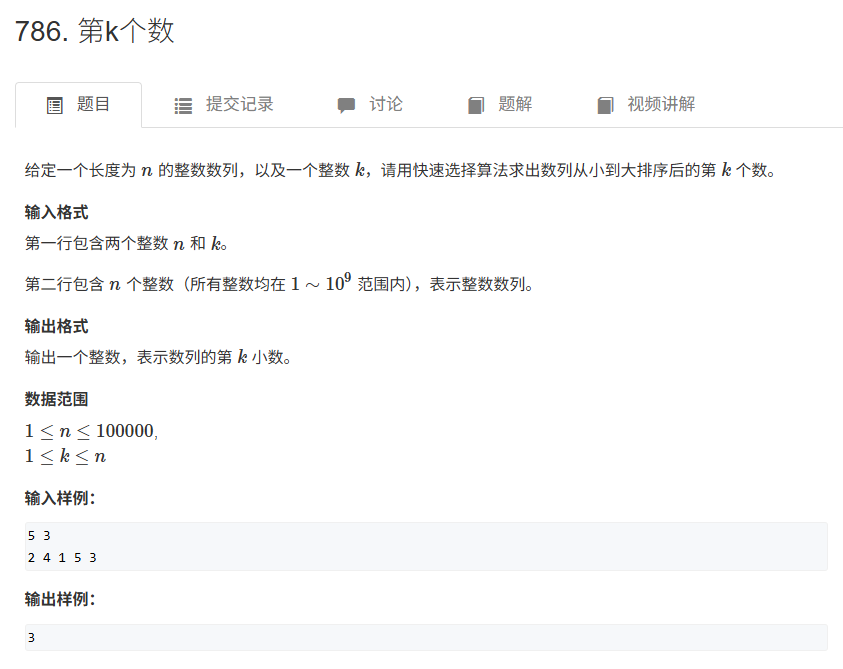

**解题思路：**

1. **快速选择（Quick Select）算法**：
   - 这是快速排序算法的变种，用来找出数组中的第 $k$ 小的元素。
   - 快速选择算法的核心思想是通过分区操作，将数组分成两部分，一部分小于等于基准元素，另一部分大于等于基准元素。如果基准元素正好是第 $k$ 小的元素，那么算法就结束；否则，就根据第 $k$ 小元素所在的部分继续递归查找。
2. **分区操作**：
   - 使用快速排序的分区方法，将数组按基准元素分为两部分。
   - 在每次分区后，如果基准元素的下标正好是 $k-1$，则该元素即为第 $k$ 小的元素。
   - 如果基准元素的位置小于 $k-1$，则递归地在右半部分继续查找第 $k-(pivot+1)$ 小的元素。
   - 如果基准元素的位置大于 $k-1$，则递归地在左半部分继续查找第 $k$ 小的元素。
3. **时间复杂度**：
   - 最坏情况下，快速选择的时间复杂度为 $O(n^2)$，但平均情况是 $O(n)$，因为每次分区会将问题规模缩小一半。

### 5. 堆排序

堆排序（Heap Sort）是一种基于完全二叉树的数据结构——堆（Heap）的排序算法。堆排序是选择排序的一种高效实现方式，时间复杂度为 $O(n \log n)$，空间复杂度为 $O(1)$。

**堆排序的基本思想：**

1. **堆的定义**：堆是一种完全二叉树，可以分为两种类型：
   - **最大堆**（Max-Heap）：每个父节点的值大于或等于其子节点的值。
   - **最小堆**（Min-Heap）：每个父节点的值小于或等于其子节点的值。
2. **堆排序的过程**：
   - **建堆**：将待排序的数组构建成一个最大堆。
   - **交换根节点与最后一个元素**：将最大堆的根节点（最大元素）与最后一个元素交换，将最大元素移到已排序区间。
   - **调整堆**：交换之后，根节点可能破坏了堆的结构，需要重新调整堆（即通过“堆化”操作恢复堆的性质）。
   - 重复上述过程，直到整个数组被排序。
3. **堆化**：堆化是指将一个子树变成堆的过程，通常从最后一个非叶子节点开始，通过不断地将子节点与父节点交换，保持堆的结构。

**堆排序的步骤：**

1. **建堆**：将无序数组转化为最大堆。这个过程从数组的最后一个非叶子节点开始，逐步调整每个子树。
2. **交换并调整堆**：将堆顶元素（最大值）与最后一个元素交换，将最大元素移到已排序区域，然后调整堆使其继续保持最大堆的结构。
3. **重复步骤2**：对剩余的元素重复上述步骤，直到所有元素都排好序。

### 6. 动态中位数（堆排序应用）

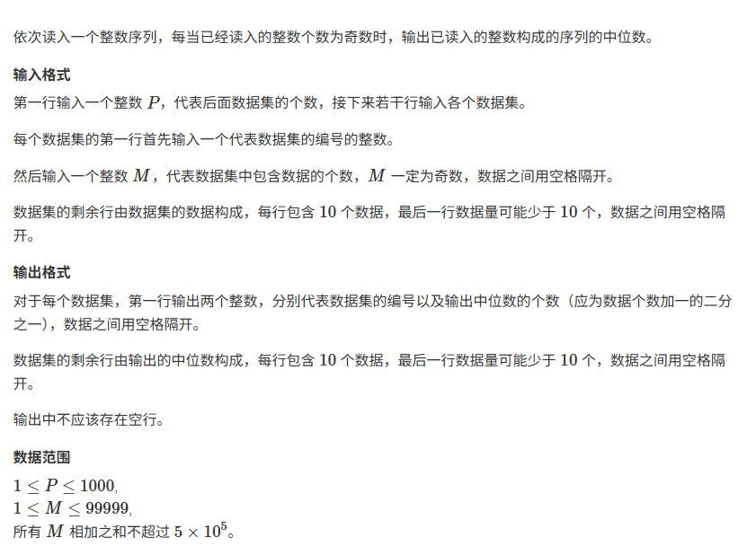

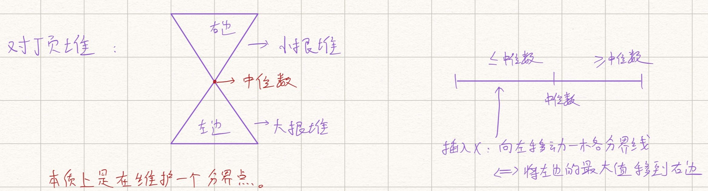

> 将新加入的元素和大根堆堆顶元素比较，如果小于等于堆顶，那么我们将它放入大根堆，否则放入小根堆，注意小根堆放的元素一定大于大根堆中的元素。然后中位数就是大根堆的堆顶。放入元素后，我们需要看一下两个堆的元素关系，要始终保证大根堆的元素个数=小根堆，或者等于小根堆+1。

**优化策略：对顶堆 (Dual Heap)**

- **左半边**：包含了所有**较小**的数。
- **右半边**：包含了所有**较大**的数。
- **中位数**：就是左半边的最大值，或者右半边的最小值（取决于元素总数是奇数还是偶数）。

**我们只需要维护这两个“边界”即可：**

1. **左边用大根堆 (Max Heap)**：堆顶是左半边最大的数，靠近中位数。
2. **右边用小根堆 (Min Heap)**：堆顶是右半边最小的数，靠近中位数。

**维护性质（Invariant）：**
为了方便直接取中位数，我们规定：

- **大根堆的元素个数** 要么等于 **小根堆**，要么比 **小根堆** 多 1 个。
- 这样，当总数为奇数时，**中位数永远是大根堆的堆顶**。

算法详细步骤 (Step-by-Step Algorithm)

1. **初始化**：down：大根堆（存放较小的一半数）。up：小根堆（存放较大的一半数）。cnt：记录当前输出了多少个中位数（用于控制换行）。
2. **处理输入流**：依次读入每个数字 x。**第一步（根据值插入）**：如果 down 是空的，或者 x 小于等于 down 的堆顶 `→→` 放入 down。否则 `→→` 放入 up。**第二步（调整平衡）**：如果你笔记里的“分界线”偏了，就要挪动元素。如果 down 的元素太多（比 up 多超过 1 个）：把 down 的堆顶弹出来，塞给 up。如果 up 的元素比 down 还多：把 up 的堆顶弹出来，塞给 down。**最终状态**：down.size() 必定等于 up.size() 或 up.size() + 1。
3. **输出结果**：每当读入第 `1,3,5...1,3,5...` 个数（即当前总数为奇数）时，down 的堆顶就是中位数。记录输出格式，每 10 个数换一行。

 **复杂度分析 (Complexity Analysis)**

- **时间复杂度**：$O(Mlog⁡M)$
  - 对于每个新读入的数，堆的插入和弹出操作复杂度为 `O(log⁡k)`（`k` 为当前元素个数）。
  - 总共有 `M` 个数，所以总复杂度为 `O(Mlog⁡M)`。这完全可以应对 `10^5` 的数据量。
- **空间复杂度**：$O(M)$
  - 需要存储所有的 `M` 个整数

```cpp
#include <iostream>
#include <cstring>
#include <algorithm>
#include <queue>
using namespace std;
const int N =  1e5 + 10;
int a[N];
int main()
{
    int t;
    cin >> t;
    while (t--)
    {
        int n, m;
        scanf("%d%d", &m, &n);
        printf("%d %d\n", m, (n + 1) / 2);

        priority_queue<int> down;
        priority_queue<int, vector<int>, greater<int>> up;

        int cnt = 0;
        for (int i = 1; i <= n; i ++ )
        {
            int x;
            scanf("%d", &x);

            if (down.empty() || x <= down.top()) down.push(x);
            else up.push(x);

            if (down.size() > up.size() + 1) up.push(down.top()), down.pop();
            if (up.size() > down.size()) down.push(up.top()), up.pop();

            if (i % 2)
            {
                printf("%d ", down.top());
                if ( ++ cnt % 10 == 0) puts("");
            }
        }

        if (cnt % 10) puts("");
    }
    return 0;
}
```

### 7. 二分

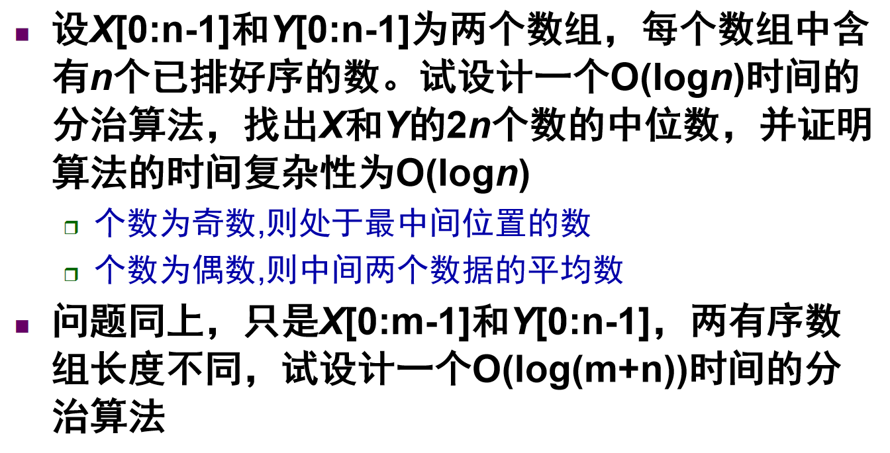

**第一部分：两个等长有序数组 ($N$ 和 $N$)**

**题目核心分析 (Problem Analysis)**

*   **输入**：两个数组 $X$ 和 $Y$，长度均为 $n$，且各自有序。
*   **目标**：找出合并后 $2n$ 个数的中位数。
    *   根据题目定义：如果总数为偶数（这里 $2n$ 必定是偶数），中位数是中间两个数的平均值。
*   **限制**：时间复杂度 $O(\log n)$。
    *   这暗示我们不能合并数组（$O(n)$），也不能遍历。必须每次排除掉一部分数据（类似于二分查找）。

**解题思路推导 (Thought Process)**

比较中位数并舍弃 (Compare & Discard)

利用分治思想，我们可以比较两个数组各自的“当前中位数”：
设 $m_1$ 是 $X$ 的中位数，$m_2$ 是 $Y$ 的中位数。

1.  **情况 A：$m_1 == m_2$**
    *   那么大家合并后的中位数肯定就是这个数。直接返回。
2.  **情况 B：$m_1 < m_2$**
    *   说明 $X$ 中 **比 $m_1$ 小的那一半** 数，在合并后肯定排在很前面，不可能成为最终的中位数。
    *   同时，$Y$ 中 **比 $m_2$ 大的那一半** 数，在合并后肯定排在很后面，也不可能成为中位数。
    *   **策略**：舍弃 $X$ 的左半边，舍弃 $Y$ 的右半边。继续在剩下的子数组中找。
3.  **情况 C：$m_1 > m_2$**
    *   逻辑相反。舍弃 $X$ 的右半边，舍弃 $Y$ 的左半边。

**注意**：为了保证舍弃后问题的规模一致且中位数位置不变，通常要保证舍弃的元素个数相同。

**算法详细步骤**

1.  分别计算当前数组片段 $X[start_X \dots end_X]$ 和 $Y[start_Y \dots end_Y]$ 的中位数 $m_1$ 和 $m_2$。
2.  若 $m_1 == m_2$，则返回 $m_1$。
3.  若 $m_1 < m_2$：
    *   舍弃 $X$ 的前半段（包括 $m_1$），保留后半段。
    *   舍弃 $Y$ 的后半段（包括 $m_2$），保留前半段。
    *   **细节**：如果元素个数是偶数，保留和舍弃的边界需要小心处理（通常保留“多一点”以防漏掉解）。
4.  若 $m_1 > m_2$：
    *   舍弃 $X$ 的后半段，保留前半段。
    *   舍弃 $Y$ 的前半段，保留后半段。
5.  **终止条件**：当数组只剩 1 个或 2 个元素时，直接计算得出结果。

**复杂度证明**

*   **递推公式**：每次比较后，问题规模 $n$ 减半。
    $$T(n) = T\left(\frac{n}{2}\right) + O(1)$$
*   根据主定理（Master Theorem），$a=1, b=2, f(n)=O(1)$。
*   **结果**：$T(n) = O(\log n)$。

```cpp
#include <iostream>
#include <vector>
#include <algorithm>

using namespace std;

// 辅助函数：求两个有序数组的中位数
double findMedianSortedArraysEqualLength(vector<int>& nums1, int start1, int end1, vector<int>& nums2, int start2, int end2) {
    int n = end1 - start1 + 1;
    
    // 边界情况：当数组只剩1个数时
    if (n == 1) {
        return (nums1[start1] + nums2[start2]) / 2.0;
    }
    // 当数组剩2个数时，总共4个数，中位数是中间两个数的平均值
    // 即 max(两个左边) 和 min(两个右边) 的平均
    if (n == 2) {
        int left = max(nums1[start1], nums2[start2]);
        int right = min(nums1[end1], nums2[end2]);
        return (left + right) / 2.0;
    }

    // 计算各自的中位数下标
    // 注意：这里为了简化逻辑，针对偶数长度，我们取下中位数进行比较
    int mid1 = (start1 + end1) / 2;
    int mid2 = (start2 + end2) / 2;
    
    int m1 = nums1[mid1];
    int m2 = nums2[mid2];

    if (m1 == m2) {
        return m1;
    } 
    else if (m1 < m2) {
        // m1 较小，舍弃 nums1 的左半边，舍弃 nums2 的右半边
        // 需保证舍弃长度一致。如果 n 是奇数，mid正好是中间；如果偶数，mid是左偏。
        // 下面的逻辑是为了保持剩下的元素个数相同
        if (n % 2 == 0) {
            // 偶数长度：nums1 丢弃 [start1...mid1], nums2 丢弃 [mid2+1...end2]
            return findMedianSortedArraysEqualLength(nums1, mid1 + 1, end1, nums2, start2, mid2 + 1); 
        } else {
            // 奇数长度：nums1 丢弃 [start1...mid1], nums2 丢弃 [mid2...end2]
            // 注意保留 mid2 因为它可能是解
            return findMedianSortedArraysEqualLength(nums1, mid1, end1, nums2, start2, mid2);
        }
    } 
    else {
        // m1 > m2，反之
        if (n % 2 == 0) {
            return findMedianSortedArraysEqualLength(nums1, start1, mid1 + 1, nums2, mid2 + 1, end2);
        } else {
            return findMedianSortedArraysEqualLength(nums1, start1, mid1, nums2, mid2, end2);
        }
    }
}
```

**第二部分：两个不等长有序数组 ($M$ 和 $N$)**

**题目核心分析**

*   **输入**：$X$ 长 $m$，$Y$ 长 $n$，有序。
*   **目标**：找总共 $m+n$ 个数的中位数。
*   **限制**：$O(\log(m+n))$。
*   **难点**：因为长度不同，不能简单地像上面那样“对半切”。如果 $X$ 很短 $Y$ 很长，简单的对半切会导致剩下的数量不对等。
*   **转化思路**：求中位数的本质，就是 **“求第 $K$ 小的数”**。
    *   如果总数 $L = m+n$ 是奇数，找第 $(L/2 + 1)$ 小的数。
    *   如果总数 $L = m+n$ 是偶数，找第 $(L/2)$ 和 $(L/2+1)$ 小的数，求平均。

**解题思路推导 (Thought Process)**

**核心算法：求两个有序数组的第 $k$ 小数 (`getKth`)**

我们要找第 $k$ 小的数，分治策略如下：

1.  **比较对象**：分别看数组 $X$ 和 $Y$ 的第 $k/2$ 个元素（下标为 $k/2 - 1$）。
2.  **决策**：
    *   设 $val_1 = X[k/2 - 1]$，$val_2 = Y[k/2 - 1]$。
    *   如果 $val_1 < val_2$：
        *   这意味着 $X$ 的前 $k/2$ 个元素，肯定都属于“所有元素中最小的 $k$ 个数”的前面部分。
        *   **为什么？** 即使 $Y$ 的前 $k/2$ 个元素都比 $X[k/2-1]$ 小，它们加起来也才 $k-1$ 个元素。所以 $X$ 的这 $k/2$ 个元素不可能是第 $k$ 个数（或者其后面的数）。
        *   **行动**：我们可以安全地**舍弃 $X$ 的前 $k/2$ 个元素**。
        *   **递归**：问题变成了“在剩下的数组中找第 $k - k/2$ 小的数”。
    *   如果 $val_1 > val_2$：同理，舍弃 $Y$ 的前 $k/2$ 个元素。
3.  **边界处理**：
    *   如果某个数组越界（比如 $X$ 长度小于 $k/2$），直接选另一个数组的 $k/2$ 处进行比较（或者直接把长的那个数组切掉一部分）。
    *   如果一个数组空了，直接返回另一个数组的第 $k$ 个。
    *   如果 $k=1$，返回 $\min(X[0], Y[0])$。

 **算法详细步骤**

1.  计算总长度 $total = m + n$。
2.  如果 $total$ 是奇数：调用 `getKth(..., total/2 + 1)`。
3.  如果 $total$ 是偶数：调用 `getKth(..., total/2)` 和 `getKth(..., total/2 + 1)`，求平均。
4.  **`getKth(k)` 函数逻辑**：
    *   比较 `nums1[k/2 - 1]` 和 `nums2[k/2 - 1]`。
    *   如果 `nums1` 小，说明 `nums1` 的前 `k/2` 个元素都没用，删掉。
    *   更新 $k = k - k/2$。
    *   重复直到 $k=1$ 或某数组为空。

**复杂度证明**

*   **每次操作**：我们将 $k$ 减小一半（$k \to k - k/2$）。
*   **初始 $k$**：$k \approx (m+n)/2$。
*   **循环次数**：$\log k = \log((m+n)/2)$。
*   **总复杂度**：$O(\log(m+n))$。

```cpp
#include <iostream>
#include <vector>
#include <algorithm>

using namespace std;

// 核心分治函数：在两个有序数组中寻找第 k 小的数
int getKth(vector<int>& nums1, int start1, int end1, vector<int>& nums2, int start2, int end2, int k) {
    int len1 = end1 - start1 + 1;
    int len2 = end2 - start2 + 1;

    // 保证 len1 <= len2，方便处理边界，让 nums1 总是较短的那个
    if (len1 > len2) return getKth(nums2, start2, end2, nums1, start1, end1, k);
    
    // 边界 1: nums1 为空，直接返回 nums2 的第 k 个
    if (len1 == 0) return nums2[start2 + k - 1];
    
    // 边界 2: 找第 1 小，即找最小值
    if (k == 1) return min(nums1[start1], nums2[start2]);

    // 分治核心：比较各自 k/2 位置的值
    // 注意不要越界，取 min(len, k/2)
    int i = start1 + min(len1, k / 2) - 1;
    int j = start2 + min(len2, k / 2) - 1;

    if (nums1[i] > nums2[j]) {
        // nums2 的前半部分太小，肯定不是第 k 个，舍弃 nums2 的前半部分
        // 舍弃的数量是 (j - start2 + 1)
        return getKth(nums1, start1, end1, nums2, j + 1, end2, k - (j - start2 + 1));
    } else {
        // nums1 的前半部分太小，舍弃
        return getKth(nums1, i + 1, end1, nums2, start2, end2, k - (i - start1 + 1));
    }
}

double findMedianSortedArraysUnequalLength(vector<int>& nums1, vector<int>& nums2) {
    int n = nums1.size();
    int m = nums2.size();
    
    // 处理奇偶数情况
    // 技巧：如果是奇数，left 和 right 算出来是一样的；如果是偶数，是中间两个
    int left = (n + m + 1) / 2;
    int right = (n + m + 2) / 2;
    
    // 能够统一处理奇偶数逻辑
    int val1 = getKth(nums1, 0, n - 1, nums2, 0, m - 1, left);
    
    if (left == right) return val1; // 奇数直接返回
    
    int val2 = getKth(nums1, 0, n - 1, nums2, 0, m - 1, right);
    return (val1 + val2) / 2.0;
}
```

### 8. 分巧克力（二分应用）

> 个人总结：二分的题目关键在于发现单调性，它一般会蕴含着某种顺序关系，比如如果我们选 x 是符合题意的，但是选x+1就不符合，那么答案就是x

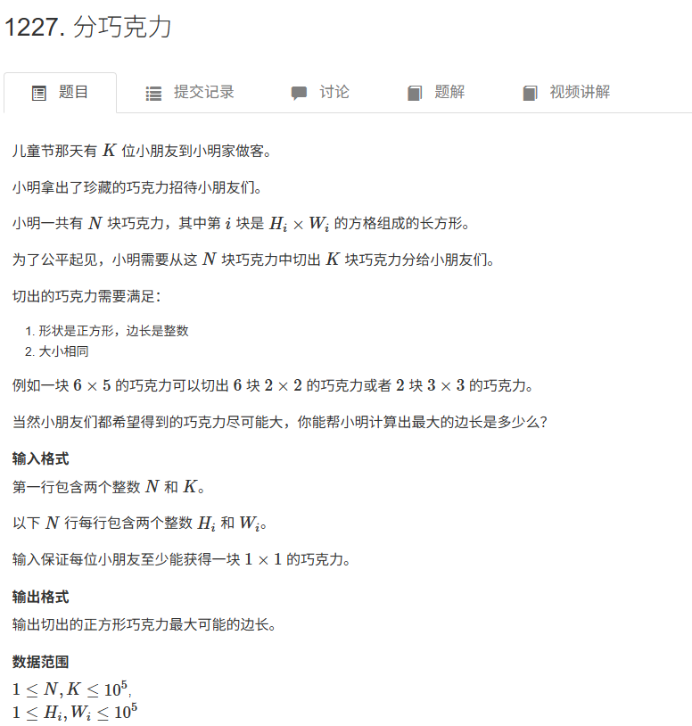

这道题是 **“二分答案” (Binary Search on Answer)** 的教科书级例题。

如果你在考试中遇到这种“**求最大值/最小值**”，且答案具有明确的“**单调性**”（即：如果边长 $X$ 满足条件，比 $X$ 小的也一定满足；如果不满足，比 $X$ 大的也一定不满足）的题目，**100% 是二分答案**。

下面按照满分答题模板为你解析。

**题目核心分析 (Problem Analysis)**

*   **问题目标**：切出 $K$ 块形状大小完全一样的**正方形**巧克力，求这个正方形的**最大边长**。
*   **挖掘隐含条件**：
    *   **不能拼接**：只能从一块大长方形里切，不能把剩下的碎料拼起来。这意味着一块 $H \times W$ 的巧克力，切边长为 $L$ 的正方形，最多能切 $(H / L) \times (W / L)$ 块（这里是整除）。
    *   **单调性**：
        *   假设边长 $L=5$ 能切够 $K$ 块，那么 $L=4$ 肯定也能切够（切得越小，得到的块数越多）。
        *   假设 $L=10$ 切不够，那么 $L=11$ 肯定更切不够。
    *   **数据规模**：$N, K \le 10^5$，边长 $H, W \le 10^5$。
        *   如果从边长 1 到 100,000 暴力枚举，每次都要遍历 $N$ 块巧克力，总复杂度 $O(N \times \text{max\_side}) \approx 10^{10}$，绝对超时。
        *   我们必须用 $O(N \log (\text{max\_side}))$ 的复杂度解决，即二分法。

**解题思路推导 (Thought Process)**

**朴素解法 (Brute Force)**

*   从边长 $L = 100000$ 开始尝试，算出总共能切多少块。如果不满足 $K$ 块，就试 $L-1$。
*   **瓶颈**：太慢了，最坏情况要算 10万次。

**优化策略：二分答案 (Binary Search)**

我们可以猜一个答案 `mid`，然后去验证这个 `mid` 是否可行（Check 函数）。

1.  **确定搜索区间**：
    *   最小边长 `left = 1`。
    *   最大边长 `right = 100000`（或者所有巧克力边长的最大值）。
2.  **二分策略**：
    *   取中间值 `mid = (left + right) / 2`。
    *   **Check(mid)**：遍历所有 $N$ 块巧克力，计算如果边长是 `mid`，总共能切出多少块 `cnt`。
        *   如果 `cnt >= K`：说明 `mid` 这个边长太小或者刚好，我们可以尝试**更大**的边长（贪心），把 `left` 移到 `mid + 1`，并记录当前 `mid` 为潜在答案。
        *   如果 `cnt < K`：说明 `mid` 太大了，切不出来这么多块，必须减小边长，把 `right` 移到 `mid - 1`。
3.  **终止条件**：当 `left > right` 时，循环结束，最后记录的答案就是最大边长。

**算法详细步骤 (Step-by-Step Algorithm)**

1.  **输入**：读取 $N$ 和 $K$，以及 $N$ 行 $H_i, W_i$。
2.  **定义 `check(len)` 函数**：
    *   初始化 `count = 0`。
    *   循环遍历每一块巧克力：`count += (H[i] / len) * (W[i] / len)`。
    *   如果途中 `count >= K`，直接返回 `true`（剪枝优化）。
    *   循环结束后，返回 `false`。
3.  **二分主逻辑**：
    *   `l = 1`, `r = 100000`。
    *   `ans = 0`。
    *   `while (l <= r)`:
        *   `mid = (l + r) >> 1` (即除以2)。
        *   `if check(mid)`:
            *   `ans = mid` (由题目求最大值，满足条件时先记录下来)。
            *   `l = mid + 1` (尝试往右找更大的)。
        *   `else`:
            *   `r = mid - 1` (不满足，只能往左找更小的)。
4.  **输出 `ans`**。

**复杂度分析 (Complexity Analysis)**

*   **时间复杂度**：$O(N \log S)$
    *   $S$ 是边长的最大值（$10^5$）。二分查找的次数是 $\log S \approx 17$ 次。
    *   每次 Check 函数需要遍历 $N$ 块巧克力。
    *   总计算量约为 $10^5 \times 17 \approx 1.7 \times 10^6$，远小于 $10^8$ 的限制，轻松通过。
*   **空间复杂度**：$O(N)$
    *   需要数组存储 $N$ 块巧克力的长宽。

```cpp
#include<bits/stdc++.h>
using namespace std;
const int N = 1e5 + 10;
int w[N], h[N];
int n, m;
bool check(int mid)
{
    int res = 0;
    for (int i = 1; i <= n; i ++)res += w[i] / mid * (h[i] / mid);
    return res >= m;
}
int main()
{
    scanf("%d%d", &n, &m);
    for (int i = 1; i <= n; i ++)scanf("%d%d", &h[i], &w[i]);
    int l = 1, r = 1e5;
    while(l < r)
    {
        int mid = l + r + 1 >> 1;
        if(check(mid))l = mid;
        else r = mid - 1;
    }
    printf("%d\n", r);
    return 0;
}
```

### 9. 最近点对

> 个人总结：算法思想就是类似于归并排序，每次把数组分为大小相同的两个部分，然后分别在每个数组内部求题目要求的解，然后在两个数组之间求解，两个数组之间求的时候就可以剪枝，只找临界处，蕴含了一点点贪心的思路
>
> 所以这类问题的关键是临界点处的处理，需要找到某个特点去降低复杂度

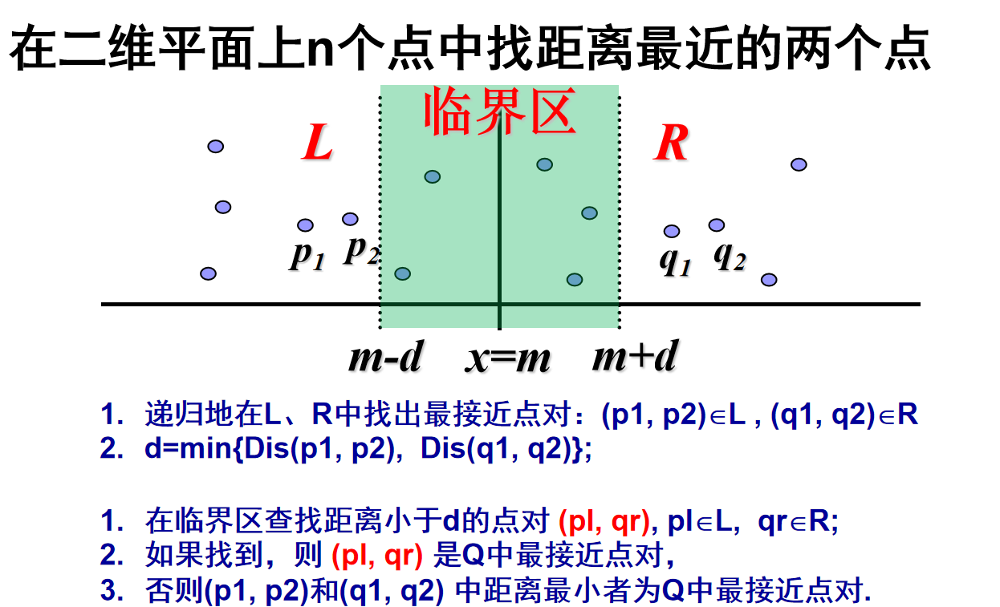

**题目核心分析 (Problem Analysis)**

*   **问题目标**：在二维平面上的 $N$ 个点中，找到距离最近的两个点，返回它们的距离 $d$。
*   **数据规模**：通常 $N \approx 10^5$。
    *   **暴力法**：计算所有两两点对距离，复杂度 $O(N^2)$，必超时。
    *   **目标复杂度**：$O(N \log N)$ 或 $O(N \log^2 N)$。
*   **难点**：将平面一分为二后，最近的两个点可能**一个在左半边，一个在右半边**。如果暴力检查这些跨界点对，复杂度会退化回 $O(N^2)$。

**解题思路推导 (Thought Process)**

**第一步：分 (Divide)**

1.  将所有点按照 **X 坐标** 进行排序。
2.  取中间的点（或中位数索引）作为切分线，将点集分为 **左集 (Left)** 和 **右集 (Right)**。

**第二步：治 (Conquer)**

递归地在左右两边寻找最近点对：

*   设左半边的最近距离为 $d_{left}$。
*   设右半边的最近距离为 $d_{right}$。
*   令当前已知的全局最短距离 $d = \min(d_{left}, \ d_{right})$。

**第三步：合 (Combine) —— 考试关键得分点**

此时，$d$ 是同侧点对的最小距离。我们需要检查**是否存在跨越中线的点对**，且距离小于 $d$。

为了避免 $O(N^2)$ 的暴力检查，我们利用**几何性质**进行剪枝：

1.  **X 轴筛选 (Strip 区域)**：
    *   只需要考虑横坐标在 $[mid.x - d, \ mid.x + d]$ 范围内的点。
    *   这一步过滤掉了大部分离中线很远的点。

2.  **Y 轴排序与几何稀疏性 (Geometric Sparsity)**：
    *   将 Strip 区域内的点按 **Y 坐标** 排序。
    *   对于 Strip 中的每个点 $P_i$，我们只需要检查紧随其后的点 $P_j$。
    *   **重要推论 (鸽巢原理)**：在一个 $d \times 2d$ 的矩形区域内，因为左右两边内部的点对距离至少为 $d$，所以该区域内最多只能存在 **6 个点**。
    *   **结论**：对于每个点，**内层循环最多只需要检查 6~7 次**。一旦纵坐标差值超过 $d$，立即停止 (`break`)。这使得合并步骤是线性的 $O(N)$。

**算法详细步骤 (Step-by-Step)**

1.  **预处理**：输入 $N$ 个点，按 X 坐标排序。
2.  **递归函数 `solve(left, right)`**：
    *   **终止条件**：若区间内只有 1 个点，返回无穷大；若有 2 个点，返回其距离。
    *   **递归**：计算 `mid`，得到 `d = min(solve(left, mid), solve(mid+1, right))`。
    *   **构建 Strip**：遍历 $[left, right]$，若 `abs(point[i].x - point[mid].x) < d`，加入 `strip` 数组。
    *   **Strip 排序**：将 `strip` 数组按 Y 坐标排序。
    *   **线性扫描**：双重循环遍历 `strip`：
        *   外层 `i` 从 0 到 size。
        *   内层 `j` 从 `i+1` 开始。
        *   **剪枝**：`if (strip[j].y - strip[i].y >= d) break;`。
        *   更新 `d = min(d, dist(i, j))`。
    *   **返回**：$d$。

**复杂度分析**

*   **时间复杂度**：
    *   递归公式：$T(N) = 2T(N/2) + O(N \log N)$（因为每次合并包含一次排序）。
    *   总复杂度：**$O(N \log^2 N)$**。
    *   *注：如果在递归前预处理 Y 轴排序，可优化至 $O(N \log N)$，但考试写 $\log^2 N$ 通常已足够通过且代码更不易出错。*
*   **空间复杂度**：$O(N)$（递归栈及临时数组）。

```cpp
#include <iostream>
#include <vector>
#include <algorithm>
#include <cmath>
#include <iomanip>

using namespace std;

// 1. 定义点结构体
struct Point {
    double x, y;
};

// 按 X 排序
bool compareX(const Point& a, const Point& b) {
    return a.x < b.x;
}

// 按 Y 排序
bool compareY(const Point& a, const Point& b) {
    return a.y < b.y;
}

// 计算欧几里得距离
double dist(const Point& a, const Point& b) {
    return sqrt(pow(a.x - b.x, 2) + pow(a.y - b.y, 2));
}

// 核心递归函数
double closest_pair(vector<Point>& points, int left, int right) {
    // 边界条件：点数不足2个
    if (left >= right) return 1e20; // 返回极大值
    // 只有2个点
    if (left + 1 == right) return dist(points[left], points[right]);

    // --- Divide & Conquer ---
    int mid = (left + right) / 2;
    double mid_x = points[mid].x; // 记录中线位置

    double d1 = closest_pair(points, left, mid);
    double d2 = closest_pair(points, mid + 1, right);
    double d = min(d1, d2);

    // --- Merge (Combine) ---
    vector<Point> strip;
    // 1. 筛选：只收集横坐标距离中线小于 d 的点
    for (int i = left; i <= right; i++) {
        if (abs(points[i].x - mid_x) < d) {
            strip.push_back(points[i]);
        }
    }

    // 2. 排序：按 Y 坐标排序，方便剪枝
    sort(strip.begin(), strip.end(), compareY);

    // 3. 扫描：利用几何性质剪枝
    for (int i = 0; i < strip.size(); i++) {
        for (int j = i + 1; j < strip.size(); j++) {
            // 核心剪枝：如果 Y 轴差距已经 >= d，后面的肯定更远，直接 break
            if (strip[j].y - strip[i].y >= d) {
                break;
            }
            d = min(d, dist(strip[i], strip[j]));
        }
    }

    return d;
}

int main() {
    int n;
    cin >> n; // 输入点数
    vector<Point> points(n);
    for (int i = 0; i < n; i++) {
        cin >> points[i].x >> points[i].y;
    }

    // 必须先按 X 排序，才能进行分治
    sort(points.begin(), points.end(), compareX);

    // 输出保留小数位（视题目要求）
    cout << fixed << setprecision(4) << closest_pair(points, 0, n - 1) << endl;

    return 0;
}
```

### 10. 求两数字之和（最近点对的应用）


> 本题可以直接用哈希表完成，但题目要求必须分治算法

**题目核心分析**

*   **输入**：$n$ 个实数的集合 $S$，目标和 $x$。
*   **目标**：判断是否存在 $a, b \in S$，使得 $a + b = x$。
*   **约束**：必须使用**分治算法**。
*   **难点**：
    *   如果简单地将数组一分为二，我们要找的两个数可能：
        1.  都在左半边（递归解决）。
        2.  都在右半边（递归解决）。
        3.  **一个在左，一个在右**（跨界问题）。
    *   如果不加处理，跨界问题的暴力检查复杂度是 $O(n^2)$，导致总复杂度退化。
    *   **解决策略**：我们在分治的过程中同时进行**排序**。当递归返回时，左右两半数组已经是有序的了，此时可以用 $O(n)$ 的**双指针法**来处理跨界查找。

**算法设计思路 (Algorithm Design)**

算法整体结构与**归并排序**几乎一致，只是多了“查找”这一步。

**步骤 1：分解 (Divide)**

将集合 $S$ 分为两个规模大致相等的子集合 $S_{left}$ 和 $S_{right}$。

**步骤 2：求解 (Conquer)**

递归地在 $S_{left}$ 和 $S_{right}$ 中寻找是否有和为 $x$ 的元素对，并同时对它们进行排序。

*   如果左边找到了，返回 `True`。
*   如果右边找到了，返回 `True`。

**步骤 3：合并与查找 (Combine & Check) —— 核心步骤****

当递归返回时，$S_{left}$ 和 $S_{right}$ 已经是**有序**的了。我们需要检查是否存在 $u \in S_{left}, v \in S_{right}$ 使得 $u + v = x$。

由于两个子数组都有序，我们可以使用**双指针 (Two Pointers)**：

1.  设指针 $i$ 指向 $S_{left}$ 的头部（最小值）。
2.  设指针 $j$ 指向 $S_{right}$ 的尾部（最大值）。
3.  计算 $sum = S_{left}[i] + S_{right}[j]$：
    *   若 $sum == x$，找到答案，返回 `True`。
    *   若 $sum < x$，说明和太小，需要更大的数，故 $i$ 向右移 ($i++$)。
    *   若 $sum > x$，说明和太大，需要更小的数，故 $j$ 向左移 ($j--$)。
4.  如果双指针扫描完未找到，则执行标准的**归并操作 (Merge)**，将 $S_{left}$ 和 $S_{right}$ 合并成一个有序数组返回给上一层。

**复杂度分析 (Complexity Analysis)**

我们将算法的时间消耗分为三部分：

1.  **分解**：$O(1)$。
2.  **递归求解**：解决两个规模为 $n/2$ 的子问题，即 $2T(n/2)$。
3.  **合并与跨界检查**：
    *   **跨界检查**：双指针遍历两个子数组，每个元素最多访问一次，复杂度 $O(n)$。
    *   **归并排序的合并**：标准操作，复杂度 $O(n)$。
    *   合起来这一步耗时 $O(n)$。

**递推方程**：
$$
T(n) = 
\begin{cases} 
O(1) & n = 1 \\
2T(n/2) + O(n) & n > 1 
\end{cases}
$$

**求解**：
根据主定理 (Master Theorem)：

*   $a = 2$ (子问题数量)
*   $b = 2$ (子问题规模缩小倍数)
*   $f(n) = O(n)$ (合并操作复杂度)
*   由于 $\log_b a = \log_2 2 = 1$，且 $f(n) = O(n^1)$。

属于主定理第二种情况 ($T(n) = n^{\log_b a} \log n$)，故：
$$
T(n) = O(n \log n)
$$

### 11. 寻找凸包（计算几何）

**题目核心分析**

*   **定义**：给定平面上的点集 $Q$，凸包是能包含 $Q$ 中所有点的最小凸多边形。形象地说，就是在这个点集外围套一根橡皮筋，松手后橡皮筋紧贴的边缘就是凸包。
*   **输入**：$N$ 个点的坐标 $(x, y)$。
*   **输出**：构成凸包的顶点序列（通常按逆时针顺序）。
*   **几何工具**：
    *   **叉积 (Cross Product)**：这是判断点之间相对位置的核心。
    *   对于向量 $\vec{A}$ 和 $\vec{B}$，若 $\vec{A} \times \vec{B} > 0$，则 $\vec{B}$ 在 $\vec{A}$ 的**逆时针**方向（左拐）；若 $< 0$，则为**顺时针**（右拐）。

**解题思路推导 (Thought Process)**

优化策略：Andrew 算法 (分治思想的体现)

我们将凸包拆分为 **上凸壳 (Upper Hull)** 和 **下凸壳 (Lower Hull)** 分别求解。

1.  **排序 (Sorting)**：
    *   首先将所有点按照 **x 坐标从小到大** 排序（x 相同则按 y 从小到大）。
    *   排序后，第一个点 $P_1$ 和最后一个点 $P_n$ 一定是凸包上的顶点。

2.  **栈维护 (Stack Maintenance)**：
    *   我们使用一个栈来存储当前的凸包顶点。
    *   **下凸壳**：从左向右遍历点。当我们加入新点时，如果新点导致原来的路径出现了“**右拐**”（即凹进去了），说明栈顶的点不在凸包上，弹出栈顶。直到新点能与栈内前两个点构成“**左拐**”（凸的），才将新点入栈。
    *   **上凸壳**：从右向左遍历点（逻辑同上）。

3.  **合并**：
    *   将上凸壳和下凸壳拼起来，就是完整的凸包。

**核心几何判定：叉积 (Cross Product)**

如何判断三个点 $O, A, B$ 是左拐还是右拐？
计算向量 $\vec{OA}$ 和 $\vec{AB}$ 的叉积：
$$
\text{cross}(O, A, B) = (A.x - O.x)(B.y - O.y) - (A.y - O.y)(B.x - O.x)
$$

*   **结果 > 0**：逆时针（左拐），符合凸包性质。
*   **结果 < 0**：顺时针（右拐），**凹进去了，需要删点**。
*   **结果 = 0**：三点共线。

**算法详细步骤 (Step-by-Step)**

1.  **排序**：`sort(points)`，主关键字 $x$，次关键字 $y$。
2.  **构建下凸壳**：
    *   初始化栈 `stk`。
    *   遍历 $i$ 从 $0$ 到 $n-1$：
        *   当 `stk.size() >= 2` 且 `cross(stk[top-1], stk[top], points[i]) <= 0`（即出现了右拐或共线）：
            *   `stk.pop()`（删除栈顶）。
        *   `stk.push(points[i])`。
3.  **构建上凸壳**：
    *   逻辑相同，但是**从后往前**遍历（$i$ 从 $n-2$ 到 $0$）。
    *   注意：为了不重复添加起点和终点，需控制边界或在最后去重。
4.  **输出**：栈中留下的点即为凸包顶点。

复杂度分析

*   **时间复杂度**：$O(N \log N)$
    *   排序耗时 $O(N \log N)$。
    *   扫描过程每个点最多进栈一次、出栈一次，耗时 $O(N)$。
    *   总计 $O(N \log N)$。
*   **空间复杂度**：$O(N)$
    *   需要一个栈（或数组）存储凸包上的点。

```cpp
#include <iostream>
#include <vector>
#include <algorithm>

using namespace std;

struct Point {
    double x, y;
    // 重载 < 运算符，用于排序
    bool operator<(const Point& other) const {
        if (x != other.x) return x < other.x;
        return y < other.y;
    }
};

// 计算叉积 (O, A, B)
// 返回值 > 0 表示左拐 (逆时针)
// 返回值 < 0 表示右拐 (顺时针)
// 返回值 = 0 表示共线
double cross_product(Point o, Point a, Point b) {
    return (a.x - o.x) * (b.y - o.y) - (a.y - o.y) * (b.x - o.x);
}

vector<Point> get_convex_hull(vector<Point>& points) {
    int n = points.size();
    if (n <= 2) return points; // 点太少，直接返回

    // 1. 排序
    sort(points.begin(), points.end());

    // 2. 单调链算法构建凸包
    vector<Point> hull;

    // --- 求下凸壳 ---
    for (int i = 0; i < n; i++) {
        // 当栈内至少有2个点，且新点会导致右拐(<=0)时，弹出栈顶
        while (hull.size() >= 2 && 
               cross_product(hull[hull.size()-2], hull.back(), points[i]) <= 0) {
            hull.pop_back();
        }
        hull.push_back(points[i]);
    }

    // --- 求上凸壳 ---
    // 从倒数第2个点开始往回扫，下界是0
    int lower_hull_size = hull.size();
    for (int i = n - 2; i >= 0; i--) {
        while (hull.size() > lower_hull_size && 
               cross_product(hull[hull.size()-2], hull.back(), points[i]) <= 0) {
            hull.pop_back();
        }
        hull.push_back(points[i]);
    }

    // 最后一个点是起点，因为上凸壳回到了起点，通常题目要求去掉重复的起点
    hull.pop_back();

    return hull;
}

int main() {
    int n;
    cin >> n;
    vector<Point> points(n);
    for (int i = 0; i < n; i++) {
        cin >> points[i].x >> points[i].y;
    }

    vector<Point> hull = get_convex_hull(points);

    // 输出结果
    for (const auto& p : hull) {
        cout << "(" << p.x << ", " << p.y << ")" << endl;
    }

    return 0;
}
```

## 二、贪心（仅区间问题）

### 1. 区间选点 (Interval Point Selection)

**题目描述**：给定 $N$ 个闭区间 $[a_i, b_i]$，你需要选择尽可能少的点，使得每个区间内至少包含一个选出的点。

#### 核心思路

*   **排序规则**：按 **右端点 (Right Endpoint)** 从小到大排序。
*   **贪心策略**：
    1.  为了让一个点能覆盖更多的后续区间，我们应该尽可能把点选在当前区间的**最右侧**。
    2.  如果当前区间已经包含了上一个选的点，则跳过（Pass）。
    3.  如果没包含，就必须选当前区间的右端点，计数器 +1，并更新 `last_point`。

#### 代码模板 (C++)

```cpp
#include <algorithm>
#include <vector>
using namespace std;

struct Range { int l, r; };

// 排序规则：按右端点升序
bool cmp(Range a, Range b) {
    return a.r < b.r;
}

int solve_point_selection(vector<Range>& ranges) {
    if (ranges.empty()) return 0;
    sort(ranges.begin(), ranges.end(), cmp);

    int count = 1; // 至少需要 1 个点
    int last_point = ranges[0].r; // 选第一个区间的右端点

    for (int i = 1; i < ranges.size(); i++) {
        // 如果当前区间的左端点 > 上一个选的点
        // 说明它没被覆盖，必须选一个新的点（当前区间的右端点）
        if (ranges[i].l > last_point) {
            count++;
            last_point = ranges[i].r;
        }
    }
    return count;
}
```

---

### 2. 最大不相交区间数量 (Max Non-overlapping Intervals)

**题目描述**：给定 $N$ 个闭区间，选择尽可能多的区间，使得这些区间之间互不相交。

#### 核心思路

*   **本质**：这道题和“区间选点”是**完全等价**的。
*   **排序规则**：按 **右端点** 从小到大排序。
*   **贪心策略**：
    *   想要选更多区间，就要让当前选的区间**结束得越早越好**，这样才能给后面的区间腾出空间。
    *   一旦选了一个区间，后续所有跟它冲突（相交）的区间都必须扔掉。

#### 代码模板

*代码与“区间选点”完全一致，无需更改。*

---

### 3. 区间分组 (Interval Grouping)

**题目描述**：给定 $N$ 个区间，把这些区间分成若干组，使得每组内部的区间互不相交，求最少需要分多少组。（类似：安排会议室，最少需要几个会议室？）

#### 核心思路

*   **排序规则**：按 **左端点 (Start Point)** 从小到大排序。
*   **数据结构**：**小根堆 (Min-Heap)**。堆中存的是“每一组当前最晚的结束时间”。
*   **贪心策略**：
    1.  遍历每个区间，看能不能把它塞进现有的某个组里。
    2.  为了充分利用空间，我们看**结束最早**的那个组（堆顶 `min_end`）。
    3.  如果 `当前区间.l > min_end`：说明可以接在这个组后面。弹出堆顶，更新该组的结束时间为 `当前区间.r`，重新入堆。
    4.  否则（所有组都在忙）：必须新开一个组（会议室），将 `当前区间.r` 入堆。
*   **答案**：堆的大小 (`heap.size()`)。

#### 代码模板 (C++)

```cpp
#include <algorithm>
#include <vector>
#include <queue>
using namespace std;

struct Range { int l, r; };

// 排序规则：按左端点升序
bool cmp(Range a, Range b) {
    return a.l < b.l;
}

int solve_interval_grouping(vector<Range>& ranges) {
    sort(ranges.begin(), ranges.end(), cmp);

    // 小根堆，存储每个组的 max_r
    priority_queue<int, vector<int>, greater<int>> heap;

    for (auto& range : ranges) {
        // 如果堆不空，且堆顶（最早结束的组）能容纳当前区间
        if (!heap.empty() && heap.top() < range.l) {
            heap.pop(); // 移除旧的结束时间
            heap.push(range.r); // 更新该组的结束时间
        } else {
            // 不能容纳（或者堆为空），新开一组
            heap.push(range.r);
        }
    }
    return heap.size();
}
```

---

### 4. 区间覆盖 (Interval Coverage)

**题目描述**：给定 $N$ 个区间，和目标线段 $[S, T]$，求至少需要选择多少个区间才能完全覆盖 $[S, T]$。如果无法覆盖，返回 -1。

#### 核心思路

*   **排序规则**：按 **左端点** 从小到大排序。
*   **贪心策略**：
    1.  我们要覆盖当前的起点 `start`（初始为 $S$）。
    2.  在所有 **能覆盖 start** 的区间中（即 $l \le start$），选出 **右端点最大** 的那个区间。因为这样能向右延伸得最远。
    3.  更新 `start` 为选出区间的右端点。
    4.  循环直到 `start >= T`。

#### 代码模板 (C++)

```cpp
#include <algorithm>
#include <vector>
using namespace std;

struct Range { int l, r; };

bool cmp(Range a, Range b) {
    return a.l < b.l;
}

int solve_interval_coverage(vector<Range>& ranges, int st, int ed) {
    sort(ranges.begin(), ranges.end(), cmp);

    int res = 0;
    bool success = false;
    
    for (int i = 0; i < ranges.size(); i++) {
        int j = i;
        int max_r = -2e9; // 记录能覆盖 st 的区间中，最大的右端点
        
        // 核心双指针逻辑：
        // 找到所有左端点 <= 当前起点 st 的区间，选个 r 最大的
        while (j < ranges.size() && ranges[j].l <= st) {
            max_r = max(max_r, ranges[j].r);
            j++;
        }
        
        // 如果最大的 r 甚至都比 st 还小，说明中间断开了，无法覆盖
        if (max_r < st) break;

        res++; // 选了这个区间
        
        if (max_r >= ed) {
            success = true;
            break;
        }
        
        st = max_r; // 更新起点
        i = j - 1;  // 更新外层循环位置（因为 j 已经跑在前面了）
    }

    return success ? res : -1;
}
```

---

### 5. 考试速记口诀 (Memory Aid)

这是考试时防止搞混的**终极表格**，请背下来：

| 题目类型       | 目标                  | 排序关键字        | 贪心策略             | 备注                 |
| :------------- | :-------------------- | :---------------- | :------------------- | :------------------- |
| **区间选点**   | 最少点覆盖所有区间    | **右端点** (升序) | 选当前区间的右端点   | 遇冲突跳过           |
| **不相交区间** | 选最多互不冲突区间    | **右端点** (升序) | 选结束最早的区间     | 遇冲突跳过 (同上)    |
| **区间分组**   | 最少分多少组 (会议室) | **左端点** (升序) | 小根堆存每组结束时间 | 能接就接，不能接新开 |
| **区间覆盖**   | 最少区间覆盖 $[S, T]$ | **左端点** (升序) | 每次选向右延伸最远的 | 需处理断层无解       |

#### 避坑指南：

1.  **左闭右开 vs 闭区间**：看清题目是 $[l, r]$ 还是 $[l, r)$。通常贪心逻辑通用，但判断“相交”时注意是 `<` 还是 `<=`。
    *   例如：$[1, 2]$ 和 $[2, 3]$。如果题目说点可以公用，则不算冲突；如果是时间段，时刻2不能同时做两件事，则算冲突。
2.  **无穷大初始化**：在区间覆盖中，注意坐标可能是负数，初始化 `max_r` 时要足够小。
3.  **空集处理**：题目如果给空数组，记得直接返回 0 或特定值。

## 三、网络流

### 1. 二分图系列

好的，加上**简单的证明**对于理解和记忆这些结论至关重要，特别是**最小点覆盖**和**最大独立集**的互补关系，以及**最小路径覆盖**的拆点逻辑。

这里为你整理了带有**核心思路推导和证明**的二分图专题总结。

#### 1. 二分图最大匹配 (Maximum Matching)

*   **定义**：在二分图中，找出一个边集，使得这些边两两没有公共顶点，且边的数量最大。
*   **算法**：匈牙利算法 (Hungarian Algorithm)、网络流算法。
*   **结果**：记为 $M$。

#### 简单证明：为什么匈牙利算法是对的？
核心基于 **“增广路定理” (Berge's Lemma)**。
1.  **增广路定义**：一条路径，起点和终点都是非匹配点，且路径上的边是“非匹配、匹配、非匹配、匹配...”交替出现的。
2.  **操作**：如果我们找到一条增广路，只要把路径上的所有边状态取反（匹配变不匹配，不匹配变匹配）。
3.  **推导**：
    *   因为两头都是非匹配边，取反后，**匹配边会比原来多一条**。
    *   **结论**：只要能找到增广路，最大匹配数就能 $+1$。
    *   **反之**：如果找不到了，说明已经达到最大值。匈牙利算法就是不断找增广路直到找不到了为止。

---

#### 2. 最小点覆盖 (Minimum Vertex Cover)

*   **定义**：选出最少的点，使得图中每一条边都至少有一个端点被选中。
*   **公式**：**最小点覆盖数 = 最大匹配数 ($M$)**
*   **来源**：König 定理。

#### 简单证明
我们需要证明两件事：$覆盖数 \ge M$ 和 $覆盖数 \le M$。

1.  **证明 $覆盖数 \ge M$（必要性）**：
    *   在最大匹配中，有 $M$ 条边。
    *   根据匹配的定义，这 $M$ 条边**互不相交**（没有公共顶点）。
    *   为了覆盖这 $M$ 条独立的边，每一条边都必须贡献出一个顶点来覆盖它自己。
    *   所以，至少需要 $M$ 个点。

2.  **证明 $覆盖数 \le M$（充分性 - 构造法）**：
    *   我们确实可以找到一种选点方案，只选 $M$ 个点就把所有边覆盖了。
    *   （König 定理的构造证明）：基于匈牙利算法运行结束后的状态，我们可以精妙地从每一条匹配边中选出一个点（或者是左边的点，或者是右边的点），这组点恰好能覆盖所有的匹配边和非匹配边。
    *   **结论**：既然至少需要 $M$ 个，且存在方案只需 $M$ 个，那么最小值就是 $M$。

---

#### 3. 最大独立集 (Maximum Independent Set)

*   **定义**：选出最多的点，使得任意两点之间没有边相连。
*   **公式**：**最大独立集 = 总点数 ($N$) - 最小点覆盖 ($M$)**

#### 简单证明：补集思想
这是一个集合论的逻辑推导，利用“独立集”和“点覆盖”的**互补性**。

1.  **设 $V$ 是所有点的集合，$S$ 是一个点集。**
2.  **正向推导**：
    *   如果 $S$ 是**独立集** $\Rightarrow$ $S$ 内部没有边。
    *   $\Rightarrow$ 图中所有的边，至少有一个端点在 $V - S$ 中（如果一条边两个端点都在 $S$ 里，那 $S$ 就不是独立集了）。
    *   $\Rightarrow$ $V - S$ 是一个**点覆盖**。
3.  **反向推导**：
    *   如果 $V - S$ 是**点覆盖** $\Rightarrow$ 所有边都被 $V - S$ 里的点按住了。
    *   $\Rightarrow$ 剩下的点集 $S$ 内部不可能有边（否则那条边就没被覆盖）。
    *   $\Rightarrow$ $S$ 是一个**独立集**。
4.  **结论**：
    *   为了让独立集 $S$ **最大**，我们必须让它的补集（点覆盖 $V - S$）**最小**。
    *   $\text{Max}(|S|) = |V| - \text{Min}(|V - S|) = N - \text{最大匹配}$。

---

#### 4. 最小路径覆盖 (Minimum Path Cover)

*   **定义**：在 **DAG（有向无环图）** 中，用最少的互不相交的路径覆盖所有点。
*   **建图**：拆点，左边代表出度，右边代表入度。原图 $u \to v$ 变成二分图 $u_{left} \to v_{right}$。
*   **公式**：**最小路径覆盖 = 总点数 ($N$) - 二分图最大匹配数 ($M$)**

#### 简单证明：边的合并
1.  **初始状态**：
    *   一开始，我们认为图中没有边，**每个点都是一条独立的路径**。
    *   此时路径数量 = 点数 $N$。
2.  **边的作用**：
    *   如果我们在路径覆盖中选中了一条边 $u \to v$。
    *   这相当于把“以 $u$ 结尾的路径”和“以 $v$ 开头的路径”**拼接**成了一条路径。
    *   **每选中一条边，路径的总数就减 1**。
3.  **约束条件**：
    *   因为路径互不相交，每个点作为“中间节点”时，只能**有一个前驱**（入度为1）和**一个后继**（出度为1）。
    *   这对应到二分图中：左边点 $u$（出）只能连一条边，右边点 $v$（入）只能连一条边。
    *   **这正是二分图匹配的定义！**
4.  **结论**：
    *   为了让剩下的路径数量**最少**，我们必须让选中的边数（拼接次数）**最多**。
    *   最多能选多少条边？就是二分图的**最大匹配数** $M$。
    *   $\text{最小路径数} = \text{初始路径数} (N) - \text{最大合并次数} (M)$。

---

#### 5. 考试总结 (可复制背诵)

| 问题               | 公式           | 证明一句话核心                                               |
| :----------------- | :------------- | :----------------------------------------------------------- |
| **二分图最大匹配** | `Hungarian()`  | **增广路定理**：找到增广路，匹配数+1；找不到即最大。         |
| **最小点覆盖**     | `= 最大匹配`   | **König定理**：$M$ 条互斥边至少需要 $M$ 个点覆盖，且恰好够用。 |
| **最大独立集**     | `N - 最大匹配` | **补集思想**：独立集的补集必然是点覆盖。要让独立集最大，补集（覆盖）必须最小。 |
| **最小路径覆盖**   | `N - 最大匹配` | **路径合并**：初始 $N$ 条路。每匹配一条边 $u \to v$，相当于把两条路拼成一条，总数 $-1$。 |

### 2. 网络流 费用流模板

网络流（Network Flow）是算法竞赛和高级算法考试中的重难点。解决网络流问题，本质上就是解决两个问题：**最大流 (Max Flow)** 和 **费用流 (Min-Cost Max-Flow)**。

这里为你总结最通用的两个最大流算法（EK 和 Dinic）以及费用流的标准解法。

---

#### 第一部分：最大流算法 (Max Flow)

核心思想都是基于 **增广路定理 (Augmenting Path)**：
> 只要在 **残量网络 (Residual Graph)** 中还能找到一条从源点 $S$ 到汇点 $T$ 的路径，就说明还能往里塞流量。
> **关键技巧**：每流过一条正向边，必须建立一条**反向边**。反向边的作用是“反悔”，允许把流回去的流量退回来，改走其他路。

#### 1. Edmonds-Karp 算法 (EK)

##### 核心思路
EK 算法是最直观的实现。
*   **策略**：利用 **BFS** 在残量网络中寻找一条从 $S$ 到 $T$ 的**最短路径**（边数最少）。
*   **操作**：
    1.  BFS 找增广路，记录路径上的最小剩余容量 `min_flow`。
    2.  从 $T$ 回溯到 $S$，正向边减流量，**反向边加流量**。
    3.  重复直到 BFS 找不到路为止。
*   **复杂度**：$O(V E^2)$。适合点少、边少的图，或者作为入门理解。

##### 代码模板 (C++)
```cpp
#include <iostream>
#include <vector>
#include <queue>
#include <cstring>
#include <algorithm>

using namespace std;

const long long INF = 1e18;
const int MAXN = 1005; // 点数
const int MAXM = 20005; // 边数 (注意反向边，需乘2)

// 链式前向星存图
struct Edge {
    int to, next;
    long long capacity; // 残量
} edge[MAXM];

int head[MAXN], cnt = 1; // cnt=1 方便通过 i^1 找到反向边
int pre[MAXN]; // 记录路径的前驱边
long long flow[MAXN]; // 记录源点到该点的最小残量

void add_edge(int u, int v, long long c) {
    edge[++cnt] = {v, head[u], c}; head[u] = cnt;
    edge[++cnt] = {u, head[v], 0}; head[v] = cnt; // 反向边初始容量为0
}

bool bfs(int s, int t) {
    memset(pre, 0, sizeof(pre));
    memset(flow, 0, sizeof(flow));
    queue<int> q;
    
    q.push(s);
    flow[s] = INF;
    
    while (!q.empty()) {
        int u = q.front(); q.pop();
        if (u == t) return true; // 找到路了
        
        for (int i = head[u]; i; i = edge[i].next) {
            int v = edge[i].to;
            // 只有残量 > 0 且没访问过才走
            if (edge[i].capacity > 0 && flow[v] == 0) {
                flow[v] = min(flow[u], edge[i].capacity); // 更新路上的瓶颈流量
                pre[v] = i; // 记录前驱边，方便回溯
                q.push(v);
                if (v == t) return true;
            }
        }
    }
    return false;
}

long long EK(int s, int t) {
    long long max_flow = 0;
    while (bfs(s, t)) {
        max_flow += flow[t];
        // 回溯更新残量网络
        int curr = t;
        while (curr != s) {
            int i = pre[curr]; // 获取入边
            edge[i].capacity -= flow[t];     // 正向边减少
            edge[i ^ 1].capacity += flow[t]; // 反向边增加
            curr = edge[i ^ 1].to; // 这里的to其实就是由谁指过来的
        }
    }
    return max_flow;
}
```

---

#### 2. Dinic 算法 (当前主流)

##### 核心思路
EK 每次只能找一条路，太慢。Dinic 引入了 **“分层图”** 和 **“多路增广”**。
*   **步骤 1：BFS 分层**
    *   根据距离源点 $S$ 的距离给每个点标号（层数）。
    *   限制流量只能从第 $i$ 层流向第 $i+1$ 层。这防止了流量在图里绕圈圈。
*   **步骤 2：DFS 多路增广**
    *   在分层图上跑 DFS。
    *   一次 DFS 可以找出多条路径，填满多条边。
*   **优化：当前弧优化 (Cur Arc Optimization)**
    *   这是 Dinic 的灵魂。如果一个点有 10 条出边，第 1 条边已经流满了，下次再访问这个点时，直接从第 2 条开始看，不要再看第 1 条了。

*   **复杂度**：$O(V^2 E)$。在二分图匹配中甚至只有 $O(E\sqrt{V})$。是目前比赛和考试的**首选算法**。

##### 代码模板 (C++)
```cpp
#include <iostream>
#include <vector>
#include <queue>
#include <cstring>
#include <algorithm>

using namespace std;

const long long INF = 1e18;
const int MAXN = 1005;
const int MAXM = 20005;

struct Edge {
    int to, next;
    long long capacity;
} edge[MAXM];

int head[MAXN], cnt = 1;
int level[MAXN]; // 记录层数（深度）
int cur[MAXN];   // 当前弧优化：记录当前点遍历到了哪条边

void add_edge(int u, int v, long long c) {
    edge[++cnt] = {v, head[u], c}; head[u] = cnt;
    edge[++cnt] = {u, head[v], 0}; head[v] = cnt;
}

// 1. BFS 建立分层图
bool bfs(int s, int t) {
    memset(level, 0, sizeof(level));
    memcpy(cur, head, sizeof(head)); // 每次BFS重置当前弧为第一条边
    queue<int> q;
    
    q.push(s);
    level[s] = 1;
    
    while (!q.empty()) {
        int u = q.front(); q.pop();
        for (int i = head[u]; i; i = edge[i].next) {
            int v = edge[i].to;
            // 必须有残量，且之前未访问过
            if (edge[i].capacity > 0 && !level[v]) {
                level[v] = level[u] + 1;
                q.push(v);
            }
        }
    }
    return level[t] != 0; // 如果能走到汇点，说明还有增广路
}

// 2. DFS 多路增广
long long dfs(int u, int t, long long limit) {
    if (u == t || limit == 0) return limit;
    
    long long flow = 0;
    // 注意：这里的循环从 cur[u] 开始，而不是 head[u]
    for (int i = cur[u]; i; i = edge[i].next) {
        cur[u] = i; // 更新当前弧
        int v = edge[i].to;
        
        // 只能往下一层流
        if (level[v] == level[u] + 1 && edge[i].capacity > 0) {
            long long f = dfs(v, t, min(limit, edge[i].capacity));
            if (f > 0) {
                edge[i].capacity -= f;
                edge[i ^ 1].capacity += f;
                flow += f;
                limit -= f;
                if (limit == 0) break; // 当前过来的流量流完了，可以结束了
            }
        }
    }
    return flow;
}

long long Dinic(int s, int t) {
    long long max_flow = 0;
    while (bfs(s, t)) {
        max_flow += dfs(s, t, INF);
    }
    return max_flow;
}
```

---

#### 第二部分：最小费用最大流 (Min-Cost Max-Flow)

##### 题目定义
每条边除了容量 `capacity`，还有一个单位流量的费用 `cost`。
目标：在**保持流量最大**的前提下，让总费用最小。

##### 核心思路：SPFA 算法代替 BFS
这其实是 EK 算法的变种。
*   在 EK 中，我们用 BFS 找**边数最少**的路。
*   在费用流中，我们用 SPFA (或 Dijkstra) 找**单位费用之和最小**的路。

**算法流程**：
1.  跑 SPFA（因为反向边的费用是负的，Dijkstra 处理负权麻烦，SPFA 是标配）。
2.  SPFA 找到一条从 $S$ 到 $T$ 费用最小的增广路。
3.  沿这条路增广流量。
4.  累加：`总费用 += 本次流量 * 本次路径单位费用`。
5.  **反向边细节**：如果正向边费用是 `w`，反向边费用是 `-w`（退货不仅要把流量退回去，还要把钱拿回来）。

##### 代码模板 (C++)
```cpp
#include <iostream>
#include <vector>
#include <queue>
#include <cstring>
#include <algorithm>

using namespace std;

const long long INF = 1e18;
const int MAXN = 5005;
const int MAXM = 100005;

struct Edge {
    int to, next;
    long long capacity;
    long long cost; // 新增费用属性
} edge[MAXM];

int head[MAXN], cnt = 1;
long long dist[MAXN]; // 记录最小费用
long long flow[MAXN]; // 记录路径上的瓶颈流量
int pre[MAXN];        // 记录前驱边
bool in_queue[MAXN];  // SPFA 标记

void add_edge(int u, int v, long long cap, long long c) {
    edge[++cnt] = {v, head[u], cap, c}; head[u] = cnt;
    // 反向边：容量0，费用为负
    edge[++cnt] = {u, head[v], 0, -c}; head[v] = cnt;
}

// 用 SPFA 寻找单位费用最小的增广路
bool spfa(int s, int t) {
    for (int i = 0; i < MAXN; i++) dist[i] = INF;
    memset(in_queue, 0, sizeof(in_queue));
    memset(flow, 0, sizeof(flow));
    memset(pre, 0, sizeof(pre));
    
    queue<int> q;
    q.push(s);
    dist[s] = 0;
    flow[s] = INF;
    in_queue[s] = true;
    
    while (!q.empty()) {
        int u = q.front(); q.pop();
        in_queue[u] = false;
        
        for (int i = head[u]; i; i = edge[i].next) {
            int v = edge[i].to;
            // 如果有残量，且松弛操作成功（找到更便宜的路）
            if (edge[i].capacity > 0 && dist[v] > dist[u] + edge[i].cost) {
                dist[v] = dist[u] + edge[i].cost;
                flow[v] = min(flow[u], edge[i].capacity);
                pre[v] = i;
                if (!in_queue[v]) {
                    q.push(v);
                    in_queue[v] = true;
                }
            }
        }
    }
    return dist[t] != INF;
}

pair<long long, long long> MCMF(int s, int t) {
    long long max_flow = 0;
    long long min_cost = 0;
    
    while (spfa(s, t)) {
        long long f = flow[t];
        max_flow += f;
        min_cost += f * dist[t]; // 流量 * 单价
        
        int curr = t;
        while (curr != s) {
            int i = pre[curr];
            edge[i].capacity -= f;
            edge[i ^ 1].capacity += f;
            curr = edge[i ^ 1].to;
        }
    }
    return {max_flow, min_cost};
}
```

---

#### 总结速记

| 算法      | 核心思路                             | 复杂度       | 适用场景               |
| :-------- | :----------------------------------- | :----------- | :--------------------- |
| **EK**    | BFS 找最短增广路，单路增广           | $O(VE^2)$    | 数据小，图简单         |
| **Dinic** | BFS 分层 + DFS 多路增广 + 当前弧优化 | $O(V^2E)$    | **最大流首选通用板子** |
| **MCMF**  | SPFA 找最小费用路，单路增广          | 视 SPFA 而定 | **费用流通用板子**     |

**考试避坑指南**：
1.  **数组大小**：前向星存图，边数记得开 **2倍**（正向+反向），如果是无向图转换来的网络流，要开 **4倍**。
2.  **反向边处理**：`add_edge` 里反向边 `cost` 是负数，`capacity` 是 0。
3.  **Dinic 优化**：千万别忘了 `cur` 数组（当前弧优化），没有它 Dinic 会退化得很慢。

### 3. 拆点（最大流）

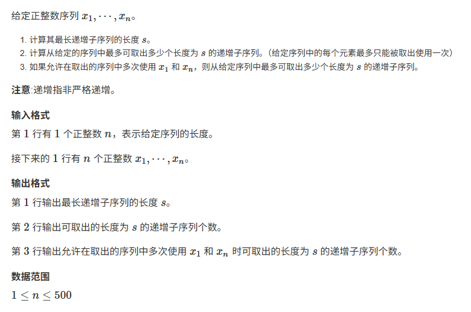

这道题是经典的 **“线性 DP + 网络最大流”** 结合的题目，源自著名的《网络流 24 题》。

题目要求解决三个层层递进的问题，分别对应 **动态规划**、**拆点最大流** 和 **修改容量的最大流**。

下面按照满分答题模板为你解析。

---

#### 1. 题目核心分析 (Problem Analysis)

*   **问题 1（求长度）**：给定序列求最长不下降子序列（根据题目“非严格递增”的提示，即 $x_i \le x_{i+1}$）的长度 $s$。这是最基础的 $O(n^2)$ 动态规划。
*   **问题 2（求个数，不可复用）**：问最多能取出多少个长度为 $s$ 的子序列，且**每个元素只能使用一次**。
    *   “每个元素有容量限制” $\rightarrow$ 暗示 **网络流的点容量**。
    *   “最多能取出多少” $\rightarrow$ 暗示 **最大流**。
    *   我们需要构建一个流网络，流量代表子序列的个数。
*   **问题 3（求个数，头尾可复用）**：在问题 2 的基础上，允许 $x_1$ 和 $x_n$ 被无限次使用。这只需要修改网络中的边权容量即可。

---

#### 2. 解题思路推导 (Thought Process)

##### 第一步：计算最长长度 $s$ (DP)
*   设 `dp[i]` 表示以第 $i$ 个元素 $x_i$ **结尾**的最长不下降子序列长度。
*   转移方程：$dp[i] = \max(dp[j]) + 1$，其中 $j < i$ 且 $x_j \le x_i$。
*   计算完所有 $dp$ 值后，$s = \max(dp)$。

##### 第二步：构建网络流模型 (针对问题 2)
为了限制每个数字只能用一次，我们需要使用 **拆点法 (Vertex Splitting)**：
1.  **拆点**：将序列中每个位置 $i$ 拆成两个点：**入点 $u_i$** 和 **出点 $v_i$**。
    *   连接 $u_i \to v_i$，容量为 1。这表示第 $i$ 个数本身只能被用 1 次。
2.  **构建层级关系（连接子序列）**：
    *   如果 $j < i$，且 $x_j \le x_i$，并且满足 $dp[j] + 1 == dp[i]$（说明 $x_j$ 可以作为 $x_i$ 在最长子序列中的前驱），则连接 $v_j \to u_i$，容量为 1。
3.  **连接源汇**：
    *   设立源点 $S$ 和汇点 $T$。
    *   如果 $dp[i] == 1$（说明 $x_i$ 可以作为子序列的起点），连接 $S \to u_i$，容量为 1。
    *   如果 $dp[i] == s$（说明 $x_i$ 可以作为子序列的终点），连接 $v_i \to T$，容量为 1。
4.  **求解**：跑一次最大流，流量即为答案。

##### 第三步：修改容量 (针对问题 3)
题目允许 $x_1$ 和 $x_n$ 多次使用。
*   这意味着点 1 和点 $n$ 的内部限制解除，且它们作为起点/终点的限制解除。
*   **修改操作**：
    *   将边 $u_1 \to v_1$ 的容量改为 $\infty$。
    *   将边 $S \to u_1$ 的容量改为 $\infty$（如果存在这条边）。
    *   将边 $u_n \to v_n$ 的容量改为 $\infty$。
    *   将边 $v_n \to T$ 的容量改为 $\infty$（如果存在这条边）。
*   **再次求解**：再跑一次最大流，即为新答案。

---

#### 3. 算法详细步骤

1.  **DP 求解**：双重循环计算 $dp$ 数组，得到最大长度 $s$。
2.  **特殊判断**：如果 $s=1$，直接输出对应的特殊解（虽然网络流也能跑，但 $s=1$ 时逻辑可能有细微差别，且 $n=1$ 时需特判）。
3.  **建图 (Graph Building)**：
    *   节点编号：$S=0, T=2n+1$。
    *   位置 $i$ 对应入点 $i$，出点 $i+n$。
    *   按上述逻辑加边。
4.  **运行 Dinic 算法**：输出 max_flow 作为第二问答案。
5.  **修改图结构**：
    *   注意：要在原图（也就是第二问的图）的基础上修改，或者重新建图。
    *   修改 $1$ 和 $n$ 相关的容量为 INF。
6.  **再次运行 Dinic 算法**：输出 max_flow 作为第三问答案。

---

#### 4. 代码示例 (C++)

```cpp
#include <iostream>
#include <vector>
#include <queue>
#include <algorithm>
#include <cstring>

using namespace std;

const int INF = 1e9;
const int MAXN = 1200; // 点数 2*N + 源汇

struct Edge {
    int to, next, cap, flow;
} edge[MAXN * MAXN];

int head[MAXN], cnt = 0;
int level[MAXN], cur[MAXN];
int n;
int a[505], dp[505];

void add_edge(int u, int v, int c) {
    edge[cnt] = {v, head[u], c, 0}; head[u] = cnt++;
    edge[cnt] = {u, head[v], 0, 0}; head[v] = cnt++;
}

void init_graph() {
    memset(head, -1, sizeof(head));
    cnt = 0;
}

// --- Dinic 模板 ---
bool bfs(int s, int t) {
    memset(level, -1, sizeof(level));
    queue<int> q;
    q.push(s);
    level[s] = 0;
    while (!q.empty()) {
        int u = q.front(); q.pop();
        for (int i = head[u]; i != -1; i = edge[i].next) {
            int v = edge[i].to;
            if (edge[i].cap - edge[i].flow > 0 && level[v] == -1) {
                level[v] = level[u] + 1;
                q.push(v);
            }
        }
    }
    return level[t] != -1;
}

int dfs(int u, int t, int flow) {
    if (u == t || flow == 0) return flow;
    int ret = 0;
    for (int &i = cur[u]; i != -1; i = edge[i].next) {
        int v = edge[i].to;
        if (level[v] == level[u] + 1 && edge[i].cap - edge[i].flow > 0) {
            int f = dfs(v, t, min(flow, edge[i].cap - edge[i].flow));
            if (f > 0) {
                edge[i].flow += f;
                edge[cnt^1].flow -= f; // 反向边
                ret += f;
                flow -= f;
                if (flow == 0) break;
            }
        }
    }
    return ret;
}

int dinic(int s, int t) {
    int max_flow = 0;
    while (bfs(s, t)) {
        memcpy(cur, head, sizeof(head));
        max_flow += dfs(s, t, INF);
    }
    return max_flow;
}

int main() {
    cin >> n;
    // 题目输入说明比较模糊，通常第一行是N，第二行是数列
    // 或者是 N 然后 N个数。这里按标准格式处理。
    // 如果题目是 "接下来若干行"，需注意读取。这里假设标准格式。
    
    // 注意：有些oj该题 n=1 时会有些坑，但逻辑上DP s=1
    if (n == 0) { cout << "0\n0\n0\n"; return 0; }
    
    for (int i = 1; i <= n; i++) cin >> a[i];

    // 1. DP 求 LIS 长度
    int s = 0;
    for (int i = 1; i <= n; i++) {
        dp[i] = 1;
        for (int j = 1; j < i; j++) {
            // 注意：题目说“非严格递增”，所以是 <=
            if (a[j] <= a[i]) {
                dp[i] = max(dp[i], dp[j] + 1);
            }
        }
        s = max(s, dp[i]);
    }
    cout << s << endl;

    // 2. 第一遍网络流（每个只能用一次）
    init_graph();
    int S = 0, T = 2 * n + 1;

    for (int i = 1; i <= n; i++) {
        // 拆点：i -> i+n，容量1
        add_edge(i, i + n, 1);

        // 如果 dp[i] == 1，说明是起点，S -> i
        if (dp[i] == 1) add_edge(S, i, 1);

        // 如果 dp[i] == s，说明是终点，i+n -> T
        if (dp[i] == s) add_edge(i + n, T, 1);

        // 内部连接：如果 j 可以接上 i
        for (int j = 1; j < i; j++) {
            if (a[j] <= a[i] && dp[j] + 1 == dp[i]) {
                // j的出点 -> i的入点
                add_edge(j + n, i, 1);
            }
        }
    }
    cout << dinic(S, T) << endl;

    // 3. 第二遍网络流（x1 和 xn 可复用）
    init_graph(); // 重新建图最稳妥
    for (int i = 1; i <= n; i++) {
        int cap = 1;
        // x1 和 xn 自身容量无限
        if (i == 1 || i == n) cap = INF;
        add_edge(i, i + n, cap);

        if (dp[i] == 1) {
            int cap_s = 1;
            if (i == 1 || i == n) cap_s = INF; // 如果1是起点，容量无限
            add_edge(S, i, cap_s);
        }

        if (dp[i] == s) {
            int cap_t = 1;
            if (i == 1 || i == n) cap_t = INF; // 如果n是终点，容量无限
            add_edge(i + n, T, cap_t);
        }

        for (int j = 1; j < i; j++) {
            if (a[j] <= a[i] && dp[j] + 1 == dp[i]) {
                add_edge(j + n, i, 1);
            }
        }
    }
    
    // 特判：如果 s=1，第三问逻辑中 1 和 N 可能被加了无限边导致错误逻辑（虽然s=1时1和N直接连T）
    // 但通常数据 s > 1。如果 s=1，答案就是 n（每个都独立），第二问n，第三问n。
    // 网络流在 s=1 时，如果 n>1，1和n都连S和T，流量是INF。
    // 实际上该题如果 s=1，通常特判输出。
    if (s == 1) {
        // 如果最长只有1，第三问允许复用，但如果序列只有1个数，答案是1
        // 如果序列 > 1 个数，每个数都是一个序列。
        // 标准测试数据中 s=1 的情况通常按 n 处理或者题目保证 s>1
        // 这里直接跑 Dinic。
        cout << dinic(S, T) << endl; 
    } else {
        cout << dinic(S, T) << endl;
    }

    return 0;
}
```

#### 考试踩坑提示：
1.  **非严格递增**：题目明确说了 $x_j \le x_i$ 算递增，DP 和建图判断时必须写 `<=`，写成 `<` 会丢分。
2.  **点容量限制**：务必使用 **拆点法**，这是本题将“点只能用一次”转化为图论模型的关键。
3.  **重新建图**：第三问修改容量时，建议清空图重新建一遍，因为在残量网络上修改比较麻烦，且容易出错。
4.  **特判 $N=1$**：虽然 $N$ 范围是 500，但边界情况要想一下。如果 $N=1$，第一问 1，第二问 1，第三问 1。上述代码能覆盖。

### 4. 拆点（费用流）

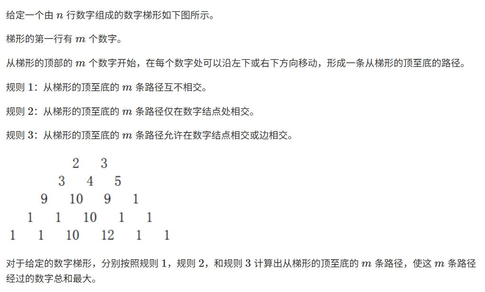

这是一个非常经典的算法竞赛题目，通常出现在**网络流（Network Flow）**的学习范畴中，特别是**最小费用最大流（Minimum Cost Maximum Flow, MCMF）**的应用。

这道题的核心难点在于如何用**图论**的模型来描述这三条不同的规则。普通的动态规划（DP）很难解决这个问题，因为我们需要同时规划 $m$ 条路径，且路径之间有复杂的交互限制（是否相交）。

下面我将为你详细拆解这道题的思路。

---

#### 1. 核心思想：费用流（MCMF）

我们要找 $m$ 条路径，使得总和最大。我们可以把它转化为一个“最大费用最大流”问题：
*   **流量（Flow）：** 代表路径的数量。我们需要流量为 $m$。
*   **费用（Cost）：** 代表数字的大小。流经过某个节点，就获得该节点的收益。
*   **容量（Capacity）：** 代表规则的限制（能不能共用节点、能不能共用边）。

由于标准的算法是“最小费用最大流”，我们在实现时通常有两个办法：
1.  将所有数字取负数（求最小费用），最后结果取反。
2.  直接跑“最大费用最大流”（把最短路算法改成最长路算法）。
*下文为了方便理解，我们按“最大费用”来讲解。*

#### 2. 建图基础：拆点法

在网络流中，边有容量，点没有容量。但题目中的规则主要限制的是“数字结点”（点）。为了限制经过某个点的次数，我们需要使用**拆点法**。

对于梯形中的每一个数字（假设坐标为 $(i, j)$），我们将它拆成两个点：
*   **入点（In-node）：** $U_{in}$
*   **出点（Out-node）：** $U_{out}$

在这两点之间连一条边：$U_{in} \to U_{out}$。
*   这条边的**流量容量**决定了这个数字能被使用几次。
*   这条边的**单位费用**就是这个数字的值（因为只有流过这条边，才算拿到了这个数字）。

#### 3. 构建基本网络

我们需要构建一个源点 $S$ 和一个汇点 $T$。

1.  **源点 $S$：** 连接到梯形**第一行**的所有入点。
    *   容量：1（因为题目要求从顶部的 $m$ 个数字开始，每个数字出发一条路）。
    *   费用：0。
2.  **梯形内部：**
    *   对于位置 $(i, j)$，它的出点 $U_{out}$ 连接到下一行的两个可能的入点：左下 $(i+1, j)$ 和 右下 $(i+1, j+1)$ 的入点。
    *   费用：0（移动本身不产生数字，数字在点内部）。
    *   容量：取决于规则（见下文）。
3.  **汇点 $T$：** 梯形**最后一行**的所有出点连接到 $T$。
    *   容量：$\infty$（可以有多条路径在同一点结束）。
    *   费用：0。

---

#### 4. 针对三条规则的详细建模

这道题最精彩的地方在于，通过修改边的**容量**，就能完美对应三条规则。

##### 规则 1：路径互不相交
*   **含义：** 每个数字（点）只能被一条路径经过，每条边也只能被一条路径经过。
*   **建图修改：**
    1.  **点内部容量：** $U_{in} \to U_{out}$ 的容量设为 **1**。
        *   （限制了每个数字只能被取一次，也就是路径不能在点上相交）。
    2.  **点之间连线：** 下一步移动的边容量设为 **1**。
*   **结果：** 跑最大费用最大流，流量为 $m$ 时的费用即为答案。

##### 规则 2：路径仅在数字结点处相交
*   **含义：** 数字（点）可以被多条路径重复使用，但是连接两个数字的“连线”（边）不能重复使用。
*   **建图修改：**
    1.  **点内部容量：** $U_{in} \to U_{out}$ 的容量设为 **$\infty$**（或 $m$）。
        *   （这意味着同一个数字可以被多条路径经过，比如路径A经过了“10”，路径B也可以经过“10”，并且两次都算分）。
    2.  **点之间连线：** 下一步移动的边容量设为 **1**。
        *   （限制了不能两条路径同时走“左下”那一条特定的路，必须分开走）。
*   **注意：** 这里的费用计算，如果题目隐含的意思是“同一个数字被多次经过，分数算多次”，那么上述建图是正确的。如果是“覆盖式算分（只算一次）”，模型会复杂很多。通常这类竞赛题（如NOI试题）默认是**经过几次算几次**。

##### 规则 3：路径允许在数字结点相交或边相交
*   **含义：** 只要起点不同，中间怎么走都行，甚至可以完全重合。
*   **建图修改：**
    1.  **点内部容量：** $U_{in} \to U_{out}$ 的容量设为 **$\infty$**。
    2.  **点之间连线：** 下一步移动的边容量设为 **$\infty$**。
*   **逻辑：** 这种情况下，其实就是让这 $m$ 条路径都去“蹭”那条理论上数字之和最大的路线。当然，由于起点必须是第一行的 $m$ 个不同数字（受源点 $S$ 的连接限制），它们在第一步是分开的，之后可能会汇聚到一条最优路径上一起走到底。

---

#### 5. 算法流程总结

假设你使用 Python 或 C++ 编写，流程如下：

1.  **读取输入** $n, m$ 和数字梯形。
2.  **定义求解函数 `Solve(Rule_Type)`**：
    *   初始化图（邻接表）。
    *   建立源点 $S$ 和汇点 $T$。
    *   **拆点建边**：遍历梯形所有数字。
        *   如果是 **规则1**：拆点边容量 1，连接边容量 1。
        *   如果是 **规则2**：拆点边容量 $\infty$，连接边容量 1。
        *   如果是 **规则3**：拆点边容量 $\infty$，连接边容量 $\infty$。
        *   (*注意：源点到第一行的边容量始终限制为 1，保证起点不同*)。
    *   **运行 MCMF 算法**（通常使用 SPFA 算法寻找最长路进行增广，因为是求最大费用）。
    *   输出最大费用。
3.  依次对规则 1、2、3 调用函数并输出结果。

#### 6. 举例演示（脑补一下）

看图中的数字：
第一行：2, 3
第二行：3, 4, 5

**如果是规则 3（完全不限制）：**
*   左边的路径从 "2" 出发，它会贪心地寻找下面最大的数字，比如 2 -> 4 -> 10 -> ...
*   右边的路径从 "3" 出发，它也可以走到 "4" 这里来，然后跟左边的路径重合，一起走 4 -> 10 -> ...
*   因为重合是被允许的，且每次经过都算分，所以它们会尽可能汇聚到全图那条“黄金大道”上。

**如果是规则 1（互不相交）：**
*   左边路径走了 2 -> 4，那么右边路径从 3 出发后，就绝对不能碰 4 这个点了，它只能走 3 -> 5。这迫使两条路径必须分散开，去覆盖不同的区域。

#### 总结
这道题是学习**网络流建模**的极佳案例。它通过简单的规则变化，展示了容量（Capacity）在控制图的拓扑约束上的强大能力。

*   **点容量 = 1** $\rightarrow$ 点互斥（不相交）。
*   **边容量 = 1** $\rightarrow$ 边互斥。
*   **容量 = $\infty$** $\rightarrow$ 允许重叠。

### 5. 最小割

> 最小割即删掉最少的边让图分为两部分
>
> 如果要求的是删掉最少的点，那么可以拆点，把每个点拆成两个，之间连着容量为1的边，求最大流
>
> 最小割=最大流

给定n*m的矩阵格子，每个格子要么养了羊，要么种有庄稼，要么是空地。羊可以上下左右移动去吃庄稼。如何在格子的边界上修建最少的围栏，阻挡羊使得庄稼不被吃掉。一个格子有四个边界可以修建4个围栏，假定整个矩阵的四周边界已经修建好围栏。请设计算法求最少需要修建的围栏数。写出算法思路与过程、分析时间复杂度。

这是一道经典的**“最小割（Minimum Cut）”**建模题目。

在图论中，**最大流最小割定理（Max-Flow Min-Cut Theorem）**指出：在一个网络中，从源点到汇点的最大流量等于将网络分割成两部分（源点部分和汇点部分）所需的最小割容量。

#### 1. 算法思路

我们要“阻挡”羊去吃庄稼，本质上是要切断所有从“羊”通向“庄稼”的路径。每修建一个围栏，相当于切断了一条路径，代价为 1。我们要用最小的代价（最少的围栏）来实现羊和庄稼的完全隔离。

因此，我们可以将这个问题转化为一个**网络流模型**：
1.  建立一个超级源点 $S$ 代表“羊群”。
2.  建立一个超级汇点 $T$ 代表“庄稼”。
3.  格子之间的相邻关系代表“路径”。
4.  因为只有羊和庄稼不能连通，而羊的位置和庄稼的位置是固定的，所以我们要把羊“绑定”在源点，庄稼“绑定”在汇点。
5.  围栏建在两个格子之间，代价为1，所以格子之间边的**容量（Capacity）**设为 1。
6.  求出该网络从 $S$ 到 $T$ 的**最大流**，其数值即为**最小割**，也就是最少需要的围栏数。

---

#### 2. 详细建图过程

假设矩阵大小为 $N \times M$。

**第一步：构建节点**
*   创建一个源点 $S$。
*   创建一个汇点 $T$。
*   矩阵中每一个格子 $(i, j)$ 对应图中的一个节点 $Node(i, j)$。

**第二步：构建边与容量**
我们需要根据格子的属性（羊、庄稼、空地）来连边：

1.  **源点连接（羊）：**
    *   如果格子 $(i, j)$ 是**羊**，则从 $S$ 向该节点连一条有向边：$S \rightarrow Node(i, j)$。
    *   **容量：** $+\infty$（无穷大）。
    *   **理由：** 我们不能“消除”羊，羊是流的源头，我们要保证这个连接不会被割断（题目只允许在格子边界建围栏，不允许移除羊）。

2.  **汇点连接（庄稼）：**
    *   如果格子 $(i, j)$ 是**庄稼**，则从该节点向 $T$ 连一条有向边：$Node(i, j) \rightarrow T$。
    *   **容量：** $+\infty$（无穷大）。
    *   **理由：** 同样，我们不能移除庄稼，必须保证庄稼与汇点的连接不被割断，只能割断中间的路径。

3.  **格子相邻连接（围栏候选位）：**
    *   对于矩阵中任意两个相邻（上下左右）的格子 $u$ 和 $v$（无论它们是什么属性）：
    *   在图中添加双向边（或者两条有向边）：$u \rightarrow v$ 和 $v \rightarrow u$。
    *   **容量：** $1$。
    *   **理由：** 如果羊要从格子 $u$ 走到格子 $v$，我们可以花费 1 的代价（修建一个围栏）来切断这条路。容量为 1 代表切断这条边的代价是 1。

**第三步：计算**
*   在这个构建好的图上运行**最大流算法**（如 Dinic 算法或 Edmonds-Karp 算法）。
*   计算出的最大流量值 $MaxFlow$ 即为答案。

---

#### 3. 算法正确性分析（举例）

假设路径是：`羊(A) -> 空地(B) -> 庄稼(C)`。
*   图中路径为：$S \xrightarrow{\infty} A \xrightarrow{1} B \xrightarrow{1} C \xrightarrow{\infty} T$。
*   在这个通路中，瓶颈（最小容量）是 1（出现在 $A \rightarrow B$ 或 $B \rightarrow C$）。
*   最大流算法会找到这个流为 1。
*   对应的最小割会选择切断 $A-B$ 边或者 $B-C$ 边（哪里切都一样，代价都是1）。
*   这完全符合现实逻辑：在羊和空地之间建围栏，或者在空地和庄稼之间建围栏。

---

#### 4. 复杂度分析

假设矩阵共有 $V = N \times M$ 个点。
每个点最多有 4 个邻居，所以边的数量 $E \approx 4 \times V = 4NM$。

我们通常使用 **Dinic 算法** 来求解最大流：

1.  **一般情况时间复杂度：** $O(V^2 E)$。
    *   代入本题：$O((NM)^2 \cdot 4NM) = O(N^3 M^3)$。这个上界比较松。

2.  **单位容量网络（Unit Capacity Network）优化：**
    *   本题中间的边容量都是 1（虽然源汇连接是无穷，但瓶颈在于中间的单位边），属于单位容量网络的特例。
    *   在单位网络中，Dinic 算法的时间复杂度可以优化为：$O(E \sqrt{V})$。
    *   代入本题：$E \approx 4NM$, $V = NM$。
    *   **最终时间复杂度：** $O(NM \cdot \sqrt{NM}) = O((NM)^{1.5})$。

**空间复杂度：**
我们需要存储图的结构（邻接表），复杂度为 $O(V+E) = O(NM)$。

#### 总结
该算法利用最大流最小割定理，将围栏建设问题转化为图割问题。对于规模适中的矩阵（例如 $N, M \le 100$），$O((NM)^{1.5})$ 的复杂度完全可以在极短时间内求出最优解。

### 6. 按天建图

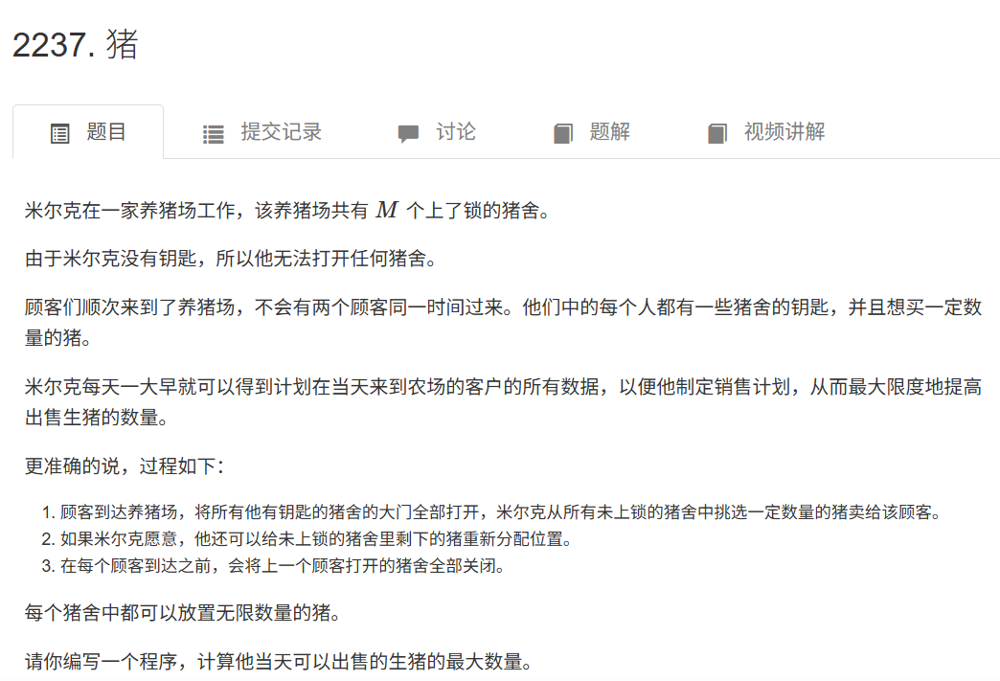

这是一个非常经典的网络流题目，题目源自 POI 2005，通常被称为“猪（Pigs）”。

#### 核心思路：最大流（Max Flow）

这道题的关键在于理解“**重新分配（Redistribute）**”这个机制。

1.  **猪的流动性**：当一个顾客打开了几个猪舍（比如猪舍 1 和 猪舍 2）的门，他在买完自己需要的猪之后，可以将这两个猪舍里剩下的猪**随意**分配到这两个猪舍中。这意味着，猪不再被限制在原本的猪舍里，而是进入了当前顾客的“控制池”。
2.  **传递性**：如果顾客 A 打开了猪舍 1，虽然他没动猪舍 2，但他离开时把猪舍 1 的猪留在那儿了。紧接着顾客 B 来了，打开了猪舍 1 和 猪舍 2。此时，顾客 B 不仅能拿到猪舍 2 原有的猪，还能拿到顾客 A 留下的、原本属于猪舍 1 的猪。更有趣的是，因为顾客 A 当时拥有对猪舍 1 内剩余猪的分配权，而在时间线上顾客 B 是紧接着能打开猪舍 1 的人，这相当于**顾客 A 可以把自己手里剩余的所有猪（来自他打开过的所有猪舍），通过猪舍 1 这个“桥梁”传给顾客 B**。

基于这个理解，我们可以建立一个网络流模型。

#### 建图模型

我们要构建一个图，计算从源点 $S$ 到汇点 $T$ 的最大流。

*   **节点（Nodes）**：
    *   **源点 $S$**：代表猪的初始来源。
    *   **汇点 $T$**：代表被卖出的猪的去向。
    *   **中间节点**：每一个**顾客**代表一个节点（按到来顺序编号 $1$ 到 $N$）。

*   **边（Edges）**：
    我们需要处理三种关系：初始猪的来源、顾客之间的传递、顾客购买的限制。

    1.  **源点 $S \to$ 顾客（初始资源）**：
        *   对于每个猪舍，只有**第一个**拥有该猪舍钥匙的顾客能直接从源头获得该猪舍初始的猪。
        *   **建边规则**：如果顾客 $i$ 是猪舍 $h$ 的**第一个**访问者，且猪舍 $h$ 初始有 $P_h$ 头猪。则建立边 $S \to i$，容量增加 $P_h$。（注意：如果一个顾客是多个猪舍的第一个访问者，容量累加）。

    2.  **顾客 $i \to$ 顾客 $j$（资源传递/重新分配）**：
        *   这是题目的核心。如果顾客 $i$ 打开了猪舍 $h$，而在他之后，顾客 $j$ 是**下一个**打开猪舍 $h$ 的人。那么顾客 $i$ 可以把自己没买完的猪留给 $j$。由于顾客 $i$ 有重新分配的权利，他实际上可以把手里任何来源的剩余猪都塞到猪舍 $h$ 里留给 $j$。
        *   **建边规则**：对于任意猪舍 $h$，设它的访问者顺序是 $c_1, c_2, c_3, \dots$。则建立边 $c_1 \to c_2$, $c_2 \to c_3$, ...。
        *   **容量**：$+\infty$（无穷大）。因为理论上 $c_1$ 可以把手里所有的剩余猪都传给 $c_2$。

    3.  **顾客 $\to$ 汇点 $T$（购买需求）**：
        *   每个顾客 $i$ 想买 $B_i$ 头猪。这限制了流出系统的量。
        *   **建边规则**：建立边 $i \to T$。
        *   **容量**：$B_i$。

#### 算法流程

1.  设立源点 $S=0$，汇点 $T=N+1$。
2.  记录每个猪舍 $h$ 当前最近一次是被谁访问的，记为 `last_visitor[h]`，初始为 0（代表源点）。
3.  按顺序遍历每一个顾客 $i$ ($1$ 到 $N$)：
    *   统计该顾客拥有的钥匙对应的所有猪舍。
    *   对于每个猪舍 $h$：
        *   如果 `last_visitor[h] == 0`：说明 $i$ 是第一个人。从 $S$ 连一条边到 $i$，容量为猪舍 $h$ 的初始猪数量。（代码实现时可以合并累加容量）。
        *   如果 `last_visitor[h] != 0`：说明前面有人（设为 $u$）。从 $u$ 连一条边到 $i$，容量为 $\infty$。
        *   更新 `last_visitor[h] = i`。
    *   从顾客 $i$ 连一条边到 $T$，容量为该顾客的需求量 $B_i$。
4.  在该图上运行最大流算法（如 Dinic 算法）。
5.  输出最大流量。

#### C++ 代码实现

```cpp
#include <iostream>
#include <vector>
#include <cstring>
#include <algorithm>
#include <queue>

using namespace std;

const int INF = 1e9;
const int N = 110; // 顾客数量上限，加上S和T
const int M = 1010; // 猪舍数量上限

// 网络流 Dinic 算法模板
struct Edge {
    int to, cap, flow, rev;
};

vector<Edge> adj[N];
int level[N];
int ptr[N];

void add_edge(int from, int to, int cap) {
    adj[from].push_back({to, cap, 0, (int)adj[to].size()});
    adj[to].push_back({from, 0, 0, (int)adj[from].size() - 1});
}

bool bfs(int s, int t) {
    memset(level, -1, sizeof(level));
    level[s] = 0;
    queue<int> q;
    q.push(s);
    while (!q.empty()) {
        int u = q.front();
        q.pop();
        for (const auto& e : adj[u]) {
            if (e.cap - e.flow > 0 && level[e.to] == -1) {
                level[e.to] = level[u] + 1;
                q.push(e.to);
            }
        }
    }
    return level[t] != -1;
}

int dfs(int u, int t, int pushed) {
    if (pushed == 0 || u == t) return pushed;
    for (int& cid = ptr[u]; cid < adj[u].size(); ++cid) {
        auto& e = adj[u][cid];
        if (level[u] + 1 != level[e.to] || e.cap - e.flow == 0) continue;
        int tr = dfs(e.to, t, min(pushed, e.cap - e.flow));
        if (tr == 0) continue;
        e.flow += tr;
        adj[e.to][e.rev].flow -= tr;
        return tr;
    }
    return 0;
}

int dinic(int s, int t) {
    int flow = 0;
    while (bfs(s, t)) {
        memset(ptr, 0, sizeof(ptr));
        while (int pushed = dfs(s, t, INF)) {
            flow += pushed;
        }
    }
    return flow;
}

int initial_pigs[M]; // 每个猪舍初始猪的数量
int last_visitor[M]; // 记录每个猪舍上一个访问的顾客ID

int main() {
    // 优化IO
    ios_base::sync_with_stdio(false);
    cin.tie(NULL);

    int m, n;
    cin >> m >> n; // m: 猪舍数, n: 顾客数

    // 读入每个猪舍初始猪的数量
    for (int i = 1; i <= m; ++i) {
        cin >> initial_pigs[i];
    }

    int S = 0, T = n + 1;

    // 处理每个顾客
    for (int i = 1; i <= n; ++i) {
        int num_keys;
        cin >> num_keys; // 钥匙数量
        
        int current_s_capacity = 0; // 用于累加从源点来的猪
        
        for (int k = 0; k < num_keys; ++k) {
            int house_id;
            cin >> house_id;
            
            // 核心建图逻辑
            if (last_visitor[house_id] == 0) {
                // 如果我是第一个打开这个猪舍的人，猪从源点 S 流向我
                current_s_capacity += initial_pigs[house_id];
            } else {
                // 如果前面有人打开过，从上一个人连一条 INF 的边到我
                // 注意：这里可能会加多条重边，Dinic算法可以处理重边，
                // 或者我们可以判断一下是否已经加过边来优化，但数据量小没必要
                add_edge(last_visitor[house_id], i, INF);
            }
            // 更新这个猪舍的最后访问者是我
            last_visitor[house_id] = i;
        }
        
        // 统一添加从源点到当前顾客的边（如果有的话）
        if (current_s_capacity > 0) {
            add_edge(S, i, current_s_capacity);
        }
        
        // 读入该顾客想买的数量
        int buy_count;
        cin >> buy_count;
        // 建立顾客到汇点的边，容量为购买限制
        add_edge(i, T, buy_count);
    }

    // 计算最大流
    cout << dinic(S, T) << endl;

    return 0;
}
```

#### 复杂度分析
*   **节点数 $V$**：顾客数 $N$ + 2 (源汇)。题目中 $N \le 100$。
*   **边数 $E$**：
    *   $S \to i$：最多 $N$ 条。
    *   $i \to T$：最多 $N$ 条。
    *   $i \to j$：取决于钥匙的总数，理论上不会超过 $N \times (\text{猪舍数})$ 或所有钥匙的总和。在竞赛数据范围内通常也是几千级别。
*   **Dinic 复杂度**：$O(V^2 E)$。对于 $N=100$ 的规模，计算量极小，完全可以在 1 秒内通过。

#### 总结
这道题不需要关心猪具体在哪个猪舍移动，只需要关心猪的**控制权**如何在顾客之间交接。
1.  **S $\to$ 顾客**：获得猪舍的**首发权**（容量 = 初始猪数）。
2.  **顾客 $\to$ 顾客**：获得猪舍的**继承权**（容量 = $\infty$）。
3.  **顾客 $\to$ T**：此时此刻的**变现能力**（容量 = 购买量）。

### 7. 分层图最大流

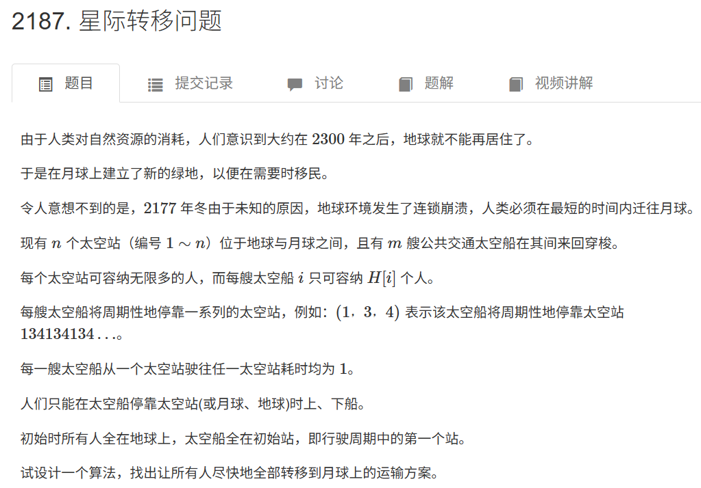

这是一个非常经典的**网络流（Network Flow）**问题，具体来说，是一道**分层图最大流（Layered Graph Max Flow）** 或者叫 **按时间拆点** 的题目。

#### 1. 核心思路分析

这道题的难点在于**时间是动态的**。
*   通常的最大流问题是在静态图上跑的。
*   但在本题中，太空船的位置随时间变化，人从一个点移动到另一个点也需要消耗时间。

为了解决这个问题，我们需要引入**“时间轴”**的概念，构建一个**分层图**。

##### 什么是分层图？

我们将图中的每一个节点，按照时间 $t$ 进行拆分。
*   也就是：$Node(i, t)$ 表示“在第 $t$ 天，位于地点 $i$ 的状态”。
*   原本的 $N$ 个点，在第 $T$ 天就会变成 $N \times T$ 个点。

##### 边的构建逻辑
在这个分层图中，流（人）有两种移动方式：
1.  **原地等待（Hold）：** 人可以选择不坐船，留在当前空间站。
    *   建边：$Node(i, t) \to Node(i, t+1)$
    *   容量：$\infty$（空间站容量无限）。
2.  **乘坐太空船（Move）：** 人乘坐某艘飞船从一站到下一站。
    *   假设飞船 $k$ 在第 $t$ 天位于站点 $u$，第 $t+1$ 天飞到站点 $v$。
    *   建边：$Node(u, t) \to Node(v, t+1)$
    *   容量：$H[k]$（飞船的载客量）。

##### 算法流程
因为我们不知道最少需要多少天才能运完 $K$ 个人，所以我们可以从小到大枚举天数 $T$（或者说动态增加层数）：
1.  **并查集判连通：** 首先判断地球和月球是否连通。如果不连通，直接输出 `0`。
2.  **构建源汇：** 建立超级源点 $S$ 和超级汇点 $T_{sink}$。
    *   $S$ 连向 $Node(Earth, 0)$，容量 $\infty$（表示初始时所有人都在地球）。
3.  **按天迭代：** 从 $day = 1, 2, 3...$ 开始循环：
    *   新建第 $day$ 层的所有节点。
    *   **添加“等待边”：** 上一层的所有地点连向这一层对应的地点，容量 $\infty$。
    *   **添加“飞船边”：** 根据飞船的周期性路线，找到它在 $day-1$ 的位置 $u$ 和 $day$ 的位置 $v$，添加边 $Node(u, day-1) \to Node(v, day)$，容量为飞船载客量。
    *   **添加“汇点边”：** 将这一层的 $Node(Moon, day)$ 连向超级汇点 $T_{sink}$，容量 $\infty$（表示到了月球就被接收了）。
    *   **跑最大流：** 在当前的图上运行最大流算法（如 Dinic）。注意，不需要每次重置图，只需在现有的残量网络上继续增广即可。
    *   **检查结果：** 累加流量，如果总流量 $\ge K$，则当前的 $day$ 就是答案。

---

#### 2. 详细步骤与数据映射

*   **地点映射：**
    *   题目给的输入：地球是 `0`，月球是 `-1`，空间站是 `1~n`。
    *   我们内部处理：地球映射为 `0`，空间站 `1~n` 保持不变，月球映射为 `n+1`。总共 `n+2` 个物理地点。
*   **节点编号：**
    *   第 $d$ 天的地点 $i$ 的节点编号可以设为：`d * (n+2) + i`。

#### 3. 代码实现 (C++)

```cpp
#include <iostream>
#include <vector>
#include <cstring>
#include <queue>
#include <algorithm>

using namespace std;

const int INF = 1e9;
const int MAX_N = 50;  // 空间站数量不多
const int MAX_T = 1000; // 预估天数上限，通常答案不会特别大
// 节点总数估算：(n+2) * MAX_T + 源汇点

// 网络流 Dinic 模板
struct Edge {
    int to, cap, flow, rev;
};

vector<vector<Edge>> adj;
vector<int> level, ptr;
int S, T_sink;

// 动态加边
void add_edge(int from, int to, int cap) {
    // 扩容 adj
    int max_node = max(from, to);
    if (max_node >= adj.size()) {
        adj.resize(max_node + 1);
        level.resize(max_node + 1);
        ptr.resize(max_node + 1);
    }
    adj[from].push_back({to, cap, 0, (int)adj[to].size()});
    adj[to].push_back({from, 0, 0, (int)adj[from].size() - 1});
}

// BFS 建立分层图（用于Dinic算法内部寻找增广路）
bool bfs() {
    fill(level.begin(), level.end(), -1);
    level[S] = 0;
    queue<int> q;
    q.push(S);
    while (!q.empty()) {
        int u = q.front();
        q.pop();
        for (auto& e : adj[u]) {
            if (e.cap - e.flow > 0 && level[e.to] == -1) {
                level[e.to] = level[u] + 1;
                q.push(e.to);
            }
        }
    }
    return level[T_sink] != -1;
}

// DFS 推流
int dfs(int u, int pushed) {
    if (pushed == 0 || u == T_sink) return pushed;
    for (int& cid = ptr[u]; cid < adj[u].size(); ++cid) {
        auto& e = adj[u][cid];
        if (level[u] + 1 != level[e.to] || e.cap - e.flow == 0) continue;
        int tr = dfs(e.to, min(pushed, e.cap - e.flow));
        if (tr == 0) continue;
        e.flow += tr;
        adj[e.to][e.rev].flow -= tr;
        return tr;
    }
    return 0;
}

int dinic() {
    int flow = 0;
    while (bfs()) {
        fill(ptr.begin(), ptr.end(), 0);
        while (int pushed = dfs(S, INF)) {
            flow += pushed;
        }
    }
    return flow;
}

// 并查集
int parent[MAX_N + 5];
int find_set(int v) {
    if (v == parent[v]) return v;
    return parent[v] = find_set(parent[v]);
}
void union_sets(int a, int b) {
    a = find_set(a);
    b = find_set(b);
    if (a != b) parent[b] = a;
}

struct Ship {
    int h; // 容量
    int r; // 停靠站数
    vector<int> stops; // 停靠序列
};

int main() {
    int n, m, k;
    if (!(cin >> n >> m >> k)) return 0;

    int earth = 0;
    int moon = n + 1;
    int total_locations = n + 2;

    // 初始化并查集
    for (int i = 0; i <= n + 1; ++i) parent[i] = i;

    vector<Ship> ships(m);
    for (int i = 0; i < m; ++i) {
        cin >> ships[i].h >> ships[i].r;
        for (int j = 0; j < ships[i].r; ++j) {
            int stop;
            cin >> stop;
            if (stop == -1) stop = moon;
            else if (stop == 0) stop = earth; // 通常输入0即为0，这里显式处理一下
            ships[i].stops.push_back(stop);
            
            // 并查集连通性维护：将该飞船路径上相邻的站点连通
            if (j > 0) union_sets(ships[i].stops[j], ships[i].stops[j-1]);
        }
        // 这是一个环，首尾也要连通
        union_sets(ships[i].stops[0], ships[i].stops[ships[i].r - 1]);
    }

    // 1. 判断连通性
    if (find_set(earth) != find_set(moon)) {
        cout << 0 << endl;
        return 0;
    }

    // 2. 初始化网络流
    S = 100000; // 超级源点 ID
    T_sink = 100001; // 超级汇点 ID
    
    // 初始化 adj 数组大小
    adj.resize(T_sink + 5);
    level.resize(T_sink + 5);
    ptr.resize(T_sink + 5);

    // 0时刻，源点连接地球
    // 节点编号规则: day * total_locations + location_id
    int start_node = 0 * total_locations + earth;
    add_edge(S, start_node, INF); // 或者 cap = k

    int total_flow = 0;
    int day = 0;

    // 3. 按天迭代
    while (true) {
        day++;
        
        // --- 构建第 day 天的图 ---
        
        // A. 每个人可以在空间站/地球/月球 原地停留 (waiting)
        // 也就是从 day-1 的地点 i 连向 day 的地点 i
        for (int i = 0; i < total_locations; ++i) {
            int u = (day - 1) * total_locations + i;
            int v = day * total_locations + i;
            add_edge(u, v, INF);
        }

        // B. 飞船移动
        for (int i = 0; i < m; ++i) {
            // 飞船 i 在 day-1 时刻的位置索引
            int idx_prev = (day - 1) % ships[i].r;
            // 飞船 i 在 day 时刻的位置索引
            int idx_curr = day % ships[i].r;

            int u_loc = ships[i].stops[idx_prev];
            int v_loc = ships[i].stops[idx_curr];

            int u_node = (day - 1) * total_locations + u_loc;
            int v_node = day * total_locations + v_loc;

            add_edge(u_node, v_node, ships[i].h);
        }

        // C. 如果这天有人到了月球，就流向超级汇点
        int moon_today = day * total_locations + moon;
        add_edge(moon_today, T_sink, INF);

        // --- 跑最大流 ---
        total_flow += dinic();

        if (total_flow >= k) {
            cout << day << endl;
            break;
        }
        
        // 防止死循环（虽然题目保证有解且我们判了连通性，但工程上最好加个上限）
        if (day > MAX_T) { 
            cout << 0 << endl; // Should not happen given constraints
            break;
        }
    }

    return 0;
}
```

#### 4. 代码细节解析

1.  **并查集 (DSU) 的作用**：
    题目中有一个坑点：如果地球和月球之间根本没有公共交通能够到达，或者中间断开了，应该输出 `0`。虽然我们可以设置一个很大的 `MAX_T` 来跳出循环，但用并查集预先判断连通性是最严谨和高效的。如果所有飞船的路线合并后，`find(0)` 不等于 `find(n+1)`，直接判死刑。

2.  **节点 ID 的计算**：
    `day * total_locations + location_id`。
    例如：$N=2$（地点有0, 1, 2, 3）。
    第0天的地球(0) ID 是 0。
    第1天的地球(0) ID 是 4。
    这样保证了每一天的每一个地点都有唯一的 ID。

3.  **飞船位置计算**：
    题目说飞船周期性停靠。例如路线 `1 -> 3 -> 4`，长度为3。
    *   $t=1$ 时，船从路线下标 `0` 走到 `1`。
    *   $t=2$ 时，船从路线下标 `1` 走到 `2`。
    *   $t=3$ 时，船从路线下标 `2` 走到 `0`。
    所以代码中使用 `(day - 1) % ships[i].r` 来确定出发点的下标，用 `day % ships[i].r` 确定到达点的下标。

4.  **增量最大流**：
    在 `while(true)` 循环中，我们每次只增加了新的一层的节点和边。之前层已经流过的流量（`flow` 属性）保留在图中。`dinic()` 函数会在现有的残量网络基础上，寻找新的增广路径。这比每次重建图重新跑要快得多。

#### 5. 复杂度分析

*   **空间复杂度**：每一天增加 $N+2$ 个点和 $M+(N+2)$ 条边。假设答案是 $T$ 天，点数约为 $T \cdot N$，边数约为 $T \cdot (N+M)$。由于 $N, M$ 很小（通常 $\le 20$），且题目答案通常不大，空间是可以接受的。
*   **时间复杂度**：Dinic 算法在分层图上的效率很高。虽然理论上最坏情况较差，但在这种单位容量（或者小容量）的网络中，表现非常优秀。随着层数增加，每次 Dinic 只需处理新增的路径，实际运行时间远低于理论上限。

### 8. 拆点复杂建图

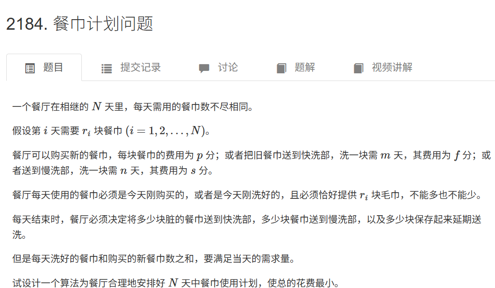

这是一个非常经典的**最小费用最大流（Minimum Cost Maximum Flow, MCMF）**问题。

#### 1. 题目分析

我们需要满足 $N$ 天的餐巾需求，目标是费用最小。这就涉及到资源的分配（餐巾）和代价（购买、快洗、慢洗）。

**为什么是网络流？**
1.  **守恒性**：餐巾不会凭空消失（虽然会买新的，但旧的会变成脏的），脏餐巾的数量等于当天用掉的餐巾数量。
2.  **需求与供给**：每天有固定的需求量，可以通过购买或清洗旧餐巾来满足。
3.  **最小费用**：在满足所有需求（即满流）的前提下，寻找费用的最小值。

#### 2. 建模思路：拆点法

这道题最核心的技巧在于**拆点**。单纯用一个点表示“第 $i$ 天”是不够的，因为第 $i$ 天既有“**早上需要干净餐巾**”的状态，又有“**晚上产生脏餐巾**”的状态。

因此，我们将第 $i$ 天拆分为两个点：
*   **$X_i$（脏餐巾节点/晚上）**：代表第 $i$ 天用完晚餐后，产生的脏餐巾资源。
*   **$Y_i$（干净餐巾节点/早上）**：代表第 $i$ 天午餐开始前，需要的干净餐巾需求。

再设立超级源点 $S$ 和超级汇点 $T$。

#### 3. 建图规则（详细连边）

我们按以下逻辑构建网络：

1.  **产生脏餐巾（供给源）**
    *   每天晚上会产生 $r_i$ 块脏餐巾，这部分资源是由“时间”赋予的（或者说由上一轮消费产生的）。
    *   **连边**：$S \to X_i$
    *   **容量**：$r_i$
    *   **费用**：0
    *   **含义**：第 $i$ 天结束时，系统里多出了 $r_i$ 块脏餐巾可供后续处理。

2.  **需要干净餐巾（需求终点）**
    *   每天早上必须要有 $r_i$ 块干净餐巾。
    *   **连边**：$Y_i \to T$
    *   **容量**：$r_i$
    *   **费用**：0
    *   **含义**：必须流经这里 $r_i$ 的流量，才能满足当天的需求。如果跑完最大流，总流量等于 $\sum r_i$，说明所有需求都满足了。

3.  **购买新餐巾**
    *   任意一天的早上，都可以直接买新的。
    *   **连边**：$S \to Y_i$
    *   **容量**：$\infty$（无限买）
    *   **费用**：$p$
    *   **含义**：花 $p$ 元直接购买一块新餐巾给第 $i$ 天早上用。

4.  **脏餐巾留到第二天（延期）**
    *   第 $i$ 天的脏餐巾如果不洗，可以留到第 $i+1$ 天再处理。
    *   **连边**：$X_i \to X_{i+1}$（注意边界 $i < N$）
    *   **容量**：$\infty$
    *   **费用**：0
    *   **含义**：免费把脏餐巾屯着。

5.  **快洗服务**
    *   第 $i$ 天的脏餐巾，洗 $m$ 天，意味着第 $i+m$ 天早上变干净。
    *   **连边**：$X_i \to Y_{i+m}$（注意边界 $i+m \le N$）
    *   **容量**：$\infty$
    *   **费用**：$f$
    *   **含义**：花 $f$ 元，把第 $i$ 天的脏餐巾变成第 $i+m$ 天的干净餐巾。

6.  **慢洗服务**
    *   第 $i$ 天的脏餐巾，洗 $n$ 天，意味着第 $i+n$ 天早上变干净。
    *   **连边**：$X_i \to Y_{i+n}$（注意边界 $i+n \le N$）
    *   **容量**：$\infty$
    *   **费用**：$s$
    *   **含义**：花 $s$ 元，把第 $i$ 天的脏餐巾变成第 $i+n$ 天的干净餐巾。

#### 4. 算法流程

1.  根据上述规则建图。节点编号建议：$S=0, T=2N+1$，第 $i$ 天早上用 $i$ 表示，第 $i$ 天晚上用 $N+i$ 表示。
2.  运行 **MCMF（最小费用最大流）算法**。通常使用 SPFA 算法寻找增广路（因为边权非负，也可以用 Dijkstra，但 SPFA 写法较简单且在本题数据规模下足够快）。
3.  输出最小费用。

---

#### 5. C++ 代码实现

```cpp
#include <iostream>
#include <vector>
#include <queue>
#include <cstring>
#include <algorithm>

using namespace std;

const long long INF = 1e18; // 使用 long long 防止费用溢出
const int MAXN = 2005;      // 节点数 2*N + 2

struct Edge {
    int to;
    int capacity;
    int flow;
    int cost;
    int rev; // 反向边在邻接表中的索引
};

vector<Edge> adj[MAXN];
long long dist[MAXN];
int parent_edge_index[MAXN];
int parent_node[MAXN];
bool in_queue[MAXN];

// 添加边
void add_edge(int u, int v, int cap, int cost) {
    adj[u].push_back({v, cap, 0, cost, (int)adj[v].size()});
    adj[v].push_back({u, 0, 0, -cost, (int)adj[u].size() - 1});
}

// SPFA 寻找单位费用最小的增广路
bool spfa(int s, int t, int &flow, long long &cost, int N_nodes) {
    for (int i = 0; i <= N_nodes; ++i) {
        dist[i] = INF;
        in_queue[i] = false;
        parent_node[i] = -1;
        parent_edge_index[i] = -1;
    }

    queue<int> q;
    q.push(s);
    dist[s] = 0;
    in_queue[s] = true;

    while (!q.empty()) {
        int u = q.front();
        q.pop();
        in_queue[u] = false;

        for (int i = 0; i < adj[u].size(); ++i) {
            Edge &e = adj[u][i];
            if (e.capacity - e.flow > 0 && dist[e.to] > dist[u] + e.cost) {
                dist[e.to] = dist[u] + e.cost;
                parent_node[e.to] = u;
                parent_edge_index[e.to] = i;
                if (!in_queue[e.to]) {
                    q.push(e.to);
                    in_queue[e.to] = true;
                }
            }
        }
    }

    if (dist[t] == INF) return false;

    // 计算这条路径上能流过的最大流量
    int push = 2e9; // 也就是 int max
    int curr = t;
    while (curr != s) {
        int prev = parent_node[curr];
        int idx = parent_edge_index[curr];
        push = min(push, adj[prev][idx].capacity - adj[prev][idx].flow);
        curr = prev;
    }

    // 更新流量和费用
    flow += push;
    cost += (long long)push * dist[t];
    curr = t;
    while (curr != s) {
        int prev = parent_node[curr];
        int idx = parent_edge_index[curr];
        adj[prev][idx].flow += push;
        int rev_idx = adj[prev][idx].rev;
        adj[curr][rev_idx].flow -= push;
        curr = prev;
    }

    return true;
}

int main() {
    // 优化输入输出效率
    ios_base::sync_with_stdio(false);
    cin.tie(NULL);

    int N;
    // 输入N
    if (!(cin >> N)) return 0;

    // 输入每天的需求
    vector<int> r(N + 1);
    for (int i = 1; i <= N; ++i) cin >> r[i];

    int p, m, f, n, s;
    // 输入：购买单价p, 快洗天数m, 快洗费用f, 慢洗天数n, 慢洗费用s
    cin >> p >> m >> f >> n >> s;

    int S = 0;
    int T = 2 * N + 1;

    // 建图
    for (int i = 1; i <= N; ++i) {
        // 1. 产生脏餐巾：源点 -> 晚上节点 Xi (编号 N+i)
        add_edge(S, N + i, r[i], 0);

        // 2. 需要干净餐巾：早上节点 Yi (编号 i) -> 汇点
        add_edge(i, T, r[i], 0);

        // 3. 购买新餐巾：源点 -> 早上节点 Yi
        add_edge(S, i, 2e9, p);

        // 4. 脏餐巾留到第二天：Xi -> X(i+1)
        if (i < N) {
            add_edge(N + i, N + i + 1, 2e9, 0);
        }

        // 5. 快洗：Xi -> Y(i+m)
        if (i + m <= N) {
            add_edge(N + i, i + m, 2e9, f);
        }

        // 6. 慢洗：Xi -> Y(i+n)
        if (i + n <= N) {
            add_edge(N + i, i + n, 2e9, s);
        }
    }

    // 运行最小费用最大流
    int flow = 0;
    long long min_cost = 0;
    while (spfa(S, T, flow, min_cost, T)) {
        // 继续增广
    }

    cout << min_cost << endl;

    return 0;
}
```

#### 6. 复杂度与总结

*   **节点数**：$V \approx 2N$。
*   **边数**：$E \approx 6N$。
*   **时间复杂度**：MCMF 算法基于 SPFA 的复杂度一般为 $k \cdot E \cdot C$，其中 $C$ 是平均增广成本。在 $N=2000$ 左右的数据规模下，运行效率非常高，完全满足竞赛时间限制。

**关键点回顾**：
1.  **拆点**是解题关键（区分“脏产生”与“净需求”）。
2.  $S \to X_i$ 表示脏餐巾的初始来源。
3.  $Y_i \to T$ 表示必须满足的干净餐巾需求。
4.  购买、快洗、慢洗、延期都是连接 $X$ 与 $Y$ 或 $S$ 与 $Y$ 的有向边。


