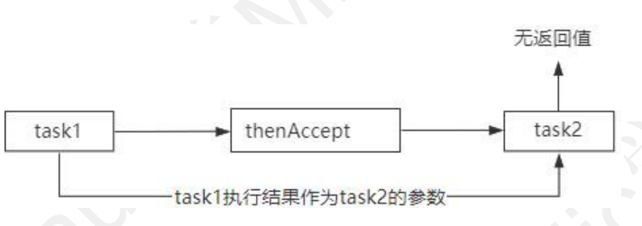
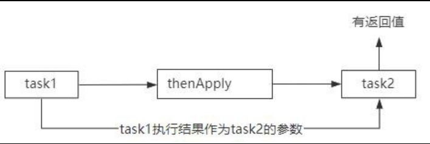
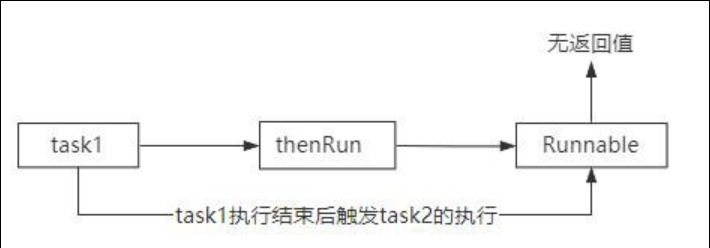

# 编程语言基础

## Java 基础

### 一、静态工厂方法

**静态工厂方法** 是一种在类中定义的静态方法，用于创建并返回该类的实例。它与构造函数类似，但有一些重要的区别和优势。

**与构造函数的区别**

- **名称：** 构造函数的名称必须与类名相同，而静态工厂方法可以有任意名称。
- **返回类型：** 构造函数没有返回类型（实际上返回的是类的实例），而静态工厂方法可以返回类的任何子类型，甚至是接口。

**静态工厂方法的优势**

1. **有名称：** 静态工厂方法可以根据其功能命名，提高代码的可读性。例如，`Integer.valueOf(10)` 比 `new Integer(10)` 更清晰地表达了创建整数对象的意图。
2. **不必每次都创建新对象：** 静态工厂方法可以缓存已经创建的实例，避免重复创建对象，提高性能。例如，`Integer.valueOf(10)` 可能会返回缓存中已经存在的整数对象。
3. **可以返回任何子类型对象：** 静态工厂方法可以根据需要返回类的任何子类型对象，甚至是在运行时动态生成的代理对象。这提供了更大的灵活性。
4. **使代码更简洁：** 在创建参数化类型实例时，静态工厂方法可以简化代码。例如，`Collections.newSetFromMap(new ConcurrentHashMap<>())` 比直接使用构造函数更简洁。

**静态工厂方法的额外用途**

- **可以有多个参数相同但名称不同的工厂方法：** 这可以根据不同的参数组合创建不同的实例。
- **可以减少对外暴露的属性：** 通过静态工厂方法，可以隐藏类的某些属性，只暴露必要的接口。

**静态工厂方法的缺点**

- **很难被发现：** 静态工厂方法不像构造函数那样容易被发现，需要查阅文档或源代码才能找到。
- **子类无法继承：** 如果类没有公有的构造函数，只有静态工厂方法，则子类无法继承该类。

```java
public class Integer {
    private final int value;

    private Integer(int value) {
        this.value = value;
    }

    public static Integer valueOf(int i) {
        if (i >= -128 && i <= 127) { // 小范围内使用缓存
            return IntegerCache.cache[i + 128];
        }
        return new Integer(i);
    }

}
```

### 二、FastJson

#### 1. FastJSON简介

FastJSON是阿里巴巴开源的Java JSON处理库，具有以下特点：

- **高性能**：序列化和反序列化速度快
- **简单易用**：API设计简洁
- **功能丰富**：支持多种数据类型和复杂对象
- **零依赖**：不依赖其他第三方库

#### 2. Maven依赖

```xml
<dependency>
    <groupId>com.alibaba.fastjson2</groupId>
    <artifactId>fastjson2</artifactId>
    <version>2.0.43</version>
</dependency>
```

#### 3. 基本使用

3.1 核心类

```java
import com.alibaba.fastjson.JSON;
import com.alibaba.fastjson.JSONObject;
import com.alibaba.fastjson.JSONArray;
```

3.2 对象序列化

```java
public class User {
    private String name;
    private int age;
    private String email;
    
    // 构造器、getter、setter省略
}

// 序列化
User user = new User("张三", 25, "zhangsan@example.com");
String json = JSON.toJSONString(user);
System.out.println(json);
// 输出：{"age":25,"email":"zhangsan@example.com","name":"张三"}
```

3.3 对象反序列化

```java
String json = "{\"name\":\"李四\",\"age\":30,\"email\":\"lisi@example.com\"}";
User user = JSON.parseObject(json, User.class);
```

3.4 集合处理

```java
// List序列化
List<User> users = Arrays.asList(user1, user2);
String jsonArray = JSON.toJSONString(users);

// List反序列化
String jsonArray = "[{\"name\":\"张三\",\"age\":25}]";
List<User> users = JSON.parseArray(jsonArray, User.class);
```

#### 4. JSONObject和JSONArray操作

4.1 JSONObject基本操作

```java
// 创建JSONObject
JSONObject jsonObject = new JSONObject();
jsonObject.put("name", "王五");
jsonObject.put("age", 28);
jsonObject.put("married", true);

// 从字符串解析
JSONObject obj = JSON.parseObject(jsonString);

// 获取值
String name = obj.getString("name");
Integer age = obj.getInteger("age");
Boolean married = obj.getBoolean("married");

// 判断是否包含key
if (obj.containsKey("email")) {
    String email = obj.getString("email");
}
```

4.2 JSONArray基本操作

```java
// 创建JSONArray
JSONArray jsonArray = new JSONArray();
jsonArray.add("苹果");
jsonArray.add("香蕉");
jsonArray.add("橘子");

// 从字符串解析
JSONArray array = JSON.parseArray(arrayString);

// 遍历
for (int i = 0; i < array.size(); i++) {
    String item = array.getString(i);
    System.out.println(item);
}

// 转换为List
List<String> list = array.toJavaList(String.class);
```

#### 5. 序列化特性控制

5.1 SerializerFeature枚举

```java
// 格式化输出
String json = JSON.toJSONString(user, SerializerFeature.PrettyFormat);

// 输出null字段
String json = JSON.toJSONString(user, SerializerFeature.WriteMapNullValue);

// 日期格式化
String json = JSON.toJSONString(user, SerializerFeature.WriteDateUseDateFormat);

// 组合多个特性
String json = JSON.toJSONString(user, 
    SerializerFeature.PrettyFormat,
    SerializerFeature.WriteMapNullValue,
    SerializerFeature.WriteDateUseDateFormat);
```

5.2 常用序列化特性

```java
public class SerializationExample {
    public static void main(String[] args) {
        User user = new User();
        
        // 不序列化null值（默认行为）
        JSON.toJSONString(user);
        
        // 序列化null值
        JSON.toJSONString(user, SerializerFeature.WriteMapNullValue);
        
        // null字符串输出为空字符串
        JSON.toJSONString(user, SerializerFeature.WriteNullStringAsEmpty);
        
        // null数组输出为[]
        JSON.toJSONString(user, SerializerFeature.WriteNullListAsEmpty);
        
        // 禁用循环引用检测
        JSON.toJSONString(user, SerializerFeature.DisableCircularReferenceDetect);
    }
}
```

#### 6. 注解使用

6.1 常用注解

```java
import com.alibaba.fastjson.annotation.*;

public class User {
    @JSONField(name = "user_name")  // 指定JSON字段名
    private String name;
    
    @JSONField(serialize = false)   // 不序列化
    private String password;
    
    @JSONField(format = "yyyy-MM-dd HH:mm:ss")  // 日期格式
    private Date createTime;
    
    @JSONField(ordinal = 1)  // 序列化顺序
    private String email;
    
    @JSONField(deserialize = false)  // 不反序列化
    private String internalField;
}
```

6.2 类级别注解

```java
@JSONType(orders = {"name", "age", "email"})  // 指定字段顺序
@JSONType(ignores = {"password", "internalId"})  // 忽略字段
public class User {
    // 字段定义
}
```

#### 7. 自定义序列化和反序列化

7.1 自定义序列化器

```java
public class CustomDateSerializer implements ObjectSerializer {
    @Override
    public void write(JSONSerializer serializer, Object object, 
                     Object fieldName, Type fieldType, int features) {
        Date date = (Date) object;
        SimpleDateFormat format = new SimpleDateFormat("yyyy年MM月dd日");
        serializer.write(format.format(date));
    }
}

// 使用
@JSONField(serializeUsing = CustomDateSerializer.class)
private Date birthDate;
```

7.2 自定义反序列化器

```java
public class CustomDateDeserializer implements ObjectDeserializer {
    @Override
    public Date deserialze(DefaultJSONParser parser, Type type, Object fieldName) {
        String dateStr = parser.parseObject(String.class);
        try {
            SimpleDateFormat format = new SimpleDateFormat("yyyy年MM月dd日");
            return format.parse(dateStr);
        } catch (ParseException e) {
            throw new RuntimeException(e);
        }
    }
    
    @Override
    public int getFastMatchToken() {
        return JSONToken.LITERAL_STRING;
    }
}

// 使用
@JSONField(deserializeUsing = CustomDateDeserializer.class)
private Date registerDate;
```

#### 8. 高级功能

8.1 泛型处理

```java
// 使用TypeReference处理泛型
String json = "[{\"name\":\"张三\"},{\"name\":\"李四\"}]";
List<User> users = JSON.parseObject(json, new TypeReference<List<User>>() {});

// Map类型
String mapJson = "{\"user1\":{\"name\":\"张三\"},\"user2\":{\"name\":\"李四\"}}";
Map<String, User> userMap = JSON.parseObject(mapJson, 
    new TypeReference<Map<String, User>>() {});
```

8.2 动态字段访问

```java
JSONObject jsonObject = JSON.parseObject(jsonString);

// 动态获取值
Object value = jsonObject.get("dynamicField");

// 类型安全的获取
String stringValue = jsonObject.getString("stringField");
Integer intValue = jsonObject.getInteger("intField");
Date dateValue = jsonObject.getDate("dateField");

// 嵌套对象访问
JSONObject nested = jsonObject.getJSONObject("nestedObject");
String nestedValue = nested.getString("nestedField");
```

### 三、泛型擦除

#### 1. Java泛型擦除问题

1.1 泛型擦除

```java
// 编译时：List<User> users
// 运行时：List users (泛型信息被擦除)

// 这意味着无法在运行时获取泛型的具体类型
List<User> users = new ArrayList<>();
System.out.println(users.getClass()); // 输出：class java.util.ArrayList
// 无法知道这是 ArrayList<User> 还是 ArrayList<String>
```

1.2 问题演示

```java
// ❌ 这样做会有问题
public static <T> List<T> parseList(String json, Class<T> clazz) {
    // 无法直接获取 List<T> 的类型信息
    // 因为泛型被擦除了
    return JSON.parseObject(json, List.class); // 类型不安全！
}
```

#### 2. TypeReference解决方案

2.1 TypeReference工作原理

```java
// TypeReference是一个抽象类，通过匿名内部类的方式保留泛型信息
public abstract class TypeReference<T> {
    private final Type type;
    
    protected TypeReference() {
        // 通过反射获取父类的泛型参数
        Type superClass = getClass().getGenericSuperclass();
        this.type = ((ParameterizedType) superClass).getActualTypeArguments()[0];
    }
    
    public Type getType() {
        return type;
    }
}

// 使用匿名内部类创建子类，保留泛型信息
TypeReference<List<User>> typeRef = new TypeReference<List<User>>() {};
```

2.2 为什么需要 {} 空的大括号？

```java
// ✅ 正确：创建匿名内部类
new TypeReference<List<User>>() {}

// ❌ 错误：TypeReference是抽象类，不能直接实例化
new TypeReference<List<User>>()
```

#### 3. 实际使用对比

3.1 单个对象解析

```java
// JSON数据
String userJson = "{\"name\":\"张三\",\"age\":25}";

// ✅ 使用Class
User user = JSON.parseObject(userJson, User.class);

// ❌ 不需要TypeReference（过度设计）
User user2 = JSON.parseObject(userJson, new TypeReference<User>() {});
```

3.2 集合对象解析

```java
// JSON数组数据
String usersJson = "[{\"name\":\"张三\",\"age\":25},{\"name\":\"李四\",\"age\":30}]";

// ✅ 使用TypeReference（推荐）
List<User> users = JSON.parseObject(usersJson, new TypeReference<List<User>>() {});

// ✅ 或者使用parseArray（FastJSON特有的简化方法）
List<User> users2 = JSON.parseArray(usersJson, User.class);

// ❌ 使用List.class会丢失泛型信息
List users3 = JSON.parseObject(usersJson, List.class); // 返回List<JSONObject>
```

3.3 复杂嵌套类型

```java
// 复杂的嵌套泛型类型
String complexJson = "{\"users\":[{\"name\":\"张三\"}],\"total\":100}";

// ✅ 必须使用TypeReference
Map<String, Object> result = JSON.parseObject(complexJson, 
    new TypeReference<Map<String, Object>>() {});

// 更复杂的例子
String nestedJson = "{\"data\":[{\"name\":\"张三\"}],\"meta\":{\"total\":1}}";
Result<List<User>> result2 = JSON.parseObject(nestedJson, 
    new TypeReference<Result<List<User>>>() {});
```

### 四、map

#### 1. 基本概念

ConcurrentHashMap是Java并发包`java.util.concurrent`中的线程安全哈希表实现，它在保证线程安全的同时提供了比`Hashtable`更好的并发性能。

1.1 核心特点

- **线程安全**：多线程环境下安全使用
- **高并发性能**：支持高度并发的读写操作
- **非阻塞读取**：读操作通常不需要加锁
- **分段锁定**：写操作只锁定部分数据，而非整个表
- **弱一致性**：迭代器具有弱一致性，不会抛出ConcurrentModificationException

#### 2. 与其他Map实现对比

2.1 对比表格

| 特性           | HashMap   | Hashtable | ConcurrentHashMap |
| -------------- | --------- | --------- | ----------------- |
| **线程安全**   | ❌ 否      | ✅ 是      | ✅ 是              |
| **并发性能**   | N/A       | ❌ 低      | ✅ 高              |
| **null值支持** | ✅ 支持    | ❌ 不支持  | ❌ 不支持          |
| **锁机制**     | 无        | 整表锁    | 分段锁/CAS        |
| **迭代器**     | fail-fast | fail-fast | 弱一致性          |
| **性能**       | 最高      | 低        | 高                |

2.2 详细对比

```java
// HashMap - 非线程安全
Map<String, String> hashMap = new HashMap<>();
// 多线程环境下可能导致数据不一致或死循环

// Hashtable - 线程安全但性能差
Map<String, String> hashtable = new Hashtable<>();
// 每个方法都使用synchronized，并发性能差

// ConcurrentHashMap - 线程安全且高性能
Map<String, String> concurrentMap = new ConcurrentHashMap<>();
// 分段锁定，读操作几乎无锁，写操作局部锁定
```

#### 3. 内部实现原理

3.1 Java 7 实现：分段锁（Segment）

```java
// Java 7的分段锁结构
public class ConcurrentHashMap<K,V> {
    // 默认分段数量
    static final int DEFAULT_CONCURRENCY_LEVEL = 16;
    
    // 分段数组
    final Segment<K,V>[] segments;
    
    // 每个Segment继承ReentrantLock
    static final class Segment<K,V> extends ReentrantLock {
        transient volatile HashEntry<K,V>[] table; // 哈希表
        transient int count;                        // 元素数量
        transient int modCount;                     // 修改次数
    }
}
```

**分段锁原理：**

```
ConcurrentHashMap
├── Segment[0] (锁1) → HashEntry链表
├── Segment[1] (锁2) → HashEntry链表  
├── Segment[2] (锁3) → HashEntry链表
└── ...
```

**优势：**

- 不同segment可以并发访问
- 最大并发度 = segment数量
- 读操作通常不需要加锁

3.2 Java 8+ 实现：CAS + synchronized

```java
// Java 8+的实现结构
public class ConcurrentHashMap<K,V> {
    // 哈希表数组
    transient volatile Node<K,V>[] table;
    
    // 节点定义
    static class Node<K,V> implements Map.Entry<K,V> {
        final int hash;
        final K key;
        volatile V val;           // volatile保证可见性
        volatile Node<K,V> next;  // volatile保证链表操作的可见性
    }
    
    // 红黑树节点
    static final class TreeNode<K,V> extends Node<K,V> {
        TreeNode<K,V> parent;
        TreeNode<K,V> left;
        TreeNode<K,V> right;
        // ...
    }
}
```

**Java 8+的主要改进：**

1. **取消Segment分段锁**
2. **使用CAS + synchronized**
3. **链表转红黑树**：链表长度≥8时转为红黑树
4. **更细粒度的锁定**：只锁定链表头节点或红黑树根节点

### 五、OKHttpClient

#### 1. OkHttpClient 主客户端

设置连接时间，读取时间，写入时间

```java
// 基本创建方式
OkHttpClient client = new OkHttpClient();

// 自定义配置
OkHttpClient client = new OkHttpClient.Builder()
    .connectTimeout(10, TimeUnit.SECONDS)
    .writeTimeout(10, TimeUnit.SECONDS)
    .readTimeout(30, TimeUnit.SECONDS)
    .build();
```

#### 2. Request 请求对象

```java
// GET请求
Request request = new Request.Builder()
    .url("https://api.example.com/users")
    .build();

// POST请求
RequestBody body = RequestBody.create(
    MediaType.parse("application/json"), 
    "{\"name\":\"John\"}"
);
Request request = new Request.Builder()
    .url("https://api.example.com/users")
    .post(body)
    .build();

// 添加请求头
Request request = new Request.Builder()
    .url("https://api.example.com/users")
    .addHeader("Authorization", "Bearer token")
    .addHeader("Content-Type", "application/json")
    .build();
```

#### 3. Call 调用对象

```java
// 同步调用
Call call = client.newCall(request);
try {
    Response response = call.execute();
    String result = response.body().string();
} catch (IOException e) {
    e.printStackTrace();
}

// 异步调用
Call call = client.newCall(request);
call.enqueue(new Callback() {
    @Override
    public void onFailure(Call call, IOException e) {
        // 请求失败处理
    }
    
    @Override
    public void onResponse(Call call, Response response) throws IOException {
        if (response.isSuccessful()) {
            String result = response.body().string();
            // 处理响应数据
        }
    }
});
```

#### 4. Response 响应对象

```java
Response response = call.execute();

// 响应码
int code = response.code();

// 响应头
Headers headers = response.headers();
String contentType = response.header("Content-Type");

// 响应体
ResponseBody body = response.body();
String content = body.string();
byte[] bytes = body.bytes();
// 转化为字节流适合处理大文件
InputStream stream = body.byteStream();
```

### 六、BufferReader

#### 1. 定义

BufferedReader是Java I/O体系中的一个重要类，提供带缓冲区的字符输入流读取功能。

#### 2. 主要特点

带有内部缓冲区，减少实际的I/O操作次数；提供按行读取功能；提高字符流读取性能；线程安全（通过同步实现）

#### 3. 核心方法

构造方法

```java
// 从文件创建
FileReader fileReader = new FileReader("example.txt");
BufferedReader bufferedReader = new BufferedReader(fileReader);

// 从字符串创建
StringReader stringReader = new StringReader("Hello World");
BufferedReader bufferedReader = new BufferedReader(stringReader);

// 从InputStream转换
InputStream inputStream = new FileInputStream("example.txt");
InputStreamReader inputStreamReader = new InputStreamReader(inputStream);
BufferedReader bufferedReader = new BufferedReader(inputStreamReader);
```

`readLine()` 方法

```java
public String readLine() throws IOException

// 示例：逐行读取文件
BufferedReader reader = new BufferedReader(new FileReader("file.txt"));
String line;
while ((line = reader.readLine()) != null) {
    System.out.println(line);
}
reader.close();
```

### 七、SSE连接

#### 1. SSE基本概念

**定义** SSE是一种基于HTTP的单向通信协议，允许服务器向客户端持续推送数据流，常用于实时通知、聊天应用、实时数据更新等场景。

**特点**

- 基于HTTP协议，简单易用
- 单向通信（服务器→客户端）
- 自动重连机制
- 支持事件类型和ID
- 文本格式，易于调试

#### 2. SSE消息格式

##### 2.1 基本格式规范

SSE消息格式非常简单，每个字段占一行：

```
field: value\n
```

**核心字段**

- `data`: 消息数据内容
- `event`: 事件类型名称
- `id`: 消息唯一标识符
- `retry`: 重连间隔时间（毫秒）

##### 2.2 完整消息示例

http

```http
data: Hello World
event: message
id: 1
retry: 3000
```

**重要规则**

- 每个字段独占一行
- 字段名和值之间用冒号和空格分隔
- 消息之间用空行分隔
- 以两个换行符（\n\n）结束每条消息

#### 3. 详细格式说明

##### 3.1 data字段

```http
data: 这是一条简单消息

data: {"name": "John", "age": 30}

data: 第一行
data: 第二行
data: 第三行
```

**多行数据示例**

```http
data: {
data:   "username": "alice",
data:   "message": "Hello everyone!",
data:   "timestamp": "2024-01-15T10:30:00Z"
data: }
```

##### 3.2 event字段

```http
event: userJoined
data: {"username": "alice"}

event: messageReceived
data: {"from": "bob", "text": "Hello!"}

event: systemNotification
data: Server maintenance in 5 minutes
```

##### 3.3 id字段

```http
id: msg-001
data: First message

id: msg-002
data: Second message

id: msg-003
event: userLeft
data: {"username": "charlie"}
```

##### 3.4 retry字段

```http
retry: 5000
data: Connection will retry every 5 seconds if lost

event: heartbeat
data: ping
retry: 1000
```

### 八、CompletableFuture

CompletableFuture 是 JDK1.8 里面引入的一个基于事件驱动的异步回调类。
简单来说，就是当使用异步线程去执行一个任务的时候，我们希望在任务结束以后触发一个后续的动作。
  而 CompletableFuture 就可以实现这个功能。
  举个简单的例子，比如在一个批量支付的业务逻辑里面，涉及到查询订单、支付、发送邮件通知这三个逻辑。
  这三个逻辑是按照顺序同步去实现的，也就是先查询到订单以后，再针对这个订单发起支付，支付成功以后再发送邮件通知。
  而这种设计方式导致这个方法的执行性能比较慢。


  所以，这里可以直接使用 CompletableFuture，也就是说把查询订单的逻辑放在一个异步线程池里面去处理。
  然后基于 CompletableFuture 的事件回调机制的特性，可以配置查询订单结束后自动触发支付，支付结束后自动触发邮件通知。
  从而极大的提升这个这个业务场景的处理性能！

```java
CompletableFuture<String> future = new CompletableFuture<>();

// 正常完成
future.complete("成功结果");

// 异常完成
future.completeExceptionally(new RuntimeException("出错了"));

```


  CompletableFuture 提供了 5 种不同的方式，把多个异步任务组成一个具有先后关系的处理链，然后基于事件驱动任务链的执行。

  第一种，thenCombine，把两个任务组合在一起，当两个任务都执行结束以后触发事件回调。

```java
CompletableFuture<String> name = CompletableFuture.supplyAsync(() -> "张三");
CompletableFuture<Integer> age = CompletableFuture.supplyAsync(() -> 25);

CompletableFuture<String> combined = name.thenCombine(age, 
    (n, a) -> String.format("姓名: %s, 年龄: %d", n, a));
```


  第二种，thenCompose，把两个任务组合在一起，这两个任务串行执行，也就是第一个任务执行完以后自动触发执行第二个任务。

```java
CompletableFuture<String> userFuture = CompletableFuture.supplyAsync(() -> "user123");
CompletableFuture<String> result = userFuture
    .thenCompose(userId -> getUserDetails(userId))
    .thenCompose(userDetails -> processUserData(userDetails));
```


  第三种，thenAccept，第一个任务执行结束后触发第二个任务，并且第一个任务的执行结果作为第二个任务的参数，这个方法是纯粹接受上一个任务的结果，不返回新的计算值。

```java
CompletableFuture.supplyAsync(() -> "数据")
  .thenAccept(data -> {
      System.out.println("处理数据: " + data);
  })
  .thenRun(() -> {
      System.out.println("清理工作");
  });
```



  第四种，thenApply，和 thenAccept 一样，但是它有返回值。

```java
CompletableFuture<Integer> future = CompletableFuture.supplyAsync(() -> 10)
    .thenApply(x -> x * 2)        // 同步转换：20
    .thenApplyAsync(x -> x + 5);  // 异步转换：25

// 等价于链式调用
CompletableFuture<String> result = CompletableFuture.supplyAsync(() -> "Hello")
    .thenApply(s -> s + " World")
    .thenApply(String::toUpperCase); // "HELLO WORLD"
```



  第五种，thenRun，就是第一个任务执行完成后触发执行一个实现了 Runnable接口的任务。



### 九、StringBuilder和StringBuffer

在 Java 中字符串属于对象，Java 提供了 String 类来创建和操作字符串。String 类是不可变类，即一旦一个 String 对象被创建以后，包含在这个对象中的字符序列是不可改变的，直至这个对象被销毁。
　　Java 提供了两个可变字符串类 StringBuffer 和 StringBuilder，中文翻译为“字符串缓冲区”。　　

　　StringBuilder 类是 JDK 1.5 新增的类，它也代表可变字符串对象。实际上，StringBuilder 和 StringBuffer 功能基本相似，方法也差不多。不同的是，StringBuffer 是线程安全的，而 StringBuilder 则没有实现线程安全功能，所以性能略高。因此在通常情况下，如果需要创建一个内容可变的字符串对象，则应该优先考虑使用 StringBuilder 类。　　

　　StringBuffer、StringBuilder、String 中都实现了 CharSequence 接口。CharSequence 是一个定义字符串操作的接口，它只包括 length()、charAt(int index)、subSequence(int start, int end) 这几个 API。

　　StringBuffer、StringBuilder、String 对 CharSequence 接口的实现过程不一样，如下图所示：


## Python基础

### 一、协程与异步

**协程**（Coroutine）是 Python 中的一种并发编程机制，它允许你在一个线程中执行多个任务，而不会阻塞其他任务的执行。简单来说，协程可以在执行过程中挂起，等待某些操作完成后再恢复执行，从而提高程序的效率，尤其是在 I/O 密集型任务中。

**协程的特点：**

1. **异步执行**：
   - 协程允许你在执行过程中暂停（即“挂起”），然后在某些条件满足时恢复执行。它是通过 **`await`** 关键字来实现的，这使得程序可以在等待某些操作（如网络请求、文件读写等）时，继续执行其他任务。
2. **非阻塞**：
   - 与传统的多线程或多进程不同，协程是在单线程中实现并发的。它通过在单个线程中切换任务来避免了线程切换的开销。虽然协程可以让程序并发执行，但它并不会像线程那样使用多个 CPU 核心。
3. **高效**：
   - 协程特别适用于 I/O 密集型任务（比如网络请求、文件操作等），因为这些操作通常会等待外部资源的响应。协程在等待过程中不会阻塞程序的其他部分，因此能够在等待时执行其他任务。

**协程的实现：**

Python 中的协程通常是通过 `async` 和 `await` 关键字实现的：

1. **定义协程函数**：
    使用 `async def` 来定义协程函数。例如：

   ```python
   async def my_coroutine():
       print("Start of coroutine")
       await some_async_function()
       print("End of coroutine")
   ```

2. **执行协程**：
    协程函数返回一个协程对象，但不会立即执行。你需要通过 `await` 来等待协程的执行，或者使用事件循环来启动它。

   ```python
   import asyncio
   
   async def some_async_function():
       print("Waiting for something...")
       await asyncio.sleep(2)  # 模拟一个 I/O 操作，等待 2 秒
       print("Done waiting!")
   
   async def main():
       await some_async_function()
   
   # 运行协程
   asyncio.run(main())
   ```

**协程的工作原理：**

- 当 Python 执行 `await` 表达式时，当前协程会暂停执行，并把控制权交给事件循环。事件循环负责管理多个协程的执行。直到协程等待的任务完成后，它才会恢复执行。
- 这使得 Python 能够在单线程中有效地执行多个任务，而不需要显式地使用线程或进程。


