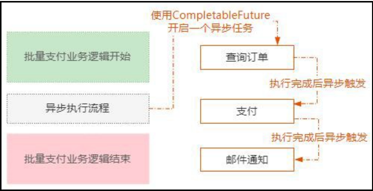

# 编程语言与部署

## Java 

### 一、静态工厂方法

**静态工厂方法** 是一种在类中定义的静态方法，用于创建并返回该类的实例。它与构造函数类似，但有一些重要的区别和优势。

**与构造函数的区别**

- **名称：** 构造函数的名称必须与类名相同，而静态工厂方法可以有任意名称。
- **返回类型：** 构造函数没有返回类型（实际上返回的是类的实例），而静态工厂方法可以返回类的任何子类型，甚至是接口。

**静态工厂方法的优势**

1. **有名称：** 静态工厂方法可以根据其功能命名，提高代码的可读性。例如，`Integer.valueOf(10)` 比 `new Integer(10)` 更清晰地表达了创建整数对象的意图。
2. **不必每次都创建新对象：** 静态工厂方法可以缓存已经创建的实例，避免重复创建对象，提高性能。例如，`Integer.valueOf(10)` 可能会返回缓存中已经存在的整数对象。
3. **可以返回任何子类型对象：** 静态工厂方法可以根据需要返回类的任何子类型对象，甚至是在运行时动态生成的代理对象。这提供了更大的灵活性。
4. **使代码更简洁：** 在创建参数化类型实例时，静态工厂方法可以简化代码。例如，`Collections.newSetFromMap(new ConcurrentHashMap<>())` 比直接使用构造函数更简洁。

**静态工厂方法的额外用途**

- **可以有多个参数相同但名称不同的工厂方法：** 这可以根据不同的参数组合创建不同的实例。
- **可以减少对外暴露的属性：** 通过静态工厂方法，可以隐藏类的某些属性，只暴露必要的接口。

**静态工厂方法的缺点**

- **很难被发现：** 静态工厂方法不像构造函数那样容易被发现，需要查阅文档或源代码才能找到。
- **子类无法继承：** 如果类没有公有的构造函数，只有静态工厂方法，则子类无法继承该类。

```java
public class Integer {
    private final int value;

    private Integer(int value) {
        this.value = value;
    }

    public static Integer valueOf(int i) {
        if (i >= -128 && i <= 127) { // 小范围内使用缓存
            return IntegerCache.cache[i + 128];
        }
        return new Integer(i);
    }

}
```

### 二、FastJson

#### 1. FastJSON简介

FastJSON是阿里巴巴开源的Java JSON处理库，具有以下特点：

- **高性能**：序列化和反序列化速度快
- **简单易用**：API设计简洁
- **功能丰富**：支持多种数据类型和复杂对象
- **零依赖**：不依赖其他第三方库

#### 2. Maven依赖

```xml
<dependency>
    <groupId>com.alibaba.fastjson2</groupId>
    <artifactId>fastjson2</artifactId>
    <version>2.0.43</version>
</dependency>
```

#### 3. 基本使用

3.1 核心类

```java
import com.alibaba.fastjson.JSON;
import com.alibaba.fastjson.JSONObject;
import com.alibaba.fastjson.JSONArray;
```

3.2 对象序列化

```java
public class User {
    private String name;
    private int age;
    private String email;
    
    // 构造器、getter、setter省略
}

// 序列化
User user = new User("张三", 25, "zhangsan@example.com");
String json = JSON.toJSONString(user);
System.out.println(json);
// 输出：{"age":25,"email":"zhangsan@example.com","name":"张三"}
```

3.3 对象反序列化

```java
String json = "{\"name\":\"李四\",\"age\":30,\"email\":\"lisi@example.com\"}";
User user = JSON.parseObject(json, User.class);
```

3.4 集合处理

```java
// List序列化
List<User> users = Arrays.asList(user1, user2);
String jsonArray = JSON.toJSONString(users);

// List反序列化
String jsonArray = "[{\"name\":\"张三\",\"age\":25}]";
List<User> users = JSON.parseArray(jsonArray, User.class);
```

#### 4. JSONObject和JSONArray操作

4.1 JSONObject基本操作

```java
// 创建JSONObject
JSONObject jsonObject = new JSONObject();
jsonObject.put("name", "王五");
jsonObject.put("age", 28);
jsonObject.put("married", true);

// 从字符串解析
JSONObject obj = JSON.parseObject(jsonString);

// 获取值
String name = obj.getString("name");
Integer age = obj.getInteger("age");
Boolean married = obj.getBoolean("married");

// 判断是否包含key
if (obj.containsKey("email")) {
    String email = obj.getString("email");
}
```

4.2 JSONArray基本操作

```java
// 创建JSONArray
JSONArray jsonArray = new JSONArray();
jsonArray.add("苹果");
jsonArray.add("香蕉");
jsonArray.add("橘子");

// 从字符串解析
JSONArray array = JSON.parseArray(arrayString);

// 遍历
for (int i = 0; i < array.size(); i++) {
    String item = array.getString(i);
    System.out.println(item);
}

// 转换为List
List<String> list = array.toJavaList(String.class);
```

#### 5. 序列化特性控制

5.1 SerializerFeature枚举

```java
// 格式化输出
String json = JSON.toJSONString(user, SerializerFeature.PrettyFormat);

// 输出null字段
String json = JSON.toJSONString(user, SerializerFeature.WriteMapNullValue);

// 日期格式化
String json = JSON.toJSONString(user, SerializerFeature.WriteDateUseDateFormat);

// 组合多个特性
String json = JSON.toJSONString(user, 
    SerializerFeature.PrettyFormat,
    SerializerFeature.WriteMapNullValue,
    SerializerFeature.WriteDateUseDateFormat);
```

5.2 常用序列化特性

```java
public class SerializationExample {
    public static void main(String[] args) {
        User user = new User();
        
        // 不序列化null值（默认行为）
        JSON.toJSONString(user);
        
        // 序列化null值
        JSON.toJSONString(user, SerializerFeature.WriteMapNullValue);
        
        // null字符串输出为空字符串
        JSON.toJSONString(user, SerializerFeature.WriteNullStringAsEmpty);
        
        // null数组输出为[]
        JSON.toJSONString(user, SerializerFeature.WriteNullListAsEmpty);
        
        // 禁用循环引用检测
        JSON.toJSONString(user, SerializerFeature.DisableCircularReferenceDetect);
    }
}
```

#### 6. 注解使用

6.1 常用注解

```java
import com.alibaba.fastjson.annotation.*;

public class User {
    @JSONField(name = "user_name")  // 指定JSON字段名
    private String name;
    
    @JSONField(serialize = false)   // 不序列化
    private String password;
    
    @JSONField(format = "yyyy-MM-dd HH:mm:ss")  // 日期格式
    private Date createTime;
    
    @JSONField(ordinal = 1)  // 序列化顺序
    private String email;
    
    @JSONField(deserialize = false)  // 不反序列化
    private String internalField;
}
```

6.2 类级别注解

```java
@JSONType(orders = {"name", "age", "email"})  // 指定字段顺序
@JSONType(ignores = {"password", "internalId"})  // 忽略字段
public class User {
    // 字段定义
}
```

#### 7. 自定义序列化和反序列化

7.1 自定义序列化器

```java
public class CustomDateSerializer implements ObjectSerializer {
    @Override
    public void write(JSONSerializer serializer, Object object, 
                     Object fieldName, Type fieldType, int features) {
        Date date = (Date) object;
        SimpleDateFormat format = new SimpleDateFormat("yyyy年MM月dd日");
        serializer.write(format.format(date));
    }
}

// 使用
@JSONField(serializeUsing = CustomDateSerializer.class)
private Date birthDate;
```

7.2 自定义反序列化器

```java
public class CustomDateDeserializer implements ObjectDeserializer {
    @Override
    public Date deserialze(DefaultJSONParser parser, Type type, Object fieldName) {
        String dateStr = parser.parseObject(String.class);
        try {
            SimpleDateFormat format = new SimpleDateFormat("yyyy年MM月dd日");
            return format.parse(dateStr);
        } catch (ParseException e) {
            throw new RuntimeException(e);
        }
    }
    
    @Override
    public int getFastMatchToken() {
        return JSONToken.LITERAL_STRING;
    }
}

// 使用
@JSONField(deserializeUsing = CustomDateDeserializer.class)
private Date registerDate;
```

#### 8. 高级功能

8.1 泛型处理

```java
// 使用TypeReference处理泛型
String json = "[{\"name\":\"张三\"},{\"name\":\"李四\"}]";
List<User> users = JSON.parseObject(json, new TypeReference<List<User>>() {});

// Map类型
String mapJson = "{\"user1\":{\"name\":\"张三\"},\"user2\":{\"name\":\"李四\"}}";
Map<String, User> userMap = JSON.parseObject(mapJson, 
    new TypeReference<Map<String, User>>() {});
```

8.2 动态字段访问

```java
JSONObject jsonObject = JSON.parseObject(jsonString);

// 动态获取值
Object value = jsonObject.get("dynamicField");

// 类型安全的获取
String stringValue = jsonObject.getString("stringField");
Integer intValue = jsonObject.getInteger("intField");
Date dateValue = jsonObject.getDate("dateField");

// 嵌套对象访问
JSONObject nested = jsonObject.getJSONObject("nestedObject");
String nestedValue = nested.getString("nestedField");
```

### 三、泛型擦除

#### 1. Java泛型擦除问题

1.1 泛型擦除

```java
// 编译时：List<User> users
// 运行时：List users (泛型信息被擦除)

// 这意味着无法在运行时获取泛型的具体类型
List<User> users = new ArrayList<>();
System.out.println(users.getClass()); // 输出：class java.util.ArrayList
// 无法知道这是 ArrayList<User> 还是 ArrayList<String>
```

1.2 问题演示

```java
// ❌ 这样做会有问题
public static <T> List<T> parseList(String json, Class<T> clazz) {
    // 无法直接获取 List<T> 的类型信息
    // 因为泛型被擦除了
    return JSON.parseObject(json, List.class); // 类型不安全！
}
```

#### 2. TypeReference解决方案

2.1 TypeReference工作原理

```java
// TypeReference是一个抽象类，通过匿名内部类的方式保留泛型信息
public abstract class TypeReference<T> {
    private final Type type;
    
    protected TypeReference() {
        // 通过反射获取父类的泛型参数
        Type superClass = getClass().getGenericSuperclass();
        this.type = ((ParameterizedType) superClass).getActualTypeArguments()[0];
    }
    
    public Type getType() {
        return type;
    }
}

// 使用匿名内部类创建子类，保留泛型信息
TypeReference<List<User>> typeRef = new TypeReference<List<User>>() {};
```

2.2 为什么需要 {} 空的大括号？

```java
// ✅ 正确：创建匿名内部类
new TypeReference<List<User>>() {}

// ❌ 错误：TypeReference是抽象类，不能直接实例化
new TypeReference<List<User>>()
```

#### 3. 实际使用对比

3.1 单个对象解析

```java
// JSON数据
String userJson = "{\"name\":\"张三\",\"age\":25}";

// ✅ 使用Class
User user = JSON.parseObject(userJson, User.class);

// ❌ 不需要TypeReference（过度设计）
User user2 = JSON.parseObject(userJson, new TypeReference<User>() {});
```

3.2 集合对象解析

```java
// JSON数组数据
String usersJson = "[{\"name\":\"张三\",\"age\":25},{\"name\":\"李四\",\"age\":30}]";

// ✅ 使用TypeReference（推荐）
List<User> users = JSON.parseObject(usersJson, new TypeReference<List<User>>() {});

// ✅ 或者使用parseArray（FastJSON特有的简化方法）
List<User> users2 = JSON.parseArray(usersJson, User.class);

// ❌ 使用List.class会丢失泛型信息
List users3 = JSON.parseObject(usersJson, List.class); // 返回List<JSONObject>
```

3.3 复杂嵌套类型

```java
// 复杂的嵌套泛型类型
String complexJson = "{\"users\":[{\"name\":\"张三\"}],\"total\":100}";

// ✅ 必须使用TypeReference
Map<String, Object> result = JSON.parseObject(complexJson, 
    new TypeReference<Map<String, Object>>() {});

// 更复杂的例子
String nestedJson = "{\"data\":[{\"name\":\"张三\"}],\"meta\":{\"total\":1}}";
Result<List<User>> result2 = JSON.parseObject(nestedJson, 
    new TypeReference<Result<List<User>>>() {});
```

### 四、map

#### 1. 基本概念

ConcurrentHashMap是Java并发包`java.util.concurrent`中的线程安全哈希表实现，它在保证线程安全的同时提供了比`Hashtable`更好的并发性能。

1.1 核心特点

- **线程安全**：多线程环境下安全使用
- **高并发性能**：支持高度并发的读写操作
- **非阻塞读取**：读操作通常不需要加锁
- **分段锁定**：写操作只锁定部分数据，而非整个表
- **弱一致性**：迭代器具有弱一致性，不会抛出ConcurrentModificationException

#### 2. 与其他Map实现对比

2.1 对比表格

| 特性           | HashMap   | Hashtable | ConcurrentHashMap |
| -------------- | --------- | --------- | ----------------- |
| **线程安全**   | ❌ 否      | ✅ 是      | ✅ 是              |
| **并发性能**   | N/A       | ❌ 低      | ✅ 高              |
| **null值支持** | ✅ 支持    | ❌ 不支持  | ❌ 不支持          |
| **锁机制**     | 无        | 整表锁    | 分段锁/CAS        |
| **迭代器**     | fail-fast | fail-fast | 弱一致性          |
| **性能**       | 最高      | 低        | 高                |

2.2 详细对比

```java
// HashMap - 非线程安全
Map<String, String> hashMap = new HashMap<>();
// 多线程环境下可能导致数据不一致或死循环

// Hashtable - 线程安全但性能差
Map<String, String> hashtable = new Hashtable<>();
// 每个方法都使用synchronized，并发性能差

// ConcurrentHashMap - 线程安全且高性能
Map<String, String> concurrentMap = new ConcurrentHashMap<>();
// 分段锁定，读操作几乎无锁，写操作局部锁定
```

#### 3. 内部实现原理

3.1 Java 7 实现：分段锁（Segment）

```java
// Java 7的分段锁结构
public class ConcurrentHashMap<K,V> {
    // 默认分段数量
    static final int DEFAULT_CONCURRENCY_LEVEL = 16;
    
    // 分段数组
    final Segment<K,V>[] segments;
    
    // 每个Segment继承ReentrantLock
    static final class Segment<K,V> extends ReentrantLock {
        transient volatile HashEntry<K,V>[] table; // 哈希表
        transient int count;                        // 元素数量
        transient int modCount;                     // 修改次数
    }
}
```

**分段锁原理：**

```
ConcurrentHashMap
├── Segment[0] (锁1) → HashEntry链表
├── Segment[1] (锁2) → HashEntry链表  
├── Segment[2] (锁3) → HashEntry链表
└── ...
```

**优势：**

- 不同segment可以并发访问
- 最大并发度 = segment数量
- 读操作通常不需要加锁

3.2 Java 8+ 实现：CAS + synchronized

```java
// Java 8+的实现结构
public class ConcurrentHashMap<K,V> {
    // 哈希表数组
    transient volatile Node<K,V>[] table;
    
    // 节点定义
    static class Node<K,V> implements Map.Entry<K,V> {
        final int hash;
        final K key;
        volatile V val;           // volatile保证可见性
        volatile Node<K,V> next;  // volatile保证链表操作的可见性
    }
    
    // 红黑树节点
    static final class TreeNode<K,V> extends Node<K,V> {
        TreeNode<K,V> parent;
        TreeNode<K,V> left;
        TreeNode<K,V> right;
        // ...
    }
}
```

**Java 8+的主要改进：**

1. **取消Segment分段锁**
2. **使用CAS + synchronized**
3. **链表转红黑树**：链表长度≥8时转为红黑树
4. **更细粒度的锁定**：只锁定链表头节点或红黑树根节点

### 五、OKHttpClient

#### 1. OkHttpClient 主客户端

设置连接时间，读取时间，写入时间

```java
// 基本创建方式
OkHttpClient client = new OkHttpClient();

// 自定义配置
OkHttpClient client = new OkHttpClient.Builder()
    .connectTimeout(10, TimeUnit.SECONDS)
    .writeTimeout(10, TimeUnit.SECONDS)
    .readTimeout(30, TimeUnit.SECONDS)
    .build();
```

#### 2. Request 请求对象

```java
// GET请求
Request request = new Request.Builder()
    .url("https://api.example.com/users")
    .build();

// POST请求
RequestBody body = RequestBody.create(
    MediaType.parse("application/json"), 
    "{\"name\":\"John\"}"
);
Request request = new Request.Builder()
    .url("https://api.example.com/users")
    .post(body)
    .build();

// 添加请求头
Request request = new Request.Builder()
    .url("https://api.example.com/users")
    .addHeader("Authorization", "Bearer token")
    .addHeader("Content-Type", "application/json")
    .build();
```

#### 3. Call 调用对象

```java
// 同步调用
Call call = client.newCall(request);
try {
    Response response = call.execute();
    String result = response.body().string();
} catch (IOException e) {
    e.printStackTrace();
}

// 异步调用
Call call = client.newCall(request);
call.enqueue(new Callback() {
    @Override
    public void onFailure(Call call, IOException e) {
        // 请求失败处理
    }
    
    @Override
    public void onResponse(Call call, Response response) throws IOException {
        if (response.isSuccessful()) {
            String result = response.body().string();
            // 处理响应数据
        }
    }
});
```

#### 4. Response 响应对象

```java
Response response = call.execute();

// 响应码
int code = response.code();

// 响应头
Headers headers = response.headers();
String contentType = response.header("Content-Type");

// 响应体
ResponseBody body = response.body();
String content = body.string();
byte[] bytes = body.bytes();
// 转化为字节流适合处理大文件
InputStream stream = body.byteStream();
```

### 六、BufferReader

#### 1. 定义

BufferedReader是Java I/O体系中的一个重要类，提供带缓冲区的字符输入流读取功能。

#### 2. 主要特点

带有内部缓冲区，减少实际的I/O操作次数；提供按行读取功能；提高字符流读取性能；线程安全（通过同步实现）

#### 3. 核心方法

构造方法

```java
// 从文件创建
FileReader fileReader = new FileReader("example.txt");
BufferedReader bufferedReader = new BufferedReader(fileReader);

// 从字符串创建
StringReader stringReader = new StringReader("Hello World");
BufferedReader bufferedReader = new BufferedReader(stringReader);

// 从InputStream转换
InputStream inputStream = new FileInputStream("example.txt");
InputStreamReader inputStreamReader = new InputStreamReader(inputStream);
BufferedReader bufferedReader = new BufferedReader(inputStreamReader);
```

`readLine()` 方法

```java
public String readLine() throws IOException

// 示例：逐行读取文件
BufferedReader reader = new BufferedReader(new FileReader("file.txt"));
String line;
while ((line = reader.readLine()) != null) {
    System.out.println(line);
}
reader.close();
```

### 七、SSE连接

#### 1. SSE基本概念

**定义** SSE是一种基于HTTP的单向通信协议，允许服务器向客户端持续推送数据流，常用于实时通知、聊天应用、实时数据更新等场景。

**特点**

- 基于HTTP协议，简单易用
- 单向通信（服务器→客户端）
- 自动重连机制
- 支持事件类型和ID
- 文本格式，易于调试

#### 2. SSE消息格式

##### 2.1 基本格式规范

SSE消息格式非常简单，每个字段占一行：

```
field: value\n
```

**核心字段**

- `data`: 消息数据内容
- `event`: 事件类型名称
- `id`: 消息唯一标识符
- `retry`: 重连间隔时间（毫秒）

##### 2.2 完整消息示例

http

```http
data: Hello World
event: message
id: 1
retry: 3000
```

**重要规则**

- 每个字段独占一行
- 字段名和值之间用冒号和空格分隔
- 消息之间用空行分隔
- 以两个换行符（\n\n）结束每条消息

#### 3. 详细格式说明

##### 3.1 data字段

```http
data: 这是一条简单消息

data: {"name": "John", "age": 30}

data: 第一行
data: 第二行
data: 第三行
```

**多行数据示例**

```http
data: {
data:   "username": "alice",
data:   "message": "Hello everyone!",
data:   "timestamp": "2024-01-15T10:30:00Z"
data: }
```

##### 3.2 event字段

```http
event: userJoined
data: {"username": "alice"}

event: messageReceived
data: {"from": "bob", "text": "Hello!"}

event: systemNotification
data: Server maintenance in 5 minutes
```

##### 3.3 id字段

```http
id: msg-001
data: First message

id: msg-002
data: Second message

id: msg-003
event: userLeft
data: {"username": "charlie"}
```

##### 3.4 retry字段

```http
retry: 5000
data: Connection will retry every 5 seconds if lost

event: heartbeat
data: ping
retry: 1000
```

### 八、CompletableFuture

CompletableFuture 是 JDK1.8 里面引入的一个基于事件驱动的异步回调类。
简单来说，就是当使用异步线程去执行一个任务的时候，我们希望在任务结束以后触发一个后续的动作。
  而 CompletableFuture 就可以实现这个功能。
  举个简单的例子，比如在一个批量支付的业务逻辑里面，涉及到查询订单、支付、发送邮件通知这三个逻辑。
  这三个逻辑是按照顺序同步去实现的，也就是先查询到订单以后，再针对这个订单发起支付，支付成功以后再发送邮件通知。
  而这种设计方式导致这个方法的执行性能比较慢。


  所以，这里可以直接使用 CompletableFuture，也就是说把查询订单的逻辑放在一个异步线程池里面去处理。
  然后基于 CompletableFuture 的事件回调机制的特性，可以配置查询订单结束后自动触发支付，支付结束后自动触发邮件通知。
  从而极大的提升这个这个业务场景的处理性能！

```java
CompletableFuture<String> future = new CompletableFuture<>();

// 正常完成
future.complete("成功结果");

// 异常完成
future.completeExceptionally(new RuntimeException("出错了"));

```




  CompletableFuture 提供了 5 种不同的方式，把多个异步任务组成一个具有先后关系的处理链，然后基于事件驱动任务链的执行。

  第一种，thenCombine，把两个任务组合在一起，当两个任务都执行结束以后触发事件回调。

```java
CompletableFuture<String> name = CompletableFuture.supplyAsync(() -> "张三");
CompletableFuture<Integer> age = CompletableFuture.supplyAsync(() -> 25);

CompletableFuture<String> combined = name.thenCombine(age, 
    (n, a) -> String.format("姓名: %s, 年龄: %d", n, a));
```


  第二种，thenCompose，把两个任务组合在一起，这两个任务串行执行，也就是第一个任务执行完以后自动触发执行第二个任务。

```java
CompletableFuture<String> userFuture = CompletableFuture.supplyAsync(() -> "user123");
CompletableFuture<String> result = userFuture
    .thenCompose(userId -> getUserDetails(userId))
    .thenCompose(userDetails -> processUserData(userDetails));
```


  第三种，thenAccept，第一个任务执行结束后触发第二个任务，并且第一个任务的执行结果作为第二个任务的参数，这个方法是纯粹接受上一个任务的结果，不返回新的计算值。

```java
CompletableFuture.supplyAsync(() -> "数据")
  .thenAccept(data -> {
      System.out.println("处理数据: " + data);
  })
  .thenRun(() -> {
      System.out.println("清理工作");
  });
```


  第四种，thenApply，和 thenAccept 一样，但是它有返回值。

```java
CompletableFuture<Integer> future = CompletableFuture.supplyAsync(() -> 10)
    .thenApply(x -> x * 2)        // 同步转换：20
    .thenApplyAsync(x -> x + 5);  // 异步转换：25

// 等价于链式调用
CompletableFuture<String> result = CompletableFuture.supplyAsync(() -> "Hello")
    .thenApply(s -> s + " World")
    .thenApply(String::toUpperCase); // "HELLO WORLD"
```


  第五种，thenRun，就是第一个任务执行完成后触发执行一个实现了 Runnable接口的任务。


### 九、StringBuilder和StringBuffer

在 Java 中字符串属于对象，Java 提供了 String 类来创建和操作字符串。String 类是不可变类，即一旦一个 String 对象被创建以后，包含在这个对象中的字符序列是不可改变的，直至这个对象被销毁。
　　Java 提供了两个可变字符串类 StringBuffer 和 StringBuilder，中文翻译为“字符串缓冲区”。　　

　　StringBuilder 类是 JDK 1.5 新增的类，它也代表可变字符串对象。实际上，StringBuilder 和 StringBuffer 功能基本相似，方法也差不多。不同的是，StringBuffer 是线程安全的，而 StringBuilder 则没有实现线程安全功能，所以性能略高。因此在通常情况下，如果需要创建一个内容可变的字符串对象，则应该优先考虑使用 StringBuilder 类。　　

　　StringBuffer、StringBuilder、String 中都实现了 CharSequence 接口。CharSequence 是一个定义字符串操作的接口，它只包括 length()、charAt(int index)、subSequence(int start, int end) 这几个 API。

　　StringBuffer、StringBuilder、String 对 CharSequence 接口的实现过程不一样，如下图所示：


## Python

### 一、协程与异步

**协程**（Coroutine）是 Python 中的一种并发编程机制，它允许你在一个线程中执行多个任务，而不会阻塞其他任务的执行。简单来说，协程可以在执行过程中挂起，等待某些操作完成后再恢复执行，从而提高程序的效率，尤其是在 I/O 密集型任务中。

**协程的特点：**

1. **异步执行**：
   - 协程允许你在执行过程中暂停（即“挂起”），然后在某些条件满足时恢复执行。它是通过 **`await`** 关键字来实现的，这使得程序可以在等待某些操作（如网络请求、文件读写等）时，继续执行其他任务。
2. **非阻塞**：
   - 与传统的多线程或多进程不同，协程是在单线程中实现并发的。它通过在单个线程中切换任务来避免了线程切换的开销。虽然协程可以让程序并发执行，但它并不会像线程那样使用多个 CPU 核心。
3. **高效**：
   - 协程特别适用于 I/O 密集型任务（比如网络请求、文件操作等），因为这些操作通常会等待外部资源的响应。协程在等待过程中不会阻塞程序的其他部分，因此能够在等待时执行其他任务。

**协程的实现：**

Python 中的协程通常是通过 `async` 和 `await` 关键字实现的：

1. **定义协程函数**：
    使用 `async def` 来定义协程函数。例如：

   ```python
   async def my_coroutine():
       print("Start of coroutine")
       await some_async_function()
       print("End of coroutine")
   ```

2. **执行协程**：
    协程函数返回一个协程对象，但不会立即执行。你需要通过 `await` 来等待协程的执行，或者使用事件循环来启动它。

   ```python
   import asyncio
   
   async def some_async_function():
       print("Waiting for something...")
       await asyncio.sleep(2)  # 模拟一个 I/O 操作，等待 2 秒
       print("Done waiting!")
   
   async def main():
       await some_async_function()
   
   # 运行协程
   asyncio.run(main())
   ```

**协程的工作原理：**

- 当 Python 执行 `await` 表达式时，当前协程会暂停执行，并把控制权交给事件循环。事件循环负责管理多个协程的执行。直到协程等待的任务完成后，它才会恢复执行。
- 这使得 Python 能够在单线程中有效地执行多个任务，而不需要显式地使用线程或进程。

### 二、@classmethod

在 Python 里，`@classmethod` 是一个**装饰器（decorator）**，
 它把一个普通方法改造成“类方法”。

普通方法的第一个参数是 `self`（实例对象），
 而类方法的第一个参数是 `cls`（类本身）。

```python
class Demo:
    def normal_method(self):
        print("我是实例方法，self =", self)

    @classmethod
    def class_method(cls):
        print("我是类方法，cls =", cls)
```

使用方式：

```python
d = Demo()
d.normal_method()   # 实例调用
Demo.class_method() # 类调用
```

输出：

```
我是实例方法，self = <__main__.Demo object at 0x...>
我是类方法，cls = <class '__main__.Demo'>
```

- `self` 代表**对象实例**；
- `cls` 代表**类本身**。

类方法最常见的用途是：

> 提供“**另一种创建对象的方式**”（工厂方法 / factory method）。

也就是你在 `Config` 里看到的 `from_env` 

```python
@classmethod
def from_env(cls) -> "Config":
    return cls(
        debug=os.getenv("DEBUG", "false").lower() == "true",
        log_level=os.getenv("LOG_LEVEL", "INFO"),
        temperature=float(os.getenv("TEMPERATURE", "0.7")),
        max_tokens=int(os.getenv("MAX_TOKENS")) if os.getenv("MAX_TOKENS") else None,
    )
```

### 三、typing包常用的类

#### 1、基础类型注解

| 类型       | 说明                                         | 示例                              |
| ---------- | -------------------------------------------- | --------------------------------- |
| `Any`      | 任意类型                                     | `def f(x: Any) -> Any:`           |
| `Union`    | 多种可能类型（Python 3.10+ 可用)             | `Union[类型1, 类型2, 类型3, ...]` |
| `Optional` | 表示可以为 `None`（等价于 `Union[X, None]`） | `Optional[str]`                   |
| `Literal`  | 限定变量的取值为特定字面量                   | `Literal["GET", "POST"]`          |
| `TypeVar`  | 泛型类型变量                                 | `T = TypeVar("T")`                |
| `Generic`  | 用于定义泛型类                               | `class Stack(Generic[T]): ...`    |
| `Final`    | 表示常量或不可重写属性                       | `PI: Final = 3.14159`             |

#### 2、容器类型

| 类型        | 说明                                   | 示例                |
| ----------- | -------------------------------------- | ------------------- |
| `List`      | 列表（Python 3.9+ 推荐用 `list[int]`） | `List[int]`         |
| `Tuple`     | 元组                                   | `Tuple[int, str]`   |
| `Dict`      | 字典                                   | `Dict[str, int]`    |
| `Set`       | 集合                                   | `Set[str]`          |
| `FrozenSet` | 不可变集合                             | `FrozenSet[int]`    |
| `Sequence`  | 有序容器（list/tuple）                 | `Sequence[str]`     |
| `Mapping`   | 映射（dict等）                         | `Mapping[str, int]` |
| `Iterable`  | 可迭代对象                             | `Iterable[int]`     |
| `Iterator`  | 迭代器                                 | `Iterator[str]`     |

#### 3、函数与可调用对象

| 类型          | 说明                             | 示例                                          |
| ------------- | -------------------------------- | --------------------------------------------- |
| `Callable`    | 可调用对象（函数、lambda等）     | `Callable[[int, str], bool]`                  |
| `Concatenate` | 用于装饰器中增强 Callable 的签名 | `Callable[Concatenate[Request, P], Response]` |
| `ParamSpec`   | 表示函数参数类型                 | `P = ParamSpec("P")`                          |
| `Type`        | 表示某类本身（而不是其实例）     | `Type[BaseClass]`                             |

#### 4、结构化与上下文类型

| 类型         | 说明                           | 示例                                                         |
| ------------ | ------------------------------ | ------------------------------------------------------------ |
| `Protocol`   | 定义接口协议（结构化类型检查） | `class SupportsClose(Protocol): def close(self) -> None: ...` |
| `NamedTuple` | 带字段名的元组类型             | `class Point(NamedTuple): x: int; y: int`                    |
| `TypedDict`  | 带固定键值类型的字典           | `class Movie(TypedDict): title: str; year: int`              |
| `NewType`    | 创建新类型标识                 | `UserId = NewType('UserId', int)`                            |
| `Self`       | 指代类自身类型（Python 3.11+） | `def copy(self) -> Self:`                                    |

#### 5、异步与上下文相关类型

| 类型                  | 说明             | 示例                           |
| --------------------- | ---------------- | ------------------------------ |
| `Awaitable`           | 可等待对象       | `Awaitable[int]`               |
| `Coroutine`           | 协程对象         | `Coroutine[Any, Any, str]`     |
| `AsyncIterator`       | 异步迭代器       | `AsyncIterator[int]`           |
| `AsyncIterable`       | 异步可迭代对象   | `AsyncIterable[str]`           |
| `ContextManager`      | 上下文管理器     | `ContextManager[Resource]`     |
| `AsyncContextManager` | 异步上下文管理器 | `AsyncContextManager[Session]` |

#### 6、其他实用类型

| 类型                       | 说明                                 | 示例                                              |
| -------------------------- | ------------------------------------ | ------------------------------------------------- |
| `NoReturn`                 | 函数不会返回（如抛异常）             | `def fail() -> NoReturn:`                         |
| `ClassVar`                 | 类变量（非实例变量）                 | `ClassVar[int]`                                   |
| `NotRequired` / `Required` | `TypedDict` 中的可选字段             | `class T(TypedDict): x: int; y: NotRequired[int]` |
| `Never`                    | 表示不可能出现的类型（Python 3.11+） | `def unreachable(x: Never) -> None: ...`          |

#### 7、现代写法（Python 3.9+ 简化）

Python 3.9 起容器类型支持直接用 `list[int]` 而不必从 `typing` 导入：

```
# ✅ 推荐新写法
def f(data: list[str]) -> dict[str, int]:
    ...
```

而旧写法：

```
# ❌ 旧写法（仍兼容）
from typing import List, Dict
def f(data: List[str]) -> Dict[str, int]:
    ...
```

### 四、正则表达式

#### 1. **字符匹配**

- `.`：匹配任何单个字符（除了换行符 `\n`）。
  - 例如，`a.b` 可以匹配 `aab`, `acb`, `a1b` 等。

#### 2. **字符集合**

- `[abc]`：匹配 `a`, `b`, 或 `c` 中的任意一个字符。
- `[^abc]`：匹配除 `a`, `b`, `c` 之外的任何字符。
- `[0-9]`：匹配任何数字字符。
- `[a-z]`：匹配任何小写字母。
- `[A-Z]`：匹配任何大写字母。
- `[a-zA-Z]`：匹配任何字母（不区分大小写）。

#### 3. **量词（匹配重复）**

- `*`：匹配前一个字符零次或多次。
  - 例如，`a*` 可以匹配空字符串（没有字符的情况）、`a`、`aa`、`aaa` 等。
- `+`：匹配前一个字符一次或多次。
  - 例如，`a+` 匹配 `a`, `aa`, `aaa` 等，但不匹配空字符串。
- `?`：匹配前一个字符零次或一次。
  - 例如，`a?` 匹配空字符串或 `a`。
- `{n}`：匹配前一个字符恰好出现 `n` 次。
  - 例如，`a{3}` 只匹配 `aaa`。
- `{n,}`：匹配前一个字符至少出现 `n` 次。
  - 例如，`a{2,}` 匹配 `aa`, `aaa`, `aaaa` 等。
- `{n,m}`：匹配前一个字符出现 `n` 次到 `m` 次。
  - 例如，`a{2,4}` 匹配 `aa`, `aaa`, `aaaa`。

#### 4. **边界匹配**

- `^`：匹配字符串的开始。
  - 例如，`^abc` 只匹配以 `abc` 开头的字符串。
- `$`：匹配字符串的结束。
  - 例如，`abc$` 只匹配以 `abc` 结尾的字符串。
- `\b`：匹配单词边界（例如空格或标点符号）。
  - 例如，`\bword\b` 匹配完整单词 "word"。
- `\B`：匹配非单词边界。

#### 5. **分组与选择**

- `()`：用于分组，表示一个子表达式。
  - 例如，`(abc)+` 匹配一个或多个 `abc`。
- `|`：表示逻辑“或”。
  - 例如，`a|b` 匹配 `a` 或 `b`。

#### 6. **转义字符**

- `\`：用于转义特殊字符，使其失去特殊意义或赋予普通字符特殊功能。
  - 例如，`\.` 匹配字面上的点号（`.`），`\*` 匹配字面上的星号（`*`）。

#### 7. **常用的元字符**

- `\d`：匹配任何数字，等价于 `[0-9]`。
- `\D`：匹配任何非数字字符，等价于 `[^0-9]`。
- `\w`：匹配任何字母数字字符（包括下划线），等价于 `[a-zA-Z0-9_]`。
- `\W`：匹配任何非字母数字字符，等价于 `[^a-zA-Z0-9_]`。
- `\s`：匹配任何空白字符（空格、制表符、换行符等）。
- `\S`：匹配任何非空白字符。

### 五、异步方法

#### 1. 先理解同步上下文管理器

同步上下文管理器使用 with 语句，确保资源在使用后自动清理：

```python
# 同步上下文管理器示例
with open('file.txt', 'r') as f:
    content = f.read()
# 文件在这里自动关闭
```

#### 2. 异步上下文管理器

异步上下文管理器用于异步代码，使用 async with：

```python
# 异步上下文管理器示例
async with aiohttp.ClientSession() as session:
    async with session.get('https://example.com') as response:
        data = await response.text()
# session 在这里自动关闭
```

#### 3. @asynccontextmanager 的作用

这个装饰器将一个异步生成器函数转换为异步上下文管理器：

> - \__aenter__: 进入 async with 块时调用（初始化资源）
>
> - \__aexit__: 退出 async with 块时调用（清理资源）
>
> 如果写了就可以实现这样的效果，在yield前执行的是\__aenter__，之后执行的是\__aexit__
>
> 上面的with方法中open和session都在内部实现了这个方法
>
> 装饰器就是一个函数，用来指定函数在执行前和后的行为

```python
from contextlib import asynccontextmanager

@asynccontextmanager
async def my_context():
    # 进入时执行（相当于 __aenter__）
    print("初始化资源")
    resource = await setup_resource()
    
    yield resource  # 这里暂停，返回 resource
    
    # 退出时执行（相当于 __aexit__）
    print("清理资源")
    await cleanup_resource(resource)
```

### 六、Fastapi

#### 1. 异常处理

@app.exception_handler() 用于捕获异常并进行处理

```python
@app.exception_handler(RequestValidationError)
async def validation_exception_handler(request: Request, exc: RequestValidationError):
    """处理请求参数验证错误"""
    logger.warning(f"⚠️ 请求参数验证失败: {exc.errors()}")
    return JSONResponse(
        status_code=status.HTTP_422_UNPROCESSABLE_ENTITY,
        content={
            "error": "ValidationError",
            "message": "Invalid request parameters",
            "detail": exc.errors(),
            "timestamp": datetime.now(timezone.utc).isoformat()
        }
    )


@app.exception_handler(Exception)
async def global_exception_handler(request: Request, exc: Exception):
    """处理未捕获的异常"""
    logger.error(f"❌ 未捕获的异常: {exc}", exc_info=True)
    return JSONResponse(
        status_code=status.HTTP_500_INTERNAL_SERVER_ERROR,
        content={
            "error": "InternalServerError",
            "message": "An unexpected error occurred",
            "detail": str(exc),
            "timestamp": datetime.now(timezone.utc).isoformat()
        }
    )
```

#### 2. 配置方法

```python
app = FastAPI(
    title=api_config['title'],
    description=api_config['description'],
    version=api_config['version'],
    lifespan=lifespan, # 可以用 @asynccontextmanager 来管理
    docs_url="/docs",
    redoc_url="/redoc",
    openapi_url="/openapi.json"
)

# 配置 CORS
app.add_middleware(
    CORSMiddleware,
    allow_origins=api_config.get('cors_origins', ["*"]),
    allow_credentials=True,
    allow_methods=["*"],
    allow_headers=["*"],
)

app.include_router(tasks.router)
app.include_router(health.router)
```

启动 fastapi 框架的程序，配置主机ip，端口，重载等

```python
uvicorn.run(
    "api.main:app",
    host=api_config['host'],
    port=api_config['port'],
    reload=api_config.get('reload', False),
    log_level=api_config.get('log_level', 'info')
)
```

/api/routers下面可以配置路由规则

```python
router = APIRouter(prefix="/api/v1", tags=["health"])


@router.get(
    "/health",
    response_model=HealthCheckResponse,
    summary="健康检查",
    description="检查 AsyncPipeline 服务及其依赖的健康状态",
    responses={
        200: {"description": "服务健康"},
        503: {"description": "服务不健康"}
    }
)
```

可以在终端执行命令请求服务

```bash
curl -X POST "http://localhost:8000/api/v1/tasks/llm" \\
         -H "Content-Type: application/json" \\
         -d '{
           "trace_page_id": "507f1f77bcf86cd799439011",
           "markdown_content": "# Product Title\\n\\nPrice: $29.99",
           "site_name": "gnc",
           "run_version": "v1.0",
           "source_url": "https://gnc.com/product/123",
           "image_urls": ["https://cdn.gnc.com/product1.jpg"],
           "category": "products"
         }'
```

对应的服务如下

```python
@router.post(
    "/llm",
    response_model=TaskSubmitResponse,
    status_code=status.HTTP_201_CREATED,
    summary="提交 LLM 转换任务",
    description="提交 Markdown 到结构化数据的 LLM 转换任务（非阻塞）",
    responses={
        201: {"description": "任务提交成功"},
        400: {"model": ErrorResponse, "description": "请求参数错误"},
        500: {"model": ErrorResponse, "description": "服务器内部错误"}
    }
)
async def submit_llm_task(
    request: LLMTaskRequest,
    broker: MessageBroker = Depends(get_message_broker)
):
```

#### 3. 依赖注入

在 fastapi 中通过 Depends 函数来实现依赖注入

```python
from fastapi import FastAPI, Depends

app = FastAPI()

class DatabaseService:
    def connect(self):
        return "Connected to the database"

# 定义一个依赖项
def get_db_service():
    return DatabaseService()

@app.get("/user/{user_id}")
def get_user(user_id: int, db_service: DatabaseService = Depends(get_db_service)):
    return {"user_id": user_id, "db_connection": db_service.connect()
```

### 七、语法糖with

能放在 `with` 后面的对象，都必须实现两个方法：

```
__enter__(self)
__exit__(self, exc_type, exc_val, exc_tb)
```

这种对象叫 **上下文管理器**（context manager）。

它的流程大概是这样：

```
with EXPR as var:
    BLOCK
```

等价于（简化后的伪代码）：

```
manager = EXPR                # 得到上下文管理器对象
var = manager.__enter__()     # 进入 with 语句
try:
    BLOCK                     # 执行代码块
finally:
    manager.__exit__(异常类型, 异常对象, 异常traceback)
```

也就是说：

- 进入 `with` 时会自动调用 `__enter__`
- 离开 `with` 时（无论是否抛异常）都会调用 `__exit__`

这就是“自动善后”的核心。

## Git

### 一、拉取代码

#### 1. git pull

`git pull` 是 `git fetch` + `git merge` 或者 `git fetch` + `git rebase`

fetch 命令是从远程仓库取回最新的提交但是不合并，merge/rebase是将远程更新合并到现在的分支

#### 2. 常用命令汇总

| 命令                            | 含义                                             | 特点                                 |
| ------------------------------- | ------------------------------------------------ | ------------------------------------ |
| `git pull`                      | 拉取并 **merge**                                 | 生成一个新的合并提交（历史可能分叉） |
| `git pull --rebase`             | 拉取并 **rebase**                                | 不生成合并提交，历史更干净           |
| `git fetch`                     | 只取回，不合并                                   | 手动控制合并/比较                    |
| `git pull origin main`          | 从远程 `origin` 拉取 `main` 分支并合并到当前分支 | 适合显式指定远程分支                 |
| `git pull --rebase --autostash` | 自动暂存本地未提交更改再 rebase                  | 避免工作区脏时报错                   |
| `git pull --rebase=merges`      | 保留合并结构进行 rebase                          | 高级场景，避免丢失 merge 结构        |

#### 3. 常用场景汇总

| 场景                           | 推荐命令                                                | 说明                                   |
| ------------------------------ | ------------------------------------------------------- | -------------------------------------- |
| 日常同步主分支（自己开发分支） | `git pull --rebase origin main`                         | 保持线性历史                           |
| 想看远程更新但不马上合并       | `git fetch origin`                                      | 然后用 `git diff origin/main` 查看差异 |
| 当前有未提交改动               | `git pull --rebase --autostash`                         | 会自动暂存再恢复                       |
| 合作分支（多人推送）           | `git pull`                                              | 避免 rebase 改写别人历史               |
| 拉取远程新分支                 | `git fetch origin` → `git checkout branch_name`         | 先抓再切                               |
| 只想更新某个子模块             | `git submodule update --remote`                         | 用于子模块项目                         |
| 远程更名或新远程               | `git remote add upstream <url>``git pull upstream main` | 常见于 fork 仓库                       |

#### 4. 冲突处理方法

如果遇到冲突的话，也就是 `git pull` 后提示有冲突需要解决

一般是我在 `git pull` 后修改了某个文件，然后其他人也改了这个文件并且已经提交，我再执行 `git pull` 会提示冲突，会提示哪个文件冲突

这个文件会标记远程的修改（current）和本地的修改，然后这时候只要去选择接受哪个修改，全部选择完后

执行 `git add` 操作，如果是 $rebase$ ，则使用 `git rebase --continue` ，如果是 $merge$，则执行 `git commit`

如果想放弃的话，执行`git rebase --abort` 或者 `git merge --abort`

#### 5. merge（合并）和rebase（变基）区别

**1. 线性提交（Rebase）**

```bash
A---B---C---D---E (main)
         \
          F---G (feature)
```

使用 `rebase` 后：

```bash
A---B---C---D---E---F'---G' (feature)
```

- **解释**：`F` 和 `G` 这两个提交被“重放”到 `E` 之后，历史看起来是一条直线，没有合并提交。
- **优势**：提交历史清晰，没有不必要的合并提交，历史看起来更简洁。

**2. 合并提交（Merge）**

**场景：**

假设你有一个 `feature` 分支，它从 `main` 分支分出来，开始做开发。你在 `feature` 分支上进行了几个提交（`A`、`B`、`C`、`D`）。与此同时，`main` 分支也有了更新（`E`、`F`、`G`）。你想将 `main` 分支的更新合并到你的 `feature` 分支上。

**操作过程：**

- 你执行 `git pull` 或 `git merge origin/main`，Git 会把 `main` 分支的更新（`E`、`F`、`G`）合并到你的 `feature` 分支上。
- Git 会 **创建一个新的合并提交（M）**，它是 `main` 分支和 `feature` 分支的合并点，指示 `feature` 分支和 `main` 分支的历史发生了合并。

**结果：**

```bash
A---B---C---D (feature)
         \ 
          E---F---G (main) ← 你从远程 `main` 拉取的更新
           \ 
            M (merge commit) ← merge 产生的合并提交
```

- 在合并后，`M` 这个提交是一个**合并提交**，它有两个父提交：`G`（来自 `main`）和 `D`（来自 `feature`）。这个合并提交表示了 `feature` 分支和 `main` 分支的结合点。

**总结：**

- **优点：** 合并提交能够保留 `feature` 分支和 `main` 分支的历史分叉点，清晰地标示了两者的合并。
- **缺点：** 如果有多次合并，提交历史会变得复杂，包含了很多合并提交（`Merge branch 'main'`），使得历史分叉较多。

| **场景**         | **使用 `git rebase`**                      | **使用 `git merge`**                   |
| ---------------- | ------------------------------------------ | -------------------------------------- |
| **个人分支开发** | ✅ 清晰的历史，易于回溯，避免多余的合并提交 | ❌ 可能产生合并提交，历史分叉复杂       |
| **多人协作**     | ⚠️ 不适合已共享的分支（需保证不重写历史）   | ✅ 适用于多人协作，安全无改写历史的风险 |
| **公共分支**     | ❌ 不推荐（可能重写历史导致团队冲突）       | ✅ 适合公共分支，保留合并时的背景信息   |
| **保持分支同步** | ✅ 轻松将分支同步到主分支，避免合并提交     | ❌ 多次同步可能导致多次合并提交         |
| **历史干净**     | ✅ 完全线性，没有“Merge branch”提交         | ❌ 合并提交导致历史分叉，查看时有噪音   |

### 二、git stash

主要用来暂存修改然后拉去远程或者是切换分支

#### 1 **保存当前修改**

```bash
git stash
```

- **作用**：把当前工作区的修改（包括已暂存和未暂存的更改）暂存起来，并且恢复到上次提交时的干净状态（工作区和暂存区恢复为与上次提交相同的状态）。
- **默认行为**：`git stash` 会同时暂存暂存区（staged）和工作区（working directory）的修改。

#### 2 **查看暂存的内容**

```bash
git stash list
```

- **作用**：列出当前所有的暂存记录（stash entries）。每个暂存项都有一个名称，通常是 `stash@{0}`、`stash@{1}` 等，表示不同的暂存记录。

#### 3 **恢复暂存的修改**

```bash
git stash apply
```

- **作用**：将最近的暂存内容应用到当前工作区，但不删除它。

- **指定恢复某个具体的暂存**：

  ```bash
  git stash apply stash@{0}
  ```

  这会将 `stash@{0}` 应用到当前分支，但不删除该暂存项。

#### 4 **删除暂存记录**

```bash
git stash drop stash@{0}
```

- **作用**：删除指定的暂存项。如果你已经恢复了某个暂存记录，恢复后可以通过 `drop` 删除它。

#### 5 **恢复并删除暂存记录**

```bash
git stash pop
```

- **作用**：恢复最近的暂存内容，并删除该暂存项。类似于 `git stash apply` 和 `git stash drop` 的组合。

#### 6 **查看暂存的内容**

```bash
git stash show
```

- **作用**：显示最近暂存的修改的简要信息，默认显示的是**文件差异的概要**。

如果要查看某个特定 `stash` 的内容：

```bash
git stash show stash@{0}
```

#### 7 **查看暂存的详细内容**

```bash
git stash show -p stash@{0}
```

- **作用**：显示指定暂存项的**详细差异**，类似于 `git diff`。

### 三、提交与分支的切换修改

#### 1. git push

推送远程分支，`git push --set-upstream` 是将本地分支和远程分支关联，之后就可以直接推送不用指定 `origin develop`

#### 2. git reset

如果想要强制放弃所有工作区和暂存区的所有更改，恢复到最近一次的提交状态，可以使用`git reset --hard`

或者强制到远程分支的状态，可以

```bash
git fetch origin  # 获取最新的远程信息
git reset --hard origin/feature
```

如果想恢复到某个状态可以 `git reset --hard <commit hash>`

#### 3. 分支

`git branch` 查看分支

`git checkout -b <分支名>` 切换分支（没有则新建一个分支） 

`git branch -d <分支名>` 删除分支

`git brach -a` 查看所有分支（包括远程）

### 四、日志与配置

#### 1. 日志

**查看提交日志**：

```bash
git log
```

**查看简洁的提交日志**：

```bash
git log --oneline
```

**查看文件的历史提交记录**：

```bash
git log <file>
```

**查看特定提交的详细内容**：

```bash
git show <commit_id>
```

#### 2. 配置

**查看远程仓库**：

```bash
git remote -v
```

**添加远程仓库**：

```bash
git remote add origin <repository_url>
```

**修改远程仓库 URL**：

```bash
git remote set-url origin <new_repository_url>
```

**删除远程仓库**：

```bash
git remote remove origin
```

**初始化配置**

```bash
git init
git add README.md
git commit -m "first commit"
git branch -M main
git remote add origin https://github.com/DreamDimo/test.git
git push -u origin main
```

#### 3. 更改与差异

#### 1. 撤销更改

**撤销未暂存的更改**

- **撤销工作区的更改**：

  ```bash
  git checkout -- <file>
  ```

- **撤销工作区的所有更改**：

  ```bash
  git checkout -- .
  ```

**撤销已暂存的更改**

- **从暂存区撤销已暂存的文件**：

  ```bash
  git reset <file>
  ```

- **撤销所有已暂存的更改**：

  ```bash
  git reset
  ```

**撤销上一次提交**（保留更改）

- **撤销上次提交，但保留修改**：

  ```bash
  git reset --soft HEAD~1
  ```

**完全撤销提交**（删除更改）

- **撤销上次提交，并删除更改**：

  ```bash
  git reset --hard HEAD~1
  ```

#### 2. 查看差异

**查看工作区与暂存区的差异**

```bash
git diff
```

- **作用**：显示当前工作区相对于暂存区（已 `git add` 的文件）之间的差异。即，哪些文件在修改后尚未 `git add`。

## Linux

### 一、基础

#### 1. shell简介

在 **Shell 对话** 中，通常是指通过命令行（如 Bash、Zsh 等）与操作系统进行交互的方式。Shell 是一个命令行解释器，它接收用户的输入，并根据这些输入执行相应的操作，通常包括启动程序、文件操作、变量处理等。

#### 2. **基本的命令**

##### 2.1 **查看当前目录**

```bash
pwd
```

- **作用**：显示当前工作目录（Print Working Directory）。

##### 2.2 **列出目录内容**

```bash
ls
```

- **作用**：列出当前目录下的所有文件和文件夹。
- **常用选项**：
  - `ls -l`：显示详细的文件信息（权限、所有者、大小等）。
  - `ls -a`：显示所有文件，包括隐藏文件（以 `.` 开头的文件）。
  - `ls -lh`：显示文件的大小信息，并以易读格式显示（如 KB、MB）。

##### 2.3 **切换目录**

```bash
cd <directory>
```

- **作用**：改变当前目录。

- **例如**：`cd /home/user/Documents` 将切换到 `Documents` 目录。

- **返回上级目录**：

  ```bash
  cd ..
  ```

- **切换到主目录**：

  ```bash
  cd ~
  ```

* 切换到之前的目录

  ```bash
  cd -
  ```

##### 2.4 **查看当前目录内容的详细信息**

```bash
ls -al
```

##### 2.5 **创建新目录**

```bash
mkdir <directory_name>
```

- 创建文件

  ```bash
  touch <file_name>
  ```

##### 2.6 **删除文件或目录**

- **删除文件**：

  ```bash
  rm <file_name>
  ```

- **删除目录及其内容**：

  ```bash
  rm -r <directory_name>
  rm -rf <directory_name> # 不会提示确认
  ```

- **删除空目录**：

  ```bash
  rmdir <directory_name>
  ```

##### 2.7 **查看文件内容**

- **查看小文件的内容**：

  ```bash
  cat <file_name>
  ```

- **查看大文件的内容（分页显示）**：

  ```bash
  less <file_name>
  ```

  使用 `less` 可以按页翻阅文件内容，按 `q` 退出查看。

#### 3. **Shell 对话中的变量和环境**

##### 3.1 **设置环境变量**

```bash
export VAR_NAME="value"
```

- **作用**：创建或修改环境变量。

- **查看环境变量**：

  ```bash
  echo $VAR_NAME
  ```

##### 3.2 **查看所有环境变量**

```bash
printenv
```

##### 3.3 **删除环境变量**

```bash
unset VAR_NAME
```

##### 3.4 **查看当前 Shell 使用的变量**

```bash
set
```

#### 4. **文件权限**

##### 4.1 **查看文件权限**

```bash
ls -l <file_name>
```

```bash
$ ls -l -a
total 48
drwxr-xr-x  6 user user  4096 Oct 24 10:12 .
drwxr-xr-x  3 user user  4096 Oct 24 10:12 ..
-rw-r--r--  1 user user     0 Oct 24 10:12 file1.txt
-rw-r--r--  1 user user     0 Oct 24 10:12 file2.txt
drwxr-xr-x  2 user user  4096 Oct 24 10:12 .hidden_dir
-rw-r--r--  1 user user     0 Oct 24 10:12 .hidden_file
```

**文件类型和权限**（`drwxr-xr-x`）：第一列表示文件类型和权限：

- 第一个字符表示文件类型：
  - `d`：目录（directory）
  - `-`：普通文件
  - `l`：符号链接（symlink）
- 接下来的字符表示权限：
  - 第一组三个字符表示文件所有者的权限（`r`：读、`w`：写、`x`：执行）
  - 第二组三个字符表示文件所在组的权限
  - 第三组三个字符表示其他用户的权限

**硬链接数**（`6`）：表示指向该文件或目录的硬链接数量。

**文件所有者**（`user`）：文件的所有者用户名。

**文件所在组**（`user`）：文件所属的用户组。

**文件大小**（`4096`）：文件或目录的大小，以字节为单位。

**最后修改时间**（`Oct 24 10:12`）：文件最后一次被修改的时间。

**文件名**：列出的文件或目录名称。

##### 4.2 **修改文件权限**

```bash
chmod <permissions> <file_name>
```

- **例如**：
  - `chmod 755 file.txt`：为 `file.txt` 文件设置 `rwxr-xr-x` 权限。
  - `chmod +x file.sh`：为脚本文件 `file.sh` 添加执行权限。

##### 4.3 **修改文件所有者**

```bash
chown <user>:<group> <file_name>
```

- **例如**：`chown user:group file.txt` 将文件的所有者和组设置为 `user` 和 `group`。

#### 5. **进程管理**

##### 5.1 **查看当前运行的进程**

```bash
ps aux
```

- `ps`：列出当前正在运行的进程。
- `aux`：显示详细的进程信息。

##### 5.2 **杀死进程**

```bash
kill <pid>
# 强制杀掉所有进程
kill -9 <pid> 
```

- **作用**：终止指定 PID（进程 ID）的进程。

```bash
lsof -i :8080
ps aux | grep :8080
```

```ps aux | grep -E "airflow (api-server|scheduler)" | grep -v grep```
ps aux：列出所有当前运行的进程。

grep -E "airflow (api-server|scheduler)"：从进程中筛选出包含 airflow api-server 或 airflow scheduler 的进程。

grep -v grep：排除掉包含 grep 本身的进程行。

* **作用**：查看使用8080端口的进程

```bash
sudo kill -9 $(sudo lsof -t -i :8080)
```

* 作用：杀掉所有8080的进程

##### 5.3 **查看进程**

```bash
top
```

- **作用**：显示系统资源的使用情况，实时查看进程的 CPU 和内存使用情况。

#### 6. **重定向和管道**

##### 6.1 **输出重定向**

```bash
echo "Hello World" > file.txt
```

- **作用**：将 `echo` 命令的输出写入 `file.txt` 文件。

- **附加到文件**：

  ```bash
  echo "New line" >> file.txt
  ```

##### 6.2 **输入重定向**

```bash
sort < file.txt
```

- **作用**：将 `file.txt` 的内容传递给 `sort` 命令进行排序。

##### 6.3 **管道操作**

```bash
ls | grep "txt"
```

- **作用**：将 `ls` 的输出传递给 `grep` 进行过滤，显示所有包含 `txt` 的文件。

#### 7. **脚本**

##### 7.1 **执行脚本**

```bash
./script.sh
```

##### 7.2 **使脚本可执行**

```bash
chmod +x script.sh
```

##### 7.3 **运行脚本时传递参数**

```bash
./script.sh arg1 arg2
```

#### 8. **Shell 提示符和历史命令**

##### 8.1 **查看历史命令**

```bash
history
```

##### 8.2 **重复执行历史命令**

```bash
!<command_number>
```

- 例如：`!100` 会重新执行历史中编号为 100 的命令。

##### 8.3 **清空历史命令**

```bash
history -c
```

##### 8.4 **自定义提示符**

- 通过设置 `PS1` 变量来修改 Shell 提示符样式。

  ```bash
  export PS1="\u@\h \w \$ "
  ```

  这会设置提示符显示用户名、主机名和当前目录。

#### 9. **常见 Shell 命令组合**

- **命令组合执行（顺序执行）**：

  ```bash
  command1; command2
  ```

- **命令组合执行（当第一个命令成功时执行第二个命令）**：

  ```bash
  command1 && command2
  ```

- **命令组合执行（当第一个命令失败时执行第二个命令）**：

  ```bash
  command1 || command2
  ```

#### 9. 访问网站

```bash
curl http://localhost:8080/api/health
```

### 二、环境变量配置

#### 1. **系统级环境变量配置**

##### 1.1 **`/etc/profile`**

- **作用**：此文件用于设置系统范围的环境变量，这些环境变量会对所有用户生效（对于所有登录到系统的用户）。
- **使用场景**：设置对所有用户有效的环境变量，如系统路径、默认 shell 设置等。

修改方法：

```bash
sudo nano /etc/profile
```

##### 1.2 **`/etc/environment`**

- **作用**：这个文件也是用于设置系统级环境变量。它包含的是全局的、非交互式的环境变量配置，通常用于在系统启动时配置基础环境变量。
- **使用场景**：设置简单的环境变量，如 `PATH` 或 `LANG`，确保它们在所有会话中都能生效。

修改方法：

```bash
sudo nano /etc/environment
```

##### 1.3 **`/etc/bash.bashrc`**（特定于 Bash）

- **作用**：此文件用于设置 Bash shell 会话级的环境变量，影响所有用户。
- **使用场景**：在系统使用 Bash shell 时，设置与 shell 交互相关的环境变量。

修改方法：

```bash
sudo nano /etc/bash.bashrc
```

------

#### 2. **用户级环境变量配置**

##### 2.1 **`~/.bashrc`**

- **作用**：此文件是 Bash shell 的配置文件，用于设置用户级别的环境变量和 shell 配置。它在每次启动一个新的交互式非登录 shell 时加载（例如每次打开终端时）。
- **使用场景**：设置用户级的环境变量，或者为当前用户的 shell 会话配置路径、别名等。

修改方法：

```bash
nano ~/.bashrc
```

- 常见的修改包括：

  - 设置 `PATH` 环境变量：

    ```bash
    export PATH=$PATH:/home/yourusername/myprogram/bin
    ```

##### 2.2 **`~/.bash_profile`**（适用于登录 Shell）

- **作用**：此文件用于登录时（如通过 SSH 登录时）设置环境变量和启动其他配置。这个文件只在用户登录时执行一次。
- **使用场景**：在用户登录后设置环境变量，或者执行一次性的初始化命令。

修改方法：

```bash
nano ~/.bash_profile
```

- 示例：

  - 设置用户的 `PATH`：

    ```bash
    export PATH=$PATH:/usr/local/bin
    ```

##### 2.3 **`~/.zshrc`**（对于 Zsh 用户）

- **作用**：这是 Zsh shell 的配置文件，和 `.bashrc` 类似，用于配置用户级别的环境变量和 Zsh 特定的设置。
- **使用场景**：如果你使用 Zsh shell，修改此文件来设置环境变量和其他配置。

修改方法：

```bash
nano ~/.zshrc
```

------

#### 3. **临时设置环境变量**

你也可以在 shell 会话中临时设置环境变量，它们只会在当前会话中生效，一旦退出会话（如关闭终端），这些变量会消失。

- **设置临时环境变量**：

  ```bash
  export MY_VAR="some_value"
  ```

- **查看环境变量**：

  ```bash
  echo $MY_VAR
  ```

- **删除环境变量**：

  ```bash
  unset MY_VAR
  ```

#### 4. **常见的环境变量配置**

##### 4.1 **`PATH`**

- **作用**：`PATH` 环境变量包含了操作系统在寻找可执行文件时会查找的目录。当你运行一个命令时，系统会根据 `PATH` 来寻找该命令的可执行文件。

- **设置方法**：

  ```bash
  export PATH=$PATH:/path/to/your/program
  ```

##### 4.2 **`HOME`**

- **作用**：指向当前用户的主目录。

  - 示例：`/home/username` 或 `/Users/username`。

- **查看方法**：

  ```bash
  echo $HOME
  ```

##### 4.3 **`USER`**

- **作用**：保存当前用户的用户名。

- **查看方法**：

  ```bash
  echo $USER
  ```

##### 4.4 **`LANG`**

- **作用**：定义系统的语言和地区设置。

- **设置方法**：

  ```bash
  export LANG=en_US.UTF-8
  ```

------

#### 5. **使配置生效**

如果你修改了上述配置文件（如 `.bashrc`、`.bash_profile`、`.zshrc` 等），你可以通过重新加载文件或重启终端来使更改生效：

- **重新加载配置文件**：

  ```bash
  source ~/.bashrc
  # 或者
  source ~/.zshrc
  ```

- **或者退出并重新打开终端**。

### 三、vim

#### 1. **进入和退出 `vim`**

- **进入 `vim` 编辑器**：

  ```bash
  vim filename
  ```

  打开 `filename` 文件进行编辑。

- **退出 `vim`**：

  - 如果你没有做任何修改，直接退出：

    ```bash
    :q
    ```

  - 如果你做了修改但不想保存，强制退出：

    ```bash
    :q!
    ```

  - 如果你做了修改并希望保存并退出：

    ```bash
    :wq
    ```

  - 如果你希望仅保存文件但不退出：

    ```bash
    :w
    ```

#### 2. **`vim` 模式**

`vim` 有不同的模式，最常用的模式是：

- **普通模式（Normal mode）**：用于移动光标和执行命令。启动 `vim` 后，默认进入普通模式。
- **插入模式（Insert mode）**：用于编辑文本。按 `i` 进入插入模式。
- **命令模式（Command mode）**：用于执行命令（例如保存、退出）。在普通模式下按 `:` 进入命令模式。

- **退出插入模式**：
   按 `Esc` 键返回到普通模式。

#### 4. **光标移动**

- **单个字符向左/向右移动**：
  - `h` 向左移动一个字符。
  - `l` 向右移动一个字符。
- **单词移动**：
  - `w` 移动到下一个单词的开头。
  - `b` 移动到当前单词的开头（或上一个单词的开头）。
  - `e` 移动到当前单词的结尾。
- **行移动**：
  - `0` 移动到当前行的开头。
  - `^` 移动到当前行的第一个非空白字符。
  - `$` 移动到当前行的末尾。
- **按行移动**：
  - `j` 向下移动一行。
  - `k` 向上移动一行。
- **按页面移动**：
  - `Ctrl + f` 向下翻一页。
  - `Ctrl + b` 向上翻一页。
- **跳转到特定行**：
  - `G` 跳转到文件的最后一行。
  - `gg` 跳转到文件的第一行。
  - `:n` 跳转到第 `n` 行（例如 `:10` 跳转到第 10 行）。

#### 5. **删除文本**

- **删除当前字符**：
  - `x` 删除光标处的字符。
- **删除当前行**：
  - `dd` 删除当前行。
- **删除多行**：
  - `d<number>j` 删除当前行及下方的 `n` 行（例如 `d5j` 删除当前行及下方的 5 行）。
- **删除到行首/行尾**：
  - `d0` 删除从当前光标到行首的文本。
  - `d$` 删除从当前光标到行尾的文本。

#### 6. **复制和粘贴**

- **复制当前行**：
  - `yy` 复制当前行（yank）。
- **复制多行**：
  - `y<number>j` 复制当前行及下方的 `n` 行（例如 `y5j` 复制当前行及下方 5 行）。
- **粘贴**：
  - `p` 在光标后粘贴。
  - `P` 在光标前粘贴。

#### 7. **查找和替换**

- **查找文本**：
  - `/text` 查找文件中的 `text`。
  - `?text` 向上查找 `text`。
  - `n` 跳转到下一个匹配的结果。
  - `N` 跳转到上一个匹配的结果。
- **替换文本**：
  - `:s/old/new/` 替换当前行中的第一个 `old` 为 `new`。
  - `:s/old/new/g` 替换当前行中的所有 `old` 为 `new`。
  - `:%s/old/new/g` 替换整个文件中的所有 `old` 为 `new`。

#### 8. **撤销和重做**

- **撤销操作**：
  - `u` 撤销上一个操作。
  - `U` 撤销当前行的所有更改。
- **重做操作**：
  - `Ctrl + r` 重做上一个撤销的操作。

### 四、文件操作

#### 1. **`grep` - 搜索文件内容**

`grep` 是一个非常强大的命令行工具，用于在文件中查找匹配特定模式的行。

- **基本用法**：

  ```
  grep "pattern" filename
  ```

  这会查找文件 `filename` 中所有包含 `"pattern"` 的行，并输出匹配的行。

- **忽略大小写**：

  ```
  grep -i "pattern" filename
  ```

- **显示匹配行的行号**：

  ```
  grep -n "pattern" filename
  ```

- **递归搜索目录中的文件**：

  ```
  grep -r "pattern" /path/to/directory
  ```

- **显示不匹配的行**：

  ```
  grep -v "pattern" filename
  ```

- **查找多个文件**：

  ```
  grep "pattern" *.txt
  ```

- **显示匹配的上下文行**（例如，显示匹配行的前后 3 行）：

  ```
  grep -C 3 "pattern" filename
  ```

#### 2. **`find` - 查找文件**

`find` 命令用于查找符合特定条件的文件，并可以对其进行操作。

- **查找某个目录中的文件**：

  ```
  find /path/to/directory -name "filename"
  ```

- **查找特定类型的文件**：

  ```
  find /path/to/directory -type f -name "*.txt"
  ```

- **查找并显示文件大小超过 100MB 的文件**：

  ```
  find /path/to/directory -type f -size +100M
  ```

#### 3. **`sed` - 流编辑器**

`sed` 是一种流编辑器，用于对文本文件中的内容进行处理。你可以用它来执行查找、替换、插入、删除等操作。

- **替换文件中的内容**：

  ```
  sed 's/old_text/new_text/' filename
  ```

  这将会替换文件 `filename` 中的第一次出现的 `old_text` 为 `new_text`。

- **替换文件中的所有匹配项**：

  ```
  sed 's/old_text/new_text/g' filename
  ```

- **替换并保存到文件**：

  ```
  sed -i 's/old_text/new_text/g' filename
  ```

- **删除文件中的特定行**：

  ```
  sed '5d' filename  # 删除第5行
  ```

- **在特定行前插入文本**：

  ```
  sed '3i\This is new text' filename
  ```

#### 4. **`sort` - 排序文件**

`sort` 命令用于按字母顺序或数值顺序对文件内容进行排序。

- **按字母顺序排序文件内容**：

  ```
  sort filename
  ```

- **按数值排序**：

  ```
  sort -n filename
  ```

- **降序排序**：

  ```
  sort -r filename
  ```

- **根据某列进行排序**（例如根据第二列排序）：

  ```
  sort -k 2 filename
  ```

#### 5. **`head` 和 `tail` - 查看文件的头部或尾部**

`head` 和 `tail` 用于查看文件的开始部分和结束部分。

- **查看文件的前 10 行**：

  ```
  head filename
  ```

- **查看文件的前 N 行**：

  ```
  head -n 20 filename
  ```

- **查看文件的后 10 行**：

  ```
  tail filename
  ```

- **查看文件的后 N 行**：

  ```
  tail -n 20 filename
  ```

- **实时查看文件更新内容**（适用于日志文件等）：

  ```
  tail -f filename
  ```

#### 6. **`tee` - 将输出写入文件**

`tee` 命令用于将标准输入写入文件，同时显示在终端上。

- **将命令输出同时写入文件并显示在屏幕上**：

  ```
  echo "Hello, World!" | tee output.txt
  ```

- **追加输出到文件**：

  ```
  echo "New Line" | tee -a output.txt
  ```

#### 7. **`diff` - 比较文件差异**

`diff` 命令用于比较文件内容并输出它们之间的差异。

- **比较两个文件的差异**：

  ```
  diff file1.txt file2.txt
  ```

- **忽略空格差异**：

  ```
  diff -w file1.txt file2.txt
  ```

#### 8. **`tar` - 打包和解压文件**

`tar` 用于打包、压缩和解压文件。

- **打包文件**：

  ```
  tar -cvf archive.tar file1.txt file2.txt
  ```

- **打包并压缩文件**：

  ```
  tar -czvf archive.tar.gz file1.txt file2.txt
  ```

- **解压 `.tar.gz` 文件**：

  ```
  tar -xzvf archive.tar.gz
  ```

- **解包 `.tar` 文件**：

  ```
  tar -xvf archive.tar
  ```

#### 9. 复制文件

复制文件到多个目录

```bash
cp file.txt /path1/ /path2/ /path3/
```

### 五、磁盘和文件系统

#### 1. 基础

**设备文件**

在 Linux 中，`/dev/sda` 是一个 **设备文件**（device file），它并不是一个“文件夹”或者“可读写的文件系统”，而是代表一个 **原始的物理设备接口**。

磁盘上只是**一堆原始二进制数据块**。只有当磁盘被格式化成 **文件系统**（如 `ext4`、`xfs`、`vfat` 等），操作系统才能理解这些数据

`/dev/sda1` 就是一个磁盘分区； `ext4` 文件系统就像是“账本”，告诉系统哪个块属于哪个文件。

**挂载**

“挂载”就是告诉操作系统：

> “请把这个文件系统（比如 `/dev/sda1` 上的 ext4）接入到我当前的文件树里，让我能通过路径访问它。”

- `/dev/sda1` 就像一个 **U 盘**。
- **挂载**（mount） 就像是把 U 盘插入电脑并分配一个“盘符”（Windows 里是 D:，Linux 里是 `/mnt/usb`）。

**文件定义**

Linux 目录中（`/etc` 、`/home`、`/var`）

所以在 Linux 中：

```
sudo mount /dev/sda1 /mnt
```

之后 `/mnt` 目录下就可以访问 `/dev/sda1` 上的文件系统内容。

**示例 1：单分区系统**

如果你在安装系统时只使用一个分区 `/dev/sda1`：

| 分区        | 挂载点 | 含义                                       |
| ----------- | ------ | ------------------------------------------ |
| `/dev/sda1` | `/`    | 包含所有目录（`/etc`, `/home`, `/var` 等） |

那么所有目录都存在于同一个文件系统中。

**示例 2：多分区系统**

如果你是服务器管理员或希望优化性能，可以让不同目录位于不同分区：

| 分区        | 挂载点  | 含义                                   |
| ----------- | ------- | -------------------------------------- |
| `/dev/sda1` | `/`     | 系统核心文件（`/bin`, `/etc`, `/lib`） |
| `/dev/sda2` | `/home` | 用户数据                               |
| `/dev/sda3` | `/var`  | 日志、缓存                             |

这样 `/home`、`/var` 实际上是独立的文件系统，
 但在逻辑上，它们仍然是 `/` 下的子目录。

#### 2. 常见系统目录详解

| 目录                 | 作用                                                         |
| -------------------- | ------------------------------------------------------------ |
| **`/bin`**           | 存放最基本的命令，如 `ls`, `cp`, `mv`, `rm`, `cat`，这些命令在单用户模式下也可用。 |
| **`/sbin`**          | 存放系统管理员使用的命令（如启动、修复、挂载等），如 `fsck`, `reboot`, `mount`。 |
| **`/etc`**           | 存放系统配置文件。比如：- `/etc/passwd`（用户信息）- `/etc/fstab`（挂载信息）- `/etc/ssh/sshd_config`（SSH 配置）。 |
| **`/home`**          | 存放普通用户的个人目录。例如用户 `alice` 的家目录就是 `/home/alice`。每个用户可以在自己的目录下保存文件、配置等。 |
| **`/root`**          | 超级用户（root）的主目录。类似于 `/home/root`，但专属于管理员。 |
| **`/boot`**          | 启动相关文件所在目录，包括：- Linux 内核文件（`vmlinuz`）- 引导加载器配置（`grub.cfg`） |
| **`/lib`, `/lib64`** | 存放系统运行所需的共享库文件（类似于 Windows 的 DLL），供 `/bin` 和 `/sbin` 程序使用。 |
| **`/usr`**           | 用户级软件目录，体积较大，包含大部分系统程序。下设：- `/usr/bin`：用户可执行命令- `/usr/lib`：库文件- `/usr/share`：共享资源（字体、图标等） |
| **`/var`**           | 存放“可变数据”（variable data），如：- 日志文件 `/var/log`- 邮件 `/var/mail`- 缓存 `/var/cache`- 临时任务队列 `/var/spool`。 |
| **`/tmp`**           | 存放临时文件。系统和程序运行时生成的临时数据会放在这里，重启后通常会清空。 |
| **`/dev`**           | 存放设备文件。Linux 把硬件设备（磁盘、U 盘、串口）抽象成文件，如：- `/dev/sda`（硬盘）- `/dev/tty`（终端）- `/dev/null`（空设备）。 |
| **`/mnt`**           | 临时挂载点。用于管理员临时挂载外部设备，如：`mount /dev/sdb1 /mnt`。 |
| **`/media`**         | 自动挂载的设备目录。U 盘、光盘插入后会自动挂载在 `/media/用户名/设备名` 下。 |
| **`/opt`**           | “可选软件”目录。通常用于存放第三方应用或手动安装的软件包。   |
| **`/proc`**          | 虚拟文件系统，存放内核和进程信息（不是实际文件）。例如：- `/proc/cpuinfo`（CPU 信息）- `/proc/meminfo`（内存信息） |
| **`/sys`**           | 内核与硬件设备的接口，反映系统硬件状态。用于查看和调整系统参数。 |
| **`/run`**           | 存放系统运行时的临时数据（如 PID 文件、Socket 文件），重启后会清空。 |
| **`/srv`**           | 服务数据目录。比如 Web 服务的数据可放在 `/srv/www`，FTP 数据放在 `/srv/ftp`。 |

#### 3. 常用命令

**查看磁盘空间使用情况**：

```
df -h
```

**查看目录的磁盘使用情况**：

```
du -sh /path/to/dir
```

**挂载文件系统**：

```
mount /dev/sda1 /mnt
```

**卸载文件系统**：

```
umount /mnt
```

**软链接**

类似于 win 的快捷方式

```
ln -s <目标文件或目录> <链接名>
```

示例：

```
ln -s /usr/local/nginx/conf/nginx.conf /etc/nginx.conf
```

这会在 `/etc` 下创建一个软链接文件 `nginx.conf`，它指向真实文件 `/usr/local/nginx/conf/nginx.conf`。

### 六、用户管理

#### 1. 用户管理基础

在 Linux 中，系统是多用户的，每个用户都对应一个身份。

- **root 用户**：系统管理员，拥有最高权限。
- **普通用户**：仅能访问和修改自己的文件。
- **系统用户**：用于运行系统服务（如 `nginx`、`mysql`）。

用户信息存储在以下文件中：

- `/etc/passwd`：用户基本信息（用户名、UID、主目录、shell 等）。
- `/etc/shadow`：加密后的密码信息。
- `/etc/group`：用户组信息。

------

#### 2. 用户与组的管理命令

**添加用户**

```bash
sudo useradd -m 用户名
```

`-m` 参数表示自动创建用户主目录（如 `/home/用户名`）。

**设置密码**

```bash
sudo passwd 用户名
```

**删除用户**

```bash
sudo userdel -r 用户名
```

`-r` 参数会同时删除该用户的主目录。

**修改用户**

```bash
sudo usermod [选项] 用户名
```

常用选项：

| 选项          | 说明             |
| ------------- | ---------------- |
| `-l 新用户名` | 修改用户名       |
| `-d /path`    | 修改主目录       |
| `-s /bin/zsh` | 修改默认 shell   |
| `-aG 组名`    | 添加用户到附加组 |

**添加组**

```bash
sudo groupadd 组名
```

**将用户添加到组**

```bash
sudo usermod -aG 组名 用户名
```

**查看用户所属组**

```bash
groups 用户名
```

------

#### 3. 权限与安全管理

Linux 的权限模型分为三种角色：

- **所有者（u）**
- **所属组（g）**
- **其他用户（o）**

通过 `ls -l` 查看文件权限：

```
-rw-r--r-- 1 alice developers 1234 Oct 25 file.txt
```

含义：

- `rw-`：所有者可读写；
- `r--`：组用户可读；
- `r--`：其他用户可读。

**修改权限**

```
chmod 755 file.txt
```

数字含义：

- `7` = 4 (读) + 2 (写) + 1 (执行)
- 所以 755 = 所有者 rwx，组和其他用户 r-x。

**修改文件所有者**

```
sudo chown 用户名:组名 文件
```

**锁定与解锁账户**

```
sudo passwd -l 用户名   # 锁定
sudo passwd -u 用户名   # 解锁
```

**禁止用户登录**
 修改 `/etc/passwd` 中该用户的 shell：

```
/sbin/nologin
```

**检查是否有 sudo 权限**

```bash
sudo -l
```

**切换到root用户**

```bash
sudo su -
```

### 七、网络、系统资源与防火墙

#### 1. Linux 网络管理

（1）查看网络配置

```
ip addr show
```

或简写：

```
ip a
```

- 查看所有网卡的 IP 地址、MAC 地址、状态。
- 比旧命令 `ifconfig` 更推荐。

（2）查看网络连接与端口

```
netstat -tulnp
```

参数说明：

- `-t` TCP，`-u` UDP，`-l` 监听，`-n` 数字显示端口号，`-p` 显示进程。

（3）测试连通性

```
ping www.baidu.com
```

#### 2. 系统资源管理

（1）CPU 使用情况

```
top
```

或更现代的：

```
htop
```

显示 CPU、内存、进程动态信息。

（2）查看系统负载

```
uptime
```

输出类似：

```
12:30:15 up 3 days,  4:10,  2 users,  load average: 0.20, 0.30, 0.40
```

- `load average` 表示 1、5、15 分钟平均负载。

（3）内存使用

```
free -h
```

（4）磁盘使用

```
df -h
```

查看各挂载点的使用情况。

查看目录占用：

```
du -sh /var/*
```

（5）I/O 与性能监控

```
iostat -x 1
```

查看磁盘 I/O 统计。

```
vmstat 1
```

查看内存、交换区、进程等。

#### 3. Linux 防火墙管理

查看规则：

```
sudo iptables -L -n -v
```

允许指定端口（例如 80 端口）：

```
sudo iptables -A INPUT -p tcp --dport 80 -j ACCEPT
```

阻止 IP：

```
sudo iptables -A INPUT -s 192.168.1.100 -j DROP
```

保存规则：

```
sudo service iptables save
```

#### 4. systemctl

Linux 很多软件包括内置或者第三方均支持使用 systemctl 命令控制：启动，停止，开机自启

包括 `systemctl start | stop | status | enable | disable 服务名` ，包括 $firewalld$ 防火墙服务等

### 八、apt包管理

`apt` 和 `apt-get` 都是 Linux 系统中用于包管理的命令行工具，特别是在基于 Debian 的发行版（如 Ubuntu）中。它们都用于安装、升级和删除软件包，但它们之间有一些重要的区别。可以说，`apt` 是对 `apt-get` 的一些现代化和简化封装。

| **功能**         | **`apt-get`**                    | **`apt`**                    |
| ---------------- | -------------------------------- | ---------------------------- |
| 更新软件包列表   | `sudo apt-get update`            | `sudo apt update`            |
| 安装软件包       | `sudo apt-get install <package>` | `sudo apt install <package>` |
| 升级软件包       | `sudo apt-get upgrade`           | `sudo apt upgrade`           |
| 完全升级系统     | `sudo apt-get dist-upgrade`      | `sudo apt full-upgrade`      |
| 删除软件包       | `sudo apt-get remove <package>`  | `sudo apt remove <package>`  |
| 完全删除软件包   | `sudo apt-get purge <package>`   | `sudo apt purge <package>`   |
| 清理不再需要的包 | `sudo apt-get autoremove`        | `sudo apt autoremove`        |
| 清理下载的安装包 | `sudo apt-get clean`             | `sudo apt clean`             |
| 显示已安装软件包 | `dpkg -l`                        | `apt list --installed`       |
| 搜索软件包       | `apt-cache search <package>`     | `apt search <package>`       |
| 查看软件包信息   | `apt-cache show <package>`       | `apt show <package>`         |

## Docker

###  一、Docker 的核心概念

#### 1. 镜像（Image）

- 类似于一个模板，用来创建容器。

- 镜像包含运行应用所需的全部依赖、环境变量和配置。

- 常用命令：

  ```bash
  docker pull nginx      # 下载镜像
  docker images          # 查看本地镜像
  docker rmi nginx       # 删除镜像
  docker insepct nginx   # 查看镜像详细信息
  ```

#### 2. 容器（Container）

- 镜像的运行实例。

- 容器是轻量级的（共享宿主机内核，不需要单独的操作系统），启动速度快，可以快速创建和销毁。隔离的（通过 Linux Namespace、Cgroups 实现进程、网络、文件系统等隔离）

- 常用命令：

  ```bash
  docker run -d -p 8080:80 nginx   # 运行容器，容器内部的80端口映射到宿主机8080端口
  docker run -d --restart unless_stopped nginx # 当容器因错误停止时自动重启，但是手动停止的不会重启，如果使用always就是一定会重启
  docker ps                        # 查看运行中的容器
  docker stop <container_id>       # 停止容器
  docker start <id>                # 启动已停止的容器
  docker rm <container_id>         # 删除容器
  docker exec -it <id> /bin/bash   # 进入容器
  docker -f log                    # 输出日志
  service docker restart           # 重启docker以更新配置
  ```

#### 3. 仓库（Registry）

- 存放镜像的地方。
- 公共仓库：Docker Hub
- 私有仓库：可自建，比如 Harbor

### 二、Docker 的工作原理

1. **Client（客户端）**：发送命令，如 `docker run`。
2. **Daemon（守护进程）**：负责构建、运行容器。
3. **Images（镜像）**：存储在本地或远程仓库中。
4. **Containers（容器）**：镜像的实例化。

### 三、Docker 常用命令速查表

| 功能     | 命令示例                          | 说明                           |
| -------- | --------------------------------- | ------------------------------ |
| 查看版本 | `docker version`                  | 查看 Docker 客户端和服务端版本 |
| 搜索镜像 | `docker search ubuntu`            | 搜索镜像                       |
| 下载镜像 | `docker pull ubuntu`              | 拉取镜像                       |
| 运行容器 | `docker run -it ubuntu /bin/bash` | 启动交互式容器                 |
| 查看容器 | `docker ps -a`                    | 查看所有容器                   |
| 停止容器 | `docker stop <id>`                | 停止运行中的容器               |
| 删除容器 | `docker rm <id>`                  | 删除容器                       |
| 删除镜像 | `docker rmi <image>`              | 删除镜像                       |

### 四、Dockerfile 基础

Dockerfile 是一个文本文件，定义了构建镜像的步骤。

```dockerfile
# 使用基础镜像，有且只有一个
FROM python:3.10

# 设置工作目录，相当于cd
WORKDIR /app

# 复制项目文件 COPY <源路径> <目标路径>，使用 .dockerignore 排除不需要的文件（如 .git、node_modules）
COPY . /app

# 安装依赖
RUN pip install -r requirements.txt

# 启动应用
CMD ["python", "app.py"]
```

构建镜像：

```bash
docker build -t my-python-app .
```

运行容器：

```bash
docker run -d -p 5000:5000 my-python-app
```

在 `docker-compose.yaml` 中可以通过 `build .` 来找到 `DockerFile` 并执行它

### 五、数据持久化

容器的文件系统是**临时的**。如果容器被删除，其中的数据也会消失。
 因此需要通过 **卷（volume）** 或 **挂载（bind mount）** 来保存数据。

卷在初始化的时候会把容器的内容同步到卷里面，而绑定挂载不会

------

#### 1. 卷（Volume）

- **由 Docker 管理** 的数据存储区域。
- 存放在宿主机的 `/var/lib/docker/volumes/` 下。
- 可在容器间共享和复用。

**创建卷**

```bash
docker volume create mydata
```

**查看卷列表**

```bash
docker volume ls
```

**运行时挂载卷**

```bash
docker run -d -v mydata:/app/data --name vol-test ubuntu sleep infinity
```

此命令将宿主机的 `/var/lib/docker/volumes/mydata/_data` 挂载到容器 `/app/data`。

**查看卷内容**

```bash
docker exec -it vol-test bash
cd /app/data
```

**删除卷**

```bash
docker volume rm mydata
```

------

#### 2. 绑定挂载（Bind Mount）

- 将**宿主机目录**直接映射进容器。
- 路径固定，常用于开发调试（代码热更新）。

**示例**

```bash
mkdir ~/docker-mount
echo "Hello from host" > ~/docker-mount/host.txt
docker run -it -v ~/docker-mount:/data ubuntu /bin/bash
```

容器中查看：

```bash
cat /data/host.txt
```

> 宿主机和容器修改文件会相互同步。

------

#### 3. Volume 与 Bind Mount 区别总结

| 特性     | Volume                     | Bind Mount         |
| -------- | -------------------------- | ------------------ |
| 管理者   | Docker                     | 用户自己           |
| 路径     | `/var/lib/docker/volumes/` | 用户指定           |
| 使用场景 | 持久化、生产环境           | 开发调试、代码同步 |
| 可移植性 | 高                         | 低                 |
| 性能     | 稍好                       | 稍低（取决于系统） |

### 六、网络基础

Docker 使用 Linux 的 **network namespace** 实现容器网络隔离。
 每个容器都有自己的虚拟网卡、IP 地址和路由表。

注意容器内部不能用 $localhost$ 或者$127.0.0.1$ 来找。因为这个是指的容器自己内部的网络，如果不在一个网络中无法访问到

运行命令查看：

```bash
docker network ls
```

默认存在以下三种网络：

| 网络类型   | 说明                               |
| ---------- | ---------------------------------- |
| **bridge** | 默认网络模式；容器通过虚拟网桥通信 |
| **host**   | 共享宿主机网络（无隔离）           |
| **none**   | 无网络连接（完全隔离）             |

#### 1. bridge 模式（默认）

**原理**
 Docker 创建虚拟网桥 `docker0`，为容器分配私有 IP。容器间可通过 IP 或容器名互通。

**示例**

```bash
docker run -d --name web1 nginx
docker run -d --name web2 nginx
```

查看容器 IP：

```bash
docker inspect -f '{{range.NetworkSettings.Networks}}{{.IPAddress}}{{end}}' web1
docker inspect -f '{{range.NetworkSettings.Networks}}{{.IPAddress}}{{end}}' web2
```

测试连通性（进入其中一个容器）：

```bash
docker exec -it web1 ping web2
```

> 默认 bridge 网络内，容器可以通过 **容器名** 通信。

#### 2. 自定义 bridge 网络

Docker 默认的 bridge 不会自动做 DNS 解析。
 自定义网络会自动创建 DNS，容器可用**名称**互访。

**创建网络**

```bash
docker network create mynet
```

**运行容器**

```bash
docker run -d --name webapp --network mynet nginx
docker run -it --name tester --network mynet alpine /bin/sh
```

**容器内测试**

```bash
ping webapp
```

可见 `webapp` 名称可直接解析成功。

#### 3. host 模式

容器与宿主机**共用网络命名空间**。
 无虚拟 IP，性能高但缺乏隔离。

**示例**

```bash
docker run -d --network host nginx
```

Nginx 将直接监听宿主机 80 端口，可用 `localhost` 访问。

> 注意：多个容器不能同时在 host 模式下占用相同端口。

#### 4. none 模式

禁用所有网络功能，容器完全隔离。
 用于高安全或手动自定义网络场景。

```bash
docker run -it --network none ubuntu
```

#### 5. 与宿主机通信

如果软件比如数据库安装在了

`host.docker.internal` 映射到宿主机的网关地址。这样容器可以通过 `host.docker.internal` 与宿主机通信

### 七、Docker Compose（多容器编排）

#### 1. 基础

Docker Compose 是官方提供的**多容器编排工具**，通过一个 YAML 文件描述项目中所有容器的运行方式。

它的核心功能是：

- 定义多个服务（容器）及其依赖关系；
- 一次性构建、启动、停止所有容器；
- 自动创建网络与数据卷；
- 支持 `.env` 环境变量文件；
- 适用于本地开发、测试、小型部署场景。

#### 2. Compose 核心结构

```dockerfile
version: '3'
services:          # 定义多个服务（容器）
  web:             # 服务名（容器名）
    build: .       # 从当前目录构建镜像
    ports:
      - "5000:5000"  # 端口映射
    volumes:
      - .:/app       # 数据挂载
    depends_on:
      - db           # 启动顺序依赖 db 服务
  db:
    image: mysql:8.0
    environment:
      MYSQL_ROOT_PASSWORD: 123456
      MYSQL_DATABASE: mydb
    volumes:
      - db_data:/var/lib/mysql

volumes:           # 定义命名卷（数据持久化）
  db_data:
```

`services`：定义所有容器；

`volumes`：定义可复用的命名卷；

`depends_on`：表示启动依赖顺序；

`environment`：设置容器环境变量；

`build`：从 Dockerfile 构建镜像；

`image`：直接使用现有镜像。

#### 3. 常用命令

| 命令                        | 说明                 |
| --------------------------- | -------------------- |
| `docker compose up`         | 构建并启动所有服务   |
| `docker compose up -d`      | 后台运行             |
| `docker compose down`       | 停止并删除容器与网络 |
| `docker compose ps`         | 查看服务状态         |
| `docker compose logs -f`    | 实时查看日志         |
| `docker compose build`      | 单独构建镜像         |
| `docker compose stop/start` | 暂停或重新启动服务   |

#### 4. 网络配置

对于多容器编排内部，如果要使用主机名作为应用名，需要自定义桥段网络连接，这样才可以走 DNS 解析

```bash
networks:
  airflow_default:
  mongodb-docker_mongodb_network:
    external: true
```

如果不显式设置网络，Docker Compose 会为所有服务创建一个默认的网络，服务之间通过容器的 **服务名称** 互相访问。

对于宿主机上的应用，需要通过 `host.docker.internal` 来访问

对于其他容器，没有在 `docker compose` 中的，需要配置网络来访问，才可以通过主机名访问， 并用 `mongo mongodb://mongodb:27017/mydb` 来访问

```dockerfile
airflow-triggerer:
    <<: *airflow-common
    command: triggerer
    healthcheck:
      test: ["CMD-SHELL", 'airflow jobs check --job-type TriggererJob --hostname "$${HOSTNAME}"']
      interval: 30s
      timeout: 10s
      retries: 5
      start_period: 30s
    restart: always
    networks:
      - airflow_default
      - mongodb-docker_mongodb_network
    depends_on:
      <<: *airflow-common-depends-on
      airflow-init:
        condition: service_completed_successfully
```

#### 5. 对应关系


### 八、部署

#### 1. 配置文件与环境变量

在 $airflow$ 中，存在默认配置文件 `airflow.cfg` ，在它启动时会读取这些文件。一般都是静态信息，比如 `airflow-dags` 的默认目录以及日志信息等

同时还有环境变量 `.env` 需要通过 `docker-compose` 来引入（在 `environment` 中指明），这里包括了配置的域名

```bash
AIRFLOW__WEBSERVER__BASE_URL: 'http://airflow.dev.caelumen.ai'
```

同时会配置 `PYTHONPATH` 指明需要访问的代码路径

#### 2. 配置nginx

一般在 `/etc/nginx` 下面

下面是 `/etc/nginx/sites-available/airflow.conf`，然后 `nginx` 实际会调用 `sites-enabled` 下面的域名，只要软链接过来即可

```bash
server {
    listen 80;
    server_name airflow.caelumen.ai;

    client_max_body_size 50M;

    location / {
        proxy_pass         http://127.0.0.1:8080;   # ← Airflow Webserver 宿主机映射的端口
        proxy_set_header   Host $host;
        proxy_set_header   X-Real-IP $remote_addr;
        proxy_set_header   X-Forwarded-For $proxy_add_x_forwarded_for;
        proxy_set_header   X-Forwarded-Proto $scheme;

        # 支持 WebSocket
        proxy_http_version 1.1;
        proxy_set_header Upgrade $http_upgrade;
        proxy_set_header Connection "upgrade";
    }

    # 可选：简单的健康检查
    location /health {
        proxy_pass http://127.0.0.1:8080/health;
    }
}
```

$nginx$ 基础配置

1. `nginx.conf`

   ```bash
   # 例子：包含其他配置文件
   http {
       include /etc/nginx/mime.types;  # 加载 MIME 类型
       include /etc/nginx/sites-enabled/*;  # 加载站点配置（软链接）
       # 其他配置...
   }
   ```

2. `sites-available/`

   `sites-available/` 目录用于存放 Nginx 的 **站点配置文件**。每个站点的配置通常是一个单独的文件，其中包含如何处理特定域名（`server_name`）的请求。这些配置文件不会被自动加载，只有当它们的符号链接被添加到 `sites-enabled/` 目录时，它们才会生效。配置反向代理等，如

   ```bash
   server {
       listen 80;
       server_name airflow.caelumen.ai;
   
       client_max_body_size 50M;
   
       location / {
           proxy_pass         http://127.0.0.1:8080;   # ← Airflow Webserver 宿主机映射的端口
           proxy_set_header   Host $host;
           proxy_set_header   X-Real-IP $remote_addr;
           proxy_set_header   X-Forwarded-For $proxy_add_x_forwarded_for;
           proxy_set_header   X-Forwarded-Proto $scheme;
   
           # 支持 WebSocket
           proxy_http_version 1.1;
           proxy_set_header Upgrade $http_upgrade;
           proxy_set_header Connection "upgrade";
       }
   
       # 可选：简单的健康检查
       location /health {
           proxy_pass http://127.0.0.1:8080/health;
       }
   }
   ```

3. `sites-enabled/` 

   `sites-enabled/` 目录存放的是 **启用的站点配置文件的符号链接**。这些符号链接指向 `sites-available/` 中的配置文件。

`nginx` 的运行方法

```bash
systemctl start nginx
systemctl enable nginx
systemctl status nginx
systemctl reload nginx
systemctl restart nginx
systemctl stop nginx
```

#### 3. 启动服务

运行 `docker` ，执行命令 `docker compose down && sleep 2 && docker compose up -d` 重启 `docker` 运行

运行 `nginx` ，执行命令 `sudo systemctl start nginx`


