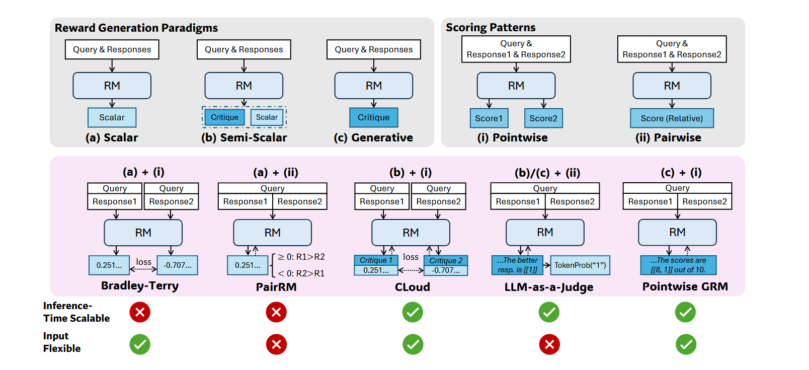
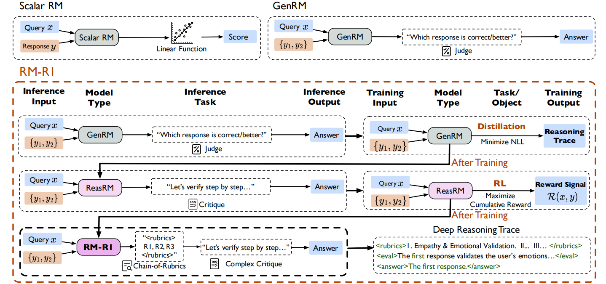
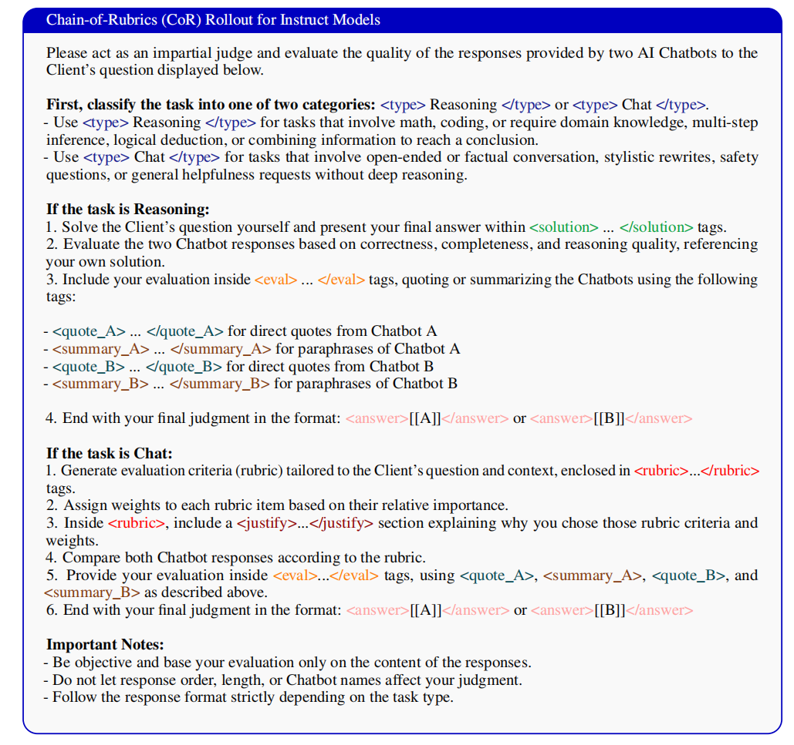
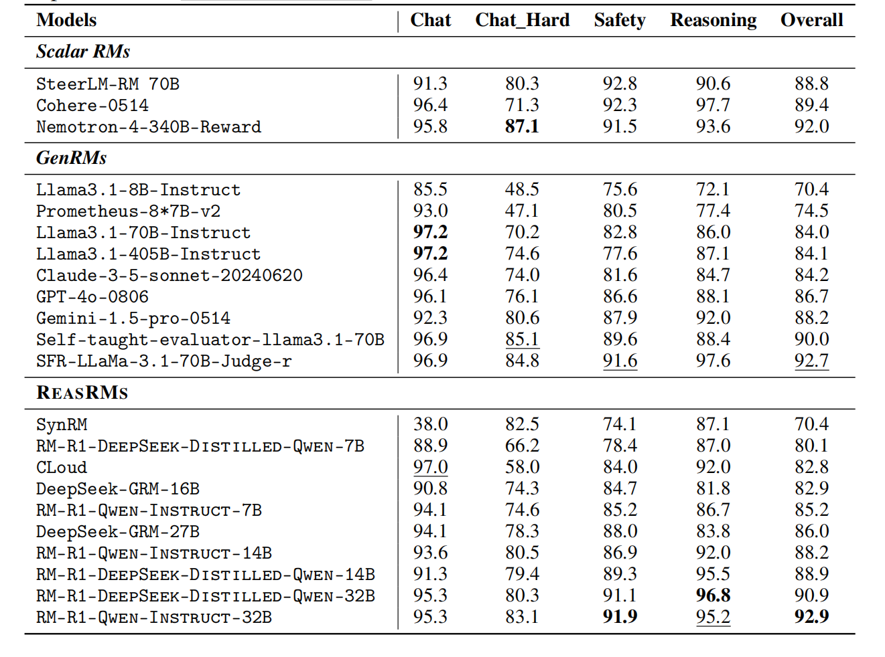
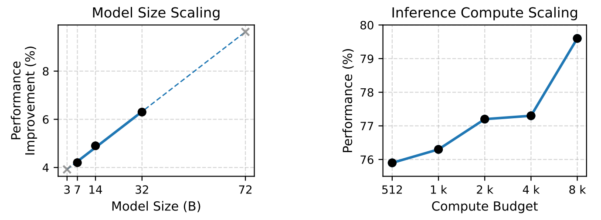
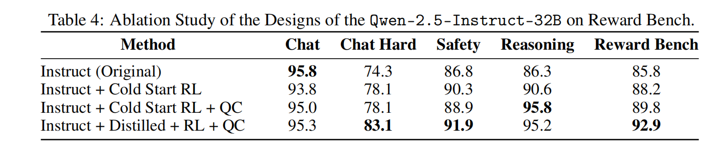
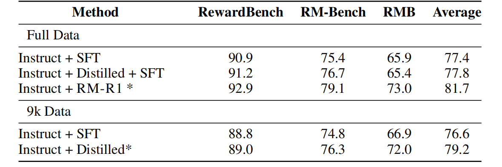

# 论文阅读

## 一、RLPR: EXTRAPOLATING RLVR TO GENERAL DOMAINS WITHOUT VERIFIERS

### 1. 核心方法

#### 1.1 概率奖励

由于 LLM 生成正确答案的内在概率直接表明其对推理质量的内部评估，我们使用参考答案的每个 token 的解码概率作为奖励信号。

对于一个问题 Q，我们先让策略模型生成一个答案，把它的回答视为 $o = (o_0, o_1, ……,0_N)$ ，$o_i$ 是回答中独立的token。为了获取概率，我们先把生成答案中的 $y$ 从完整回答中拿出来，然后只保留推理 $z$。我们之后构建一个修改的回答 $o'=(o_0',o_1',……,o_N')$ ，这个回答是通过把生成的答案换成训练集中的答案，即ground truth。这个序列被喂到策略模型来生成概率 $(p_0, ……,p_{N'})$ ，概率奖励可以被写为
$$
r = f_{seq}(\{p_i|o_i' \in y^*\})
$$
$f_{seq}$ 是将每个 token 的概率聚合为一个奖励标量。如果我们使用 $f_{\text{seq}} = \sqrt[n]{\prod_{i=1}^n p_i}$ ，它对小概率特别敏感，比如序列(0.01, 0.7, 0.9) 和 (0.05, 0.7, 0.9)，奖励差距就很大，即使只有第一个不同。因此我们采用 $f_{seq} = \frac{1}{|y^*|} \sum p_i$ 来作为聚合方法

#### 1.2 奖励偏差

奖励可能由两部分组成 $U_r = U_z + U_{others}$ ，$U_z$ 代表了推理内容的效果，$U_{others}$ 是其他的信息，所以这个潜在的信息可能会影响模型的正确输出，为了解决这个问题，可以用到下面的方法

我们将问题 $Q$ 输入到大模型中，让它直接给出答案，我们计算直接给出答案的概率，然后得到奖励 $r'$，最终我们的奖励就是 
$$
\hat r = clip(0,1, r-r')
$$
最终我们可以得到梯度下降公式（GRPO）
$$
\begin{align}
\nabla J_{\mathrm{RLPR}}(\theta)
    &= \nabla \mathbb{E}_{o \sim \pi_\theta(\cdot \mid x)}[\hat r] \\
    &= \sum_{o} \hat r \,\pi_\theta(o \mid x)\, \nabla \log \pi_\theta(o \mid x) \\
    &= \mathbb{E}_{o \sim \pi_\theta(\cdot \mid x)}
       \big[ \hat r \,\nabla \log \pi_\theta(o \mid x) \big] \,,
\end{align}
$$

#### 1.3 标准差过滤

因为在实际操作中一些prompt过于简单或者过难，模型能学到的信息量很少，所以需要过滤这部分prompt，来提高训练效率，RLPR 采用奖励标准差作为过滤的策略。

1. **传统 RLVR 里的 accuracy filtering 在干嘛？**

> Existing RLVR methods employ accuracy filtering … by excluding too difficult and too easy prompts. Typically, this involves filtering entirely correct or incorrect prompts.

在 **RLVR（0/1 奖励）** 里：

- 对同一个 prompt（题目），你会采样多个回答；
- 如果这个 prompt 对模型来说：
  - **太容易**：几乎所有回答都是对的（accuracy ≈ 1）
  - **太难**：几乎所有回答都是错的（accuracy ≈ 0）

那这种 prompt 对训练帮助很小：

- 全对 → 梯度方向几乎一致、信息很少（又容易导致 overfit easy case）
- 全错 → 模型不知道该往哪改，只知道“你现在很烂”，但没有区分度

所以 **accuracy filtering** 就是：

> 把“完全全对”或者“完全全错”的 prompt 从训练里排除掉，
>  只留下那些有些回答对、有些回答错的 prompt ——
>  这些样本的梯度信息更丰富、更有指导意义。

2. **为什么 RLPR 里不能直接用这个 trick？**

> However, the continuous nature of PR makes it challenging to directly apply accuracy filtering since it is hard to set a universal threshold for response correctness.

RLPR 用的是 **probabilistic reward / reward rate**，奖励是连续的，比如：

- 对一个回答的奖励是：通过的测试比例 0.73
- 或者某种概率型 score，在 $[0,1]$ 里连续变化

这时很难定义“**完全对** / **完全错**”：

- 几乎不可能刚好都是 0 或 1；
- 该拿 0.9 当“几乎全对”吗？0.95？0.99？
- 对不同阶段、不同任务，“0.8 是太好还是一般”也不一样。

所以：**没法像 RLVR 那样给 accuracy 设一个简单的阈值来做过滤**。

3. **他们的观察：用“reward 的标准差”代替 accuracy**

> Through the analysis of accuracy filtering, we observe that filtering prompts with low standard deviation in reward values can effectively achieve a similar effect.

关键洞察：

- 对同一个 prompt，你采样 K 个回答，得到 K 个 reward $\hat r_1, \dots, \hat r_K$；
- **如果这些 reward 都差不多**，那这个 prompt 要么：
  - 总是给很高分（模型几乎总做得很好）；或者
  - 总是给很低分（模型几乎总做得很差）；或者
  - 总是在某个中等水平附近抖动但变化极小

总之，对训练来说，这个 prompt **几乎不区分回答的好坏** → 信息量很低。

“差不多”在统计学里就是：**标准差（std）很小**。

> Specifically, prompts that consistently yield all high or all low scores exhibit low standard deviation due to the boundedness of PR (i.e., all reward values lie within [0, 1]).

因为 reward 被限制在 $[0,1]$ 里：

- 如果都很高，那一堆值都挤在 0.9~1 附近；
- 如果都很低，就挤在 0~0.1 附近；

这两种情况的 **std 都会很小**。
 所以：

> **“删掉 std 很低的 prompt” ≈ “删掉那些总是全好或全坏的 prompt”**
>  在效果上和 RLVR 的 accuracy filtering 很像。

4. **但直接给 std 设一个固定阈值，也有问题**

> Meanwhile, the overall standard deviation distribution continuously shifts during training, and a fixed threshold may cause either too strict or loose filtering at different training stages.

随着训练进行：

- 模型一开始很菜：很多 prompt 的 reward 分布可能比较乱 → std 较大；
- 模型越来越强后：
  - 有些简单的 prompt 变成几乎总是高分 → std 变小；
  - 一些极难 prompt 也可能一直低分 → std 也很小；

所以 **“全体 prompt 的 std 分布会随着训练不断变化”**。

如果你设置一个固定阈值（比如 std < 0.05 就过滤）：

- 在前期：
  - 大多数 prompt std 都挺大 → 几乎没过滤；
- 在后期：
  - 可能很多 prompt std 都变小 → 一下子过滤掉太多，训练数据不够 / 太偏。

所以：**固定阈值不适应训练过程中的动态变化**。

5. **他们的办法：用 EMA 动态更新阈值 β**

> To address this, we adopt an exponential moving average to dynamically update the filtering threshold β using the average standard deviation of each training step.

做法是：

1. 在每个 training step（比如每一批 batch）中：

   - 对这一步里的每个 prompt 计算 reward 的标准差 $\sigma_i$；
   - 求它们的平均值 $\bar\sigma_t$（当前 step 的平均 std）。

2. 用 **指数滑动平均 (Exponential Moving Average, EMA)** 更新阈值 β：
   $$
   \beta_t = (1 - \alpha)\,\beta_{t-1} + \alpha\,\bar\sigma_t
   $$

   - 其中 $\alpha$ 是一个小常数（比如 0.01、0.1），控制更新速度；
   - 这样 β 会跟着“当前难度分布”慢慢移动，而不是突然跳变。

> By filtering the prompts whose reward standard deviation is less than β…

然后，在 step t：

- 对于 std $\sigma_i < \beta_t$ 的 prompt，直接过滤掉；
- 只保留 $\sigma_i \ge \beta_t$ 的 prompt 来算 RL 的损失 /梯度。

直观理解：

> 始终只用那些“reward 波动比较大”的 prompt 训练 ——
>  也就是模型在这些题上时好时坏，区分度高，**更有学习价值**。

6. **为什么说这是“自适应 curriculum learning”？**

> … we introduce an adaptive curriculum learning mechanism to improve both the training stability and final performance.

**Curriculum learning** 的核心思想：

> 一开始多练简单 / 信息量适中 / 不太极端的样本，
>  然后随着模型变强，自动把注意力转移到更有挑战性的样本上。

在这里：

- 通过 std 过滤，模型只在“区分度高”的 prompt 上学习；

- 随着训练进展，β 通过 EMA 动态变化：

  - 当整体变强时：
    - 简单 prompt 的 std 会变得特别小 → 会被过滤掉
    - 训练自动集中在那些还没完全掌握、表现上下波动的 prompt 上

- 这就相当于一个 **自适应的“出题老师”**：

  > 不会永远让你刷最简单的题，
  >  也不会一直给你刷你完全做不来的题，
  >  会根据你当前水平，自动挑“刚好有信息量的题”给你练。

这就是“adaptive curriculum learning mechanism”的含义。

同时，这样做还有两个好处：

1. **训练更稳定**：
   - 避免大量“全 1 / 全 0 甚至 reward 几乎不变”的 prompt 贡献近乎冗余或高方差的梯度；
2. **最终性能更好**：
   - 模型资源集中用在“边界区域”（会错会对的样本）上，
   - 有助于真正提高决策边界附近的表现（类似提升 decision boundary 的精度）。

### 2. 实验

#### 2.1 模型

作者使用 Qwen2.5 Gemma2 Llamma3.1 作为基座模型，主要是采用了 Qwen2.5-7B-Base

#### 2.2 数据集

训练数据集：包含多个领域的高质量推理问题，为了专注于通用领域，作者去除了数据集中的数学推理部分，并且使用 GPT-4.1 去除了数据中过于简单的部分，最终获得了 77k 个prompts ，数据集链接：https://huggingface.co/datasets/openbmb/RLPR-Train-Dataset，它是基于https://huggingface.co/datasets/TIGER-Lab/WebInstruct-verified

评测数据集：评测了数学数据集 Math-500，AIME24；通用评测数据集 MMLU-Pro（多选题构成，用于评测模型的多领域negligence）；GPQA等

#### 2.3 实验细节

1. **用什么框架训练？**

> We adopt the verl (Sheng et al., 2024) framework for efficient training.

- **verl**：一个专门做 RL-for-LLM 的训练框架（类似“给大模型做 PPO / GRPO / RLHF 的工程脚手架”）。

2. **rollout 过程：一轮“采样 + 更新”是怎么做的？**

> In each rollout step, we sample eight responses per prompt for a batch of 768 prompts using a temperature of 1, and subsequently perform 4 policy updates on the collected responses.

- **batch of 768 prompts**：
   每一轮 rollout，会拿 **768 个不同的 prompt** 来跟模型交互。
- **eight responses per prompt**：
   对每个 prompt，模型会生成 **8 个回答**（这就是前面你看到的 pass@k、avg@k、标准差过滤等的基础）。
- **temperature = 1**：
   采样时的温度设为 1，意思是：
  - 不用 greedy
  - 保持一定随机性，能探索不同的答案，而不是只出最可能的那一个。
- **随后进行 4 次 policy updates**：
  - 先把这 768×8 条“(prompt, response, reward)”收集好；
  - 然后在这些数据上跑 **4 个梯度更新 step**（比如 4 个 PPO update iteration）。
  - 这样做叫 “多次利用同一批样本（multiple epochs over same batch）”，可以提高 sample efficiency。

直观理解：

> 每轮：出 768 道题，每题想 8 个答案，
>  根据这 8 个答案的 reward 算梯度，
>  用这一批数据更新策略 4 次。

3. **过滤的 β 参数**

> The scale β used for filtering is set to 0.5.

- 这里的 **β** 是他们在前面提到的“过滤标准差 / PR”时用到的一个**尺度参数**（你刚才那段 standard deviation filtering 里提到）。
- 粗暴理解：
   👉 “过滤的时候，阈值是基于平均 std 乘上一个比例 β=0.5”，控制过滤的严不严格（0.5 是经验设定）。

（具体公式在原文会更清楚，但意思是：β 调节过滤强度。）

4. **PPO 的 clip 范围，防止 entropy collapse**

> The clip threshold in PPO loss is set to (0.8, 1.27) to prevent entropy collapse (Yu et al., 2025; Cui et al., 2025b).

- PPO 里有个重要的东西：**ratio clipping**：
  $$
  r_t(\theta) = \frac{\pi_\theta(a_t|s_t)}{\pi_{\theta_\text{old}}(a_t|s_t)}
  $$
  训练时会限制这个 ratio 不要变化太大，防止策略一步更新得太狠。

- 这里设置 clip 范围为 **(0.8, 1.27)**：

  - 意味着：新策略在某个动作上的概率，不能超过旧策略的 1.27 倍，也不能低于 0.8 倍（在损失里被截断）。

- **防止 entropy collapse**：

  - 如果更新过猛，策略会把概率 mass 全压到少数动作上，变得“非常确定 / 非常贪心”，也就是熵变得很低（collapse）；
  - 这会导致探索不足，训练不稳定。

- 所以合理的 clip 范围，是让策略“慢慢变”，避免一下子变得极端确定。

5. **评测时的温度 & 多次评测取平均**

> During evaluation, we set the rollout temperature to 1. To reduce the evaluation variance, we evaluate the model on each benchmark multiple times and report the final Avg@k results.

- **评测温度设为 1**：
   和训练采样一样，评测时也用 T=1，让输出有一定随机性（尤其是为了算 pass@k / avg@k 这种多候选指标）。
- **多次评测，减少方差**：
  - 因为用 temperature 采样，结果会有随机性；
  - 所以他们对每个 benchmark 评测多次，最后对指标（比如 avg@k）取平均，减少一次性评测的随机波动。

6. **最大生成长度：3072**

> The max generation length for training and evaluation is 3072, with minimal truncation observed.

- **max generation length = 3072 tokens**：
  - 无论训练还是评测时，回答最长不超过 3072 token；
  - 超了就截断（truncation）。
- **“with minimal truncation”**：
  - 说明大部分答案在这个长度之前已经结束；
  - 截断情况很少，说明这个长度足够覆盖他们所需的推理 + 答案长度。

7. **baseline 的评估设置**

> For baseline evaluation, we adopt the default generation temperature from the original papers. For baseline evaluation, we follow the corresponding papers to select generation parameters and use our setup if the original paper uses greedy decoding.

这两句其实是一回事，意思是：

- 对于要对比的 **baseline 模型**（别人的方法），评估时尽量：
  - **沿用原论文里的生成参数**（temperature、top-p 等）；
  - 如果原论文用的是 greedy decoding，那他们就用自己的统一设定来跑，以保持对比公平和可实现。
- 这样做是：
  - 尽量保持“baseline 用它作者认为 best 的设置”；
  - 但当设置不适合 / 没法重现时，用一个统一方案。

8. **`<think></think><answer></answer> `模板：怎么抽取最终答案**

> For reliable answer extraction, we adopt the “<think></think><answer></answer>” template of R1 (Liu et al., 2025b) during training and use the striped content inside answer tags as the generated answer.

- 在 R1 系列里，输出通常会长这样：

```
<think>
  这里是思维链 / 草稿 / 推理过程……
</think>
<answer>
  这里是最终简洁答案
</answer>
```

- 他们训练时也用这个模板：
  - 让模型把推理过程放在 `<think>` 里；
  - 把真正的任务答案放在 `<answer>` 里。
- **评分 /评测时**：
  - **只取 `<answer>...</answer>` 中间的内容**，作为“模型回答”；
  - `<think>` 只是“推理过程”，不参与自动判分（避免影响解析）。

9. **对 Gemma / Llama 的特殊处理**

> For experiments on Gemma and Llama, we change the training and evaluation temperature to 0.6 and remove the <think> part in templates to prevent generation degradation.

他们发现：

- 在 **Gemma / Llama** 这些模型上，如果：
  - 温度太高（T=1），
  - 或强行让它们输出 `<think>` 思维链，
- 会导致生成质量**下降（degradation）**：比如发散、胡言乱语、格式乱等。

所以针对这两个模型他们调整策略：

1. **把温度降到 0.6**：
   - 减少随机性，让输出更稳定。
2. **把 `<think>` 去掉**：
   - 只让模型直接给答案，不强制输出显式思维链；
   - 这样更符合这些 base 模型的习惯 / 训练方式，避免乱套。

10.  **自动判分：不再只靠“规则脚本”**

> We observe that rule-based scoring scripts introduce errors in benchmarks containing question formats beyond multiple-choice.

他们发现：

- 最开始用的是 **rule-based scoring scripts**，比如：
  - 正则表达式抽答案；
  - 简单对比字符串 / 选项；
  - 针对 choice 类题目写的 if-else 判分。
- 但对于 **非选择题** 或复杂题（比如开放问答、证明题、复杂数学），这种“规则脚本”经常会：
  - 抽错答案；
  - 理解不了格式变化；
  - 导致评分错误。

> To address this, we deploy a Qwen2.5-7B-Inst model server for evaluation, and additionally leverage GPT-4.1 for more complex benchmarks, such as TheoremQA and Minerva.

他们的解决方案：

1. **部署一个 Qwen2.5-7B-Inst 做自动判卷（auto-grader）**：
   - 把题目 + 参考答案 + 模型输出都喂给它；
   - 让 Qwen 判断“对/错”或给评分；
   - 对于多数 benchmark，这个 7B 模型就足够胜任打分任务。
2. **对特别复杂的 benchmark（TheoremQA、Minerva 这类高难数学 /理论题）**：
   - 再用更强的 **GPT-4.1** 来判分；
   - 因为这些题需要更强的理解和数学能力，7B 模型可能容易误判。

这就是典型的 **“用 LLM 当自动阅卷老师”**，替代脆弱的规则脚本。

### 3. 复现细节

## 二、Inference-Time Scaling for Generalist Reward Modeling

### 1. 背景介绍

现在挑战主要集中在让大模型更通用并且在推理阶段可扩展。

让大模型通用要求灵活和不同的输入类型并且在不同领域准确的奖励生成，即生成式奖励模型

有效的推理时扩展需要奖励模型能够推理资源增加而生成高质量的奖励信号

pairwise RMS 只考虑了两个回答之间的相关性能，无法接受一个或者多个回答作为输入；scaler RMS 对同一个回答无法生成不同的奖励信号



### 2. 核心方法

#### 2.1 开放问题

使用 GPT-4o-2024-08-06  生成 rubrics，每次采样会生成四次的 pointwise rewards，然后过滤正确的奖励生成过程
=======
## 三、Reward Reasoning Model

### 1. 绪论

现在奖励模型一般可以分为 scaler reward model 和 generative reward model 。scaler reward mode是在最后加一个线性层转换为一个标量值，RLHF 中偏好对训练就是这个方法；generative reward model 是会给出自然语言评价和打分两个

## 四、RM-R1: Reward Modeling as Reasoning

> 训练流程分析
>
> 使用偏好数据集来训练奖励模型
>
> 先再 Qwen-2.5-14b-instruct 进行蒸馏，[数据集](https://huggingface.co/datasets/gaotang/RM-R1-Distill-SFT/viewer/default/train?row=0)
>
> 通过 RLVR 训练
>
> **训练数据集**：
>
> - Skywork Reward Preference 80K，Code-Preference-Pairs，Math-DPO-10K

### 1. 引入

奖励模型在[大语言模型](https://zhida.zhihu.com/search?content_id=257594303&content_type=Article&match_order=1&q=大语言模型&zhida_source=entity)（LLM）的后训练阶段发挥着关键作用。当前已有大量研究聚焦于特定领域的奖励模型，例如数学验证模型。而本研究则主要关注[通用奖励模型](https://zhida.zhihu.com/search?content_id=257594303&content_type=Article&match_order=1&q=通用奖励模型&zhida_source=entity)（generalist reward modeling）的构建。由于**应用场景和任务领域的多样性**，通用奖励模型的研究面临诸多挑战。

当前的奖励模型主要分为两类：

- **基于标量的奖励模型（Scalar-based RM）**：针对一个 (query, response) 对直接输出一个[标量分数](https://zhida.zhihu.com/search?content_id=257594303&content_type=Article&match_order=1&q=标量分数&zhida_source=entity)，用以表示对响应质量的评价。
- **[生成式奖励模型](https://zhida.zhihu.com/search?content_id=257594303&content_type=Article&match_order=1&q=生成式奖励模型&zhida_source=entity)（Generative RM，简称 GRM）**：通常针对 (query, response1, response2) 输出一段文本评论，对两个响应进行对比并给出偏好判断及其理由。

Scalar-based RM 虽然高效，但是缺少判断步骤。现有的大部分 GRM 方法尽管展示了中间推理轨迹度，但它们的推理**往往肤浅**且对可靠判断没有实质性帮助。

Deepseek-R1 的成功展示了 [RLVR](https://zhida.zhihu.com/search?content_id=257594303&content_type=Article&match_order=1&q=RLVR&zhida_source=entity) 在激发模型推理能力方面的潜力，因此我们不禁思考，是否可以：

将奖励模型的任务视为训练推理模型的任务基于此，论文设计了一套训练推理奖励模型（**Reas**oning **R**eward **M**odel**s**）的框架。

### 2. 相关工作

#### 2.1 奖励模型

早期的奖励模型通常侧重于结果（outcome）：训练模型预测完整输出的人类偏好排名。近年来的研究进展则集中于提供[过程监督](https://zhida.zhihu.com/search?content_id=257594303&content_type=Article&match_order=1&q=过程监督&zhida_source=entity)（process），即奖励或评估模型推理步骤，而不仅仅是最终答案。

> 过程监督，例如：a=5-2，b=a+1，b?
> step1: a=5-2=3
> step2: b=3+1=4
> 针对每个过程进行评分然后汇总（例子来源：[wenjtop：ORM和PRM奖励模型（Reward Model，打分模型）知识点总结](https://zhuanlan.zhihu.com/p/20157090301)）

过程奖励模型的一个局限性是它们过度依赖人工标注的精细步骤或特定模式，且往往局限于某一领域。DeepSeek GRM，JudgeLRM 研究了将推理模型作为生成式奖励模型的应用，然而，它们的主要关注点是推理时间计算规模对奖励建模的影响。这个工作是首个对不同奖励模型训练范式进行系统实证比较的研究。

#### 2.2 [RLHF](https://zhida.zhihu.com/search?content_id=257594303&content_type=Article&match_order=1&q=RLHF&zhida_source=entity)

早期研究表明，强化学习可以通过基于人类偏好训练的奖励模型来优化语言模型策略。后来，RLHF 被广泛应用，例如 [InstructGPT](https://zhida.zhihu.com/search?content_id=257594303&content_type=Article&match_order=1&q=InstructGPT&zhida_source=entity) 的训练。近期的工作如 [DeepSeek-R1](https://zhida.zhihu.com/search?content_id=257594303&content_type=Article&match_order=1&q=DeepSeek-R1&zhida_source=entity) 引入了“可验证监督”，**奖励**模型的推理过程而非只关注最终答案质量。但目前大多数 RLHF 方法仍将奖励建模和推理过程分开处理。

### 3. RM-R1



**Overview**：RM-R1 的训练流程首先从生成式奖励模型（GRM）出发

- 通过高质量的对两个响应进行评判的推理数据进行蒸馏，得到具备初步推理能力的 Reasoning Reward Model（ReasRM）
- 随后，在 RLVR（可验证奖励的强化学习）阶段进一步激发和强化其在蒸馏过程中获得的推理能力，最终得到性能更优的 RM-R1。

> 从整体的结构出发，是 R1 那套思路。

因此，本片论文提出框架主体分为两个部分，蒸馏以及 RLVR，接下来先用数学形式化整体的目标（3.1节），再介绍蒸馏，RLVR 的一些细节。

#### 3.1 任务定义

由于对单一回应进行标量标注的成本较高，因此论文采用了成对偏好判断数据集（判断两个 response 谁更好）来训练奖励模型。

**数学定义**：给定偏好数据集 ，其中 为 prompt， 为两个 response， 表示偏好，如果规定生成偏好文本 服从以下概率分布， ：

设偏好文本包含我们在意的预测偏好 ，整个奖励模型建模的目标为：


#### 3.2 蒸馏

对于基座为 instruct 版本的 RM-R1，基座使用 Qwen-2.5-14b-instruct，使用 prompt 即可让它作为 GenRM 来使用。但是这些模型通常缺乏对于评判任务的高质量推理能力。因此考虑使用合成数据来让模型学习这种新的额能力吗。

首先取 ，然后让 o3 或者 claude-3-7-sonnet，针对 生成一个推理路径 论证为什么 应该被选择为 的 response。接着，定义：

其中 表示给定的 system prompt， 表示字符串连接，蒸馏数据集为 ，然后使用 SFT 进行训练，具体数据集样式，可以参考 [https://huggingface.co/datasets/gaotang/RM-R1-Distill-SFT/viewer/default/train?row=0](https://link.zhihu.com/?target=https%3A//huggingface.co/datasets/gaotang/RM-R1-Distill-SFT/viewer/default/train%3Frow%3D0)。


#### 3.3 RLVR

使用 RLVR 来激发蒸馏时学到的新知识，具体来说这个阶段主要优化：


其中 表示可验证奖励函数（如：[lm_as_judge.py](https://link.zhihu.com/?target=https%3A//github.com/RM-R1-UIUC/RM-R1/blob/main/rm_r1/verl/utils/reward_score/lm_as_judge.py)），给予模型生成正确的偏好的奖励信号。

**3.3.1 评分标准**

由于通用奖励模型需要考虑的领域很多，这里首先简单分成两类，通用领域（聊天，安全）和推理领域（数学，代码）。

- 针对推理领域。首先让模型根据问题，自己生成解决方案。然后根据正确性，完整程度，来和 进行比对，生成推理/总结后，最终给出偏好结果。
- 针对通用领域。由于此时没有固定的答案，则让模型首先生成评测标准，让模型解释生成评测标准的原因，然后根据这些标准，来评论 最后给出偏好结果。

基于此 ，设计了如下 prompt（这个 prompt 在蒸馏阶段也使用了）：



**3.3.2** **奖励设计**

使用典型的可验证奖励，即判断模型输出的偏好是否与真实的偏好一致。

可对照 [lm_as_judge.py](https://link.zhihu.com/?target=https%3A//github.com/RM-R1-UIUC/RM-R1/blob/main/rm_r1/verl/utils/reward_score/lm_as_judge.py) 进行理解。

### 4. 实验

#### 4.1 实验步骤

**测试数据集**：

- **RewardBench**([Link](https://link.zhihu.com/?target=https%3A//huggingface.co/datasets/allenai/reward-bench))：(prompt, chosen, rejected) 三元组，覆盖 chat, chat-hard, reasoning, safety 领域
- **RM-Bench**([Link](https://link.zhihu.com/?target=https%3A//huggingface.co/datasets/THU-KEG/RM-Bench))：基于 RewardBench，涵盖 Chat, Safety, Math, and Code
- **[RMB](https://zhida.zhihu.com/search?content_id=257594303&content_type=Article&match_order=1&q=RMB&zhida_source=entity)：**涵盖了超过 49 个真实场景，并支持成对评估和最佳 N （Best-of-N, BoN）评估格式。

**训练数据集**：

- **[Skywork Reward Preference 80K](https://link.zhihu.com/?target=https%3A//huggingface.co/datasets/Skywork/Skywork-Reward-Preference-80K-v0.2)**：这是一个高质量的成对偏好数据集，涵盖了多个领域，包括聊天、安全、数学和代码。它采用了一种先进的数据筛选技术，以确保跨任务的偏好可靠性。然而，这个数据集存在一个显著的问题：所有来自 magpie_ultra 数据源的样本都表现出强烈的虚假相关性，拒绝的响应中始终包含 token “<im_start>”，而接受的响应则没有。此外，这些响应还显示出系统性的偏差——接受的响应通常是单轮对话，而拒绝的响应则是多轮对话。这个有问题的子集大约占 Skywork 数据集的 30%，主要涵盖数学和代码领域。为了避免在训练中引入虚假相关性，论文排除了所有来自 magpie_ultra 的数据，仅保留了清洗过的子集进行实验。
- **[Code-Preference-Pairs](https://link.zhihu.com/?target=https%3A//huggingface.co/datasets/Vezora/Code-Preference-Pairs)**：这是一个高质量的编码偏好数据集。该数据集通过给模型提供原始代码，故意引入错误并操控示例（例如，交换错误版本和修正版本，移除错误注释）来生成细粒度的偏好对。
- **[Math-DPO-10K](https://link.zhihu.com/?target=https%3A//huggingface.co/datasets/xinlai/Math-Step-DPO-10K)**：高质量数学推理偏好数据集。

**基线**：Scalar RMs，GenRMs，REASRMS（Reasoning-enhanced reward models，例如 Critique-RM, DeepSeek-GRM 以及这篇论文的 RM-R1）

#### 4.2 主要结果



Table1. RewadBench 上的结果

> 三个数据集对应三张表，这里只贴出一张

结果总结为：(1). RM-R1 达到了 SOTA 的效果 (2). RM-R1 很高效，RM-R1-QWEN-INSTRAUCT-14B 甚至接近且略好于 DeepSeek-GRM-27B。(3). RM-R1能在多个领域上泛化，在各个领域上效果都很好。


### 5. 分析

#### 5.1 Scaling 的影响

尽管先前研究表明，基座**模型越大**，能力越强，增**加推理时计算** (inference budgets) 的好处，但是奖励模型建模仍然较为复杂，例如 Table 1. 中 GenRMs Llama3.1-70B-I 与 Llama3.1-405B-I 效果几乎差不多（甚至在Safety 70B的效果好于405B）。

论文在这一章节介绍，在推理奖励模型中，scaling 会带来更稳定的性能改善。



**模型尺寸**：基于 Qwen-2.5-Instruct 模型家族，涵盖三个不同的规模：7B、14B 和 32B。评估 RM-R1，结果在三个关键基准测试（RewardBench、RM-Bench 和 RMB）上取平均值。上图左图，绘制了相对于原始模型性能（以百分比表示）的绝对提升与模型规模的关系。观察到大致呈线性趋势，论文拟合了线性回归模型，并将其外推至假设的 3B 和 72B 规模，用虚线标记和延伸线表示。结果强烈支持推理奖励模型（RM-R1）的扩展法则

**推理时计算量**：使用了 DeepSeek-R1-Distill-Qwen-14B 作为基础模型，并在多个推理预算下（512、1024、2048、4096、8192 tokens）评估了在三个关键基准测试上的平均性能。结果表明，随着推理预算的增加，模型性能呈现明显提升趋势，说明了长推理链在奖励建模中的重要性。

#### 5.2 消融分析

为了说明 RM-R1 的设计的正确性，接下来将介绍一些消融实验。

**实验设置一**：R1-zero，采用 foramt reward 以及 answer reward，直接进行 RLVR。

> 论文称其为 **Cold Start RL**，我印象中冷启动是额外先做了 SFT，所以不太认同其命名。

**实验设置二**：R1-zero + Query Categorization (QC)，在一的基础上使用了推理和通用领域的分类，即上面提出的 system prompt。

**实验设置三**：Distilled + RL-zero + QC。在二的基础上添加了蒸馏这一过程。

> 高质量推理链的生成过程：首先使用相同的提示语查询Claude-3.7-Sonnet，生成初始推理轨迹。然而，大约25%的这些轨迹是错误的，主要出现在更难的聊天任务中。为了纠正这些错误，我们将原始提示、错误轨迹和正确的最终答案传递给OpenAI-O3，后者生成与正确答案对齐的修正推理轨迹。

**结果**：



这表明：单独进行 RLVR（不 distill）效果是不够的；对问题进行分类（使用 Query Categorization ），可以激发推理问题上性能的改善；蒸馏能在所有领域上增强模型的能力。

#### 5.3 使用推理数据带来的好处

在本小节中，使用 SFT 来指代仅针对最终答案进行的监督微调，而使用蒸馏（distilled）来指代针对由更强模型生成的推理链进行的监督微调，以这二者做一些对比，来论证推理数据对于整体框架的的有效性。

- 实验设置1：**Instruct + SFT** 直接使用偏好数据集在基座 instruct 模型上微调
- 实验设置2：**Instruct + Distilled + SFT** 先蒸馏训练高质量推理数据再 SFT
- 实验设置3：**Instruct + RM-R1 (Distilled + RL)** 论文提出的方法
- 实验设置4：**Instruct + Distilled** 实验设置3未 RL 训练时的模型保存的检查点



研究结果表明，基于推理的训练显著提升了奖励模型的表现。在公平比较下（即在相同数据量上进行训练），基于推理的模型始终优于仅使用 SFT 的模型。特别是，即使仅使用高质量的蒸馏，且仅应用于数据的一个小子集，也能带来显著的性能提升，这突出了结合结构化中间推理的价值。


