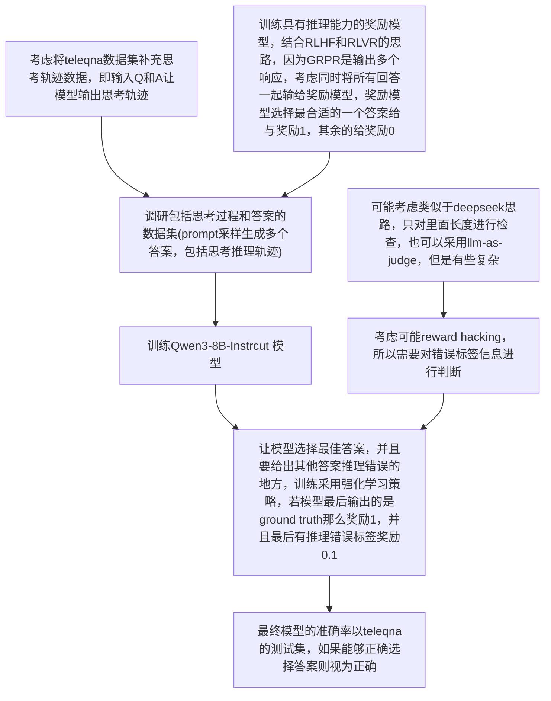

# 高质量奖励模型生成周报一

## 一、问题描述

### 1. 目标

整个项目目标是在工程师维护基站或者其他业务场景中可能遇到的问题，希望能够通过询问大模型来得到一个较好的处理办法，该 agent 需要具备 tool calling 的能力，也就是奖励模型的设计还需要考虑 tool calling 的合理性

### 2. 数据集

telemath、TeleQA、τ2Telecom

telemath 是数学问题，可以考虑用它进行微调来提高模型的推理能力

TeleQnA 是选择题，可以考虑转换为简单题，或者可以利用选择题形成的偏好对进行 RLHF 训练

τ2Telecom 是工具调用相关，这个数据集在本项目设计中可以重点考虑

### 3. 评价指标

奖励模型评判准确率，设计思路目前还未想好，因为如果是输出 0  或者 1，那么可以考虑评测，但是如果输出的是一个范围，那我觉得有些难

或者是考虑能不能直接根据奖励模型用强化学习训练大模型，根据测试集去测，但是这样不确定算力是否足够

### 二、调研

后训练（post training）主要有几种

* SFT 监督微调，利用监督学习来对模型进行微调，fine-tuning 的方法主要就是全参和lora，目前资源足够可考虑全参微调
* zero-rl，跳过冷启动阶段，直接进行强化学习训练，这种方法可能的好处是提高大模型的熵，利用熵增定律不去限制大模型的思路，但是劣势就是可能没法掌握领域的基础知识导致思考效果也不佳
* sft+rl，先进行监督学习，然后再进行强化学习，根据 deepseek-r1 的设计思路，SFT 大概数千条数据，RL 大概数十万条数据
* 蒸馏，利用大模型的输出来训练小模型，有论文表面蒸馏方法会让小模型学到推理能力

在我调研的强化学习中，奖励模型的设计主要有两种

* RLHF 基于人类反馈的强化学习，reward model 是利用偏好对来进行奖励模型的训练，这个过程通过 <x, y1, y2> 输入到奖励模型，并说明 y1 > y2 进行训练，这里面我觉得应该是隐含了逆强化学习的思路，不直接设计奖励信号，通过偏好对进行模型的微调
* RLVR 可验证奖励的强化学习，目前主流思路应该是这个，在数学，代码等有确定答案的领域发展比较好，这里不再是奖励模型而是使用奖励信号，在数学问题中奖励信号就是答案是否正确

## 三、思路

### 1. 基于 RLVR 的奖励模型设计

> 两个痛点，一个是高质量的rubrics生成与获取难，根据问题生成rubrics质量肯定不如人类专家，这里就有损失；再用rubrics和回答给裁判模型评判，裁判模型答准率也不确定，这两个问题限制了RLVR的发展

基于 RLVR 的方法，在 open-ended problem 中解决思路主要是通过设计 rubrics ，然后将问题，大模型的输出，评判标准一起发给 llm-as-judge，进行评判得到对应的奖励分数，在医疗大模型领域有几个工作就是利用这种思路进行的，比如 Baichuan-M2，InfiMed-ORBIT 两个工作都采用了该思路，结合这个我想的一个思路。

如果对于每个问题都去单独设计 rubrics 来进行训练，那么成本太高并且训练数据量有限，所以需要思考如何利用有限的 rubrics 进行训练，主要思路是通过RAG 检索增强技术，将问题和对应的 rubrics 放入向量数据库 A，将所有的 rubrics 放入数据库 B，然后对于一个 problem 去两个向量数据库进行相似性搜索，找到后，把问题和两个数据库中检索到的数据输入给一个 生成模型 让它生成一些 rubrics，之后在进行合理性判断去除被命中次数太低或者太高的 rubrics

得到 rubrics 后，发给 llm-as-judge，进行评分

这个方法主要有三点设计需要仔细思考

1. 向量知识库的设计，可以考虑直接用开源的一些比如 milvus，但是检索，重排之类的设计是否需要还未确定
2. rubrics 生成模型，需要设计合适的提示词，考虑先用 telemath 进行微调让模型掌握些领域的知识，然后在这基础上生成 rubrics，数据集用 TeleQnA 形成的
3. 裁判模型设计，我认为需要监督微调，将问题，llm 的回答，rubrics，还有人类根据 rubrics 对答案的评分一起给大模型，进行训练后再去打分

这个方法需要很多专业领域的专家，比如 一些基础的 rubrics 的设计，已经裁判模型的标签，目前提供的开源数据集暂时未具备这些能力，目前考虑放弃

### 2. 基于 RLHF 的奖励模型设计

> 暂时放弃

因为 TeleQnA 是选择题，所以就有偏好对，可以直接用来训练奖励模型，这种思路可以作为对比模型去比较，或者作为其中一个方法

### 3. 逆强化学习

#### 3.1 对抗逆强化学习

> 这里有个问题，奖励模型在对抗学习中应该是作为评判器存在的，这个应该要和生成器一起训练，不能单独训练鉴别器吧

#### 3.2 字节论文 REER	

> 也不是直接训练奖励模型

转换为一个搜索问题

### 4. unsupervised rl

> 无监督强化学习，利用模型自身的性能

可以考虑只给问题不给标注，来进行训练，主要是模型自身的能力，从一致性，自信度等几个方面进行评估，奖励信号用这几个评判标准 

## 四、实验

### 1. 基座性能评估

使用 Qwen-3-base-32B ，利用几个数据集看一下准确率

### 2. 数据蒸馏

> 这个可以做吗？因为 gemini-3-pro 的 api key 应该需要有不少的开销才能形成数据集

使用一些 sota 模型（还未调研，考虑使用 Gemini-3）的api 获得思考路径，然后去蒸馏 Qwen 模型看看效果 （不是传统软标签蒸馏，基本就是 SFT 的思路）

### 3. 使用 RLHF 训练奖励模型

用 TeleQnA 形成的偏好对去训练

## 五、问题

### 1. 开放领域问题的准确性如何评估？评价标准

> 需要调研

调研发现，现在大多benchmark为确定答案或者选择题，可以直接评测

对于无法直接评测的文本生成题，评测标准多为找一个模型作为裁判模型评测

  

# 高质量奖励模型生成周报二


# 高质量奖励模型生成周报四

## 一、论文

### 1. DeepSeek-GRM

### 2. On-Policy Distillation

https://thinkingmachines.ai/blog/on-policy-distillation/

### 3. RM-R1

## 二、实验

### 1. 测试DeepSeek-GRM-27B效果

以下面的题目为例

```
What is the typical coverage range of LPWANs (Low-Power Wide Area Networks) in urban areas?
	

[
"A few meters",
"2-5 km",
"10-15 km",
"50-100 km"
]

ground_truth:2-5km
```

下面是四个回答一起送进去时的答案

```
Specific standards: IEEE 802.11ah, LoRaWAN, and Sigfox  
    Analysis: IEEE 802.11ah is not relevant to LPWANs. LoRaWAN and Sigfox are two widely used LPWAN technologies, with typical urban coverage ranges of 2-5 km for LoRaWAN and 3-10 km for Sigfox. Response 1 is incorrect as it describes a range far below realistic urban coverage for any LPWAN. Response 2 accurately reflects the coverage range for LoRaWAN in urban areas. Response 3 slightly overestimates the range but is still within the ballpark for Sigfox. Response 4 significantly overestimates the coverage range, which is not typical for LPWANs in urban settings.  
    Score: \boxed{2, 9, 7, 4}
[2.0, 9.0, 7.0, 4.0]
```

如果分开打分，可以看出效果很差，它偏向于对内容完整性等打分，而不是真的准确性

1. 当输入下面时

```
What is the typical coverage range of LPWANs (Low-Power Wide Area Networks) in urban areas?
	

[
"2-5 km"
]

```

```
Analysis: Response 1 provides a specific numeric range for the typical coverage of LPWANs in urban areas, which aligns with 3GPP standards for LPWANs. The range of 2-5 km is consistent with the understanding that LPWANs are designed for long-range communication, often extending beyond typical cellular coverage. This response is highly relevant and practical, as it directly answers the question without unnecessary details.
Score: \boxed{9, 9}
[9.0, 9.0]
```

2. 

```
What is the typical coverage range of LPWANs (Low-Power Wide Area Networks) in urban areas?
	

[
"10-15 km"
]
```

```
Specific standards: 
    - ITU-T Recommendation I.580-1995 for LPWAN characteristics
    - IEEE 802.11 standards for wireless communication
    - 3GPP standards for cellular networks

    Analysis: 
    - Adherence to Instructions: Response 1 provides a specific numerical range (6-10 km), which is a direct answer to the question about the typical coverage range of LPWANs in urban areas. This response fully adheres to the instructions.
    - Practicality: The response is highly practical as it directly addresses the query with a precise and accurate range, which is useful for planning and deployment purposes in urban settings.
    - Relevance: The response is highly relevant as it focuses on the specific topic of LPWAN coverage in urban areas, without any off-topic information.

    Score: \boxed{10, 10}
[10.0, 10.0]
```

## 三、思路

现在 GRPO 算法对一个 prompt 会生成多个回复，一般是5，15附近，我这里准备采用4-5

* RLHF 算法是通过偏好对来训练奖励模型，是利用监督微调的策略，但是 SFT 好像更侧重于学到表面信息，即完整性，回答的风格是否友好，而不是正确性分析，即不会主动思考为什么错误，为什么正确

* RLVR 算法对规则要求很高，需要制定规则，这个阻碍了泛化能力
* PRM 方法对数据标注要求太高，但是其对思考轨迹的研究可以借鉴

结合 RLHF 和 RLVR 算法，将 rollout 生成的多个回答一起输入给奖励模型，然后我们用 RLVR 的方法去作为奖励信号进行强化学习，这里的核心思路是考虑模型生成多条轨迹之间的关联性信息，而且我认为选择会比单独的分析效果好

我们需要的数据集是 问题，模型生成的回复（包括推理轨迹），以及正确的回复编号（但是考虑在实际过程中，可能多个回复都是正确的，因此 TeleQnA 数据集要考虑如何扩充）组成的

训练策略就是通过设计提示词 （参考论文RM-R1），然后让大模型选择正确的回复，并且要给出错误回复的问题，目前思考的奖励RM的策略是选择的回复是正确的就奖励1分，能够给出错误恢复的问题每个奖励0.1分（如何审查目前尚未确定），我们希望奖励模型不仅能够确定正确的回复，并且能够给出错误回复的理由

最终在基座模型训练的时候，我们可以利用 GRPO 天然的多 rollout 能力去产生多个回复，然后输入给奖励模型，奖励模型会给出正确答案的编号，奖励1分，剩余奖励0分，因为其优势计算就是归一化过程，所以我认为可以采用

对于奖励模型的评估，我们采用测试集的方法，对于输入序列，能够选择正确答案那么就认为奖励模型是正确的



## 四、问题

### 1. 数据集构建

目前用 Qwen3-8B 模型增加推理轨迹，但是数据中存在推理轨迹有问题，即如果答案错误，那么思考轨迹生成的质量不高，不太符合实际模型生成情况，但是思考轨迹质量不高能不能作为训练的一部分

考虑选择 Qwen3-8B 回答错的问题，然后让它生成这个问题的思考轨迹，然后用教师模型比如 gemini 来生成正确的思考轨迹，需要 gemini api，这样就有正确的思考轨迹和错误的思考轨迹

### 2. 训练方法选择

是选择监督微调 SFT ，还是离线强化学习

如果选择监督微调，就是把问题和几个答案一起输入给奖励模型，标签就是正确答案是1，其他是0

如果选择离线强化学习，输入相同，但是训练奖励模型的奖励选择RLVR方法，即给与正确答案奖励为1的时候奖励这个奖励模型1分，并且可能会加一些其他的额外奖励，比如发现其他推理轨迹的问题，但是这个暂时不知道怎么验证

选择这两个数据量分别是多少

### 3. 模型选择

模型是选 Base 还是 Instruct 模型，Instruct一般不生成 `<think>` 标签，能不能有思考轨迹

因为我觉得对于这种领域内的知识问答，答案不是特别能训练，需要看下中间的思考轨迹

或者直接选择一些已经训练好的 RM


