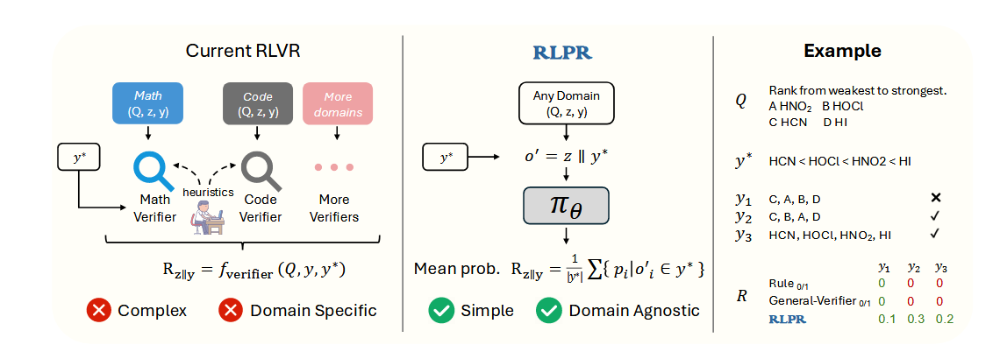

# 高质量奖励模型生成周报一

## 一、问题描述

### 1. 目标

整个项目目标是在工程师维护基站或者其他业务场景中可能遇到的问题，希望能够通过询问大模型来得到一个较好的处理办法，该 agent 需要具备 tool calling 的能力，也就是奖励模型的设计还需要考虑 tool calling 的合理性

### 2. 数据集

telemath、TeleQA、τ2Telecom

telemath 是数学问题，可以考虑用它进行微调来提高模型的推理能力

TeleQnA 是选择题，可以考虑转换为简单题，或者可以利用选择题形成的偏好对进行 RLHF 训练

τ2Telecom 是工具调用相关，这个数据集在本项目设计中可以重点考虑

### 3. 评价指标

奖励模型评判准确率，设计思路目前还未想好，因为如果是输出 0  或者 1，那么可以考虑评测，但是如果输出的是一个范围，那我觉得有些难

或者是考虑能不能直接根据奖励模型用强化学习训练大模型，根据测试集去测，但是这样不确定算力是否足够

### 二、调研

后训练（post training）主要有几种

* SFT 监督微调，利用监督学习来对模型进行微调，fine-tuning 的方法主要就是全参和lora，目前资源足够可考虑全参微调
* zero-rl，跳过冷启动阶段，直接进行强化学习训练，这种方法可能的好处是提高大模型的熵，利用熵增定律不去限制大模型的思路，但是劣势就是可能没法掌握领域的基础知识导致思考效果也不佳
* sft+rl，先进行监督学习，然后再进行强化学习，根据 deepseek-r1 的设计思路，SFT 大概数千条数据，RL 大概数十万条数据
* 蒸馏，利用大模型的输出来训练小模型，有论文表面蒸馏方法会让小模型学到推理能力

在我调研的强化学习中，奖励模型的设计主要有两种

* RLHF 基于人类反馈的强化学习，reward model 是利用偏好对来进行奖励模型的训练，这个过程通过 <x, y1, y2> 输入到奖励模型，并说明 y1 > y2 进行训练，这里面我觉得应该是隐含了逆强化学习的思路，不直接设计奖励信号，通过偏好对进行模型的微调
* RLVR 可验证奖励的强化学习，目前主流思路应该是这个，在数学，代码等有确定答案的领域发展比较好，这里不再是奖励模型而是使用奖励信号，在数学问题中奖励信号就是答案是否正确

## 三、思路

### 1. 基于 RLVR 的奖励模型设计

> 两个痛点，一个是高质量的rubrics生成与获取难，根据问题生成rubrics质量肯定不如人类专家，这里就有损失；再用rubrics和回答给裁判模型评判，裁判模型答准率也不确定，这两个问题限制了RLVR的发展

基于 RLVR 的方法，在 open-ended problem 中解决思路主要是通过设计 rubrics ，然后将问题，大模型的输出，评判标准一起发给 llm-as-judge，进行评判得到对应的奖励分数，在医疗大模型领域有几个工作就是利用这种思路进行的，比如 Baichuan-M2，InfiMed-ORBIT 两个工作都采用了该思路，结合这个我想的一个思路。

如果对于每个问题都去单独设计 rubrics 来进行训练，那么成本太高并且训练数据量有限，所以需要思考如何利用有限的 rubrics 进行训练，主要思路是通过RAG 检索增强技术，将问题和对应的 rubrics 放入向量数据库 A，将所有的 rubrics 放入数据库 B，然后对于一个 problem 去两个向量数据库进行相似性搜索，找到后，把问题和两个数据库中检索到的数据输入给一个 生成模型 让它生成一些 rubrics，之后在进行合理性判断去除被命中次数太低或者太高的 rubrics

得到 rubrics 后，发给 llm-as-judge，进行评分

这个方法主要有三点设计需要仔细思考

1. 向量知识库的设计，可以考虑直接用开源的一些比如 milvus，但是检索，重排之类的设计是否需要还未确定
2. rubrics 生成模型，需要设计合适的提示词，考虑先用 telemath 进行微调让模型掌握些领域的知识，然后在这基础上生成 rubrics，数据集用 TeleQnA 形成的
3. 裁判模型设计，我认为需要监督微调，将问题，llm 的回答，rubrics，还有人类根据 rubrics 对答案的评分一起给大模型，进行训练后再去打分

这个方法需要很多专业领域的专家，比如 一些基础的 rubrics 的设计，已经裁判模型的标签，目前提供的开源数据集暂时未具备这些能力，目前考虑放弃

### 2. 基于 RLHF 的奖励模型设计

> 暂时放弃

因为 TeleQnA 是选择题，所以就有偏好对，可以直接用来训练奖励模型，这种思路可以作为对比模型去比较，或者作为其中一个方法

### 3. 逆强化学习

#### 3.1 对抗逆强化学习

> 这里有个问题，奖励模型在对抗学习中应该是作为评判器存在的，这个应该要和生成器一起训练，不能单独训练鉴别器吧

#### 3.2 字节论文 REER	

> 也不是直接训练奖励模型

转换为一个搜索问题

### 4. unsupervised rl

> 无监督强化学习，利用模型自身的性能

可以考虑只给问题不给标注，来进行训练，主要是模型自身的能力，从一致性，自信度等几个方面进行评估，奖励信号用这几个评判标准 

## 四、实验

### 1. 基座性能评估

使用 Qwen-3-base-32B ，利用几个数据集看一下准确率

### 2. 数据蒸馏

> 这个可以做吗？因为 gemini-3-pro 的 api key 应该需要有不少的开销才能形成数据集

使用一些 sota 模型（还未调研，考虑使用 Gemini-3）的api 获得思考路径，然后去蒸馏 Qwen 模型看看效果 （不是传统软标签蒸馏，基本就是 SFT 的思路）

### 3. 使用 RLHF 训练奖励模型

用 TeleQnA 形成的偏好对去训练

## 五、问题

### 1. 开放领域问题的准确性如何评估？评价标准

> 需要调研

调研发现，现在大多benchmark为确定答案或者选择题，可以直接评测

对于无法直接评测的文本生成题，评测标准多为找一个模型作为裁判模型评测

  

# 高质量奖励模型生成周报二

# 高质量奖励模型生成周报三

## 一、论文

### 1. RLIF

RLIF的核心思想是，模型在生成答案的过程中，其内部状态本身就蕴含着丰富的、可用于自我改进的信号。例如，模型对于下一步生成哪个词元（token）的不确定性程度，或者对于整个生成轨迹的整体置信度，都可以被量化并用作奖励信号。

RLIF的最大优势在于其**无监督**的特性。它摆脱了对外部标注数据或验证器的依赖，使得在任何领域进行模型的自我优化成为可能，极大地降低了训练成本并提升了方法的通用性。

* 自我确定性（self-certainty）: **自我确定性 (Self-Certainty)**: 自我确定性衡量的是模型输出概率分布的“自信程度”。它通常通过计算模型在每个生成步骤的输出概率分布与一个均匀分布之间的KL散度（Kullback-Leibler Divergence）来量化。如果模型的输出概率高度集中在少数几个词元上（即“尖锐”分布），那么它与均匀分布的KL散度就大，表明模型对此步生成非常“确定”。反之，如果概率分布较为平坦，则KL散度小，表示模型较为“犹豫”。RLIF的目标是最大化这种自我确定性，即鼓励模型生成它“认为”最可能的序列。 其奖励函数可以表示为：
  $$
  r_{\text{self-certainty}}(x, y) = \frac{1}{|y|} \sum_{t=1}^{|y|} D_{\text{KL}}(U \parallel \pi_{\theta}(\cdot | x, y_{<t}))
  $$
  其中 $y$ 是生成的序列， $|y|$ 是序列长度，$x$ 是输入，$\pi_{\theta}$ 是策略，$U$ 是一个均匀分布

* **词元级熵 (Token-Level Entropy)**: 熵是信息论中衡量不确定性的经典指标。词元级熵计算的是模型在每个生成步骤的输出概率分布的熵。低熵意味着低不确定性（分布尖锐），高熵则意味着高不确定性（分布平坦）。在RLIF中，通常使用**负熵**作为奖励，即最小化每一步生成的不确定性。 其奖励函数为：
  $$
  r_{\text{token-entropy}}(x, y) = \frac{-1}{|y|} \sum_{t=1}^{|y|} H(\pi_{\theta}(\cdot | x, y_{<t}))
  $$
  $H(x)$ 是香农熵，表示信息不确定性，即 $H(x) = -\sum_{i=1}^{n}P(x_i)log_2P(x_i)$

* **轨迹级熵 (Trajectory-Level Entropy)**: 与词元级熵关注每一步不同，轨迹级熵衡量的是整个生成序列 $y$ 的总概率（或对数概率）。一个序列的整体概率越高，其轨迹级熵（这里指负对数概率）就越低。RLIF的目标是最大化整个序列的概率，等价于最小化轨迹级熵。 其奖励函数可以表示为（经过归一化）：
  $$
  r_{\text{traj-entropy}}(x, y) = \frac{1}{|y|} \log \pi_{\theta}(y | x)
  $$

以上三种方式的本质都是最小化策略熵，通过实验可以看出，会出现性能先升后降的问题，在早期（通常前20个时间步）效果会有提升，后面会慢慢降低，可能是因为策略熵降低导致模型过度自信。

研究人员引入了“过渡词”（transitional words）的概念。这些词，如 "但是 (but)"、"等等 (wait)"、"让我检查一下 (let me check...)"、"或者 (alternatively)" 等，在复杂推理过程中扮演着至关重要的角色。它们通常标志着模型正在进行自我修正、探索不同思路或对中间步骤进行反思。这些词汇在生成时通常伴随着较高的熵，因为模型在这些节点上正处于决策的不确定状态。

实验分析发现，随着RLIF训练的进行（即策略熵的不断降低），这些关键的“过渡词”出现的频率显著下降。模型不再“犹豫”和“反思”，而是倾向于生成一条直接、简短、看似自信的推理路径。

**RLIF 成功的关键在于模型初始的高熵分布，对于一些instruct模型，初始时熵已经比较低，则会破坏原来的推理轨迹，所以一般在 base 模型直接进行强化学习训练，跳过冷启动阶段**

### 2. RLPR

RLPR 的思路基于这样一个基本的洞察：**LLM 生成正确自由形式答案的内在概率，直接反映了其自身对推理质量的评估。** 这个思路其实在最近的一些研究中经常出现。

为什么 LLM 的「内在概率」能作为奖励信号？

1. **「自信」的体现：** LLM 在生成每一个 token 时，都会计算出其在当前上下文中最有可能出现的下一个 token 及其概率。如果 LLM 在生成一段推理过程 $z$ 之后，能够以**高概率**继续生成出与**标准答案** $y^*$ 高度吻合的 token 序列，这说明 LLM 内部的知识和逻辑流与标准答案是高度一致的，它对自己的推理结果「很有信心」。这种「信心」正是其推理过程高质量的体现。
2. **对语义和逻辑的捕捉：** LLM 通过海量数据预训练，已经掌握了复杂的语言模式、语义关系和世界知识。当它生成一个 token 时，其概率分布反映了该 token 在当前语境下的「合理性」。如果一个推理过程 $z$ 能够有效地引导模型走向语义和逻辑都正确的方向，那么后续生成标准答案的 token 概率自然会很高。
3. **细粒度评估：** 传统的外部验证器通常只能给出「对」或「错」的二元奖励。而 LLM 的内在概率是连续的，可以提供**更细粒度的奖励**。即使模型生成的答案并非完美，但如果大部分 token 与标准答案语义接近，它也能获得一个相对较高的平均概率，从而得到部分奖励。这有助于模型在学习过程中获得更丰富的梯度信号，从而更好地优化其推理能力。

举个例子，假设问题是：`请用一句话描述什么是光合作用？` **标准答案 $y^* $ ：** `光合作用是植物利用光能将二氧化碳和水转化为有机物并释放氧气的过程。`

- **场景 A：LLM 进行了高质量推理**
  - LLM 内部经过一系列思考（例如，先想到「植物」，再想到「光能」，再想到「二氧化碳和水」，最后想到「有机物」和「氧气」），生成了推理过程  $z$，然后输出了答案。
  - 当我们将标准答案 $y^* $ 喂给它，让它计算生成这些 token 的概率时，由于其内部状态与正确答案高度匹配，它会以极高的概率生成 中的每一个 token。例如，在生成「氧气」这个词时，模型会觉得这个词出现的概率非常高。
  - 所有 token 概率的平均值会很高，奖励也很高。
- **场景 B：LLM 进行了低质量推理**
  - LLM 的推理过程 $z^*$ 混乱，或者思考方向错误（例如，它想到了动物呼吸）。
  - 当我们将标准答案 $y*$ 喂给它，让它计算生成这些 token 的概率时，由于其内部状态与正确答案不匹配，它会觉得生成 中的某些 token（例如「植物」、「二氧化碳」）的概率非常低。
  - 所有 token 概率的平均值会很低，奖励也很低。

也就是说，RLPR 将 LLM 自身作为「奖励评估者」，从而完全摆脱了对外部验证器的依赖。

主要技术：

**奖励的基准分数**

LLM 生成答案 $y^* $ 是一系列 token $y_1^*$，$y_2^*$，……，$y_N^*$ 的序列，每个token都有一个输出概率 $p_i$，RLPR 选了一个鲁棒的聚合方式，直接计算所有 token 概率平均值，即 $r = \frac{1}{N}\sum_{i=1}^{N}p_i$ ，这种方法对低概率不敏感，如果直接采用序列似然即将概率相乘然后开N次根那么会对低概率很敏感。

即使我们使用了平均概率，计算出的奖励 $r$ 仍然可能包含「水分」。这个「水分」来源于问题 $Q$ 和参考答案 $y$ 本身的特性，而不是 LLM 推理过程 $z$ 带来的真正贡献。

例如，对于一个非常简单、常识性的问题，LLM 可能无需任何复杂推理，就能够极高概率直接给出正确答案。这种高概率答案模式呈现出“先验知识”的体貌，并且其「推理能力」的体现。我们希望奖励函数激励的是模型通过推理带来的能力提升。

RLPR 引入了一个基准分数 $r'$，它的计算方式是：在没有中间推理 $z$ 的情况下，模型直接生成参考答案 $y$ 的概率。

也就是说，我们给 LLM 看问题 $Q$ 和标准答案 $y^*$，让它计算生成 $y^*$ 的概率。这个 $r'$ 就代表 LLM 在没有任何额外推理帮助下，仅凭其预训练知识对答案案的「基准分」或「先验概念」。

然后，RLPR 的去偏移 $r$ 定义为：

$$
\hat{r} = \text{clip}(0, 1, r - r')
$$

这里，clip 是一个裁剪函数，将结果限制在 $[0, 1]$ 之间。

这个 $\hat{r}$ 衡量的是：LLM 在生成推理 $z$ 之后，生成正确答案 $y^* $ 的概率相比没有推理 $z$ 时提得多多少。这是我们旨在激励的“推理能力”。

**标准差过滤**

强化学习训练本身就容易不稳定。同时，不是所有训练样本都对模型学习有益。

- **太简单的样本**：模型已经轻松给出正确答案，每次都能够得到高奖励，奖励标准差很小。继续训练这些样本，模型可能仍然学习不到有用的东西，甚至可能超出模型当前的能力范围，或者奖励值与其预测结果偏差过大，无法提供有效帮助。强化学习可能影响模型的效果。

- **太难的样本**：模型目前完全无法给出正确答案，每次都得到低奖励，奖励标准差很大。这些样本本可能超出模型目前的能力范围，或者奖励值与其预测结果偏差过大，无法提供有效帮助。强化学习可能影响模型的效果。

传统的 RLVR 可以使用“准概率过渡”，即过渡时完全对或完全错的样本。但 RLPR 的奖励率是连续的，无法直接使用这种二元过渡。

RLPR 的启示是：如果一个提示 (prompt) 对应的奖励值标准差很低，这意味着模型对这个提示的响应要么总是好（太简单），要么总是差（太难）。这些样本提供的学习信号弱，应当减少训练。

更进一步，RLPR 引入了**自适应阈值**：

- 过渡阈值 $\beta$ 不是固定的，而是动态调整的。

- 它使用指数移动平均 (EMA) 来跟踪训练过程中所有样本奖励标准差的整体分布。

这样，训练策略的自适应调整，始终让模型在“有挑战性但可学习”的样本上进行训练。通过这种“自适应增强学习”机制，RLPR 能够高效地利用训练数据，将计算资源用于模型能够做出更清晰信号的样本上，从而显著提升训练的稳定性和最终性能。

## 二、实验

### 1. verl 框架学习

> 注意事项：
>
> flash_attn库要根据python torch cuda版本在官网选择合适的版本
>
> 模型的启动参数配置要参考官方文档了解每一项的设计

已经完成环境配置，官方 demo 程序已经跑通

大致理解流程和脚本配置参数，了解如何自己写reward函数

### 2. RLPR论文复现

正在看官方项目和文档，学习其在 verl 基础上进行的改动，了解其射击的核心原理

## 三、主要问题

### 1. 数据集的构建

我们的训练数据集是只用那三个通信领域数据集，还是可以加入一些其他的数据集比如开源的推理数据集

### 2. 任务探讨

我们刚开始有一个部分是奖励模型答准率评估

但是现在项目要求找到 RLVR 以外的方法（没有rubrics数据），也就是奖励函数以其他形式构建，那这里还需要这个评判吗？我认为直接通过强化学习训练得到结果作为评判，但是需要确认资源可以满足要求

