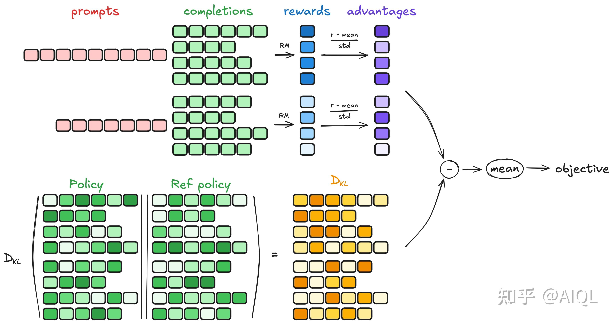
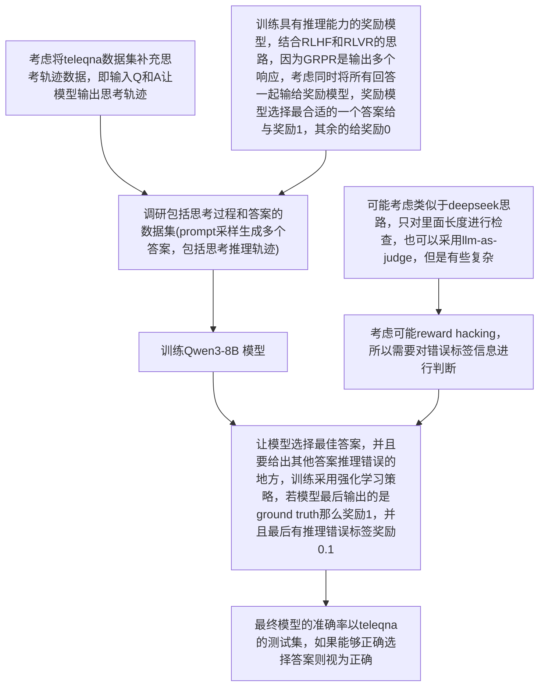

# 高质量奖励模型生成周报一

## 一、问题描述

### 1. 目标

整个项目目标是在工程师维护基站或者其他业务场景中可能遇到的问题，希望能够通过询问大模型来得到一个较好的处理办法，该 agent 需要具备 tool calling 的能力，也就是奖励模型的设计还需要考虑 tool calling 的合理性

### 2. 数据集

telemath、TeleQA、τ2Telecom

telemath 是数学问题，可以考虑用它进行微调来提高模型的推理能力

TeleQnA 是选择题，可以考虑转换为简单题，或者可以利用选择题形成的偏好对进行 RLHF 训练

τ2Telecom 是工具调用相关，这个数据集在本项目设计中可以重点考虑

### 3. 评价指标

奖励模型评判准确率，设计思路目前还未想好，因为如果是输出 0  或者 1，那么可以考虑评测，但是如果输出的是一个范围，那我觉得有些难

或者是考虑能不能直接根据奖励模型用强化学习训练大模型，根据测试集去测，但是这样不确定算力是否足够

### 二、调研

后训练（post training）主要有几种

* SFT 监督微调，利用监督学习来对模型进行微调，fine-tuning 的方法主要就是全参和lora，目前资源足够可考虑全参微调
* zero-rl，跳过冷启动阶段，直接进行强化学习训练，这种方法可能的好处是提高大模型的熵，利用熵增定律不去限制大模型的思路，但是劣势就是可能没法掌握领域的基础知识导致思考效果也不佳
* sft+rl，先进行监督学习，然后再进行强化学习，根据 deepseek-r1 的设计思路，SFT 大概数千条数据，RL 大概数十万条数据
* 蒸馏，利用大模型的输出来训练小模型，有论文表面蒸馏方法会让小模型学到推理能力

在我调研的强化学习中，奖励模型的设计主要有两种

* RLHF 基于人类反馈的强化学习，reward model 是利用偏好对来进行奖励模型的训练，这个过程通过 <x, y1, y2> 输入到奖励模型，并说明 y1 > y2 进行训练，这里面我觉得应该是隐含了逆强化学习的思路，不直接设计奖励信号，通过偏好对进行模型的微调
* RLVR 可验证奖励的强化学习，目前主流思路应该是这个，在数学，代码等有确定答案的领域发展比较好，这里不再是奖励模型而是使用奖励信号，在数学问题中奖励信号就是答案是否正确

## 三、思路

### 1. 基于 RLVR 的奖励模型设计

> 两个痛点，一个是高质量的rubrics生成与获取难，根据问题生成rubrics质量肯定不如人类专家，这里就有损失；再用rubrics和回答给裁判模型评判，裁判模型答准率也不确定，这两个问题限制了RLVR的发展

基于 RLVR 的方法，在 open-ended problem 中解决思路主要是通过设计 rubrics ，然后将问题，大模型的输出，评判标准一起发给 llm-as-judge，进行评判得到对应的奖励分数，在医疗大模型领域有几个工作就是利用这种思路进行的，比如 Baichuan-M2，InfiMed-ORBIT 两个工作都采用了该思路，结合这个我想的一个思路。

如果对于每个问题都去单独设计 rubrics 来进行训练，那么成本太高并且训练数据量有限，所以需要思考如何利用有限的 rubrics 进行训练，主要思路是通过RAG 检索增强技术，将问题和对应的 rubrics 放入向量数据库 A，将所有的 rubrics 放入数据库 B，然后对于一个 problem 去两个向量数据库进行相似性搜索，找到后，把问题和两个数据库中检索到的数据输入给一个 生成模型 让它生成一些 rubrics，之后在进行合理性判断去除被命中次数太低或者太高的 rubrics

得到 rubrics 后，发给 llm-as-judge，进行评分

这个方法主要有三点设计需要仔细思考

1. 向量知识库的设计，可以考虑直接用开源的一些比如 milvus，但是检索，重排之类的设计是否需要还未确定
2. rubrics 生成模型，需要设计合适的提示词，考虑先用 telemath 进行微调让模型掌握些领域的知识，然后在这基础上生成 rubrics，数据集用 TeleQnA 形成的
3. 裁判模型设计，我认为需要监督微调，将问题，llm 的回答，rubrics，还有人类根据 rubrics 对答案的评分一起给大模型，进行训练后再去打分

这个方法需要很多专业领域的专家，比如 一些基础的 rubrics 的设计，已经裁判模型的标签，目前提供的开源数据集暂时未具备这些能力，目前考虑放弃

### 2. 基于 RLHF 的奖励模型设计

> 暂时放弃

因为 TeleQnA 是选择题，所以就有偏好对，可以直接用来训练奖励模型，这种思路可以作为对比模型去比较，或者作为其中一个方法

### 3. 逆强化学习

#### 3.1 对抗逆强化学习

> 这里有个问题，奖励模型在对抗学习中应该是作为评判器存在的，这个应该要和生成器一起训练，不能单独训练鉴别器吧

#### 3.2 字节论文 REER	

> 也不是直接训练奖励模型

转换为一个搜索问题

### 4. unsupervised rl

> 无监督强化学习，利用模型自身的性能

可以考虑只给问题不给标注，来进行训练，主要是模型自身的能力，从一致性，自信度等几个方面进行评估，奖励信号用这几个评判标准 

## 四、实验

### 1. 基座性能评估

使用 Qwen-3-base-32B ，利用几个数据集看一下准确率

### 2. 数据蒸馏

> 这个可以做吗？因为 gemini-3-pro 的 api key 应该需要有不少的开销才能形成数据集

使用一些 sota 模型（还未调研，考虑使用 Gemini-3）的api 获得思考路径，然后去蒸馏 Qwen 模型看看效果 （不是传统软标签蒸馏，基本就是 SFT 的思路）

### 3. 使用 RLHF 训练奖励模型

用 TeleQnA 形成的偏好对去训练

## 五、问题

### 1. 开放领域问题的准确性如何评估？评价标准

> 需要调研

调研发现，现在大多benchmark为确定答案或者选择题，可以直接评测

对于无法直接评测的文本生成题，评测标准多为找一个模型作为裁判模型评测

  

# 高质量奖励模型生成周报二


# 高质量奖励模型生成周报四

## 一、论文

### 1. DeepSeek-GRM

### 2. On-Policy Distillation

https://thinkingmachines.ai/blog/on-policy-distillation/

### 3. RM-R1

## 二、实验

### 1. 测试DeepSeek-GRM-27B效果

以下面的题目为例

```
What is the typical coverage range of LPWANs (Low-Power Wide Area Networks) in urban areas?
	

[
"A few meters",
"2-5 km",
"10-15 km",
"50-100 km"
]

ground_truth:2-5km
```

下面是四个回答一起送进去时的答案

```
Specific standards: IEEE 802.11ah, LoRaWAN, and Sigfox  
    Analysis: IEEE 802.11ah is not relevant to LPWANs. LoRaWAN and Sigfox are two widely used LPWAN technologies, with typical urban coverage ranges of 2-5 km for LoRaWAN and 3-10 km for Sigfox. Response 1 is incorrect as it describes a range far below realistic urban coverage for any LPWAN. Response 2 accurately reflects the coverage range for LoRaWAN in urban areas. Response 3 slightly overestimates the range but is still within the ballpark for Sigfox. Response 4 significantly overestimates the coverage range, which is not typical for LPWANs in urban settings.  
    Score: \boxed{2, 9, 7, 4}
[2.0, 9.0, 7.0, 4.0]
```

如果分开打分，可以看出效果很差，它偏向于对内容完整性等打分，而不是真的准确性

1. 当输入下面时

```
What is the typical coverage range of LPWANs (Low-Power Wide Area Networks) in urban areas?
	

[
"2-5 km"
]

```

```
Analysis: Response 1 provides a specific numeric range for the typical coverage of LPWANs in urban areas, which aligns with 3GPP standards for LPWANs. The range of 2-5 km is consistent with the understanding that LPWANs are designed for long-range communication, often extending beyond typical cellular coverage. This response is highly relevant and practical, as it directly answers the question without unnecessary details.
Score: \boxed{9, 9}
[9.0, 9.0]
```

2. 

```
What is the typical coverage range of LPWANs (Low-Power Wide Area Networks) in urban areas?
	

[
"10-15 km"
]
```

```
Specific standards: 
    - ITU-T Recommendation I.580-1995 for LPWAN characteristics
    - IEEE 802.11 standards for wireless communication
    - 3GPP standards for cellular networks

    Analysis: 
    - Adherence to Instructions: Response 1 provides a specific numerical range (6-10 km), which is a direct answer to the question about the typical coverage range of LPWANs in urban areas. This response fully adheres to the instructions.
    - Practicality: The response is highly practical as it directly addresses the query with a precise and accurate range, which is useful for planning and deployment purposes in urban settings.
    - Relevance: The response is highly relevant as it focuses on the specific topic of LPWAN coverage in urban areas, without any off-topic information.

    Score: \boxed{10, 10}
[10.0, 10.0]
```

## 三、思路



现在 GRPO 算法对一个 prompt 会生成多个回复，一般是5，15附近，我这里准备采用4-5

* RLHF 算法是通过偏好对来训练奖励模型，是利用监督微调的策略，但是 SFT 好像更侧重于学到表面信息，即完整性，回答的风格是否友好，而不是正确性分析，即不会主动思考为什么错误，为什么正确

* RLVR 算法对规则要求很高，需要制定规则，这个阻碍了泛化能力
* PRM 方法对数据标注要求太高，但是其对思考轨迹的研究可以借鉴

结合 RLHF 和 RLVR 算法，将 rollout 生成的多个回答一起输入给奖励模型，然后我们用 RLVR 的方法去作为奖励信号进行强化学习，这里的核心思路是考虑模型生成多条轨迹之间的关联性信息，而且我认为选择会比单独的分析效果好

我们需要的数据集是 问题，模型生成的回复（包括推理轨迹），以及正确的回复编号（但是考虑在实际过程中，可能多个回复都是正确的，因此 TeleQnA 数据集要考虑如何扩充）组成的

训练策略就是通过设计提示词 （参考论文RM-R1），然后让大模型选择正确的回复，并且要给出错误回复的问题，目前思考的奖励RM的策略是选择的回复是正确的就奖励1分，能够给出错误回复的问题每个奖励0.1分（如何审查目前尚未确定），我们希望奖励模型不仅能够确定正确的回复，并且能够给出错误回复的理由

最终在基座模型训练的时候，我们可以利用 GRPO 天然的多 rollout 能力去产生多个回复，然后输入给奖励模型，奖励模型会给出正确答案的编号，奖励1分，剩余奖励0分，因为其优势计算就是归一化过程，所以我认为可以采用

对于奖励模型的评估，我们采用测试集的方法，对于输入序列，能够选择正确答案那么就认为奖励模型是正确的



## 四、问题

### 1. 数据集构建

目前用 Qwen3-8B，但是数据中存在推理轨迹有问题，即如果答案错误，那么思考轨迹生成的质量不高，不太符合实际模型生成情况，但是思考轨迹质量不高能不能作为训练的一部分

考虑选择 Qwen3-8B 回答错的问题，然后让它生成这个问题的思考轨迹，然后用教师模型比如 gemini 来生成正确的思考轨迹，需要 gemini api，这样就有正确的思考轨迹和错误的思考轨迹

```
选项 1：指示 QoS 要求

<think>在电信中，尤其是处理 5G 新无线（NR）侧链增强时，了解特定组件的作用至关重要。问题询问的是 IUC 在这个背景下的作用。为了解决这个问题，我首先需要回顾一下 IUC 代表什么，并了解它在 NR 侧链中的相关性。

IUC 很可能指的是与质量服务（QoS）相关的术语，在侧链通信中非常重要，侧链通信用于设备间的直接通信（设备到设备 D2D），而不通过基站。在 Release 17 中，侧链的增强集中在提高可靠性、降低延迟以及支持更多的用例，例如车联网（V2X）和工业应用。

考虑到在这些场景中的 QoS 作用，确保不同类型的流量（如安全关键消息或多媒体流）得到适当的处理非常重要。这让我想到了如何在侧链通信中传达和管理 QoS 要求。

在 3GPP 标准中，QoS 通常通过诸如 QoS 流标识符（QFI）和 QoS 类别标识符（QCI）等参数进行定义。然而，问题中专门提到了 IUC。IUC 可能是一个框架的一部分，允许设备向网络中的其他设备传达其 QoS 需求。这对于管理资源并确保通信达到所需的性能水平至关重要。

考虑到 Release 17 中的增强，侧链支持更复杂的 QoS 机制，包括基于 QoS 的调度和资源分配。IUC 在这种情况下，可能是一个机制或参数，用于传递设备的 QoS 要求，使得其他设备能够更高效和可靠地进行通信。

通过考虑侧链中对 QoS 的需求以及 Release 17 引入的增强，显然 IUC 的作用是指示设备的 QoS 要求。这将允许侧链网络中的其他设备根据需要优先处理和管理资源，从而确保通信达到必要的性能标准。这一逻辑推理导致的结论是，IUC 在 NR Sidelink 增强中的作用是指示 QoS 要求。</think>
<answer>指示 QoS 要求</answer>

选项 2：启用设备间协调

<think>好吧，我需要弄清楚 IUC 在 NR Sidelink 增强中的作用，特别是根据 3GPP Release 17。让我首先回忆一下我对 NR Sidelink 的了解。侧链是 NR 中的一项功能，允许设备直接相互通信，而不需要通过基站，对吧？这对于车联网（V2X）或物联网（IoT）等需要直接通信的应用非常有用。

现在，问题是关于 IUC 的。我记得在 3GPP 标准中，涉及侧链通信的有各种组件和协议。IUC 可能是与用户设备（UE）之间的协调相关的某个术语。让我想一想侧链中的挑战。由于设备之间直接通信，如果多个 UE 同时传输，可能会有干扰问题。这可能就是为什么协调很重要的原因。

在 Release 16 中，侧链有一些增强，但问题是关于 Release 17。所以我应该检查一下 Release 17 中与侧链相关的新功能。也许 IUC 是这些增强的一部分。IUC 可能是设备间协调（Inter-UE Coordination）的意思。这很有道理，因为在 UE 之间进行协调有助于管理干扰并提高侧链通信的效率。

等等，协调在这个背景下是怎么工作的？如果多个 UE 使用相同的频段，它们需要协调它们的传输时间或功率水平，以避免冲突。这种协调可以通过一种协议来完成，允许 UE 交换它们的传输计划。IUC 可能是启用这种协调的机制。

另外，在某些场景下，比如车联网（V2X）通信，避免冲突对安全至关重要。因此，UE 可以协调其传输的系统是必不可少的。这与 IUC 是设备间协调的想法一致。

我还应该考虑侧链通信的结构。侧链有不同的模式，如点对点、点对多和多对多。在多对多场景中，协调变得更加复杂，因为多个 UE 同时在传输。IUC 会帮助通过允许 UE 协商传输参数来管理这一点。

另一个角度是控制通道的使用。在侧链中，有控制通道用于管理 UE 之间的通信。IUC 可能是这些控制机制的一部分，使 UE 能够交换它们的传输时间表或资源分配。这有助于减少干扰并确保</think>
<answer>启用设备间协调</answer>

选项 3：支持节能

<think>好吧，我需要弄清楚 IUC 在 NR Sidelink 增强中的作用，特别是根据 3GPP Release 17。让我首先回忆一下我对 NR Sidelink 的了解。侧链是 NR 中的一项功能，允许设备直接相互通信，而不需要通过基站，对吧？这对于车联网（V2X）或机器对机器（M2M）通信等应用非常有用。

现在，问题是关于 IUC 的。我UC 在电信中的含义可能是与通信协议或网络功能相关的某个缩写。既然问题提到的是 3GPP Release 17，我应该考虑 Release 17 中引入的与侧链相关的新功能或增强。

我记得侧链通信有各种组件，如发现、资源分配和安全性。但是问题特别提到 IUC。让我想一想 IUC 可能的含义。在电信中，术语如“空闲”或“上行链路”可能与之相关。等等，IUC 可能代表“空闲上行通信”或类似的意思。但我不确定。也许它与电源管理有关？因为在无线通信中，电池寿命有限的设备需要高效运行，节能是一个常见的问题。

回顾 3GPP Release 17，我记得侧链有针对提高效率和性能的增强。侧链中的一个关键领域是管理电源消耗，尤其是对于处于空闲模式或电池寿命有限的设备。如果 IUC 与空闲模式或上行链路通信相关，那么它可能是在这些状态下优化电源使用。

另一个角度是，在侧链中，设备需要管理它们的传输功率，以避免干扰并节省能量。如果 IUC 是一个有助于这一点的功能，那么它可能是关于减少设备在未积极传输或接收数据时的功耗。也许它允许设备在不需要时进入低功耗状态，从而节省能量。

我还应该考虑侧链通信的结构。侧链有不同的阶段，如发现、建立和数据传输。节能在空闲阶段或设备不活跃时尤为重要。如果 IUC 是管理这些状态的协议的一部分，那么它的作用将与节能相一致。

此外，在 3GPP 规格中，节能机制通常与某些特性相关</think>
<answer>支持节能</answer>

选项 4：提供中继选择

<think>好吧，我需要弄清楚 IUC 在 NR Sidelink 增强中的作用，特别是根据 3GPP Release 17。让我首先回忆一下我对 NR Sidelink 的了解。侧链是 5G 中的一项功能，允许设备直接相互通信，而不需要通过基站，对吧？这对于车联网（V2X）通信或物联网（IoT）等需要设备到设备（D2D）连接的场景非常有用。

现在，问题是关于 IUC 的。我记得在 3GPP 标准中，缩写通常代表某些特定的术语。IUC 可能是与某个过程或功能相关的缩写。让我想想 NR Sidelink 的组成部分。侧链有不同的方面，如发现、资源分配和中继功能。

等等，在 Release 17 中，侧链有增强，特别是针对 URLLC（超可靠低延迟通信）和增强的 MTC（机器类型通信）用例。一个关键的改进领域是中继功能。中继可以通过转发数据来帮助扩展覆盖范围并提高可靠性。所以，也许 IUC 与如何选择或管理中继有关。

让我检查一下 IUC 代表什么。IUC 可能是“用户间通信”或“用户间协调”的意思。但这似乎太宽泛了。另一种可能性是“用户间通道”或“用户间控制”。等等，在侧链的背景下，有一个叫做“中继选择”的概念，即选择最佳的中继节点来转发数据。如果 IUC 是该过程的一部分，那么它的作用可能是促进选择最佳的中继。

看一下 Release 17 中的增强，侧链通信的效率和可靠性得到了提高。中继选择是这一改进的关键，因为它确保数据通过最有效的路径传输。如果 IUC 参与其中，那么它的作用就是提供中继选择。

我还应该考虑侧链通信的结构。侧链有不同的模式，如直接通信和中继通信。在中继模式下，设备可以充当中继，转发数据到另一个设备。选择哪个设备充当中继对性能至关重要。如果 IUC 是帮助选择最佳中继的机制，那么这与答案中提到的作用一致。</think>
<answer>提供中继选择</answer>

选项 5：处理网络授权

<think>在电信中，特别是在 3GPP Release 17 中定义的 5G 新无线（NR）侧链增强中，理解特定组件的作用对于确保安全高效的通信至关重要。问题询问的是 IUC 在此背景下的作用。

首先，我需要回忆一下 IUC 代表什么。在 5G 和 NR 的领域中，IUC 很可能是与某个特定功能或协议相关的缩写。鉴于提到侧链增强，我应该专注于不经过中心网络节点而发生的直接设备到设备（D2D）通信方面。侧链通信对于车联网（V2X）、物联网（IoT）等需要设备直接交互的场景非常重要。

接下来，我考虑 NR 侧链中涉及的各种组件和协议。这些包括与发现、资源分配、安全性和授权相关的功能。由于问题专门提到了“网络授权”，我应该考虑网络如何与或授权侧链通信。在传统的蜂窝网络中，设备需要网络授权才能访问服务，但在侧链中，设备间的直接通信是常态。然而，在某些场景中，网络的参与可能仍然是必要的，特别是出于安全或监管的原因。

现在，我考虑 IUC 这个特定术语。在 3GPP Release 17 中，侧链增强的引入包括允许更安全高效的直接通信的功能。一个关键方面是确保只有授权的设备可以参与侧链通信。这让我想到了网络授权的概念。如果 IUC 与此相关，它很可能代表像“用户间通信”或类似的术语，涉及以需要网络监督的方式管理设备之间的通信。

我还考虑侧链中的安全性更广泛的背景。尽管侧链通信是直接的，但仍然存在对未经授权的访问、干扰和确保只有合法设备进行通信的担忧。这让我想到网络实体在授权这些通信中的作用。如果 IUC 是这一过程的一部分，它将负责在设备可以参与侧链通信之前验证设备的合法性。

此外，我记得在 3GPP Release 17 中，侧链的增强包括使用身份验证和授权机制。这些机制对于保持侧链通信的完整性和机密性至关重要。如果 IUC 参与其中</think>
<answer>处理网络授权</answer>
```


### 2. 训练方法选择

是选择监督微调 SFT ，还是离线强化学习

如果选择监督微调，就是把问题和几个答案一起输入给奖励模型，标签就是正确答案是1，其他是0

如果选择离线强化学习，输入相同，但是训练奖励模型的奖励选择RLVR方法，即给与正确答案奖励为1的时候奖励这个奖励模型1分，并且可能会加一些其他的额外奖励，比如发现其他推理轨迹的问题，但是这个暂时不知道怎么验证

选择这两个数据量分别是多少

### 3. 模型选择

模型是选 Base 还是 Instruct 模型，Instruct一般不生成 `<think>` 标签，能不能有思考轨迹

因为我觉得对于这种领域内的知识问答，答案不是特别能训练，需要看下中间的思考轨迹

或者直接选择一些已经训练好的 RM

# 高质量奖励模型生成周报五

## 一、论文

## 二、实验

### 1. qwen3-8b 基础测试

```
query = "What are the limitations of energy harvesting from natural sources?"
```

no-thinking 模式

```
Energy harvesting from natural sources, such as solar, wind, thermal, and kinetic energy, is a promising approach for sustainable power generation. However, it comes with several limitations. Here are the key limitations:

### 1. **Intermittency and Unpredictability**
- **Solar and wind energy** are dependent on weather conditions and time of day.
- Energy production can vary significantly, making it difficult to provide a consistent and reliable power supply.
- This variability can lead to challenges in grid stability and energy storage requirements.

### 2. **Geographical and Environmental Constraints**
- **Location-dependent** – Solar panels work best in sunny regions, and wind turbines require consistent wind speeds.
- Some areas may not be suitable for certain types of energy harvesting due to lack of natural resources or environmental conditions.

### 3. **High Initial Costs and Maintenance**
- The initial investment for installing energy harvesting systems (e.g., solar panels, wind turbines) can be high.
- These systems require regular maintenance, which adds to long-term costs and reduces overall efficiency.

### 4. **Energy Conversion Efficiency**
- The efficiency of converting natural energy into usable electricity is typically lower than 100%.
- For example, solar panels have an average efficiency of 15–22%, and wind turbines typically range from 30–50% efficiency.
- These losses reduce the overall effectiveness of energy harvesting.

### 5. **Space Requirements**
- Energy harvesting systems often require significant physical space.
- For example, large wind farms or solar farms need vast areas, which may not be available in densely populated regions.

### 6. **Weather and Climate Impact**
- Extreme weather conditions such as storms, heavy rain, or snow can damage or reduce the efficiency of energy harvesting systems.
- Climate change can also affect the availability and reliability of natural energy sources.

### 7. **Energy Storage Challenges**
- Energy harvested from natural sources is often not available on demand.
- Efficient and cost-effective energy storage solutions (like batteries) are needed to store excess energy, but they are still expensive and have their own environmental impacts.

### 8. **Environmental and Ecological Impact**
- While energy harvesting is generally considered cleaner than fossil fuels, it can still have environmental impacts.
- For example, wind turbines can affect bird and bat populations, and large solar farms can impact local ecosystems.

### 9. **Technological Limitations**
- Some natural energy sources (e.g., thermal or kinetic) are not yet efficiently harnessed due to technological constraints.
- Research and development are ongoing to improve the efficiency and scalability of these technologies.

### 10. **Regulatory and Policy Barriers**
- In some regions, there may be regulatory hurdles or lack of supportive policies that hinder the widespread adoption of natural energy harvesting.

---

### Conclusion:
While energy harvesting from natural sources is a vital part of the transition to sustainable energy, it faces several limitations that must be addressed through technological innovation, policy support, and efficient energy management systems.
```

thinkink 模式

```
------------------------------ Input ------------------------------
What are the limitations of energy harvesting from natural sources?
------------------------------ Qwen3 Output ------------------------------
<think>
Okay, so I need to figure out the limitations of energy harvesting from natural sources. Let me start by recalling what I know about energy harvesting. Energy harvesting, or scavenging, is the process of capturing and converting ambient energy from the environment into usable electrical energy. Common natural sources include solar, wind, thermal, kinetic, and even radio waves.

First, I should think about each of these sources and their specific limitations. Let's take solar energy first. The main issues with solar are things like weather dependence—cloudy days or nighttime mean no energy. Also, the efficiency of solar panels is limited; even the best ones might only convert around 20% of sunlight into electricity. Then there's the issue of space required. Large solar farms need a lot of land, which might not be feasible in urban areas. Plus, manufacturing solar panels has environmental impacts, like the use of toxic materials and energy-intensive processes.

Next, wind energy. Wind turbines depend on consistent wind speeds. If the wind is too low or too high, they can't generate much power. Also, wind is intermittent, so energy storage is needed, which adds cost and complexity. There are also environmental concerns like noise, visual impact, and effects on wildlife, especially birds and bats. Location is another factor—wind farms need to be in areas with consistent wind, which might be remote or require long transmission lines.

Thermal energy harvesting, like geothermal, depends on the availability of heat sources. Not all regions have accessible geothermal resources, and drilling can be expensive and risky. Also, geothermal plants might have emissions if not properly managed, and there's the risk of subsurface instability.

Kinetic energy harvesting, such as from vibrations or human movement, usually produces very low power. It's not practical for large-scale use and might require a lot of sensors or devices to collect enough energy. Plus, the efficiency here is low, and it's hard to maintain consistent energy flow.

Radio frequency (RF) energy harvesting is another area. It captures energy from wireless signals, but the power levels are very low, so it's not suitable for high-power applications. There's also the issue of interference with existing communication systems and the need for specialized receivers.

Other limitations might include technological challenges, like the efficiency of the conversion processes, which are still not perfect. The cost of materials and maintenance can be high. Additionally, energy harvesting systems might not be reliable in all environments, and they might require backup power sources. There's also the issue of scalability—some methods are good for small devices but not for large-scale power generation.

Wait, are there any other sources? Maybe hydroelectric, but that's more of a traditional method. Maybe also piezoelectric or thermoelectric generators. Those might have their own limitations, like low efficiency or material degradation over time.

I should also consider environmental and social factors. For example, solar panels and wind turbines can have land use conflicts, and there might be opposition from local communities. Also, the intermittent nature of some sources requires energy storage solutions, which have their own limitations in terms of cost, lifespan, and environmental impact.

Another point is that energy harvesting from natural sources might not be sufficient on its own to meet all energy demands, especially for large-scale applications. It's often used in conjunction with other energy sources or as a supplement to reduce reliance on fossil fuels.

I need to make sure I cover the main points without getting too detailed. Maybe list the limitations under different categories: environmental factors, technological constraints, economic factors, and reliability issues. Also, mention specific examples for each limitation to make it clearer.
</think>

Energy harvesting from natural sources, while promising for sustainable energy, faces several limitations across environmental, technological, economic, and reliability dimensions. Here's a structured overview of the key challenges:

### 1. **Environmental and Natural Constraints**
   - **Intermittency and Unpredictability**: 
     - Solar and wind energy depend on weather conditions (e.g., cloud cover, wind speed), leading to inconsistent power generation.
     - Geothermal and hydro sources are location-specific and may not be viable in all regions.
   - **Low Energy Density**: 
     - Sources like kinetic or RF energy harvesters produce minimal power, requiring extensive infrastructure to collect usable energy.
     - Thermal gradients (e.g., thermoelectric generators) often yield low efficiency due to small temperature differences.
   - **Resource Availability**: 
     - Geothermal and hydroelectric resources are limited to specific geographic areas, necessitating costly infrastructure (e.g., drilling, dams).

### 2. **Technological Limitations**
   - **Conversion Efficiency**: 
     - Solar panels typically convert only 15–22% of sunlight to electricity, while wind turbines achieve 30–50% efficiency, leaving significant energy unutilized.
     - Kinetic and RF harvesting suffer from low efficiency due to material and design constraints.
   - **Material and Design Challenges**: 
     - Degradation of materials (e.g., solar panel degradation over time) reduces long-term performance.
     - Piezoelectric and thermoelectric devices face limitations in scalability and durability.

### 3. **Economic and Practical Factors**
   - **High Initial Costs**: 
     - Manufacturing and installing energy harvesting systems (e.g., solar panels, wind turbines) require significant investment.
     - Maintenance and replacement costs add to long-term expenses.
   - **Storage and Grid Integration**: 
     - Intermittent sources require costly energy storage solutions (e.g., batteries) or grid upgrades to balance supply and demand.
     - Retrofitting existing infrastructure for decentralized harvesting systems can be complex and expensive.

### 4. **Environmental and Social Impact**
   - **Ecological Disruption**: 
     - Wind turbines and solar farms may disrupt local ecosystems, while geothermal drilling risks subsurface instability.
     - Large-scale projects can lead to habitat loss or pollution (e.g., toxic materials in solar panel production).
   - **Community Opposition**: 
     - Aesthetic concerns (e.g., wind turbines) or noise pollution may lead to public resistance.
     - Land use conflicts arise between energy projects and agricultural or residential areas.

### 5. **Scalability and Reliability**
   - **Limited Scalability**: 
     - Small-scale applications (e.g., IoT devices) are more feasible, but large-scale adoption remains challenging due to technical and economic barriers.
   - **Dependence on Backup Systems**: 
     - Energy harvesting alone cannot replace traditional grids, necessitating hybrid systems with backup power sources.

### 6. **Regulatory and Interference Issues**
   - **RF Energy Harvesting**: 
     - Potential interference with communication systems and regulatory hurdles for deploying RF harvesting devices.
   - **Policy and Standards**: 
     - Lack of standardized regulations for energy harvesting technologies can hinder widespread adoption.

### Conclusion
While energy harvesting from natural sources offers a sustainable alternative, its limitations highlight the need for complementary technologies (e.g., storage, smart grids) and careful planning to address environmental, economic, and technical challenges. Innovations in materials, efficiency, and integration strategies are critical to overcoming these barriers.
```

### 2. qwen3-8b 奖励模型测试

多个答案

输入

```
question_content = "What does a correlator do in direct-sequence transmission?"

candidate_answers = [
    "Applies spreading to the RF carrier",
    "Flattens the amplitude of the signal",
    "Recovers the original signal from the spread RF carrier",
    "Spreads out noise across the frequency band",
    "Monitors the wide frequency band for changes"
]
```

输出正确

````python
Evaluating answers (Judge Mode)...
======================================== Model Evaluation ========================================
<think>
Okay, let's tackle this question about what a correlator does in direct-sequence transmission. First, I need to recall what I know about direct-sequence spread spectrum (DSSS) systems. 

In DSSS, the data signal is modulated with a pseudo-random noise (PN) code, which spreads the signal over a wider bandwidth. This process is called spreading. The correlator's role is crucial here. When the receiver gets the spread signal, it needs to reverse the spreading process to recover the original data. 

So, the correlator essentially correlates the received signal with the same PN code used during transmission. This correlation process helps in despreading the signal, which means it narrows the bandwidth back to the original data rate. 

Now, looking at the options:

Option 1: Applies spreading to the RF carrier. Wait, that sounds like the spreading process, which is done by the transmitter, not the correlator. The correlator is part of the receiver, so this might be incorrect. 

Option 2: Flattens the amplitude of the signal. I don't recall anything about amplitude flattening in correlators. Maybe this is a distractor. 

Option 3: Recovers the original signal from the spread RF carrier. This aligns with what I thought earlier. The correlator's main job is to despread the signal and recover the original data. So this seems correct.

Option 4: Spreads out noise across the frequency band. Hmm, spreading noise might be a result of the spreading process, but the correlator's role is more about despeading. However, I'm not sure if this is a direct function of the correlator. Maybe this is a trick option. 

Option 5: Monitors the wide frequency band for changes. That sounds more like a function of a spectrum analyzer or a detector, not specifically the correlator. 

Now, Phase 2: Relational Cross-Examination. If Option 3 is correct (Ground Truth), then the others need to be checked against it. 

Option 1 is about spreading, which is the opposite of what the correlator does. So if the correlator is for despreading, then Option 1 is wrong. 

Option 2's amplitude flattening doesn't seem related. 

Option 4: Spreading noise might be a side effect, but the correlator's main role isn't to spread noise. The spreading is done by the transmitter. So Option 4 is incorrect. 

Option 5's monitoring function isn't the correlator's primary role. 

So, the only correct answer is Option 3. The others are incorrect based on the Ground Truth of Option 3. Therefore, the scores should be 1 for Option 3 and 0 for the rest.
</think>

```json
{
  "scores": {
    "Option 1": 0,
    "Option 2": 0,
    "Option 3": 1,
    "Option 4": 0,
    "Option 5": 0
  }
}
```
````


## 三、思路

### 1. 提示词设计

让模型先对单个回复进行打分，然后再去用他们之间的关系优化评分

> 多个不同的回复（即使它们基于同一问题生成）提供了不同的思考角度和推理过程。奖励模型可以通过对比这些回复，得到更多的信息，从而减少误判的概率。例如，如果一个回复明显不符合事实，而其他几个回复接近正确，奖励模型就能根据对比分析做出更合理的判断。
>
> 奖励模型可能会过于依赖于比较，而忽视了每个回答的独立质量。如果奖励模型主要基于多个回答之间的相对表现来做出判断，而没有足够的能力去评估每个回复的内在质量和正确性，它可能会导致过拟合，特别是在生成的回复质量参差不齐的情况下。例如，如果某些回答包含了非常模糊的内容，奖励模型可能就会错误地认为它们是“正确”的，因为它们符合其他更强的回答的模式。

这是一个非常具体且关键的数据构建问题。你现在的 JSON 数据结构是标准的“评测集格式”（Inputs + Ground Truth Label），但它还不是“SFT 训练数据格式”。

要在 SFT 中训练一个 **Generative Reward Model (GenRM)**，你需要将这个 JSON 转换为 **Prompt (输入)** + **Response (输出标签)** 的对子。

鉴于你的目标是让 RM **“判别多个正确答案”**（即 Listwise 打分，输出可能是一个类似 [1, 0, 0, 1, 0] 的判别结果），并且要有理由，我建议按照以下步骤进行数据构建。

------

### 2. 数据集构建

#### 第一步：理解数据缺口（Critical Gap）

目前只有：

- **输入材料**：问题 + 5个带思维链的选项。
- **最终裁判**："answer": "option 1"（Ground Truth）。

你缺少的是：

- **中间的分析过程（Rationale）**：即为什么 Option 1 是对的，为什么 Option 2-5 是错的。

**关键批判**：如果直接把 "option 1" 作为标签训练，RM 学不会推理。你需要用教师模型（Teacher Model）基于你的 Ground Truth，把中间的分析“补全”。

------


#### 第二步：自动化构建 SFT 数据流程

你需要写一个脚本，遍历你的 JSON 数据，调用教师模型（如 GPT-4o 或 DeepSeek-V3）来生成训练标签。

#### 1. 构造发给教师模型（Teacher）的 Prompt

我们需要让教师模型充当“数据标注员”。

**Teacher Prompt 模板：**

 code Text

downloadcontent_copy

expand_less


```
    你是一个通信领域的专家判题人。
我会给你一个问题、5个候选回复（包含思维链）以及标准答案的编号。
请你完成以下任务：
1. 仔细阅读问题和每一个候选回复。
2. 对照标准答案，分析每个回复的正确性。注意：即使某个回复不是标准答案选定的那个选项，如果它在逻辑和事实层面也是完全正确的，也应被判定为正确（这种情况较少，但需注意）。
3. 生成一段详细的点评，指出每个回复的优缺点。
4. 最后输出一个判别列表，格式为 JSON。

输入数据：
问题：{question}
标准答案指向：{answer_key} (内容是: {answer_text})

候选回复：
[回复1]: {option_1_content}
[回复2]: {option_2_content}
[回复3]: {option_3_content}
[回复4]: {option_4_content}
[回复5]: {option_5_content}

请输出分析（Analysis）和最终判定（Verdict）。
  
```

#### 2. 教师模型生成的输出（这就是你的 SFT Target）

教师模型会吐出类似这样的文本（这也是你未来 RM 应该学会输出的样子）：

 code Text

downloadcontent_copy

expand_less


```
    <analysis>
问题询问自然源能量收集的局限性。
- 回复1：指出了自然源的间歇性和不可控性（intermittent and uncontrollable），这与通信系统中对稳定电源的需求冲突，符合标准答案的逻辑。推理过程清晰。
- 回复2：讨论了电磁干扰问题。虽然这可能是个问题，但不是能量收集本身的“主要技术局限性”，属于答非所问。
- 回复3：讨论了成本和实现难度。这也是局限性之一，但在TeleQnA的标准语境下，间歇性是更本质的物理限制。判定为错误。
- 回复4：讨论了功率不足的问题。这在逻辑上是正确的，且与标准答案非常接近（能量不够支持设备）。如果有多个正确选项，此项可能也被视为正确。但在单选逻辑下，回复1的表述更贴切。
- 回复5：提到视距通信（Line-of-sight）。这是针对特定RF收集的限制，不具有普适性。
</analysis>

<verdict>
{"1": 1, "2": 0, "3": 0, "4": 0, "5": 0}
</verdict>
  
```

*(注意：在这一步，你可以人工或者用规则去检查 Teacher 的输出。比如你的 Ground Truth 说是 Option 1，如果 Teacher 说 1 和 4 都对，你可以决定是否保留这个多义性，这正是你想要的“判别多个正确答案”的能力。)*

------


#### 第三步：组装最终的 RM 训练数据

现在你有了 Input 和 Target，可以构建最终的 JSONL 数据用于 SFT 训练了。

**训练样本格式建议：**

**Input (Prompt):**

 code Text

downloadcontent_copy

expand_less


```
    <system>You are a helpful assistant acting as a Reward Model.</system>
<user>
Question: What are the limitations of energy harvesting from natural sources?

Option 1:
<think>Energy harvesting from natural sources relies on ambient inputs...</think>
<answer>Natural energy sources are intermittent and uncontrollable.</answer>

Option 2:
... (此处填入 Option 2 内容)

...

Option 5:
... (此处填入 Option 5 内容)

Please analyze the above options and identify which ones are correct.
</user>
  
```

**Output (Completion / Label):**

 code Text

downloadcontent_copy

expand_less


```
    <assistant>
Analysis:
1. Option 1 identifies the intermittent nature of natural sources... [Correct]
2. Option 2 focuses on interference... [Incorrect]
...

Verdict:
Option 1: Correct
Option 2: Incorrect
Option 3: Incorrect
Option 4: Incorrect
Option 5: Incorrect
</assistant>
  
```

------


#### 第四步：关键的数据增强策略（Data Augmentation）

为了防止模型过拟合位置（例如总认为 Option 1 是对的），你必须在构建数据时做 **Shuffle（打乱顺序）**。

在生成每一条训练数据时：

1. 
2. 读取原始 JSON 的 option 1 到 option 5。
3. **随机打乱它们的顺序**。例如，原来的 Option 1 变成了现在的位置 3。
4. 同时更新 Ground Truth。如果原来的答案是 Option 1，现在正确答案就是“位置 3”。
5. 将打乱后的文本填入 Input Prompt。
6. 让教师模型基于打乱后的顺序生成 Analysis 和 Verdict。

------


#### 针对你“判别多个正确答案”需求的特别建议

在你的原始数据中，"answer": "option 1" 暗示了这是单选题。但是在 GRPO 的训练过程中（Rollout 阶段），模型生成的 5 个回复可能：

- 
- 有两个回复完全一样（都对）。
- 有两个回复措辞不同，但意思都对。
- 全都错了。

**因此，你的 RM 训练集必须包含这些情况！** 不能只用原始的 TeleQnA 数据（它太完美了，总是1对4错）。

**如何构造“非完美”数据？**
利用你的 Teacher 模型进行 **Data Synthesis（数据合成）**：

1. 
2. **全对情况**：把 Option 1 （正确答案）复制一份，稍微改写几个词，替换掉 Option 2。现在 Option 1 和 Option 2 都是对的。训练你的 RM 识别出 {1: 1, 2: 1, 3: 0...}。
3. **全错情况**：把 Option 1 删掉，用一个错误的 Option 6 填补进来。训练你的 RM 输出 {1: 0, 2: 0, 3: 0...}。

#### 总结

你的数据构建流程应该是：

1. 
2. **Raw JSON** (Q, 5 Options, GT)
3. **Augmentation** (随机打乱顺序，随机替换选项制造多对/全错样本)
4. **Teacher Annotation** (将处理后的 Inputs + GT 发给 GPT-4，让它写 Analysis 和 Verdict)
5. **Final Formatting** (转为 SFT 的 User/Assistant 对话格式)
6. **Training** (使用 Cross-Entropy Loss 训练 RM)

这样训练出来的 RM，在推理时输入 5 个 GRPO 采样结果，就能输出一段分析，并给出一个类似 [1, 0, 0, 1, 0] 的打分向量，完美符合你的需求。


****
